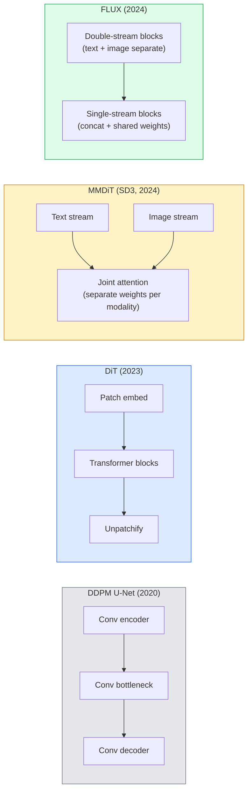

# محولات التفريق وتدفق المصلح

> إن شبكة U-Net ليست سر التوزيع، قم بتبديلها بمحول، قم بتبديل جدول الضوضاء لتدفق خط مستقيم، ففجأة لديك SD3، FLUX، وكل نموذج من نص إلى صورة عام 2026.

**Type:** Learn + Build
**Languages:** Python
**Prerequisites:** Phase 4 Lesson 10 (Diffusion DDPM), Phase 4 Lesson 14 (ViT), Phase 7 Lesson 02 (Self-Attention)
**Time:** ~75 minutes

## أهداف التعلم

- تتبع التطور من U-Net DDPM (دروس 10) إلى محول التفريق (DiT) ، MMDiT (SD3) ، وDiT واحد + مزدوج التدفق (FLUX)
- شرح التدفق المصلح: لماذا تتيح المسار المستقيم بين الضوضاء والبيانات أنواع العينات في 20 خطوة بدلاً من 1000 خطوة
- تنفيذ حلقة تدريبية صغيرة في إطار ديت وتدريبات تدريبية مع التدفق المصلح، كلاهما تحت 100 خط
- تمييز مختلفة النموذج (SD3 ، FLUX.1-dev ، FLUX.1-schnell ، Z-Image ، Qwen-Image) حسب الهندسة المعمارية ، وعدد المعلمات ، والترخيص

## المشكلة

درس 10 قام ببناء DDPM مع مؤشر U-Net. هيمنت هذه الوصفة في 2020-2023: U-Net + جدول beta + فقدان التنبؤ بالضوضاء. أنتجت Diffusion مستقر 1.5 و 2.1 و DALL-E 2.

كل نموذج 2026 من أحدث النص إلى الصورة قد تجاوزها. لا يستخدم أي من هذه النماذج شبكة U-Net. تستخدم Transformers Diffusion (DiT). SD3 و FLUX أيضًا تبدل جدول ضوضاء DDPM لتدفق مصحوب ، مما يسهل المسار من الضوضاء إلى البيانات ويسمح بإستعمال خطوة 1-4 مع الاتساق أو المتغيرات المقطوعة.

إن التحول مهم لأنه هو السبب في أن توليد الصور القائم على التوزيع أصبح قابلاً للسيطرة ، ودقيقًا على الفور (إرسال النص الحل SD3/SD4) ، وتسريع في الإنتاج. فهم DiT + التدفق المصلح هو فهم كومة الصور التوليدية 2026 .

## المفهوم

### من شبكة الإنترنت إلى المحول



- **DiT**(بيبلز و شي ، 2023)  استبدال شبكة U-Net مع محول مثل ViT على المفاتيح الخفية. التكييف عن طريق معيار الطبقة التكيفية (AdaLN).
- **MMDiT**(SD3 ، Esser et al ، 2024)  اثنين من التيارات مع وزن منفصل لترمز النص والصورة التي تشارك اهتمامًا مشتركًا.
- **FLUX**(مختبرات الغابة السوداء ، 2024)  أول N كتلة تدفق مزدوج مثل SD3 ، وتتراكم الكتل اللاحقة وتشارك الأوزان (تدفق واحد) للافعالية في عمق أعلى.
- **Z-Image**(2025)  إدارة التكنولوجيا المثيرة لفعالية في مجال التيار الواحد عند ملامح 6B التي تحد "المقياس بأي ثمن".

### التدفق المصحّح في فقرة واحدة

تعريف DDPM العملية المقبلة كـ SDE ضوضاء حيث `x_t`والعكس المكتشف هو SDE الثاني، الذي يتم حلها بواسطة 1000 خطوة صغيرة.

تدفق المصلح يحدد **straight-line**التقاط بين البيانات النظيفة والضوضاء النظيفة:

```
x_t = (1 - t) * x_0 + t * epsilon,     t in [0, 1]
```

تدريب شبكة للتنبؤ بالسرعة`v_theta(x_t, t) = epsilon - x_0` الاتجاه الأمامي على طول المسار المستقيم من البيانات النظيفة إلى الضجيج (`dx_t/dt`أثناء أخذ العينات، تقوم بتكامل هذه السرعة إلى الوراء لتحرك من الضوضاء نحو البيانات. ODE الناتجة أقرب بكثير إلى خط مستقيم، لذلك هناك حاجة إلى أقل خطوات تكامل لعينة.

SD3 يسميها هذا**Rectified Flow Matching**. تستخدم FLUX ، Z-Image ، ومعظم نماذج 2026 نفس الهدف. الاستنتاج النموذجي: 20-30 خطوة Euler (تحديدية) مقابل 50 خطوة DDIM في النظام القديم DDPM. تغيرات مستقلية / توربو / أسرع / LCM تقل إلى 1-4 خطوات.

### تكييف الـ AdaLN

إضافة الاختبارات على خطوة زمنية ودرجة/نص عبر **adaptive layer norm**: التنبؤ`scale`و`shift`من المتجهات التكييفية وتطبيقها بعد LayerNorm. أكثر نظافة بكثير من التكيف في نمط FiLM في U-Nets والقاعدة الافتراضية في كل DiT الحديثة.

```
cond -> MLP -> (scale, shift, gate)
norm(x) * (1 + scale) + shift, then residual add * gate
```

### مبرمجي النص في SD3 و FLUX

- **SD3**يستخدم ثلاثة مُرمّحات نصية: نموذجين CLIP + T5-XXL. يتم تشبيك التوابع وتوصيلها إلى تيار الصورة كشروط نصية.
- **FLUX**يستخدم CLIP-L + T5-XXL واحد.
- **Qwen-Image / Z-Image**يستخدم المتغيرات مبرمجيات نص داخلية متوافقة مع برامج القانون الأساسية الخاصة بها.

إن مُشفّر النص هو جزء كبير من سبب سبب تفكير SD3/FLUX حول الإشارات أفضل بكثير من SD1.5، و T5-XXL وحدها هو 4.7B.

### الإرشادات الخالية من التصنيف لا تزال سارية

يتغير التدفق المصحّح العينات، وليس التشريط. التوجيهات الخالية من التصنيف (تقليل النص مع احتمال 10٪ أثناء التدريب، مزيج التنبؤات المشروطة وغير المشروطة عند الاستنتاج) تعمل بنفس الطريقة مع التدفق المصحّح. تستخدم معظم نماذج 2026 مقياس التوجيه 3.5-5  أقل من 7.5 SD1.5 لأن نماذج التدفق المصحّح تتبع الإشارات بشكل أكثر ضيقة حسب الاختيار.

### التماسك، توربو، شنيل، LCM

أربعة أسماء لنفس الفكرة: تحويل نموذج بطيء يتكون من خطوات كثيرة إلى نموذج سريع يتكون من خطوات قليلة.

- **LCM (Latent Consistency Model)**تدريب طالب يتنبأ بالنهائيات`x_0`من أي منتصف`x_t`في خطوة واحدة.
- **SDXL Turbo / FLUX schnell** نماذج 1-4 خطوة تدرب مع التقطير المختلفة.
- **SD Turbo** نماذج التوافق على الطراز OpenAI المعدة للتوزيع الخفيف.

إنتاج أي سفن نموذجية جديدة تتمثل في نقطة تفتيش "جودة كاملة" و"توربو / شستينغ" . تشنيل ("سرعة" في الاتفاقية الألمانية ، مختبرات الغابة السوداء) تعمل في 1-4 خطوات وتتناسب مع خطوط الأنابيب في الوقت الحقيقي.

### نموذج المناظر الطبيعية في عام 2026

| Model | Size | Architecture | License |
|-------|------|--------------|---------|
| Stable Diffusion 3 Medium | 2B | MMDiT | SAI Community |
| Stable Diffusion 3.5 Large | 8B | MMDiT | SAI Community |
| FLUX.1-dev | 12B | Double + Single Stream DiT | non-commercial |
| FLUX.1-schnell | 12B | same, distilled | Apache 2.0 |
| FLUX.2 | — | iterated FLUX.1 | mixed |
| Z-Image | 6B | S3-DiT (Scalable Single-Stream) | permissive |
| Qwen-Image | ~20B | DiT + Qwen text tower | Apache 2.0 |
| Hunyuan-Image-3.0 | ~80B | DiT | research |
| SD4 Turbo | 3B | DiT + distillation | SAI Commercial |

فلكس.1-شنيل هو 2026 مفتوح المصدر الافتراضي. Z-صورة هو رائد الكفاءة. فلكس.2 و SD4 هي النصائح الجودة الحالية.

### لماذا هذا التحول المرحلي مهم

عملت DDPM + U-Net. عملت DiT + تدفقات مصحوبة **better, faster, and scales more cleanly**. يتوازي الانتقال مع الانتقال من RNNs إلى المحولات في NLP: حل كلا الهندسة المعمارية نفس المشكلة ، ولكن المحولات توسعت وتهيمن الآن. كل ورقة عام 2026 حول الجيل الصوير أو الفيديو أو 3D تستخدم مستعارة على شكل DiT وعادة ما يكون هدف تدفق مصححح. U-Net DDPM الآن أساسا علمية (دروسة 10).

```figure
cv3-rectified-flow
```

## بناءها

### الخطوة الأولى: حظر DiT مع AdaLN

```python
import torch
import torch.nn as nn


class AdaLNZero(nn.Module):
    """
    Adaptive LayerNorm with a gate. Predicts (scale, shift, gate) from the conditioning.
    Init such that the whole block starts as identity ("zero init").
    """

    def __init__(self, dim, cond_dim):
        super().__init__()
        self.norm = nn.LayerNorm(dim, elementwise_affine=False)
        self.mlp = nn.Linear(cond_dim, dim * 3)
        nn.init.zeros_(self.mlp.weight)
        nn.init.zeros_(self.mlp.bias)

    def forward(self, x, cond):
        scale, shift, gate = self.mlp(cond).chunk(3, dim=-1)
        h = self.norm(x) * (1 + scale.unsqueeze(1)) + shift.unsqueeze(1)
        return h, gate.unsqueeze(1)


class DiTBlock(nn.Module):
    def __init__(self, dim=192, heads=3, mlp_ratio=4, cond_dim=192):
        super().__init__()
        self.adaln1 = AdaLNZero(dim, cond_dim)
        self.attn = nn.MultiheadAttention(dim, heads, batch_first=True)
        self.adaln2 = AdaLNZero(dim, cond_dim)
        self.mlp = nn.Sequential(
            nn.Linear(dim, dim * mlp_ratio),
            nn.GELU(),
            nn.Linear(dim * mlp_ratio, dim),
        )

    def forward(self, x, cond):
        h, gate1 = self.adaln1(x, cond)
        a, _ = self.attn(h, h, h, need_weights=False)
        x = x + gate1 * a
        h, gate2 = self.adaln2(x, cond)
        x = x + gate2 * self.mlp(h)
        return x
```

`AdaLNZero`يبدأ باعتبارها خريطة هوية لأن أوزانها MLP يتم تشغيلها إلى الصفر. يدفع التدريب الحجر بعيدا عن الهوية؛ وهذا يثبيت نماذج انتشار المحول العميق بشكل كبير.

### الخطوة الثانية: إضافة صغيرة

```python
def timestep_embedding(t, dim):
    import math
    half = dim // 2
    freqs = torch.exp(-math.log(10000) * torch.arange(half, device=t.device) / half)
    args = t[:, None].float() * freqs[None]
    return torch.cat([args.sin(), args.cos()], dim=-1)


class TinyDiT(nn.Module):
    def __init__(self, image_size=16, patch_size=2, in_channels=3, dim=96, depth=4, heads=3):
        super().__init__()
        self.patch_size = patch_size
        self.num_patches = (image_size // patch_size) ** 2
        self.patch = nn.Conv2d(in_channels, dim, kernel_size=patch_size, stride=patch_size)
        self.pos = nn.Parameter(torch.zeros(1, self.num_patches, dim))
        self.time_mlp = nn.Sequential(
            nn.Linear(dim, dim * 2),
            nn.SiLU(),
            nn.Linear(dim * 2, dim),
        )
        self.blocks = nn.ModuleList([DiTBlock(dim, heads, cond_dim=dim) for _ in range(depth)])
        self.norm_out = nn.LayerNorm(dim, elementwise_affine=False)
        self.head = nn.Linear(dim, patch_size * patch_size * in_channels)

    def forward(self, x, t):
        n = x.size(0)
        x = self.patch(x)
        x = x.flatten(2).transpose(1, 2) + self.pos
        t_emb = self.time_mlp(timestep_embedding(t, self.pos.size(-1)))
        for blk in self.blocks:
            x = blk(x, t_emb)
        x = self.norm_out(x)
        x = self.head(x)
        return self._unpatchify(x, n)

    def _unpatchify(self, x, n):
        p = self.patch_size
        h = w = int(self.num_patches ** 0.5)
        x = x.view(n, h, w, p, p, -1).permute(0, 5, 1, 3, 2, 4).reshape(n, -1, h * p, w * p)
        return x
```

### الخطوة الثالثة: تدريب تدفق معدل

```python
import torch.nn.functional as F

def rectified_flow_train_step(model, x0, optimizer, device):
    model.train()
    x0 = x0.to(device)
    n = x0.size(0)
    t = torch.rand(n, device=device)
    epsilon = torch.randn_like(x0)
    x_t = (1 - t[:, None, None, None]) * x0 + t[:, None, None, None] * epsilon

    target_velocity = epsilon - x0
    pred_velocity = model(x_t, t)

    loss = F.mse_loss(pred_velocity, target_velocity)
    optimizer.zero_grad()
    loss.backward()
    optimizer.step()
    return loss.item()
```

مقارنة مع فقدان التنبؤ بالضوضاء في DDPM (الدرس 10): نفس الهيكل، هدف مختلف. بدلا من التنبؤ بالضوضاء `epsilon`، نحن نتوقع**velocity** `epsilon - x_0`، والتي تشير من البيانات إلى الضجيج على طول التقاطع على الخط المستقيم.

### الخطوة الرابعة: عينة أولر

تدفق المصلح هو ODE. طريقة أويل هي أبسط وأكثر، بالنسبة لنموذج تدريب جيد للتدفق المصلح، دقيقة تقريبًا مثل حلولات النظام العالي في 20 خطوة أو أكثر.

```python
@torch.no_grad()
def rectified_flow_sample(model, shape, steps=20, device="cpu"):
    model.eval()
    x = torch.randn(shape, device=device)
    dt = 1.0 / steps
    t = torch.ones(shape[0], device=device)
    for _ in range(steps):
        v = model(x, t)
        x = x - dt * v
        t = t - dt
    return x
```

20 خطوة. على نموذج مدرب ينتج هذا عينات مقارنة مع 1000 خطوة DDPM.

### الخطوة 5: اختبار الدخان من النهاية إلى النهاية

```python
import numpy as np

def synthetic_blobs(num=200, size=16, seed=0):
    rng = np.random.default_rng(seed)
    out = np.zeros((num, 3, size, size), dtype=np.float32)
    yy, xx = np.meshgrid(np.arange(size), np.arange(size), indexing="ij")
    for i in range(num):
        cx, cy = rng.uniform(4, size - 4, size=2)
        r = rng.uniform(2, 4)
        mask = (xx - cx) ** 2 + (yy - cy) ** 2 < r ** 2
        colour = rng.uniform(-1, 1, size=3)
        for c in range(3):
            out[i, c][mask] = colour[c]
    return torch.from_numpy(out)
```

- إقترب`TinyDiT`بعد 500 خطوة، يجب أن تبدو النتائج التي تم أخذ العينات مثل بقايا ضئيلة من اللون.

## استخدمها

لإنتاج الصور الحقيقية مع FLUX / SD3 / Z-Image ، `diffusers`السفن كل واحدة مع API موحدة:

```python
from diffusers import FluxPipeline, StableDiffusion3Pipeline
import torch

pipe = FluxPipeline.from_pretrained(
    "black-forest-labs/FLUX.1-schnell",
    torch_dtype=torch.bfloat16,
).to("cuda")

out = pipe(
    prompt="a golden retriever surfing a tsunami, hyperrealistic, studio lighting",
    guidance_scale=0.0,           # schnell was trained without CFG
    num_inference_steps=4,
    max_sequence_length=256,
).images[0]
out.save("surf.png")
```

ثلاث خطات`FLUX.1-schnell`في أربع خطوات. تغيير هوية النموذج ل `black-forest-labs/FLUX.1-dev`لجودة أعلى عند 20 إلى 30 خطوة مع CFG.

لـ SD3:

```python
pipe = StableDiffusion3Pipeline.from_pretrained(
    "stabilityai/stable-diffusion-3.5-large",
    torch_dtype=torch.bfloat16,
).to("cuda")
out = pipe(prompt, guidance_scale=3.5, num_inference_steps=28).images[0]
```

## أرسله

هذا الدرس ينتج عن:

- `outputs/prompt-dit-model-picker.md` تختار بين SD3، FLUX.1-dev، FLUX.1-schnell، Z-Image، SD4 Turbo نظراً لقيود الجودة والتمدد والترخيص.
- `outputs/skill-rectified-flow-trainer.md`يكتب حلقة تدريب كاملة للتدفق المصلح مع أخذ العينات من AdaLN DiT و Euler.

## التمارين

1. **(Easy)**قم بتدريب TinyDiT أعلاه على مجموعة بيانات البقع الاصطناعية لمدة 500 خطوة. مقارنة العينات التي تم إنتاجها مع خطوات 10، 20 و 50 Euler.
2. **(Medium)**إضافة تكييف النص عن طريق تشبيك تسلسل مدخلات فئة تعلمت إلى وقت مدخلات (10 نقطة "مدرسات" حسب اللون). عينة مع الفئة 0، 5، و 9 وتحقق من مطابقة الألوان.
3. **(Hard)**حساب مسافة فريشيت (FID proxy) بين العينات المولدة من نسخة التدفق المصلح والإصدارات DDPM من الشبكة ذات الحجم نفسه المدربة على نفس البيانات لنفس عدد الخطوات. تقرير يتقارب بشكل أسرع.

## الشروط الرئيسية

| Term | What people say | What it actually means |
|------|----------------|----------------------|
| DiT | "Diffusion transformer" | Transformer that replaces the U-Net as the diffusion denoiser; operates on patchified latents |
| AdaLN | "Adaptive layer norm" | Timestep/text conditioning via learned scale, shift, gate applied after LayerNorm; standard in every modern DiT |
| MMDiT | "Multi-modal DiT (SD3)" | Separate weight streams for text and image tokens that share a joint self-attention |
| Single-stream / double-stream | "FLUX trick" | First N blocks double-stream (separate weights per modality), later blocks single-stream (concat + shared weights) for efficiency |
| Rectified flow | "Straight-line noise-to-data" | Linear interpolation between data and noise; network predicts velocity; fewer ODE steps needed at inference |
| Velocity target | "epsilon - x_0" | The regression target in rectified flow; points from clean data to noise |
| CFG guidance | "classifier-free guidance" | Mix conditional and unconditional predictions; still used in rectified-flow models |
| Schnell / turbo / LCM | "1-4 step distillation" | Small-step variants distilled from full-quality models; production real-time |

## المزيد من القراءة

- [Scalable Diffusion Models with Transformers (Peebles & Xie, 2023)](https://arxiv.org/abs/2212.09748) ورقة ديت
- [Scaling Rectified Flow Transformers (Esser et al., SD3 paper)](https://arxiv.org/abs/2403.03206) MMDiT والجريان المصلح على مقياس
- [FLUX.1 model card and technical report (Black Forest Labs)](https://huggingface.co/black-forest-labs/FLUX.1-dev) تفاصيل مزدوجة + واحدة
- [Z-Image: Efficient Image Generation Foundation Model (2025)](https://arxiv.org/html/2511.22699v1) إضافة التيار الواحد إلى 6B
- [Elucidating the Design Space of Diffusion (Karras et al., 2022)](https://arxiv.org/abs/2206.00364) الإشارة لكل صفقة تصميم التوزيع
- [Latent Consistency Models (Luo et al., 2023)](https://arxiv.org/abs/2310.04378) كيف يمنحك LCM- LoRA استنتاج 4 خطوات
