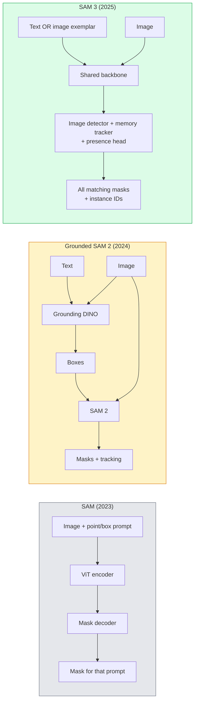

# SAM 3 و التقسيم المفتوح للمفردات

> أعط نموذج عرض نصية وصورة و الحصول على أقنعة لكل كائن يطابق. SAM 3 جعل ذلك واحد المضي قدما.

**Type:** Use + Build
**Languages:** Python
**Prerequisites:** Phase 4 Lesson 07 (U-Net), Phase 4 Lesson 08 (Mask R-CNN), Phase 4 Lesson 18 (CLIP)
**Time:** ~60 minutes

## أهداف التعلم

- تمييز SAM (إشارات بصرية فقط) ، SAM / SAM 2 (الاكتشاف + SAM) ، و SAM 3 (إشارات النص الأصلي عبر قسم المفهومات المفروضة)
- شرح معمارة SAM 3: العمود الفقري المشترك + كاشف الصورة + متابعة الفيديو القائمة على الذاكرة + رأس الوجود + تصميم الكاشف-متابعة منفصل
- استخدم معانق الوجه`transformers`تكامل SAM 3 للكشف عن النص، التقسيم، وتتبع الفيديو
- اختيار بين SAM 3، SAM الأرضية، 2، YOLO-World، و SAM-MI بناء على التأخير، وتعقيد المفهوم، والهدف التنفيذ

## المشكلة

كان SAM 2023 نموذجًا بصريًا فقط: يمكنك النقر على نقطة أو رسم مربع ويرد قناع. "من أجل إعطائي جميع البرتقال في هذه الصورة" كنت بحاجة إلى جهاز كشف (Grounding DINO) لإنتاج الصناديق ، ثم SAM لتنقسم كل منها. حول SAM الأرضي هذا إلى خط أنابيب ، لكنه كان سلسلة من نماذج مجمدة مع تراكم خطأ لا مفر منه.

SAM 3 (Meta ، نوفمبر 2025 ، ICLR 2026) انهار الصفوف. فإنه يقبل عبارة اسمية قصيرة أو نموذج الصورة كإرشاد وعاد جميع الأقنعة المقابلة ومهاتيح الحالة في مرور واحد إلى الأمام. وهذا هو **Promptable Concept Segmentation (PCS)**. جنبا إلى جنب مع تحديث Object Multiplex في مارس 2026 (SAM 3.1) ، فإنه يتتبع حالات متعددة من نفس المفهوم من خلال الفيديو بكفاءة.

هذه الدروس تتعلق بالتحول الهيكلي الذي يمثل هذا. تم دمج seg 2D ، والاكتشاف ، والأرض الصورة النصية في نموذج واحد. لم يعد السؤال الإنتاج هو "أي خط أنابيب أسلسل معا" ولكن "أي نموذج قابل للتعليق يتعامل مع قضيتي الاستخدامية من نهاية إلى نهاية".

## المفهوم

### الأجيال الثلاثة



### التقسيم المفاهيم السريع

"مفهوم الإستعراض" هو عبارة اسمية قصيرة (`"yellow school bus"`،`"striped red umbrella"`،`"hand holding a mug"`يعيد النموذج أقنعة التقسيم لكل حالة في الصورة التي تطابق المفهوم، بالإضافة إلى معرف مثال فريد لكل مباراة.

هذا يختلف عن SAM بصري كلاسيكي على ثلاثة طرق:

1. لا حاجة إلى طلب لكل حالة  طلب نصي واحد يعيد جميع المقابلة.
2. المفاهيم المفتوحة يمكن أن تكون أي شيء يمكن وصفه باللغة الطبيعية.
3. يعيد عدة حالات في وقت واحد بدلا من قناع واحد لكل طلب.

### قطع معمارية رئيسية

- **Shared backbone** جهاز ViT واحد يعالج الصورة. كل من رأس الكشف والمتابعة القائمة على الذاكرة تقرأ منه.
- **Presence head** يتوقع ما إذا كان المفهوم موجودًا في الصورة على الإطلاق. يزيل "هل هذا هنا؟" من "أين هو؟" يقلل من الإيجابيات الخاطئة على المفاهيم الغائبة.
- **Decoupled detector-tracker** اكتشاف مستوى الصورة والتتبع على مستوى الفيديو لديهما رؤوس منفصلة بحيث لا تتداخل.
- **Memory bank** تخزين ميزات لكل مثال عبر الإطارات للتتبع فيديو (الآلية نفسها SAM 2 المستخدمة).

### التدريب على نطاق واسع

تم تدريب SAM 3 على**4 million unique concepts**تم إنشاؤه بواسطة محرك بيانات يقوم بتعليقات وتصحيحها بشكل متكرر باستخدام الذكاء الاصطناعي + مراجعة البشر.**SA-CO benchmark**يحتوي على 270 ألف مفهوم فريد، أكبر 50 مرة من المعايير السابقة. SAM 3 يصل إلى 75-80% من أداء الإنسان على SA-CO ويضاعف النظم الحالية على الصورة + الفيديو PCS.

### SAM 3.1 كائن متعدد

تحديث مارس 2026: **Object Multiplex**يقدم آلية ذاكرة مشتركة للتتبع المشترك للعديد من الحالات من نفس المفهوم في وقت واحد. في السابق ، كان تتبع N الحالات يعني N بنوك ذاكرة منفصلة. ينهار Multiplex ذلك إلى ذاكرة مشتركة مع استفسارات لكل حالة. النتيجة: تتبع متعددة الأشياء بشكل أسرع بشكل كبير دون التضحية بالدقة.

### حيث لا يزال SAM الأرضي مهم في 2026

- عندما تحتاج إلى كشف مفتوح خاص للمفردات (DINO-X، فلورنسا-2).
- عندما تكون رخصة SAM 3 (مُحظورة على HF) مقفلة
- عندما تحتاجين إلى المزيد من السيطرة على عتبة الكشف أكثر من ما يكتشفها SAM 3.
- لأعمال البحث / التخلص من مكون الكشف.

خطوط الأنابيب المودولية لا تزال لها مكان. بالنسبة لمعظم أعمال الإنتاج، SAM 3 هو الإجابة الأسهل.

### يوولو-لد مقابل سام 3

- **YOLO-World**كاشف لغة مفتوح فقط (لا أقنعة) في الوقت الحقيقي. أفضل عندما تحتاج إلى صناديق في ارتفاع في الثانية.
- **SAM 3** التقسيم الكامل + التتبع. إنتاج أبطأ ولكن أكثر غنى.

تقسيم الإنتاج: YOLO-World لخطوط الأنابيب التي لا تستهدف الا الكشف السريع (التنقل الروبوتي ، لوحات التحكم السريعة) ، SAM 3 لأي شيء يحتاج إلى أقنعة أو تتبع.

### كفاءة SAM-MI

SAM-MI (2025-2026) يعالج عقدة القيادة المعدلة لـ SAM. الأفكار الرئيسية:

- **Sparse point prompting** يستخدم بعض النقاط المختارة جيدا بدلا من الإشارات الكثيفة؛ يقلل من مكالمات المفكّر بنسبة 96%.
- **Shallow mask aggregation**يدمج توقعات القناع الخام في قناع واحد أكثر حيوية
- **Decoupled mask injection** القيادة تتلقى ميزات القناع المعدلة مسبقا بدلاً من إعادة تشغيلها.

النتيجة: ~ 1.6 × تسريع على المعلم المعتمد على مقارنات المفردات المفتوحة.

### شكل الخروج للنماذج الثلاثة

جميعها تعود نفس الهيكل العام (الصناديق + العلامات + النتائج + الأقنعة + الهويات) ، وهو مفيد  لا يجب أن يتفرق خط الأنابيب الخاص بك أسفل التيار على النموذج الذي تم تشغيله.

```figure
cv3-open-vocab
```

## بناءها

### الخطوة الأولى: بناء سريع

قم ببناء مساعد يحول جملة مستخدمة إلى قائمة من طلبات مفهوم SAM 3. هذه هي الحدود حيث "ما كتب المستخدم" يلتقي "ما يستهلك النموذج".

```python
def split_concepts(sentence):
    """
    Heuristic splitter for multi-concept prompts.
    Returns list of short noun phrases.
    """
    for sep in [",", ";", "and", "or", "&"]:
        if sep in sentence:
            parts = [p.strip() for p in sentence.replace("and ", ",").split(",")]
            return [p for p in parts if p]
    return [sentence.strip()]

print(split_concepts("cats, dogs and balloons"))
```

يقبل SAM 3 مفهوم واحد لكل مرور متقدم؛ بالنسبة لطلبات متعددة المفاهيم، قم بتحويلها أو تشريعها.

### الخطوة الثانية: المساعدون بعد المعالجة

حول المخرجات الخامة من SAM 3 إلى قائمة نظيفة من الكشفات التي تتطابق مع مرحلة 4 الدروس 16 خط الأنابيب عقدنا.

```python
from dataclasses import dataclass
from typing import List

@dataclass
class ConceptDetection:
    concept: str
    instance_id: int
    box: tuple          # (x1, y1, x2, y2)
    score: float
    mask_rle: str       # run-length encoded


def rle_encode(binary_mask):
    flat = binary_mask.flatten().astype("uint8")
    runs = []
    prev, count = flat[0], 0
    for v in flat:
        if v == prev:
            count += 1
        else:
            runs.append((int(prev), count))
            prev, count = v, 1
    runs.append((int(prev), count))
    return ";".join(f"{v}x{c}" for v, c in runs)
```

RLE تبقي حمولات الاستجابة صغيرة حتى بالنسبة للعديد من أقنعة عالية القرار. يعمل نفس النموذج على SAM 2 ، SAM 3 ، SAM 2 .

### الخطوة الثالثة: واجهة توزيع مفتوحة

قم بتغطية أيّة خروط خلفية لديك (SAM 3، SAM المأوى 2، YOLO-World + SAM 2) وراء طريقة واحدة. لا يتغير رمزك التدريجي عندما يتغير الخروط.

```python
from abc import ABC, abstractmethod
import numpy as np

class OpenVocabSeg(ABC):
    @abstractmethod
    def detect(self, image: np.ndarray, concept: str) -> List[ConceptDetection]:
        ...


class StubOpenVocabSeg(OpenVocabSeg):
    """
    Deterministic stub used for pipeline testing when real models are not loaded.
    """
    def detect(self, image, concept):
        h, w = image.shape[:2]
        return [
            ConceptDetection(
                concept=concept,
                instance_id=0,
                box=(w * 0.2, h * 0.3, w * 0.5, h * 0.8),
                score=0.89,
                mask_rle="0x100;1x50;0x200",
            ),
            ConceptDetection(
                concept=concept,
                instance_id=1,
                box=(w * 0.55, h * 0.25, w * 0.85, h * 0.75),
                score=0.74,
                mask_rle="0x80;1x40;0x220",
            ),
        ]
```

الحقيقي`SAM3OpenVocabSeg`الفئة الفرعية سوف تغلف`transformers.Sam3Model`و`Sam3Processor`. . .

### الخطوة 4: استخدام SAM 3 مع العناق في الوجه (المراجعة)

بالنسبة للنموذج الفعلي،`transformers`التكامل:

```python
from transformers import Sam3Processor, Sam3Model
import torch

processor = Sam3Processor.from_pretrained("facebook/sam3")
model = Sam3Model.from_pretrained("facebook/sam3").eval()

inputs = processor(images=pil_image, return_tensors="pt")
inputs = processor.set_text_prompt(inputs, "yellow school bus")

with torch.no_grad():
    outputs = model(**inputs)

masks = processor.post_process_masks(
    outputs.masks, inputs.original_sizes, inputs.reshaped_input_sizes
)
boxes = outputs.boxes
scores = outputs.scores
```

إشارة واحدة، جميع المباراة عادت في مكالمة واحدة.

### الخطوة 5: قياس ما أعطاك إياه SAM 2 المأوى مجانا

مقياس حقيقي: ماذا يحدث عندما تحل محل SAM2 الأرضي بمثابة SAM3 في خط أنابيب حقيقي؟

- التأخير: SAM 3 يحفظ مرورًا واحدًا إلى الأمام (لا يوجد كاشف منفصل) ولكن النموذج نفسه أثقل؛ عادة ما يكون محايدًا عن الصف أو تسريع طفيف.
- دقة: SAM 3 أفضل بشكل كبير على المفاهيم النادرة أو المكونة ("المظلة الحمراء المخططة"). مماثلة على المفاهيم الشائعة من كلمة واحدة.
- المرونة: SAM 2 المأوى يسمح لك بتبادل الكشفات (DINO-X، Florence-2, Grounding DINO 1.5) ؛ SAM 3 هو واحد.

الاستنتاج: SAM 3 هو الافتراض ل 2026 Seg مفتوحة الكلمات. SAM 2 المأساسية لا يزال الإجابة الصحيحة عندما تحتاج إلى مرونة الكشف أو شروط ترخيص مختلفة.

## استخدمها

أنماط نشر الإنتاج:

- **Real-time annotation** SAM 3 + ميزة التعليمات التسمية كنص. يختار الملاحظون اسم التعليمات التسمية. SAM 3 يضع علامات مسبقة على كل حالة مطابقة. مراجعة وتصحيح.
- **Video analytics** SAM 3.1 Object Multiplex للتتبع متعدد الأشياء؛ إمدادات الإطارات إلى متابعة القائمة على الذاكرة.
- **Robotics** SAM 3 للتلاعب بالفصيلة المفتوحة ("خذ الكأس الحمراء"); يعمل كطريقة خططية بدائية.
- **Medical imaging** SAM 3 محسن على المفاهيم الطبية؛ يتطلب طلب الوصول على HF.

الـ " ألتراليتيكس " تضم SAM 3 في حزمة " بايثون "

```python
from ultralytics import SAM

model = SAM("sam3.pt")
results = model(image_path, prompts="yellow school bus")
```

نفس الواجهة مثل (يولو) و (سام 2)

## أرسله

هذا الدرس ينتج عن:

- `outputs/prompt-open-vocab-stack-picker.md` استشارة تختار SAM 3 / SAM 2 / YOLO-World / SAM-MI بناءً على التأخير و تعقيد المفهوم والترخيص.
- `outputs/skill-concept-prompt-designer.md` مهارة تحويل تصريحات المستخدم إلى مفاهيم SAM 3 المشكولة بشكل جيد (الفصل، التشويق، الردود الخلفي).

## التمارين

1. **(Easy)**قم بتشغيل SAM 3 على 10 صور مع طلبات المفهوم التي تختارها. مقارنة مع SAM 2 + Grounding DINO 1.5 على نفس الصور. أبلغ عن المفهومات التي فات كل نموذج.
2. **(Medium)**قم ببناء واجهة اتصال "انقر على إضافة / انقر على استبعاد" فوق SAM 3: يعيد عرض نصي حالات المرشحين؛ تنقرات المستخدم تحافظ على تلك التي تعتبر إيجابية. قم بإخراج مجموعة المفهوم النهائية على أنها JSON.
3. **(Hard)**ضبط SAM 3 على مجموعة مفهومة مخصصة (مثل 5 أنواع من المكونات الإلكترونية) مع 20 صورة مع علامة كل. مقارنة مع SAM 3 الصفرية في نفس مجموعة الاختبار؛ قياس تحسن القناع.

## الشروط الرئيسية

| Term | What people say | What it actually means |
|------|----------------|----------------------|
| Open-vocabulary segmentation | "Segment by text" | Produce masks for objects described in natural language, not a fixed label set |
| PCS | "Promptable Concept Segmentation" | SAM 3's core task — given a noun-phrase or image exemplar, segment all matching instances |
| Concept prompt | "The text input" | Short noun phrase or image exemplar; not a full sentence |
| Presence head | "Is it here?" | SAM 3 module that decides whether the concept exists in the image before localisation |
| SA-CO | "SAM 3 benchmark" | 270K-concept open-vocabulary segmentation benchmark; 50x larger than prior open-vocab benchmarks |
| Object Multiplex | "SAM 3.1 update" | Shared-memory multi-object tracking; fast joint tracking of many instances |
| Grounded SAM 2 | "Modular pipeline" | Detector + SAM 2 cascade; still relevant when detector swap matters |
| SAM-MI | "Efficient SAM variant" | Mask Injection for 1.6x speedup over Grounded-SAM |

## المزيد من القراءة

- [SAM 3: Segment Anything with Concepts (arXiv 2511.16719)](https://arxiv.org/abs/2511.16719)
- [SAM 3.1 Object Multiplex (Meta AI, March 2026)](https://ai.meta.com/blog/segment-anything-model-3/)
- [SAM 3 model page on Hugging Face](https://huggingface.co/facebook/sam3)
- [Grounded SAM 2 tutorial (PyImageSearch)](https://pyimagesearch.com/2026/01/19/grounded-sam-2-from-open-set-detection-to-segmentation-and-tracking/)
- [Ultralytics SAM 3 docs](https://docs.ultralytics.com/models/sam-3/)
- [SAM3-I: Instruction-aware SAM (arXiv 2512.04585)](https://arxiv.org/abs/2512.04585)
