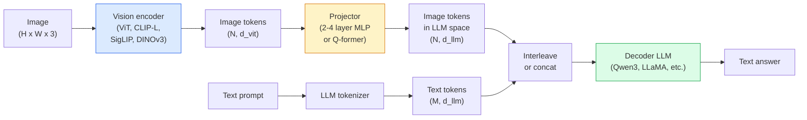

# نموذجات اللغة الرؤية  نمط ViT-MLP-LLM

> يقوم مرموز الرؤية بتحويل صورة إلى رموز. يقوم مشغل MLP بتخريط تلك الرموز في مساحة إدمج LLM. يقوم نموذج لغة بالباقي. هذا النموذج  ViT-MLP-LLM  هو كل إنتاج VLM في عام 2026.

**Type:** Learn + Use
**Languages:** Python
**Prerequisites:** Phase 4 Lesson 14 (ViT), Phase 4 Lesson 18 (CLIP), Phase 7 Lesson 02 (Self-Attention)
**Time:** ~75 minutes

## أهداف التعلم

- شرح بنية ViT-MLP-LLM وشرح ما يساهم به كل من المكونات الثلاثة
- مقارنة Qwen3-VL، InternVL3.5، LLaVA-Next، و GLM-4.6V على عدد المعلمات، وطول السياق، وأداء مقارنة
- شرح DeepStack: لماذا ميزات ViT متعددة المستويات تشد التنظيم اللغوي للنظر بشكل أفضل من ميزة آخر طبقة واحدة
- قياس الهلوسة في VLM في الإنتاج مع معدل الخطأ المتقاطع (CMER) والعمل على الإشارة

## المشكلة

CLIP (المرحلة 4 الدروس 18) يوفر لك مساحة إدراج مشتركة للصور والنص، والتي تكفي لتصنيف الصور والحصول عليها. لا يمكن أن تجيب على "كم عدد السيارات الحمراء في هذه الصورة؟" لأن CLIP لا تولد نص  فإنه يدرج فقط التشابهات.

نماذج اللغة الرؤية (VLMs)  Qwen3-VL، InternVL3.5, LLaVA-Next، GLM-4.6V  تعقب مُرمّد صورة CLIP-family إلى نموذج لغة كاملة. يرى النموذج صورة بالإضافة إلى سؤال ويولد إجابة. في عام 2026 تنافس VLMs مفتوحة المصدر أو تضرب GPT-5 و Gemini-2.5-Pro على مقاييس متعددة الطرق (MMMU، MMBench، DocVQA، ChartQA، MathVista، OSWorld).

الثلاثة من القطع (ViT ، المشاش ، LLM) هي المعيار. الاختلافات بين النماذج هي في ما ViT ، أي مشاش ، أي LLM ، بيانات التدريب ، وصفة التنظيم. بمجرد فهم النمط ، فإن تبادل أي مكون ميكانيكي.

## المفهوم

### بنية ViT-MLP-LLM



1. **Vision encoder** ViT المُدربة مسبقاً (CLIP-L/14, SigLIP, DINOv3 أو إصدار متطور) ، تنتج رموز اللمسات.
2. **Projector** وحدات صغيرة (2-4 طبقة MLP ، أو Q-former) التي تخطيط رموز الرؤية إلى بعد إدراج LLM. هذا هو المكان الذي يحدث فيه معظم التنسيق الدقيق.
3. **LLM** نموذج لغة مُقرر فقط (Qwen3 ، Llama ، Mistral ، GLM ، InternLM). يقرأ رموز الرؤية + النص بالتسلسل ، ويولد النص.

كل هذه الأجزاء يمكن تدريبها من حيث المبدأ. في الممارسة العملية، يبقى مبرر الرؤية و LLM في الغالب مقفلاً بينما يقوم المشاش بتدريب بضع مليارات مبررات من الإشارة مقابل رخيص.

### " ديب ستاك "

يستخدم مشهد الفانيلا فقط آخر طبقة ViT. يحتوي DeepStack (Qwen3-VL) على عينات من أعماق ViT متعددة ويجمعها. تحتوي الطبقات العميقة على تعبيرات عالية المستوى؛ وتحتوي الطبقات السطحية على معلومات فضائية ونسيقية دقيقة. إدخال كل من هذا إلى LLM يغلق الفجوة بين "ما يحتوي الصورة" (الترسيم) و "أين بالضبط" (الترسيم فضائي).

### ثلاث مراحل تدريبية

القطارات الحديثة في المراحل:

1. **Alignment** تجميد ViT و LLM. تدريب المبرر فقط على أزواج صورة-تسمية. يعلم المبرر رسم خريطة مساحة الرؤية إلى مساحة اللغة.
2. **Pre-training** تفريغ كل شيء. تدريب على بيانات الصور والنص المتداخلة على نطاق واسع (500 مليون + زوج). بناء المعرفة البصرية للنموذج.
3. **Instruction tuning** ضبط دقيقة على ثلاثية المنتجات (الصورة، السؤال، الإجابة) . يعلم سلوك المحادثة وأشكال المهام. هذا ما يجعل "LM الواعي للرؤية" مساعدًا صالحًا للاستخدام.

معظم المواد المحددة لـ LoRA تستهدف المرحلة الثالثة مع مجموعة بيانات صغيرة تحمل علامة.

### مقارنة عائلة النموذج (أوائل 2026)

| Model | Params | Vision encoder | LLM | Context | Strengths |
|-------|--------|----------------|-----|---------|-----------|
| Qwen3-VL-235B-A22B (MoE) | 235B (22B active) | custom ViT + DeepStack | Qwen3 | 256K | General SOTA, GUI agent |
| Qwen3-VL-30B-A3B (MoE) | 30B (3B active) | custom ViT + DeepStack | Qwen3 | 256K | Smaller MoE alternative |
| Qwen3-VL-8B (dense) | 8B | custom ViT | Qwen3 | 128K | Production dense default |
| InternVL3.5-38B | 38B | InternViT-6B | Qwen3 + GPT-OSS | 128K | Strong MMBench / MMVet |
| InternVL3.5-241B-A28B | 241B (28B active) | InternViT-6B | Qwen3 | 128K | Competitive with GPT-4o |
| LLaVA-Next 72B | 72B | SigLIP | Llama-3 | 32K | Open, easy to fine-tune |
| GLM-4.6V | ~70B | custom | GLM | 64K | Open-source, strong OCR |
| MiniCPM-V-2.6 | 8B | SigLIP | MiniCPM | 32K | Edge-friendly |

### العوامل البصرية

Qwen3-VL-235B يصل إلى أعلى أداء عالمي على OSWorld  مقياس ل **visual agents**يستخدم هذا النموذج إصدارات شاشة، يفهم واجهة المستخدم، وينشر الإجراءات (انقر، النقر، الدفعة). يجمع مع الأدوات، يغلق الحلقة على المهام المكتسبة الشائعة. هذا ما يتم تشغيله معظم 2026 "PC AI" تحت الغطاء.

### القدرات الوكالة + فوارق روبي

يجب أن يعرف الموظفون**when**فهي فيديو. تطورت Qwen3-VL من T-RoPE (التوابل المدارية الزمنية) إلى **text-based time alignment** رموز نصية صريحة من طابع الوقت المتداخلة مع إطارات الفيديو. النموذج يرى "`<timestamp 00:32>`الإطار، السرعة" ويمكن أن تفكر حول العلاقات الزمنية.

### مشكلة التنحية

يحتوي 12% من أزواج الصور والنص في مجموعة بيانات متصفحة على وصفات غير مقيدة بالكامل في الصورة. يتعلم VLM المدرب على هذا بصمت الهلوسة  تصنع الأشياء ، ويتفق الأرقام ، ويتخيل العلاقات. في الإنتاج هذا هو وضع الفشل السائد.

أعلنت شركة Skywork.ai**Cross-Modal Error Rate (CMER)**للتتبع:

```
CMER = fraction of outputs where the text confidence is high but the image-text similarity (via a CLIP-family checker) is low
```

تعني CMER عالية أن النموذج يقول أشياء لا تستند إلى الصورة بثقة. مراقبة CMER ومعاملتها كمناسبة إنتاجية خفض معدل الهلوسة بنسبة ~ 35% في تنفيذها. الخدعة ليست "إصلاح النموذج" ولكن "التوجيه إلى نتائج CMER عالية إلى مراجعة البشر".

### التنسيق الدقيق مع LoRA / QLoRA

التنسيق الكامل لـ 70B VLM غير متسع لمعظم الفرق. LoRA (المرتبة 16-64) على طبقات الاهتمام + المشاريع ، أو QLoRA مع الوزن الأساسي 4-بيت ، يناسب على A100 / H100 واحد. التكلفة: 5,000-50,000 مثال ، $100-$5000 في الحسابات، 2-10 ساعات من التدريب.

### التفكير الفضائي لا يزال ضعيفاً

تسجل VLM الحالية 50-60% على معايير التفكير المكانية (من الأعلى إلى الأسفل ، من اليسار إلى اليمين ، العد ، المسافة). إذا اعتمد قضية الاستخدام الخاصة بك على "أي كائن هو فوق أي ،" فمؤكدة بقوة  أداء VLM العام أقل من الإنسان. أفضل من VLM البدائل للمهام المكانية النقية: مقياس مفتاح متخصص / وضع ، نموذج عمق ، أو نموذج الكشف مع هندسة الصناديق بعد معالجة.

```figure
v4-vlm-projector
```

## بناءها

### الخطوة الأولى: المُرسل

الجزء الذي ستدربين فيه أكثر من أي وقت مضى، طبقة من 2 إلى 4 من المادة المعدنية المعدنية مع GELU.

```python
import torch
import torch.nn as nn


class Projector(nn.Module):
    def __init__(self, vit_dim=768, llm_dim=4096, hidden=4096):
        super().__init__()
        self.net = nn.Sequential(
            nn.Linear(vit_dim, hidden),
            nn.GELU(),
            nn.Linear(hidden, llm_dim),
        )

    def forward(self, x):
        return self.net(x)
```

المدخل هو `(N_patches, d_vit)`الـ (تينسر) التجريبي`(N_patches, d_llm)`الـ"LLM" يعامل كل صف خارج كإشارة أخرى

### الخطوة الثانية: تجميع ViT-MLP-LLM من نهايتها إلى النهاية

العظم من المخطط الأمامي لحد أدنى VLM.`transformers`هذا هو المخطط المفاهيمي.

```python
class MinimalVLM(nn.Module):
    def __init__(self, vit, projector, llm, image_token_id):
        super().__init__()
        self.vit = vit
        self.projector = projector
        self.llm = llm
        self.image_token_id = image_token_id  # placeholder token in text prompt

    def forward(self, image, input_ids, attention_mask):
        # 1. vision features
        vision_tokens = self.vit(image)                     # (B, N_patches, d_vit)
        vision_embeds = self.projector(vision_tokens)       # (B, N_patches, d_llm)

        # 2. text embeddings
        text_embeds = self.llm.get_input_embeddings()(input_ids)  # (B, M, d_llm)

        # 3. replace image placeholder tokens with vision embeds
        merged = self._merge(text_embeds, vision_embeds, input_ids)

        # 4. run LLM
        return self.llm(inputs_embeds=merged, attention_mask=attention_mask)

    def _merge(self, text_embeds, vision_embeds, input_ids):
        out = text_embeds.clone()
        expected = vision_embeds.size(1)
        for b in range(input_ids.size(0)):
            positions = (input_ids[b] == self.image_token_id).nonzero(as_tuple=True)[0]
            if len(positions) != expected:
                raise ValueError(
                    f"batch item {b} has {len(positions)} image tokens but vision_embeds has {expected} patches."
                    " Every sample in the batch must be pre-padded to the same number of image placeholder tokens.")
            out[b, positions] = vision_embeds[b]
        return out
```

- نعم`<image>`يتم استبدال رمز الحافظ على المكان في النص بتوابل الصورة الحقيقية  نفس النمط LLaVA، Qwen-VL، و InternVL استخدام.

### الخطوة الثالثة: حساب CMER

-مراقبة وقت التشغيل خفيفة الوزن

```python
import torch.nn.functional as F


def cross_modal_error_rate(image_emb, text_emb, text_confidence, sim_threshold=0.25, conf_threshold=0.8):
    """
    image_emb, text_emb: embeddings of image and generated text (normalised internally)
    text_confidence:     mean per-token probability in [0, 1]
    Returns:             fraction of high-confidence outputs with low image-text alignment
    """
    image_emb = F.normalize(image_emb, dim=-1)
    text_emb = F.normalize(text_emb, dim=-1)
    sim = (image_emb * text_emb).sum(dim=-1)        # cosine similarity
    high_conf_low_sim = (text_confidence > conf_threshold) & (sim < sim_threshold)
    return high_conf_low_sim.float().mean().item()
```

تعامل CMER كبي سي الإنتاج. مراقبه لكل نقطة نهاية، لكل نوع استقالة، لكل عميل. يظهر ارتفاع CMER أن النموذج بدأ يوحش في بعض توزيع المدخلات.

### الخطوة الرابعة: تصنيف VLM للألعاب (مممكن التشغيل)

أظهروا القطارات المضربة "ميزات "فيت" مزيفة تدخل، رمز صغير في نمط "الجامعة" يتوقع صف

```python
class ToyVLM(nn.Module):
    def __init__(self, vit_dim=32, llm_dim=64, num_classes=5):
        super().__init__()
        self.projector = Projector(vit_dim, llm_dim, hidden=64)
        self.head = nn.Linear(llm_dim, num_classes)

    def forward(self, vision_tokens):
        projected = self.projector(vision_tokens)
        pooled = projected.mean(dim=1)
        return self.head(pooled)
```

يمكن للمرء أن يضع هذا على أزواج صناعية (الميزة، الفئة) في أقل من 200 خطوة  بما يكفي لإظهار أنماط المضرب يعمل.

## استخدمها

ثلاثة طرق تستخدم بها فرق الإنتاج VLM في عام 2026:

- **Hosted API**رؤية OpenAI، رؤية كلود الأنثروبية، رؤية جوميني جوجل. صفر تحت، خطر البائع.
- **Open-source self-host** Qwen3-VL أو InternVL3.5 عبر `transformers`و`vllm`-سيطرة كاملة، جهد أعلى من الأمام.
- **Fine-tune on domain** تحميل Qwen2.5-VL-7B أو LLaVA-1.6-7B، LoRA على 5k-50k الأمثلة المخصصة، خدمة مع `vllm`أو`TGI`. . .

```python
from transformers import AutoProcessor, AutoModelForVision2Seq
import torch
from PIL import Image

model_id = "Qwen/Qwen3-VL-8B-Instruct"
processor = AutoProcessor.from_pretrained(model_id)
model = AutoModelForVision2Seq.from_pretrained(model_id, torch_dtype=torch.bfloat16, device_map="auto")

messages = [{
    "role": "user",
    "content": [
        {"type": "image", "image": Image.open("plot.png")},
        {"type": "text", "text": "What does this chart show?"},
    ],
}]
inputs = processor.apply_chat_template(messages, add_generation_prompt=True, tokenize=True, return_dict=True, return_tensors="pt").to("cuda")
generated = model.generate(**inputs, max_new_tokens=256)
answer = processor.decode(generated[0][inputs["input_ids"].shape[1]:], skip_special_tokens=True)
```

`apply_chat_template`يختبئ`<image>`إشارة الحاملة؛ النموذج يتعامل مع الاندماج داخليا.

## أرسله

هذا الدرس ينتج عن:

- `outputs/prompt-vlm-selector.md` يختار Qwen3-VL / InternVL3.5 / LLaVA-Next / API نظرا للدقة والانخفاض وطول السياق وال ميزانية.
- `outputs/skill-cmer-monitor.md` إصدار الرمز للاستعمال في نقطة نهاية VLM الإنتاج مع معدل الخطأ المتقاطع للطرازات، واللواح الجهازية لكل نقطة نهاية، وعلى حد سواء، وعلى حد سواء.

## التمارين

1. **(Easy)**قم بتشغيل ثلاث طلبات ("ما هذا؟" "عد الأشياء"، "وصف المشهد") من خلال أي VLM مفتوح على خمس صور. قم بتسجيل كل إجابة على أنها صحيحة / صحيحة جزئية / توهمية يدويا. احسب معدل CMER يشبه المرور الأول.
2. **(Medium)**ضبط Qwen2.5-VL-3B أو LLaVA-1.6-7B مع LoRA (المرتبة 16) على 500 صورة من النطاق المستهدف مع العناوين الرئيسية. مقارنة دقة الصور الصفر مقابل ضبط MMBench.
3. **(Hard)**استبدل مرموز الصورة في VLM بـ DINOv3 بدلاً من SigLIP / CLIP الافتراضي. إعادة تدريب المضرب فقط (LLM المجمد + DINOv3 المجمد). قياس ما إذا كانت مهام التنبؤ الكثيف (العد ، التفكير الفضائي) تتحسن.

## الشروط الرئيسية

| Term | What people say | What it actually means |
|------|----------------|----------------------|
| ViT-MLP-LLM | "The VLM pattern" | Vision encoder + projector + language model; every 2026 VLM |
| Projector | "The bridge" | 2-4 layer MLP (or Q-former) that maps vision tokens into LLM embedding space |
| DeepStack | "Qwen3-VL feature trick" | Multi-level ViT features stacked rather than last-layer only |
| Image token | "<image> placeholder" | Special token in the text stream replaced by projected vision embeddings |
| CMER | "Hallucination KPI" | Cross-Modal Error Rate; high when text confidence is high but image-text similarity is low |
| Visual agent | "VLM that clicks" | VLM operating GUIs (OSWorld, mobile, web) with tool calls |
| Q-former | "Fixed-count token bridge" | BLIP-2 style projector producing a fixed number of visual query tokens |
| Alignment / pre-training / instruction tuning | "Three stages" | Standard VLM training pipeline |

## المزيد من القراءة

- [Qwen3-VL Technical Report (arXiv 2511.21631)](https://arxiv.org/abs/2511.21631)
- [InternVL3.5 Advancing Open-Source Multimodal Models (arXiv 2508.18265)](https://arxiv.org/html/2508.18265v1)
- [LLaVA-Next series](https://llava-vl.github.io/blog/2024-05-10-llava-next-stronger-llms/)
- [BentoML: Best Open-Source VLMs 2026](https://www.bentoml.com/blog/multimodal-ai-a-guide-to-open-source-vision-language-models)
- [MMMU: Multi-discipline Multimodal Understanding benchmark](https://mmmu-benchmark.github.io/)
- [VLMs in manufacturing (Robotics Tomorrow, March 2026)](https://www.roboticstomorrow.com/story/2026/03/when-machines-learn-to-see-like-experts-the-rise-of-vision-language-models-in-manufacturing/26335/)
