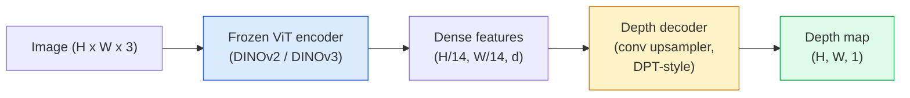

# عمق واحد و تقدير الهندسة

> خريطة عمق هي صورة واحدة القناة حيث كل بكسل هو المسافة من الكاميرا. التنبؤ بها من إطار RGB واحد كان مستحيلاً دون سtereo أو LiDAR. في عام 2026 يتم الحصول على مرموز ViT المجمد بالإضافة إلى رأس خفيف الوزن داخل بضع بالمئة من الحقيقة الأرضية.

**Type:** Build + Use
**Languages:** Python
**Prerequisites:** Phase 4 Lesson 14 (ViT), Phase 4 Lesson 17 (Self-Supervised Vision), Phase 4 Lesson 07 (U-Net)
**Time:** ~60 minutes

## أهداف التعلم

- تمييز العمق النسبي والمتريكي والحالة التي يحلها كل نموذج إنتاج (MiDaS، Marigold، Depth Anything V3، ZoeDepth)
- استخدم عمق أي شيء V3 (DINOv2 العمود الفقري) للتنبؤ بالعمق لصور واحدة تعسفية دون قياس
- شرح لماذا يعمل عمق واحد على الإطلاق من صورة واحدة (أشارات وجهة نظر، تراجعات النسيج، سابقات تعلم) وما لا يمكن استعادة (المقياس المطلق، الهندسة الغائمة)
- رفع الكشف 2D إلى نقاط 3D باستخدام خريطة عمق وجهاز الكاميرا المحور

## المشكلة

العمق هو المحور المفقود في رؤية الكمبيوتر 2D. بالنظر إلى RGB ، تعرف أين تظهر الأشياء في مستوى الصورة ؛ لا تعرف كم هي بعيدة. أجهزة استشعار العمق (مجهزة الاستطلاع ، LiDAR ، وقت الطيران) تحل هذا مباشرة ولكنها مكلفة و هشة ومحدودة في النطاق.

تقدير عمق واحد  تنبؤ بعمق من إطار RGB واحد  يستخدم لإنتاج خروج غامضة وغير موثوقة. بحلول عام 2026، تغيرت مبرمجيات كبيرة من قبل التدريب ذلك: تستخدم Deep Anything V3 العمود الفقري DINOv2 المجمد وتنتج خرائط عمق تتعمق عبر المناطق الداخلية والخارجية والطبية والقمر الصناعي. مارجولد يعيد تشكيل العمق كمشكلة توزيع مشروطة (زوي ديبث) تراجع عن المسافات المتركية الحقيقية

العمق هو أيضا الجسر بين الكشف 2D والفهم 3D: ضرب بكسلات مربع الكشف عن العمق ورفع الكائن 2D إلى سحابة نقطة 3D. وهذا هو جوهر كل نظام إغلاق AR، كل خط أنابيب تجنب العقبات، وكل "التقاط الكأس" الروبوت.

## المفهوم

### العمق النسبي مقابل العمق الميتر

- **Relative depth** أمر `z`"البيكسل A أقرب من البيكسل B، ولكن نسبة المسافات لا تربط بالمتري".
- **Metric depth** المسافة المطلقة في أمتار من الكاميرا. يتطلب من النموذج أن يكون قد تعلم العلاقة الإحصائية بين إشارات الصورة والمسافة الحقيقية.

تنتج MiDaS و Depth Anything V3 عمقًا نسبيًا. تنتج Marigold عمقًا نسبيًا. تنتج ZoeDepth و UniDepth و Metric3D عمقًا قياسيًا. تكون النماذج الميترية حساسة للقطار الجوهري الكاميرا. لا تكون النماذج النموذجية ذات الصلة حساسة.

### نمط تشفير-تشفير



يجمد Deep Anything V3 المُشفّر ويعمل فقط على المُشفّر على شكل DPT. يقدم المُشفّر ميزات غنية؛ ويقوم المُشفّر بتقاطعها إلى حلّ الصورة ويرجع إلى عمق.

### لماذا تصميم واحد يخلق عمق على الإطلاق

الصورة الثنائية الأبعاد تحتوي على العديد من الإشارات الموحدة التي تتصل بالعمق:

- **Perspective** خطوط متوازية في 3D تتقارب في 2D.
- **Texture gradient** السطحات البعيدة لديها نسيج أصغر واكثر كثافة.
- **Occlusion order** الأشياء القريبة تغطي الأشياء البعيدة.
- **Size constancy** الأشياء المعروفة (سيارات، البشر) تعطى مقياسًا تقريبًا.
- **Atmospheric perspective** تبدو الأشياء البعيدة أكثر ضباباً وأزرق في المشاهد الخارجية.

ويتم تدريبها على مليارات الصور لتطبيق هذه الإشارات مع وجود بيانات كافية و قوة العمود الفقري، يصل عمق واحد إلى دقة معقولة دون أي إشراف 3D صريح.

### ما لا يمكن عمق واحد أن يفعل

- **Absolute metric scale**بدون أساسيات أو كائن معروف في المشهد. الشبكة يمكنها التنبؤ "الكوب هو ضعف المسافة من الملعقة" دون معرفة ما إذا كان الكوب على بعد 1 متر أو 10 متر.
- **Occluded geometry** ظهور الكرسي غير مرئي ولا يمكن استنباطه بشكل موثوق.
- **Truly untextured / reflective surfaces**مرآة، زجاج، جدران متوحدة. الشبكة تقرير عمق معقول ولكن خاطئ.

### عمق أي شيء V3 في 2026

- فانيلا DINOv2 ViT-L/14 كمُشفّر (مجمّد).
- مُشفّر DPT
- تدريب على أزواج الصور الموضحة من مصادر مختلفة (لا حاجة إلى إشراف عميق صريح خارج الاتساق الصوئي).
- يتوقع هندسة متسقة من حيث المكان**an arbitrary number of visual inputs, with or without known camera poses**. . .
- (SOTA) عبر عمق واحد، هندسة أي منظر، عرض بصري، تقدير وضع الكاميرا.

هذا هو النموذج القادم للدعوة عندما تحتاج إلى عمق في عام 2026.

### ماريغولد  انتشار للعمق

ماريغولد (كيه وآخرون ، CVPR 2024) يعيد تشكيل تقدير العمق كانتشار مشروط من الصورة إلى الصورة. التشريط: RGB. الهدف: خريطة عمق. يستخدم شبكة U-Net المثابرة المثبتة مسبقًا كعمود عمق. خرائط عمق الخروج حادة بشكل استثنائي عند حدود الأشياء. التداول: استنتاج أبطأ من نماذج التغذية المسبقة (10-50 خطوة تُخفي عن الخطوات).

### الجهاز الجوهري و الكاميرا

لرفع بيكسل `(u, v)`مع عمق`d`إلى نقطة ثلاثية الأبعاد`(X, Y, Z)`في إحداثيات الكاميرا:

```
fx, fy, cx, cy = camera intrinsics
X = (u - cx) * d / fx
Y = (v - cy) * d / fy
Z = d
```

تأتي البيانات الداخلية من بيانات EXIF ، نمط تحديد المعدل ، أو مقياس داخلي واحد (حقول المنظور ، UniDepth). بدون البيانات الداخلية ، يمكنك لا يزال تقديم سحابة نقطة عن طريق افتراض مبدأ FOV 60-70 درجة ومراد القرار المتوسط  يمكن استخدامها للتصور ، وليس للقياس.

### التقييم

اثنين من المقاييس القياسية:

- **AbsRel**(خطأ نسبي مطلقاً): `mean(|d_pred - d_gt| / d_gt)`أقل أفضل 0.05 - 0.1 للنماذج الإنتاجية
- **delta < 1.25**(دقة العدالة): جزء من البكسلات حيث `max(d_pred/d_gt, d_gt/d_pred) < 1.25`أعلى أفضل 0.9+ للSOTA

بالنسبة للعمق النسبي (عمق أي شيء V3 ، MiDaS) ، تستخدم التقييم نسخة غير متغيرة من الحجم والتحول من كلا المقاييسين.

```figure
depth-sweep
```

## بناءها

### الخطوة الأولى: مقاييس العمق

```python
import torch

def abs_rel_error(pred, target, mask=None):
    if mask is not None:
        pred = pred[mask]
        target = target[mask]
    return (torch.abs(pred - target) / target.clamp(min=1e-6)).mean().item()


def delta_accuracy(pred, target, threshold=1.25, mask=None):
    if mask is not None:
        pred = pred[mask]
        target = target[mask]
    ratio = torch.maximum(pred / target.clamp(min=1e-6), target / pred.clamp(min=1e-6))
    return (ratio < threshold).float().mean().item()
```

دائماً غطاء البيكسلات الغامضة للعمق (صفر، NaN، مشبع) قبل التقييم.

### الخطوة الثانية: التنحية في النطاق والتحول

بالنسبة لنماذج العمق النسبي، قم بتحديد التنبؤ إلى الحقيقة الأساسية قبل قياس المقاييس الحاسوبية.`a * pred + b = target`:

```python
def align_scale_shift(pred, target, mask=None):
    if mask is not None:
        p = pred[mask]
        t = target[mask]
    else:
        p = pred.flatten()
        t = target.flatten()
    A = torch.stack([p, torch.ones_like(p)], dim=1)
    coeffs, *_ = torch.linalg.lstsq(A, t.unsqueeze(-1))
    a, b = coeffs[:2, 0]
    return a * pred + b
```

أركض`align_scale_shift`قبل ذلك`abs_rel_error`عند تقييم MiDaS / عمق أي شيء.

### الخطوة الثالثة: رفع عمق إلى سحابة نقطة

```python
import numpy as np

def depth_to_point_cloud(depth, intrinsics):
    H, W = depth.shape
    fx, fy, cx, cy = intrinsics
    v, u = np.meshgrid(np.arange(H), np.arange(W), indexing="ij")
    z = depth
    x = (u - cx) * z / fx
    y = (v - cy) * z / fy
    return np.stack([x, y, z], axis=-1)


depth = np.random.uniform(0.5, 4.0, (240, 320))
intr = (320.0, 320.0, 160.0, 120.0)
pc = depth_to_point_cloud(depth, intr)
print(f"point cloud shape: {pc.shape}  (H, W, 3)")
```

وظيفة واحدة، كل تطبيق 3D رفع. تصدير السحابة النقطة إلى `.ply`وفتح في MeshLab أو CloudCompare.

### الخطوة الرابعة: اختبار الدخان مع مشهد عمق اصطناعي

```python
def synthetic_depth(size=96):
    yy, xx = np.meshgrid(np.arange(size), np.arange(size), indexing="ij")
    # Floor: linear gradient from near (top) to far (bottom)
    depth = 1.0 + (yy / size) * 4.0
    # Box in the middle: closer
    mask = (np.abs(xx - size / 2) < size / 6) & (np.abs(yy - size * 0.6) < size / 6)
    depth[mask] = 2.0
    return depth.astype(np.float32)


gt = torch.from_numpy(synthetic_depth(96))
pred = gt + 0.3 * torch.randn_like(gt)  # simulated prediction
aligned = align_scale_shift(pred, gt)
print(f"before align  absRel = {abs_rel_error(pred, gt):.3f}")
print(f"after align   absRel = {abs_rel_error(aligned, gt):.3f}")
```

### الخطوة 5: عمق أي شيء استخدام V3 (المراجعة)

```python
import torch
from transformers import pipeline
from PIL import Image

pipe = pipeline(task="depth-estimation", model="LiheYoung/depth-anything-v2-large")

image = Image.open("street.jpg").convert("RGB")
out = pipe(image)
depth_np = np.array(out["depth"])
```

ثلاث خطات`out["depth"]`هو مقياس الرمادي PIL؛ تحويل إلى numpy للرياضيات. بالنسبة إلى عمق أي شيء V3 تحديدا، تبادل اسم النموذج بمجرد إصدار؛ API غير متغيرة.

## استخدمها

- **Depth Anything V3**(Meta AI / ByteDance ، 2024-2026)  الافتراضية للعمق النسبي. أسرع نموذج ViT-backbone-large في الإنتاج.
- **Marigold**(ETH، 2024)  أعلى جودة مرئية، استنتاج بطيء.
- **UniDepth**(ETH، 2024)  عمق متري مع تقديرات كاميرات داخلية.
- **ZoeDepth**(Intel, 2023)  عمق متري؛ قديم، لا يزال موثوق.
- **MiDaS v3.1** إرث ولكن مستقرة؛ نقطة أساسية جيدة للمقارنة.

نمط التكامل النموذجي:

1. إطار RGB يصل.
2. نموذج العمق ينتج خريطة العمق
3. الكشف ينتج الصناديق
4. رفع مركبات الصندوق عبر عمق إلى 3D؛ الاندماج مع سحابة نقطة إذا كان متاحا.
5. أسفل التيار: إغلاق AR، تخطيط المسار، تقدير حجم الكائن، استبدال الصوت الصوتي.

للاستخدام في الوقت الحقيقي، يضرب Deep Anything V2 Small (INT8 كمية) ~ 30 fps على GPU المستهلك عند 518x518.

## أرسله

هذا الدرس ينتج عن:

- `outputs/prompt-depth-model-picker.md` اختيارات بين عمق أي شيء V3، مارجولد، يونيديفت، ميداس نظراً للتأخير، الميترات مقابل الحاجة النسبية، ونوع المشهد.
- `outputs/skill-depth-to-pointcloud.md` مهارة لبناء سحابة نقطة من خرائط عمق مع معالجة الجوهرية الصحيحة وتصدير إلى `.ply`. . .

## التمارين

1. **(Easy)**قم بتشغيل عمق أي شيء V2 على أي 10 صور من مكتبك. حفظ العمق ك PNGs على نطاق الرمادي وتفتيش. حدد أحد الأشياء التي تبدو عمقها المتوقع خاطئًا وشرح سبب فشل الإشارات الموحدة.
2. **(Medium)**نظراً لـ RGB + عمق من عمق أي شيء V2 ، قم بالرفع إلى سحابة نقطة و قم بتسجيلها مع `open3d`. مقارنة مشاهد (داخل / خارج) ونلاحظ ما يبدو أكثر مصداقية.
3. **(Hard)**خذ خمس أزواج من الصور التي تختلف فقط من موقع الكائن المعروف (على سبيل المثال، تحرك الزجاجة 30 سم أقرب). استخدم UniDepth للتنبؤ بالعمق الميتر على كل منهما. قم بتقرير المسافة المتوقعة في دلتا مقابل 30 سم الحقيقي.

## الشروط الرئيسية

| Term | What people say | What it actually means |
|------|----------------|----------------------|
| Monocular depth | "Single-image depth" | Depth estimation from one RGB frame, no stereo or LiDAR |
| Relative depth | "Ordered depth" | Ordered z-values without real-world units |
| Metric depth | "Absolute distance" | Depth in metres; requires calibration or a model trained with metric supervision |
| AbsRel | "Absolute relative error" | Mean of |d_pred - d_gt| / d_gt; standard depth metric |
| Delta accuracy | "delta < 1.25" | Fraction of pixels with prediction within 25% of ground truth |
| Pinhole camera | "fx, fy, cx, cy" | The camera model used to lift (u, v, d) to (X, Y, Z) |
| DPT | "Dense Prediction Transformer" | The conv-based decoder used on top of frozen ViT encoders for depth |
| DINOv2 backbone | "The reason it works" | Self-supervised features that generalise across domains without depth labels |

## المزيد من القراءة

- [Depth Anything V3 paper page](https://depth-anything.github.io/) عمق SOTA واحد مع مرموز DINOv2
- [Marigold (Ke et al., CVPR 2024)](https://marigoldmonodepth.github.io/) تقدير عمق على أساس التوزيع
- [UniDepth (Piccinelli et al., 2024)](https://arxiv.org/abs/2403.18913) عمق متري مع الاصطناعية
- [MiDaS v3.1 (Intel ISL)](https://github.com/isl-org/MiDaS) خط أساسية للعمق النسبي القنوني
- [DINOv3 blog post (Meta)](https://ai.meta.com/blog/dinov3-self-supervised-vision-model/) عائلة المُشفّرات التي ترفع دقة العمق
