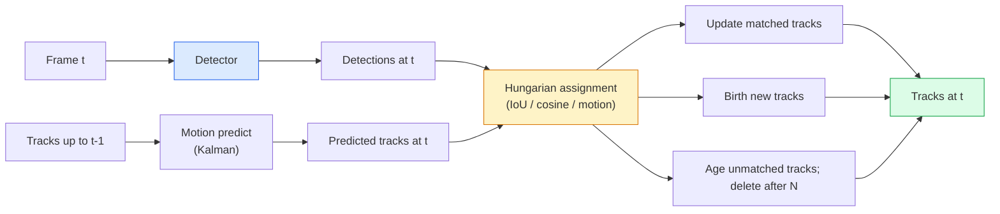

# تتبع متعددة الأشياء وذاكرة الفيديو

> التتبع هو الكشف بالإضافة إلى الرابط، اكتشاف كل إطار، تطابق كشف هذا الإطار مع آثار الإطار الأخير حسب التعرف.

**Type:** Build
**Languages:** Python
**Prerequisites:** Phase 4 Lesson 06 (YOLO Detection), Phase 4 Lesson 08 (Mask R-CNN), Phase 4 Lesson 24 (SAM 3)
**Time:** ~60 minutes

## أهداف التعلم

- تمييز التتبع عن طريق الكشف عن التتبع القائم على الاستفسار وتسمية أسرة الخوارزميات (SORT، DeepSORT، ByteTrack، BoT-SORT، SAM 2 متابعة الذاكرة، SAM 3.1 Object Multiplex)
- تنفيذ IoU + المهام المجرية من الصفر للتتبع الكلاسيكي عن طريق الكشف
- شرح بنك الذاكرة SAM 2 ولماذا يتعامل مع الإغلاق بشكل أفضل من الارتباط القائم على جهاز IoU
- اقرأ المقاييس التتبع الثلاثة (MOTA، IDF1، HOTA) واختيار أي منها مهم ل حالة الاستخدام المعينة

## المشكلة

جهاز الكشف يخبرك أين هي الأشياء في إطار واحد. جهاز تتبع يخبرك أي اكتشاف في إطار`t`هو نفس الكائن كاكتشاف في الإطار`t-1`بدون ذلك، لا يمكنك حساب الأشياء التي تعبر خطاً، أو تتبع كرة خلال إغلاق، أو معرفة "سيارة رقم 4 كانت في المسار لمدة 8 ثوانٍ".

التتبع ضروري لكل منتج يستخدم فيديو: تحليل الرياضة، المراقبة، القيادة الذاتية، تحليل الفيديو الطبي، مراقبة الحياة البرية، حساب العلامات الكلمة. يتم مشاركة كتلة بناء الأساسية: كاشف لكل إطار ، ونموذج حركة (مصفح كالمان أو شيء أكثر غنى) ، خطوة ربط (الخوارزمية المجرية على IoU / cosine / الميزات المتعلمة) ، ودور حياة المسار (الولادة ، التحديث ، الموت).

2026 جلب نمطين جدد: **SAM 2 memory-based tracking**(الذكرى المميزة بدلاً من الربط مع النموذج الحركي) و **SAM 3.1 Object Multiplex**هذه الدروس تمشي على الدرج الكلاسيكي أولاً، ثم النهج القائم على الذاكرة.

## المفهوم

### التتبع عن طريق الكشف



كل متابعة ستواجهها في عام 2026 هي تغير في هذه الحلقة.

- **SORT**(2016): فلتر كالمين + IoU المجرية. بسيط، سريع، لا نموذج مظهر.
- **DeepSORT**(2017): SORT + ميزة مظهر على أساس CNN لكل مسار (إدمج ReID). يتعامل مع العبور بشكل أفضل.
- **ByteTrack**(2021): يربط الكشف عن انخفاض الثقة بمرحلة ثانية؛ لا توجد حاجة إلى ميزات المظهر ولكن أفضل الأداء على MOT17.
- **BoT-SORT**(2022): بايت + تعويض حركة الكاميرا + ReID.
- **StrongSORT / OC-SORT** نَسَلُ ByteTrack مع تحرّك أفضل ومظهر أفضل.

### فلتر كالمين في فقرة واحدة

فلتر كالمان يحافظ على حالة كل مسار`(x, y, w, h, dx, dy, dw, dh)`مع متغيرات. في كل إطار،**predict**الدولة باستخدام نموذج السرعة المستمرة، ثم **update**مع الكشف المماثل. يثق التحديث في الكشف أكثر عندما يكون عدم اليقين التنبؤ مرتفعًا. وهذا يعطي مسارات سلسة وقدرة على مواصلة المسار عبر إغلاق قصير (1-5 إطارات).

كل متابعة كلاسيكية تستخدم مرشح كالمان في خطوة التنبؤ بالحركة.

### الخوارزمية المجرية

وذلك بسبب`M x N`المصفوفة التكلفة (القطارات x الكشف) ، العثور على المهام الواحدة إلى واحدة التي تقلل من التكلفة الإجمالية.`1 - IoU(track_bbox, detection_bbox)`أو تشابه كوسين سلبي في ميزات المظهر. وقت تشغيل هو O(((M+N) ^3) ؛ بالنسبة إلى M ، N حتى ~ 1000 هو سريع بما فيه الكفاية في Python عبر `scipy.optimize.linear_sum_assignment`. . .

### فكرة الرئيسية لـ (بايت تراك)

الجهاز القياسي يلقي أثرات أقل ثقة (< 0. 5).**second-stage candidates**: بعد مطابقة المسارات للكشفات عالية الثقة، تحاول المسارات غير المماثلة أن تطابق الكشفات منخفضة الثقة مع عتبة IoU أكثر ضعفًا قليلاً.

### SAM 2 تتبع القائم على الذاكرة

SAM 2 يتعامل مع الفيديو عن طريق الاحتفاظ بـ **memory bank**في الأطر اللاحقة، يتم تشفير الذاكرة ضد ميزات الإطار الجديد، ويُنتج المفكّر قناع لنفس الإطار الجديد.

لا يوجد مرشح كالمين، لا توجد مهمة مجرية، الجمعية متضمنة في عملية الاهتمام بالذاكرة

المزايا:
- قوية إلى الاحتياجات الكبيرة (الذاكرة تحمل هوية الحالة عبر العديد من الإطارات).
- المفردات المفتوحة عندما يتم دمجها مع طلبات النص في SAM 3
- يعمل بدون نموذج حرّك منفصل

السلبيات:
- أبطأ من بايت تراك لتتبع العديد من الأشياء.
- يزداد مصرف الذاكرة، يحد من نافذة السياق.

### SAM 3.1 كائن متعدد

تتبع SAM 2 / SAM 3 السابقة تحتفظ بنك ذاكرة منفصل في كل حالة. بالنسبة إلى 50 كائنًا ، 50 بنك ذاكرة. إنشاء Object Multiplex (مارس 2026) يدمرهم إلى ذاكرة مشتركة واحدة مع **per-instance query tokens**. تغير التكلفة بشكل شبه خطي في عدد الحالات

المجموعة المتعددة هي الإعداد المخصص الجديد لتتبع الحشد في عام 2026: حشد الحفلات، عمال المستودعات، تقاطعات المرور.

### ثلاث قياسات يجب أن تعرفها

- **MOTA (Multi-Object Tracking Accuracy)** 1 - (FN + FP + ID switches) / GT. يتم وزنها حسب نوع الخطأ؛ مقياس واحد يجمع بين إخفاقات الكشف والارتباط.
- **IDF1 (ID F1)** متوسط متناغم من دقة الهوية والذكرى. يركز على وجه التحديد على مدى الحفاظ على هوية كل مسار حقيقة الأرض مع مرور الوقت. أفضل من MOTA للمهام الحساسة على مفتاح الهوية.
- **HOTA (Higher Order Tracking Accuracy)** يتحلل إلى دقة الكشف (DetA) ودقة الرابطة (AssA). المعيار المجتمعي منذ عام 2020؛ الأكثر شمولا.

للمراقبة (من هو من): IDF1 هو ما تقوله. لتحليلات الرياضة (خطوط العد): HOTA. للمقارنة الأكاديمية العامة: HOTA.

```figure
cv3-track-assoc
```

## بناءها

### الخطوة الأولى: ماتريكة التكاليف القائمة على الـ IoU

```python
import numpy as np


def bbox_iou(a, b):
    """
    a, b: (N, 4) arrays of [x1, y1, x2, y2].
    Returns (N_a, N_b) IoU matrix.
    """
    ax1, ay1, ax2, ay2 = a[:, 0], a[:, 1], a[:, 2], a[:, 3]
    bx1, by1, bx2, by2 = b[:, 0], b[:, 1], b[:, 2], b[:, 3]
    inter_x1 = np.maximum(ax1[:, None], bx1[None, :])
    inter_y1 = np.maximum(ay1[:, None], by1[None, :])
    inter_x2 = np.minimum(ax2[:, None], bx2[None, :])
    inter_y2 = np.minimum(ay2[:, None], by2[None, :])
    inter = np.clip(inter_x2 - inter_x1, 0, None) * np.clip(inter_y2 - inter_y1, 0, None)
    area_a = (ax2 - ax1) * (ay2 - ay1)
    area_b = (bx2 - bx1) * (by2 - by1)
    union = area_a[:, None] + area_b[None, :] - inter
    return inter / np.clip(union, 1e-8, None)
```

### الخطوة الثانية: متابعة على أسلوب SORT الحد الأدنى

السرعة الثابتة Kalman تم حذفها للوقت القصير  نستخدم هنا ارتباط IoU بسيط ؛ في الإنتاج تنبؤ Kalman أمر ضروري.`sort`حزمة Python توفر الإصدار الكامل.

```python
from scipy.optimize import linear_sum_assignment


class Track:
    def __init__(self, tid, bbox, frame):
        self.id = tid
        self.bbox = bbox
        self.last_frame = frame
        self.hits = 1

    def update(self, bbox, frame):
        self.bbox = bbox
        self.last_frame = frame
        self.hits += 1


class SimpleTracker:
    def __init__(self, iou_threshold=0.3, max_age=5):
        self.tracks = []
        self.next_id = 1
        self.iou_threshold = iou_threshold
        self.max_age = max_age

    def step(self, detections, frame):
        if not self.tracks:
            for d in detections:
                self.tracks.append(Track(self.next_id, d, frame))
                self.next_id += 1
            return [(t.id, t.bbox) for t in self.tracks]

        track_boxes = np.array([t.bbox for t in self.tracks])
        det_boxes = np.array(detections) if len(detections) else np.empty((0, 4))

        iou = bbox_iou(track_boxes, det_boxes) if len(det_boxes) else np.zeros((len(track_boxes), 0))
        cost = 1 - iou
        cost[iou < self.iou_threshold] = 1e6

        matched_track = set()
        matched_det = set()
        if cost.size > 0:
            row, col = linear_sum_assignment(cost)
            for r, c in zip(row, col):
                if cost[r, c] < 1.0:
                    self.tracks[r].update(det_boxes[c], frame)
                    matched_track.add(r); matched_det.add(c)

        for i, d in enumerate(det_boxes):
            if i not in matched_det:
                self.tracks.append(Track(self.next_id, d, frame))
                self.next_id += 1

        self.tracks = [t for t in self.tracks if frame - t.last_frame <= self.max_age]
        return [(t.id, t.bbox) for t in self.tracks]
```

60 خطاً، يُجري اكتشافات لكل إطار، ويُعيدون هويات المسار لكل إطار، وتضيف الأنظمة الحقيقية توقعات (كالمان) ، وتطابقات (بايت تراك) للمرحلة الثانية، وخصائص المظهر.

### الخطوة الثالثة: اختبار المسار الاصطناعي

```python
def synthetic_frames(num_frames=20, num_objects=3, H=240, W=320, seed=0):
    rng = np.random.default_rng(seed)
    starts = rng.uniform(20, 200, size=(num_objects, 2))
    velocities = rng.uniform(-5, 5, size=(num_objects, 2))
    frames = []
    for f in range(num_frames):
        dets = []
        for i in range(num_objects):
            cx, cy = starts[i] + f * velocities[i]
            dets.append([cx - 10, cy - 10, cx + 10, cy + 10])
        frames.append(dets)
    return frames


tracker = SimpleTracker()
for f, dets in enumerate(synthetic_frames()):
    tracks = tracker.step(dets, f)
```

ثلاث أشياء تتحرك في خطوط مستقيمة يجب أن تبقي هوياتها على جميع الإطارات العشرين

### الخطوة الرابعة: مقياس تحويل الهوية

```python
def count_id_switches(tracks_per_frame, gt_per_frame):
    """
    tracks_per_frame:  list of list of (track_id, bbox)
    gt_per_frame:      list of list of (gt_id, bbox)
    Returns number of ID switches.
    """
    prev_assignment = {}
    switches = 0
    for tracks, gts in zip(tracks_per_frame, gt_per_frame):
        if not tracks or not gts:
            continue
        t_boxes = np.array([b for _, b in tracks])
        g_boxes = np.array([b for _, b in gts])
        iou = bbox_iou(g_boxes, t_boxes)
        for g_idx, (gt_id, _) in enumerate(gts):
            j = iou[g_idx].argmax()
            if iou[g_idx, j] > 0.5:
                t_id = tracks[j][0]
                if gt_id in prev_assignment and prev_assignment[gt_id] != t_id:
                    switches += 1
                prev_assignment[gt_id] = t_id
    return switches
```

هذه مقياسة مبسطة IDF1 المجاورة: حساب عدد المرات التي يغير فيها جسم الحقيقة الأرضية هويته المتنبؤة المخصصة.`py-motmetrics`و`TrackEval`. . .

## استخدمها

متابعة الإنتاج في عام 2026:

- `ultralytics` YOLOv8 + ByteTrack / BoT-SORT مدمج`results = model.track(source, tracker="bytetrack.yaml")`-المتخلفة
- `supervision`(روبوت)  غلفات بايت تراك بالإضافة إلى أدوات التعليق.
- SAM 2 / SAM 3.1  تتبع القائم على الذاكرة عبر `processor.track()`. . .
- كومة مخصصة: الكشف (YOLOv8 / RT-DETR) + `sort-tracker`- لا ، لا`OC-SORT`- لا ، لا`StrongSORT`. . .

الاختيار:

- المشاة / السيارات / الصناديق عند 30 + fps: **ByteTrack with ultralytics**. . .
- العديد من الحالات من فئة واحدة في الحشد:**SAM 3.1 Object Multiplex**. . .
- الاحتياجات الثقيلة التي تظهر بشكل واضح: **DeepSORT / StrongSORT**(ميزات إعادة التأمين)
- الرياضة / التفاعلات المعقدة: **BoT-SORT**أو متابعة تعلم (MOTRv3).

## أرسله

هذا الدرس ينتج عن:

- `outputs/prompt-tracker-picker.md` يختار SORT / ByteTrack / BoT-SORT / SAM 2 / SAM 3.1 نوع المشهد المحدد، وأنماط الإغلاق، وميزانية التأخير.
- `outputs/skill-mot-evaluator.md`يكتب قناة تقييم كاملة لموجة الطيران / IDF1 / HOTA ضد مسارات الحقيقة الأرضية.

## التمارين

1. **(Easy)**قم بتشغيل المتعقب الاصطناعي أعلاه مع 3، 10 و 30 كائن، وأبلغ عن عدد المفتاحات في كل حالة، وتحديد المكان الذي يبدأ فيه الفشل في الربط بسيط فقط مع جهاز IoU.
2. **(Medium)**أضف خطوة تنبؤ كالمان بسرعة ثابتة قبل الربط. أظهر أن الاحتيال القصير (2-3 إطار) لم يعد يسبب مفاتيح الهوية.
3. **(Hard)**دمج جهاز تعقب القائم على الذاكرة في SAM 2 (via `transformers`) كخلفية بديلة للمعقب. قم بتشغيل كل من SimpleTracker و SAM 2 على مقطع 30 ثانية من الحشد ومقارنة عدد مبدئي الهوية، وتصنيف يدويا هويات الحقيقة الأرضية لخمسة أشخاص بارزين.

## الشروط الرئيسية

| Term | What people say | What it actually means |
|------|----------------|----------------------|
| Tracking-by-detection | "Detect then associate" | Per-frame detector + Hungarian assignment on IoU / appearance |
| Kalman filter | "Motion predict" | Linear dynamics + covariance for smooth track predictions and occlusion handling |
| Hungarian algorithm | "Optimal assignment" | Solves the minimum-cost bipartite matching problem; `scipy.optimize.linear_sum_assignment` |
| ByteTrack | "Low-confidence second pass" | Re-match unmatched tracks to low-confidence detections to recover short occlusions |
| DeepSORT | "SORT + appearance" | Adds a ReID feature for cross-frame matching; better for ID preservation |
| Memory bank | "SAM 2 trick" | Per-instance spatio-temporal features stored across frames; cross-attention replaces explicit association |
| Object Multiplex | "SAM 3.1 shared memory" | Single shared memory with per-instance queries for fast many-object tracking |
| HOTA | "Modern tracking metric" | Decomposes into detection and association accuracy; community standard |

## المزيد من القراءة

- [SORT (Bewley et al., 2016)](https://arxiv.org/abs/1602.00763) ورقة التتبع عن طريق الكشف الحد الأدنى
- [DeepSORT (Wojke et al., 2017)](https://arxiv.org/abs/1703.07402) يضيف ميزة المظهر
- [ByteTrack (Zhang et al., 2022)](https://arxiv.org/abs/2110.06864) ثقة منخفضة في الممر الثاني
- [BoT-SORT (Aharon et al., 2022)](https://arxiv.org/abs/2206.14651) تعويضات حركة الكاميرا
- [HOTA (Luiten et al., 2020)](https://arxiv.org/abs/2009.07736) متريقي التتبع المتفكك
- [SAM 2 video segmentation (Meta, 2024)](https://ai.meta.com/sam2/) متابعة القائمة على الذاكرة
- [SAM 3.1 Object Multiplex (Meta, March 2026)](https://ai.meta.com/blog/segment-anything-model-3/)
