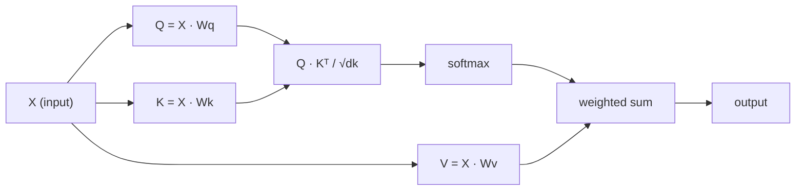

# الاهتمام الذاتي من الصفر

> الانتباه هو جدول بحث حيث كل كلمة تسأل "من يهمني؟" - وتعلم الإجابة.

**Type:** Build
**Languages:** Python
**Prerequisites:** Phase 3 (Deep Learning Core), Phase 5 Lesson 10 (Sequence-to-Sequence)
**Time:** ~90 minutes

## أهداف التعلم

- تنفيذ الاهتمام الذاتي للمنتج النقطي على نطاق واسع من الصفر باستخدام NumPy فقط ، بما في ذلك استفسارات / مفتاح / تقديرات القيمة والجمع الموزن لـ softmax
- بناء طبقة الاهتمام متعددة الرؤوس التي تقسم الرؤوس، وحساب الاهتمام المتوازي، وتجمع النتائج
- تتبع كيفية استيعاب ماتريكية الاهتمام علاقات رمزية وشرح لماذا تحديد النطاق ب sqrt(d_k) يمنع التشبث المكثف
- تطبيق التخفيض العوجي لتحويل الاهتمام الثنائي الاتجاه إلى الاهتمام التراجعي (على شكل المُعزل)

## المشكلة

تقوم RNN بعملية تسلسلات رمز واحد في وقت واحد. بحلول الوقت الذي تصل فيه إلى رمز 50 ، تم ضغط المعلومات من رمز 1 من خلال 50 خطوة ضغط. يتم سحق الاعتمادات طويلة المدى إلى حالة مخفية ذات الحجم الثابت - وهو عقدة لا يحلها أي كمية من إطار LSTM بالكامل.

أظهرت ورقة الاهتمام في 2014 Bahdanau الإصلاح: دع المفكّر ينظر إلى الوراء في كل موقف من المشفّرات ويقرر أي منها مهم للخطوة الحالية. ولكنّها كانت لا تزال مقبّلة على RNN. طرح ورقة 2017 "الاهتمام هو كل ما تحتاجه" سؤالًا أكثر حيوية: ماذا لو كان الاهتمام هو الجهاز * الوحيد*؟ لا تكرار. لا تغير. فقط الاهتمام.

الاهتمام الذاتي يسمح لكل موقع في تسلسل يراقب كل موقع آخر في خطوة متوازية واحدة. هذا ما يجعل المحولات سريعة، قابلة للتوسع، والسيطرة.

## المفهوم

### التشابه في البحث عن قاعدة البيانات

فكر في الاهتمام كبحث بسيط في قاعدة البيانات:

```
Traditional database:
  Query: "capital of France"  -->  exact match  -->  "Paris"

Attention:
  Query: "capital of France"  -->  similarity to ALL keys  -->  weighted blend of ALL values
```

كل رمز يخلق ثلاثة متجهات:
- **Query (Q)**"ما الذي أبحث عنه؟"
- **Key (K)**"ما الذي يحتوي عليه؟"
- **Value (V)**: "ما المعلومات التي أقدمها إذا تم اختيارها؟"

إن نسبة النقاط بين استفسار وجميع المفاتيح تنتج نقاط الاهتمام. تعني النسبة العالية "تطابق هذه المفاتيح استفساري". هذه النقاط تزن القيم. الخروج هو مجموع مقيم من القيم.

### Q، K، V الحساب

كل إضافة رمزية يتم عرضها من خلال ثلاث ماتريصات وزن تعلم:

```
Input embeddings (sequence of n tokens, each d-dimensional):

  X = [x1, x2, x3, ..., xn]       shape: (n, d)

Three weight matrices:

  Wq  shape: (d, dk)
  Wk  shape: (d, dk)
  Wv  shape: (d, dv)

Projections:

  Q = X @ Wq    shape: (n, dk)      each token's query
  K = X @ Wk    shape: (n, dk)      each token's key
  V = X @ Wv    shape: (n, dv)      each token's value
```

بصرياً، لنقل:

```
             Wq
  x_i ------[*]------> q_i    "What am I looking for?"
       |
       |     Wk
       +----[*]------> k_i    "What do I contain?"
       |
       |     Wv
       +----[*]------> v_i    "What do I offer?"
```

### ماتريسكة الانتباه

بمجرد أن يكون لديك Q، K، V لجميع الرموز، نقاط الاهتمام تشكل ماتريكس:

```
Scores = Q @ K^T    shape: (n, n)

              k1    k2    k3    k4    k5
        +-----+-----+-----+-----+-----+
   q1   | 2.1 | 0.3 | 0.1 | 0.8 | 0.2 |   <- how much q1 attends to each key
        +-----+-----+-----+-----+-----+
   q2   | 0.4 | 1.9 | 0.7 | 0.1 | 0.3 |
        +-----+-----+-----+-----+-----+
   q3   | 0.2 | 0.6 | 2.3 | 0.5 | 0.1 |
        +-----+-----+-----+-----+-----+
   q4   | 0.9 | 0.1 | 0.4 | 1.7 | 0.6 |
        +-----+-----+-----+-----+-----+
   q5   | 0.1 | 0.3 | 0.2 | 0.5 | 2.0 |
        +-----+-----+-----+-----+-----+

Each row: one token's attention over the entire sequence
```

شاهد استفسار واحد في كل مرة مسح المفاتيح: كل سطر يسجل كل رمز، softmax يحول النتائج إلى وزنه، و متجه السياق هو مزيج وزنه من القيم.

```figure
attention-matrix
```

### لماذا النطاق؟

إن منتجات النقاط تنمو مع الأبعاد dk. إذا dk = 64, يمكن أن تكون منتجات النقاط في نطاق العشرات، مما يدفع softmax إلى مناطق حيث تختفي التراجع.

```
Scaled scores = (Q @ K^T) / sqrt(dk)
```

هذا يبقي القيم في نطاق حيث softmax ينتج تراجعات مفيدة.

### Softmax يحول النتائج إلى الوزن

تحويل Softmax النتائج الخام إلى توزيع الاحتمالات عبر كل سطر:

```
Raw scores for q1:   [2.1, 0.3, 0.1, 0.8, 0.2]
                            |
                         softmax
                            |
Attention weights:   [0.52, 0.09, 0.07, 0.14, 0.08]   (sums to ~1.0)
```

الآن كل رمز لديه مجموعة من الوزن تقول كم يجب أن يشاهد كل رمز آخر.

### المجموع الموزن للقيم

إن الخروج النهائي لكل رمز هو جمع موازن لجميع متجهات القيمة:

```
output_i = sum( attention_weight[i][j] * v_j  for all j )

For token 1:
  output_1 = 0.52 * v1 + 0.09 * v2 + 0.07 * v3 + 0.14 * v4 + 0.08 * v5
```

### خط الأنابيب الكامل



الصيغة في سطر واحد:

```
Attention(Q, K, V) = softmax( Q @ K^T / sqrt(dk) ) @ V
```

```figure
softmax-attention-scaling
```

## بناءها

### الخطوة الأولى: Softmax من الصفر

Softmax يحول اللغات الخام إلى احتمالات.

```python
import numpy as np

def softmax(x):
    shifted = x - np.max(x, axis=-1, keepdims=True)
    exp_x = np.exp(shifted)
    return exp_x / np.sum(exp_x, axis=-1, keepdims=True)

logits = np.array([2.0, 1.0, 0.1])
print(f"logits:  {logits}")
print(f"softmax: {softmax(logits)}")
print(f"sum:     {softmax(logits).sum():.4f}")
```

### الخطوة الثانية: الاهتمام المتوسط للمنتج

الوظيفة الأساسية تأخذ المصفوفات Q، K، V وتعيد خروج الاهتمام زائد المصفوفة الوزن.

```python
def scaled_dot_product_attention(Q, K, V):
    dk = Q.shape[-1]
    scores = Q @ K.T / np.sqrt(dk)
    weights = softmax(scores)
    output = weights @ V
    return output, weights
```

### الخطوة الثالثة: دراسة الاهتمام الذاتي مع التنبؤات المكتسبة

وحدة مراقبة الذات كاملة مع Wq، Wk، Wv المصفوفات الوزن باستخدام قياس كاسبير.

```python
class SelfAttention:
    def __init__(self, d_model, dk, dv, seed=42):
        rng = np.random.default_rng(seed)
        scale = np.sqrt(2.0 / (d_model + dk))
        self.Wq = rng.normal(0, scale, (d_model, dk))
        self.Wk = rng.normal(0, scale, (d_model, dk))
        scale_v = np.sqrt(2.0 / (d_model + dv))
        self.Wv = rng.normal(0, scale_v, (d_model, dv))
        self.dk = dk

    def forward(self, X):
        Q = X @ self.Wq
        K = X @ self.Wk
        V = X @ self.Wv
        output, weights = scaled_dot_product_attention(Q, K, V)
        return output, weights
```

### الخطوة الرابعة: قم بتطبيقها على جملة

إخلق إضافة مزيفة لعبارة وشاهد التركيز

```python
sentence = ["The", "cat", "sat", "on", "the", "mat"]
n_tokens = len(sentence)
d_model = 8
dk = 4
dv = 4

rng = np.random.default_rng(42)
X = rng.normal(0, 1, (n_tokens, d_model))

attn = SelfAttention(d_model, dk, dv, seed=42)
output, weights = attn.forward(X)

print("Attention weights (each row: where that token looks):\n")
print(f"{'':>6}", end="")
for token in sentence:
    print(f"{token:>6}", end="")
print()

for i, token in enumerate(sentence):
    print(f"{token:>6}", end="")
    for j in range(n_tokens):
        w = weights[i][j]
        print(f"{w:6.3f}", end="")
    print()
```

### الخطوة 5: تصور الاهتمام مع خريطة حرارة ASCII

خريطة أوزان الاهتمام إلى الشخصيات للحصول على رؤية سريعة.

```python
def ascii_heatmap(weights, tokens, chars=" ░▒▓█"):
    n = len(tokens)
    print(f"\n{'':>6}", end="")
    for t in tokens:
        print(f"{t:>6}", end="")
    print()

    for i in range(n):
        print(f"{tokens[i]:>6}", end="")
        for j in range(n):
            level = int(weights[i][j] * (len(chars) - 1) / weights.max())
            level = min(level, len(chars) - 1)
            print(f"{'  ' + chars[level] + '   '}", end="")
        print()

ascii_heatmap(weights, sentence)
```

## استخدمها

(بيتورش)`nn.MultiheadAttention`يفعل بالضبط ما بنيناه، بالإضافة إلى التقسيم متعدد الرؤوس والتنبيهات الخارجة:

```python
import torch
import torch.nn as nn

d_model = 8
n_heads = 2
seq_len = 6

mha = nn.MultiheadAttention(embed_dim=d_model, num_heads=n_heads, batch_first=True)

X_torch = torch.randn(1, seq_len, d_model)

output, attn_weights = mha(X_torch, X_torch, X_torch)

print(f"Input shape:            {X_torch.shape}")
print(f"Output shape:           {output.shape}")
print(f"Attention weight shape: {attn_weights.shape}")
print(f"\nAttn weights (averaged over heads):")
print(attn_weights[0].detach().numpy().round(3))
```

الفرق الرئيسي: توجه الرأس المتعدد يعمل على وظائف الاهتمام المتعددة بالتوازي ، كل منها مع توقعات Q ، K ، V الخاصة به من الحجم dk = d_model / n_heads ، ثم يجمع النتائج. وهذا يسمح للنموذج بالانتباه إلى أنواع العلاقة المختلفة في وقت واحد.

## أرسله

هذا الدرس ينتج عن:
- `outputs/prompt-attention-explainer.md`- طلب لشرح الاهتمام من خلال تقارنة البحث في قاعدة البيانات

## التمارين

1. تغيير`scaled_dot_product_attention`للاستقبال من ماتريكس القناع الاختياري الذي يضع بعض المواقع إلى اللانهاية السلبية قبل softmax (هكذا يعمل القناع السببية / المفكّر)
2. تنفيذ الاهتمام متعدد الرؤوس من الصفر: تقسيم Q، K، V إلى `n_heads`قطع، تشغيل الاهتمام على كل واحد، وتقرب، ونشر من خلال المصفوفة الوزن النهائي
3. خذ جملتين مختلفتين ذات الطول، ومدعها من خلال نفس مثال الاهتمام الذاتي، و قارن أنماط اهتمامهم. ما الذي يتغير؟ ما الذي يبقى نفسه؟

## الشروط الرئيسية

| Term | What people say | What it actually means |
|------|----------------|----------------------|
| Query (Q) | "The question vector" | A learned projection of the input that represents what information this token is looking for |
| Key (K) | "The label vector" | A learned projection that represents what information this token contains, matched against queries |
| Value (V) | "The content vector" | A learned projection carrying the actual information that gets aggregated based on attention scores |
| Scaled dot-product attention | "The attention formula" | softmax(QK^T / sqrt(dk)) @ V - scaling prevents softmax saturation in high dimensions |
| Self-attention | "The token looks at itself and others" | Attention where Q, K, V all come from the same sequence, letting every position attend to every other position |
| Attention weights | "How much focus" | A probability distribution over positions, produced by softmax over scaled dot products |
| Multi-head attention | "Parallel attention" | Running multiple attention functions with different projections, then concatenating results for richer representations |

## المزيد من القراءة

- [Attention Is All You Need (Vaswani et al., 2017)](https://arxiv.org/abs/1706.03762)- ورق المحول الأصلي
- [The Illustrated Transformer (Jay Alammar)](https://jalammar.github.io/illustrated-transformer/)- أفضل مشروع بصري من خلال المعماريات الكاملة
- [The Annotated Transformer (Harvard NLP)](https://nlp.seas.harvard.edu/annotated-transformer/)- تنفيذ PyTorch خطًا بعد خط مع تفسير
