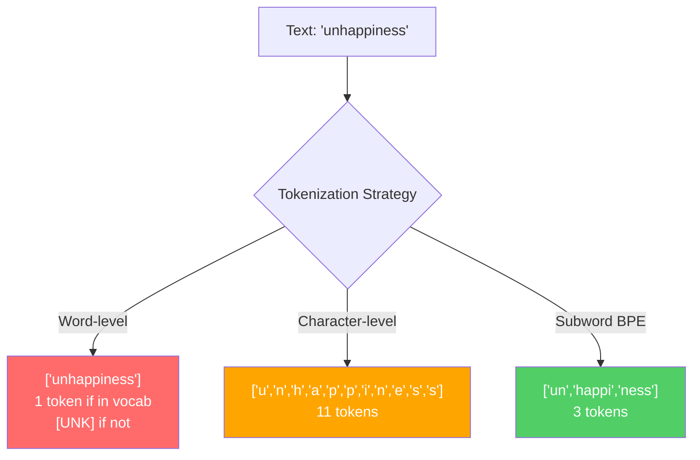
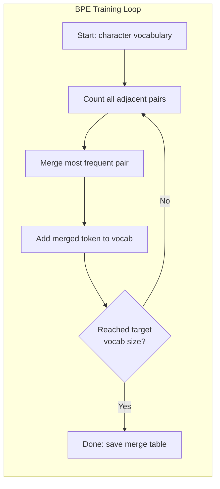
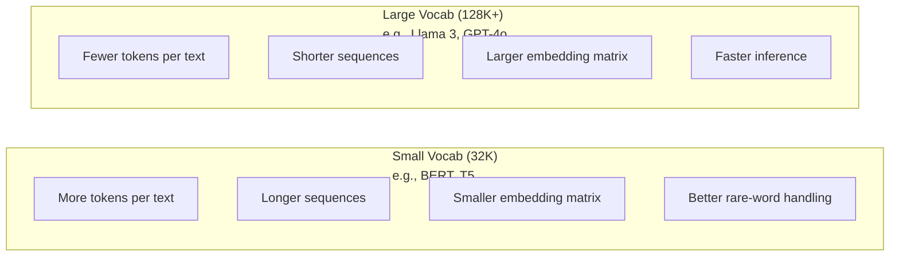

# الـ "BPE" و "WordPiece" و "SentencePiece"

> ماجستيرك في العلوم لا يقرأ الإنجليزية، إنه يقرأ الأرقام الكاملة. الجهاز الذي يقرر ما إذا كانت تلك الأرقام الكاملة تحمل معنى أو تضيعها.

**Type:** Build
**Languages:** Python
**Prerequisites:** Phase 05 (NLP Foundations)
**Time:** ~90 minutes

## أهداف التعلم

- تنفيذ خوارزميات التكنولوجيا BPE و WordPiece و Unigram من الصفر ومقارنة استراتيجيات دمجها
- شرح كيف يؤثر حجم المفردات على كفاءة النموذج: إنما تكون القليلة جداً تخلق تسلسلات طويلة، والنفايات الكبيرة جداً تضم ملامح
- تحليل أدوات التكنولوجيا عبر اللغات والرموز، وتحديد أين يتم تفكيك التكنولوجيا المحددة
- استخدم مكتبات الـ tiktoken و phrasepiece لتعريف النص وتفحص هويات الـ token الـ ID الناتجة

## المشكلة

ماجستيرك في العلوم لا يقرأ الإنجليزية، لا يقرأ أي لغة، يقرأ الأرقام.

الفجوة بين "مرحباً، العالم!" و [15496, 11, 995, 0] هي الوهم. يجب تحويل كل كلمة، كل مساحة، كل علامة نقطة إلى عدد كامل قبل أن يتم معالجتها من قبل نموذج. هذا التحويل ليس محايداً. يخبز الافتراضات في النموذج التي لا يمكن إلغاءها في وقت لاحق.

إذا أخطأت في هذا النموذج، ستفقد القدرة على تشفير الكلمات المشتركة مع رموز متعددة. "لسوء الحظ" يصبح أربعة رموز بدلاً من واحدة. نافذة السياق الخاصة بك 128K فقط ضيق بنسبة 75% بالنسبة النص ثقيل في الكلمات متعددة الأحرف. إذا قمت بذلك بشكل صحيح، فإن نفس النافذة السياقية تحمل ضعف معنى. الفرق بين "هذا النموذج يتعامل مع الكود بشكل جيد" و "هذا النموذج يختنق على Python" غالبا ما يتراجع إلى كيفية تدريب الجهاز.

كل مكالمة API تقوم بها إلى GPT-4 أو Claude يتم تسعيرها لكل رمز. كل رمز يولد نموذجك تكاليف الحساب. كلما قل عدد الرموز اللازمة لتمثيل إنتاج، كلما أسرع استنتاج نهاية إلى نهاية. التوكن ليس معالجة مسبقة. إنها معمارة.

## المفهوم

### ثلاثة طرق فشلت (وواحدة فازت)

هناك ثلاثة طرق واضحة لتحويل النص إلى أرقام. اثنان منها لا تعمل على المقياس.

**Word-level tokenization**"القطة قامت" تصبح ["The"، "cat", "sat"]. بسيطة. لكن ماذا عن "التوكينيزة"؟ أو "GPT-4o"؟ أو كلمة مضافة ألمانية مثل "Geschwindigkeitsbegrenzung"? مستوى الكلمات يتطلب مخزونًا كبيرًا من المفردات لتغطية كل كلمة في كل لغة. تفوت كلمة وتصبح خائفاً`[UNK]`رمز -- طريقة النموذج للقول "لا أعرف ما هذا". الإنجليزية وحدها لديها أكثر من مليون شكل كلمة. أضف رمز، عناوين URL، علامة علمية، و 100 لغة أخرى و تحتاج إلى مخزون لغوي لا نهاية له.

**Character-level tokenization**يذهب الاتجاه الآخر. "مرحبا" يصبح ["h"، "e"، "l"، "l"، "o"". المفردات صغيرة (بضع مئات من الأحرف). لا توجد رموز مجهولة أبدا. ولكن التسلسل تصبح طويلة للغاية. جملة التي ستكون رموز مستوى 10 كلمات تصبح رموز مستوى 50 حرف. يجب على النموذج أن يتعلم أن "t"، "h"، "e" معا تعني "ال" -- تحرق قدرة الاهتمام على شيء يتعلمه الإنسان في سن الثلاث سنوات.

**Subword tokenization**يجد النقطة الحلوة. الكلمات الشائعة تبقى كاملة: "ال" هو رمز واحد. الكلمات النادرة تتحلل إلى قطع ذات مغزى: "السوء" يصبح ["غير"، "حسن"، "نيس"]. الكلمات تبقى قابلة للتحكم (30K إلى 128K رموز). تتبقى التسلسل قصيرة. الرموز غير المعروفة تختفي في الأساس لأن أي كلمة يمكن بناءها من قطع من الكلمات الفرعية.

كل ماجستير في العلوم الحديثة يستخدم رمزية كلمات فرعية. GPT-2، GPT-4، BERT، Llama 3، كلود -- كل منهم. السؤال هو أي خوارزمية.



### BPE: تشفير زوج البايت

بيبي هو خوارزمية ضغط طموحة تم إعادة تطبيقها للتكنولوجيا. الفكرة بسيطة بما فيه الكفاية لتتناسب على بطاقة مؤشر.

ابدأ بأحرف فردية، احسب كل زوج مجاور في مجموعة التدريبات، دمج الزوج الأكثر شيوعاً في رمز جديد، كرر حتى تصل إلى حجم المفردات المستهدفة.

```figure
tokenizer-bpe
```

هنا هي BPE تعمل على مجموعة صغيرة مع الكلمات "أدنى" "أدنى" و "أحدث":

```
Corpus (with word frequencies):
  "lower"  x5
  "lowest" x2
  "newest" x6

Step 0 -- Start with characters:
  l o w e r       (x5)
  l o w e s t     (x2)
  n e w e s t     (x6)

Step 1 -- Count adjacent pairs:
  (e,s): 8    (s,t): 8    (l,o): 7    (o,w): 7
  (w,e): 13   (e,r): 5    (n,e): 6    ...

Step 2 -- Merge most frequent pair (w,e) -> "we":
  l o we r        (x5)
  l o we s t      (x2)
  n e we s t      (x6)

Step 3 -- Recount and merge (e,s) -> "es":
  l o we r        (x5)
  l o we s t      (x2)    <- 'es' only forms from 'e'+'s', not 'we'+'s'
  n e we s t      (x6)    <- wait, the 'e' before 'we' and 's' after 'we'

Actually tracking this precisely:
  After "we" merge, remaining pairs:
  (l,o): 7   (o,we): 7   (we,r): 5   (we,s): 8
  (s,t): 8   (n,e): 6    (e,we): 6

Step 3 -- Merge (we,s) -> "wes" or (s,t) -> "st" (tied at 8, pick first):
  Merge (we,s) -> "wes":
  l o we r        (x5)
  l o wes t       (x2)
  n e wes t       (x6)

Step 4 -- Merge (wes,t) -> "west":
  l o we r        (x5)
  l o west        (x2)
  n e west        (x6)

...continue until target vocab size reached.
```

جدول المدمج هو رمز التشفير. لتشفير النص الجديد، قم بتطبيق المدمج في الترتيب الذي تعلمته. يحدد مجموعة التدريب التي توجد فيها المدمجات، ويتغير هذا الخيار بشكل دائم ما يراه النموذج.



### مستوى البايت BPE (GPT-2، GPT-3، GPT-4)

يعمل BPE القياسي على أحرف يونيكود. يعمل BPE على مستوى البايت على البايتات الخام (0-255). هذا يعطيك ذخيرة لفظية أساسية من بالضبط 256 ، يتعامل مع أي لغة أو تشفير ، ولا ينتج أية رمز مجهول.

أطلقت GPT-2 هذا النهج. يغطي المفردات الأساسية كل بايت ممكن. يدمج BPE على أعلى ذلك. تقوم مكتبة تيكتون OpenAI بتنفيذ BPE على مستوى بايت مع هذه أحجام المفردات:

- GPT-2: 50257 رمزا
- GPT-3.5/GPT-4: ~100،256 رمز (تشفير cl100k_base)
- GPT-4o: 200،019 رمز (o200k_base encoding)

### ورودبيس (BERT)

يبدو WordPiece مشابهًا لـ BPE ولكن الاختيارات تتضامن بشكل مختلف. بدلاً من التردد الخام، يزيد من احتمالات بيانات التدريب:

```
BPE merge criterion:      count(A, B)
WordPiece merge criterion: count(AB) / (count(A) * count(B))
```

يسأل BPE: "أيهما يظهر أكثر في كثير من الأحيان؟" يسأل WordPiece: "أيهما يظهر معا أكثر من ما كنت تتوقع من العدفة؟" هذا الفرق الخفيف ينتج مفردات مختلفة. WordPiece يفضل الاندماج حيث يحدث التزامن بشكل مفاجئ، وليس فقط متكرر.

WordPiece يستخدم أيضاً إضافة "##" للكلمات الفرعية المتابعة:

```
"unhappiness" -> ["un", "##happi", "##ness"]
"embedding"   -> ["em", "##bed", "##ding"]
```

يخبرك مقدمة "##" أن هذه القطعة تستمر في رمز سابق. يستخدم BERT WordPiece مع ذخيرة لغوية من 30،522 رمز. كل فاريان BERT - DistilBERT، روبرتا Tokenizer هو في الواقع BPE، ولكن BERT نفسها WordPiece.

### جملة (لاما، T5)

تعامل SentencePiece المدخلات كدفق خام من أحرف يونيكود ، بما في ذلك الفضاء الأبيض. لا يوجد خطوة من قبل التوكن. لا توجد قواعد لغوية محددة حول حدود الكلمات. وهذا يجعلها لغوية جدًا - تعمل على اللغات الصينية واليابانية والتايلندية وغيرها من اللغات التي لا تفصل فيها الفضاء عن الكلمات.

يدعم SentencePiece خوارزميتين:
- **BPE mode**: نفس منطق الاندماج مثل BPE القياسية، تطبيق على تسلسلات الحروف الخام
- **Unigram mode**يبدأ مع مجموعة كبيرة من المفردات ويزيل بشكل متكرر الرموز التي لا تؤثر على الاحتمال العام. عكس BPE -- التقط بدلا من الاندماج.

تطبق Llama 2 SentencePiece BPE مع ذخيرة لغوية من 32000 رمز. ت5 تستخدم SentencePiece Unigram مع 32000 رمز. ملاحظة: تم التبديل إلى رمز BPE على مستوى البايت القائم على التكوكين مع 128 256 رمز.

### حجم الكلمات التجارة

هذا قرار هندسي حقيقي مع عواقب قابلة للقياس



أرقام ملموسة. بالنسبة لمفرد 128K مع تضمينات 4,096 بعد، فإن ماتريكية تضمينها وحدها هي 128,000 × 4,096 = 524 مليون ملامح. بالنسبة لمفرد 32K، فإنه هو 131 مليون ملامح. وهذا هو فرق ملامح 400M عن اختيار الوهم وحده.

لكن المفردات الكبيرة تضغط النص بشكل أكثر عدوانية. نفس الفقرة الإنجليزية التي تأخذ 100 رمزا مع مفردة 32K قد تأخذ 70 رمزا مع مفردة 128K. وهذا يعني 30% أقل من المشاركات المقدمة خلال توليد. بالنسبة لنموذج يخدم الملايين من الطلبات، وهذا هو خفض مباشر في تكلفة الحوسبة.

الاتجاه واضح: حجم المفردات ينمو. GPT-2 استخدم 50.257. GPT-4 يستخدم ~ 100K. Llama 3 يستخدم 128K. GPT-4o يستخدم 200K.

| Model | Vocab Size | Tokenizer Type | Avg Tokens per English Word |
|-------|-----------|----------------|---------------------------|
| BERT | 30,522 | WordPiece | ~1.4 |
| GPT-2 | 50,257 | Byte-level BPE | ~1.3 |
| Llama 2 | 32,000 | SentencePiece BPE | ~1.4 |
| GPT-4 | ~100,256 | Byte-level BPE | ~1.2 |
| Llama 3 | 128,256 | Byte-level BPE (tiktoken) | ~1.1 |
| GPT-4o | 200,019 | Byte-level BPE | ~1.0 |

### الضريبة المتعددة اللغات

الـ Tokenizer المتدربون بشكل أساسي على اللغة الإنجليزية وحشيون بالنسبة للغات الأخرى. النص الكوري في Tokenizer GPT-2 يبلغ متوسط 2-3 رموز لكل كلمة. الصيني يمكن أن يكون أسوأ. وهذا يعني أن المستخدم الكوري لديه نافذة سياقية هي نصف حجم المستخدم الإنجليزي - يدفع نفس السعر مقابل كثافة المعلومات أقل.

هذا هو السبب في أن Llama 3 قد ربع مرات مخزون الكلمات من 32K إلى 128K. المزيد من الرموز المخصصة لخطوط غير الإنجليزية يعني ضغط أكثر عدالة بين اللغات.

```figure
tokenizer-tradeoff
```

## بناءها

### الخطوة الأولى: إشارة مستوى الشخصيات

تبدأ من الأساس. رمزية على مستوى الأحرف تقوم بتخريط كل حرف إلى نقطة رمز يونيكود. لا حاجة للتدريب. لا توكنات مجهولة. مجرد خريطة مباشرة.

```python
class CharTokenizer:
    def encode(self, text):
        return [ord(c) for c in text]

    def decode(self, tokens):
        return "".join(chr(t) for t in tokens)
```

"مرحباً" يصبح [104, 101, 108, 108, 111]. كل شخصية هي رمزها الخاص. هذه هي الخط الأساسي الذي نتحسن عليه.

### الخطوة 2: BPE Tokenizer من الصفر

التنفيذ الحقيقي. نحن نتدرب على البايتات الخام (مثل GPT-2) ، والعد أزواج، والدمج الأكثر تكرارا، وتسجيل كل دمج في الترتيب. الجدول دمج هو tokenizer.

```python
from collections import Counter

class BPETokenizer:
    def __init__(self):
        self.merges = {}
        self.vocab = {}

    def _get_pairs(self, tokens):
        pairs = Counter()
        for i in range(len(tokens) - 1):
            pairs[(tokens[i], tokens[i + 1])] += 1
        return pairs

    def _merge_pair(self, tokens, pair, new_token):
        merged = []
        i = 0
        while i < len(tokens):
            if i < len(tokens) - 1 and tokens[i] == pair[0] and tokens[i + 1] == pair[1]:
                merged.append(new_token)
                i += 2
            else:
                merged.append(tokens[i])
                i += 1
        return merged

    def train(self, text, num_merges):
        tokens = list(text.encode("utf-8"))
        self.vocab = {i: bytes([i]) for i in range(256)}

        for i in range(num_merges):
            pairs = self._get_pairs(tokens)
            if not pairs:
                break
            best_pair = max(pairs, key=pairs.get)
            new_token = 256 + i
            tokens = self._merge_pair(tokens, best_pair, new_token)
            self.merges[best_pair] = new_token
            self.vocab[new_token] = self.vocab[best_pair[0]] + self.vocab[best_pair[1]]

        return self

    def encode(self, text):
        tokens = list(text.encode("utf-8"))
        for pair, new_token in self.merges.items():
            tokens = self._merge_pair(tokens, pair, new_token)
        return tokens

    def decode(self, tokens):
        byte_sequence = b"".join(self.vocab[t] for t in tokens)
        return byte_sequence.decode("utf-8", errors="replace")
```

حلقة التدريب هي جوهر BPE: إعداد أزواج، دمج الفائز، تكرار. كل دمج يقلل من إجمالي عدد الرموز. بعد `num_merges`في الجولات، تنمو المفردات من 256 (بايت أساسي) إلى 256 + رقم_مدمج.

يطبق التشفير الاندماج في الترتيب الدقيق الذي تعلموه. هذا مهم. إذا تم إنشاء 1 من "th" والاندماج 5 من "the"، يجب أن يطبق التشفير الاندماج 1 أولا حتى يمكن أن تشكل "the" من "th" + "e" في الاندماج 5.

فك التشفير هو العكس: البحث عن كل رمز تعريف في المفردات، وتحديد الحزمة البايتز، فك التشفير إلى UTF-8.

### الخطوة 3: إشعار وتفكير رحلة ذهابًا وإيابًا

```python
corpus = (
    "The cat sat on the mat. The cat ate the rat. "
    "The dog sat on the log. The dog ate the frog. "
    "Natural language processing is the study of how computers "
    "understand and generate human language. "
    "Tokenization is the first step in any NLP pipeline."
)

tokenizer = BPETokenizer()
tokenizer.train(corpus, num_merges=40)

test_sentences = [
    "The cat sat on the mat.",
    "Natural language processing",
    "tokenization pipeline",
    "unhappiness",
]

for sentence in test_sentences:
    encoded = tokenizer.encode(sentence)
    decoded = tokenizer.decode(encoded)
    raw_bytes = len(sentence.encode("utf-8"))
    ratio = len(encoded) / raw_bytes
    print(f"'{sentence}'")
    print(f"  Tokens: {len(encoded)} (from {raw_bytes} bytes) -- ratio: {ratio:.2f}")
    print(f"  Roundtrip: {'PASS' if decoded == sentence else 'FAIL'}")
```

نسبة الضغط تخبرك بمدى فعالية الـ Tokenizer نسبة 0.50 تعني أن الـ Tokenizer قد ضغط النص إلى نصف عدد الـ Tokens كما في البايتات الخامة. أقل أفضل على التدريب، سيكون النسبة جيدة. على النص خارج التوزيع مثل "السوء" (الذي لا يظهر في الجسم) ، فإن النسبة ستكون أسوأ - الوسيط يعود إلى تشفير مستوى الأحرف للأنماط غير المرئية.

### الخطوة 4: مقارنة مع التكوكين

```python
import tiktoken

enc = tiktoken.get_encoding("cl100k_base")

texts = [
    "The cat sat on the mat.",
    "unhappiness",
    "Hello, world!",
    "def fibonacci(n): return n if n < 2 else fibonacci(n-1) + fibonacci(n-2)",
    "Geschwindigkeitsbegrenzung",
]

for text in texts:
    our_tokens = tokenizer.encode(text)
    tiktoken_tokens = enc.encode(text)
    tiktoken_pieces = [enc.decode([t]) for t in tiktoken_tokens]
    print(f"'{text}'")
    print(f"  Our BPE:   {len(our_tokens)} tokens")
    print(f"  tiktoken:  {len(tiktoken_tokens)} tokens -> {tiktoken_pieces}")
```

تيكتون تستخدم نفس الخوارزمية بالضبط ولكن تدرب على مئات الجيغابايت من النص مع 100،000 دمج. الخوارزمية هي نفسها. الفرق هو بيانات التدريب وعدد دمج. Tokenizer الخاص بك تدرب على الفقرة مع 40 دمج لا يمكن أن تتنافس مع 100K دمج تيكتون على مجموعة ضخمة. ولكن الآلية هي نفسها.

### الخطوة 5: تحليل المفردات

```python
def analyze_vocabulary(tokenizer, test_texts):
    total_tokens = 0
    total_chars = 0
    token_usage = Counter()

    for text in test_texts:
        encoded = tokenizer.encode(text)
        total_tokens += len(encoded)
        total_chars += len(text)
        for t in encoded:
            token_usage[t] += 1

    print(f"Vocabulary size: {len(tokenizer.vocab)}")
    print(f"Total tokens across all texts: {total_tokens}")
    print(f"Total characters: {total_chars}")
    print(f"Avg tokens per character: {total_tokens / total_chars:.2f}")

    print(f"\nMost used tokens:")
    for token_id, count in token_usage.most_common(10):
        token_bytes = tokenizer.vocab[token_id]
        display = token_bytes.decode("utf-8", errors="replace")
        print(f"  Token {token_id:4d}: '{display}' (used {count} times)")

    unused = [t for t in tokenizer.vocab if t not in token_usage]
    print(f"\nUnused tokens: {len(unused)} out of {len(tokenizer.vocab)}")
```

هذا يكشف عن توزيع زيف في المفردات الخاصة بك. يهيمن عدد قليل من الرموز (المناطق، "ال" ، "إي"). غالبية الرموز نادرا ما تستخدم. تخصيصات الإنتاج تخصيص هذا التوزيع - النماذج الشائعة تحصل على أجهزة تعريف الرموز القصيرة، والأنماط النادرة تحصل على تمثيلات أطول.

## استخدمها

إنّ خربتك تعمل، الآن انظر كيف تبدو أدوات الإنتاج

### تيكتون (OpenAI)

```python
import tiktoken

enc = tiktoken.get_encoding("cl100k_base")

text = "Tokenizers convert text to integers"
tokens = enc.encode(text)
print(f"Tokens: {tokens}")
print(f"Pieces: {[enc.decode([t]) for t in tokens]}")
print(f"Roundtrip: {enc.decode(tokens)}")
```

تكتوكين مكتوب في Rust مع Python التزامات. انها ترميز الملايين من الرموز في الثانية. نفس خوارزمية BPE، التنفيذ الصناعي القوة.

### أجهزة إشارة للوجه

```python
from tokenizers import Tokenizer
from tokenizers.models import BPE
from tokenizers.trainers import BpeTrainer
from tokenizers.pre_tokenizers import ByteLevel

tokenizer = Tokenizer(BPE())
tokenizer.pre_tokenizer = ByteLevel()

trainer = BpeTrainer(vocab_size=1000, special_tokens=["<pad>", "<eos>", "<unk>"])
tokenizer.train(["corpus.txt"], trainer)

output = tokenizer.encode("The cat sat on the mat.")
print(f"Tokens: {output.tokens}")
print(f"IDs: {output.ids}")
```

مكتبة رمزية "تقبيل الوجه" هي أيضاً "رست تحت الغطاء" وهي تدرب "بي بي إي" على "جيبايت" على نطاق ثواني

### تحميل Tokenizer للاما

```python
from transformers import AutoTokenizer

tokenizer = AutoTokenizer.from_pretrained("meta-llama/Llama-3.1-8B")

text = "Tokenizers are the unsung heroes of LLMs"
tokens = tokenizer.encode(text)
print(f"Token IDs: {tokens}")
print(f"Tokens: {tokenizer.convert_ids_to_tokens(tokens)}")
print(f"Vocab size: {tokenizer.vocab_size}")

multilingual = ["Hello world", "Hola mundo", "Bonjour le monde"]
for text in multilingual:
    ids = tokenizer.encode(text)
    print(f"'{text}' -> {len(ids)} tokens")
```

قاموس 128K للاما 3 يضغط النص غير الإنجليزي بشكل أفضل بكثير من قاموس 50K ل GPT-2 يمكنك التحقق من هذا بنفسك - تشفير نفس الجملة في لغات متعددة ويعد الرموز.

## أرسله

هذا الدرس يُنتج`outputs/prompt-tokenizer-analyzer.md`-- طلب قابل للاستعمال الذي يحلل كفاءة إضفاء الطابع على أي تركيبة من النص والنموذج. إطعامها بعينة نص وتخبرك أي نموذج من النموذج إضفاء الطابع على أفضل.

## التمارين

1. تعديل رمز BPE لتطبيق المفردات في كل خطوة من مراحل الاندماج. شاهد كيف "t" + "h" تصبح "th"، ثم "th" + "e" تصبح "the". تتبع كيف يتم جمع الكلمات الإنجليزية الشائعة قطعةً بتتبعها.

2. إضافة رموز خاصة (`<pad>`،`<eos>`،`<unk>`) إلى رمز BPE. أعطي لهم هويات 0, 1, 2 و تحويل جميع الرموز الأخرى وفقا لذلك. تنفيذ خطوة قبل التوكن التي تقسم على الفضاء الأبيض قبل تشغيل BPE.

3. تنفيذ معايير دمج WordPiece (نسبة احتمال بدلا من تردد). تدريب كل من BPE و WordPiece على نفس الجسم مع نفس عدد من دمج. مقارنة المفردات الناتجة - أي واحد ينتج كلمات فرعية أكثر معنى لغويًا؟

4. قم ببناء مقياس كفاءة التوكنيزر متعدد اللغات. خذ 10 جمل باللغة الإنجليزية والإسبانية والصينية والكورية والعربية. قم بتوكنيز كل منها باستخدام التوكن (cl100k_base) وقاس متوسط التوكنز لكل حرف. قم بتعيين "ضريبة متعددة اللغات" لكل لغة.

5. قم بتدريب رمز BPE الخاص بك على مجموعة أكبر (تنقل مقالة في فيكيبيديا). قم بتنسيق عدد المدمجات لتحقيق نسبة ضغط داخل 10% من التكوكين على نفس النص. هذا يضطرك إلى فهم العلاقة بين حجم الكوربوس ، ومعدل المدمج ، ونوعية الضغط.

## الشروط الرئيسية

| Term | What people say | What it actually means |
|------|----------------|----------------------|
| Token | "A word" | A unit in the model's vocabulary -- could be a character, subword, word, or multi-word chunk |
| BPE | "Some compression thing" | Byte Pair Encoding -- iteratively merge the most frequent adjacent pair of tokens until the target vocabulary size is reached |
| WordPiece | "BERT's tokenizer" | Like BPE but merges maximize the likelihood ratio count(AB)/(count(A)*count(B)) instead of raw frequency |
| SentencePiece | "A tokenizer library" | A language-agnostic tokenizer that operates on raw Unicode without pre-tokenization, supporting BPE and Unigram algorithms |
| Vocabulary size | "How many words it knows" | The total number of unique tokens: GPT-2 has 50,257, BERT has 30,522, Llama 3 has 128,256 |
| Fertility | "Not a tokenizer term" | Average number of tokens per word -- measures tokenizer efficiency across languages (1.0 is perfect, 3.0 means the model works three times harder) |
| Byte-level BPE | "GPT's tokenizer" | BPE operating on raw bytes (0-255) instead of Unicode characters, guaranteeing no unknown tokens for any input |
| Merge table | "The tokenizer file" | Ordered list of pair merges learned during training -- this IS the tokenizer, and order matters |
| Pre-tokenization | "Splitting on spaces" | Rules applied before subword tokenization: whitespace splitting, digit separation, punctuation handling |
| Compression ratio | "How efficient the tokenizer is" | Tokens produced divided by input bytes -- lower means better compression and faster inference |

## المزيد من القراءة

- [Sennrich et al., 2016 -- "Neural Machine Translation of Rare Words with Subword Units"](https://arxiv.org/abs/1508.07909)-- الورقة التي قدمت BPE لـ NLP، تحويل خوارزمية الضغط 1994 إلى أساس التكنولوجيا الحديثة
- [Kudo & Richardson, 2018 -- "SentencePiece: A simple and language independent subword tokenizer"](https://arxiv.org/abs/1808.06226)-- التكنولوجيا اللغوية التي جعلت النماذج متعددة اللغات عملية
- [OpenAI tiktoken repository](https://github.com/openai/tiktoken)-- إنتاج تنفيذ BPE في Rust مع Python التماس، تستخدم من قبل GPT-3.5/4/4o
- [Hugging Face Tokenizers documentation](https://huggingface.co/docs/tokenizers)-- تدريب على الجهاز التوجيهي للقيام بالإنتاج مع أداء Rust
