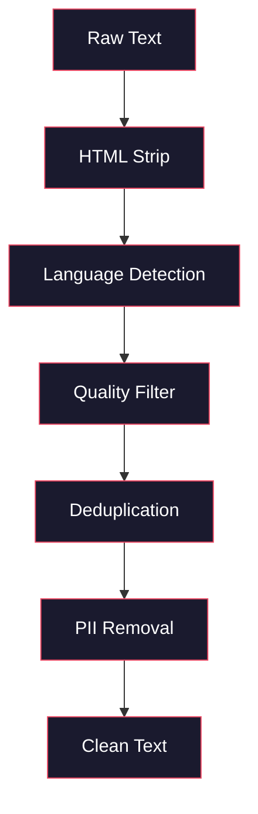
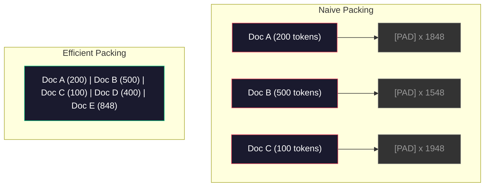

# خطوط البيانات للتدريب المسبق

> النموذج هو مرآة، يعكس أي بيانات تُطعمها، يطعمها القمامة، يعكس القمامة بسلاسة تامة.

**Type:** Build
**Languages:** Python
**Prerequisites:** Phase 10, Lessons 01-02 (Tokenizers, Building a Tokenizer)
**Time:** ~90 minutes

## أهداف التعلم

- بناء خط أنابيب البيانات المتدفق التي تعبر عن علامات، قطع، مزج، وبطاقات من التيرا بايت من النص دون تحميل كل ذلك في الذاكرة
- تنفيذ مرشحات جودة البيانات (تخفيض النسخة، اكتشاف اللغة، تصفية المحتوى) المستخدمة في خطوط الأنابيب الحقيقية قبل التدريب
- إنشاء تسلسلات تدريبية ذات طول ثابتة مع أقنعة الاهتمام المناسبة ومعالجة الحدود الوثائقية
- إنتاج خط الأنابيب الموضعي لضمان أن يحافظ محمول البيانات على سرعة تدريب GPU

## المشكلة

لديك رمز، والآن تحتاج إلى بيانات

ليس مجموعة بيانات، ليس ملف CSV، تيرابايت من النص -- نظف، نزع، تم تصفية الجودة، تم تدوينها إلى تسلسلات طويلة ثابتة، وتقديمها في مجموعات عشوائية بسرعة كافية حتى لا تنتظر مجموعة 8 جي بي يو في اللحظة التالية.

يعتقد معظم الناس أن تدريب ماجستير في العلوم الدراسية هو حول الهندسة المعمارية النموذجية. ليس كذلك. استخدم Llama 3 15.6 تريليون رمز. استخدم GPT-3 300 مليار. استخدم DeepSeek-V2 8.1 تريليون. الهندسة المعمارية في جميع الثلاثة هي تقريبا نفسها: كتلة المحولات المتداخلة مع الاهتمام والتغذية المستمرة الطبقات. الفرق في جودة الخروج تأتي بشكل كبير من البيانات.

ورقة (تشينشيلا) من (ديب ميند) جعلت هذا دقيقاً بالنسبة لحد معين من ميزانيات الحساب، هناك نسبة مثالية من المعلمات النموذجية إلى رموز التدريب. أظهرت تشينشيلا أن معظم النماذج في عام 2022 كانت غير قادرة بشكل كبير -- كانت لديها الكثير من المعلمات لمقدار البيانات التي رأوها. نموذج 70B المعلم المدرب على 1.4 تريليون رمز (Chinchilla-أفضل) أدى بأداء أفضل من نموذج 280B المدرب على 300 مليار رمز (Gopher).

إن خط البيانات الخاص بك يحدد ما إذا كان نموذجك يتعلم اللغة أو يتعلم الضوضاء.

## المفهوم

### من أين تأتي البيانات

كل نموذج لغوي كبير يتم تدريبه على مزيج من المصادر. التركيب الدقيق هو سر محرص على الحفاظ على كثافة لمعظم المختبرات، ولكننا نعرف ما يكفي لفهم الفئات.

| Source | Size | Quality | Used By |
|--------|------|---------|---------|
| Common Crawl | ~250 TB raw | Low (needs heavy filtering) | GPT-3, Llama, most open models |
| Wikipedia | ~20 GB | High | Every major LLM |
| GitHub code | ~1 TB+ | Medium (lots of duplicates, dead code) | StarCoder, CodeLlama, DeepSeek-Coder |
| Books (BookCorpus, Pile) | ~100 GB | High | GPT-2, GPT-3, early models |
| Academic papers (arXiv, S2ORC) | ~100 GB | High for STEM | Llama, Galactica |
| StackOverflow, Reddit | ~100 GB | Medium | Llama, Falcon |
| Curated web (C4, RefinedWeb) | ~5 TB | Medium-High (pre-filtered) | T5, Falcon |

كشفت Llama 3 عن مزيج بياناتها: حوالي 50% من بيانات الويب ، 25٪ من الشفرة ، 13٪ من الكتب والأوراق الأكاديمية ، 8٪ من بيانات الرياضيات ، و 4٪ من بيانات الويب متعددة اللغات. كان إجمالي 15.6 تريليون رمز من مصادر تتجاوز 5 TB من النص الخام.

النسبة مهمة بقدر الحجم الإجمالي. الكثير من البيانات على شبكة الإنترنت والنموذج يصبح طائر ريدت. ضئيل جدا من البرمجة ولا يمكن برمجتها. ضئيل جدا من الرياضيات وفشل في التفكير. الحصول على هذا المزيج بشكل صحيح هو أحد أصعب الأجزاء من تدريب ماجستير في العلوم العليا، وليس هناك صيغة -- يتطلب التجربة والتقييم.

### تنظيف البيانات

البيانات الخام على شبكة الإنترنت قذرة.

- علامات HTML و JavaScript
- أدوات التسجيلات
- الصفحات المكررة (مكررة دقيقة و شبه المكررة)
- الرسائل غير المرغوب فيها
- معلومات شخصية (PII)
- النص منخفضة الجودة (قوائم الكلمات الرئيسية، رسائل غير مرغوب فيها في تحسينات المحتوى)
- محتوى غير نصي مرموز كنصي

تنظيف هذا ليس اختياريًا. إنه الفرق بين نموذج يخلق فقرات متماسكة ومن نموذج يخرج علامات HTML مختلطة بعلامات المنتجات.



كل خطوة تُزيل فئة من الضوضاء:

**HTML stripping:**إزالة كل علامات. إبق فقط محتوى النص المرئي. المكتبات مثل `trafilatura`أو`readability`استخراج محتوى المقال بينما تتخلص من الملاحة والإعلانات واللواح.

**Language detection:**استخدم نموذج تحديد اللغة في fastText (lid.176.bin) لتصنيف كل وثيقة. قم بتصفية لغات المستهدف الخاصة بك. وثيقة تصنف كإنجليزية ذات ثقة أقل من 0.8 لا يمكن أن تكون إنجليزية نظيفة.

**Quality filtering:**هذا هو المكان الذي يصبح فيه الأمر مثيراً للاهتمام. يستخدم RefinedWeb (مجموعة البيانات وراء Falcon) مرشحًا مقيدًا على الارتباك: تدريب نموذج لغوي صغير على ويكيبيديا ، ثم تسجيل كل مستند. الارتباك العالي يعني أن الوثيقة تختلف عن ويكيبيديا - على الأرجح عن طريق البريد الإلكتروني ، أو قوائم الكلمات الرئيسية ، أو المحتوى الذي يولد به الآلة. يتم إزالة الوثائق التي تتجاوز حدًا.

**Deduplication:**الخطوة الوحيدة الأكثر تأثيراً للتنظيف. يحتوي Common Crawl على عدد هائل من الصفحات المكررة - الإعلانات القانونية عن المسؤولية، إشعارات الكوكيز، شروط الخدمة. التدريب على المكررات يُفقد الحساب ويمكن أن يسبب نموذج التذكر والإعادة التأثير على المقاطع المحددة حرفياً.

**PII removal:**أسماء، عناوين البريد الإلكتروني، أرقام الهاتف، أرقام الضمان الاجتماعي، الكشف القائم على Regex لـ PII المهيكلة، نماذج NER لأسماء في السياق.

### التخفيض من المضاعفة مع MinHash

إن التخفيض الدقيق سهل: تتميز كل مستند، وإزالة النسخ المزدوجة. ولكن النسخ المزدوجة القريبة هي المشكلة الحقيقية. نسختان من نفس المقال الإخباري مع إعلانات مختلفة قليلا حولها هي النسخ المزدوجة القريبة. المحتوى هو 95٪ متطابقة، ولكن بايت مقابل بايت تختلفان.

يحل "MinHash + Hashing Sensitive to Location" (LSH) هذا بشكل فعال.


الفكرة:

1. **Shingling:**تحويل كل وثيقة إلى مجموعة من n-جرام (مثل 5جرام من الكلمات أو الأحرف). "الرأس البني السريع" مع الشينغول 3 كلمات يصبح {"الرأس البني السريع" ، "الرأس البني السريع"}.

2. **MinHash:**لجميع مجموعة الشينجل لكل وثيقة، احسب قيم الهاش ك. كل قيمة الهاش هي الحد الأدنى من الهاش على جميع الشينجل تحت وظيفة الهاش مختلفة. هذا يخلق "توقيع" ذات الحجم الثابت الذي يقترب من تشابه جاكارد بين أي وثائقين.

3. **LSH:**مجموعة الوثائق إلى علب بناء على فصائل من توقيعهم من MinHash. الوثائق في نفس العلبة هي مرشحين شبه المكرر. هذا يتجنب مقارنة كل زوج - يمكنك مقارنة المرشحين فقط.

4. **Verify:**لكل زوج مرشح، احسب تشابه جاكارد الدقيق. إزالة نسخة واحدة إذا تجاوزت الشبيه عتبة (عادة 0.8).

أبلغ فريق إلاما عن إزالة حوالي 38% من بيانات الويب الخاصة بهم من خلال التخريب. هذا ليس عدداً صغيراً. أكثر من ثلث التصفحات المشتركة هو محتوى مزدوج أو شبه مزدوج.

### إعداد التسلسل

نموذجك يتوقع تسلسل مدخل بطول ثابت وثائقك بطول متغير بعضها 50 رمزا بعضها 50 ألف رمزا

نهج ساذج: وضع كل وثيقة على أقصى طول التسلسل. هذا يضيع حسابات هائلة على رموز التملئة التي لا تساهم في التعلم.

نهج أفضل: إصطحاب وثائق متعددة في تسلسل واحد، منفصلة عن طريق رموز نهاية السلسلة. تسلسل 2048 رمزا قد تحتوي على ثلاث وثائق قصيرة متسلسلة مع رموز [EOS] بينها.



يجب أن يتم تعيين قناع الانتباه بشكل صحيح. لا ينبغي أن تلتحق الرموز من الوثيقة A مع الرموز من الوثيقة B ضمن نفس التسلسل المعبأة. وهذا يتطلب قناع الانتباه المكون من شكل كتلة.

يتم تقسيم الوثائق الطويلة أو تقسيمها إلى قطع عند حدود التسلسل. نقطة الانقسام مهمة: تقسيم منتصف الجملة يفرض على النموذج رؤية الأفكار غير الكاملة. بعض خطوط الأنابيب تتحسّن الانقسام إلى حدود الفقرة أو الجملة عند المستطاع.

### قانون تراكم تشينشيلا

بالنسبة لـ ميزانية الحساب الثابتة C (المقياسة في FLOP) ، فإن الحجم الأمثل لنموذج N وحجم مجموعة البيانات D يتبع:

```
N_opt ~ C^0.5
D_opt ~ C^0.5
```

في الممارسة العملية، هذا يعني أنه يجب أن تقوم بتحديد حجم النموذج وحجم مجموعة البيانات بنفس القدر تقريبا. تحتاج النموذج الذي لديه 10 مرات أكثر من المعلمات إلى حوالي 10 مرات أكثر من رموز التدريب لتحقيق نفس الخسارة.

| Model | Parameters | Training Tokens | Chinchilla-Optimal? |
|-------|-----------|----------------|-------------------|
| GPT-3 | 175B | 300B | No (undertrained 3-4x) |
| Chinchilla | 70B | 1.4T | Yes (by design) |
| Llama 2 | 70B | 2T | Overtrained (intentionally) |
| Llama 3 | 70B | 15T | Heavily overtrained |

يخرق Llama 3 عمداً قانون تشينشيلا. وجد Meta أن التدريب الزائد على المزيد من البيانات - أبعد بكثير من نسبة الحساب الأمثل - ينتج نماذج أفضل للإستنتاج. يتم دفع تكلفة التدريب الإضافية مرة واحدة ، ولكن النموذج الأصغر أرخص للاستمرار. يطلق على هذا في بعض الأحيان على نهج التوسع "الإستنتاج الأمثل" ، وقد أصبح معيار الصناعة منذ عام 2024.

```figure
l5-data-pipeline
```

## بناءها

### الخطوة الأولى: تنظيف النص

قم بتخريج HTML، وتطبيع الفضاء الأبيض، وإزالة المحتوى غير النصي. سنستخدم نصًا في المجال العام (مشروع غوتينبرغ) كجزء صغير من الكتب.

```python
import re

def clean_text(text):
    text = re.sub(r"<[^>]+>", "", text)
    text = re.sub(r"http\S+", "", text)
    text = re.sub(r"[^\x20-\x7E\n]", "", text)
    text = re.sub(r"\n{3,}", "\n\n", text)
    text = re.sub(r" {2,}", " ", text)
    return text.strip()

def quality_filter(text, min_words=50, max_ratio_caps=0.3, max_ratio_special=0.1):
    words = text.split()
    if len(words) < min_words:
        return False
    caps_ratio = sum(1 for w in words if w.isupper()) / len(words)
    if caps_ratio > max_ratio_caps:
        return False
    special_chars = sum(1 for c in text if not c.isalnum() and not c.isspace())
    if special_chars / max(len(text), 1) > max_ratio_special:
        return False
    return True
```

تصفية الجودة تساعد على اكتشاف البريد الإلكتروني (كل الكابس) ، والضوضاء التي تولدها الآلة (نسبة كبيرة من الأحرف الخاصة) ، والصفحات القصيرة جدا. هذه التحققات الثلاثة وحدها تخرج كمية مفاجئة من القمامة من التفتيش على شبكة الإنترنت.

### الخطوة الثانية: تخفيض عدد من ميني هاش

تنفيذ MinHash من الصفر لا توجد مكتبات خارجية مطلوبة فقط`hashlib`. . .

```python
import hashlib
from collections import defaultdict

def get_shingles(text, k=5):
    words = text.lower().split()
    if len(words) < k:
        return set()
    return {" ".join(words[i:i+k]) for i in range(len(words) - k + 1)}

def minhash_signature(shingles, num_hashes=128):
    signature = []
    for i in range(num_hashes):
        min_hash = float("inf")
        for shingle in shingles:
            h = int(hashlib.sha256(f"{i}:{shingle}".encode()).hexdigest(), 16)
            min_hash = min(min_hash, h)
        signature.append(min_hash)
    return signature

def lsh_buckets(signature, bands=16):
    rows_per_band = len(signature) // bands
    buckets = []
    for b in range(bands):
        start = b * rows_per_band
        band_data = tuple(signature[start:start + rows_per_band])
        bucket_hash = hashlib.md5(str(band_data).encode()).hexdigest()
        buckets.append((b, bucket_hash))
    return buckets

def deduplicate(documents, threshold=0.8, num_hashes=128, bands=16):
    signatures = []
    shingle_sets = []
    for doc in documents:
        shingles = get_shingles(doc)
        shingle_sets.append(shingles)
        signatures.append(minhash_signature(shingles, num_hashes))

    bucket_map = defaultdict(list)
    for doc_idx, sig in enumerate(signatures):
        for band_id, bucket_hash in lsh_buckets(sig, bands):
            bucket_map[(band_id, bucket_hash)].append(doc_idx)

    duplicate_pairs = set()
    for bucket_docs in bucket_map.values():
        if len(bucket_docs) < 2:
            continue
        for i in range(len(bucket_docs)):
            for j in range(i + 1, len(bucket_docs)):
                duplicate_pairs.add((bucket_docs[i], bucket_docs[j]))

    removed = set()
    for i, j in duplicate_pairs:
        if i in removed or j in removed:
            continue
        s1, s2 = shingle_sets[i], shingle_sets[j]
        if not s1 or not s2:
            continue
        jaccard = len(s1 & s2) / len(s1 | s2)
        if jaccard >= threshold:
            removed.add(j)

    return [doc for idx, doc in enumerate(documents) if idx not in removed], len(removed)
```

- نعم`num_hashes=128`و`bands=16`تعتبر هذه القيم مناسبة للوصول إلى النصوص الالكاذبة. يتم تحديد المقاييس التي تسيطر على التداول بين التذكر الدقيق والإستعادة. تعطي المزيد من الأشرطة تقديرات تشابه أكثر دقة. تزيد النطاقات من التذكر (التقاط مزيد من النسخ المكررة) على حساب المزيد من الإيجابيات الكاذبة. تعمل هذه القيم بشكل جيد بالنسبة إلى النصوص الالكترونية النموذجية.

### الخطوة الثالثة: تعريف وتعبئة التسلسلات

خذ النص النقي، المُنحَص من النسخة، ووضعها على علامات، ووضعها في تسلسلات طويلة ثابتة للتدريب.

```python
def tokenize_corpus(documents, tokenizer):
    all_tokens = []
    for doc in documents:
        tokens = tokenizer.encode(doc)
        all_tokens.extend(tokens)
        all_tokens.append(tokenizer.eos_id)
    return all_tokens

def pack_sequences(token_ids, seq_length, pad_id=0):
    sequences = []
    attention_masks = []
    for i in range(0, len(token_ids), seq_length):
        seq = token_ids[i:i + seq_length]
        mask = [1] * len(seq)
        if len(seq) < seq_length:
            pad_count = seq_length - len(seq)
            seq = seq + [pad_id] * pad_count
            mask = mask + [0] * pad_count
        sequences.append(seq)
        attention_masks.append(mask)
    return sequences, attention_masks
```

### الخطوة الرابعة: DataLoader للتدريب

إعطاء مجموعات عشوائية من التسلسلات المعبأة هذا ما يستهلك حلقة التدريب.

```python
import random

class PreTrainingDataLoader:
    def __init__(self, sequences, attention_masks, batch_size, shuffle=True):
        self.sequences = sequences
        self.attention_masks = attention_masks
        self.batch_size = batch_size
        self.shuffle = shuffle

    def __len__(self):
        return (len(self.sequences) + self.batch_size - 1) // self.batch_size

    def __iter__(self):
        indices = list(range(len(self.sequences)))
        if self.shuffle:
            random.shuffle(indices)
        for start in range(0, len(indices), self.batch_size):
            batch_idx = indices[start:start + self.batch_size]
            batch_seqs = [self.sequences[i] for i in batch_idx]
            batch_masks = [self.attention_masks[i] for i in batch_idx]
            yield batch_seqs, batch_masks
```

### الخطوة 5: إحصاءات مجموعة البيانات

احسب الأرقام التي تهم: مجموع الرموز، الرموز الفريدة، نسبة الضغط، توزيع طول الوثيقة.

```python
from collections import Counter

def compute_statistics(documents, token_ids, sequences, tokenizer_vocab_size):
    total_chars = sum(len(d) for d in documents)
    total_tokens = len(token_ids)
    unique_tokens = len(set(token_ids))
    compression_ratio = total_chars / total_tokens

    doc_lengths = [len(d.split()) for d in documents]
    avg_doc_length = sum(doc_lengths) / max(len(doc_lengths), 1)
    max_doc_length = max(doc_lengths) if doc_lengths else 0
    min_doc_length = min(doc_lengths) if doc_lengths else 0

    token_counts = Counter(token_ids)
    top_tokens = token_counts.most_common(10)

    non_pad_tokens = sum(sum(1 for t in seq if t != 0) for seq in sequences)
    total_positions = sum(len(seq) for seq in sequences)
    utilization = non_pad_tokens / max(total_positions, 1)

    stats = {
        "total_documents": len(documents),
        "total_characters": total_chars,
        "total_tokens": total_tokens,
        "unique_tokens": unique_tokens,
        "vocab_utilization": unique_tokens / tokenizer_vocab_size,
        "compression_ratio": compression_ratio,
        "avg_doc_length_words": avg_doc_length,
        "max_doc_length_words": max_doc_length,
        "min_doc_length_words": min_doc_length,
        "num_sequences": len(sequences),
        "sequence_utilization": utilization,
        "top_10_tokens": top_tokens,
    }
    return stats
```

نسبة الضغط تخبرك بمدى كفاءة الـ Tokenizer على هذا الجسم. النص الإنجليزي عادة ما يضغط إلى حوالي 3-4 حرفًا لكل رمز. إذا رأيت 1.5 حرفًا لكل رمز، فإن الـ Tokenizer الخاص بك ينقسم بشكل عنيف جدًا. إذا رأيت 8 + ، فقد تعلم دمجًا محددًا للغاية للمجال.

استخدام التسلسل يخبرك كم من التسلسلات المعبأة هي بيانات حقيقية مقابل التعبئة. أقل من 90% يعني أن التعبئة غير فعالة - أنت تضيع الحساب على رموز التعبئة.

## استخدمها

### مقارنة مع مجموعة بيانات HuggingFace

قم بتحميل نفس الجسم من خلال مكتبة مجموعة البيانات في HuggingFace وقارن سرعة خط الأنابيب.

```python
from datasets import load_dataset
from transformers import AutoTokenizer

ds = load_dataset("wikitext", "wikitext-2-raw-v1", split="train")
tokenizer = AutoTokenizer.from_pretrained("meta-llama/Meta-Llama-3-8B")

import time

start = time.time()
tokenized = ds.map(
    lambda x: tokenizer(x["text"], truncation=True, max_length=2048),
    batched=True,
    num_proc=4,
)
hf_time = time.time() - start
total_tokens = sum(len(t) for t in tokenized["input_ids"])
print(f"HuggingFace: {total_tokens:,} tokens in {hf_time:.2f}s ({total_tokens/hf_time:,.0f} tokens/sec)")
```

استخدام خط أنابيب HuggingFace Rust Tokenizers تحت الغطاء والمعالجة المتوازية عبر 4 نواة. أنابيب Python Pure ستكون بطيئة 10-50x. هذا الفجوة هو السبب في استخدام فرق الإنتاج التكنولوجيا المجمعة. الخوارزمية هي نفسها. لغة التنفيذ هو الفرق.

## أرسله

هذه الدروس تنتج طلبا للتحقق من جودة البيانات وتحليلها في خطوط تدريب الجامعة. انظر `outputs/prompt-data-quality-checker.md`. . .

## التمارين

1. **Easy:**إضافة الكشف عن اللغة إلى خط الأنابيب التنظيف باستخدام عملية هيرستيكية بسيطة (تحليل مجموعة الأحرف). قم بتصفية الوثائق الإنجليزية فقط وقياس عدد الوثائق التي يتم إزالتها.
2. **Medium:**تنفيذ التخفيض الدقيق باستخدام SHA-256 hashs جنبا إلى جنب مع MinHash القريب من التخفيض. مقارن عدد المثليات التي تم القبض عليها من قبل كل طريقة على الجسم المزق على شبكة الإنترنت.
3. **Hard:**قم ببناء مرشح جودة قائم على الارتباك. قم بتدريب نموذج لغة الكبير الصغير على نص ويكيبيديا، وقم بتسجيل كل وثيقة حسب الارتباك، وإزالة الجزء السفلي من 20٪. قم بتقارن نوعية النتائج عند التدريب على البيانات المصفاة مقابل غير المصفاة.

## الشروط الرئيسية

| Term | What people say | What it actually means |
|------|----------------|----------------------|
| Common Crawl | "The internet" | A non-profit that crawls the web monthly -- ~250TB raw, the starting point for most LLM training data |
| MinHash | "Some hashing trick" | A technique to estimate Jaccard similarity between sets using fixed-size signatures -- enables near-duplicate detection at scale |
| LSH | "Locality-Sensitive Hashing" | A method to group similar items into the same bucket -- reduces pairwise comparisons from O(n^2) to near-linear |
| Sequence packing | "Concatenating documents" | Fitting multiple documents into fixed-length sequences with proper attention masks -- eliminates padding waste |
| Chinchilla scaling | "Train on more data" | For a fixed compute budget, optimal performance requires scaling model size and training tokens roughly equally |
| Fertility | "Tokens per word" | Average number of tokens per word -- 1.3 for English in GPT-4, higher for non-Latin scripts |
| Data mixing | "Choosing training data" | The ratio of code vs text vs math vs multilingual data -- no formula, requires experimentation |
| Perplexity filter | "Quality scoring" | Use a small language model to score documents -- high perplexity means the text is unlike clean reference data |
| Deduplication | "Removing copies" | Eliminating exact and near-duplicate documents -- typically removes 30-40% of raw web data |
| Attention mask | "Which tokens to look at" | A binary mask that prevents attention across document boundaries in packed sequences |

## المزيد من القراءة

- [Hoffmann et al., 2022 -- Training Compute-Optimal Large Language Models (Chinchilla)](https://arxiv.org/abs/2203.15556)-- الورقة التي غيرت طريقة تفكيرنا عن نطاق البيانات
- [Penedo et al., 2023 -- The RefinedWeb Dataset for Falcon LLM](https://arxiv.org/abs/2306.01116)-- كيفية تصفية المزق المشترك إلى جودة عالية
- [Touvron et al., 2023 -- Llama 2: Open Foundation and Fine-Tuned Chat Models](https://arxiv.org/abs/2307.09288)-- تفاصيل خط البيانات لـ "لاما 2"
- [Lee et al., 2022 -- Deduplicating Training Data Makes Language Models Better](https://arxiv.org/abs/2107.06499)لماذا التخفيف مهم أكثر مما تعتقد
- [Broder, 1997 -- On the Resemblance and Containment of Documents](https://ieeexplore.ieee.org/document/666900)- ورقة " مين هاش " الأصلية
- [Meta, 2024 -- Llama 3 Technical Report](https://arxiv.org/abs/2407.21783)-- 15.6T رموز، نسبة خليط البيانات، تصفية خط الأنابيب
