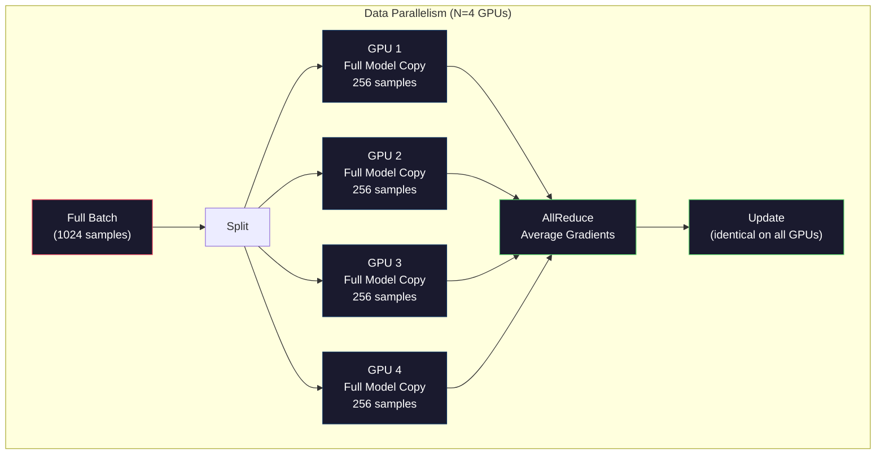
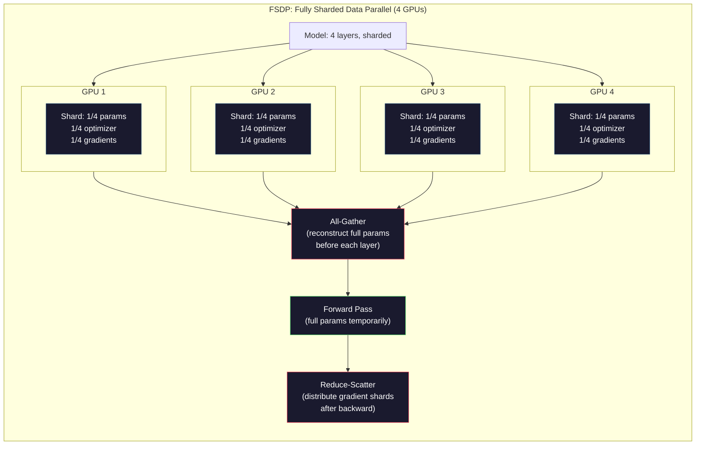
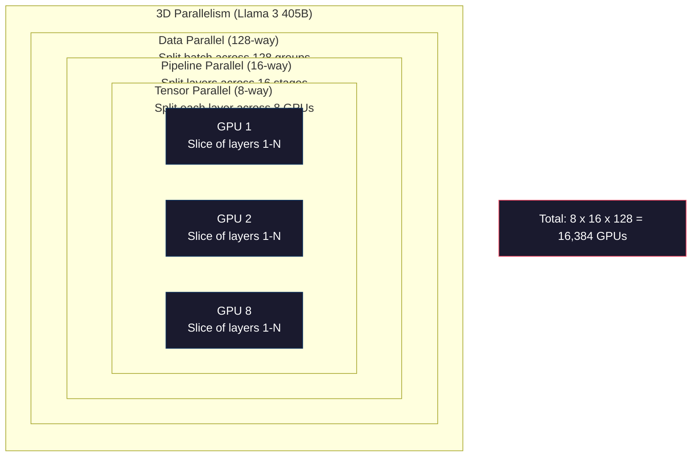

# التوسع: التدريب الموزع، FSDP، DeepSpeed

> نموذج 124M الخاص بك تدرب على GPU واحد الآن جرب 7 مليارات ملامح النموذج لا يناسب في الذاكرة البيانات تستغرق أسابيع على جهاز واحد التدريب الموزع ليس اختياريا على نطاق واسع انها الطريق الوحيد للأمام

**Type:** Build
**Languages:** Python
**Prerequisites:** Phase 10, Lesson 04 (Pre-Training a Mini GPT)
**Time:** ~120 minutes

## أهداف التعلم

- شرح ثلاثة أنواع التوازي (البيانات والخضوع إلى العدد، والخط الأنابيب) ومتى تكون كل منها ضرورية بناءً على النموذج وحجم الكluster
- تنفيذ تدريب متوازي للبيانات باستخدام PyTorch DDP مع مزامنة التراجع عبر العديد من GPUs
- حساب ميزانية الذاكرة لنموذج معين (الأوزان + حالة المحفز + التراجع + التفعيلات) لتحديد الحد الأدنى من الأجهزة
- قم بتهيئة مراحل FSDP أو DeepSpeed ZeRO لتقسم حالات النموذج عبر GPUs ونماذج التكيف التي تتجاوز ذاكرة GPU واحدة

## المشكلة

يحتاج نموذج معايير 7B في FP16 إلى 14GB فقط للوزن. تخزين Adam Optimizer نسخة إضافية من كل معايير (تقديرات اللحظة الأولى والثانية). وهذا 28GB آخر. تضيف التشريعات أثناء الانتشار الخلفي 14GB أكثر. أنت في 56GB قبل تخزين تنشيط واحد.

NVIDIA A100 لديه 80 جيجابايت من الذاكرة.

56 جيجابايت من 80 جيجابايت المستهلكة. هذا يترك 24 جيجابايت للتفعيلات -- القيم المتوسطة التي يتم حسابها خلال الممر المباشر التي يجب أن تبقى حية للتنشر الخلفي. بالنسبة لسلسلة 2048 رمز مع نموذج 4096 بعد، تنشيطات طبقة واحدة تستخدم حوالي 64 جيجابايت. مع 32 طبقة، تحتاج إلى 2 جيجابايت لكل عينة. حجم الحزمة من 8 يحتاج إلى 16 جيجابايت. لديك 24 جيجابايت. حجم الحزمة من 12 ينفجر.

الآن جرب معايير 70B. الوزن وحده: 140GB في FP16. لا يناسب على GPU واحد. تحتاج إلى 2 A100 على الأقل (2 x 80GB = 160GB) فقط للحفاظ على الوزن. إضافة حالات التحسين والتحريفات وتحتاج إلى أكثر بكثير: 3+ GPU أقل، وعلى نحو واقعي 8-16 اعتمادا على استراتيجية شرد.

تم تدريب Llama 3 405B على 16،384 GPU NVIDIA H100.$100 million in compute. DeepSeek V3 trained a comparable model for roughly $5.6 مليون من خلال أن تكون ذكية في الهندسة المعمارية (خليط الخبراء يعني فقط جزء من المعلمات تنشيط لكل رمز) وكفاءة التدريب.

تغطي هذه الدروس الأستراتيجيات الأربعة التي تجعل التدريب على نطاق واسع ممكنًا: مواقعة البيانات، مواقعة التنسور، مواقعة خطوط الأنابيب، ومواقعة البيانات المقطوعة بالكامل. ستقوم بتحاكي كل منهما في بيثون النقي لفهم الميكانيكا قبل أن تلمس إطار تدريب موزع.

## المفهوم

### لماذا يحتاج الوزارة

هذه هي الرياضيات الذاكرة للنماذج الحقيقية كل رقم محسب وليس مقترح

| Model | Params | Weights (FP16) | Adam States | Gradients (FP16) | Total (no activations) |
|-------|--------|----------------|-------------|------------------|----------------------|
| GPT-2 Small | 124M | 248 MB | 992 MB | 248 MB | 1.5 GB |
| Llama 3 8B | 8B | 16 GB | 64 GB | 16 GB | 96 GB |
| Llama 3 70B | 70B | 140 GB | 560 GB | 140 GB | 840 GB |
| Llama 3 405B | 405B | 810 GB | 3,240 GB | 810 GB | 4,860 GB |

عمود "دول آدم" هو القاتل. يحتفظ آدم بمعدل تشغيل (م) وفرقة تشغيل (ف) لكل معايير ، كلاهما في FP32. بالنسبة لنموذج 70B ، هذا هو 70B x 4 بايتس x 2 = 560GB. يحتاج المحسن وحده إلى سبعة A100s.

H100 واحد لديه 80GB. Llama 3 405B يحتاج إلى 61 H100 على الأقل للحفاظ على الوزن، المحسن، والتحريفات. إضافة التفعيلات والعدد ينمو أكثر. Meta استخدم 16384 GPU ليس لأنهم أرادوا - لأنه كان عليهم.

### التوازي بين البيانات

أسهل استراتيجية توزيعية. نسخ النموذج بأكمله إلى N GPUs. تقسيم كل مجموعة تدريب إلى N أجزاء متساوية. كل GPU تعمل على إرسال إلى الأمام والخلف على شظيفة البيانات. بعد الإرسال إلى الوراء، متوسط التراجعات عبر جميع GPUs. كل GPU تحديث نسخة من الوزن بنفس التراجعات المتوسطة، والحفاظ على جميع النسخ في المزامنة.

**The good:**تحليل النطاق السري. N GPUs معالجة N مرات أكثر من البيانات في كل خطوة. التواصل يقتصر على متوسط التراجع، والتي تتداخل مع الحساب.

**The bad:**تحتوي كل GPU على نسخة كاملة من النموذج ، وحالات المحفزات ، والتحريفات. بالنسبة لنموذج 70B ، تحتاج كل GPU إلى 840GB. لا تفعل التوازي البيانات أي شيء لتقليل ذاكرة لكل GPU. فإنه يقلل فقط من وقت التدريب.

**The math:**حجم اللحظة الفعالة = لكل_gpu_batch_size x N. بالنسبة لـ N = 64 GPU مع كل مجموعة من 16 GPU، فإن اللحظة الفعالة هي 1,024. استخدم Llama 3 حجم اللحظة الفعالة من 16 مليون رمز لكل خطوة.



### التوازي التنسوري

تقسيم الطبقات الفردية عبر GPUs. يتم تقسيم مضاعفة المصفوفة الواحدة بين GPUs، كل جزء الحوسبة من النتيجة.

اعتبر المصفوفة الوزن من الشكل (8192 ، 8192) في طبقة إرسال. مع التوازي الزمني 4-الطريق ، تحتوي كل GPU على شق (8192 ، 2048) . كل GPU تضاعف المدخل بشقها ، مما ينتج نتيجة جزئية. يتم دمج النتائج الجزئية (من خلال كل تخفيض أو كل جمع) لإنتاج الخروج الكامل.

**The good:**يقلل من الذاكرة لكل GPU للأوزان النموذجية. نموذج 70B مقسم على 8 GPU يعني أن كل GPU يحمل أوزان بقيمة 8.75B.

**The bad:**يتطلب الاتصال السريع بين GPU بعد كل طبقة. كل خفض بعد كل matmul يضيف التأخير. هذا يعمل بشكل جيد مع NVLink (900 GB / s بين GPUs على نفس العقدة) ولكن بشكل سيء عبر العقدات المتصلة بواسطة InfiniBand (400 Gb / s ، حوالي 50 GB / s). التوازي التنسوري يقتصر دائمًا تقريبًا على عقدة واحدة (8 GPUs).

**Real usage:**تمكن ميغاترون-إم من الابتدائية في التوازي التنسوري. تستخدم إلاما 3 405B التوازي التنسوري في 8 طرق داخل كل عقدة.

### التوازي مع خطوط الأنابيب

تقسيم النموذج بطبقات. يقوم GPU 1 بتشغيل الطبقات 1-8. يقوم GPU 2 بتشغيل الطبقات 9-16. يقوم GPU 3 بتشغيل الطبقات 17-24. يقوم GPU 4 بتشغيل الطبقات 25-32. تدفق البيانات عبر الأنابيب: يقوم GPU 1 بحساب طبقاتها وتبعث التنشيطات إلى GPU 2 ، الذي يقوم بحساب طبقاتها وتبعث إلى GPU 3 ، وهكذا.

**The good:**الحد الأدنى من الاتصال بين وحدات التشغيل الجيو - فقط التنشيطات عند حدود الطبقة، والتي هي صغيرة مقارنة مع التدفقات أو الوزن. تعمل عبر العقد لأن متطلبات عرض النطاق منخفضة.

**The bad:**فقاعات خط الأنابيب. عندما تقوم GPU 4 بحساب المضي قدما على المجموعة الصغيرة 1 ، تكون GPUs 1 ، 2 ، و 3 فارغة (لقد تمت إعادة جزءها بالفعل). أثناء المضي قدماً إلى الوراء ، يتحول النمط. مع التشغيل البطيء ، يبلغ استخدام GPU 1/N فقط لمرحلة خط الأنابيب N.

**GPipe and PipeDream**حل مشكلة الفقاعة عن طريق تقسيم المجموعة إلى مجموعات صغيرة. يبدأ GPU 1 على مجموعة صغيرة 2 بمجرد إنهاء إرسال المجموعة الصغيرة 1. هذا يتداخل الحساب عبر مراحل الأنابيب. مع مجموعات صغيرة M و N المراحل، ينخفض جزء الفقاعة إلى (N-1) / M. استخدم M = 16 مجموعات صغيرة مع N = 4 مراحل والفقاعة 3/16 = 18.75% من الوقت العاطل.

### FSDP: المعلومات المزدوجة بالكامل

يجمع FSDP بين قابلية تحويل البيانات الموازية بكفاءة الذاكرة في التجزئة. بدلاً من كل GPU تحتوي على نسخة كاملة من النموذج ، تحتوي كل GPU على 1/N فقط من المعلمات والتحريفات وحالات المحسن.

قبل أن يمر الطبقة إلى الأمام، يقوم FSDP بتشغيل **all-gather**لجمع المعلمات الكاملة من جميع وحدات المعالجة المعالجة المعالجة المعالجة المعالجة المعالجة المعالجة المعالجة المعالجة المعالجة المعالجة المعالجة المعالجة المعالجة المعالجة المعالجة المعالجة المعالجة المعالجة المعالجة المعالجة المعالجة المعالجة المعالجة المعالجة المعالجة المعالجة المعالجة المعالجة المعالجة المعالجة المعالجة المعالجة المعالجة المعالجة المعالجة المعالجة المعالجة المعالجة المعالجة المعالجة المعالجة المعالجة المعالجة المعالجة المعالجة المعالجة المعالجة المعالجة المعالجة المعالجة المعالجة المعالجة المعالجة المعالجة المعالجة المعالجة المعالجة المعالجة المعالجة المعالجة المعالجة المعالجة المعالجة المعالجة المعالجة المعالجة المعالجة المعالجة المعالجة المعالجة المعالجة المعالجة المعالجة المعالجة المعالجة المعالجة المعالجة المعالجة المعالجة المعالجة المعالجة المعالجة المعالجة المعالجة المعالجة المعالجة المعالجة المعالجة المعالجة المعالجة المعالجة المعالجة المعالجة المعالجة المعالجة المعالجة المعالجة المعالجة المعالجة المعالجة المعالجة المعالجة المعالجة المعالجة المعالجة المعالجة المعالجة المعالجة المعالجة المعالجة المعالجة المعالجة المعالجة المعالجة المعالجة المعالجة المعالجة المعالجة المعالجة المعالجة المعالجة المعالجة المعالجة المعالجة المعالجة المعالجة المعالجة المعالجة المعالجة المعالجة المعالجة المعالجة المعالجة المعالجة المعالجة المعالجة المعالجة المعالجة المعالجة المعالجة المعالجة المعالجة المعالجة المعالجة المعالجة المعالجة المعالجة المعالجة المعالجة المعالجة المعالجة المعالجة المعالجة المعالجة المعالجة المعالجة المعالجة المعالجة المعالجة المعالجة المعالجة المعالجة المعالجة المعالجة المعالجة**reduce-scatter**يوزع شرائح التراجع بحيث تخزن كل GPU فقط 1/N من التراجع.

**The math for a 70B model on 8 GPUs:**

| Component | Without FSDP | With FSDP |
|-----------|-------------|-----------|
| Weights (FP16) | 140 GB per GPU | 17.5 GB per GPU |
| Adam States (FP32) | 560 GB per GPU | 70 GB per GPU |
| Gradients (FP16) | 140 GB per GPU | 17.5 GB per GPU |
| **Total** | **840 GB per GPU** | **105 GB per GPU** |

بدون FSDP، لا يمكنك تركيب نموذج 70B على GPU واحد 80GB. مع FSDP على 8 GPU، كل GPU يستخدم 105GB -- انتظر، هذا لا يزال لا يتناسب. تحتاج إلى 16 GPU على الأقل للحصول على أقل من 80GB لكل GPU، أو يمكنك الجمع بين FSDP مع التفتيش التشغيل (إعادة حساب التشغيلات أثناء الخلف بدلا من تخزينها).

تكلفة الاتصال أعلى من التوازي البيانات الفانيليا بسبب جمع كل قبل كل طبقة. ولكن توفير الذاكرة يجعل من المستحيل قبل تدريب الجري.



### ديبسيبيد زرو

يُعتبر نظام ZeRO (Zero Redundancy Optimizer) في DeepSpeed متطابقًا مفهوميًا مع FSDP لكنه تم تطويره بشكل مستقل من قبل Microsoft. يحدد ثلاثة مراحل، كل منها يقطع بشكل أكثر عدوانية:

| Stage | Shards | Memory Savings | Communication |
|-------|--------|---------------|---------------|
| ZeRO-1 | Optimizer states only | ~4x reduction | Same as data parallel |
| ZeRO-2 | + Gradients | ~8x reduction | Slightly more |
| ZeRO-3 | + Parameters | ~Nx reduction (N GPUs) | All-gather per layer |

يُعَدّ ZeRO-3 بمثابة FSDP. تُعَدّي الإسم مختلفًا، والآلية هي نفسها. أضاف PyTorch FSDP كتنفيذ محلي بعد أن أثبتت DeepSpeed المفهوم.

كما أطلقت DeepSpeed ZeRO-Offload (التي تعزز تحسينات الحمولة إلى ذاكرة ذاكرة المعالجة المركزية ، والتي هي أرخص وأكبر) و ZeRO-Infinity (التي تعزز إلى SSD NVMe). هذه سرعة الحساب التجارية لقدرة الذاكرة - العمليات التي يتم تحملها بطيئة ولكن تحرير ذاكرة GPU.

### تدريبات دقيقة مختلطة

التدريب الحديث يستخدم العديد من أشكال نقطة عائمة في وقت واحد:

- **Forward pass**FP16 أو BF16 (16-bit). نصف الذاكرة من FP32. Matmuls تعمل أسرع مرتين على نواة التنسور.
- **Master weights**: FP32 (32 بت). يتم الحفاظ عليه من قبل المحافظ على الدقة الرقمية أثناء تحديثات الوزن.
- **Loss scaling**: ضرب الخسارة بمثابة ثابت كبير قبل الانتقال إلى الوراء لمنع تراجع FP16 من التدفق إلى الصفر. تقسيم بنفس ثابت قبل خطوة التحسين.

BF16 (Brain Float 16) لديه نفس نطاق المضربات مثل FP32 (8 بتات المضربة) ولكن الدقة المحدودة (7 بتات مانتيسا مقابل FP32's 23). نادرا ما تحتاج إلى تراكم الخسارة لأنه يمكن أن يمثل نفس نطاق القيم. FP16 لديه 5 بتات المضربة و 10 بتات مانتيسا - يمكن أن يمثل القيم الحميقة ولكن يتدفق / يتدفق عند الكبيرة القصوى.

تستخدم TPUs Google BF16 بشكل طبيعي. تدعم A100 و H100 من NVIDIA FP16 و BF16. انتقلت الصناعة إلى حد كبير إلى BF16 لأنه يزيل الصداع في التوسع في الخسائر.

**Memory comparison for a 7B model:**

| Precision | Weights | Optimizer | Gradients | Total |
|-----------|---------|-----------|-----------|-------|
| FP32 everywhere | 28 GB | 56 GB | 28 GB | 112 GB |
| Mixed (BF16 + FP32 master) | 14 GB | 56 GB | 14 GB | 84 GB |

الدقة المختلطة توفر 28 جيجابايت على هذا النموذج. الحالات المثلى تبقى في FP32 بغض النظر - هذا هو المكان الذي تذهب فيه معظم الذاكرة.

### الميجاترون-إم و التوازي الثلاثي الأبعاد

التدريب الحقيقي على نطاق واسع يجمع بين كل التوازيات الثلاثة:

- **Data parallelism**عبر مجموعات العقد (حجم الحزمة على نطاق واسع)
- **Tensor parallelism**داخل عقدة (تقسيم الطبقات على 8 GPU)
- **Pipeline parallelism**عبر العقد (مجموعات طبقة منفصلة عبر الآلات)

إلاما 3 405 ب على 16384 H100:
- التوازي التنسوري في 8 طرق داخل كل عقدة (8 GPU لكل عقدة)
- التوازي بين خط الأنابيب 16 طريق عبر العقد (16 مرحلة خط الأنابيب)
- التوازي بين البيانات في 128 الاتجاه عبر الأبعاد المتبقية (16,384 / 8 / 16 = 128)

هذا التفكك ثلاثي الأبعاد (8 × 16 × 128 = 16,384) هو كيفية تحسين حجمك إلى آلاف أجهزة البيانات المعالجة (GPU). كل GPU ترى شظيفة بيانات مختلفة (موازية البيانات) ، وتحتوي على قطعة واحدة من كل طبقة (موازية التنسور) ، وتحسب مجموعة مختلفة من الطبقات (موازية الأنابيب).

اتخذ DeepSeek V3 نهجا مختلفا. تقوم بنيتهم المختلطة من الخبراء بتفعيل 37B فقط من بين 671B المعلمات لكل رمز. وهذا يعني أن كل GPU فقط تحتاج إلى حساب (و تخزين التفعيلات) للمعلمات النشطة. تم تدريبهم على 2048 H800 GPU - أقل من 1/8 من عدد GPU في Meta - ل$5.6M vs Meta's estimated $100 مليون



```figure
paged-kv-cache
```

## بناءها

### الخطوة الأولى: محاكاة التوازي بين البيانات

تقسيم مجموعة بين GPU المثبتة. كل GPU يحسب مرورًا إلى الأمام على شظائفها. متوسط "المركبات" (نحن نقوم بتحاكيها كمقيم الخسارة).

```python
import numpy as np

def simulate_data_parallelism(data, num_gpus, model_fn):
    batch_size = len(data)
    shard_size = batch_size // num_gpus
    remainder = batch_size % num_gpus

    gpu_losses = []
    gpu_gradients = []

    offset = 0
    for gpu_id in range(num_gpus):
        extra = 1 if gpu_id < remainder else 0
        shard = data[offset:offset + shard_size + extra]
        offset += shard_size + extra

        loss, grad = model_fn(shard)
        gpu_losses.append(loss)
        gpu_gradients.append(grad)

    avg_loss = np.mean(gpu_losses)
    avg_gradient = np.mean(gpu_gradients, axis=0)

    return avg_loss, avg_gradient
```

العملية الكاملة للحد (التراجع المتوسط) هي الاتصال الوحيد في مواقيع البيانات. في الممارسة العملية، يستخدم هذا مكتبة NCCL على GPUs NVIDIA، التي تنفيذ حلقة كل تقليل: كل GPU يرسل 1/N من تراجعها إلى جارها، ويستلم 1/N من الجار الآخر، وبعد خطوات N-1 كل GPU لديها المتوسط الكامل. حجم الاتصال الإجمالي: 2 x gradient_size x (N-1) /N، يقترب من 2x حجم التدفق لـ N الكبير.

### الخطوة الثانية: محاكاة التوازي التنسوري

تقسيم المصفوفة الوزن بين GPUs. كل GPU يحسب مضاعفة المصفوفة الجزئية. مزج النتائج.

```python
def simulate_tensor_parallelism(input_data, weight_matrix, num_gpus):
    d_in, d_out = weight_matrix.shape
    assert d_out % num_gpus == 0, f"d_out {d_out} not divisible by num_gpus {num_gpus}"
    shard_size = d_out // num_gpus

    partial_results = []
    for gpu_id in range(num_gpus):
        start = gpu_id * shard_size
        end = start + shard_size
        weight_shard = weight_matrix[:, start:end]

        partial = input_data @ weight_shard
        partial_results.append(partial)

    full_output = np.concatenate(partial_results, axis=-1)

    direct_output = input_data @ weight_matrix
    error = np.abs(full_output - direct_output).max()

    return full_output, error
```

يجب أن يكون الخطأ صفرًا تمامًا (أو إكسيلون آلة). التوازي التنسيري دقيق رياضيًا - ينتج نفس النتيجة مثل حساب المتمول الكامل على GPU واحد. التقسيم على طول بعد الخروج ، لذلك تنتج كل GPU قطعة مختلفة من الأعمدة ، وإعادة تشبيك السلسلة النتيجة الكاملة.

بالنسبة للطبقات الخطية المتوازية العمودية (تقسيم بعدة الخروج) ، تقوم بتصنيع. بالنسبة للطبقة المتوازية السطرية (تقسيم بعدة المدخل) ، تقوم بتجميع. في محول FFN ، يستخدم الخطية الأولى (توسع) متوازية العمود والخطية الثانية (العقد) تستخدم متوازية السطر. هذا يتجنب تقليل الكل بين الطبقتين.

### الخطوة الثالثة: محاكاة التوازي للخطوط

تقسيم طبقات النموذج عبر أجهزة المعالجة البيانية الافتراضية. عرض مشكلة الفقاعة حيث المراحل الأولى تقع عفوية بينما المراحل اللاحقة الحساب.

```python
def simulate_pipeline_parallelism(num_layers, num_stages, num_microbatches):
    layers_per_stage = num_layers // num_stages

    timeline = {}
    clock = 0

    for mb in range(num_microbatches):
        for stage in range(num_stages):
            start_time = max(
                timeline.get((stage, mb - 1, "fwd"), (0, 0))[1] if mb > 0 else 0,
                timeline.get((stage - 1, mb, "fwd"), (0, 0))[1] if stage > 0 else 0,
            )
            end_time = start_time + layers_per_stage
            timeline[(stage, mb, "fwd")] = (start_time, end_time)

    last_fwd_end = max(v[1] for v in timeline.values())

    for mb in range(num_microbatches - 1, -1, -1):
        for stage in range(num_stages - 1, -1, -1):
            deps = [last_fwd_end]
            if mb < num_microbatches - 1 and (stage, mb + 1, "bwd") in timeline:
                deps.append(timeline[(stage, mb + 1, "bwd")][1])
            if stage < num_stages - 1 and (stage + 1, mb, "bwd") in timeline:
                deps.append(timeline[(stage + 1, mb, "bwd")][1])
            start_time = max(deps)
            end_time = start_time + layers_per_stage
            timeline[(stage, mb, "bwd")] = (start_time, end_time)

    total_time = max(v[1] for v in timeline.values())
    compute_time = num_microbatches * num_stages * layers_per_stage * 2
    bubble_fraction = 1.0 - compute_time / (total_time * num_stages)

    return timeline, total_time, bubble_fraction
```

مع 4 مراحل و 1 سلسلة صغيرة، فان جزء الفقاعات هو 75% -- ثلاثة من كل أربعة GPUs عديمة الفائدة في أي وقت. مع 16 سلسلة صغيرة، انخفض إلى حوالي 19٪. تكلفة القضاء على الفقاعات هو الذاكرة: يجب تخزين التفعيلات لجميع مجموعات صغيرة في الطيران في نفس الوقت.

### الخطوة الرابعة: محاسبة الذاكرة

احسب متطلبات الذاكرة الدقيقة لتدريب أي حجم نموذج.

```python
def memory_calculator(
    params_billions,
    precision_bytes=2,
    optimizer="adam",
    num_gpus=1,
    sharding="none",
    sequence_length=2048,
    batch_size_per_gpu=1,
    hidden_dim=None,
    num_layers=None,
):
    params = params_billions * 1e9

    weight_memory = params * precision_bytes

    if optimizer == "adam":
        optimizer_memory = params * 4 * 2
    elif optimizer == "sgd":
        optimizer_memory = params * 4
    else:
        optimizer_memory = 0

    gradient_memory = params * precision_bytes

    total_no_activation = weight_memory + optimizer_memory + gradient_memory

    if hidden_dim and num_layers:
        activation_per_layer = (
            sequence_length * batch_size_per_gpu * hidden_dim * precision_bytes * 4
        )
        activation_memory = activation_per_layer * num_layers
    else:
        activation_memory = params * precision_bytes * 0.5

    if sharding == "fsdp" or sharding == "zero3":
        weight_memory /= num_gpus
        optimizer_memory /= num_gpus
        gradient_memory /= num_gpus
    elif sharding == "zero2":
        optimizer_memory /= num_gpus
        gradient_memory /= num_gpus
    elif sharding == "zero1":
        optimizer_memory /= num_gpus

    per_gpu_total = weight_memory + optimizer_memory + gradient_memory + activation_memory

    return {
        "params_billions": params_billions,
        "weights_gb": weight_memory / 1e9,
        "optimizer_gb": optimizer_memory / 1e9,
        "gradients_gb": gradient_memory / 1e9,
        "activations_gb": activation_memory / 1e9,
        "per_gpu_total_gb": per_gpu_total / 1e9,
        "total_across_gpus_gb": per_gpu_total * num_gpus / 1e9,
        "fits_on_80gb": per_gpu_total / 1e9 <= 80,
        "num_gpus": num_gpus,
        "sharding": sharding,
    }
```

هذه الحاسبة تجيب على السؤال الذي يطرحه كل مهندس ML: "كم عدد وحدات عملة محمولة أحتاجها؟" إعطيه حجم النموذج وترى ما إذا كان يناسب. تعديل استراتيجية التجزئة حتى ينخفض إجمالي لكل وحدة عملة محمولة أقل من 80 جيجابايت.

### الخطوة 5: محاكاة دقيقة مختلطة

مقارنة استخدام الذاكرة بين FP32 و FP16 و تدريب الدقة المختلطة.

```python
def mixed_precision_comparison(params_billions):
    params = params_billions * 1e9

    fp32_weights = params * 4
    fp32_optimizer = params * 4 * 2
    fp32_gradients = params * 4
    fp32_total = fp32_weights + fp32_optimizer + fp32_gradients

    fp16_weights = params * 2
    fp16_master = params * 4
    fp16_optimizer = params * 4 * 2
    fp16_gradients = params * 2
    fp16_total = fp16_weights + fp16_master + fp16_optimizer + fp16_gradients

    mixed_weights = params * 2
    mixed_optimizer = params * 4 * 2
    mixed_gradients = params * 2
    mixed_total = mixed_weights + mixed_optimizer + mixed_gradients

    return {
        "fp32_total_gb": fp32_total / 1e9,
        "fp16_with_master_gb": fp16_total / 1e9,
        "mixed_bf16_gb": mixed_total / 1e9,
        "savings_vs_fp32": 1 - mixed_total / fp32_total,
    }
```

أكبر مفاجأة بالنسبة لمعظم الناس: الدقة المختلطة لا تقلل من الذاكرة إلى النصف. الحالات المتحسّنة (أدام m و v) تبقى في FP32 بغض النظر عن الدقة. بالنسبة لنموذج 7B، يستخدم تدريب FP32 112GB. الدقة المختلطة تستخدم 84GB. وهذا هو تخفيض بنسبة 25%، وليس 50%.

## استخدمها

### إشغال جميع المحاكاة

```python
def run_all_demos():
    print("=" * 70)
    print("DATA PARALLELISM SIMULATION")
    print("=" * 70)

    np.random.seed(42)
    data = np.random.randn(64, 32)
    weight = np.random.randn(32, 16)

    def model_fn(batch):
        output = batch @ weight
        loss = np.mean(output ** 2)
        grad = 2 * batch.T @ (batch @ weight) / len(batch)
        return loss, grad

    for n_gpus in [1, 2, 4, 8]:
        loss, grad = simulate_data_parallelism(data, n_gpus, model_fn)
        print(f"  {n_gpus} GPUs: loss={loss:.4f}, grad_norm={np.linalg.norm(grad):.4f}")

    print()
    print("=" * 70)
    print("TENSOR PARALLELISM SIMULATION")
    print("=" * 70)

    x = np.random.randn(4, 8192)
    W = np.random.randn(8192, 8192)

    for n_gpus in [1, 2, 4, 8]:
        output, error = simulate_tensor_parallelism(x, W, n_gpus)
        print(f"  {n_gpus} GPUs: output_shape={output.shape}, max_error={error:.2e}")

    print()
    print("=" * 70)
    print("PIPELINE PARALLELISM SIMULATION")
    print("=" * 70)

    for n_mb in [1, 4, 8, 16, 32]:
        _, total_t, bubble = simulate_pipeline_parallelism(32, 4, n_mb)
        print(f"  {n_mb:2d} micro-batches: total_time={total_t:4d}, bubble={bubble:.1%}")

    print()
    print("=" * 70)
    print("MEMORY CALCULATOR")
    print("=" * 70)

    configs = [
        (7, "none", 1),
        (7, "fsdp", 8),
        (70, "none", 1),
        (70, "fsdp", 8),
        (70, "fsdp", 16),
        (405, "fsdp", 64),
        (405, "fsdp", 128),
    ]

    print(f"  {'Model':>8} {'Sharding':>8} {'GPUs':>5} {'Per-GPU':>10} {'Fits 80GB':>10}")
    print("  " + "-" * 50)
    for params, shard, gpus in configs:
        result = memory_calculator(params, num_gpus=gpus, sharding=shard)
        fits = "Yes" if result["fits_on_80gb"] else "No"
        print(f"  {params:>6}B {shard:>8} {gpus:>5} {result['per_gpu_total_gb']:>8.1f}GB {fits:>10}")

    print()
    print("=" * 70)
    print("MIXED PRECISION COMPARISON")
    print("=" * 70)

    for params_b in [7, 13, 70, 405]:
        result = mixed_precision_comparison(params_b)
        print(f"  {params_b}B: FP32={result['fp32_total_gb']:.0f}GB, "
              f"Mixed BF16={result['mixed_bf16_gb']:.0f}GB, "
              f"Savings={result['savings_vs_fp32']:.0%}")
```

## أرسله

هذا الدرس يُنتج`outputs/prompt-distributed-training-planner.md`-- طلب يأخذ حجم النموذج والجهاز المتاحة، ثم ينتج خطة تدريبية مُوزعة كاملة: استراتيجية التوازي، ميزانية الذاكرة، تكلفة الاتصالات العامة، والإنتاج المتوقع.

## التمارين

1. تعديل جهاز الحاسب الذاكرة لتشمل تفتيش التشغيل. مع التفتيش، تخزن التفعيلات فقط في كل طبقة K-th (معتادة K = 1 ، مما يعني إعادة حساب كل شيء). عرض التنازل بين الذاكرة والحساب: كم من الذاكرة التي توفر تفتيش التفتيش ، وكم تبطئ التدريب (حوالي 33% أكثر من الحساب لتحديد التفتيش الكامل) ؟

2. تمديد محاكاة مواكبة خط الأنابيب لتنفيذ جدول 1F1B (واحد للأمام، واحد للخلف) المستخدم من قبل PipeDream. مقارنة جزء الفقاعة مع جدول البراغي ل 4 مراحل و 8 مجموعات صغيرة. يجب أن يكون جدول 1F1B ذكر ذروته الأصغر لأنه يبدأ إلى الوراء يمر في وقت سابق.

3. قم بتنفيذ محاكاة تراكم التدفق. بدلاً من تقليل كل التدفقات بعد كل مجموعة صغيرة، تراكم التدفقات محلياً لخطوات K، ثم تقليل كل. أظهر كيف يقلل هذا من الاتصال بمقدار K مرات ولكن ينتج التدفقات النهائية المماثلة (وهكذا التدريب المماثلة).

4. بناء تقدير التكلفة. بالنظر إلى حجم النموذج، عدد رموز الهدف، نوع GPU (A100 في $2/hr, H100 at $3.50/ساعة) ، واستراتيجية التوازي، تقدير إجمالي تكلفة التدريب بالدولار.$100M, DeepSeek V3 cost ~$5.6 م

5. إضافة ZeRO-Offload إلى آلة الحاسبة الذاكرة. افترض أن RAM CPU هي 512GB لكل عقدة و NVMe هي 2TB. أظهر كيفية إزالة الحالات المكيفة إلى CPU يسمح لنموذج 70B بالتدريب على 4 GPU بدلا من 16, بتكلفة 30-50% أبطأ خطوات المكيفة.

## الشروط الرئيسية

| Term | What people say | What it actually means |
|------|----------------|----------------------|
| Data parallelism | "Copy the model to every GPU" | Each GPU processes a different data shard; gradients are averaged via all-reduce after each step |
| Tensor parallelism | "Split a layer across GPUs" | Partition weight matrices so each GPU computes part of the matmul; requires fast NVLink interconnect |
| Pipeline parallelism | "Split layers across GPUs" | Each GPU runs a different group of layers; data flows through the pipeline with micro-batches to reduce bubbles |
| FSDP | "Shard everything" | Fully Sharded Data Parallel -- each GPU holds 1/N of weights, gradients, and optimizer states; all-gather before compute |
| ZeRO | "DeepSpeed's version of FSDP" | Zero Redundancy Optimizer with 3 stages: shard optimizer (Stage 1), + gradients (Stage 2), + parameters (Stage 3) |
| All-reduce | "Average across GPUs" | Collective operation where every GPU ends with the sum (or average) of all GPUs' inputs -- typically implemented as ring all-reduce |
| All-gather | "Collect from all GPUs" | Collective operation where every GPU ends with the concatenation of all GPUs' data -- used in FSDP to reconstruct full parameters |
| Reduce-scatter | "Sum and distribute" | Collective operation that reduces (sums) data and scatters different chunks to different GPUs -- used in FSDP for gradient sharding |
| Mixed precision | "Train in half precision" | Use FP16/BF16 for forward/backward and FP32 for optimizer states -- saves ~25% memory, not 50%, because the optimizer dominates |
| Pipeline bubble | "Idle time in the pipeline" | Fraction of time GPUs sit idle waiting for data from the previous stage -- reduced by using more micro-batches |

## المزيد من القراءة

- [Rajbhandari et al., 2020 -- "ZeRO: Memory Optimizations Toward Training Trillion Parameter Models"](https://arxiv.org/abs/1910.02054)-- ورقة DeepSpeed ZeRO التي حددت ثلاث مراحل شقق
- [Shoeybi et al., 2020 -- "Megatron-LM: Training Multi-Billion Parameter Language Models Using Model Parallelism"](https://arxiv.org/abs/1909.08053)-- التوازي التنسوري لـ NVIDIA للمتحولات
- [Narayanan et al., 2021 -- "Efficient Large-Scale Language Model Training on GPU Clusters Using Megatron-LM"](https://arxiv.org/abs/2104.04473)-- التوازي الثلاثي الأبعاد يجمع بين البيانات والخضوع والخط الأنابيب
- [Zhao et al., 2023 -- "PyTorch FSDP: Experiences on Scaling Fully Sharded Data Parallel"](https://arxiv.org/abs/2304.11277)-- تنفيذ FSDP الأصلي لـ PyTorch
- [Llama 3 Technical Report](https://arxiv.org/abs/2407.21783)-- 16,384 تدريبات GPU مع تفاصيل التوازي 3D
- [DeepSeek-V3 Technical Report](https://arxiv.org/abs/2412.19437)-- كيف أن الهندسة المعمارية للدراسة تخفض تكلفة التدريب بأمر من حيث حجم
