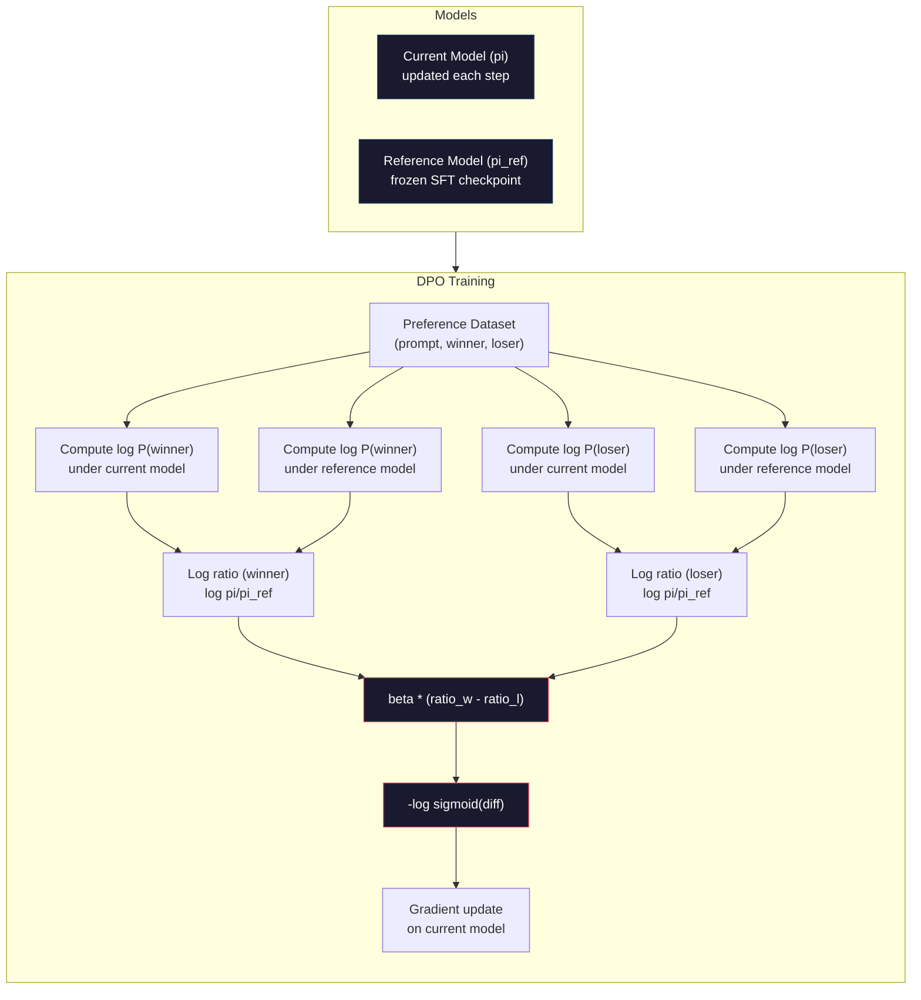

# DPO: تحسين التفضيلات المباشرة

> يعمل RLHF. يتطلب أيضًا تدريب ثلاثة نماذج (SFT ، نموذج الجائزة ، السياسة) ، وإدارة عدم استقرار PPO ، وتحسين عقوبة KL. يسأل DPO: ماذا لو تمكنت من تخطي كل ذلك؟ DPO يفضل بشكل مباشر نموذج اللغة على أزواج الاحتفاظ. لا نموذج الجائزة. لا PPO. حلقة تدريبية واحدة. نفس النتائج.

**Type:** Build
**Languages:** Python (with numpy)
**Prerequisites:** Phase 10, Lesson 07 (RLHF)
**Time:** ~90 minutes

## أهداف التعلم

- تنفيذ تدريب على الموظفين الذين يفضلون اللغة بشكل مباشر على أزواج التفضيلات دون نموذج مكافأة منفصل
- استنباط وظيفة خسارة DPO وتفسير كيف أنها تمثل ضمنيا نموذج مكافأة من خلال احتمالات سجل السياسة
- مقارنة DPO مقابل RLHF من حيث استقرار التدريب وتكلفة الحساب وعدد النماذج المطلوبة
- ضبط المعيار بيتا للتحكم في مدى الانفصال من السياسة المدربة من نموذج المرجع

## المشكلة

لقد بنيت خط أنابيب RLHF في الدروس 07. ثلاث مراحل. ثلاثة نماذج. نموذج SFT، نموذج الجائزة، ونموذج السياسة المحسن مع PPO. نموذج الجائزة وحدها يتطلب آلاف أزواج تفضيل البشر ودورة تدريب منفصلة. PPO يتطلب ضبط دقيق لمعدل KL، معدل التعلم، نسبة المقاطع، وعدد من الفترات.

في الممارسة العملية، تعليمه PPO غير مستقرة بشكل معروف. تغيرات صغيرة في المعايير المفرطة تسبب في الانحراف في التدريب. نموذج الجائزة هو وكيل غير كامل لتحسب تفضيلات الإنسان، والسياسة يجد طرق لاستغلال نقاط ضعفه. العقوبة KL تساعد ولكن تتطلب ضبطها الخاص - منخفض جدا وتحصل على مكافأة اختراق، عالية جدا والنموذج بالكاد يتعلم.

هذه التعقيدات هي السبب في أن معظم نماذج المصدر المفتوح صعبت مع RLHF لسنوات بعد نشر InstructGPT. خط الأنابيب الثلاث المراحل هش. لكل مرحلة أنواع فشلها الخاصة، وتشكل الأخطاء.

في مايو 2023، نشر رافائيل رافائيلوف، وأرشيت شرما، وزملاؤه في ستانفورد "تحسين التفضيلات المباشرة: نموذج لغتك هو بشكل سري نموذج مكافأة". يتم تحديد وظيفة المكافأة المثلى رياضياً من خلال احتمالات رمزية نموذج اللغة. يمكنك تخطي نموذج الجائزة بالكامل وتحسين نموذج اللغة مباشرة على أزواج الاختيارات.

يقلل DPO RLHF إلى خطوة تعليمية واحدة تحت الإشراف. نموذج واحد. وظيفة خسارة واحدة. حلقة تدريب واحدة. لا تعلم تعزيز. زيفير-7B ، واحدة من أول نماذج تستخدم DPO على نطاق واسع ، تطابق أو تضرب نماذج تدربت مع RLHF الكاملة على عدة مقاييس. استخدمت Meta DPO كجزء من خط الأنابيب التوجه للاما 3. وقد استشهدت Anthropic بأساليب نمط DPO في أبحاث التوجه الخاصة بها.

## المفهوم

### البصيرة الرئيسية

يُحسن RLHF هذا الهدف:

```
maximize: E[R(x, y)] - beta * KL(pi || pi_ref)
```

حيث R هو نموذج الجائزة، و pi هو السياسة، و pi_ref هو نموذج المرجع، و beta هو معدل KL.

أظهرت ورقة DPO أن هذا الهدف لديه حلًا مثاليًا في شكل مغلق. بالنسبة لأي وظيفة مكافأة R ، فإن السياسة المثلى هي:

```
pi*(y | x) = pi_ref(y | x) * exp(R(x, y) / beta) / Z(x)
```

حيث Z(x) ثابت طبيعي. إعادة ترتيب:

```
R(x, y) = beta * log(pi*(y | x) / pi_ref(y | x)) + beta * log Z(x)
```

هذه هي الانفجار. يتم التعبير عن المكافأة بالكامل من حيث احتمالات نموذج السياسة ومحتملات نموذج المرجح. لا تحتاج إلى تدريب نموذج مكافأة منفصل. المكافأة * ضمنية * في نسبة الاحتمال.

استبدال هذا في نموذج تفضيل برادلي تيري:

```
P(y_w > y_l | x) = sigmoid(R(x, y_w) - R(x, y_l))
                  = sigmoid(beta * (log pi(y_w|x)/pi_ref(y_w|x) - log pi(y_l|x)/pi_ref(y_l|x)))
```

يتم إلغاء شروط Z(x) لأن كلا الإجابات تتحدى نفس الإجابة x. ما تبقى هو وظيفة من احتمالات السجل فقط لنموذج السياسة ومحتملات السجل لنموذج المرجعية على الإجابات المفضلة والمنفذة.

### خسارة الـ DPO

```
L_DPO = -log(sigmoid(beta * (log pi(y_w|x)/pi_ref(y_w|x) - log pi(y_l|x)/pi_ref(y_l|x))))
```

دعونا نفتح كل قطعة:

- **y_w**= الاستجابة المفضلة (الفائزة)
- **y_l**= رد رفض (الخسارة)
- **x**= سريع
- **pi**= النموذج الحالي (الذي يتدرب عليه)
- **pi_ref**= نموذج مرجع (مركز تفتيش SFT المجمد)
- **beta**= مُعيار درجة الحرارة الذي يتحكم في الانحراف عن المرجع (عادة ما يكون من 0.1 إلى 0.5)

النسبة`log pi(y|x) / pi_ref(y|x)`هو نسبة احتمال التسجيل. عندما يكون هذا النسبة إيجابية، فإن النموذج الحالي يعطي احتمالًا أعلى للرد y من النموذج المرجعي. عندما يكون سلبيًا، يعطي النموذج الحالي احتمالًا أقل.

يضغط فقدان DPO النموذج لزيادة نسبة احتمالية السجل للردود المفضلة وتقليلها للردود المنرفضة. يسيطر معايير بيتا على مدى تعطل النموذج عن المرجع - بيتا صغيرة يعني أن الانحرافات الكبيرة مسموحة ، بيتا كبيرة تبقي النموذج قريبًا من المرجع.



### لماذا DPO أبسط

| Aspect | RLHF (PPO) | DPO |
|--------|-----------|-----|
| Models to train | 3 (SFT + reward + policy) | 1 (policy only) |
| Training loops | 3 (SFT, RM training, PPO) | 2 (SFT, DPO) |
| Hyperparameters | lr, KL coeff, clip ratio, RM lr, epochs x3 | lr, beta, epochs |
| Reward model | Required (separate training) | Implicit in model probabilities |
| RL algorithm | PPO (complex, unstable) | Supervised learning (stable) |
| GPU memory | 3-4 models in memory during PPO | 2 models (current + reference) |
| Training stability | Sensitive to hyperparameters | Robust, similar to SFT |

يحتاج DPO إلى نماذج في الذاكرة أثناء التدريب -- النموذج الحالي والإشارة المجمدة. يحتاج RLHF إلى ثلاثة أو أربعة: السياسة، الإشارة، نموذج الجائزة، وربما خط أساس وظيفة القيمة. بالنسبة لنموذج 70B، كل نسخة تستغرق 140GB في FP16. توفير الذاكرة من القضاء على نموذج الجائزة كبير.

### عندما يضرب الـ DPO RLHF

**Small datasets.**مع 5000-20000 زوج تفضيل، غالبا ما يتطابق DPO أو يتجاوز RLHF. نموذج الجائزة في RLHF يحتاج إلى بيانات كافية لتعميمها - مع بيانات محدودة، فإنه يتجاوز وينتج إشارات الجائزة غير موثوقة. DPO يُغَيِّر هذه المشكلة عن طريق عدم الحاجة إلى نموذج الجائزة على الإطلاق.

**Limited compute.**يتطلب DPO حوالي ثلث حساب RLHF الكامل (حلقة تدريب واحدة بدلاً من ثلاثة). بالنسبة للفرق التي لا توجد مجموعة GPU كبيرة ، هذا هو الخيار العملي.

**Rapid iteration.**تريد تجربة 10 مجموعات بيانات تفضيل مختلفة لمعرفة أي من هذه المجموعات تنتج أفضل نموذج؟ DPO يسمح لك بتشغيل كل تجربة في ساعات.

### عندما يضرب RLHF DPO

**Large-scale training.**على مقياس GPT-4 أو Claude، يمكن لنموذج مكافأة منفصل RLHF التقاط إشارات تفضيل أكثر توترًا. يعمل نموذج مكافأة كعمل خسارة تعلم يتكيف مع معايير الجودة المعقدة.

**Complex reward signals.**عندما يتضمن "أفضل" أبعاد متعددة (المساعدة، والأمانة، والصدق) ، يمكن لنموذج الجائزة تعلم هذا التنازل المتعدد الأهداف. يعامل DPO كل زوج من الاختيارات كإشارة ثنائية - واحد أفضل، واحد أسوأ - دون أن ينمذ سبب ذلك.

**Iterative alignment.**يمكن أن تولد خطوط أنابيب RLHF استجابات جديدة مع السياسة الحالية ، والإنسانيّة تقييمها ، وإعادة تدريب نموذج الجائزة في حلقة على الإنترنت. يعمل DPO على مجموعة بيانات ثابتة من أزواج الاختيارات. تستخدم الذكاء الاصطناعي الدستوري (نهج الأنثروباتيك) هذه الملكية التكراريّة ل RLHF على نطاق واسع.

### خارج الـ DPO: KTO، ORPO، SimPO

ألهمت DPO عائلة من طرق التنظيم المبسطة.

**KTO (Kahneman-Tversky Optimization, 2024):**أنت لا تحتاج حتى أزواج. تعمل KTO مع ردود الفعل غير المزدوجة -- فقط قم بتصنيف كل ردود الفعل "جيدة" أو "سيئة" دون مقارنتها مع بديل. هذا يسهل جمع البيانات بشكل كبير. بدلاً من عرض ردود فعل للاحصائيين وسؤال "ما هو أفضل؟" ، يمكنك عرض ردود فعل واحدة وسؤال "هل هذا جيد؟" وظيفة الخسارة تطبق عداوة الخسارة من نظرية التوقعات: يتم معاقبة ردود الفعل السيئة أكثر من مكافأة ردود الفعل الجيدة.

**ORPO (Odds Ratio Preference Optimization, 2024):**يجمع بين SFT والتحديد في خطوة تدريبية واحدة. بدلاً من القيام SFT أولاً ثم DPO ، يقوم ORPO بتعديل خسارة SFT لتشمل إشارة تفضيلية. الخسارة لها شروطتان: خسارة التنبؤ القياسي التالي للبرمجة التالية على الاستجابات المفضلة ، بالإضافة إلى شروط نسبة الاحتمالات التي تزيد من الفجوة بين احتمالات الاستجابة المفضلة والمنفضة. حلقة تدريبية واحدة بدلاً من اثنين.

**SimPO (Simple Preference Optimization, 2024):**يزيل نموذج المرجع بالكامل. بدلاً من حساب نسبة احتمالية السجل ضد مرجع مجمد ، تستخدم SimPO متوسط احتمالية السجل للرد (المعتادة عن الطول) كمكافأة ضمنية. وهذا يوفر الذاكرة (لا حاجة إلى نموذج مرجع) ويبسط التدريب. تمنع التطبيع الطويل النموذج من تفضيل للردود الأقصر.

| Method | Year | Models in Memory | Needs Pairs? | Needs Reference? | Training Loops |
|--------|------|-----------------|-------------|-----------------|----------------|
| RLHF | 2022 | 3-4 | Yes (for RM) | Yes | 3 |
| DPO | 2023 | 2 | Yes | Yes | 2 |
| KTO | 2024 | 2 | No (unpaired) | Yes | 2 |
| ORPO | 2024 | 1 | Yes | No | 1 |
| SimPO | 2024 | 1 | Yes | No | 1 |

الاتجاه واضح: كل طريقة تفضي إلى إزالة قطعة واحدة من التعقيدات. احتاج RLHF إلى نموذج مكافأة و PPO. إزالة DPO كليهما. قامت KTO بإزالة البيانات المزدوجة. أرفي أرفي مرحلة SFT منفصلة. أرفي سيمبو نموذج المرجعية. ضريبة التنظيم - تكلفة الحساب والعقدة من الانتقال من نموذج أساسي إلى نموذج مُتواء - تواصل الانخفاض.

### عمليات تنفيذ الجهاز

**Zephyr-7B (HuggingFace, October 2023):**أساس Mistral 7B ، SFT على UltraChat (200K أمثلة) ، ثم DPO على UltraFeedback (60K أزواج تفضيل). حصل على 6.47 على MT-Bench - أعلى نموذج 7B في ذلك الوقت. للمقارنة ، حصل Llama 2 Chat 70B على 6.86 ، مما يعني أن Zephyr حصل على ما يقرب من 6% من نموذج 10x حجمها باستخدام توازن DPO فقط.

**Llama 3 (Meta, April 2024):**استخدم DPO بعد مراحل RLHF الأولية. يشير الجمع إلى أن DPO و RLHF يمكن أن تكون متكاملة - RLHF للتحديد الواسع، DPO للتحسين المستهدف.

**Neural Magic / nm-chat (2024):**تطبق DPO على نماذج مفتوحة المصدر متعددة، حيث أظهرت بشكل متواصل تحسنًا بنسبة 5-15% في معايير التنحية مقارنةً بقواعد الأساس الخاصة بالصراف المفتوحة فقط.

```figure
dpo-loss
```

## بناءها

### الخطوة الأولى: مجموعة بيانات الاختيار

نفس النموذج مثل RLHF -- (تسرع، تفضيل، رفض) ثلاثة أضعاف. DPO يستهلك هذه البيانات مباشرة دون نموذج مكافأة متوسطة.

```python
import numpy as np
import sys
import os
sys.path.insert(0, os.path.join(os.path.dirname(__file__), "..", "..", "04-pre-training-mini-gpt", "code"))
from main import MiniGPT, LayerNorm, Embedding, TransformerBlock

PREFERENCE_DATA = [
    {
        "prompt": "What is the capital of France?",
        "preferred": "The capital of France is Paris.",
        "rejected": "France is a country in Europe. It has many cities. The capital is Paris. Paris is known for the Eiffel Tower.",
    },
    {
        "prompt": "Explain gravity in one sentence.",
        "preferred": "Gravity is the force that attracts objects with mass toward each other.",
        "rejected": "Gravity is something that makes things fall down when you drop them.",
    },
    {
        "prompt": "What is 15 times 7?",
        "preferred": "15 times 7 is 105.",
        "rejected": "Let me think about this. 15 times 7. Well, 10 times 7 is 70, and 5 times 7 is 35, so the answer might be around 105.",
    },
    {
        "prompt": "Name three programming languages.",
        "preferred": "Python, Rust, and TypeScript.",
        "rejected": "There are many programming languages. Some popular ones include various languages like Python and others.",
    },
    {
        "prompt": "What year did World War II end?",
        "preferred": "World War II ended in 1945.",
        "rejected": "World War II was a major global conflict. It involved many countries. The war ended in the mid-1940s, specifically in 1945.",
    },
    {
        "prompt": "Define machine learning.",
        "preferred": "Machine learning is a field where algorithms learn patterns from data to make predictions without being explicitly programmed.",
        "rejected": "Machine learning is a type of AI. AI stands for artificial intelligence. Machine learning uses data to learn.",
    },
]
```

### الخطوة الثانية: احتمالات السجلات المتسلسلة

تتطلب فقدان DPO حساب احتمالات السجل الكلية للرد على طلب. وهذا يعني تشغيل النموذج على التسلسل الكامل (الرد + الإجابة) وجمع احتمالات السجل لكل رمز الاستجابة.

```python
def tokenize_sequence(text, vocab_size=256):
    return [min(t, vocab_size - 1) for t in list(text.encode("utf-8"))]


def compute_sequence_log_prob(model, prompt_tokens, response_tokens, max_seq_len=128):
    full_sequence = prompt_tokens + response_tokens
    if len(full_sequence) > max_seq_len:
        full_sequence = full_sequence[:max_seq_len]

    if len(full_sequence) < 2:
        return 0.0

    input_ids = np.array(full_sequence[:-1]).reshape(1, -1)
    target_ids = np.array(full_sequence[1:])

    logits = model.forward(input_ids)
    logits = logits[0]

    max_logits = logits.max(axis=-1, keepdims=True)
    log_probs = logits - max_logits - np.log(
        np.exp(logits - max_logits).sum(axis=-1, keepdims=True)
    )

    prompt_len = len(prompt_tokens)
    response_start = max(0, prompt_len - 1)
    response_end = len(target_ids)

    if response_start >= response_end:
        return 0.0

    response_log_probs = log_probs[response_start:response_end, :]
    response_targets = target_ids[response_start:response_end]

    total_log_prob = 0.0
    for i, target in enumerate(response_targets):
        total_log_prob += response_log_probs[i, target]

    return total_log_prob
```

هذه الوظيفة هي حصان العمل من DPO. لكل زوج تفضيل، فإنه يعمل أربع مرات: النموذج على الاستجابة المفضلة، النموذج على الاستجابة الرفض، المرجع على الاستجابة المفضلة، المرجع على الاستجابة الرفض. وهذا هو 4 مرسلات إلى الأمام لكل مثال التدريب مقابل جيل RLHF + تسجيل الجائزة + تقدير القيمة + تحديث PPO. أبسط، أسرع، أكثر استقرارًا.

### الخطوة الثالثة: فقدان الـ DPO

جوهر الورقة في الشفرة وظيفة واحدة خسارة واحدة لا نموذج مكافأة

```python
def sigmoid(x):
    return np.where(
        x >= 0,
        1.0 / (1.0 + np.exp(-x)),
        np.exp(x) / (1.0 + np.exp(x))
    )


def dpo_loss(policy_logprob_preferred, policy_logprob_rejected,
             ref_logprob_preferred, ref_logprob_rejected, beta=0.1):
    preferred_ratio = policy_logprob_preferred - ref_logprob_preferred
    rejected_ratio = policy_logprob_rejected - ref_logprob_rejected

    logit = beta * (preferred_ratio - rejected_ratio)

    loss = -np.log(sigmoid(logit) + 1e-8)

    preferred_reward = beta * preferred_ratio
    rejected_reward = beta * rejected_ratio

    return loss, {
        "preferred_ratio": float(preferred_ratio),
        "rejected_ratio": float(rejected_ratio),
        "logit": float(logit),
        "implicit_preferred_reward": float(preferred_reward),
        "implicit_rejected_reward": float(rejected_reward),
        "reward_margin": float(preferred_reward - rejected_reward),
    }
```

- نعم`preferred_ratio`و`rejected_ratio`هي نسبة احتمالية التسجيل من مشتق DPO. عندما يعطي النموذج الحالي احتمالًا أعلى للرد المفضل (علاوةً على المرجح) وانخفاض احتمال للرد المرفوض، فإن التسجيل إيجابي والخسارة منخفضة. إشارة التدريب تدفع النموذج في هذا الاتجاه بالضبط.

- نعم`implicit_preferred_reward`و`implicit_rejected_reward`هذه هي المكافآت التي يعطيها خسارة DPO ضمنياً. يمكنك استخراجها للتحقق من أن التدريب يعمل - يجب أن يزداد الهرم بين المكافآت المفضلة والمنفضة على التدريب.

### الخطوة الرابعة: حلقة تدريبية لـ DPO

حلقة تدريبية مرئية قياسية، لا توجد إدارة تدريبية، لا نموذج مكافأة، فقط إرسال الممرات وتحديثات التراجع

```python
def copy_model_weights(source, target):
    target.embedding.token_embed = source.embedding.token_embed.copy()
    target.embedding.pos_embed = source.embedding.pos_embed.copy()
    target.ln_f.gamma = source.ln_f.gamma.copy()
    target.ln_f.beta = source.ln_f.beta.copy()
    for s_block, t_block in zip(source.blocks, target.blocks):
        t_block.attn.W_q = s_block.attn.W_q.copy()
        t_block.attn.W_k = s_block.attn.W_k.copy()
        t_block.attn.W_v = s_block.attn.W_v.copy()
        t_block.attn.W_out = s_block.attn.W_out.copy()
        t_block.ffn.W1 = s_block.ffn.W1.copy()
        t_block.ffn.W2 = s_block.ffn.W2.copy()
        t_block.ffn.b1 = s_block.ffn.b1.copy()
        t_block.ffn.b2 = s_block.ffn.b2.copy()
        t_block.ln1.gamma = s_block.ln1.gamma.copy()
        t_block.ln1.beta = s_block.ln1.beta.copy()
        t_block.ln2.gamma = s_block.ln2.gamma.copy()
        t_block.ln2.beta = s_block.ln2.beta.copy()


def dpo_train(policy_model, reference_model, preference_data,
              num_epochs=5, lr=5e-6, beta=0.1, max_seq_len=128):
    print(f"DPO Training: {len(preference_data)} pairs, {num_epochs} epochs, "
          f"lr={lr}, beta={beta}")
    print()

    losses = []
    margins = []

    for epoch in range(num_epochs):
        epoch_loss = 0.0
        epoch_margin = 0.0
        num_examples = 0

        indices = np.random.permutation(len(preference_data))

        for idx in indices:
            pair = preference_data[idx]

            prompt_tokens = tokenize_sequence(pair["prompt"])
            preferred_tokens = tokenize_sequence(pair["preferred"])
            rejected_tokens = tokenize_sequence(pair["rejected"])

            pi_logprob_w = compute_sequence_log_prob(
                policy_model, prompt_tokens, preferred_tokens, max_seq_len
            )
            pi_logprob_l = compute_sequence_log_prob(
                policy_model, prompt_tokens, rejected_tokens, max_seq_len
            )
            ref_logprob_w = compute_sequence_log_prob(
                reference_model, prompt_tokens, preferred_tokens, max_seq_len
            )
            ref_logprob_l = compute_sequence_log_prob(
                reference_model, prompt_tokens, rejected_tokens, max_seq_len
            )

            loss, metrics = dpo_loss(
                pi_logprob_w, pi_logprob_l,
                ref_logprob_w, ref_logprob_l, beta
            )

            update_direction = 1.0 if metrics["logit"] < 0 else -0.1
            for block in policy_model.blocks:
                block.ffn.W1 += lr * update_direction * np.random.randn(*block.ffn.W1.shape) * 0.01
                block.ffn.W2 += lr * update_direction * np.random.randn(*block.ffn.W2.shape) * 0.01

            epoch_loss += loss
            epoch_margin += metrics["reward_margin"]
            num_examples += 1
            losses.append(float(loss))
            margins.append(metrics["reward_margin"])

        avg_loss = epoch_loss / max(num_examples, 1)
        avg_margin = epoch_margin / max(num_examples, 1)

        print(f"  Epoch {epoch + 1}/{num_epochs} | Loss: {avg_loss:.4f} | "
              f"Avg Margin: {avg_margin:.4f}")

    return policy_model, losses, margins
```

حلقة التدريب بسيطة بشكل مرتاح مقارنة مع RLHF. لكل زوج من الاختيارات: حساب أربعة احتمالات السجل (نموذجين، استجابتان) ، وصلها إلى خسارة DPO، حساب التراجع، تحديث السياسة. لا خطوة توليد. لا استنتاج نموذج مكافأة. لا تقدير ميزة. لا قطع.

### الخطوة 5: مقارنة DPO مقابل RLHF

قياس هامشات المكافأة الضمنية وتحولات احتمالية السجل مقارنة DPO مع نموذج RLHF من الدروس 07.

```python
def evaluate_preference_accuracy(model, reference_model, preference_data, beta=0.1, max_seq_len=128):
    correct = 0
    total = 0

    for pair in preference_data:
        prompt_tokens = tokenize_sequence(pair["prompt"])
        preferred_tokens = tokenize_sequence(pair["preferred"])
        rejected_tokens = tokenize_sequence(pair["rejected"])

        pi_w = compute_sequence_log_prob(model, prompt_tokens, preferred_tokens, max_seq_len)
        pi_l = compute_sequence_log_prob(model, prompt_tokens, rejected_tokens, max_seq_len)
        ref_w = compute_sequence_log_prob(reference_model, prompt_tokens, preferred_tokens, max_seq_len)
        ref_l = compute_sequence_log_prob(reference_model, prompt_tokens, rejected_tokens, max_seq_len)

        preferred_reward = beta * (pi_w - ref_w)
        rejected_reward = beta * (pi_l - ref_l)

        if preferred_reward > rejected_reward:
            correct += 1
        total += 1

    return correct / max(total, 1)


def analyze_implicit_rewards(model, reference_model, preference_data, beta=0.1, max_seq_len=128):
    print("Implicit Reward Analysis:")
    print("-" * 65)
    print(f"  {'Prompt':<30} {'Pref Reward':>12} {'Rej Reward':>12} {'Margin':>10}")
    print("  " + "-" * 60)

    for pair in preference_data:
        prompt_tokens = tokenize_sequence(pair["prompt"])
        preferred_tokens = tokenize_sequence(pair["preferred"])
        rejected_tokens = tokenize_sequence(pair["rejected"])

        pi_w = compute_sequence_log_prob(model, prompt_tokens, preferred_tokens, max_seq_len)
        pi_l = compute_sequence_log_prob(model, prompt_tokens, rejected_tokens, max_seq_len)
        ref_w = compute_sequence_log_prob(reference_model, prompt_tokens, preferred_tokens, max_seq_len)
        ref_l = compute_sequence_log_prob(reference_model, prompt_tokens, rejected_tokens, max_seq_len)

        pref_reward = beta * (pi_w - ref_w)
        rej_reward = beta * (pi_l - ref_l)
        margin = pref_reward - rej_reward

        truncated = pair["prompt"][:28] + ".." if len(pair["prompt"]) > 30 else pair["prompt"]
        print(f"  {truncated:<30} {pref_reward:>12.4f} {rej_reward:>12.4f} {margin:>10.4f}")

    print()
```

### الخطوة 6: تحليل الحساسية البيتا

يُعد المعلم البيتا بمثابة DPO لمعدل KL في RLHF. يُحكم بمقدار ما يمكن أن يختلف النموذج عن المرجع. يُظهر هذا التجربة تأثيره.

```python
def beta_sensitivity_analysis(sft_model, preference_data, betas, max_seq_len=128):
    print("Beta Sensitivity Analysis")
    print("-" * 60)
    print(f"  {'Beta':>8} {'Final Loss':>12} {'Final Margin':>14} {'Accuracy':>10}")
    print("  " + "-" * 55)

    results = []

    for beta in betas:
        policy = MiniGPT(
            vocab_size=256, embed_dim=128, num_heads=4,
            num_layers=4, max_seq_len=max_seq_len, ff_dim=512
        )
        reference = MiniGPT(
            vocab_size=256, embed_dim=128, num_heads=4,
            num_layers=4, max_seq_len=max_seq_len, ff_dim=512
        )
        copy_model_weights(sft_model, policy)
        copy_model_weights(sft_model, reference)

        policy, losses, margins_list = dpo_train(
            policy, reference, preference_data,
            num_epochs=3, lr=5e-6, beta=beta, max_seq_len=max_seq_len
        )

        accuracy = evaluate_preference_accuracy(
            policy, reference, preference_data, beta, max_seq_len
        )

        final_loss = losses[-1] if losses else 0
        final_margin = margins_list[-1] if margins_list else 0

        print(f"  {beta:>8.3f} {final_loss:>12.4f} {final_margin:>14.4f} {accuracy:>10.1%}")
        results.append({
            "beta": beta,
            "final_loss": final_loss,
            "final_margin": final_margin,
            "accuracy": accuracy,
        })

        print()

    return results
```

يسمح النموذج بتحويل النموذج إلى النسبية بشكل حر من المرجع - التعلم السريع ولكن مخاطر حلول متدهورة. يبقي النموذج الكبير (1.0) قريبًا من المرجع - الاستقرار ولكن التعلم البطيء. نقطة الحلوة لمعظم التطبيقات هي 0.1 إلى 0.3.

## استخدمها

### التجربة الكاملة لخط أنابيب DPO

```python
if __name__ == "__main__":
    np.random.seed(42)

    print("=" * 70)
    print("DPO: DIRECT PREFERENCE OPTIMIZATION")
    print("=" * 70)
    print()

    print("STEP 1: Initialize SFT Model (from Lesson 06)")
    print("-" * 50)
    sft_model = MiniGPT(
        vocab_size=256, embed_dim=128, num_heads=4,
        num_layers=4, max_seq_len=128, ff_dim=512
    )
    print(f"  Parameters: {sft_model.count_parameters():,}")
    print()

    print("STEP 2: DPO Training")
    print("-" * 50)

    policy_model = MiniGPT(
        vocab_size=256, embed_dim=128, num_heads=4,
        num_layers=4, max_seq_len=128, ff_dim=512
    )
    reference_model = MiniGPT(
        vocab_size=256, embed_dim=128, num_heads=4,
        num_layers=4, max_seq_len=128, ff_dim=512
    )
    copy_model_weights(sft_model, policy_model)
    copy_model_weights(sft_model, reference_model)

    policy_model, losses, margins = dpo_train(
        policy_model, reference_model, PREFERENCE_DATA,
        num_epochs=5, lr=5e-6, beta=0.1
    )
    print()

    print("=" * 70)
    print("STEP 3: Evaluate")
    print("=" * 70)
    print()

    pre_accuracy = evaluate_preference_accuracy(
        sft_model, reference_model, PREFERENCE_DATA, beta=0.1
    )
    post_accuracy = evaluate_preference_accuracy(
        policy_model, reference_model, PREFERENCE_DATA, beta=0.1
    )

    print(f"  Preference accuracy (pre-DPO):  {pre_accuracy:.1%}")
    print(f"  Preference accuracy (post-DPO): {post_accuracy:.1%}")
    print()

    analyze_implicit_rewards(policy_model, reference_model, PREFERENCE_DATA, beta=0.1)

    print("=" * 70)
    print("STEP 4: Training Dynamics")
    print("=" * 70)
    print()

    if losses:
        print("  Loss curve:")
        window = max(1, len(losses) // 5)
        for i in range(0, len(losses), window):
            chunk = losses[i:i + window]
            avg = sum(chunk) / len(chunk)
            print(f"    Steps {i:3d}-{i + len(chunk) - 1:3d}: loss = {avg:.4f}")
        print()

    if margins:
        print("  Reward margin curve:")
        window = max(1, len(margins) // 5)
        for i in range(0, len(margins), window):
            chunk = margins[i:i + window]
            avg = sum(chunk) / len(chunk)
            print(f"    Steps {i:3d}-{i + len(chunk) - 1:3d}: margin = {avg:.4f}")
        print()

    print("=" * 70)
    print("STEP 5: Beta Sensitivity")
    print("=" * 70)
    print()

    beta_results = beta_sensitivity_analysis(
        sft_model, PREFERENCE_DATA, betas=[0.01, 0.1, 0.3, 1.0]
    )

    print("=" * 70)
    print("DPO vs RLHF COMPARISON")
    print("=" * 70)
    print()
    print("  DPO advantages:")
    print("    - 1 training loop (vs 3 for RLHF)")
    print("    - 2 models in memory (vs 3-4 for RLHF)")
    print("    - Supervised learning (vs RL, more stable)")
    print("    - No reward model to train or maintain")
    print()
    print("  RLHF advantages:")
    print("    - Separate reward model captures complex preferences")
    print("    - Online learning: generate, rate, retrain")
    print("    - Better for multi-objective alignment")
    print("    - Proven at largest scales (GPT-4, Claude)")
    print()
    print("  Practical guidance:")
    print("    - Start with DPO. It's simpler and often sufficient.")
    print("    - Switch to RLHF if DPO plateaus on your eval metrics.")
    print("    - Many production systems use both: RLHF first, DPO to refine.")
```

## أرسله

هذا الدرس يُنتج`outputs/prompt-alignment-method-selector.md`-- طلب لمساعدتك في اختيار طريقة التنظيم الصحيحة (SFT، RLHF، DPO، KTO، ORPO، SimPO) لحالة الاستخدام الخاصة بك. بالنظر إلى توافر البيانات، وميزانية الحساب، وأهداف التنظيم، فإنه يوصي بإعداد طريقة وخطة تدريبية.

## التمارين

1. تنفيذ KTO (Kahneman-Tversky Optimization) KTO لا تحتاج إلى أزواج - فقط وضع علامة على كل رد "جيد" أو "سيئ". الخسارة لرد جيد هي`-log(sigmoid(beta * log_ratio))`وبالنسبة للرد السيء هو`-log(1 - sigmoid(beta * log_ratio))`مع مضاعف ردة الفعل الخسارة (عادة 1.5x) على خسارة الاستجابة السيئة. قم بتدريب نفس البيانات (اعالج أفضل باعتبارها "جيدة" ورفضها "سيئة" بشكل مستقل) وقارن الدقة مقابل DPO.

2. تنفيذ DPO المعتاد على الطول. بدلاً من احتمالات السجل الخام، قم بتقسيمها بعد رموز الاستجابة: `normalized_logprob = total_logprob / num_tokens`هذا يمنع النموذج من تفضيل الاستجابات القصيرة (التي لديها أعلى إجمالي السجلات). مقارنة هامش المكافأة الضمنية مع ولا دون التطبيع.

3. قم ببناء خسارة مزودة على النمط ORPO. أضف خسارة التنبؤ القياسية للبرمجة التالية على الاستجابة المفضلة لخسارة DPO: `L = L_sft(preferred) + alpha * L_dpo`. حاول قيم الألفا من 0.1، 0.5، و 1.0. يجب أن تنتج الخسارة المشتركة نموذج يتبع كل منهما التعليمات (من مصطلح SFT) ويفضل الاستجابات الأفضل (من مصطلح DPO) ، مما يزيل الحاجة إلى مرحلة منفصلة SFT.

4. تنفيذ DPO التكراري. تشغيل DPO لمدة 3 حقول، ثم إنشاء استجابات جديدة من النموذج المدرب، وتزاوجها مع الاستجابات المفضلة الأصلية كزوجات تفضيل جديدة، وتشغيل DPO مرة أخرى. جولتين من هذه العملية "اللاعب الذاتي". مقارنة دقة تفضيل بعد الجولة 1 والجولة 2 لمعرفة ما إذا كان التكرير التكراري يساعد.

5. مقارنة DPO مع نماذج مرجعية مختلفة. بدلاً من استخدام نقطة التفتيش SFT كمرجعية، حاول: (أ) النموذج الأساسي (قبل SFT) ، (ب) نقطة التفتيش من عصر 1 من DPO ، (ج) المتوسط المتحرك المتعرض لنموذج السياسة. تقرير ما هي المرجعية التي تنتج أعلى دقة تفضيل والأكثر استقرارًا منحنى التدريب.

## الشروط الرئيسية

| Term | What people say | What it actually means |
|------|----------------|----------------------|
| DPO | "RLHF without RL" | Direct Preference Optimization: a supervised learning algorithm that optimizes the language model directly on preference pairs, bypassing the reward model and PPO |
| Implicit reward | "The reward is in the model" | The reward function is determined by the log-probability ratio between the policy and reference models -- no separate reward model needed |
| Beta (DPO) | "The temperature" | Controls how far the policy can deviate from the reference model -- small beta allows large deviations, large beta keeps the model close |
| Log-probability ratio | "How much the model changed" | log pi(y\|x) - log pi_ref(y\|x) -- positive means the current model assigns higher probability than the reference |
| Reference model | "The frozen checkpoint" | A copy of the SFT model whose weights never change -- serves as the anchor for computing probability ratios |
| KTO | "DPO without pairs" | Kahneman-Tversky Optimization: works with unpaired "good" or "bad" labels instead of requiring preference pairs |
| ORPO | "One-step alignment" | Odds Ratio Preference Optimization: combines SFT and alignment into a single training loop by adding a preference term to the SFT loss |
| SimPO | "No reference needed" | Simple Preference Optimization: eliminates the reference model by using length-normalized average log-probability as the implicit reward |
| Alignment tax | "The cost of making models safe" | The additional compute, data, and complexity required to go from a base model to an aligned model -- DPO reduces this significantly |

## المزيد من القراءة

- [Rafailov et al., 2023 -- "Direct Preference Optimization: Your Language Model is Secretly a Reward Model"](https://arxiv.org/abs/2305.18290)-- ورقة الـ DPO التي تبسطت التنظيم من RLHF إلى التعلم المشرف عليه
- [Tunstall et al., 2023 -- "Zephyr: Direct Distillation of LM Alignment"](https://arxiv.org/abs/2310.16944)-- زيفير-7ب، يظهر DPO على الـ "أولترافيدباك" يطابق RLHF على المعايير
- [Ethayarajh et al., 2024 -- "KTO: Model Alignment as Prospect Theoretic Optimization"](https://arxiv.org/abs/2402.01306)-- القضاء على الحاجة إلى تفضيلات مزدوجة
- [Hong et al., 2024 -- "ORPO: Monolithic Preference Optimization without Reference Model"](https://arxiv.org/abs/2403.07691)-- الجمع بين SFT والتحديد في خطوة واحدة
- [Meng et al., 2024 -- "SimPO: Simple Preference Optimization with a Reference-Free Reward"](https://arxiv.org/abs/2405.14734)-- القضاء على نموذج المرجع بالكامل
- [Llama 3 Technical Report](https://arxiv.org/abs/2407.21783)-- خط الأنابيب المتحالفة لـ Meta يجمع بين RLHF و DPO
