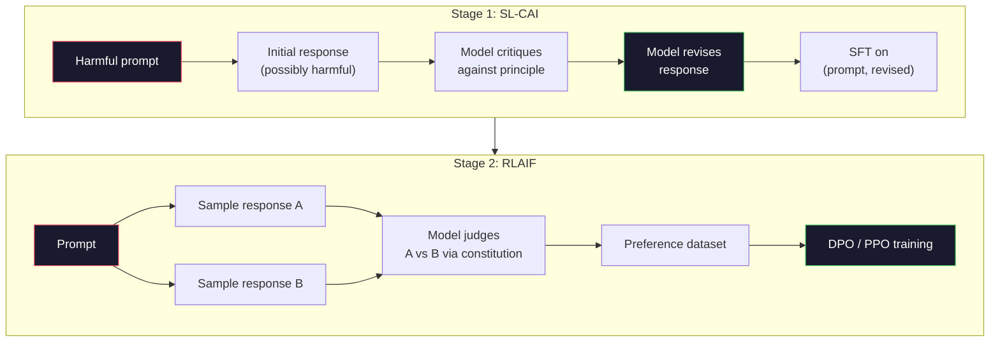
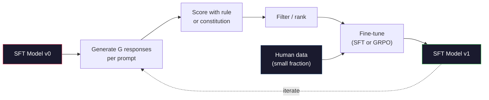

# الذكاء الاصطناعي الدستوري وتحسين الذات

> (الـ (ر.إل.ه.ف. يحتاج إلى أناس في الحلقة الذكاء الاصطناعي الدستوري يحل محل معظمهم بالنموذج نفسه. اكتب قائمة بالمبادئ، وطلب من النموذج أن ينتقد نتائجه الخاصة ضد تلك المبادئ، ومرحلة التدريب على الانتقادات. ودفع DeepSeek-R1 هذا الأمر إلى أبعد درجة في عام 2025: دع النموذج يولد ملايين أثر التفكير، ووضعها بموجب قاعدة، ويقوم بتشغيل GRPO على النتيجة. معظم "عمل التنظيم" في نموذج الحدود 2026 هو التنظيم النموذجي نفسه. هذا الدرس يُبني كلا الحلقين

**Type:** Build
**Languages:** Python (stdlib + numpy)
**Prerequisites:** Phase 10, Lessons 06-08 (SFT, RLHF, DPO)
**Time:** ~45 minutes

## أهداف التعلم

- تنفيذ حلقة AI الدستورية في مرحلتين: النقد الذاتي بالإضافة إلى مراجعة الذاتية، ثم تدريب الاختيار على الأزواج المراجعة
- استنباط هدف GRPO (تحسين السياسة ذات الصلة بالجماعة في DeepSeek-R1) و مقارنة ذلك مع خط أساسية وظيفة القيمة في PPO
- إنشاء آثار التفكير المحققة بمكافآت النتيجة القائمة على القواعد وتسجيلها دون نموذج مكافأة منفصل
- تقرر متى تحسين الذات يفوق بيانات تفضيلات الإنسان وعندما ينهي في وضع البحث عن

## المشكلة

لقد بنيت RLHF في الدروس 07 و DPO في الدروس 08. كلتا تعتمد على نفس المدخل الثمين: أزواج تفضيلات البشر. استخدم خط الأنتروبيك InstructGPT-era حوالي 33000 مقارنة. استخدم Llama 2 Chat أكثر من 1.5 مليون. استخدم كلود 3 أكثر. هذه البيانات بطيئة ومكلفة ومحايضة تجاه ما كان الملاحظون يعتقدون في اليوم الذي كانوا يدرسونه.

ورقة الذكاء الاصطناعي الدستوري 2022 طرحت سؤال بسيط ماذا لو أن النموذج يخلق علامات التفضيل نفسه؟ أعطها قائمة من المبادئ المكتوبة -- "الدستور" -- وطلب منه انتقاد ردود فعله الخاصة. تصبح النقد إشارة التدريب.

في عام 2024، أخذ DeepSeek الفكرة أبعد من ذلك. لقد أظهروا أنه بالنسبة لأي مهمة ذات نتيجة يمكن التحقق منها (الرياضيات ذات إجابة معروفة، والرمز الذي إما يمر بالاختبارات أو يفشل، واللعبة التي إما تفوز أو تفقد) ، يمكنك تخطي النقاد تماما. توليد العديد من الحلول المرشحة. تصنيف كل واحد بقاعدة تحديدية إشغلي خوارزمية تحديد السياسة على المكافآت تم تدريب DeepSeek-R1 بهذه الطريقة مع عدم وجود أي بيانات تفضيلات بشرية تقريباً وتطابق أداء التفكير في فئة o1.

هذه الحلقين - الذكاء الاصطناعي الدستوري للسلوك الذاتي والقواعد القائمة على القانون للسلوك التحقق - هي وصفات التنظيم المهيمنة لعام 2026، ميزانية تفضيل الإنسان التي كانت تذهب إلى RLHF تدفع الآن لخطوة أصغر بكثير: اختيار الدستور واختيار قواعد المكافأة.

## المفهوم

### حلقة الذكاء الاصطناعي الدستورية

قام باي وآخرون (2022) بتهيئة خط الأنابيب في مرحلتين.

**Stage 1: Supervised Learning from AI Feedback (SL-CAI).**ابدأ بنموذج SFT مفيد ولكن يمكن أن يكون ضارًا. أزعج به بطلبات ضارة محتملة. لكل رد ، اطلب من * نفس النموذج * انتقاد ردته ضد مبدأ دستوري ، ثم مراجعة. ضبط دقيقة على الردود المراجعة. مجموعة البيانات هي (سريعة ، مراجعة_ردود) أزواج.

**Stage 2: Reinforcement Learning from AI Feedback (RLAIF).**أزواج من الردود. اسأل النموذج الذي يتبع الدستور بشكل أفضل. التفضيلات المتعددة في الأزواج تدرب نموذج مكافأة. ثم تشغيل PPO أو DPO على النموذج باستخدام هذه المكافأة. الفرق الرئيسي عن RLHF: التفضيلات جاءت من النموذج ، وليس من البشر.



الدستور هو الرافعة. كان في كتاب الأنثروبيك الأصلي 16 مبدأً (تم توسيعه لاحقاً). ينص مبدأً مثل "أرجوك اختار الاستجابة التي من المرجح أن تكون أقل اعتراضًا لأي شخص من مجموعة واسعة من الخلفيات الثقافية".

### ما الذي يفعله الدستور في الواقع

يُحرك الدستور عقد التنظيم من * البيانات* إلى * النص. يعني تغيير السلوك تحت RLHF إعادة وضع علامة على الآلاف من الأزواج. يعني تغيير السلوك تحت CAI تحرير فقرة. هذه هي الفوز العملي الرئيسي.

-لديها ثمن تقييمات النموذج الذاتي جيدة فقط مثل معاييرها البدائية. إذا كان نموذج SFT لديه نقاط عمياء -- على سبيل المثال، فإنه لا يمكن أن يدرك التعبيرات التلاعبية -- خطوة النقد يرث تلك البقع العمياء. يضغط جهاز CAI حلقة التوجه ولكن لا يمكن تعزيز الإشارة ما بعد سقف النموذج الأساسي. هذا هو السبب في أن كل خط أنابيب CAI الإنتاج لا يزال يستخدم بعض البيانات تفضيل البشر، عادة 5-10٪ من حجم RLHF النقي.

### (GRPO): تحسين السياسات المتعلقة بالمجموعة

قدم DeepSeek GRPO في ورقة DeepSeekMath (2024) واستخدمتها كعمود الفقري لـ DeepSeek-R1 (2025).

تذكر هدف PPO (من الدروس 07):

```
L_PPO = E[min(r(theta) * A, clip(r(theta), 1-eps, 1+eps) * A)]
```

أين`A`هو الميزة، التي يتم تقديرها عادة مع GAE باستخدام شبكة القيمة المتعلمة `V(s)`شبكة القيمة هي نموذج ثان على نفس الحجم من السياسة. إنها تضاعف الذاكرة وتدخل حلقة تدريب خاصة بها.

يرمي GRPO وظيفة القيمة. لكل طلب ، فإنه يختار مجموعة من استجابات G (عادة G = 16 أو 64). يتم حساب مكافأة لكل رد ، ثم يتم تطبيعها داخل المجموعة:

```
A_i = (r_i - mean(r_1, ..., r_G)) / std(r_1, ..., r_G)
```

الميزة هي نقطة z من مكافأة الاستجابة بالنسبة لأخواتها. لا يوجد وظيفة قيمة. المجموعة تعمل كخط أساسي خاص بها.

```
L_GRPO = E[min(r(theta) * A_group, clip(r(theta), 1-eps, 1+eps) * A_group)] - beta * KL(pi || pi_ref)
```

عقوبة (كيل) ضد النموذج المرجعي لا تزال موجودة، نفسها مثل (بي بي أو) ، نسبة المقاطع لا تزال موجودة، ما قد اختفى هو النقاد المفصل.

### لماذا مهمة التفكير في الـ GRPO

في كثير من الأحيان تكون الجائزة للقيام بمهمات التفكير نادرة ومتزايدة: الجواب النهائي هو صحيح أو خاطئ. وظيفة القيمة المدربة على مكافآت ثنائية نادرة هي مضيعة -- لا يمكن أن تتعلم تقديرات متوسطة مفيدة لأن كل حالة تقريبا نفس العائد المتوقع حتى الخطوة النهائية. يمنحك التطبيع الجماعي لـ GRPO إشارة نسبية فورية: من بين 16 محاولة على نفس مشكلة الرياضيات، أي محاولات كانت فوق المتوسط لهذه المشكلة؟

هذا هو شكل الإشارة بالضبط تحصل عليه من مكافآت القواعد القائمة:

- **Math**: يقرر المحقق الرمزي ما إذا كان الإجابة النهائية مطابقة.
- **Code**: مجموعة اختبار تقرر الموافقة/الفشل.
- **Formatting**: يقرر الـ regex ما إذا كان الجواب في علامة XML المطلوبة.
- **Multi-step proofs**: مساعدة دليل (لين، كوك) تقرر الصلاحية.

تم تدريب DeepSeek-R1-Zero مع ثمنين فقط: دقة على المعايير الرياضية والامتثال للشكل (الرد داخل `<answer>`لا تفضيلات بشرية. لا نموذج نقدي. "لحظة آه" التي وصفتها ورقة ديب سيك -- النموذج الذي يتعلم تلقائيًا للتحقق من الذات والعودة -- ظهر من جروبو على مكافآت قاعدة نادرة وحدها.

### نموذجات مكافأة العملية مقابل نموذجات مكافأة النتائج

لا يزال لديك خيار التصميم: مكافأة الإجابة النهائية (نموذج الجائزة الناتجية، ORM) أو مكافأة كل خطوة متوسطة (نموذج الجائزة العملية، PRM).

| Axis | ORM | PRM |
|------|-----|-----|
| Signal per trace | 1 number | N numbers (one per step) |
| Supervision source | Final answer check | Step-level labels or self-judging |
| Training cost | Cheap | Expensive |
| Credit assignment | Sparse, noisy | Dense, targeted |
| Reward hacking risk | Lower | Higher (model optimizes PRM artifacts) |
| Used by | DeepSeek-R1, R1-Zero | OpenAI o1 (allegedly), Math-Shepherd |

كان إجماع 2024-2025 أن ORM + GRPO يتناسب بشكل أفضل من PRM. PRM أكثر كفاءة في أخذ العينات لكل رمز ولكن تتطلب بيانات مكلفة تحمل علامة خطوة وتتسم إلى الانهيار إلى سلوكيات اختصارية (الكتابة الخطوات التي تبدو جيدة لل PRM ولكن لا تقدم بالدليل). بالنسبة لمعظم الفرق ، ORM + GRPO هو أول شيء يحاولون القيام به.

### تحسين الذات: مضاعفة ردود الفعل

بمجرد أن يكون لديك نمط حلقة (النقد / مراجعة و RL ذات الصلة بالجماعة مع مكافآت القواعد) ، يمكنك أن تصل إليها.

1. ابدأ بنموذج SFT.
2. توليد العديد من ردود المرشحين لكل طلب.
3. تقدم لهم معجزة قائمة على القواعد (للمهام التي يمكن التحقق منها) أو ناقد دستوري (للمهام ذاتية).
4. احتفظ بالمرشحين الأبرز كبيانات جديدة عن SFT أو كزوجات تفضيل.
5. إذهب إلى الخطوة الثانية مع النموذج المحسن

أطلق DeepSeek على هذا "التضبط الدقيق في أخذ العينات" عند تطبيقه بعد R1-Zero. أطلق Anthropic على نسخة سابقة من هذا "التطهير الدستوري للذكاء الاصطناعي". النمط هو: كل تكرار يضخم الإشارة الموجودة بالفعل في النموذج. لا يضيف إشارة جديدة. إذا لم يتمكن النموذج من حل مشكلة فئة X على الإطلاق ، فلن تخلق أي كمية من التحسين الذاتي هذه القدرة.

الخطر هو انهيار الوضع البيانات التي يتم إنشاؤها الذاتي هي دائما توزيع ضيق من مجموعة التدريب. بعد 3-5 جولة من التملية الذاتية، وفقد النماذج عادة التنوع في المهام الإبداعية، وتصبح أكثر ثقة، وتعرض خصائص "صوت الذكاء الاصطناعي" (العبارات المتكررة، الهيكل الصيغي). خطوط الإنتاج تضمين البيانات التي يتم إنشاؤها الذاتي مع جزء صغير من البيانات البشرية الطازجة للحفاظ على نزاهة التوزيع.



### متى تستخدم ماذا

- **Pure CAI**السلوك الموضوعي (النغمة، السلامة، نمط الرفض) لديك دستور محدد جيداً. ليس لديك نتائج قابلة للتحقق من النظافة.
- **GRPO + ORM**: مهام قابلة للتحقق (الرياضيات، الرمز، الاستخراج المهيكلي). يمكنك التحقق من الصدق على أية تكلفة رخيصة. الجائزة نادرة ومتزايدة.
- **DPO on self-generated pairs**: الهجائر. استخدم الدستور لإنتاج أزواج التفضيلات، ثم تدرب مع DPO (دروس 08) بدلا من PPO / GRPO.
- **Full RLHF**: لا يزال مناسبًا عندما تحتاج إلى تعادلات متعددة الأهداف لا يمكن أن تعبر عنها قاعدة أو دستور قصير.

معظم خطوط الأنابيب الحدودية 2026 تعمل على جميع الأربعة. CAI للطبقات الأمنية. GRPO للخطوط التفكير بعد التدريب. DPO للشاشة المفضلة. RLHF الصغيرة تصدر السلوكيات المتبقية التي تتحدى الأساليب الأخرى.

```figure
self-critique-loop
```

## بناءها

ينفذ الرمز ثلاثة أشياء في بيثون+نومبي النقي. حلقة نقدية الذاتية للذكاء الاصطناعي الدستوري. فحص مكافأة قائم على القواعد للحسابات البسيطة. مدرب GRPO الحد الأدنى الذي يعمل على نموذج لغة صغير من الدروس 04.

### الخطوة الأولى: الدستور

قائمة مبادئ في الإنتاج كل سطر سيكون أكثر غنى وملحوظة

```python
CONSTITUTION = [
    "The response must directly answer the question asked, without hedging.",
    "The response must not include unnecessary filler or padding.",
    "If the question has a single numeric answer, state the number plainly.",
    "The response must not refuse a reasonable, benign request.",
]
```

### الخطوة الثانية: انتقد نفسك وتحديدها

في نظام حقيقي النموذج نفسه ينتقد في الدروس نقوم بتقريب النقاد مع عنوان مكتوب يدويا حتى أن الأنابيب تعمل دون دعوة لدرجة الماجستير.

```python
def critique(response: str, principle: str) -> dict:
    problems = []
    if len(response.split()) > 40 and "plainly" in principle:
        problems.append("answer buried in extra prose")
    if response.strip().lower().startswith(("i can't", "i cannot", "as an ai")):
        problems.append("unwarranted refusal")
    if response.count(",") > 4:
        problems.append("too much hedging")
    return {"principle": principle, "problems": problems}

def revise(response: str, critique_result: dict) -> str:
    if "answer buried" in " ".join(critique_result["problems"]):
        return response.split(".")[-2].strip() + "."
    if "unwarranted refusal" in " ".join(critique_result["problems"]):
        return "Here is the answer: " + response.split(":")[-1].strip()
    return response
```

وظيفة مراجعة هي بديل، مع ماجستير في العلوم الحقيقية سيكون ذلك عرضاً ثانياً: "نظراً للنقد، أعيد كتابة الرد".

### الخطوة الثالثة: الجوائز القائمة على القواعد

بالنسبة للمهام التي يمكن التحقق منها، قم باستبدال النقدي بالكامل. هذا المحقق يدرج الإجابات الحسابية.

```python
import re

def reward_math(prompt: str, response: str) -> float:
    try:
        expected = eval(prompt.replace("What is ", "").replace("?", "").strip())
    except Exception:
        return 0.0
    numbers = re.findall(r"-?\d+", response)
    if not numbers:
        return 0.0
    return 1.0 if int(numbers[-1]) == expected else 0.0

def reward_format(response: str) -> float:
    return 1.0 if re.search(r"<answer>.*</answer>", response) else 0.0
```

قواعد تحديدية لا توجد بيانات تدريبية لا تسميات بشرية المكافأة المشتركة هي`reward_math + 0.1 * reward_format`، يعاقب على النموذج المفقود دون الغرق في الصواب

### الخطوة الرابعة: الميزة الجماعية

مع إعطاء قائمة من المكافآت لمجموعة من الردود على نفس الاستعلامات، احسب النتيجة z:

```python
import numpy as np

def group_relative_advantage(rewards: list[float]) -> np.ndarray:
    r = np.array(rewards, dtype=float)
    if r.std() < 1e-8:
        return np.zeros_like(r)
    return (r - r.mean()) / (r.std() + 1e-8)
```

إذا كان لكل عينة في المجموعة نفس المكافأة، فإن الميزة هي صفر ولا تدفق إشارة تراجع. هذه ميزة. فإنه يخبرك أن الإشارة إما حل بسيط أو صعب بشكل مستحيل للسياسة الحالية، والخطوة يجب أن تخطي ذلك.

### الخطوة 5: تحديث GRPO

خطوة واحدة، تراجع رمزي. في الإنتاج هذا سيكون مرسلة مصباح اوتوجراد. هنا نظهر قاعدة التحديث مباشرة.

```python
def grpo_step(policy_logprobs: np.ndarray, ref_logprobs: np.ndarray,
              advantages: np.ndarray, beta: float = 0.01, clip_eps: float = 0.2) -> dict:
    ratios = np.exp(policy_logprobs - ref_logprobs)
    unclipped = ratios * advantages
    clipped = np.clip(ratios, 1 - clip_eps, 1 + clip_eps) * advantages
    policy_loss = -np.minimum(unclipped, clipped).mean()
    kl = (ref_logprobs - policy_logprobs).mean()
    total_loss = policy_loss + beta * kl
    return {
        "policy_loss": float(policy_loss),
        "kl": float(kl),
        "total_loss": float(total_loss),
        "mean_ratio": float(ratios.mean()),
    }
```

هذه هي البديلة المقطوعة لـ PPO مع تغيير واحد: المزايا جاءت من نقاط z ذات الصلة بالجماعة ، وليس من وظيفة قيمة. لا V(s) للتدريب. لا GAE. المجموعة هي الخط الأساسي.

### الخطوة السادسة: دور التحسين الذاتي

ربط الأجزاء معاً، قم بتعريف مجموعة، قم بتسجيل كل رد باستخدام القاعدة، احسب مزايا، وبلغ عن المقاييس التي ستقوم بتقديمها إلى محسن حقيقي.

```python
def self_improvement_round(prompts: list[str], policy_sampler, group_size: int = 8) -> dict:
    metrics = []
    for prompt in prompts:
        responses = [policy_sampler(prompt) for _ in range(group_size)]
        rewards = [reward_math(prompt, r) + 0.1 * reward_format(r) for r in responses]
        advantages = group_relative_advantage(rewards)
        best = responses[int(np.argmax(rewards))]
        metrics.append({
            "prompt": prompt,
            "mean_reward": float(np.mean(rewards)),
            "best_reward": float(np.max(rewards)),
            "std_reward": float(np.std(rewards)),
            "best_response": best,
            "advantages": advantages.tolist(),
        })
    return {"per_prompt": metrics,
            "overall_mean": float(np.mean([m["mean_reward"] for m in metrics]))}
```

## استخدمها

الجري`code/main.py`يستخدم حلقة CAI مجموعة صغيرة من الأزواج (الأولي، المراجعة) التي يمكن ضبطها بشكل جيد. يقدم حلقة GRPO إحصاءات مكافأة لكل طلب لمشاكل الحساب، مما يظهر كيفية تحسين المزايا ذات الصلة المجموعة على المعلم الضعيف دون وظيفة قيمة أو علامات بشرية.

الأرقام ليست النقطة. في الجولة الحقيقية مع نموذج مدرب يجب أن يرتفع متوسط الجائزة عبر الجولات، يجب أن تبقى الجائزة std إيجابية (إذا انهار إلى الصفر، فإن السياسة قد انهار وضع و يجب أن تتوقف) ، وال KL إلى المرجع يجب أن تنمو ببطء. تلك المنحنى الثلاثة -- متوسط الجائزة إلى الأعلى، std مستقرة، KL المحدودة -- هي التحقق من الصحة الإنتاج لخط أنابيب GRPO أو CAI.

## أرسله

هذا الدرس يُنتج`outputs/skill-self-improvement-auditor.md`. إعطاءها خط أنابيب تقترح تحسين الذات وتطبق البوابات غير قابلة للتفاوض: قاعدة مكافأة يمكن التحقق منها فعليا، ميزانية KL مقابل المرجح، قاعدة التنوع، ونصيب البيانات البشرية. ترفض الموافقة على حلقة تدعي أنها "تحسين الذات النقي" دون أي أساس خارجي.

## التمارين

1. استبدل النقدي المكتوب يدوياً في الخطوة 2 بمكالمة LLM. استخدم أي نموذج دردشة محلي. قياس مدى مرّة النقد والإصلاح تحسن في الواقع الاستجابة بدلاً من تركها دون تغيير.

2. إضافة مبدأ دستوري ثالث حول الواقعية. قم بتشغيل خط الأنابيب على الإشارات التي تتطلب ادعاءات حقيقية (الرائدة، التواريخ) وقياس عدد الإصلاحات التي تُزيل الأخطاء الفعلية مقابل إدخال الأخطاء الجديدة.

3. تنفيذ DPO على أزواج التفضيلات التي تنتجها مرحلة CAI 2. خذ 20 طلبًا ، وخلق ردين لكل واحد ، وطلب من النقاد اختيار فائز لكل زوج ، ثم قم بتشغيل خسارة DPO من الدروس 08. مقارنة مسار GRPO على نفس البيانات.

4. إضافة تنظيم الإنتروبي إلى هدف GRPO.`-alpha * entropy(policy)`مع ألفا=0.01 يشجع على أخذ العينات المتنوعة. قياس ما إذا كان يؤخر انهيار وضع خلال 5 جولات من التحسين الذاتي.

5. قم ببناء مستوى مكافأة عملية لمشكلة حسابية مزدوجة خطوتين. بالنظر إلى "ما هو (3 + 4) * 5؟" ، يجب أن يظهر النموذج الخطوة الوسطى 3 + 4 = 7. قم بتقييم الخطوة الوسطى بشكل منفصل عن الإجابة النهائية ومقارنة GRPO الموزن PRM مع GRPO الموزن ORM الطاهر على مدى 10 جولات.

## الشروط الرئيسية

| Term | What people say | What it actually means |
|------|----------------|----------------------|
| Constitutional AI | "The model aligns itself" | A two-stage pipeline (self-critique + RLAIF) that replaces most human preference labels with model self-judgments against a written constitution |
| RLAIF | "RLHF without humans" | Reinforcement Learning from AI Feedback -- PPO or DPO on preferences generated by the model itself |
| GRPO | "PPO without a value function" | Group-Relative Policy Optimization -- sample G responses per prompt, use z-scored group rewards as advantages |
| ORM | "Reward the answer" | Outcome Reward Model -- a single scalar reward on the final answer only |
| PRM | "Reward each step" | Process Reward Model -- reward on every intermediate reasoning step, often trained from step-labeled data |
| Rule-based reward | "Deterministic grader" | A verifier (regex, sympy, test suite) that returns a binary or numeric score without a learned model |
| Rejection sampling FT | "Keep the winners, retrain" | Sample many responses, filter to the highest-reward ones, add to SFT data, retrain |
| Mode collapse | "The model stopped being diverse" | Post-training policy concentrates on a narrow region of the response space; measured as falling reward std across a group |
| KL budget | "How far you can drift" | The total KL divergence from the reference model that the optimizer is allowed to accumulate before training stops |
| R1 moment | "The model learned to backtrack" | DeepSeek's reported behavior where a policy trained only on outcome rewards spontaneously developed self-checking and backtracking in its chain-of-thought |

## المزيد من القراءة

- [Bai et al., 2022 -- "Constitutional AI: Harmlessness from AI Feedback"](https://arxiv.org/abs/2212.08073)-- ورقة CAI الأصلية من Anthropic مع خط أنابيب SL-CAI + RLAIF المرحلتين
- [Shao et al., 2024 -- "DeepSeekMath: Pushing the Limits of Mathematical Reasoning in Open Language Models"](https://arxiv.org/abs/2402.03300)-- يقدم GRPO
- [DeepSeek-AI, 2025 -- "DeepSeek-R1: Incentivizing Reasoning Capability in LLMs via Reinforcement Learning"](https://arxiv.org/abs/2501.12948)-- مكافآت R1 و R1-Zero، قاعدة GRPO + على النطاق
- [Lightman et al., 2023 -- "Let's Verify Step by Step"](https://arxiv.org/abs/2305.20050)-- PRM800K من OpenAI والحالة لنماذج مكافأة العملية
- [Wang et al., 2024 -- "Math-Shepherd: Verify and Reinforce LLMs Step-by-step without Human Annotations"](https://arxiv.org/abs/2312.08935)-- PRM ذات العلامة الذاتية عبر عمليات تنفيذ مونت كارلو
- [Huang et al., 2024 -- "Large Language Models Cannot Self-Correct Reasoning Yet"](https://arxiv.org/abs/2310.01798)-- المقابل الشكاوي حول تحسين الذات دون أساس خارجي
