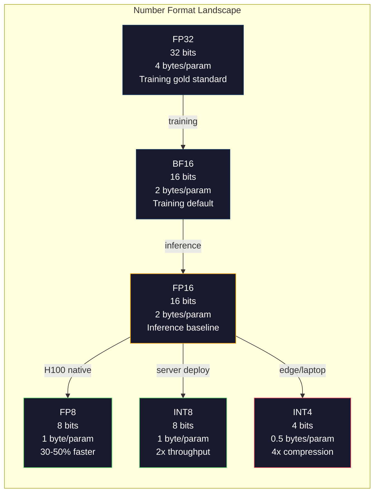
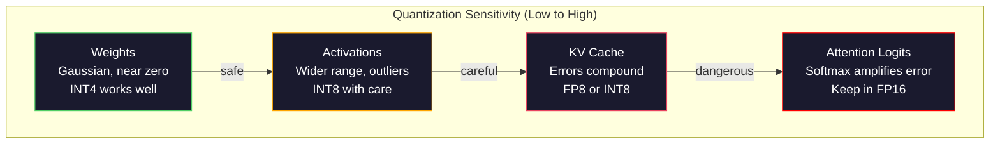
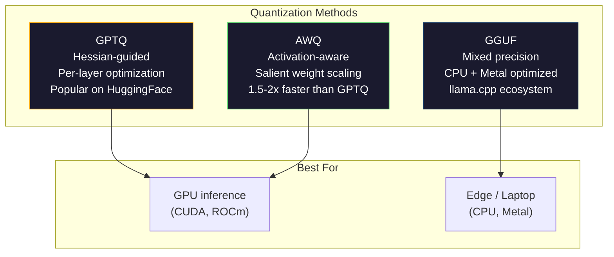

# الكمية: جعل النماذج مناسبة

> طراز 70 بي في FP16 يحتاج 140 جيجا غايت، اثنين من A100 فقط للوزن، كوانتيزة إلى FP8: واحد 80 جيجا غايت GPU:

**Type:** Build
**Languages:** Python (with numpy)
**Prerequisites:** Phase 10, Lessons 01-10 (LLMs from Scratch)
**Time:** ~120 minutes

## أهداف التعلم

- تنفيذ التعريف الكمي التناغمي وغير التناغمي من FP16 إلى INT8 و INT4 بما في ذلك تحديد حجم كل تنسور وكل قناة
- حساب مدخرات الذاكرة من الكميات وتحديد الدقة التي تناسب VRAM من GPU معينة
- شرح الفرق بين تعريف الكم بعد التدريب (PTQ) وتدريب معرفة الكم (QAT)
- تطبيق GPTQ أو AWQ لقياس النموذج الحقيقي وقياس التنازل بين الدقة والذاكرة على مقياس مقارنة

## المشكلة

لاما 3 70B لديها 70 مليار مبرمير. كل مبرمير هو رقم نقطة عائمة 16 بت. وهذا هو 140 مليار بايت. 140 جيجابايت. A100 واحد لديه 80 جيجابايت من VRAM. لا يمكنك حتى تحميل الوزن، ناهيك عن تشغيل الاستنتاجات، على GPU واحد. تحتاج A100 اثنين في 2 دولار كل ساعة فقط لتقديم نموذج واحد.

ولكن 16 بت لكل پیرامتر هو مضيعة. معظم الوزن في مجموعة شبكة عصبية قريبة من الصفر. النطاق الديناميكي الكامل من FP16 (من 0.000000059 إلى 65.504) غير مستخدم تقريباً بالكامل. إذا قمت بقياس التوزيع الفعلي للوزن في Llama 3 70B، فإن 95% منهم تقع بين -0.1 و +0.1. كنت تحرق 16 بت لتمثيل القيم التي يمكن أن تناسب في 4.

تحلّق النمط الكمبيوتر المعدنيّة محل الأرقام عالية الدقة بأرقام أقل دقة. FP16 إلى FP8 يقلل من الذاكرة إلى النصف. FP16 إلى INT4 يقلل من الذاكرة إلى ربع. هذا النمط 140 جيجابايت يصبح 35 جيجابايت. يتناسب مع GPU لمستهلك واحد. اضغط على النمط الكمبيوتر المعدنيّة إلى 2 بت (عديّة، خسارة، ولكن قابلة للاستخدام في بعض المهام) ويتم تشغيلها نفس النمط على كمبيوتر حاسوب 16 جيجابايت.

التكلفة هي الدقة. كل قطعة تقوم بإزالتها تدمير المعلومات. السؤال هو كم من الدقة تفقدها وأين. نموذج INT4 مقياس جيد يحافظ على 95-99٪ من نوعية الأصلية على معظم المعايير. يمكن أن يدمر نموذج INT4 بشكل كامل. الفرق هو التقنية.

تظهر الكميات المجتمعية من Llama 3 إلى INT4 مع GPTQ حوالي 1-2 نقطة حيرة ضائعة على ويكتيكست. أصدرت Mistral نقاط تفتيش FP8 من Mixtral 8x22B مع صفر فقدان نوعية قابلة للقياس على MMLU. تنشط تنسيق GGUF llama.cpp ، وتشغيل طراز 70B على المكتبات الميك بوك مع رقائق M-series. الكميات ليست اختراقًا. إنها مسار التنفيذ القياسي لكل طراز أكبر من 7B.

## المفهوم

### أشكال الأرقام: ما تفعله كل قطعة

كل رقم من نقاط العدوى لديه ثلاثة أجزاء: علامة، ومعربة، ومنتسيسا (المسمى أيضاً significand). علامة واحدة. يحدد المنتسيسة النطاق (كم عدد يمكن أن يكون كبيرًا أو صغيرًا). يحدد mantissa الدقة (كم من الأماكن العشرية تحصل عليها).

```
FP32:  [1 sign] [8 exponent] [23 mantissa]  = 32 bits
FP16:  [1 sign] [5 exponent] [10 mantissa]  = 16 bits
BF16:  [1 sign] [8 exponent] [7  mantissa]  = 16 bits
FP8:   [1 sign] [4 exponent] [3  mantissa]  = 8  bits (E4M3)
FP8:   [1 sign] [5 exponent] [2  mantissa]  = 8  bits (E5M2)
INT8:  [1 sign] [7 value]                   = 8  bits (uniform steps)
INT4:  [1 sign] [3 value]                   = 4  bits (16 levels total)
```

**FP32**هو دقة كاملة. 23 بت من mantissa يعطيك حوالي 7 أرقام عشرية من الدقة. النطاق: حوالي 1.2 x 10^-38 إلى 3.4 x 10^38. كان التدريب يحدث حصرا في FP32.

**FP16**يقلل النسبة إلى 5 أرقام عشرية. يقلل العامل إلى 5 أرقام عشرية، مما يقلل من النطاق بشكل كبير (قيمة أقصى ~ 65.504). هذا جيد للأوزان (التي تتجمّع بالقرب من الصفر) ولكن خطير للتفعيل والتحريفات التي يمكن أن ترتفع خلال التدريب. يتطلب تدريب FP16 تراجعاً للخسائر لمنع التدفق السفلي.

**BF16**(مغاز الدماغ 16) يبقي المعرض 8 بتات من FP32 ولكن يقلل من mantissa إلى 7 بتات. نفس النطاق مثل FP32، أقل دقة من FP16. لقد صممتها جوجل خصيصاً للتعلم العميق. الحدس: المدى مهم أكثر من الدقة لشبكات العصبية. ينخفض تراجع 10^-20 إلى الصفر في FP16 ويعيش في BF16. وزن 0.07342 الذي يتجول إلى 0.0734 في BF16 قريب بما فيه الكفاية. كل دورة تدريب حديثة تستخدم BF16 أو مزيج BF16/FP32.

**FP8**يستخدم E4M3 (4 مستعرض ، 3 mantissa) للوزن والتنشيط أثناء الإستنتاج. يستخدم E5M2 (5 مستعرض ، 2 mantissa) للنحو أثناء التدريب حيث يعتبر المدى أكثر من الدقة. يصل إستنتاج FP8 على GPU H100 إلى 30-50% من السرعة على FP16 مع فقدان نوعية لا يذكر.

**INT8**هو شكل عدد كامل. لا يوجد مؤشر، لا يوجد مانتيسا. فقط 256 قيم متساوية من -128 إلى 127. تحتاج إلى عامل مقياس لخريطة وزنات النقاط العائمة في هذا النطاق. الميزة: الرياضيات العائمة أسرع وأكثر كفاءة من النقاط العائمة. مضاعفة ماتريكس INT8 على A100 تعمل عند 624 TOPS مقابل 312 TFLOPS ل FP16.

**INT4**يضغط أبعد. فقط 16 قيم ممكنة. عامل المقياس لا يقلل من الوزن. الجودة تعتمد بالكامل على كيفية اختيار المقياس والوزن الذي تقوم بتقييمه. أحدث طرق INT4 (GPTQ، AWQ) تحتفظ بنسبة 95% + من نوعية النموذج الأصلي.



### كيف تعمل الكمية

العملية الأساسية بسيطة. خذ تنصر من قيم النقاط العائمة، والعثور على عامل النطاق، والضاعفة، والجولة إلى أقرب عدد كامل، وتخزين الأعداد الصحيحة زائد عامل النطاق.

**Quantize:**
```
scale = max(abs(tensor)) / max_int_value
quantized = round(tensor / scale)
```

**Dequantize:**
```
reconstructed = quantized * scale
```

بالنسبة لـ INT8 مع نطاق متساوي (-127 إلى 127):
```
scale = max(abs(tensor)) / 127
quantized = clamp(round(tensor / scale), -128, 127)
```

الخطأ هو خطأ التجول. كل قيمة يمكن أن تكون خارجة بأكثر `scale / 2`. يعتمد الكل من الأخطاء على الطبقة على عدد الوزن الذي لديك ومدى حساسية النموذج للتشويش في تلك الوزن.

**Per-tensor vs per-channel quantization.**يستخدم المضغط المضغوط عامل مقياس واحد للمصفوفة الكاملة للوزن. بسيطة ولكن خسارة: إذا كان عمود واحد له قيم كبيرة والآخر له قيم صغيرة، فإن القيم الصغيرة تفقد معظم دقةها. يستخدم كل قناة عامل مقياس واحد لكل قناة خروج (في كل صف أو عمود من المصفوفة الوزنية). تكلفة أكثر (أنت تخزن عوامل مقياس N بدلا من 1) ولكن نوعية أفضل بشكل كبير. كل طريقة كمية الإنتاج تستخدم حشرية لكل قناة أو حشرية أكثر دقة.

**Asymmetric quantization**يضيف تعويض صفر نقطة: `quantized = round(tensor / scale) + zero_point`. هذا يتعامل مع التوزيعات التي ليست مركزة على الصفر. تنشيطات ReLU ، على سبيل المثال ، هي دائمًا غير سلبية. تضييع الكميات التناظرية نصف نطاق الأعداد الكاملة على القيم السلبية التي لا تظهر أبدًا. تقوم الكميات التناظرية بتخريط النطاق الفعلي [min ، أقصى] إلى نطاق الأعداد الكاملة الكاملة.

### الهرم الحساس

ليس كل شيء في النموذج يتسامح مع التعريف الكمي على قدم المساواة. هناك Hierarchy واضحة.

**Weights (most robust).**تغير أوزان النموذج ببطء أثناء التدريب وتتبع توزيع غوسسي تقريبًا مركزًا بالقرب من الصفر. فإنها تُعدد جيدًا. تُنتج أوزان INT8 مع مقياسات لكل قناة نتائج غير خسارة تقريبًا. تتطلب INT4 أساليبًا أكثر تعقيدًا ولكنها تعمل.

**Activations (moderate sensitivity).**التفعيلات هي القيم المتوسطة التي تتدفق عبر الشبكة أثناء الإستنتاج. لديهم نطاق ديناميكي أوسع من الوزن ويحتوي على مستويات خارجية. رأس واحد من الاهتمام قد ينتج قيم التفعيل 100x أكبر من المتوسط. هذه القياسات الغير معقولة بالنسبة إلى جودة النموذج. تُكُونُ الكُمّةِ لهم تُدمّر المعلوماتِ بشكل ساذج. الحلول: الحفاظ على القنوات الخارقة في دقة أعلى (LLM.int8() ، استخدام مقياسات تنشيط لكل رمز أو لكل قناة.

**KV cache (high sensitivity).**يحتفظ الاحتفاظ القيمة الرئيسية بحالات الاهتمام لجميع الرموز السابقة. في أطول مستويات طويلة، يهيمن الاحتفاظ الكهربائي على الذاكرة. بالنسبة لنموذج 70B في سياق 32K، فإن الاحتفاظ الكهربائي وحده هو 40GB في FP16. تحويل الاحتفاظ الكهربائي إلى FP8 أو INT8 يوفر ذاكرة ضخمة ولكن أي أخطاء تتراكم في جميع حسابات الاهتمام المستقبلية. يتكافح تأثير الجودة مع طول التسلسل.

**Attention logits (most sensitive).**يُمكن أن يغير توزيع الاهتمام بشكل كبير. معظم مخططات الكمية تبقي حساب الاهتمام بدقة أعلى (FP16 أو BF16) حتى عندما يتم كميات كل شيء آخر.



### PTQ مقابل QAT

**Post-Training Quantization (PTQ)**يُعدّل النموذج المُدرّب بالفعل. لا يوجد إعادة التدريب. تأخذ وزنات FP16، عوامل مقياس الحساب، وتجول، وتنشر. سريع (من دقائق إلى ساعات) ورخيص. يعمل بشكل جيد لـ INT8 و FP8. بالنسبة لـ INT4, غالباً ما يفشل PTQ البسيط بشكل سيء لأن أخطاء التجول تتراكم. تستخدم طرق PTQ المتقدمة (GPTQ، AWQ) بيانات التصفية لتقليل خطأ الكميات.

**Quantization-Aware Training (QAT)**يضيف عمليات الكميات المزيفة إلى الممر المباشر أثناء التدريب. يتعلم النموذج وضع وزنه حيث تكون أخطاء التدريب صغيرة. تدفق المعدلات من خلال التكيف الكمي المزيف باستخدام مقياس المباشر (STE): افترض أن عملية التدويج لها تراجيع 1. إن QAT تنتج طرازات INT4 و INT2 أفضل من PTQ ولكنها تتطلب تدريبًا كاملًا. استخدمت جوجل QAT لخدمة التوأم الكافية. استخدم (ميتا) (QAT) لبعض أهداف نشر (إلاما

| Aspect | PTQ | QAT |
|--------|-----|-----|
| Cost | Minutes to hours | Full training run |
| Quality at INT8 | Excellent (< 0.1% loss) | Excellent |
| Quality at INT4 | Good with GPTQ/AWQ (1-3% loss) | Better (< 1% loss) |
| Quality at INT2 | Poor | Usable for some tasks |
| Calibration data | 128-1024 examples | Full training dataset |
| When to use | Deployment, iteration | Maximum quality at low bit-width |

### GPTQ، AWQ، GGUF

**GPTQ (GPT Quantization)**هو طريقة PTQ واحدة. يقدر الوزن بمقدار الطبقة الواحدة في كل مرة، باستخدام مجموعة بيانات تحديد صغيرة (128 مثال نموذجيا) لقياس الهيسيان (المعلومات من النظام الثاني حول مدى حساسية الخروج لكل وزن). الوزن الذي يقول الهيسيانيه مهم يتم تعديله بعناية أكبر كان GPTQ أول طريقة لجعل تعريف INT4 عمليًا لدرجات القانون. وقد أعلنت TheBloke على Hugging Face GPTQ عن طريق إطلاق نسخة كمية من مئات النماذج.

**AWQ (Activation-Aware Weight Quantization)**يلاحظ أن جزءًا صغيرًا من الوزن (حوالي 1%) مهم بشكل غير متناسب لأنها تتضاعف مع قيم تنشيط كبيرة. يحدد AWQ هذه الوزن المهمة باستخدام بيانات التصفية ويزيد من حجمها قبل التعريف الكمي (ثم يقلل من حجم التفعيلات المقابلة). هذا يبقي الوزن المهم في نطاق حيث تكون كمية INT4 دقيقة. عادة ما يطابق AWQ أو يتفوق قليلاً على جودة GPTQ بينما يكون أسرع بنسبة 1.5-2x للتطبيق.

**GGUF (GPT-Generated Unified Format)**هو تنسيق الملف المستخدم من قبل llama.cpp ونظامها الإيكولوجي. إنه يدعم التكميم المختلط: الطبقات المختلفة تحصل على عرض البيت المختلف. يتم عادةً الاحتفاظ بالطبقات الأولى والأخيرة (رأس الإدخال والخروج) بدقة أعلى. الطبقات الوسطى تحصل على INT4 أو INT3. ملفات GGUF هي ذاتية الحكم: الوزن، الوهم، البيانات المعدنية كل في ملف واحد. تم تصميم النموذج لإستنتاج CPU و Apple Silicon ، حيث تحميل النموذج بأكمله في الذاكرة وتشغيل مضاعفات المصفوفة على CPU أو GPU المعدنية هو المسار القياسي. Q4_K_M هو النوع الأكثر شعبية من GGUF تعريف الكمية، توازن الجودة والحجم.



### قياس الجودة

كيف تعرف إن كان نموذجك الكمي لا يزال جيدًا؟

**Perplexity.**المقياس الأكثر شيوعاً. أقل هو أفضل. احسب الارتباك على مجموعة بيانات تمت الاحتفاظ بها (ويكي تيست-2 هو معيار) لكل من النموذج الأصلي والكمي. يخبرك دلتا كمية المعلومات التي دمرتها الكمية. قواعد البصمة: دلتا < 0.5 ممتازة ، 0.5-1.0 جيدة ، 1.0-2.0 مقبولة لمعظم المهام ، > 2.0 يعني أن شيء ما قد حدث خطأ.

**Task-specific benchmarks.**قم بتشغيل النموذج الكمي على MMLU أو HumanEval أو GSM8K أو مجموعة تقييمك المخصصة. مقارنة مع الأصلي. يؤثر الكمية على القدرات المختلفة بشكل غير متساوي. مهام الرياضيات والرموز أكثر حساسية لخسارة الدقة من المعرفة العامة.

**Output comparison.**إنشاء استجابات من كلا النماذج على نفس الطلبات ومقارنة. يعمل LLM-as-judge (دروس 10) بشكل جيد هنا. حساب معدل الفوز: ما هو جزء من الطلبات التي يطابقها النموذج الكمي أو يفوق الأصلي؟

**Latency and throughput.**توجد عملية كمية لتجعل النماذج أسرع وأرخص. قياس الرموز في الثانية، والوقت إلى الرموز الأولى، واستخدام الذاكرة. النموذج الكمية التي هي أبطأ من الأصلي هو أسوأ من غير مفيد.

| Model | Format | Size | Perplexity (WikiText-2) | MMLU | Tokens/sec (A100) |
|-------|--------|------|------------------------|------|-------------------|
| Llama 3 70B | FP16 | 140GB | 3.12 | 79.5% | 38 |
| Llama 3 70B | FP8 | 70GB | 3.14 | 79.3% | 55 |
| Llama 3 70B | GPTQ INT4 | 35GB | 4.32 | 77.8% | 72 |
| Llama 3 70B | AWQ INT4 | 35GB | 4.18 | 78.1% | 75 |
| Llama 3 70B | GGUF Q4_K_M | 40GB | 4.25 | 77.9% | 28 (CPU) |

النمط: FP8 مجاني تقريباً. INT4 يكلف 1-2 نقطة MMLU ولكن يضاعف التكامل والذاكرة. التنازل يستحق ذلك تقريبًا في كل عملية نشر.

### الأرقام الحقيقية

FP16 إلى FP8 على H100: 30-50% تسريع الاستنتاج، < 0.1% فقدان الجودة. هذا هو الكمية بدون دماغ. كل نشر H100 يجب أن تستخدم.

FP16 إلى INT8 (LLM.int8()): تخفيض الذاكرة 2x ، < 0.5% فقدان الجودة. يحتفظ نهج الدقة المختلطة بميزات خارجية في FP16 بينما يتم تحديد كل شيء آخر إلى INT8.

FP16 إلى INT4 (GPTQ / AWQ): 4x تقليل الذاكرة ، خسارة الجودة 1-3% اعتمادًا على النموذج والطريقة. تمكين نماذج 70B على GPU واحد 48GB.

FP16 إلى INT4 (GGUF Q4_K_M): تخفيض ذاكرة 3.5x ، فقدان نوعية 1-2%. محسن لإستنتاج CPU. نموذج 70B في Q4_K_M حوالي 40GB ويستخدم عند 10-15 رمزا / ثانية على M3 Max مع 64GB.

FP16 إلى INT2: 8x تقليل الذاكرة، 5-15% فقدان الجودة. فقط قابلة للتطبيق في مهام محددة ضيقة حيث يمكنك تحمل التدهور. الحدود البحثية، ليست جاهزة للإنتاج للاستخدام العام.

```figure
quantization
```

## بناءها

### الخطوة الأولى: تمثيلات في شكل الأرقام

بناء تمثيل على مستوى البيت لكل تنسيق لرؤية بالضبط ما علامة، المُعرب، و mantissa تفعل.

```python
import numpy as np


def float_to_fp32_bits(value):
    bits = np.float32(value).view(np.uint32)
    sign = (bits >> 31) & 1
    exponent = (bits >> 23) & 0xFF
    mantissa = bits & 0x7FFFFF
    return {"sign": int(sign), "exponent": int(exponent), "mantissa": int(mantissa),
            "exponent_bits": format(int(exponent), '08b'),
            "mantissa_bits": format(int(mantissa), '023b'),
            "value": float(value),
            "actual_exponent": int(exponent) - 127}


def float_to_fp16_bits(value):
    fp16 = np.float16(value)
    bits = fp16.view(np.uint16)
    sign = (bits >> 15) & 1
    exponent = (bits >> 10) & 0x1F
    mantissa = bits & 0x3FF
    return {"sign": int(sign), "exponent": int(exponent), "mantissa": int(mantissa),
            "exponent_bits": format(int(exponent), '05b'),
            "mantissa_bits": format(int(mantissa), '010b'),
            "value": float(fp16),
            "actual_exponent": int(exponent) - 15}


def float_to_bf16_bits(value):
    fp32_bits = np.float32(value).view(np.uint32)
    bf16_bits = (fp32_bits >> 16).astype(np.uint16)
    sign = (bf16_bits >> 15) & 1
    exponent = (bf16_bits >> 7) & 0xFF
    mantissa = bf16_bits & 0x7F
    reconstructed = np.uint32(bf16_bits.astype(np.uint32) << 16).view(np.float32)
    return {"sign": int(sign), "exponent": int(exponent), "mantissa": int(mantissa),
            "exponent_bits": format(int(exponent), '08b'),
            "mantissa_bits": format(int(mantissa), '07b'),
            "value": float(reconstructed),
            "actual_exponent": int(exponent) - 127}


def simulate_fp8_e4m3(value):
    sign = 1 if value < 0 else 0
    abs_val = abs(value)
    max_val = 448.0
    abs_val = min(abs_val, max_val)
    if abs_val == 0:
        return {"sign": sign, "exponent": 0, "mantissa": 0, "value": 0.0,
                "exponent_bits": "0000", "mantissa_bits": "000"}
    exp = int(np.floor(np.log2(abs_val)))
    exp = max(-6, min(8, exp))
    mantissa_val = abs_val / (2.0 ** exp) - 1.0
    mantissa_quant = round(mantissa_val * 8) / 8
    mantissa_quant = max(0, min(0.875, mantissa_quant))
    reconstructed = (1.0 + mantissa_quant) * (2.0 ** exp)
    if sign:
        reconstructed = -reconstructed
    mantissa_int = int(round(mantissa_quant * 8))
    return {"sign": sign, "exponent": exp + 7, "mantissa": mantissa_int,
            "exponent_bits": format(exp + 7, '04b'),
            "mantissa_bits": format(mantissa_int, '03b'),
            "value": float(reconstructed),
            "actual_exponent": exp}


def display_format_comparison(value):
    fp32 = float_to_fp32_bits(value)
    fp16 = float_to_fp16_bits(value)
    bf16 = float_to_bf16_bits(value)
    fp8 = simulate_fp8_e4m3(value)

    print(f"\n  Value: {value}")
    print(f"  {'Format':<8} {'Stored Value':>14} {'Error':>12} {'Sign':>5} {'Exp Bits':>10} {'Man Bits':>25}")
    print(f"  {'-'*76}")
    print(f"  {'FP32':<8} {fp32['value']:>14.6f} {abs(fp32['value'] - value):>12.8f} {fp32['sign']:>5} {fp32['exponent_bits']:>10} {fp32['mantissa_bits']:>25}")
    print(f"  {'FP16':<8} {fp16['value']:>14.6f} {abs(fp16['value'] - value):>12.8f} {fp16['sign']:>5} {fp16['exponent_bits']:>10} {fp16['mantissa_bits']:>25}")
    print(f"  {'BF16':<8} {bf16['value']:>14.6f} {abs(bf16['value'] - value):>12.8f} {bf16['sign']:>5} {bf16['exponent_bits']:>10} {bf16['mantissa_bits']:>25}")
    print(f"  {'FP8e4m3':<8} {fp8['value']:>14.6f} {abs(fp8['value'] - value):>12.8f} {fp8['sign']:>5} {fp8['exponent_bits']:>10} {fp8['mantissa_bits']:>25}")
```

### الخطوة الثانية: الكمية التناظرية (للفاحة ولوحية)

العمليات الكمية الأساسية. يستخدم المضغوط المقياس واحد للمصفوفة بأكملها. يستخدم المقرب المقياس واحد لكل صف أو عمود.

```python
def quantize_symmetric(tensor, num_bits=8):
    qmin = -(2 ** (num_bits - 1))
    qmax = 2 ** (num_bits - 1) - 1
    abs_max = np.max(np.abs(tensor))
    if abs_max == 0:
        return np.zeros_like(tensor, dtype=np.int32), 1.0
    scale = abs_max / qmax
    quantized = np.clip(np.round(tensor / scale), qmin, qmax).astype(np.int32)
    return quantized, float(scale)


def dequantize_symmetric(quantized, scale):
    return quantized.astype(np.float64) * scale


def quantize_per_channel(tensor, num_bits=8, axis=0):
    qmin = -(2 ** (num_bits - 1))
    qmax = 2 ** (num_bits - 1) - 1

    if axis == 0:
        abs_max = np.max(np.abs(tensor), axis=1, keepdims=True)
    else:
        abs_max = np.max(np.abs(tensor), axis=0, keepdims=True)

    abs_max = np.where(abs_max == 0, 1.0, abs_max)
    scales = abs_max / qmax
    quantized = np.clip(np.round(tensor / scales), qmin, qmax).astype(np.int32)
    return quantized, scales.squeeze()


def dequantize_per_channel(quantized, scales, axis=0):
    if axis == 0:
        return quantized.astype(np.float64) * scales.reshape(-1, 1)
    else:
        return quantized.astype(np.float64) * scales.reshape(1, -1)


def quantize_asymmetric(tensor, num_bits=8):
    qmin = 0
    qmax = 2 ** num_bits - 1
    t_min = np.min(tensor)
    t_max = np.max(tensor)
    if t_max == t_min:
        return np.zeros_like(tensor, dtype=np.int32), 1.0, 0
    scale = (t_max - t_min) / (qmax - qmin)
    zero_point = int(np.round(qmin - t_min / scale))
    zero_point = max(qmin, min(qmax, zero_point))
    quantized = np.clip(np.round(tensor / scale + zero_point), qmin, qmax).astype(np.int32)
    return quantized, float(scale), int(zero_point)


def dequantize_asymmetric(quantized, scale, zero_point):
    return (quantized.astype(np.float64) - zero_point) * scale
```

### الخطوة الثالثة: قياس الجودة

قياس كمية المعلومات التي تدمرها التكوين الكمي. متوسط خطأ مربع، نسبة الإشارة إلى الضجيج، وتشابه كوزين بين العجلات الأصلية وإعادة بناءها.

```python
def quantization_error(original, reconstructed):
    diff = original - reconstructed
    mse = float(np.mean(diff ** 2))
    rmse = float(np.sqrt(mse))
    max_error = float(np.max(np.abs(diff)))
    signal_power = float(np.mean(original ** 2))
    snr_db = 10 * np.log10(signal_power / max(mse, 1e-20))

    orig_flat = original.flatten()
    recon_flat = reconstructed.flatten()
    norm_orig = np.linalg.norm(orig_flat)
    norm_recon = np.linalg.norm(recon_flat)
    if norm_orig == 0 or norm_recon == 0:
        cosine_sim = 0.0
    else:
        cosine_sim = float(np.dot(orig_flat, recon_flat) / (norm_orig * norm_recon))

    return {"mse": mse, "rmse": rmse, "max_error": max_error,
            "snr_db": float(snr_db), "cosine_similarity": cosine_sim}


def compare_quantization_methods(tensor, num_bits=8):
    q_pt, s_pt = quantize_symmetric(tensor, num_bits)
    recon_pt = dequantize_symmetric(q_pt, s_pt)
    err_pt = quantization_error(tensor, recon_pt)

    q_pc, s_pc = quantize_per_channel(tensor, num_bits, axis=0)
    recon_pc = dequantize_per_channel(q_pc, s_pc, axis=0)
    err_pc = quantization_error(tensor, recon_pc)

    q_asym, s_asym, zp = quantize_asymmetric(tensor, num_bits)
    recon_asym = dequantize_asymmetric(q_asym, s_asym, zp)
    err_asym = quantization_error(tensor, recon_asym)

    print(f"\n  Quantization Comparison ({num_bits}-bit, tensor shape {tensor.shape}):")
    print(f"  {'Method':<20} {'MSE':>12} {'SNR (dB)':>10} {'Cosine Sim':>12} {'Max Error':>12}")
    print(f"  {'-'*68}")
    print(f"  {'Per-tensor sym':<20} {err_pt['mse']:>12.8f} {err_pt['snr_db']:>10.2f} {err_pt['cosine_similarity']:>12.8f} {err_pt['max_error']:>12.8f}")
    print(f"  {'Per-channel sym':<20} {err_pc['mse']:>12.8f} {err_pc['snr_db']:>10.2f} {err_pc['cosine_similarity']:>12.8f} {err_pc['max_error']:>12.8f}")
    print(f"  {'Asymmetric':<20} {err_asym['mse']:>12.8f} {err_asym['snr_db']:>10.2f} {err_asym['cosine_similarity']:>12.8f} {err_asym['max_error']:>12.8f}")

    return {"per_tensor": err_pt, "per_channel": err_pc, "asymmetric": err_asym}
```

### الخطوة الرابعة: مسح على نطاق واسع

قم بتقييم نفس العدد في أبعاد بيت مختلفة (2، 3، 4، 8، 16) وقياس الجودة في كل مستوى. وهذا يظهر بالضبط أين الصخرة الجودة.

```python
def bit_width_sweep(tensor):
    print(f"\n  Bit-Width Sweep (tensor shape {tensor.shape}):")
    print(f"  {'Bits':>6} {'Levels':>8} {'MSE':>14} {'SNR (dB)':>10} {'Cosine Sim':>12} {'Compression':>12}")
    print(f"  {'-'*64}")

    results = []
    for bits in [2, 3, 4, 8, 16]:
        q, s = quantize_per_channel(tensor, bits, axis=0)
        recon = dequantize_per_channel(q, s, axis=0)
        err = quantization_error(tensor, recon)
        levels = 2 ** bits
        compression = 32.0 / bits

        print(f"  {bits:>6} {levels:>8} {err['mse']:>14.8f} {err['snr_db']:>10.2f} {err['cosine_similarity']:>12.8f} {compression:>11.1f}x")
        results.append({"bits": bits, "levels": levels, "error": err, "compression": compression})

    return results
```

### الخطوة 5: تجربة الحساسية

محاكاة تحديد الكميات من أجزاء مختلفة من المحول وقياس أي مكونات هي الأكثر حساسية. وهذا يظهر ترتيب الحساسية: الوزن < التنشيط < KV cache < الاهتمام.

```python
def simulate_transformer_layer(input_data, weights, kv_scale=1.0):
    hidden = input_data @ weights["qkv"]
    seq_len = hidden.shape[1]
    d_model = weights["qkv"].shape[1] // 3
    q, k, v = hidden[:, :, :d_model], hidden[:, :, d_model:2*d_model], hidden[:, :, 2*d_model:]

    attn_scores = (q @ k.transpose(0, 2, 1)) / np.sqrt(d_model) * kv_scale
    attn_max = np.max(attn_scores, axis=-1, keepdims=True)
    attn_exp = np.exp(attn_scores - attn_max)
    attn_weights = attn_exp / np.sum(attn_exp, axis=-1, keepdims=True)

    attn_output = attn_weights @ v
    output = attn_output @ weights["out"]
    return output, {"q": q, "k": k, "v": v, "attn_scores": attn_scores,
                    "attn_weights": attn_weights, "attn_output": attn_output}


def sensitivity_experiment(batch_size=2, seq_len=16, d_model=64, num_bits=8):
    np.random.seed(42)
    input_data = np.random.randn(batch_size, seq_len, d_model) * 0.1

    weights = {
        "qkv": np.random.randn(d_model, 3 * d_model) * (2.0 / d_model) ** 0.5,
        "out": np.random.randn(d_model, d_model) * (2.0 / d_model) ** 0.5,
    }

    baseline_output, baseline_internals = simulate_transformer_layer(input_data, weights)

    experiments = {}

    q_qkv, s_qkv = quantize_per_channel(weights["qkv"], num_bits, axis=0)
    q_out, s_out = quantize_per_channel(weights["out"], num_bits, axis=0)
    quantized_weights = {
        "qkv": dequantize_per_channel(q_qkv, s_qkv, axis=0),
        "out": dequantize_per_channel(q_out, s_out, axis=0),
    }
    weight_quant_output, _ = simulate_transformer_layer(input_data, quantized_weights)
    experiments["Weights only"] = quantization_error(baseline_output, weight_quant_output)

    _, fresh_internals = simulate_transformer_layer(input_data, weights)
    q_act, s_act = quantize_per_channel(
        fresh_internals["attn_output"].reshape(-1, d_model), num_bits, axis=0
    )
    quant_attn_out = dequantize_per_channel(q_act, s_act, axis=0).reshape(batch_size, seq_len, d_model)
    act_quant_output = quant_attn_out @ weights["out"]
    experiments["Activations only"] = quantization_error(baseline_output, act_quant_output)

    q_k, s_k = quantize_per_channel(fresh_internals["k"].reshape(-1, d_model), num_bits, axis=0)
    q_v, s_v = quantize_per_channel(fresh_internals["v"].reshape(-1, d_model), num_bits, axis=0)
    quant_k = dequantize_per_channel(q_k, s_k, axis=0).reshape(batch_size, seq_len, d_model)
    quant_v = dequantize_per_channel(q_v, s_v, axis=0).reshape(batch_size, seq_len, d_model)
    attn_scores_kv = (fresh_internals["q"] @ quant_k.transpose(0, 2, 1)) / np.sqrt(d_model)
    attn_max_kv = np.max(attn_scores_kv, axis=-1, keepdims=True)
    attn_exp_kv = np.exp(attn_scores_kv - attn_max_kv)
    attn_weights_kv = attn_exp_kv / np.sum(attn_exp_kv, axis=-1, keepdims=True)
    kv_quant_output = (attn_weights_kv @ quant_v) @ weights["out"]
    experiments["KV cache only"] = quantization_error(baseline_output, kv_quant_output)

    noise_scale = np.std(fresh_internals["attn_scores"]) * 0.05
    noisy_scores = fresh_internals["attn_scores"] + np.random.randn(*fresh_internals["attn_scores"].shape) * noise_scale
    noisy_max = np.max(noisy_scores, axis=-1, keepdims=True)
    noisy_exp = np.exp(noisy_scores - noisy_max)
    noisy_weights = noisy_exp / np.sum(noisy_exp, axis=-1, keepdims=True)
    attn_quant_output = (noisy_weights @ fresh_internals["v"]) @ weights["out"]
    experiments["Attention logits (5% noise)"] = quantization_error(baseline_output, attn_quant_output)

    print(f"\n  Sensitivity Experiment ({num_bits}-bit quantization):")
    print(f"  {'Component':<30} {'MSE':>14} {'SNR (dB)':>10} {'Cosine Sim':>12}")
    print(f"  {'-'*68}")
    for name, err in sorted(experiments.items(), key=lambda x: x[1]["mse"]):
        print(f"  {name:<30} {err['mse']:>14.8f} {err['snr_db']:>10.2f} {err['cosine_similarity']:>12.8f}")

    return experiments
```

### الخطوة 6: محاكاة GPTQ

يحدد GPTQ عمودًا واحدًا في كل مرة ، باستخدام Hessian لتحديد كيفية توزيع خطأ التدريب. هذه هي نسخة مبسطة تلتقط الفكرة الأساسية: استخدام بيانات التصفية لقياس أهمية الوزن ، ثم تحديد الأوزن الأقل أهمية بشكل أكثر عدوانية.

```python
def simulated_gptq(weight_matrix, calibration_inputs, num_bits=4):
    n_in, n_out = weight_matrix.shape
    qmin = -(2 ** (num_bits - 1))
    qmax = 2 ** (num_bits - 1) - 1

    H = np.zeros((n_in, n_in))
    for x in calibration_inputs:
        x = x.reshape(-1, 1) if x.ndim == 1 else x
        for row in range(x.shape[0]):
            xi = x[row].reshape(-1, 1)
            H += xi @ xi.T
    H /= len(calibration_inputs)
    H += np.eye(n_in) * 1e-4

    weight_importance = np.diag(H)

    quantized = np.zeros_like(weight_matrix, dtype=np.int32)
    scales = np.zeros(n_out)
    errors = np.zeros(n_out)

    W = weight_matrix.copy()

    for col in range(n_out):
        w_col = W[:, col]
        abs_max = np.max(np.abs(w_col))
        if abs_max == 0:
            scales[col] = 1.0
            continue
        scale = abs_max / qmax
        scales[col] = scale

        q_col = np.clip(np.round(w_col / scale), qmin, qmax).astype(np.int32)
        quantized[:, col] = q_col

        quant_error = w_col - q_col * scale
        errors[col] = np.sqrt(np.mean(quant_error ** 2))

        if col < n_out - 1:
            importance_weights = weight_importance / (np.max(weight_importance) + 1e-10)
            for next_col in range(col + 1, min(col + 4, n_out)):
                compensation = quant_error * importance_weights * 0.1
                W[:, next_col] += compensation

    return quantized, scales, {"column_errors": errors,
                               "mean_error": float(np.mean(errors)),
                               "max_error": float(np.max(errors))}


def dequantize_gptq(quantized, scales):
    result = np.zeros_like(quantized, dtype=np.float64)
    for col in range(quantized.shape[1]):
        result[:, col] = quantized[:, col] * scales[col]
    return result
```

### الخطوة 7: محاكاة AWQ

تحدد AWQ الوزن المهم (التي تتضاعف مع تنشيطات كبيرة) وتحميها عن طريق التوسع قبل الكمية.

```python
def simulated_awq(weight_matrix, calibration_inputs, num_bits=4, salient_fraction=0.01):
    n_in, n_out = weight_matrix.shape
    qmin = -(2 ** (num_bits - 1))
    qmax = 2 ** (num_bits - 1) - 1

    activation_magnitudes = np.zeros(n_in)
    for x in calibration_inputs:
        if x.ndim == 1:
            activation_magnitudes += np.abs(x)
        else:
            activation_magnitudes += np.mean(np.abs(x), axis=0)
    activation_magnitudes /= len(calibration_inputs)

    n_salient = max(1, int(n_in * salient_fraction))
    salient_indices = np.argsort(activation_magnitudes)[-n_salient:]

    scale_factors = np.ones(n_in)
    for idx in salient_indices:
        col_max = np.max(np.abs(weight_matrix[idx, :]))
        if col_max > 0:
            scale_factors[idx] = min(4.0, 1.0 / (col_max + 1e-8) * np.mean(np.abs(weight_matrix)))

    scaled_weights = weight_matrix * scale_factors.reshape(-1, 1)

    quantized, scales = quantize_per_channel(scaled_weights, num_bits, axis=0)
    dequantized = dequantize_per_channel(quantized, scales, axis=0)

    result = dequantized / scale_factors.reshape(-1, 1)

    err = quantization_error(weight_matrix, result)

    return result, {"salient_indices": salient_indices,
                    "scale_factors": scale_factors[salient_indices],
                    "error": err,
                    "n_salient": n_salient}
```

### الخطوة الثامنة: خط الأنابيب الكامل

قم بتقارن الكميات البديلة لكل قناة، GPTQ، و AWQ على نفس المصفوفة الوزن.

```python
def full_quantization_comparison(d_in=256, d_out=512, num_bits=4, n_calibration=32):
    np.random.seed(42)

    weight = np.random.randn(d_in, d_out) * 0.02
    outlier_rows = np.random.choice(d_in, size=5, replace=False)
    weight[outlier_rows] *= 10

    calibration = [np.random.randn(8, d_in) * 0.1 for _ in range(n_calibration)]

    q_naive, s_naive = quantize_symmetric(weight, num_bits)
    recon_naive = dequantize_symmetric(q_naive, s_naive)
    err_naive = quantization_error(weight, recon_naive)

    q_pc, s_pc = quantize_per_channel(weight, num_bits, axis=0)
    recon_pc = dequantize_per_channel(q_pc, s_pc, axis=0)
    err_pc = quantization_error(weight, recon_pc)

    q_gptq, s_gptq, gptq_info = simulated_gptq(weight, calibration, num_bits)
    recon_gptq = dequantize_gptq(q_gptq, s_gptq)
    err_gptq = quantization_error(weight, recon_gptq)

    recon_awq, awq_info = simulated_awq(weight, calibration, num_bits)
    err_awq = awq_info["error"]

    print(f"\n  Full Quantization Comparison ({num_bits}-bit, {d_in}x{d_out} matrix)")
    print(f"  Matrix has {len(outlier_rows)} outlier rows (10x scale)")
    print()
    print(f"  {'Method':<20} {'MSE':>14} {'SNR (dB)':>10} {'Cosine Sim':>12}")
    print(f"  {'-'*58}")
    print(f"  {'Naive per-tensor':<20} {err_naive['mse']:>14.8f} {err_naive['snr_db']:>10.2f} {err_naive['cosine_similarity']:>12.8f}")
    print(f"  {'Per-channel':<20} {err_pc['mse']:>14.8f} {err_pc['snr_db']:>10.2f} {err_pc['cosine_similarity']:>12.8f}")
    print(f"  {'Simulated GPTQ':<20} {err_gptq['mse']:>14.8f} {err_gptq['snr_db']:>10.2f} {err_gptq['cosine_similarity']:>12.8f}")
    print(f"  {'Simulated AWQ':<20} {err_awq['mse']:>14.8f} {err_awq['snr_db']:>10.2f} {err_awq['cosine_similarity']:>12.8f}")

    test_input = np.random.randn(4, d_in) * 0.1
    baseline = test_input @ weight
    output_naive = test_input @ recon_naive
    output_pc = test_input @ recon_pc
    output_gptq = test_input @ recon_gptq
    output_awq = test_input @ recon_awq

    print(f"\n  End-to-End Output Error (matmul with test input):")
    print(f"  {'Method':<20} {'Output MSE':>14} {'Output Cosine':>14}")
    print(f"  {'-'*50}")
    for name, output in [("Naive", output_naive), ("Per-channel", output_pc),
                          ("GPTQ", output_gptq), ("AWQ", output_awq)]:
        out_err = quantization_error(baseline, output)
        print(f"  {name:<20} {out_err['mse']:>14.8f} {out_err['cosine_similarity']:>14.8f}")

    return {"naive": err_naive, "per_channel": err_pc, "gptq": err_gptq, "awq": err_awq}


def memory_calculator(num_params_billions, bits_per_param):
    bytes_per_param = bits_per_param / 8
    total_bytes = num_params_billions * 1e9 * bytes_per_param
    total_gb = total_bytes / (1024 ** 3)
    return total_gb


def print_memory_table():
    print("\n  Memory Requirements by Model and Precision:")
    print(f"  {'Model':<15} {'FP32':>8} {'FP16':>8} {'FP8':>8} {'INT8':>8} {'INT4':>8} {'INT2':>8}")
    print(f"  {'-'*64}")
    for name, params in [("7B", 7), ("13B", 13), ("34B", 34), ("70B", 70), ("405B", 405)]:
        fp32 = memory_calculator(params, 32)
        fp16 = memory_calculator(params, 16)
        fp8 = memory_calculator(params, 8)
        int8 = memory_calculator(params, 8)
        int4 = memory_calculator(params, 4)
        int2 = memory_calculator(params, 2)
        print(f"  {name:<15} {fp32:>7.1f}G {fp16:>7.1f}G {fp8:>7.1f}G {int8:>7.1f}G {int4:>7.1f}G {int2:>7.1f}G")


if __name__ == "__main__":
    np.random.seed(42)

    print("=" * 70)
    print("QUANTIZATION: MAKING MODELS FIT")
    print("=" * 70)

    print("\nSTEP 1: Number Format Comparison")
    print("-" * 50)
    for val in [0.1, 3.14159, -0.00073, 42.5, 0.0000012]:
        display_format_comparison(val)

    print("\n\nSTEP 2: Memory Requirements")
    print("-" * 50)
    print_memory_table()

    print("\n\nSTEP 3: Quantization Methods Comparison")
    print("-" * 50)
    weight_matrix = np.random.randn(128, 256) * 0.02
    weight_matrix[0] *= 15
    weight_matrix[42] *= 8
    compare_quantization_methods(weight_matrix, num_bits=8)
    compare_quantization_methods(weight_matrix, num_bits=4)

    print("\n\nSTEP 4: Bit-Width Sweep")
    print("-" * 50)
    sweep_tensor = np.random.randn(64, 128) * 0.05
    bit_width_sweep(sweep_tensor)

    print("\n\nSTEP 5: Sensitivity Experiment")
    print("-" * 50)
    print("\n  INT8:")
    sensitivity_experiment(num_bits=8)
    print("\n  INT4:")
    sensitivity_experiment(num_bits=4)

    print("\n\nSTEP 6: GPTQ vs AWQ vs Naive (INT4)")
    print("-" * 50)
    full_quantization_comparison(d_in=256, d_out=512, num_bits=4)

    print("\n\nSTEP 7: Distribution Analysis")
    print("-" * 50)
    np.random.seed(0)
    simulated_weights = np.random.randn(1000) * 0.02
    abs_vals = np.abs(simulated_weights)
    pct_in_range = np.mean(abs_vals < 0.1) * 100
    print(f"\n  Simulated weight distribution (1000 params, std=0.02):")
    print(f"  Weights in [-0.1, 0.1]: {pct_in_range:.1f}%")
    print(f"  Weights in [-0.05, 0.05]: {np.mean(abs_vals < 0.05) * 100:.1f}%")
    print(f"  Weights in [-0.01, 0.01]: {np.mean(abs_vals < 0.01) * 100:.1f}%")
    print(f"  Max absolute value: {np.max(abs_vals):.6f}")
    print(f"  Mean absolute value: {np.mean(abs_vals):.6f}")

    histogram = np.histogram(simulated_weights, bins=20)
    print(f"\n  Weight histogram:")
    max_count = max(histogram[0])
    for i in range(len(histogram[0])):
        bar_len = int(histogram[0][i] / max_count * 40)
        lo = histogram[1][i]
        hi = histogram[1][i + 1]
        print(f"  [{lo:>7.4f}, {hi:>7.4f}] {'#' * bar_len} ({histogram[0][i]})")

    print("\n\n" + "=" * 70)
    print("DONE")
    print("=" * 70)
```

## استخدمها

### الكمية مع AutoGPTQ

```python
# pip install auto-gptq transformers
# from auto_gptq import AutoGPTQForCausalLM, BaseQuantizeConfig
# from transformers import AutoTokenizer
#
# model_id = "meta-llama/Llama-3.1-8B"
# quantize_config = BaseQuantizeConfig(
#     bits=4,
#     group_size=128,
#     desc_act=False,
# )
#
# tokenizer = AutoTokenizer.from_pretrained(model_id)
# model = AutoGPTQForCausalLM.from_pretrained(model_id, quantize_config)
#
# calibration = [tokenizer(t, return_tensors="pt") for t in calibration_texts[:128]]
# model.quantize(calibration)
# model.save_quantized("llama-8b-gptq-int4")
```

### الكمية مع AutoAWQ

```python
# pip install autoawq
# from awq import AutoAWQForCausalLM
# from transformers import AutoTokenizer
#
# model_id = "meta-llama/Llama-3.1-8B"
# model = AutoAWQForCausalLM.from_pretrained(model_id)
# tokenizer = AutoTokenizer.from_pretrained(model_id)
#
# model.quantize(tokenizer, quant_config={"zero_point": True, "q_group_size": 128, "w_bit": 4})
# model.save_quantized("llama-8b-awq-int4")
```

### تحويل إلى GGUF

```bash
# pip install llama-cpp-python
# python convert_hf_to_gguf.py meta-llama/Llama-3.1-8B --outtype q4_k_m --outfile llama-8b-q4km.gguf
# llama-server -m llama-8b-q4km.gguf -c 4096 -ngl 99
```

### خدمة النماذج الكمية

```python
# pip install vllm
# vllm serve model-awq --quantization awq --dtype half --max-model-len 8192
```

يدعم vLLM نموذج AWQ و GPTQ بشكل طبيعي. يتعامل مع التدهور أثناء مضاعفة المصفوفة و يستخدم الاهتمام المصفوف لخزن KV. بالنسبة إلى FP8 على H100 ، أضف `--dtype float8_e4m3fn`. . .

## أرسله

هذا الدرس يُنتج`outputs/skill-quantization.md`يقدم إطار قرار لتحديد استراتيجية الكميات المناسبة. بالنظر إلى حجم النموذج الخاص بك، والأجهزة المستهدفة، ومتطلبات الجودة، فإنه يخبرك عن الصيغة والطريقة، وخطوات التحقق من التحقق من التحقق من التحقق من التحقق من التحقق من التحقق من التحقق من التحقق من التحقق من التحقق من التحقق من التحقق من التحقق من التحقق من التحقق من التحقق من التحقق من التحقق من التحقق من التحقق من التحقق من التحقق من التحقق من التحقق من التحقق من التحقق من التحقق من التحقق من التحقق من التحقق من التحقق من التحقق من التحقق من التحقق من التحقق من التحقق من التحقق من التحقق من التحقق من التحقق من التحقق من التحقق من التحقق من التحقق من التحقق من التحقق من التحقق من التحقق من التحقق من التحقق من التحقق من التحقق من التحقق من التحقق من التحقق من التحقق من التحقق من التحقق من التحقق من التحقق من التحقق في التحقق من التحقق.

## التمارين

1. قم بتطبيق كمية المجموعات. بدلاً من مقياس واحد لكل قناة، استخدم مقياس واحد لكل مجموعة من 128 وزناً داخل قناة. هذا ما تستخدمه GPTQ و AWQ في الواقع. مقارنة أحجام المجموعات من 32، 64، 128 و 256 على نفس المصفوفة الوزن. توفر المجموعات الصغيرة جودة أفضل ولكن تكلفة تخزين أكبر لعوامل القياس.

2. قم ببناء كمية دقيقة مختلطة. قم بتقييم الطبقات الأولى والأخيرة من شبكة متعددة الطبقات في INT8 بينما تقوم بتقييم الطبقات الوسطى في INT4. قم بمقارنة نوعية الخروج من نهاية إلى نهاية مع INT4 متساوية و INT8 متساوية. قم بتقييم وفورات الذاكرة مقارنة مع كل-INT8.

3. تنفيذ مقياس المباشر (STE) للتدريب على الوعي بالكميات. إدراج عمليات الكمية/القطع الكمية المزيفة في المضي قدما لشبكة بسيطة من طبقتين تدرب على مهمة تراجع. مقارنة الخسارة النهائية بين نموذج تدرب بشكل طبيعي (ثم PTQ إلى INT4) مقابل نموذج تدرب مع QAT من البداية.

4. قم ببناء كمية عالية الوعي بالخروج مستوحاة من LLM.int8 ((). اكتشاف القنوات التي تتجاوز حجم التفعيل 6x المتوسط. احتفظ بهذه القنوات في FP16 وقم بتقييم كل شيء آخر إلى INT8. قم بقياس الجودة من نهاية إلى نهاية على طبقة المحول من الخطوة 5 مع عتبة مختلفة للخروج (3x، 6x، 10x).

5. تنفيذ لوحة تحديد جودة الكمية. بالنظر إلى المصفوفة الوزن ، احسب وعرض: نظام التوزيع الوزن ، وتوزيع خطأ الكمية ، وعوامل درجة القناة الواحدة ، والقنوات الأكثر كمية (أعلى خطأ إعادة الإعمار) ، والتشابه الكوسيني بين المخرجات الأصلية والكمية عبر 100 مدخل عشوائي. حدد أي قنوات يجب الاحتفاظ بها بدقة أعلى.

## الشروط الرئيسية

| Term | What people say | What it actually means |
|------|----------------|----------------------|
| FP16 | "Half precision" | 16-bit float with 5 exponent bits and 10 mantissa bits, max value 65,504, standard inference format |
| BF16 | "Brain float" | 16-bit float with 8 exponent bits (same range as FP32) and 7 mantissa bits, designed by Google for training |
| FP8 | "Eight-bit float" | Two variants: E4M3 (inference, more precision) and E5M2 (training, more range), native on H100 |
| INT8 | "Eight-bit integer" | 256 uniformly spaced values from -128 to 127, needs a scale factor to map from floats |
| INT4 | "Four-bit integer" | 16 levels total, requires sophisticated methods (GPTQ, AWQ) to maintain quality |
| Per-channel quantization | "One scale per row" | Uses a separate scale factor for each output channel instead of one for the whole tensor, dramatically reduces error |
| GPTQ | "The Hessian method" | Post-training quantization using second-order information to minimize output error, one layer at a time |
| AWQ | "Activation-aware" | Scales salient weights (those multiplied by large activations) before quantization to protect them |
| GGUF | "The llama.cpp format" | Self-contained model file with mixed-precision layers, optimized for CPU and Apple Silicon inference |
| PTQ | "Quantize after training" | Convert a trained model's weights to lower precision without retraining, fast but limited at extreme compression |
| QAT | "Quantize during training" | Insert fake quantization into the forward pass so the model learns to tolerate rounding, better at INT4/INT2 |
| Calibration data | "The 128 examples" | A small dataset run through the model to compute activation statistics for setting scale factors |
| Scale factor | "The multiplier" | Converts between floating-point range and integer range: `float_val = int_val * scale` |
| Perplexity delta | "How much worse" | Difference in perplexity between original and quantized model, < 0.5 is excellent, > 2.0 is a problem |

## المزيد من القراءة

- [Frantar et al., 2022 -- "GPTQ: Accurate Post-Training Quantization for Generative Pre-trained Transformers"](https://arxiv.org/abs/2210.17323)-- الورقة التي جعلت كميات INT4 عملية ل LLM باستخدام استدلال الوزن الموجّهة من هيسيان
- [Lin et al., 2023 -- "AWQ: Activation-aware Weight Quantization for LLM Compression and Acceleration"](https://arxiv.org/abs/2306.00978)-- حماية الأوزان البارزة عن طريق التوسع قبل الكمية، أو مطابقة أو ضرب GPTQ
- [Dettmers et al., 2022 -- "LLM.int8(): 8-bit Matrix Multiplication for Transformers at Scale"](https://arxiv.org/abs/2208.07339)-- INT8 بدقة مختلطة التي تبقي ميزات غريبة في FP16, مما يتيح استنتاج INT8 دون فقدان الجودة
- [Xiao et al., 2023 -- "SmoothQuant: Accurate and Efficient Post-Training Quantization for Large Language Models"](https://arxiv.org/abs/2211.10438)-- تحويل صعوبة الكمية من التفعيل إلى الوزن لنشر W8A8
- [Micikevicius et al., 2022 -- "FP8 Formats for Deep Learning"](https://arxiv.org/abs/2209.05433)-- ورقة NVIDIA/ARM/Intel التي تحدد أشكال E4M3 و E5M2 الآن الأصلية على H100
