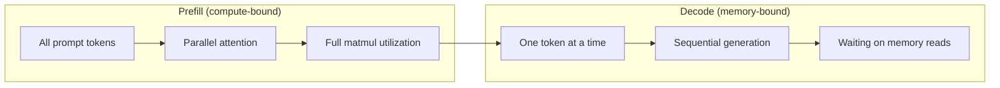
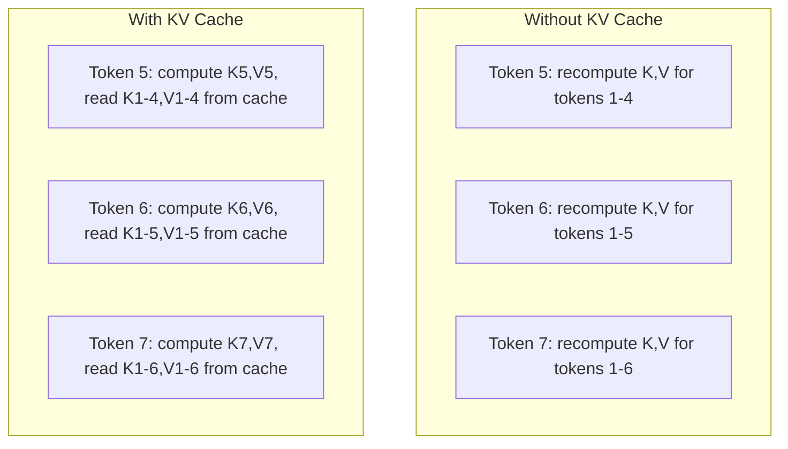
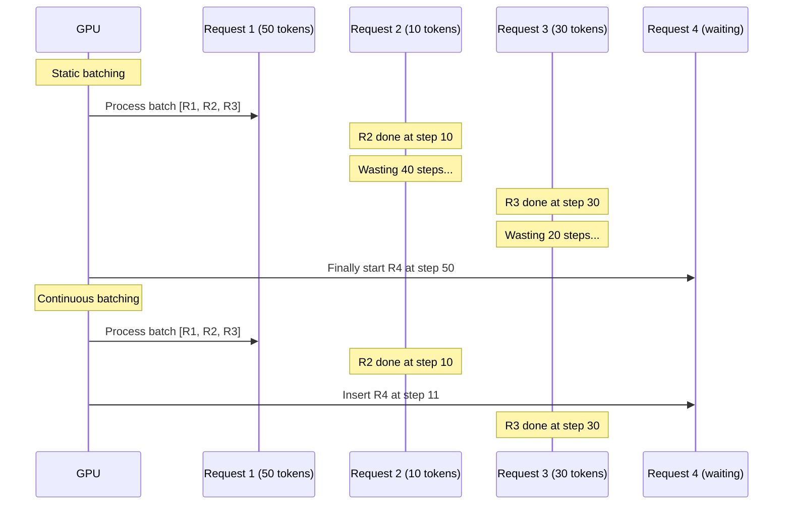
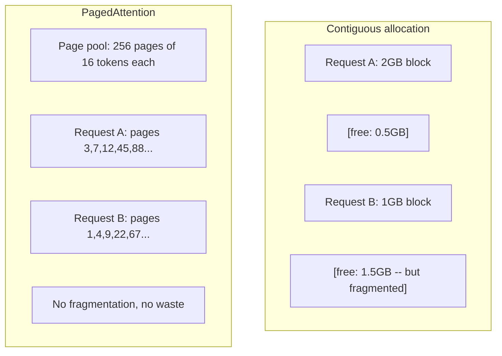
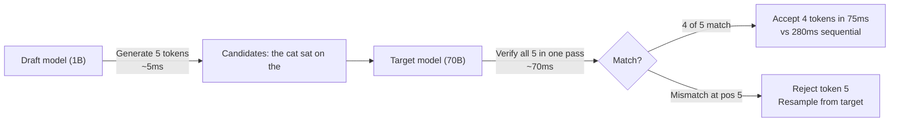

# تحسين الإستدلال

> مرحلتين تعريف استنتاج LLM. المكملات المسبقة تعالج طلبك بالتوازي -- محاسوبية. التشخيص يخلق رموز واحدة في كل مرة -- محاسوبة في الذاكرة. كل تحسين يستهدف واحدة أو كليهما.

**Type:** Build
**Languages:** Python
**Prerequisites:** Phase 10, Lessons 01-08 (Transformer architecture, attention)
**Time:** ~120 minutes

## أهداف التعلم

- تنفيذ KV-Cache للقضاء على الحسابات الزائدة خلال توليد الرمز التدريجي
- شرح مراحل التعبئة المسبقة مقابل عملية فك الكود في استنتاج ماجستير في العلوم العليا ولماذا كل منها له عوارض زجاجة مختلفة (مرتبطة بالحوسبة مقابل المرتبطة بالذاكرة)
- تنفيذ مفاهيم الإعداد المستمر ومصطلحات PagedAttention لتحقيق أقصى استغلال لـ GPU تحت الطلبات المتزايدة
- مقارنة تقنيات تحسين الاستنتاجات (KV-cache، فك التفكيرات، الاهتمام الفلاشي) وتداولاتها في التكامل / التأخير

## المشكلة

تقوم بتنفيذ Llama 3 70B على 4xA100 GPUs. مستخدم واحد يحصل على ~ 50 رمز في الثانية. يشعر بسرعة. ثم 100 مستخدم يصل إلى نقطة النهاية في نفس الوقت. انخفض التوصيل إلى 3 رموز / ثانية / مستخدم. فاتورة GPU الخاص بك 25،000 دولار / شهر يخدم الاستجابات أبطأ من نوع البشر.

النموذج نفسه لا يتغير بين مستخدم واحد و100 مستخدم. نفس الوزن، نفس الهندسة المعمارية، نفس الرياضيات. ما يتغير هو كيفية جدولة العمل استنتاج ساذج يضيع 90٪ + من الحوسبة المتاحة GPU. المستخدم الذي ينتظر رمز 47 يحافظ على فتحة مجموعة كاملة مفتوحة بينما حافلة ذاكرة GPU تقع عديمة الفائدة بين المثاليين. في الوقت نفسه، طلب المستخدم الجديد من 2000 رمز يمكن أن تملأ ذلك الوقت الميت مع الحساب المفيد.

هذه ليست مشكلة تحديد المعدلات. إنها مشكلة تخطيط المواعيد. تقنيات هذه الدروس -- تخزين KV، تخزين مستمر، صفحة الاهتمام، فك التشفير المضاربة، تخزين المواعيد المسبقة -- هي ما يفصل بين$25k/month inference bill from a $5K / شهر واحد خدمة نفس حركة المرور.

يصل vLLM الذي يخدم Llama 3 70B على 4xA100-80GB إلى ~ 50 رمزًا / ثانية / مستخدم عند التزامن المنخفض ، ويستمر في 15-25 TPS / مستخدم عند 100 طلب متزامن من خلال الإجراءات المتواصلة والتحذير الموقع. بدون هذه التكاملات ، يخدم نفس الأجهزة 5 TPS / مستخدم عند ذلك التزامن. نفس GPUs ، نفس النموذج ، 4x التوصيل.

## المفهوم

### الملفات المسبقة مقابل التشريح

كل طلب استنتاج لدرجة الماجستير في القانون لديه مرحلتين منفصلتين.

**Prefill**يعالج كل طلب المدخل. جميع الرموز المعروفة، لذلك يمكن حساب الاهتمام بالتوازي عبر التسلسل الكامل. هذه مضاعفة ماتريكية كبيرة - بقيت نواة GPU مشغولة. العنقه الزجاجية هي حساب: كم FLOPS يمكن لأجهزةك تقديمها في الثانية. A100 يفعل 312 TFLOPS (BF16). يستغرق التمليح المسبق لطلب الرموز الـ 4,096 على نموذج 70B ~ 400ms على A100 واحد.

**Decode**يخلق رموز الخروج واحدة في كل مرة. كل رمز جديد يحتفظ بجميع الرموز السابقة، ولكن يتم إنتاج رمز واحد فقط لكل مرور إلى الأمام. المصفوفات الوزن هي نفس الحجم الذي كانت عليه أثناء إعادة التعبئة، ولكنك تضاعفها بمجهر واحد بدلاً من المصفوفة. و تنتهي جوهر الجيبو في ثوانٍ صغيرة ثم تنتظر وصول المجموعة التالية من الوزن من الذاكرة العقدة هي عرض النطاق الترددي للذاكرة: كيف يمكن أن تتدفق بسرعة أوزان النموذج من HBM إلى وحدات الحساب. A100 لديه عرض النطاق 2 تي بي / ثانية. نموذج 70B في FP16 هو 140 جيجا غابايت. قراءة النموذج الكامل مرة واحدة تأخذ 70ms -- وهذا هو سطحك لخطوة واحدة لتفكيك.



- نعم**ops:byte ratio**(المسمى أيضاً كثافة الحساب) يحتوي على هذا التنازل. يقيّم عدد العمليات التي تقوم بها لكل بايت محمل من الذاكرة.

```
ops:byte ratio = FLOPs per token / bytes read from memory
```

أثناء إعداد الـ 4 096 رمزًا ، تقوم بـ 4 096 عملية مضاعفة التراكم لكل وزن محمّل. النسبة عالية - أنت مقيد في الحساب. أثناء فك رموز مع حجم الحزمة 1 ، تقوم بـ 1 عملية لكل وزن محمّل. النسبة منخفضة - أنت مقيد في الذاكرة.

البصيرة الأساسية: *الترميز مقيد بالذاكرة لأنك تقرأ النموذج بأكمله لإنتاج رمز واحد.* كل تحسين أدناه إما يقلل ما تقرأه أو يزيد من مجموعة الرموز المعالجة لكل قراءة أو يتجنب القراءة بالكامل.

### كيو كيش

أثناء الانتباه، يلتحق استفسار كل رمز مع كل رمز سابق متجهات المفتاح والقيمة. دون تخزين، فإن توليد رمز N يتطلب إعادة حساب المفتاح والقيمة التنبؤات لجميع N-1 قبل الرموز. يتم عرض الرموز 1 عند توليد الرموز 2, ثم مرة أخرى للرموز 3, ثم مرة أخرى للرموز 4. بواسطة الرموز 1000، قد تم عرض الرموز 1 في مجموع 999 مرة.

تخزين الاحتفاظ السري و التنبؤات القيمة من جميع الرموز السابقة. عند إنشاء الرموز N ، تقوم فقط بحساب الرموز والقيمة للرمز N ، ثم تشبيه مع K / V المحفوظة في الاحتفاظ السري من الرموز 1 إلى N-1.



**Memory formula for KV cache:**

```
KV cache size = 2 * num_layers * num_kv_heads * head_dim * seq_len * bytes_per_param
```

لـ Llama 3 70B (80 طبقة، 8 رؤوس KV مع GQA، رأس_مجموعة = 128، BF16):

```
per token: 2 * 80 * 8 * 128 * 2 bytes = 327,680 bytes = 320 KB
at 4,096 tokens: 320 KB * 4,096 = 1.28 GB
at 128K tokens: 320 KB * 131,072 = 40 GB
```

محادثة واحدة من سياق 128K للاما 3 70B تستغرق 40 جيجابايت من ذاكرة KV - نصف ذاكرة A100. مع 100 مستخدم متزامن في كل رمز 4K، يتطلب ذاكرة KV 128 جيجابايت وحدها. لهذا السبب إدارة ذاكرة KV هي التحدي المركزي لتحسين الاستنتاج.

### التجميع المستمر

ينتظر التعبئة الدقيقة حتى تصل مجموعة من طلبات N ، وتعالجها معاً ، وينتظر حتى * كل * ينتهي قبل قبول الطلبات الجديدة. إذا كان هناك طلب يحتاج إلى 500 رمز ويحتاج آخر إلى 10 ، فإن الطلب القصير يبقى ساكن لمدة 490 خطوة من فك الرمز بعد إنهاءه.

يضيف البطاقات المستمرة (المسمى أيضًا بتطويلاً على مستوى التكرار) طلبات جديدة في البطاق بمجرد إكمال أي طلب. يتم إعادة تقييم البطاقة في كل خطوة من مراحل تشفير الرمز. يتم استبدال طلب ينتهي بعد 10 رموز على الفور بطلب انتظار.



يعتمد تحسين التوصيل على مدى اختلاف طولات المخرجات. مع الطولات المتسقة، فإن اللحوم المستمرة تتطابق مع اللحوم الثابتة. مع الطولات المتغيرة (الحالة الشائعة) ، يمكن للحزم المستمرة تقديم 2-5 مرات أعلى التوصيل لأن فتحات GPU لا تجلس أبدا فارغة.

### الصفحة الاهتمام

الاحتياطي KV لكل طلب هو كتلة متواصلة من الذاكرة. عندما تصل الطلبات وتغادر، تقتصر شظايا الذاكرة -- تماما مثل تقطيع ذاكرة الذاكرة في أنظمة التشغيل. طلب 4K-token يحتاج إلى 1.28 جيجابايت متواصلة. حتى لو كان لديك 2 جيجابايت إجمالي مجاني، قد لا يكون لديك 1.28 جيجابايت * متواصلة. إما تستهلك الذاكرة أو ترفض الطلب.

تطبق PagedAttention (من vLLM) ذاكرة افتراضية على النمط التشغيلي في cache KV. بدلاً من تخصيص كتلة متواصلة واحدة لكل طلب ، فإنها توفر "صفحات" ذات حجم ثابت (عادة 16 رمزاً لكل واحدة). يمكن أن تكون الصفحات في أي مكان في ذاكرة GPU المادية. تقوم جدول الصفحة بتخطيط مواقع التسلسل المنطقي لكل طلب إلى مواقع الصفحة المادية.



PagedAttention أيضاً تمكن **copy-on-write**إذا كانت 50 طلباً تشارك نفس طلب النظام، يتم تخزين صفحات الكاشة KV لهذا طلب النظام مرة واحدة وتحويل إليه من قبل جميع الطلبات 50. فقط عندما يختلف طلب (رسائل المستخدم المختلفة) يحصل على صفحاته الخاصة. هذا يقلل من استخدام الذاكرة بشكل كبير للتطبيقات التي تحتوي على طلبات النظام المشتركة.

تقرير vLLM عن ضياع الذاكرة القريب من الصفر (~ 4% مقابل ~ 60- 80% في التخصيص الباطل) من خلال PagedAttention.

### التشفير المضارب

إنّ التشفير بطيء لأنه متسلسل -- أنت تولد رمز واحد، تعيدينه، وتولّد التالي. لكن ماذا لو استطعت تخمين 5 رموز أخرى رخيصة، ثمّ تثبتها كلها في وقت واحد؟

تشفير التكهنات يستخدم صغاراً صغيراً و سريعاً**draft model**لإنتاج رموز مرشحة K. الكبير **target model**ثم يعالج جميع مرشحي K في مرور واحد إلى الأمام (الذي يبدو مثل إعداد مسبق -- متوازي، مقيد بالحساب، فعال). إذا كان النموذج المستهدف يوافق مع توقعات النموذج المسودة، فإنك تقبل جميع رموز K في وقت واحد من المرور المستهدف إلى الأمام. إذا كان غير متفق في الموقف j، فإنك تقبل رموز 1 إلى j-1 وتلقي الباقي.



التسرع يعتمد على**acceptance rate**-- كم عدد المرات التي تتطابق فيها توقعات النموذج المخطط الهدف. بالنسبة لمخطط Llama 3 8B لـ Llama 3 70B، معدلات قبول 70-85% هي نموذجية للغة الطبيعية. وهذا ما يترجم إلى تسريع إعادة تشكيل 2-3x.

ثلاثة نهج للكشف المضاربي:

| Method | Draft source | Acceptance rate | Overhead |
|--------|-------------|-----------------|----------|
| Draft-target (Leviathan et al.) | Separate small model | 70-85% | Draft model memory |
| EAGLE (Li et al.) | Lightweight head on target | 75-90% | ~1% extra parameters |
| N-gram lookup | Token n-gram table | 40-60% | Negligible |

**EAGLE**تدرب رأس صغير متردد على رأس النموذج المستهدف يتنبأ بتشبيك الرمز التالي باستخدام ميزات الطبقة الثانية إلى الأخيرة لنموذج الهدف. لأنه يعمل على تمثيلات النموذج المستهدف (وليس نموذج منفصل) ، فإنه يصل إلى معدلات أقبول أعلى مع الحد الأدنى من الذاكرة الإضافية. إيغل-2 يضيف شجرة مسودة ديناميكية التي تعدل عدد المرشحين بناء على السياق.

**N-gram speculative decoding**يحتفظ جدول من استمرارات n-جرام من السياق الحالي أو مجموعة مبنية مسبقة. إذا كان المسودة مطابقة لما ظهر في نفس المحادثة (أنماط متكررة، والرقم، والخروج المهيكلي) ، فإنه يطلق مع صفر من تكاليف الشبكة العصبية. معدلات القبول أقل في المتوسط ولكن التكلفة لكل تكهنة هي في الأساس مجانية.

التشفير المضارب هو * دقيق رياضيا * - توزيع الخروج هو نفسه لتوزيع النموذج المستهدف. انها ليست تقريب. خطوة التحقق تضمن أن كل رمز مقبول لديه بالضبط احتمال ما كان قد تم تعيين النموذج المستهدف.

### الاحتفاظ بالخزينة

العديد من الطلبات تشارك نفس المقبلات. طلب نظام تشاتبوت. حظر سياق RAG. مجموعة مثالية قليلة. بدون تخزين المقبلات، كل طلب يعيد حساب cache KV لهذه الرموز المشتركة من الصفر.

تخزين الاحتفاظ بالقبض الاحتياطي KV للاستثمارات المشتركة وتستخدمها مرة أخرى عبر الطلبات. عندما يصل طلب جديد مع مقدمة معروفة، يقوم النظام بنسخ (أو مرجع) إدخالات KV المحفوظة في الاحتفاظ بالقبض والحساب فقط KV للاستثمار الفريد.

لـ 2000 رمز نظامية تشترك على جميع الطلبات، تخفيض الاحتفاظ بالتخزينات المسبقة من 400ms من الاحتفاظ بالتحفيز المسبق لكل طلب. عند 100 طلب في الثانية، وهذا يوفر 40 ثانية من الحسابات في GPU في الثانية - أكثر من عمل واحد GPU.

تنفذ نظام RadixAttention SGLang التخزين الآلي من قبل مع شجرة radix (trie) التي تحدد المواعيد الآلية حسب محتوى رمزها. أي طلب يطابق المواعيد الآلية المخزنة يحصل على متخزين KV مجانا. تتيح شجرة التخزين الإلي من قبل إضافات الجزئية - إذا شاركت 1500 من 2000 رمز إضافات الآلية مع إدخال محفظ ، فأنت تستخدم تلك 1500 وتقوم بإعادة حساب 500 فقط.

### محركات الإستدلال

ثلاثة محركات تهيمن على الإنتاج LLM الخدمة:

| Engine | Key innovation | Best for |
|--------|---------------|----------|
| vLLM | PagedAttention, continuous batching | General-purpose serving, highest compatibility |
| SGLang | RadixAttention (prefix caching), structured generation | Multi-turn chatbots, constrained decoding |
| TensorRT-LLM | NVIDIA kernel fusion, FP8 quantization | Maximum single-GPU throughput on NVIDIA hardware |

**vLLM**هو نقطة البداية الافتراضية. يدعم أوسع مجموعة من النماذج ، ويتم تشغيلها على أي مزود GPU (NVIDIA ، AMD ، Intel) ، ويحقق ناتجًا قويًا من خلال PagedAttention + الإعداد المستمر. API الموافقة مع OpenAI يعني أنه يمكنك إرسالها كبديل لأي اتصال API OpenAI.

**SGLang**يستند على نفس الأساسات التي تقوم بها vLLM ولكن يضيف RadixAttention لخزينة المحافظات التأهيلية وتحديد لغة محددة للبرامج LLM المهيكلة. إذا كان عبء عملك يتضمن محادثات متعددة التحولات ، أو استخدام الأدوات ، أو فك التشفير المحدود (إنتاج JSON ، وتوليد regex-Guided) ، فإن SGLang غالباً ما يتفوق على vLLM بنسبة 2-5x من خلال إعادة استخدام المتحافظات.

**TensorRT-LLM**يجمع النماذج إلى نواة NVIDIA GPU محسنة. يدمج العمليات (الاهتمام + الخط + تفعيل في نواة واحدة) ، ويستخدم FP8 على GPUs H100 ، ويتكامل مع NVIDIA Triton Inference Server للتنفيذ الإنتاج. يصل إلى أعلى ناتج واحد من GPU على أجهزة NVIDIA ولكن يتطلب المزيد من الإعداد ويعمل فقط على GPUs NVIDIA.

أرقام العالم الحقيقي لـ Llama 3 70B (4xA100-80GB، BF16):

| Metric | vLLM | SGLang | TensorRT-LLM |
|--------|------|--------|---------------|
| Throughput (1 user) | ~50 TPS | ~55 TPS | ~65 TPS |
| Throughput (100 users) | ~2,500 total TPS | ~3,200 total TPS | ~3,000 total TPS |
| Time to first token | ~400ms | ~300ms (prefix hit) | ~350ms |
| Max context | 128K | 128K | 128K |

### إطار العمليات: البايت

لا يمكنك تحسين ما لا تقيسه. نسبة ops:byte تخبرك ما إذا كنت محمولاً أو محمولاً بالذاكرة، مما يحدد ما هي التحسينات المهمة.

```
Compute roof: peak FLOPS of the GPU
Memory roof:  peak bandwidth * ops:byte ratio
```

عندما تكون ops:byte منخفضة (تفكيك، دفعات صغيرة) ، تضرب سقف عرض النطاق التذاكر. لا يساعد إضافة المزيد من الحوسبة (الساعة العالية، المزيد من الأجزاء) . تحتاج إلى تقليل قراءات الذاكرة (تقييم الكمبيوتر، ضغط الاحتياطي الكهربائي) أو زيادة حجم البطاقة لتسديد القراءات عبر العمل الأكثر فائدة.

عندما تكون ops:byte مرتفعة (مقبل الامتلاء، دفعات كبيرة) ، فإنك تضرب سقف الحساب. لا يساعد تحسين عرض النطاق الترددي للذاكرة. تحتاج إلى GPU أسرع، أو اندماج النواة، أو دقة أقل للضغط على المزيد من FLOPS.

| Scenario | ops:byte | Bound | Optimize with |
|----------|----------|-------|---------------|
| Prefill, batch=1 | ~4,096 | Compute | Kernel fusion, FP8 |
| Decode, batch=1 | ~1 | Memory | Quantization, KV compression |
| Decode, batch=32 | ~32 | Memory | Larger batch, continuous batching |
| Decode, batch=256 | ~256 | Transitioning | Both matter |
| Decode, batch=1024 | ~1,024 | Compute | Kernel fusion, tensor parallelism |

نقطة التقاطع على A100 حول ops:byte = 156 (312 TFLOPS / 2 TB / s). تحت 156 ، أنت مقيد في الذاكرة. فوق 156 ، أنت مقيد في الحوسبة. دفع الإجراءات المستمرة لفك التشفير نحو هذا التقاطع من خلال حزم المزيد من الرموز في كل تكرار.

```figure
context-window-slide
```

## بناءها

### الخطوة الأولى: تخزين KV من الصفر

نُبني متخزن كيو كيو متعدد الرؤوس الذي يُخزن توقعات المفتاح والقيمة لكل طبقة، لكل رأس، ويعرض نمو الذاكرة.

```python
import numpy as np

class KVCache:
    def __init__(self, num_layers, num_heads, head_dim, max_seq_len, dtype=np.float16):
        self.num_layers = num_layers
        self.num_heads = num_heads
        self.head_dim = head_dim
        self.max_seq_len = max_seq_len
        self.dtype = dtype

        self.k_cache = np.zeros(
            (num_layers, num_heads, max_seq_len, head_dim), dtype=dtype
        )
        self.v_cache = np.zeros(
            (num_layers, num_heads, max_seq_len, head_dim), dtype=dtype
        )
        self.seq_len = 0

    def update(self, layer_idx, new_keys, new_values):
        num_new = new_keys.shape[1]
        end = self.seq_len + num_new
        self.k_cache[layer_idx, :, self.seq_len:end, :] = new_keys
        self.v_cache[layer_idx, :, self.seq_len:end, :] = new_values
        return (
            self.k_cache[layer_idx, :, :end, :],
            self.v_cache[layer_idx, :, :end, :]
        )

    def advance(self, num_tokens):
        self.seq_len += num_tokens

    def memory_bytes(self):
        return self.k_cache.nbytes + self.v_cache.nbytes

    def used_bytes(self):
        per_token = 2 * self.num_layers * self.num_heads * self.head_dim * np.dtype(self.dtype).itemsize
        return per_token * self.seq_len
```

### الخطوة الثانية: الاهتمام مع KV Cache

الاهتمام المتعدد الرأس المبسط الذي يستخدم الاحتفاظ السريع KV لتحديد الخطوات.

```python
def scaled_dot_product_attention(query, keys, values):
    head_dim = query.shape[-1]
    scores = np.matmul(query, keys.transpose(0, 1, 3, 2)) / np.sqrt(head_dim)
    seq_len_q = scores.shape[-2]
    seq_len_k = scores.shape[-1]
    if seq_len_q > 1:
        mask = np.triu(np.ones((seq_len_q, seq_len_k), dtype=np.float32), k=seq_len_k - seq_len_q + 1)
        scores = scores + mask * (-1e9)
    max_scores = np.max(scores, axis=-1, keepdims=True)
    exp_scores = np.exp(scores - max_scores)
    attn_weights = exp_scores / np.sum(exp_scores, axis=-1, keepdims=True)
    return np.matmul(attn_weights, values)


class MultiHeadAttention:
    def __init__(self, d_model, num_heads):
        self.num_heads = num_heads
        self.head_dim = d_model // num_heads
        scale = np.sqrt(2.0 / d_model)
        self.W_q = np.random.randn(d_model, d_model).astype(np.float32) * scale
        self.W_k = np.random.randn(d_model, d_model).astype(np.float32) * scale
        self.W_v = np.random.randn(d_model, d_model).astype(np.float32) * scale
        self.W_o = np.random.randn(d_model, d_model).astype(np.float32) * scale

    def forward(self, x, kv_cache=None, layer_idx=0):
        batch, seq_len, d_model = x.shape
        Q = np.matmul(x, self.W_q).reshape(batch, seq_len, self.num_heads, self.head_dim).transpose(0, 2, 1, 3)
        K = np.matmul(x, self.W_k).reshape(batch, seq_len, self.num_heads, self.head_dim).transpose(0, 2, 1, 3)
        V = np.matmul(x, self.W_v).reshape(batch, seq_len, self.num_heads, self.head_dim).transpose(0, 2, 1, 3)

        if kv_cache is not None:
            K_full, V_full = kv_cache.update(layer_idx, K[0], V[0])
            K = K_full[np.newaxis, :, :, :]
            V = V_full[np.newaxis, :, :, :]
            if seq_len == 1:
                kv_cache.advance(1)

        attn_out = scaled_dot_product_attention(Q, K, V)
        attn_out = attn_out.transpose(0, 2, 1, 3).reshape(batch, -1, d_model)
        return np.matmul(attn_out, self.W_o)
```

### الخطوة 3: محاكاة الحزم المستمرة

هذا يحاكي الفرق في التخطيط بين الإجراءات المتصلة والمتصلة.

```python
import heapq

class Request:
    def __init__(self, request_id, prompt_tokens, output_tokens, arrival_step):
        self.request_id = request_id
        self.prompt_tokens = prompt_tokens
        self.output_tokens = output_tokens
        self.arrival_step = arrival_step
        self.tokens_generated = 0
        self.start_step = None
        self.end_step = None

    def is_done(self):
        return self.tokens_generated >= self.output_tokens


def simulate_static_batching(requests, batch_size):
    step = 0
    completed = []
    queue = list(requests)
    queue.sort(key=lambda r: r.arrival_step)

    while queue:
        batch = []
        while queue and len(batch) < batch_size:
            r = queue.pop(0)
            r.start_step = max(step, r.arrival_step)
            batch.append(r)

        if batch:
            step = max(step, max(r.start_step for r in batch))
            max_output = max(r.output_tokens for r in batch)
            for r in batch:
                r.tokens_generated = r.output_tokens
                r.end_step = step + max_output
            step += max_output
            completed.extend(batch)

    return completed


def simulate_continuous_batching(requests, batch_size):
    step = 0
    completed = []
    queue = sorted(requests, key=lambda r: r.arrival_step)
    queue_idx = 0
    active = []
    waiting = []

    while queue_idx < len(queue) or active or waiting:
        while queue_idx < len(queue) and queue[queue_idx].arrival_step <= step:
            waiting.append(queue[queue_idx])
            queue_idx += 1

        while waiting and len(active) < batch_size:
            r = waiting.pop(0)
            r.start_step = step
            active.append(r)

        if not active:
            if waiting:
                step += 1
                continue
            elif queue_idx < len(queue):
                step = queue[queue_idx].arrival_step
                continue
            else:
                break

        for r in active:
            r.tokens_generated += 1

        done = [r for r in active if r.is_done()]
        for r in done:
            r.end_step = step + 1
            completed.append(r)
        active = [r for r in active if not r.is_done()]

        step += 1

    return completed


def batching_stats(completed):
    latencies = [r.end_step - r.arrival_step for r in completed]
    total_time = max(r.end_step for r in completed) - min(r.arrival_step for r in completed)
    total_tokens = sum(r.output_tokens for r in completed)
    return {
        "avg_latency": np.mean(latencies),
        "p50_latency": np.median(latencies),
        "p99_latency": np.percentile(latencies, 99),
        "total_time": total_time,
        "throughput": total_tokens / total_time if total_time > 0 else 0,
    }
```

### الخطوة الرابعة: الاحتفاظ بالخزنة

مخزن محفظة محفظة مقدمة تستند إلى محفظة محفظة تخزين إدخالات KV للمحاور المشتركة.

```python
class TrieNode:
    def __init__(self):
        self.children = {}
        self.kv_data = None
        self.hit_count = 0


class PrefixCache:
    def __init__(self, max_entries=1000):
        self.root = TrieNode()
        self.max_entries = max_entries
        self.total_entries = 0
        self.hits = 0
        self.misses = 0

    def _walk(self, token_ids):
        node = self.root
        depth = 0
        for tid in token_ids:
            if tid not in node.children:
                break
            node = node.children[tid]
            depth += 1
        return node, depth

    def lookup(self, token_ids):
        node, depth = self._walk(token_ids)
        if depth > 0:
            self.hits += 1
            current = self.root
            for tid in token_ids[:depth]:
                current = current.children[tid]
                current.hit_count += 1
            kv_entries = []
            current = self.root
            for tid in token_ids[:depth]:
                current = current.children[tid]
                if current.kv_data is not None:
                    kv_entries.append(current.kv_data)
            return depth, kv_entries
        self.misses += 1
        return 0, []

    def insert(self, token_ids, kv_per_token):
        node = self.root
        for i, tid in enumerate(token_ids):
            if tid not in node.children:
                if self.total_entries >= self.max_entries:
                    return i
                node.children[tid] = TrieNode()
                self.total_entries += 1
            node = node.children[tid]
            if i < len(kv_per_token):
                node.kv_data = kv_per_token[i]
        return len(token_ids)

    def hit_rate(self):
        total = self.hits + self.misses
        return self.hits / total if total > 0 else 0.0
```

### الخطوة 5: محاكاة تشخيص المضاربة

نحن نقوم بتحاكي تشخيصات المستهدف المضاربة مع معدلات القبول المتكيفة.

```python
class DraftModel:
    def __init__(self, vocab_size, acceptance_rate=0.8):
        self.vocab_size = vocab_size
        self.acceptance_rate = acceptance_rate

    def generate(self, context, num_tokens):
        tokens = np.random.randint(0, self.vocab_size, size=num_tokens)
        return tokens

    def get_probs(self, context, token):
        probs = np.random.dirichlet(np.ones(self.vocab_size))
        return probs


class TargetModel:
    def __init__(self, vocab_size):
        self.vocab_size = vocab_size

    def get_probs(self, context, tokens=None):
        if tokens is not None:
            return [np.random.dirichlet(np.ones(self.vocab_size)) for _ in tokens]
        return np.random.dirichlet(np.ones(self.vocab_size))


def speculative_decode(draft_model, target_model, context, num_speculative=5,
                       draft_cost=1.0, target_cost=10.0, verify_cost=12.0):
    total_tokens = 0
    total_cost = 0.0
    accepted_counts = []
    context = list(context)

    max_tokens = 100

    while total_tokens < max_tokens:
        draft_tokens = draft_model.generate(context, num_speculative)
        total_cost += draft_cost * num_speculative

        target_probs = target_model.get_probs(context, draft_tokens)
        total_cost += verify_cost

        accepted = 0
        for i, token in enumerate(draft_tokens):
            draft_p = draft_model.get_probs(context + list(draft_tokens[:i]), token)
            target_p = target_probs[i]

            r = np.random.random()
            acceptance_prob = min(1.0, target_p[token] / (draft_p[token] + 1e-10))

            if r < draft_model.acceptance_rate:
                accepted += 1
                context.append(token)
                total_tokens += 1
            else:
                new_token = np.random.choice(draft_model.vocab_size, p=target_p)
                context.append(new_token)
                total_tokens += 1
                break

        accepted_counts.append(accepted)

        if accepted == num_speculative:
            bonus_probs = target_model.get_probs(context)
            bonus_token = np.random.choice(draft_model.vocab_size, p=bonus_probs)
            context.append(bonus_token)
            total_tokens += 1

    sequential_cost = total_tokens * target_cost
    return {
        "total_tokens": total_tokens,
        "speculative_cost": total_cost,
        "sequential_cost": sequential_cost,
        "speedup": sequential_cost / total_cost if total_cost > 0 else 1.0,
        "avg_accepted": np.mean(accepted_counts),
        "acceptance_rate": np.mean(accepted_counts) / num_speculative,
    }


def compare_speculation_strategies(vocab_size=1000, num_trials=20):
    results = {}

    for name, acceptance_rate, spec_tokens in [
        ("Draft-target (8B->70B)", 0.78, 5),
        ("EAGLE", 0.85, 6),
        ("N-gram", 0.50, 4),
        ("No speculation", 0.0, 0),
    ]:
        if spec_tokens == 0:
            results[name] = {
                "speedup": 1.0,
                "acceptance_rate": 0.0,
                "avg_accepted": 0.0,
            }
            continue

        trial_results = []
        for _ in range(num_trials):
            draft = DraftModel(vocab_size, acceptance_rate=acceptance_rate)
            target = TargetModel(vocab_size)
            context = list(np.random.randint(0, vocab_size, size=10))
            result = speculative_decode(draft, target, context, num_speculative=spec_tokens)
            trial_results.append(result)

        results[name] = {
            "speedup": np.mean([r["speedup"] for r in trial_results]),
            "acceptance_rate": np.mean([r["acceptance_rate"] for r in trial_results]),
            "avg_accepted": np.mean([r["avg_accepted"] for r in trial_results]),
        }

    return results
```

### الخطوة 6: KV مخزن ذاكرة محور

احسب متطلبات ذاكرة الذاكرة الاحتياطية في KV للتكوينات الحقيقية للنموذج.

```python
MODEL_CONFIGS = {
    "Llama-3-8B": {
        "num_layers": 32, "num_kv_heads": 8, "head_dim": 128,
        "model_params_b": 8, "gqa": True,
    },
    "Llama-3-70B": {
        "num_layers": 80, "num_kv_heads": 8, "head_dim": 128,
        "model_params_b": 70, "gqa": True,
    },
    "Llama-3-405B": {
        "num_layers": 126, "num_kv_heads": 8, "head_dim": 128,
        "model_params_b": 405, "gqa": True,
    },
    "Mistral-7B": {
        "num_layers": 32, "num_kv_heads": 8, "head_dim": 128,
        "model_params_b": 7, "gqa": True,
    },
    "GPT-4-est": {
        "num_layers": 120, "num_kv_heads": 96, "head_dim": 128,
        "model_params_b": 1800, "gqa": False,
    },
}


def kv_cache_memory(config, seq_len, dtype_bytes=2):
    per_token = 2 * config["num_layers"] * config["num_kv_heads"] * config["head_dim"] * dtype_bytes
    total = per_token * seq_len
    return {
        "per_token_bytes": per_token,
        "per_token_kb": per_token / 1024,
        "total_bytes": total,
        "total_mb": total / (1024 ** 2),
        "total_gb": total / (1024 ** 3),
    }


def memory_budget(config, gpu_memory_gb, model_dtype_bytes=2, kv_dtype_bytes=2):
    model_memory_gb = config["model_params_b"] * 1e9 * model_dtype_bytes / (1024 ** 3)
    overhead_gb = gpu_memory_gb * 0.1
    available_for_kv = gpu_memory_gb - model_memory_gb - overhead_gb

    if available_for_kv <= 0:
        return {"error": "Model does not fit in GPU memory", "model_memory_gb": model_memory_gb}

    per_token = 2 * config["num_layers"] * config["num_kv_heads"] * config["head_dim"] * kv_dtype_bytes
    max_tokens = int(available_for_kv * (1024 ** 3) / per_token)

    return {
        "gpu_memory_gb": gpu_memory_gb,
        "model_memory_gb": round(model_memory_gb, 1),
        "overhead_gb": round(overhead_gb, 1),
        "available_for_kv_gb": round(available_for_kv, 1),
        "max_total_tokens": max_tokens,
        "max_users_at_2k": max_tokens // 2048,
        "max_users_at_4k": max_tokens // 4096,
        "max_users_at_32k": max_tokens // 32768,
    }
```

## استخدمها

مع vLLM:

```python
from vllm import LLM, SamplingParams

llm = LLM(
    model="meta-llama/Llama-3-70B-Instruct",
    tensor_parallel_size=4,
    enable_prefix_caching=True,
    max_model_len=8192,
    gpu_memory_utilization=0.9,
)

params = SamplingParams(temperature=0.7, max_tokens=256)
outputs = llm.generate(["Explain inference optimization in one paragraph."], params)
```

مع SGLang لخزن الاحتياطي المسبق + الخروج المهيكلي:

```python
import sglang as sgl

@sgl.function
def classify(s, text):
    s += sgl.system("You are a classifier. Output JSON only.")
    s += sgl.user(f"Classify this text: {text}")
    s += sgl.assistant(sgl.gen("result", regex=r'\{"label": "(positive|negative|neutral)"\}'))

runtime = sgl.Runtime(model_path="meta-llama/Llama-3-70B-Instruct", tp_size=4)
sgl.set_default_backend(runtime)

results = classify.run_batch([
    {"text": "This product is amazing!"},
    {"text": "Terrible experience."},
    {"text": "It was okay I guess."},
])
```

مع TensorRT-LLM:

```python
import tensorrt_llm
from tensorrt_llm.runtime import ModelRunner

runner = ModelRunner.from_dir("./llama-70b-trt-engine/", rank=0)

outputs = runner.generate(
    batch_input_ids=[tokenizer.encode("Explain KV caching.")],
    max_new_tokens=256,
    temperature=0.7,
)
```

## أرسله

هذا الدرس ينتج عن:
- `outputs/skill-inference-optimization.md`-- مهارة لتشخيص وتحسين استنتاج ماجستير في العلوم

## التمارين

1. قم بتعديل ملف تعريف الاحتفاظ بالخزنة KV للمقارنة بين FP16 vs FP8 vs INT4 KV كوانتيزة الاحتفاظ بالخزنة. لـ Llama 3 70B في سياق 4K ، احسب أقصى مستخدمين متزامنين لكل واحد على 4xA100-80GB. يجب أن يكون تعدد الكوانتيزة KV إلى INT4 حوالي 4x قدرة المستخدم.

2. توسيع محاكاة الحزم المستمرة لتتبع استخدام GPU (جزء من فتحات الحزم المملئة لكل خطوة). استخدام الحزم مع مرور الوقت لكل من الحزم الثابتة والمتواصلة مع 50 طلبًا تتبع طول الخروج توزيع باريتو (الشكل = 1.5 ، المقياس = 20) يجب أن يحافظ الحزم المستمر على الاستخدام > 80٪.

3. تنفيذ نسخة من الجهاز التخزيني للقاعدة المشتركة`num_kv_heads < num_query_heads`. Llama 3 70B يستخدم 64 رأس استفسار ولكن 8 رأس KV فقط. احسب مدخرات الذاكرة مقابل الاهتمام الكامل متعدد الرؤوس (8 ضعف الحد من حجم ذاكرة الاحتفاظ بالكيف).

4. قم ببناء مخزن مخزني يستخدم إزالة LRU. حدد ماكس_ادراجات إلى 500 وتوليد 1000 طلب حيث يشارك 60% واحدة من 5 مخزنيات شائعة. قياس معدل ضربات ومقارنة مع مخزن مخزني غير محدود. مع الإزالة الجيدة، يجب أن يبقى معدل ضربات فوق 55%.

5. توسيع محاكاة تشخيص المضاربة لتنفيذ المضاربة القائمة على الشجرة (نمط EAGLE-2). بدلاً من سلسلة واحدة من رموز مسودة K ، قم بتوليد شجرة من المرشحين (على سبيل المثال ، فروع 2 في كل من مستويات 3 = مرشحات ورقة 8) مقارنة إجمالي رموز القبول لكل جولة التحقق مقابل المضاربة السطحية.

## الشروط الرئيسية

| Term | What people say | What it actually means |
|------|----------------|----------------------|
| Prefill | "Processing the prompt" | Computing attention over all input tokens in parallel -- compute-bound because the full matrix multiplication keeps GPU cores busy |
| Decode | "Generating tokens" | Producing one token per forward pass, reading the full model weights each time -- memory-bound because compute finishes before the next weights arrive |
| KV cache | "Caching attention states" | Storing the key and value projections for all previous tokens so they are not recomputed at each decode step -- trades memory for compute |
| Continuous batching | "Dynamic batching" | Inserting new requests into the running batch as soon as any request finishes, evaluated at every decode iteration rather than waiting for the whole batch |
| PagedAttention | "Virtual memory for KV cache" | Allocating KV cache in fixed-size pages instead of contiguous blocks, eliminating memory fragmentation and enabling copy-on-write for shared prefixes |
| Speculative decoding | "Draft and verify" | Using a fast draft model to propose multiple tokens, then verifying them all in one target model forward pass -- mathematically exact, 2-3x speedup |
| EAGLE | "Self-speculative decoding" | A speculative decoding variant that trains a lightweight head on the target model's own hidden states, achieving higher acceptance rates than a separate draft model |
| Prefix caching | "Reusing system prompt KV" | Storing computed KV cache entries for common prefixes (system prompts, few-shot examples) and reusing them across requests to skip redundant prefill |
| Ops:byte ratio | "Arithmetic intensity" | The ratio of compute operations to memory bytes read -- determines whether a workload is compute-bound (high ratio) or memory-bound (low ratio) |
| Time to first token | "TTFT" | Latency from receiving a request to producing the first output token -- dominated by prefill time for long prompts |

## المزيد من القراءة

- كوان وآخرون، "إدارة ذاكرة فعالة لنموذج اللغة الكبير الخدمة مع PagedAttention" (2023) -- ورقة vLLM التي قدمت إدارة مخزن الاحتفاظ بالمساحة KV، الآن معيار الصناعة لتقديم الاستنتاج
- ليفياثان وآخرون، "التخفيف السريع من المحولات عبر التشخيص المضاربي" (2023) -- الورقة الأساسية التي تثبت أن التكهنات المحققة من المسودة تنتج توزيعات نموذج الهدف الدقيق مع تحقيق سرعة 2-3x
- لي وغيره، "إيغل: يستدعي أخذ العينات المضاربة إعادة التفكير في عدم اليقين في الميزات" (2024) -- يحقق معدلات قبول أعلى من خلال تدريب رأس على خصائص النموذج المستهدف بدلاً من استخدام نموذج مسودة منفصل
- تشينغ وغيرهم، "SGLang: تنفيذ فعال لبرامج نموذج اللغة المهيكلة" (2024) -- يقدم RadixAttention لخزن الاحتياطي المسبق ونموذج برمجة لبرامج LLM متعددة المكالمات
- ويليامز وغيرهم، "السقف: نموذج أداء بصري متفوق لهياكل معمارية متعددة الأجزاء" (2009) -- ورقة السقف الأصلية التي رسمية إطار ops:byte للتفكير حول الحوسبة مقابل ضباب الزجاج الذاكرة
