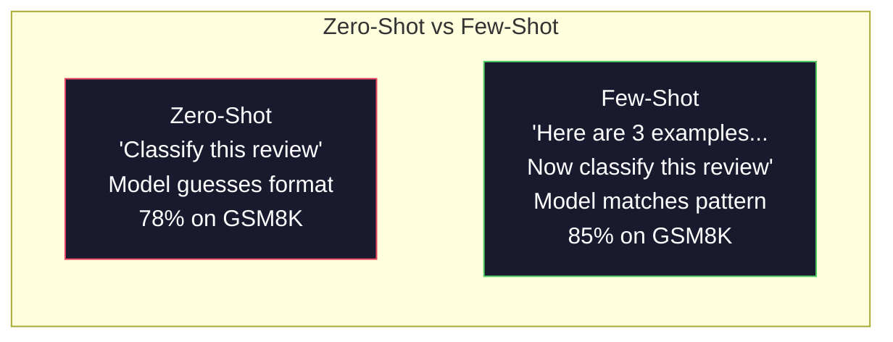
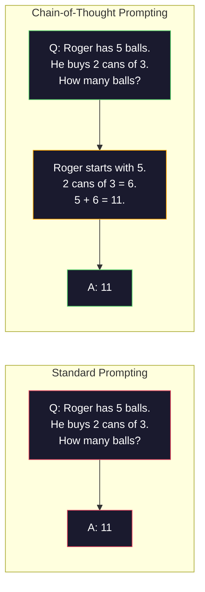
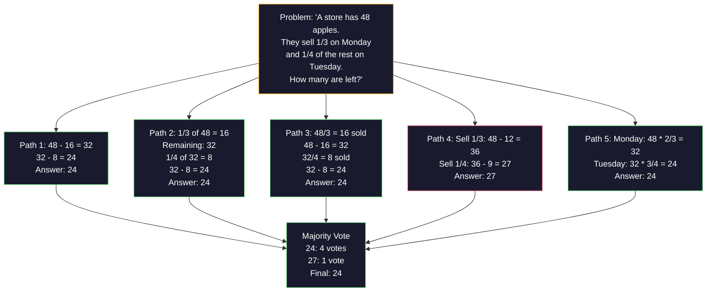
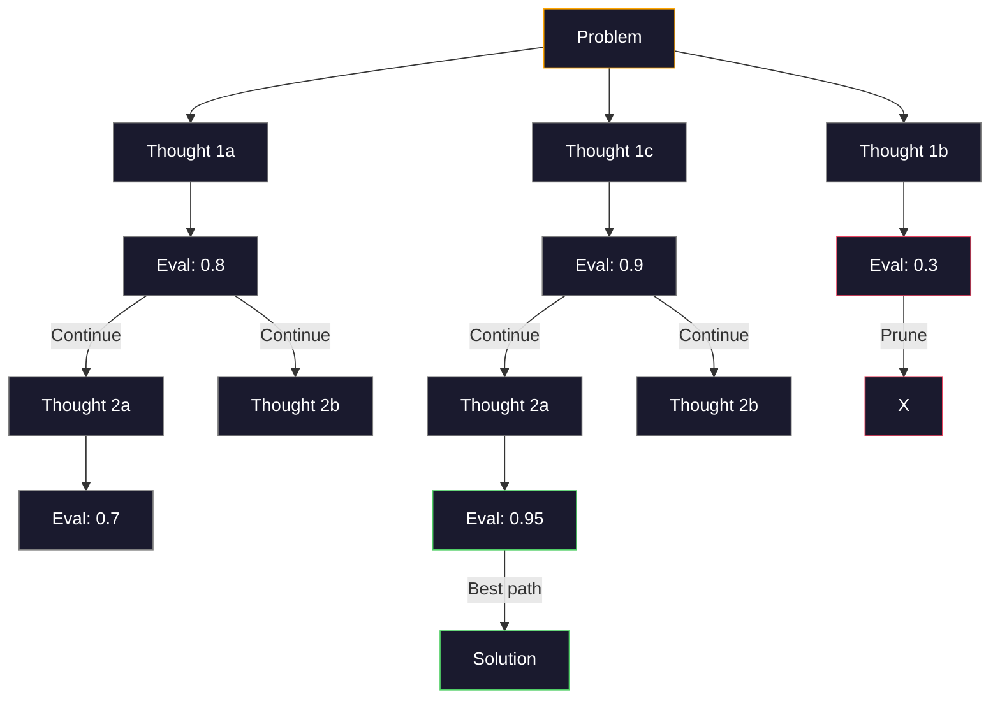

# القليل من الأسلحة، سلسلة التفكير، شجرة التفكير

> إخبار النموذج ما يجب فعله هو التحفيز. إظهار كيفية التفكير هو الهندسة. الفجوة بين دقة 78٪ و 91٪ على نفس النموذج، نفس المهمة، نفس البيانات ليست نموذج أفضل. انها استراتيجية تفكير أفضل.

**Type:** Build
**Languages:** Python
**Prerequisites:** Lesson 11.01 (Prompt Engineering)
**Time:** ~45 minutes

## أهداف التعلم

- تنفيذ طلبات القليل من اللقطات عن طريق اختيار وتصميم نماذج مثالية تعزز دقة المهمة
- تطبيق سلسلة التفكير (CoT) للتفكير لتحسين دقة المشاكل متعددة الخطوات مثل مشاكل الكلمات الرياضية
- بناء شجرة من الأفكار استفسار استكشاف طرق التفكير متعددة واختيار أفضل واحد
- قياس تحسن الدقة من صفر إطلاق مقابل القليل إطلاق مقابل CoT على مقياس قياسي

## المشكلة

تقوم ببناء تطبيق تعليم الرياضيات. طلبك يقول: "حل مشكلة الكلمة هذه". GPT-5 يحصل على الحق 94% من الوقت على GSM8K، المعيار المعتاد الرياضيات في المرحلة الابتدائية. تعتقد أنك قد بلغت ذروتك. لا ت سلسلة التفكير لا يزال يضيف 3-4 نقاط.

أضف خمس كلمات -- "دعونا نفكر خطوة بخطوة" -- والدقة ترتفع إلى 91٪. أضف بعض الأمثلة المعملة وتصل إلى 95٪. نفس النموذج. نفس درجة الحرارة. نفس تكلفة API. الفرق الوحيد هو أنك أعطيت النموذج ورقة خدش.

هذا ليس اختراقًا. هذا هو كيف يعمل التفكير. البشر لا يحلون مشاكل متعددة الخطوات في قفزة عقلية واحدة. ولا المحولات. عندما تضطر نموذجًا إلى إنتاج رموز متوسطة، تصبح تلك الرموز جزءًا من السياق للرمز التالي. كل خطوة من الخطوات التفكير تغذي الخطوة التالية. يقوم النموذج حرفيًا بحساب طريقه إلى الإجابة.

ولكن "تفكير خطوة بخطوة" هي البداية وليس النهاية. ماذا لو قمت بتعليم خمسة طرق للتفكير وتأخذت صوت الأغلبية؟ ماذا لو سمحت للنموذج باستكشاف شجرة من الإمكانيات، وتقييم وتقليص الأغصان؟ ماذا لو قمت بتدخل التفكير باستخدام الأدوات؟ هذه ليست فرضيات. إنها تقنيات نشرت مع تحسينات مقياسية، وسوف تبني كل منها في هذا الدروس.

## المفهوم

### الصفر مقابل القليل: عندما تتفوق الأمثلة على التعليمات

إنّ محاولة إطلاق الصور الصفر تعطي النموذج مهمة ولا شيء آخر، لكنّ محاولة إطلاق الصور القليلة تعطي أمثلة أولاً.

وقاس Wei et al. (2022) هذا عبر 8 معايير. بالنسبة للمهام البسيطة مثل تصنيف المشاعر ، تم إجراء صفر-شوت و قليل-شوت في حدود 2% من بعضها البعض. بالنسبة للمهام المعقدة مثل الحساب متعدد الخطوات والحكمة الرمزية ، تحسنت عدد قليل من الصور دقة 10-25%.

الاندماج: المثال هو التعليمات المضغوطة. بدلا من وصف صيغة الخروج، تظهرها. بدلا من شرح عملية التفكير، تظهرها. النموذج نمط تتطابق على المثال بشكل أكثر موثوقية من أنه تفسير التعليمات المجردة.



**When few-shot wins:**مهام حساسة للصيغة، التصنيف، الاستخراج المهيكلي، الجارغون المحدد للمجال، أي مهام تحتاج النموذج إلى مطابقة نمط معين.

**When zero-shot wins:**أسئلة حقيقية بسيطة، مهام إبداعية حيث تقيد الأمثلة الإبداع، مهام حيث يُصعب إيجاد أمثلة جيدة على كتابة تعليمات جيدة.

### اختيار المثال: ضربات مشابهة عشوائية

لا تكون جميع الأمثلة متساوية. اختيار أمثلة مشابهة للمدخول المستهدف يفوق الاختيار العشوائي بنسبة 5-15% في مهام التصنيف (Liu et al., 2022). ثلاثة مبادئ:

1. **Semantic similarity**: اختيار الأمثلة القريبة من المدخل في مساحة التثبيت
2. **Label diversity**: تغطي جميع فئات الخروج في أمثالك
3. **Difficulty matching**: تتناسب مع مستوى تعقيد المشكلة المستهدفة

عدد الأمثلة المثالي لمعظم المهام هو 3-5، تحت 3، لا يوجد لدى النموذج إشارة كافية لاستخراج النمط. فوق 5، تضغط على العائدات المتناقضة وتسريب رموز نافذة السياق. للتصنيف مع العديد من اللبصات، استخدم مثالًا واحدًا لكل ملصق.

### سلسلة التفكير: إعطاء نماذج ورقة شرب

تم إدخال محاولة سلسلة التفكير (CoT) من قبل Wei et al. (2022) في Google Brain. الفكرة بسيطة: بدلاً من طلب النموذج فقط من الإجابة ، اطلب منه أن يظهر خطوات التفكير الخاصة به أولاً.



لماذا يعمل هذا بشكل ميكانيكي؟ كل رمز يولد من المحول يصبح سياقًا للرمز التالي. بدون CoT ، يجب على النموذج ضغط جميع التفكير في الحالة الخفية من مرور واحد إلى الأمام. مع CoT ، يقوم النموذج بتخريج الحسابات الوسطى كرمز. كل رمز التفكير يمتد عمق الحساب الفعال.

**GSM8K benchmarks (grade-school math, 8.5K problems):**

| Model | Zero-Shot | Zero-Shot CoT | Few-Shot CoT |
|-------|-----------|---------------|--------------|
| GPT-4o | 78% | 91% | 95% |
| GPT-5 | 94% | 97% | 98% |
| o4-mini (reasoning) | 97% | — | — |
| Claude Opus 4.7 | 93% | 97% | 98% |
| Gemini 3 Pro | 92% | 96% | 98% |
| Llama 4 70B | 80% | 89% | 94% |
| DeepSeek-V3.1 | 89% | 94% | 96% |

**Note on reasoning models.**تعمل نماذج مثل OpenAI o-series (o3 ، o4-mini) و DeepSeek-R1 سلسلة التفكير داخليا قبل إصدار إجاباتهم. إضافة "دعونا نفكر خطوة بخطوة" إلى نموذج التفكير أمر زائد وأحيانا مضاد للإنتاجية.

طعمين من كوت:

**Zero-shot CoT**: إضافة "دعونا نفكر خطوة بخطوة" إلى الإشارة. لا حاجة إلى أمثلة. كوجيما وآخرون (2022) أظهر هذا الجملة الواحدة تحسن دقة في جميع مهام الحساب والعقل العام والحكمة الرمزية.

**Few-shot CoT**: توفر أمثلة تشمل خطوات التفكير. أكثر فعالية من CoT الصفر الصارخ لأن النموذج يرى صيغة التفكير الدقيقة التي تتوقعها.

**When CoT hurts**: التذكير الفعلي البسيط ("ما هي عاصمة فرنسا؟") ، التصنيف في خطوة واحدة، مهام تتعلق فيها السرعة أكثر من الدقة. CoT يضيف 50-200 رموز من التفكير العام لكل استفسار. بالنسبة للمهام عالية الناتج، منخفضة التعقيد، وهذا هو ضاعة التكلفة.

### التوافق الذاتي: عينة الكثير، صوت مرة واحدة

واندوست وانغ وزملاء (2023) التوافق الذاتي. المفهوم: مسار واحد CoT قد تحتوي على أخطاء التفكير. ولكن إذا قمت بعمل عينات من مسارات التفكير مستقلة N (باستخدام درجة الحرارة > 0) وتأخذ صوت الأغلبية على الجواب النهائي، فإن الأخطاء يتم إلغاءها.



تحسنت التوافق الذاتي دقة GSM8K من 56.5% (Cot واحد) إلى 74.4% مع N = 40 على التجارب الأصلية PaLM 540B. في GPT-5 التحسن صغير (97% إلى 98%) لأن دقة القاعدة قد اكتملت بالفعل. التقنية تظهر بشكل أفضل على نماذج مع دقة 60-85% من القاعدة CoT -- نقطة حلوة حيث الأخطاء في طريق واحد متكررة ولكن ليس منهجيا. بالنسبة لنماذج التفكير (السلسلة O، R1)، يتم استحفاظ التوافق الذاتي من خلال أخذ العينات الداخلية المدمجة.

التنازل: تعني عينات N Nx تكلفة API وتأخير. في الممارسة العملية، N = 5 يستحوذ على معظم الفوائد. N = 3 هو الحد الأدنى للاستفادة من التصويت ذات مغزى. N > 10 له عوائد متناقصة لمعظم المهام.

### شجرة التفكير: استكشاف الفرع

ياو وزملاء (2023) قدموا شجرة التفكير (ToT). حيث تتبع CoT مسار واحد للتفكير الخطري ، يستكشف ToT فروع متعددة وتقييمات أكثر إثباتا قبل الاستمرار.



توت لديها ثلاثة مكونات:

1. **Thought generation**: تُنتج العديد من الخطوات التالية
2. **State evaluation**: تقدير كل مرشح (يمكن استخدام ماجستير في العلوم الطبية نفسه كمقيّم)
3. **Search algorithm**: BFS أو DFS عبر الشجرة، قصة الفروع ذات النتيجة المنخفضة

في لعبة 24 مهمة (جمع 4 أرقام باستخدام الحسابات لتكون 24) ، GPT-4 مع الاستعانة القياسية يحل 7.3% من المشاكل. مع CoT، 4.0% (CoT يؤلم في الواقع هنا لأن مساحة البحث واسعة). مع ToT، 74%.

توت مكلفة. كل عقدة في الشجرة تتطلب دعوة LLM. شجرة مع عامل التفرق 3 والعمق 3 تتطلب ما يصل إلى 39 دعوة LLM. استخدمه فقط للمشاكل التي يكون مساحة البحث كبيرة ولكن قابلة للتقييم -- التخطيط، حل اللغز، حل المشاكل الإبداعية مع القيود.

### رد فعل: التفكير + العمل

ياو وآخرون (2022) مزجوا آثار التفكير مع الإجراءات. يتناوب النموذج بين التفكير (إنتاج التفكير) والعمل (تصل بالأدوات والبحث والحوسبة).

```mermaid
graph LR
    Q["Question:\nWhat is the\npopulation of the\ncountry where\nthe Eiffel Tower\nis located?"]
    T1["Thought: I need to\nfind which country\nhas the Eiffel Tower"]
    A1["Action: search\n'Eiffel Tower location'"]
    O1["Observation:\nParis, France"]
    T2["Thought: Now I need\nFrance's population"]
    A2["Action: search\n'France population 2024'"]
    O2["Observation:\n68.4 million"]
    T3["Thought: I have\nthe answer"]
    F["Answer:\n68.4 million"]

    Q --> T1 --> A1 --> O1 --> T2 --> A2 --> O2 --> T3 --> F

    style Q fill:#1a1a2e,stroke:#ffa500,color:#fff
    style T1 fill:#1a1a2e,stroke:#51cf66,color:#fff
    style A1 fill:#1a1a2e,stroke:#e94560,color:#fff
    style O1 fill:#1a1a2e,stroke:#808080,color:#fff
    style T2 fill:#1a1a2e,stroke:#51cf66,color:#fff
    style A2 fill:#1a1a2e,stroke:#e94560,color:#fff
    style O2 fill:#1a1a2e,stroke:#808080,color:#fff
    style T3 fill:#1a1a2e,stroke:#51cf66,color:#fff
    style F fill:#1a1a2e,stroke:#51cf66,color:#fff
```



يُفوق ReAct على CoT النقي في المهام المكثفة المعرفة لأنه يمكنه تأسيس التفكير في بيانات حقيقية. على HotpotQA (رد على الأسئلة متعددة الحافظ) ، يصل ReAct مع GPT-4 إلى مطابقة دقيقة بنسبة 35.1% مقابل 29.4% لـ CoT وحدها. القوة الحقيقية هي أن أخطاء التفكير يتم تصحيحها من خلال الملاحظات - يمكن لنموذج تحديث خطته في منتصف التنفيذ.

ReAct هو أساس وكلاء الذكاء الاصطناعي الحديث. كل إطار عميل (LangChain، CrewAI، AutoGen) ينفذ بعض التغيرات من حلقة التفكير-الفعال-الملاحظة. سوف تقوم ببناء وكلاء كاملين في المرحلة 14. هذا الدروس يغطي نمط الإستقاذ.

### الإشارة المهيكلة: علامات XML، وحدات الحد، عناوين

مع تعقيد الإشارات، تمنع الهيكل النموذج من إضطراب القسمات.

**XML tags**(يعمل بشكل أفضل مع (كلود، صلب في كل مكان):
```
<context>
You are reviewing a pull request.
The codebase uses TypeScript and React.
</context>

<task>
Review the following diff for bugs, security issues, and style violations.
</task>

<diff>
{diff_content}
</diff>

<output_format>
List each issue with: file, line, severity (critical/warning/info), description.
</output_format>
```

**Markdown headers**(الجامعي):
```
## Role
Senior security engineer at a fintech company.

## Task
Analyze this API endpoint for vulnerabilities.

## Input
{api_code}

## Rules
- Focus on OWASP Top 10
- Rate each finding: critical, high, medium, low
- Include remediation steps
```

**Delimiters**(أقل ولكن فعال):
```
---INPUT---
{user_text}
---END INPUT---

---INSTRUCTIONS---
Summarize the above in 3 bullet points.
---END INSTRUCTIONS---
```

### السلاسل السريعة: التفكك المتسلسل

بعض المهام معقدة جداً لمطلب واحد. تسدد السلسلة السريعة لهم في خطوات، حيث تصبح خروج واحدة من الاستعلام المدخلة للآخر.


ضربات السلاسل واحدة لثلاث أسباب:

1. **Each step is simpler**: النموذج يدير مهمة واحدة مركزة بدلا من التغلب على كل شيء
2. **Intermediate outputs are inspectable**: يمكنك التحقق من التحقق والتصحيح بين الخطوات
3. **Different steps can use different models**: استخدام نموذج رخيص للتصدير، واحد مكلف للتفكير

### مقارنة الأداء

| Technique | Best For | GSM8K Accuracy (GPT-5) | API Calls | Token Overhead | Complexity |
|-----------|----------|------------------------|-----------|----------------|------------|
| Zero-Shot | Simple tasks | 94% | 1 | None | Trivial |
| Few-Shot | Format matching | 96% | 1 | 200-500 tokens | Low |
| Zero-Shot CoT | Quick reasoning boost | 97% | 1 | 50-200 tokens | Trivial |
| Few-Shot CoT | Maximum single-call accuracy | 98% | 1 | 300-600 tokens | Low |
| Self-Consistency (N=5) | High-stakes reasoning | 98.5% | 5 | 5x token cost | Medium |
| Reasoning model (o4-mini) | Drop-in CoT replacement | 97% | 1 | hidden (2-10x internal) | Trivial |
| Tree-of-Thought | Search/planning problems | N/A (74% on Game of 24) | 10-40+ | 10-40x token cost | High |
| ReAct | Knowledge-grounded reasoning | N/A (35.1% on HotpotQA) | 3-10+ | Variable | High |
| Prompt Chaining | Complex multi-step tasks | 96% (pipeline) | 2-5 | 2-5x token cost | Medium |

تعتمد التقنية الصحيحة على ثلاثة عوامل: متطلبات الدقة، ميزانية التأخير، وتسامح التكاليف. بالنسبة لمعظم أنظمة الإنتاج، تغطي CoT القليل من الرصاص مع تراجع التوافق الذاتي 3 عينات 90٪ من الحالات الاستخدامية.

```figure
few-shot-curve
```

## بناءها

سنقوم ببناء حل مشكلة رياضية يجمع بين القليل من الإحتياجات، سلسلة من التفكير، والتصويت التناغم الذاتي في خط أنابيب واحد. ثم سنضيف شجرة من التفكير للمشاكل الصعبة.

التنفيذ الكامل في `code/advanced_prompting.py`هذه هي المكونات الرئيسية

### الخطوة الأولى: خزنة مثالية

يدير المكون الأول أمثلة قليلة ويحدد أهمها بالنسبة لمشكلة معينة.

```python
GSM8K_EXAMPLES = [
    {
        "question": "Janet's ducks lay 16 eggs per day. She eats three for breakfast every morning and bakes muffins for her friends every day with four. She sells every egg at the farmers' market for $2. How much does she make every day at the farmers' market?",
        "reasoning": "Janet's ducks lay 16 eggs per day. She eats 3 and bakes 4, using 3 + 4 = 7 eggs. So she has 16 - 7 = 9 eggs left. She sells each for $2, so she makes 9 * 2 = $18 per day.",
        "answer": "18"
    },
    ...
]
```

كل مثال يحتوي على ثلاثة أجزاء: السؤال، سلسلة التفكير، والجواب النهائي. سلسلة التفكير هي ما يحول مثال عادي القليل إلى مثال CoT القليل.

### الخطوة الثانية: بناء السلسلة الفكرية

يقوم صانع المفاوضات بتجميع رسالة النظام، ومثلة قليلة مع سلسلة التفكير، والسؤال المستهدف في طلب واحد.

```python
def build_cot_prompt(question, examples, num_examples=3):
    system = (
        "You are a math problem solver. "
        "For each problem, show your step-by-step reasoning, "
        "then give the final numerical answer on the last line "
        "in the format: 'The answer is [number]'."
    )

    example_text = ""
    for ex in examples[:num_examples]:
        example_text += f"Q: {ex['question']}\n"
        example_text += f"A: {ex['reasoning']} The answer is {ex['answer']}.\n\n"

    user = f"{example_text}Q: {question}\nA:"
    return system, user
```

قيود الشكل ("الجواب هو [رقم]") أمر حاسم. بدونها، لا يمكن الاستفادة من التوافق الذاتي استخراج ومقارنة الإجابات عبر العينات.

### الخطوة الثالثة: التصويت المتوافق مع الذات

خذ نموذج N مسارات التفكير واخذ إجابة الأغلبية.

```python
def self_consistency_solve(question, examples, client, model, n_samples=5):
    system, user = build_cot_prompt(question, examples)

    answers = []
    reasonings = []
    for _ in range(n_samples):
        response = client.chat.completions.create(
            model=model,
            messages=[
                {"role": "system", "content": system},
                {"role": "user", "content": user}
            ],
            temperature=0.7
        )
        text = response.choices[0].message.content
        reasonings.append(text)
        answer = extract_answer(text)
        if answer is not None:
            answers.append(answer)

    vote_counts = Counter(answers)
    best_answer = vote_counts.most_common(1)[0][0] if vote_counts else None
    confidence = vote_counts[best_answer] / len(answers) if best_answer else 0

    return best_answer, confidence, reasonings, vote_counts
```

درجة الحرارة 0.7 مهمة. عند درجة الحرارة 0.0، جميع عينات N ستكون متطابقة، مما يفشل الغرض. تحتاج إلى عشوائية كافية لمسارات التفكير المتنوعة ولكن ليس كثيراً بحيث ينتج النموذج المضطرب.

### الخطوة الرابعة: حل الشجرة من الفكر

بالنسبة للمشاكل التي تفشل فيها التفكير الخطوي، تستكشف ToT العديد من النهج وتقييم الاتجاه الأكثر وعداً.

```python
def tree_of_thought_solve(question, client, model, breadth=3, depth=3):
    thoughts = generate_initial_thoughts(question, client, model, breadth)
    scored = [(t, evaluate_thought(t, question, client, model)) for t in thoughts]
    scored.sort(key=lambda x: x[1], reverse=True)

    for current_depth in range(1, depth):
        next_thoughts = []
        for thought, score in scored[:2]:
            extensions = extend_thought(thought, question, client, model, breadth)
            for ext in extensions:
                ext_score = evaluate_thought(ext, question, client, model)
                next_thoughts.append((ext, ext_score))
        scored = sorted(next_thoughts, key=lambda x: x[1], reverse=True)

    best_thought = scored[0][0] if scored else ""
    return extract_answer(best_thought), best_thought
```

المقيّم هو نفسه دعوة لدرجة الماجستير. تسأل النموذج: "على مقياس من 0.0 إلى 1.0, كم تعدّ هذه المسارة من المفاوضات لحل المشكلة؟" هذه هي المفهوم الرئيسي من ToT -- يقوم النموذج بتقييم حلولها الجزئية الخاصة.

### الخطوة 5: خط الأنابيب الكامل

خط الأنابيب يجمع بين كل التقنيات مع استراتيجية التصعيد

```python
def solve_with_escalation(question, examples, client, model):
    system, user = build_cot_prompt(question, examples)
    single_response = call_llm(client, model, system, user, temperature=0.0)
    single_answer = extract_answer(single_response)

    sc_answer, confidence, _, _ = self_consistency_solve(
        question, examples, client, model, n_samples=5
    )

    if confidence >= 0.8:
        return sc_answer, "self_consistency", confidence

    tot_answer, _ = tree_of_thought_solve(question, client, model)
    return tot_answer, "tree_of_thought", None
```

منطق التصعيد: حاول رخيصا (Cot واحد) أولاً. إذا كان ثقة التوافق الذاتي أقل من 0.8 (أقل من 4 من 5 عينات توافق) ، تصاعد إلى ToT. هذا يوازن التكلفة والدقة - معظم المشاكل يتم حلها رخيصاً، المشاكل الصعبة تحصل على المزيد من الحسابات.

## استخدمها

### أثر القليل من الصور القائمة على العلامات

يوفر LangChain دعمًا مدمجًا للشablones الفورية والتحليلات المصدرية التي تبسط أنماط القليل من اللقطات والCoT:

```python
from langchain_core.prompts import FewShotPromptTemplate, PromptTemplate
from langchain_openai import ChatOpenAI

example_prompt = PromptTemplate(
    input_variables=["question", "reasoning", "answer"],
    template="Q: {question}\nA: {reasoning} The answer is {answer}."
)

few_shot_prompt = FewShotPromptTemplate(
    examples=examples,
    example_prompt=example_prompt,
    suffix="Q: {input}\nA: Let's think step by step.",
    input_variables=["input"]
)

llm = ChatOpenAI(model="gpt-4o", temperature=0.7)
chain = few_shot_prompt | llm
result = chain.invoke({"input": "If a train travels 120 km in 2 hours..."})
```

لانج تشين أيضاً`ExampleSelector`فئات لانتخاب التشابهات التفاصلية:

```python
from langchain_core.example_selectors import SemanticSimilarityExampleSelector
from langchain_openai import OpenAIEmbeddings

selector = SemanticSimilarityExampleSelector.from_examples(
    examples,
    OpenAIEmbeddings(),
    k=3
)
```

### المشاركات المجمعة

DSPy يعامل الاستراتيجيات الاستعلامية ك وحدات قابلة للتحسين. بدلاً من تصميم طلبات CoT يدوياً، تحدد توقيعًا وتسمح لـ DSPy بتحسين طلب:

```python
import dspy

dspy.configure(lm=dspy.LM("openai/gpt-4o", temperature=0.7))

class MathSolver(dspy.Module):
    def __init__(self):
        self.solve = dspy.ChainOfThought("question -> answer")

    def forward(self, question):
        return self.solve(question=question)

solver = MathSolver()
result = solver(question="Janet's ducks lay 16 eggs per day...")
```

ديسبي `ChainOfThought`يضيف تلقائيا آثار التفكير`dspy.majority`تنفذ التماسك الذاتي:

```python
result = dspy.majority(
    [solver(question=q) for _ in range(5)],
    field="answer"
)
```

### مقارنة: من الخردة مقابل الإطار

| Feature | From-Scratch (this lesson) | LangChain | DSPy |
|---------|--------------------------|-----------|------|
| Control over prompt format | Full | Template-based | Automatic |
| Self-consistency | Manual voting | Manual | Built-in (`dspy.majority`) |
| Example selection | Custom logic | `ExampleSelector` | `dspy.BootstrapFewShot` |
| Tree-of-Thought | Custom tree search | Community chains | Not built-in |
| Prompt optimization | Manual iteration | Manual | Automatic compilation |
| Best for | Learning, custom pipelines | Standard workflows | Research, optimization |

## أرسله

هذا الدرس يُنتج اثنين من الأثاث

**1. Reasoning Chain Prompt**(`outputs/prompt-reasoning-chain.md`): نموذج عرضي جاهز للإنتاج لعدد قليل من الصور CoT مع التوافق الذاتي.

**2. CoT Pattern Selection Skill**(`outputs/skill-cot-patterns.md`): إطار قرار لانتخاب تقنية التفكير الصحيحة بناء على نوع المهمة ومتطلبات الدقة وقلص التكلفة.

## التمارين

1. **Measure the gap**خذ 10 مشاكل GSM8K. حل كل منها مع صفر إطلاق، القليل إطلاق، صفر إطلاق CoT، والقليل إطلاق CoT. سجل دقة لكل منهما. أي تقنية تعطى أكبر رفع على نموذجك؟

2. **Example selection experiment**: للمشكلة 10 نفسها، مقارنة اختيار مثال عشوائي مقابل مثالات مشابهة مختارة يدويا. قياس الفرق في الدقة. في أي نقطة مهمة نوعية المثال أكثر من كمية المثال؟

3. **Self-consistency cost curve**: تشغيل التوافق الذاتي مع N = 1 ، 3 ، 5 ، 7 ، 10 على 20 مشكلة GSM8K. دقة المسار مقابل التكلفة (الرموز الإجمالية). أين ركبة المنحنى لنموذجك؟

4. **Build a ReAct loop**: توسيع خط الأنابيب مع أداة الحاسبة. عندما يقوم النموذج بتوليد تعبير رياضي، تنفيذه باستخدام Python `eval()`(في صندوق رمل) وتغذية النتيجة مرة أخرى. قياس ما إذا كان التفكير المستند إلى الأدوات أداء أفضل من مجرد CoT.

5. **ToT for creative tasks**: تكييف حل الشجرة من الفكر لمهمة الكتابة الإبداعية: "اكتب قصة من 6 كلمات هي مرحة وحزينة على حد سواء". استخدم ماجستير في التدريس كمتقييم. هل تحقيق التفرع يقدم نتائج إبداعية أفضل من جيل واحد؟

## الشروط الرئيسية

| Term | What people say | What it actually means |
|------|----------------|----------------------|
| Few-shot prompting | "Give it some examples" | Including input-output demonstrations in the prompt to anchor the model's output format and behavior |
| Chain-of-Thought | "Make it think step by step" | Eliciting intermediate reasoning tokens that extend the model's effective computation before producing a final answer |
| Self-Consistency | "Run it multiple times" | Sampling N diverse reasoning paths at temperature > 0 and selecting the most common final answer by majority vote |
| Tree-of-Thought | "Let it explore options" | Structured search over reasoning branches where each partial solution is evaluated and only promising paths are expanded |
| ReAct | "Thinking + tool use" | Interleaving reasoning traces with external actions (search, compute, API calls) in a Thought-Action-Observation loop |
| Prompt chaining | "Break it into steps" | Decomposing a complex task into sequential prompts where each output feeds the next input |
| Zero-shot CoT | "Just add 'think step by step'" | Appending a reasoning trigger phrase to a prompt without any examples, relying on the model's latent reasoning capability |

## المزيد من القراءة

- [Chain-of-Thought Prompting Elicits Reasoning in Large Language Models](https://arxiv.org/abs/2201.11903)-- Wei et al. 2022. ورقة CoT الأصلية من Google Brain. اقرأ القسم 2-3 للنتائج الأساسية.
- [Self-Consistency Improves Chain of Thought Reasoning in Language Models](https://arxiv.org/abs/2203.11171)-- وانغ وزملاء 2023. ورقة التوافق الذاتي. الجدول 1 لديه كل الأرقام التي تحتاجها.
- [Tree of Thoughts: Deliberate Problem Solving with Large Language Models](https://arxiv.org/abs/2305.10601)-- ياو وزملاء 2023. ورقة TOT. نتائج لعبة 24 في القسم 4 هي نقطة الاكبر.
- [ReAct: Synergizing Reasoning and Acting in Language Models](https://arxiv.org/abs/2210.03629)-- ياو وزملاء 2022 . أساس وكلاء الذكاء الاصطناعي الحديث. القسم 3 يشرح حلقة التفكير-العمل-الملاحظة.
- [Large Language Models are Zero-Shot Reasoners](https://arxiv.org/abs/2205.11916)-- كوجيما وآخرون 2022. ورقة "دعونا نفكر خطوة بخطوة". فعالة بشكل مفاجئ لكونها بسيطة.
- [DSPy: Compiling Declarative Language Model Calls into Self-Improving Pipelines](https://arxiv.org/abs/2310.03714)ختاب وآخرون 2023. يعاملون الإشارة كمسألة تجميع. اقرأ إذا كنت تريد أن تتجاوز الهندسة الإشارة اليدوية.
- [OpenAI — Reasoning models guide](https://platform.openai.com/docs/guides/reasoning)-- توجيهات الموردين عندما تصبح سلسلة التفكير وضع داخلي، سعر لكل رمز "الاعتقاد" مقابل خدعة مستوى السرعة.
- [Lightman et al., "Let's Verify Step by Step" (2023)](https://arxiv.org/abs/2305.20050)-- نماذج مكافأة العملية (PRM) التي تصنف كل خطوة من سلسلة؛ إشارة الإشراف التفكير التي تنجح في مكافآت النتيجة فقط.
- [Snell et al., "Scaling LLM Test-Time Compute Optimally" (2024)](https://arxiv.org/abs/2408.03314)-- دراسة منهجية لعدد CoT، أخذ العينات ذاتية التوافق، و MCTS؛ حيث "تفكير خطوة بخطوة" يحدث عندما الدقة مهمة أكثر من التخفيف.
