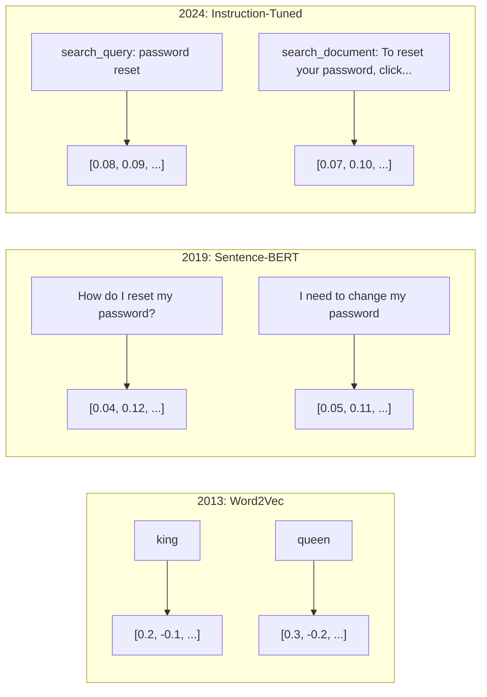
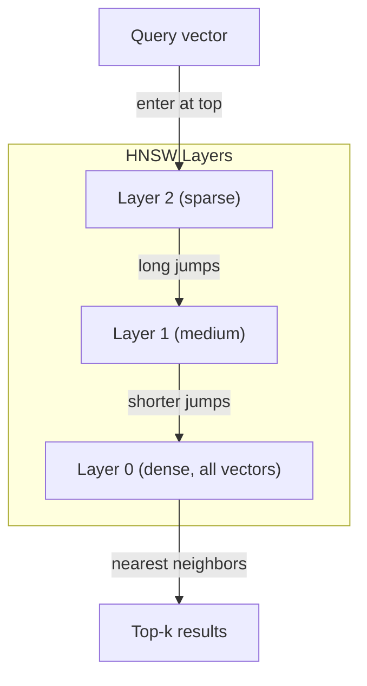
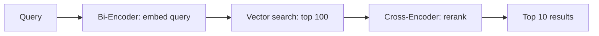

# التوابل والمثليات المتجهة

> النص منفصل. الرياضيات مستمرة. كلما طلبت من ماجستير في العلوم العليا العثور على وثائق "مماثلة" أو مقارنة المعاني أو البحث خارج الكلمات الرئيسية، كنت تعتمد على جسر بين هذين العالمين. تلك الجسر هي إضافة. إذا كنت لا تفهم الإضافة، أنت لا تفهم الذكاء الاصطناعي الحديث. أنت فقط تستخدمها.

**Type:** Build
**Languages:** Python
**Prerequisites:** Phase 11, Lesson 01 (Prompt Engineering)
**Time:** ~75 minutes
**Related:**المرحلة 5 · 22 (إمبيدينغ موديلز غوص عميق) تغطي كثافة مقابل نادر مقابل متعدد المتجهات، وتقصر ماتريوشكا، واختيار النموذج لكل محور. يركز هذا الدروس على خط الأنابيب الإنتاج (متجهات DB، HNSW، الرياضيات المماثلة). اقرأ المرحلة 5 · 22 قبل اختيار نموذج.

## أهداف التعلم

- إنشاء إضافة نصية باستخدام مزودي API ونماذج مفتوحة المصدر ، وحساب التشابه بينها
- شرح لماذا تُحل المكالمات المضمنة مشكلة عدم مطابقة المفردات التي لا يمكن البحث عن الكلمات الرئيسية التعامل معها
- بناء مؤشر بحث تعريفية يستعيد المستندات حسب المعنى بدلا من مطابقة الكلمات الرئيسية بالضبط
- تقييم جودة التضمين باستخدام معايير الاسترداد (precision@k، recall) واختيار نموذج التضمين المناسب لمهمتك

## المشكلة

لديك 10 آلاف تذكرة دعم. يكتب عميل "دفعي لم يمر". تحتاج للعثور على تذاكر سابقة مماثلة. بحث الكلمات الرئيسية يجد تذاكر تحتوي على "دفع" و "لم يمر". يفتقد "فشل المعاملة،" "تم رفض الرسوم،" و "خطأ الفواتير". هذه التذاكر تصف نفس المشكلة بالضبط بكلمات مختلفة تماما.

هذه هي مشكلة عدم مطابقة المفردات. اللغة البشرية لديها عشرات الطرق لقول الشيء نفسه. بحث الكلمات الرئيسية يعامل كل كلمة كرمز مستقل دون معنى. لا يمكن أن يعرف أن "رفض" و "لم يمر" يشير إلى نفس المفهوم.

تحتاج إلى تمثيل من النص حيث تعتمد المعنى، وليس التنفيذ، على التشابه. تحتاج إلى طريقة لوضع "دفعي لم يمر" و "تم رفض الصفقة" قربًا معًا في بعض المساحات الرياضية، بينما تدفع "دفعي وصل في الوقت المناسب" بعيداً على الرغم من مشاركة كلمة "دفع".

هذه التمثيل هي إضافة.

## المفهوم

### ما هو التبني؟

التضمين هو متجه كثيف من أرقام النقاط العائمة التي تمثل معنى النص. كلمة "كثافة" مهمة - كل بعد يحمل المعلومات، على عكس التمثيلات النادرة (كيس الكلمات، TF-IDF) حيث معظم الأبعاد صفر.

"القطة جلست على السجادة" تصبح شيئا مثل`[0.023, -0.041, 0.087, ..., 0.012]`-- قائمة من 768 إلى 3072 أرقام اعتمادا على النموذج. هذه الأرقام ترميز المعنى. أنت لا تفتشها مباشرة. أنت مقارنة لهم.

### الانفجار في Word2Vec

في عام 2013، نشر توماس ميكولوف وزملاؤه في جوجل Word2Vec. البصيرة الأساسية: تدريب شبكة عصبية للتنبؤ بكلمة من جيرانها (أو الجيران من كلمة) ، وتصبح أوزان الطبقة المخفية تمثيلات متجهة ذات معنى.

النتيجة الشهيرة:

```
king - man + woman = queen
```

الحسابات المتجهة على التوابل الكلمة تسجل العلاقات المفصلية. الاتجاه من "الرجل" إلى "المرأة" هو تقريبا نفس الاتجاه من "الملك" إلى "الملكة". كانت هذه اللحظة التي أدركت فيها الحقل أن الهندسة يمكن أن ترمز المعنى.

وقد أنتج Word2Vec متجهات ثلاثمائة بعد. حصلت كل كلمة على متجه واحد بغض النظر عن السياق. كان "البنك" في "نحو النهر" و "الحساب المصرفي" لديهما نفس التوابع. هذا القيود دفع العقد التالي من البحث.

### من الكلمات إلى الجمل

تمثل إضافة الكلمات رموزًا واحدةً. تحتاج أنظمة الإنتاج إلى إضافة جمل أو فقرات أو وثائق كاملة. ظهرت أربعة منهج:

**Averaging**: تأخذ المتوسط من جميع متجهات الكلمات في الجملة. رخيصة، ضائعة، ومنعمة بشكل مفاجئ للنص القصير. يفقد ترتيب الكلمات بالكامل -- "الكلب يضرب الرجل" و "الرجل يضرب الكلب" يحصلون على سمات متطابقة.

**CLS token**: نماذج المحول (BERT، 2018) تنطلق إدخال رمز خاص [CLS] يمثل المدخل بأكمله. أفضل من المتوسط ولكن تم تدريب رمز [CLS] للتنبؤ بالجملة التالية ، وليس التشابه.

**Contrastive learning**: تدريب النموذج صراحة لدفع أزواج مماثلة معًا وأزواج غير مماثلة إلى جانبها. استخدم Sentence-BERT (Reimers & Gurevych ، 2019) هذا النهج وأصبح أساسًا لنماذج التضمين الحديثة. بالنظر إلى "كيف أعيد تعيين كلمة المرور الخاصة بي؟" و "يجب أن أغير كلمة المرور الخاصة بي" ، يتعلم النموذج أن يكون لديهم متجهات متطابقة تقريبًا.

**Instruction-tuned embeddings**: النهج الأخير. تستقبل نماذج مثل E5 و GTE مقدمة مهمة ("search_query:"، "search_document:") التي تخبر النموذج عن نوع الإضافة التي يجب إنتاجها. وهذا يسمح لنموذج واحد بتقديم مهام متعددة.



### نماذج إضافة حديثة

وقد استقر السوق في عدد قليل من الخيارات التي تتسم بمرحلة الإنتاج (درجات MTEB اعتبارًا من أوائل عام 2026 ، MTEB v2):

| Model | Provider | Dimensions | MTEB | Context | Cost / 1M tokens |
|-------|----------|-----------|------|---------|------------------|
| Gemini Embedding 2 | Google | 3072 (Matryoshka) | 67.7 (retrieval) | 8192 | $0.15 |
| embed-v4 | Cohere | 1024 (Matryoshka) | 65.2 | 128K | $0.12 |
| voyage-4 | Voyage AI | 1024/2048 (Matryoshka) | 66.8 | 32K | $0.12 |
| text-embedding-3-large | OpenAI | 3072 (Matryoshka) | 64.6 | 8192 | $0.13 |
| text-embedding-3-small | OpenAI | 1536 (Matryoshka) | 62.3 | 8192 | $0.02 |
| BGE-M3 | BAAI | 1024 (dense+sparse+ColBERT) | 63.0 multilingual | 8192 | Open-weight |
| Qwen3-Embedding | Alibaba | 4096 (Matryoshka) | 66.9 | 32K | Open-weight |
| Nomic-embed-v2 | Nomic | 768 (Matryoshka) | 63.1 | 8192 | Open-weight |

تغطي MTEB (Masssive Text Embedding Benchmark) v2 أكثر من 100 مهمة عبر الاستخدام والتصنيف والتكسيم وإعادة التصنيف والإجمال. أعلى أفضل بحلول عام 2026، تتطابق النماذج المفتوحة الوزن (Qwen3-Embedding، BGE-M3) أو تغلب على النماذج المضيفة المغلقة على معظم المحاور. يتوجب على Gemini Embedding 2 الاسترداد النقي؛ ويتوجب على Voyage/Cohere أن يُقيم مجالات محددة (المالية والقانون والرمز). دائماً استناد على أسئلتك الخاصة قبل الالتزام.

### مقاييس التشابه

بالنظر إلى متجهين إضافة، هناك ثلاثة طرق لقياس مدى شباهتهم:

**Cosine similarity**: كوسين زاوية بين متجهين. يتراوح من -1 (العكس) إلى 1 (الجهة المماثلة). يتجاهل الحجم -- جملة 10 كلمات وثيقة 500 كلمة يمكن أن تسجل 1.0 إذا كانت تشير إلى نفس الاتجاه. هذا هو الافتراض المحدد ل90٪ من الحالات الاستخدامية.

```
cosine_sim(a, b) = dot(a, b) / (||a|| * ||b||)
```

**Dot product**: المنتج الداخلي الخام لمتجهين. متطابق مع التشابه الكوسيني عندما يتم تطبيع المتجهات (طول الوحدة). أسرع للحساب. يتم تطبيع تضمينات OpenAI ، لذلك يعطي منتج النقطة والكوسيني نفس التصنيف.

```
dot(a, b) = sum(a_i * b_i)
```

**Euclidean (L2) distance**: مسافة خط مستقيم في الفضاء المتجه. أصغر = أكثر مماثلة. حساسة لفرق الكبيرة. استخدم عندما يكون الموقف المطلق في الفضاء مهمًا ، وليس فقط الاتجاه.

```
L2(a, b) = sqrt(sum((a_i - b_i)^2))
```

متى تستخدم:

| Metric | Use when | Avoid when |
|--------|----------|------------|
| Cosine similarity | Comparing texts of different lengths; most retrieval tasks | Magnitude carries information |
| Dot product | Embeddings are already normalized; maximum speed | Vectors have varying magnitudes |
| Euclidean distance | Clustering; spatial nearest-neighbor problems | Comparing documents of wildly different lengths |

### قواعد بيانات المتجهات و HNSW

بحث تشابه بقوة قاسية يقارن البحث مع كل متجه مخزن في مليون متجه مع 1536 بعد، وهذا هو 1.5 مليار عملية مضاعفة إضافة لكل استفسار. بطيئ جدا.

قواعد بيانات متجهة تحل هذا مع خوارزميات القريب القريب (ANN). خوارزمية المهيمنة هي HNSW (العالم الصغير الملاحة الهرمية):

1. قم ببناء رسمية متعددة الطبقات من المتجهات
2. الطبقات العليا نادرة -- الاتصالات طويلة المدى بين الكتائب البعيدة
3. الطبقات السفلية كثيفة -- صلات حادة بين المتجهات القريبة
4. البحث يبدأ في الطبقة العليا، ينزل طمعيا لتصميم
5. يعيد نتائج مقربة من أعلى (k) في O(log n) وقت بدلا من O(n)

تتداول HNSW خسارة دقيقة صغيرة في الدقة (عادة ما تكون 95-99٪ من التذكر) لتحقيق مكاسب كبيرة في السرعة. عند 10 ملايين متجه، يستغرق القوة الخامث الثواني. تستغرق HNSW ميل ثانية.



خيارات الإنتاج:

| Database | Type | Best for | Max scale |
|----------|------|----------|-----------|
| Pinecone | Managed SaaS | Zero-ops production | Billions |
| Weaviate | Open source | Self-hosted, hybrid search | 100M+ |
| Qdrant | Open source | High performance, filtering | 100M+ |
| ChromaDB | Embedded | Prototyping, local dev | 1M |
| pgvector | Postgres extension | Already using Postgres | 10M |
| FAISS | Library | In-process, research | 1B+ |

### استراتيجيات التجزئة

وثائق طويلة جداً لتدمجها كمتنقل واحد. PDF 50 صفحة تغطي عشرات المواضيع -- تمكنت من دمجها من أن تصبح متوسطاً لكل شيء، مماثلاً لأي شيء محدد. تقوم بتقسيم الوثائق إلى قطع وتدمج كل منها.

**Fixed-size chunking**: تقسيم كل رموز N مع تداخل رموز M. بسيط ومتوقع. يعمل بشكل جيد عندما لا توجد هيكل واضح. جزء من 512 رمزا مع تداخل 50 رمزا: جزء 1 هو رموز 0-511، جزء 2 هو رموز 462-973.

**Sentence-based chunking**: تقسيم على حدود الجملة، وتجميع الجمل حتى تصل إلى الحد الرمزي. كل جزء هو على الأقل جملة كاملة. أفضل من الحجم الثابت لأنك لا تقسم فكرة إلى النصف.

**Recursive chunking**حاول الانقسام في الحدود الأكبر أولاً (رؤوس القسم). إذا كان كبيرًا جدًا ، حاول حدود الفقرة. ثم حدود الجملة. ثم حدود الأحرف. هذه هي حد لاندشين `RecursiveCharacterTextSplitter`ويعمل بشكل جيد على الجهازات المختلطة.

**Semantic chunking**: تضمين كل جملة، ثم مجموعة جمل متتالية تتشابه إضافةها. عندما تنخفض تشابه إضافة دون عتبة، بدء قطعة جديدة. مكلفة (تطلب تضمين كل جملة بشكل فردي) ولكن تنتج أكثر قطع متماسكة.

| Strategy | Complexity | Quality | Best for |
|----------|-----------|---------|----------|
| Fixed-size | Low | Decent | Unstructured text, logs |
| Sentence-based | Low | Good | Articles, emails |
| Recursive | Medium | Good | Markdown, HTML, mixed docs |
| Semantic | High | Best | Critical retrieval quality |

نقطة الحلوة لمعظم الأنظمة: 256-512 قطعة رمزية مع 50 رمزية تتداخل.

### المُشفرين الثنائيين مقابل المُشفرين المتقاطعين

يقوم المُشفّر الثنائي بإدمج البحث والوثائق بشكل مستقل، ثم يقارن المتجهات. سريعًا -- تضع البحث مرة واحدة وتقارن مع إدمجات المستندات المُحاسَبَة مسبقاً. هذا ما تستخدمه للحصول.

يقوم المُشفّر المتقاطع بتحويل الاستفسار والوثيقة كإدخال واحد ويخرج نتيجة ذات صلة. بطيئة - يعالج كل زوج من استفسار وثيقة عبر النموذج الكامل. ولكن أكثر دقة بكثير لأنه يمكن أن يشارك عبر رموز الاستفسار والوثيقة في نفس الوقت.

نمط الإنتاج: الترميز الثنائي يستعيد أفضل 100 مرشح، و الترميز المتقاطع يعيد ترتيبهم إلى أفضل 10. هذا هو خط الأنابيب استرجاع ثم ترتيب.



نماذج الترتيب: Cohere Rerank 3.5 ($ 2 لكل 1000 استفسار) ، BGE-reranker-v2 (حرة، مفتوحة المصدر) ، Jina Reranker v2 (حرة، مفتوحة المصدر).

### "متروشكا"

التوابل التقليدية هي كل شيء أو لا شيء. متجه 1536 بعد يستخدم 1536 عائما. لا يمكنك تقليص إلى 256 بعد دون إعادة التدريب.

تعالج تعلم تمثيل ماتريوشكا (Kusupati et al., 2022) هذا. يتم تدريب النموذج بحيث تستقطب أول N الأبعاد المعلومات الأكثر أهمية ، مثل دمية العشاء الروسية. تقليص 1536d ماتريوشكا المدمجة إلى 256 بعد يفقد بعض الدقة ولكن يبقى وظيفيا.

دعم OpenAI إضافة نصي 3 - صغير وإضافة نصي 3 - كبير تركنشيا ماتريوشكا عبر `dimensions`تُخفض التخزين بنسبة 6x مع فقدان دقة بنسبة 3-5% على مقارنات MTEB.

### الكمية الثنائية

إضافة 1536 بعد مخزنة ك float32 تستخدم 6,144 بايت. ضرب 10 ملايين وثيقة: 61 جيجا بايت فقط للنواقل.

تحويل الكمية الثنائية كل طائرة إلى بيت واحد: تصبح القيم الإيجابية 1 ، تصبح القيم السلبية 0. انخفاض تخزين من 6144 بايت إلى 192 بايت - خفض 32x. يتم حساب التشابه باستخدام مسافة هامينغ (عد البيتات المختلفة) ، والتي يمكن أن تقوم بها معالجات المعالجة المركزية في تعليمة واحدة.

النمط الشائع: تعريف الكميات الثنائية للبحث الأول على ملايين المتجهات، ثم إعادة تعيين أعلى 1000 مع متجهات الدقة الكاملة. هذا يحصل لك على 95٪ + دقة الدقة الكاملة عند 32x أقل ذاكرة.

```figure
cosine-similarity
```

## بناءها

بناء محرك بحث معنوي من الصفر لا قاعدة بيانات متجهة لا API خارجية تضمين بيثون نقية مع numpy للرياضيات

### الخطوة الأولى: تقطيع النص

```python
def chunk_text(text, chunk_size=200, overlap=50):
    words = text.split()
    chunks = []
    start = 0
    while start < len(words):
        end = start + chunk_size
        chunk = " ".join(words[start:end])
        chunks.append(chunk)
        start += chunk_size - overlap
    return chunks


def chunk_by_sentences(text, max_chunk_tokens=200):
    sentences = text.replace("\n", " ").split(".")
    sentences = [s.strip() + "." for s in sentences if s.strip()]
    chunks = []
    current_chunk = []
    current_length = 0
    for sentence in sentences:
        sentence_length = len(sentence.split())
        if current_length + sentence_length > max_chunk_tokens and current_chunk:
            chunks.append(" ".join(current_chunk))
            current_chunk = []
            current_length = 0
        current_chunk.append(sentence)
        current_length += sentence_length
    if current_chunk:
        chunks.append(" ".join(current_chunk))
    return chunks
```

### الخطوة الثانية: بناء المواد المدمجة من الصفر

نطبق إضافة كثيفة بسيطة باستخدام TF-IDF مع تطبيع L2. هذا ليس إضافة عصبية، لكنه يتبع نفس العقد: النص في، والنقل في حجم ثابت، النص المماثلة تنتج نقلات مماثلة.

```python
import math
import numpy as np
from collections import Counter

class SimpleEmbedder:
    def __init__(self):
        self.vocab = []
        self.idf = []
        self.word_to_idx = {}

    def fit(self, documents):
        vocab_set = set()
        for doc in documents:
            vocab_set.update(doc.lower().split())
        self.vocab = sorted(vocab_set)
        self.word_to_idx = {w: i for i, w in enumerate(self.vocab)}
        n = len(documents)
        self.idf = np.zeros(len(self.vocab))
        for i, word in enumerate(self.vocab):
            doc_count = sum(1 for doc in documents if word in doc.lower().split())
            self.idf[i] = math.log((n + 1) / (doc_count + 1)) + 1

    def embed(self, text):
        words = text.lower().split()
        count = Counter(words)
        total = len(words) if words else 1
        vec = np.zeros(len(self.vocab))
        for word, freq in count.items():
            if word in self.word_to_idx:
                tf = freq / total
                vec[self.word_to_idx[word]] = tf * self.idf[self.word_to_idx[word]]
        norm = np.linalg.norm(vec)
        if norm > 0:
            vec = vec / norm
        return vec
```

### الخطوة الثالثة: وظائف التشابه

```python
def cosine_similarity(a, b):
    dot = np.dot(a, b)
    norm_a = np.linalg.norm(a)
    norm_b = np.linalg.norm(b)
    if norm_a == 0 or norm_b == 0:
        return 0.0
    return float(dot / (norm_a * norm_b))


def dot_product(a, b):
    return float(np.dot(a, b))


def euclidean_distance(a, b):
    return float(np.linalg.norm(a - b))
```

### الخطوة الرابعة: مؤشر المتجهات مع البحث عن القوة القاسية

```python
class VectorIndex:
    def __init__(self):
        self.vectors = []
        self.texts = []
        self.metadata = []

    def add(self, vector, text, meta=None):
        self.vectors.append(vector)
        self.texts.append(text)
        self.metadata.append(meta or {})

    def search(self, query_vector, top_k=5, metric="cosine"):
        scores = []
        for i, vec in enumerate(self.vectors):
            if metric == "cosine":
                score = cosine_similarity(query_vector, vec)
            elif metric == "dot":
                score = dot_product(query_vector, vec)
            elif metric == "euclidean":
                score = -euclidean_distance(query_vector, vec)
            else:
                raise ValueError(f"Unknown metric: {metric}")
            scores.append((i, score))
        scores.sort(key=lambda x: x[1], reverse=True)
        results = []
        for idx, score in scores[:top_k]:
            results.append({
                "text": self.texts[idx],
                "score": score,
                "metadata": self.metadata[idx],
                "index": idx
            })
        return results

    def size(self):
        return len(self.vectors)
```

### الخطوة 5: محرك البحث المتعنى

```python
class SemanticSearchEngine:
    def __init__(self, chunk_size=200, overlap=50):
        self.embedder = SimpleEmbedder()
        self.index = VectorIndex()
        self.chunk_size = chunk_size
        self.overlap = overlap

    def index_documents(self, documents, source_names=None):
        all_chunks = []
        all_sources = []
        for i, doc in enumerate(documents):
            chunks = chunk_text(doc, self.chunk_size, self.overlap)
            all_chunks.extend(chunks)
            name = source_names[i] if source_names else f"doc_{i}"
            all_sources.extend([name] * len(chunks))
        self.embedder.fit(all_chunks)
        for chunk, source in zip(all_chunks, all_sources):
            vec = self.embedder.embed(chunk)
            self.index.add(vec, chunk, {"source": source})
        return len(all_chunks)

    def search(self, query, top_k=5, metric="cosine"):
        query_vec = self.embedder.embed(query)
        return self.index.search(query_vec, top_k, metric)

    def search_with_scores(self, query, top_k=5):
        results = self.search(query, top_k)
        return [
            {
                "text": r["text"][:200],
                "source": r["metadata"].get("source", "unknown"),
                "score": round(r["score"], 4)
            }
            for r in results
        ]
```

### الخطوة 6: مقارنة مقاييس التشابه

```python
def compare_metrics(engine, query, top_k=3):
    results = {}
    for metric in ["cosine", "dot", "euclidean"]:
        hits = engine.search(query, top_k=top_k, metric=metric)
        results[metric] = [
            {"score": round(h["score"], 4), "preview": h["text"][:80]}
            for h in hits
        ]
    return results
```

## استخدمها

مع API الإنشائية الإنتاجية ، تبقى الهندسة المعمارية متطابقة. يتغير فقط المُضمن:

```python
from openai import OpenAI

client = OpenAI()

def openai_embed(texts, model="text-embedding-3-small", dimensions=None):
    kwargs = {"model": model, "input": texts}
    if dimensions:
        kwargs["dimensions"] = dimensions
    response = client.embeddings.create(**kwargs)
    return [item.embedding for item in response.data]
```

التخفيضات الماتريوشكا مع OpenAI -- نفس النموذج، أبعاد أقل، تخزين أقل:

```python
full = openai_embed(["semantic search query"], dimensions=1536)
compact = openai_embed(["semantic search query"], dimensions=256)
```

يستخدم المتجه 256d 6x أقل تخزينًا. بالنسبة إلى 10 ملايين مستند، هذا هو 10 جيجابايت مقابل 61 جيجابايت. فقدان الدقة حوالي 3-5% على المعايير القياسية.

لتحويل رتبة مع (كوهير):

```python
import cohere

co = cohere.ClientV2()

results = co.rerank(
    model="rerank-v3.5",
    query="What is the refund policy?",
    documents=["Full refund within 30 days...", "No refunds after 90 days..."],
    top_n=3
)
```

بالنسبة للمكثفات المحلية بدون اعتماد على API:

```python
from sentence_transformers import SentenceTransformer

model = SentenceTransformer("BAAI/bge-small-en-v1.5")
embeddings = model.encode(["semantic search query", "another document"])
```

فئة VectorIndex من بناءنا تعمل مع أي من هذه. تغيير وظيفة التضمين، الحفاظ على منطق البحث.

## أرسله

هذا الدرس ينتج عن:
- `outputs/prompt-embedding-advisor.md`-- إشارة لانتخاب نماذج وتجديدات التضمين في حالات الاستخدام المحددة
- `outputs/skill-embedding-patterns.md`-- مهارة تعلّم العملاء كيفية استخدام المُضخّمات بفعالية في الإنتاج

## التمارين

1. **Metric comparison**: إجراء نفس 5 استفسارات على المستندات العينة باستخدام شبيهة الكوسين، ومعدل النقاط، والمسافة الأوكليدية. سجل النتائج الثلاثة الأولى لكل منها. بالنسبة إلى أي استفسارات لا توافق المعايير؟ لماذا؟

2. **Chunk size experiment**: تحديد نموذج الوثائق بحجم قطع 50، 100، 200، و 500 كلمة. لكل منها، قم بتشغيل 5 استفسارات وتسجيل درجة التشابه الأولى. رسم العلاقة بين حجم الجزء ونوعية الاستخدام. العثور على النقطة التي تبدأ فيها قطع أكبر الألم.

3. **Matryoshka simulation**: بناء SimpleEmbedder الذي ينتج متجهات 500d. قصر إلى 50، 100، 200، و 500 أبعاد. قياس كيفية تدهور استرداد التذكر في كل قصر. هذا يحاكي سلوك ماتريوشكا دون الحاجة إلى خدعة التدريب الحقيقية.

4. **Binary quantization**: تأخذ التوابل من محرك البحث، وتحويلها إلى ثنائي (1 إذا كان إيجابيًا، 0 إذا كان سلبيًا) ، وتنفيذ بحث عن المسافة هامينغ. مقارنة أفضل 10 نتائج مع تشابه كوزين بدقة كاملة. قياس نسبة التداخل.

5. **Sentence-based chunking**: استبدال التجزئة ذات الحجم الثابت بـ `chunk_by_sentences`إجراء نفس الأسئلة ومقارنة النتائج الإستردادية هل يحسن احترام حدود الجملة النتائج؟

## الشروط الرئيسية

| Term | What people say | What it actually means |
|------|----------------|----------------------|
| Embedding | "Text to numbers" | A dense vector where geometric proximity encodes semantic similarity |
| Word2Vec | "The OG embedding" | 2013 model that learned word vectors by predicting context words; proved vector arithmetic encodes meaning |
| Cosine similarity | "How similar are two vectors" | Cosine of the angle between vectors; 1 = identical direction, 0 = orthogonal, -1 = opposite |
| HNSW | "Fast vector search" | Hierarchical Navigable Small World graph -- multi-layer structure enabling O(log n) approximate nearest neighbor search |
| Bi-encoder | "Embed separately, compare fast" | Encodes query and document independently into vectors; enables pre-computation and fast retrieval |
| Cross-encoder | "Slow but accurate reranker" | Processes query-document pair jointly through the full model; higher accuracy, no pre-computation |
| Matryoshka embeddings | "Truncatable vectors" | Embeddings trained so the first N dimensions capture the most important information, enabling variable-size storage |
| Binary quantization | "1-bit embeddings" | Converting float vectors to binary (sign bit only) for 32x storage reduction with Hamming distance search |
| Chunking | "Split docs for embedding" | Breaking documents into 256-512 token segments so each can be independently embedded and retrieved |
| Vector database | "Search engine for embeddings" | Data store optimized for storing vectors and performing approximate nearest neighbor search at scale |
| Contrastive learning | "Train by comparison" | Training approach that pushes similar pair embeddings together and dissimilar pair embeddings apart |
| MTEB | "The embedding benchmark" | Massive Text Embedding Benchmark -- 56 datasets across 8 tasks; standard for comparing embedding models |

## المزيد من القراءة

- ميكولوف وآخرون، "التقدير الفعال لممثلي الكلمات في الفضاء المتجه" (2013) -- ورقة Word2Vec التي بدأت ثورة التضمين مع تشبيه الملك الملكة
- ريمرز و غيورفيتش، "Sentence-BERT: Sentence Embeddings using Siamese BERT-Networks" (2019) -- كيفية تدريب المرموزين الثنائيين على التشابه على مستوى الجملة، أساس نماذج التدمج الحديثة
- كوسوباتي وزملاء، "تعلم تمثيل ماتريوشكا" (2022) -- التقنية وراء إدخال الأبعاد المتغيرة التي اعتمدتها OpenAI لإدخال النص-3
- مالكوف و ياشونين، "الجهة القريبة القريبة المثلى والثابتة باستخدام الرسوم البيانية التسلسلية للملاحة الصغيرة العالمية" (2018) -- ورقة HNSW، الخوارزمية وراء معظم البحث عن المتجهات الإنتاجية
- دليل إضافة OpenAI (platform.openai.com/docs/guides/embeddings) -- مرجع عملي لنماذج إضافة نص-3 بما في ذلك تقليل الأبعاد الماتريوشكا
- لوحة الرؤوس MTEB (huggingface.co/spaces/mteb/leaderboard) -- مقياس قياسي مباشر يُقارن جميع نماذج التضمين عبر المهام واللغات
- [Muennighoff et al., "MTEB: Massive Text Embedding Benchmark" (EACL 2023)](https://arxiv.org/abs/2210.07316)-- مقياس الموازنة الذي يحدد 8 فئات المهام (التصنيف، التجميع، تصنيف الأزواج، إعادة التصنيف، الاسترداد، STS، التجميع، استخراج النص البييت) التي تقررها اللوحة الرائدة؛ قراءة قبل الثقة بأي نتيجة واحدة من MTEB.
- [Sentence Transformers documentation](https://www.sbert.net/)-- الإشارة القنونيّة لـ (بيكودر) مقابل (كروس كودر) ، استراتيجيات التجميع، وخط الأنابيب RAG المشتركة المشتركة المشتركة هذه الدروس تطبقها.
