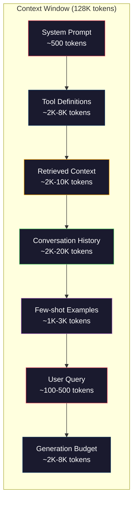
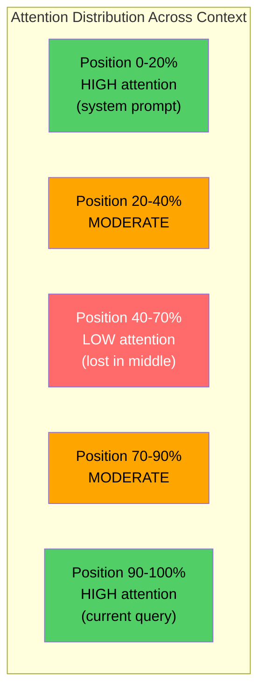
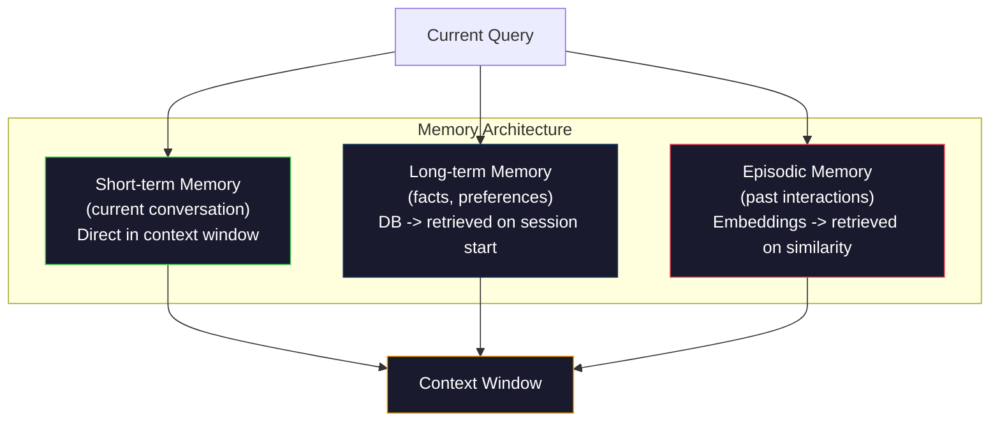

# هندسة السياق: ويندوز، ميزانيات، ذاكرة، واسترداد

> الهندسة السريعة هي مجموعة فرعية. الهندسة السياقية هي اللعبة بأكملها. إن الإشارة هي سلسلة تقوم بتصفيتها. السياق هو كل ما يذهب إلى نافذة النموذج: تعليمات النظام، وثائق المستردة، تعريفات الأدوات، تاريخ المحادثة، أمثلة قصيرة، والإشارة نفسها. أفضل مهندسي الذكاء الاصطناعي في عام 2026 هم مهندسي السياق. هم يقررون ما يدخل، ما يبقى خارج، وفي أي ترتيب.

**Type:** Build
**Languages:** Python
**Prerequisites:** Phase 10 (LLMs from Scratch), Phase 11 Lesson 01-02
**Time:** ~90 minutes
**Related:**المرحلة 11 · 15 (التخزين السريع)  التخطيط الصديق للخزينة هو امتداد للهندسة السياقية. المرحلة 5 · 28 (تقييم السياق الطويل) لكيفية قياس الخسارة في الوسط مع NIAH / RULER.

## أهداف التعلم

- حساب ميزانيات الوهم عبر جميع مكونات نافذة السياق (تشارك النظام، الأدوات، التاريخ، الوثائق المكتسبة، مساحة توليد)
- تنفيذ استراتيجيات إدارة نافذة السياق: تخفيض، وجملة، ونفذة زلقة لتاريخ المحادثة
- تحديد الأولويات وتنظيم مكونات السياق لتعظيم اهتمام النموذج على المعلومات الأكثر أهمية
- قم ببناء مجموعة سياقية تقوم بتخصيص الرموز بشكل ديناميكي بناء على نوع الاستفسار ومساحة النافذة المتاحة

## المشكلة

كلود أوبوس 4.7 لديه نافذة رمزية 200K (1M في التطبيق التجريبي). GPT-5 لديه 400K. جيميني 3 برو لديه 2M. لاما 4 تدعي 10M. هذه الأرقام تبدو هائلة حتى تملأها.

هنا تقسيم حقيقي لمساعد التشفير. طلب النظام: 500 رمز. تعريفات الأدوات ل 50 أداة: 8000 رمز. الوثائق المستردة: 4000 رمز. تاريخ المحادثة (10 جولات): 6000 رمز. استفسار المستخدم الحالي: 200 رمز. ميزانية الجيل (أقصى إنتاج): 4000 رمز. إجمالي: 22700 رمز. وهذا هو فقط 18% من نافذة 128K.

لكن الاهتمام لا يتحرك خطيا مع طول السياق. نموذج مع 128K رموز السياق يدفع تكلفة الاهتمام التربيعي (O  n ^ 2) في محولات الفانيليا ، على الرغم من أن معظم نماذج الإنتاج تستخدم خيارات الاهتمام الفعالة). والأهم من ذلك، تحسن الاستعراض يتدهور. اختبار "إبرة في كومة من الخشب" يظهر أن النماذج تكافح للعثور على المعلومات الموضحة في وسط السياقات الطويلة. أبحاث ليو وآخرين (2023) أظهرت أن الـ LLM يستعيد المعلومات في بداية ونهاية السياقات الطويلة بدقة شبه مثالية، ولكن الدقة تنخفض 10-20% للمعلومات الموضحة في الوسط (مواقع 40-70% من السياق). هذا التأثير "المفقود في الوسط" يختلف حسب النموذج لكنه يؤثر على جميع الهندسة المعمارية الحالية.

الدرس العملي: وجود 200K رموز متاحة لا يعني استخدام 200K رموز فعالة. سياق رموز 10K التي تمت تدوينها بعناية غالبا ما يتفوق على سياق رموز 100K المنسخة. هندسة السياق هي تخصص تعظيم نسبة الإشارة إلى الضوضاء داخل نافذة السياق.

كل رمز تضعه في النافذة يضع رمزًا يمكن أن يحمل معلومات أكثر صلة. كل تعريف أداة غير ذي صلة، كل جولة محادثة قديمة، كل قطعة من النص المكتوب الذي لا يجيب على السؤال - كل واحد يجعل النموذج أسوأ قليلا في المهمة.

## المفهوم

### نافذة السياق هي مصدر نادر

فكّر في نافذة السياق كـ RAM، وليس كـ Disk. إنها سريعة ويمكن الوصول إليها مباشرة، لكن محدودة. لا يمكنك إصلاح كل شيء. عليك اختيار.



كل مكون يتنافس على المساحة. إضافة المزيد من تعريفات الأدوات يعني مساحة أقل لتاريخ المحادثة. إضافة المزيد من السياق المسترد يعني مساحة أقل لمثال القليل من اللقطات. هندسة السياق هي فن تخصيص هذا الميزانية لتحقيق أقصى قدر من أداء المهام.

### ضائعة في الوسط

أهم النتائج التجريبية في هندسة السياق. الوضع يتعامل مع المعلومات بشكل أفضل في بداية ونهاية السياق. المعلومات في الوسط تحصل على درجات الاهتمام المنخفضة ويمكنها تجاهلها بشكل أكبر.

قام ليوه وزملاؤه (2023) بتجربة هذا بشكل منهجي. وضعوا وثيقة ذات صلة بين 20 وثيقة غير ذات صلة في مواقع مختلفة وقاسوا دقة الإجابة. عندما كان الوثيقة ذات صلة الأولى أو الأخيرة، كانت دقة 85-90٪. عندما كانت في الوسط (الموقف 10 من 20) ، انخفضت دقة إلى 60-70٪.

هذا له آثار هندسية مباشرة:

- ضع الأهم المعلومات أولاً (تعليمات النظام السريعة، التعليمات الحرجة)
- ضع الاستطلاع الحالي والسياق الأكثر أهمية في الأخير (تساعد التحيز الأخير)
- تعامل وسط السياق كمناطق ذات الأولوية المنخفضة
- إذا كان عليك إضافة معلومات في الوسط، قم بتكرار النقطة الرئيسية في النهاية



### مكونات السياق

**System prompt**: يحدد الشخصية والقيود والقواعد السلوكية. هذا يذهب أولاً ويبقى ثابتًا عبر التحولات. يستخدم كلود كود حوالي 6000 رمزًا لنظامها الإرسال بما في ذلك تعريفات الأدوات وإرشادات السلوك. حافظ عليه ضيقًا. يتم تكرار كل كلمة في طلب النظام في كل مكالمة API.

**Tool definitions**كل أداة تضيف 50-200 رمز (اسم وصف مخطط المعلم). 50 أداة في 150 رمز كل منها هو 7500 رمز قبل أي محادثة يحدث. اختيار الأداة الديناميكية - فقط بما في ذلك الأدوات ذات الصلة للمسألة الحالية - يمكن أن تقلل هذا بنسبة 60-80%.

**Retrieved context**: الوثائق من قاعدة بيانات متجهة، نتائج البحث، محتويات الملفات. جودة الاستعراض تحدد مباشرة جودة الاستجابة. استعراض سيء أسوأ من أي استعراض -- يملأ النافذة بالضوضاء ويضلل النموذج بنشاط.

**Conversation history**: كل رسالة مستخدم سابقة ورد المساعد. ينمو خطيا مع طول المحادثة. محادثة 50 جولة عند 200 رمزا في كل جولة هي 10,000 رمزا من التاريخ. معظمها غير ذي صلة بالمسألة الحالية.

**Few-shot examples**: أزواج المدخلات / الخروج التي تظهر السلوك المطلوب. مثالين إلى ثلاثة مثالات مختارة جيدا غالبا ما تحسن نوعية الخروج أكثر من آلاف رموز التعليمات. لكنها تكلف المساحة.

**Generation budget**: الوهم المخصص لرد النموذج. إذا ملأت النافذة إلى القدرة، لن يكون لدى النموذج مكان للإجابة. احتفظ ب 2,000-4,000 رمز على الأقل للإنتاج.

### استراتيجيات ضغط السياق

**History summarization**: بدلاً من الحفاظ على جميع التحولات السابقة حرفياً ، قم بتلخيص المحادثة بشكل دوري. "ناقشنا X ، قررنا Y ، والعميل يريد Z" في 100 رمزاً يحل محل 10 جولات التي استغرق 2000 رمزاً. قم بتلخيص التاريخ عندما يتجاوز العدالة (على سبيل المثال ، 5000 رمزاً).

**Relevance filtering**: تسجيل كل مستند تم استرداده مقابل الاستفسار الحالي وتسجيل الوثائق تحت عتبة. إذا استرددت 10 قطع ولكن 3 فقط هي ذات صلة، فاستبعاد الباقي 7. من الأفضل أن يكون لديك 3 قطع ذات صلة عالية من 10 المتوسطات.

**Tool pruning**: تصنيف نية الاستفسار للمستخدم وتشمل فقط الأدوات ذات الصلة بهذا النية. لا تحتاج سؤال رمز إلى أدوات التقويم. لا تحتاج سؤال جدولة إلى أدوات نظام الملفات. وهذا يمكن أن يقلل من تعريفات الأدوات من 8000 رمز إلى 1,000.

**Recursive summarization**: للوثائق الطويلة جدا، تلخيصها في مراحل. أولا تلخيص كل قسم، ثم تلخيص الملخصات. تصبح الوثيقة ذات 50 صفحة إعادة التدوير 500 رمزية التي تلتقط النقاط الرئيسية.

### أنظمة الذاكرة

هندسة السياق تمتد على ثلاثة آفاق زمنية

**Short-term memory**: المحادثة الحالية. يتم تخزينها في نافذة السياق مباشرة. ينمو مع كل جولة. يتم إدارةها عن طريق التجميع والقصر.

**Long-term memory**: الحقائق والتفضيلات التي تستمر عبر المحادثات. "المرجع يفضل النصوص النمطية. " " "المشروع يستخدم PostgreSQL. " المخزن في قاعدة بيانات، يتم استرداده عند بدء الجلسة. تخزين كلود كود هذا في الملفات CLAUDE.md. تخزين ChatGPT في ميزة الذاكرة الخاصة بها.

**Episodic memory**: تفاعلات سابقة محددة قد تكون ذات صلة. "في الثلاثاء الماضي، قمنا بتحليل مشكلة مماثلة في وحدة "أوت". يتم تخزينها كإدخالات، يتم استردادها عندما تتطابق المحادثة الحالية مع حلقة سابقة.



### الجمعية الديناميكية للسياق

المعلومات الرئيسية: الاستفسارات المختلفة تحتاج إلى سياق مختلف. إن طلب نظام ثابت + أدوات ثابتة + تاريخ ثابتة هو مضيعة. أفضل الأنظمة تجمع سياق بشكل ديناميكي لكل استفسار.

1. تصنيف نية الاستعلام
2. اختيار الأدوات ذات الصلة (ليس جميع الأدوات)
3. استرداد الوثائق ذات الصلة (ليس مجموعة ثابتة)
4. إدراج دورات التاريخ ذات الصلة (ليس كل التاريخ)
5. إضافة مثالات قليلة التي تتطابق مع نوع المهمة
6. ترتيب كل شيء حسب الأهمية: الحرجة أولاً، المهمة الأخيرة، اختياري في الوسط

هذا ما يفرق بين تطبيقات الذكاء الاصطناعي الجيدة و التطبيقات العظيمة. النموذج هو نفسه. السياق هو المميز.

```figure
lost-in-the-middle
```

## بناءها

### الخطوة الأولى: معداد الرموز

لا يمكنك تقييم ما لا يمكنك قياسه. قم ببناء عداد رمز بسيط (الاستقبال باستخدام تقسيم الفضاء الأبيض ، لأن العد الدقيق يعتمد على الوسيط).

```python
import json
import numpy as np
from collections import OrderedDict

def count_tokens(text):
    if not text:
        return 0
    return int(len(text.split()) * 1.3)

def count_tokens_json(obj):
    return count_tokens(json.dumps(obj))
```

### الخطوة الثانية: مدير الميزانية السياقية

الاختصار الأساسي: مدير الميزانية يتتبع عدد الرموز التي يستخدمها كل عنصر ويتم فرض الحدود.

```python
class ContextBudget:
    def __init__(self, max_tokens=128000, generation_reserve=4000):
        self.max_tokens = max_tokens
        self.generation_reserve = generation_reserve
        self.available = max_tokens - generation_reserve
        self.allocations = OrderedDict()

    def allocate(self, component, content, max_tokens=None):
        tokens = count_tokens(content)
        if max_tokens and tokens > max_tokens:
            words = content.split()
            target_words = int(max_tokens / 1.3)
            content = " ".join(words[:target_words])
            tokens = count_tokens(content)

        used = sum(self.allocations.values())
        if used + tokens > self.available:
            allowed = self.available - used
            if allowed <= 0:
                return None, 0
            words = content.split()
            target_words = int(allowed / 1.3)
            content = " ".join(words[:target_words])
            tokens = count_tokens(content)

        self.allocations[component] = tokens
        return content, tokens

    def remaining(self):
        used = sum(self.allocations.values())
        return self.available - used

    def utilization(self):
        used = sum(self.allocations.values())
        return used / self.max_tokens

    def report(self):
        total_used = sum(self.allocations.values())
        lines = []
        lines.append(f"Context Budget Report ({self.max_tokens:,} token window)")
        lines.append("-" * 50)
        for component, tokens in self.allocations.items():
            pct = tokens / self.max_tokens * 100
            bar = "#" * int(pct / 2)
            lines.append(f"  {component:<25} {tokens:>6} tokens ({pct:>5.1f}%) {bar}")
        lines.append("-" * 50)
        lines.append(f"  {'Used':<25} {total_used:>6} tokens ({total_used/self.max_tokens*100:.1f}%)")
        lines.append(f"  {'Generation reserve':<25} {self.generation_reserve:>6} tokens")
        lines.append(f"  {'Remaining':<25} {self.remaining():>6} tokens")
        return "\n".join(lines)
```

### الخطوة الثالثة: إعادة ترتيب المواد المفقودة

تنفيذ استراتيجية إعادة التنظيم: أهم العناصر هي الأولى والأخيرة، والأقل أهمية في الوسط.

```python
def reorder_lost_in_middle(items, scores):
    paired = sorted(zip(scores, items), reverse=True)
    sorted_items = [item for _, item in paired]

    if len(sorted_items) <= 2:
        return sorted_items

    first_half = sorted_items[::2]
    second_half = sorted_items[1::2]
    second_half.reverse()

    return first_half + second_half

def score_relevance(query, documents):
    query_words = set(query.lower().split())
    scores = []
    for doc in documents:
        doc_words = set(doc.lower().split())
        if not query_words:
            scores.append(0.0)
            continue
        overlap = len(query_words & doc_words) / len(query_words)
        scores.append(round(overlap, 3))
    return scores
```

### الخطوة الرابعة: مضغط تاريخ المحادثة

تلخيص المحادثة القديمة تدور إلى استعادة ميزانية رمزية.

```python
class ConversationManager:
    def __init__(self, max_history_tokens=5000):
        self.turns = []
        self.summaries = []
        self.max_history_tokens = max_history_tokens

    def add_turn(self, role, content):
        self.turns.append({"role": role, "content": content})
        self._compress_if_needed()

    def _compress_if_needed(self):
        total = sum(count_tokens(t["content"]) for t in self.turns)
        if total <= self.max_history_tokens:
            return

        while total > self.max_history_tokens and len(self.turns) > 4:
            old_turns = self.turns[:2]
            summary = self._summarize_turns(old_turns)
            self.summaries.append(summary)
            self.turns = self.turns[2:]
            total = sum(count_tokens(t["content"]) for t in self.turns)

    def _summarize_turns(self, turns):
        parts = []
        for t in turns:
            content = t["content"]
            if len(content) > 100:
                content = content[:100] + "..."
            parts.append(f"{t['role']}: {content}")
        return "Previous: " + " | ".join(parts)

    def get_context(self):
        parts = []
        if self.summaries:
            parts.append("[Conversation Summary]")
            for s in self.summaries:
                parts.append(s)
        parts.append("[Recent Conversation]")
        for t in self.turns:
            parts.append(f"{t['role']}: {t['content']}")
        return "\n".join(parts)

    def token_count(self):
        return count_tokens(self.get_context())
```

### الخطوة 5: اختيار الأدوات الديناميكية

فقط تضم أدوات ذات صلة بالمسألة الحالية. تصنيف النية، ثم تصفية.

```python
TOOL_REGISTRY = {
    "read_file": {
        "description": "Read contents of a file",
        "tokens": 120,
        "categories": ["code", "files"],
    },
    "write_file": {
        "description": "Write content to a file",
        "tokens": 150,
        "categories": ["code", "files"],
    },
    "search_code": {
        "description": "Search for patterns in codebase",
        "tokens": 130,
        "categories": ["code"],
    },
    "run_command": {
        "description": "Execute a shell command",
        "tokens": 140,
        "categories": ["code", "system"],
    },
    "create_calendar_event": {
        "description": "Create a new calendar event",
        "tokens": 180,
        "categories": ["calendar"],
    },
    "list_emails": {
        "description": "List recent emails",
        "tokens": 160,
        "categories": ["email"],
    },
    "send_email": {
        "description": "Send an email message",
        "tokens": 200,
        "categories": ["email"],
    },
    "web_search": {
        "description": "Search the web for information",
        "tokens": 140,
        "categories": ["research"],
    },
    "query_database": {
        "description": "Run a SQL query on the database",
        "tokens": 170,
        "categories": ["code", "data"],
    },
    "generate_chart": {
        "description": "Generate a chart from data",
        "tokens": 190,
        "categories": ["data", "visualization"],
    },
}

def classify_intent(query):
    query_lower = query.lower()

    intent_keywords = {
        "code": ["code", "function", "bug", "error", "file", "implement", "refactor", "debug", "test"],
        "calendar": ["meeting", "schedule", "calendar", "appointment", "event"],
        "email": ["email", "mail", "send", "inbox", "message"],
        "research": ["search", "find", "what is", "how does", "explain", "look up"],
        "data": ["data", "query", "database", "chart", "graph", "analytics", "sql"],
    }

    scores = {}
    for intent, keywords in intent_keywords.items():
        score = sum(1 for kw in keywords if kw in query_lower)
        if score > 0:
            scores[intent] = score

    if not scores:
        return ["code"]

    max_score = max(scores.values())
    return [intent for intent, score in scores.items() if score >= max_score * 0.5]

def select_tools(query, token_budget=2000):
    intents = classify_intent(query)
    relevant = {}
    total_tokens = 0

    for name, tool in TOOL_REGISTRY.items():
        if any(cat in intents for cat in tool["categories"]):
            if total_tokens + tool["tokens"] <= token_budget:
                relevant[name] = tool
                total_tokens += tool["tokens"]

    return relevant, total_tokens
```

### الخطوة 6: خط أنابيب التجميع الكامل

قم بتجميع كل شيء معًا، مع إعطاء استفسار، قم بتجميع السياق المثالي بشكل ديناميكي.

```python
class ContextEngine:
    def __init__(self, max_tokens=128000, generation_reserve=4000):
        self.budget = ContextBudget(max_tokens, generation_reserve)
        self.conversation = ConversationManager(max_history_tokens=5000)
        self.system_prompt = (
            "You are a helpful AI assistant. You have access to tools for "
            "code editing, file management, web search, and data analysis. "
            "Use the appropriate tools for each task. Be concise and accurate."
        )
        self.knowledge_base = [
            "Python 3.12 introduced type parameter syntax for generic classes using bracket notation.",
            "The project uses PostgreSQL 16 with pgvector for embedding storage.",
            "Authentication is handled by Supabase Auth with JWT tokens.",
            "The frontend is built with Next.js 15 using the App Router.",
            "API rate limits are set to 100 requests per minute per user.",
            "The deployment pipeline uses GitHub Actions with Docker multi-stage builds.",
            "Test coverage must be above 80% for all new modules.",
            "The codebase follows the repository pattern for data access.",
        ]

    def assemble(self, query):
        self.budget = ContextBudget(self.budget.max_tokens, self.budget.generation_reserve)

        system_content, _ = self.budget.allocate("system_prompt", self.system_prompt, max_tokens=1000)

        tools, tool_tokens = select_tools(query, token_budget=2000)
        tool_text = json.dumps(list(tools.keys()))
        tool_content, _ = self.budget.allocate("tools", tool_text, max_tokens=2000)

        relevance = score_relevance(query, self.knowledge_base)
        threshold = 0.1
        relevant_docs = [
            doc for doc, score in zip(self.knowledge_base, relevance)
            if score >= threshold
        ]

        if relevant_docs:
            doc_scores = [s for s in relevance if s >= threshold]
            reordered = reorder_lost_in_middle(relevant_docs, doc_scores)
            doc_text = "\n".join(reordered)
            doc_content, _ = self.budget.allocate("retrieved_context", doc_text, max_tokens=3000)

        history_text = self.conversation.get_context()
        if history_text.strip():
            history_content, _ = self.budget.allocate("conversation_history", history_text, max_tokens=5000)

        query_content, _ = self.budget.allocate("user_query", query, max_tokens=500)

        return self.budget

    def chat(self, query):
        self.conversation.add_turn("user", query)
        budget = self.assemble(query)
        response = f"[Response to: {query[:50]}...]"
        self.conversation.add_turn("assistant", response)
        return budget


def run_demo():
    print("=" * 60)
    print("  Context Engineering Pipeline Demo")
    print("=" * 60)

    engine = ContextEngine(max_tokens=128000, generation_reserve=4000)

    print("\n--- Query 1: Code task ---")
    budget = engine.chat("Fix the bug in the authentication module where JWT tokens expire too early")
    print(budget.report())

    print("\n--- Query 2: Research task ---")
    budget = engine.chat("What is the best approach for implementing vector search in PostgreSQL?")
    print(budget.report())

    print("\n--- Query 3: After conversation history builds up ---")
    for i in range(8):
        engine.conversation.add_turn("user", f"Follow-up question number {i+1} about the implementation details of the system")
        engine.conversation.add_turn("assistant", f"Here is the response to follow-up {i+1} with technical details about the architecture")

    budget = engine.chat("Now implement the changes we discussed")
    print(budget.report())

    print("\n--- Tool Selection Examples ---")
    test_queries = [
        "Fix the bug in auth.py",
        "Schedule a meeting with the team for Tuesday",
        "Show me the database query performance stats",
        "Search for best practices on error handling",
    ]

    for q in test_queries:
        tools, tokens = select_tools(q)
        intents = classify_intent(q)
        print(f"\n  Query: {q}")
        print(f"  Intents: {intents}")
        print(f"  Tools: {list(tools.keys())} ({tokens} tokens)")

    print("\n--- Lost-in-the-Middle Reordering ---")
    docs = ["Doc A (most relevant)", "Doc B (somewhat relevant)", "Doc C (least relevant)",
            "Doc D (relevant)", "Doc E (moderately relevant)"]
    scores = [0.95, 0.60, 0.20, 0.80, 0.50]
    reordered = reorder_lost_in_middle(docs, scores)
    print(f"  Original order: {docs}")
    print(f"  Scores:         {scores}")
    print(f"  Reordered:      {reordered}")
    print(f"  (Most relevant at start and end, least relevant in middle)")
```

## استخدمها

### السياق الذي يتم إدارته

يدير كلود كود السياق باستخدام نهج متعدد الطبقات. يشمل طلب النظام قواعد السلوك وتعريفات الأدوات (~ 6K رموز). عند فتح ملف، يتم حقن محتوياته كسياق. عند البحث، يتم إضافة النتائج. يتم تلخيص جولات المحادثة القديمة. يوفر كلود.مدي ذاكرة طويلة الأجل التي تستمر عبر الجلسات.

القرار الهندسي الرئيسي: لا يرمي كلود كود قاعدة التعليمات الخاصة بك في السياق. فإنه يسترد الملفات ذات الصلة على الطلب. هذا هو الهندسة السياقية في الممارسة.

### تحميل السياق الديناميكي

يقوم Cursor بتصفية قاعدة كودك بأكملها في إضافة. عندما تقوم بتصفيف استفسار، فإنه يستعيد الملفات والبلوكات الأكثر ملاءمة باستخدام شبكة المتجهات. فقط تلك الأجزاء تذهب إلى نافذة السياق. يتم ضغط قاعدة كود 500K-خط في 5-10 كتلة كود الأكثر ملاءمة.

هذا هو النمط: تضمين كل شيء، استرداد على الطلب، تضمين فقط ما يهم.

### مساعد في الذاكرة طويلة الأجل

تخزين ChatGPT تفضيلات المستخدم والحقائق كذاكرة طويلة الأجل. في كل بدء من المحادثة، يتم استرداد الذكريات ذات الصلة وإدراجها في طلب النظام. "يفضل المستخدم Python" يكلف 5 رموز ولكنه يحفظ مئات رموز من التعليمات المتكررة عبر المحادثات.

### RAG كمهندسة السياق

إن التوليد المُكثّف من الاسترداد هو هندسة السياق التي تم رسمها. بدلاً من إدراج المعرفة في أوزان النموذج (التدريب) أو طلب النظام (السياق الدوري) ، يمكنك استرداد الوثائق ذات الصلة في وقت الاستفسار وإدراجها في نافذة السياق. خط أنابيب RAG بأكمله -- التجزئة، التضمين، الاستعراض، إعادة التصنيف -- موجود لحل مشكلة واحدة: وضع المعلومات الصحيحة في نافذة السياق.

## أرسله

هذا الدرس يُنتج`outputs/prompt-context-optimizer.md`-- استشارة قابلة للاستعمال مرة أخرى التي تدقيق استراتيجية تجميع السياق وتوصي بتحسينات. إطعامها استشارة النظام، عدد الأدوات، متوسط طول التاريخ، واستراتيجية الاسترداد، ويحدد إضاعة الرمز وتقترح تحسينات.

كما أنها تنتج`outputs/skill-context-engineering.md`-- إطار قرار لتصميم خطوط تجميع السياق على أساس نوع المهمة وحجم نافذة السياق وميزانية التأخير.

## التمارين

1. إضافة "كشف النفايات الوهمية" إلى فئة ContextBudget. يجب أن يضع علامة على المكونات التي تستخدم أكثر من 30% من الميزانية ويقترح استراتيجيات الضغط المحددة لكل نوع من المكونات (التلخيص التاريخ، أدوات القص، إعادة تصنيف الوثائق).

2. تنفيذ التخفيضات التفصيلية للسياق المسترد. إذا كانت الوثائق المستردة متشابهة أكثر من 80% (من خلال التداخل الكلي أو التشابه الكوني في إدخالها) ، فاحتفظ فقط بالتي تتجاوز درجة. قياس كمية ميزانية رمزية تسترد هذه.

3. قم ببناء أداة "استعادة السياق". إعطاء نسخة محادثة، قم بإعادة تشغيلها من خلال ContextEngine وتصور كيف تتغير تخصيص الميزانية بدورها بدورها. قم بتخطيط استخدام رمز لكل عنصر مع مرور الوقت. حدد الدور الذي يبدأ فيه استضافة السياق.

4. قم بتنفيذ اختيار أداة قائمة على الأولويات. بدلاً من إدراج / استبعاد ثنائي، قم بتعيين كل أداة درجة أهمية للمسألة الحالية. قم بإدراج الأدوات في ترتيب أهمية ينخفض حتى يتم استنفاد ميزانية الأداة. مقارن أداء المهام مع أدوات 5، 10، 20، و 50 متضمنة.

5. قم ببناء مضغط سياق متعدد الاستراتيجيات. تنفيذ ثلاث استراتيجيات الضغط (التخفيض، التخفيض، استخراج الجمل الرئيسية) ووضع مقارنة عليها على مجموعة من 20 وثيقة. قياس التنازل بين نسبة الضغط والاحتفاظ بالمعلومات (هل ما زال النسخة المضغوطة تحتوي على الإجابة على السؤال؟)

## الشروط الرئيسية

| Term | What people say | What it actually means |
|------|----------------|----------------------|
| Context window | "How much the model can read" | The maximum number of tokens (input + output) the model processes in a single forward pass -- 400K for GPT-5, 200K (1M beta) for Claude Opus 4.7, 2M for Gemini 3 Pro |
| Context engineering | "Advanced prompt engineering" | The discipline of deciding what goes into the context window, in what order, and at what priority -- encompasses retrieval, compression, tool selection, and memory management |
| Lost-in-the-middle | "Models forget stuff in the middle" | Empirical finding that LLMs attend better to the beginning and end of context, with 10-20% accuracy drop for information placed in the middle |
| Token budget | "How many tokens you have left" | An explicit allocation of context window capacity across components (system prompt, tools, history, retrieval, generation) with per-component limits |
| Dynamic context | "Loading stuff on the fly" | Assembling the context window differently for each query based on intent classification, relevant tool selection, and retrieval results |
| History summarization | "Compressing the conversation" | Replacing verbatim old conversation turns with a concise summary, reducing token cost while preserving key information |
| Tool pruning | "Only including relevant tools" | Classifying query intent and only including tool definitions that match, reducing tool token cost by 60-80% |
| Long-term memory | "Remembering across sessions" | Facts and preferences stored in a database and retrieved at session start -- CLAUDE.md, ChatGPT Memory, and similar systems |
| Episodic memory | "Remembering specific past events" | Past interactions stored as embeddings and retrieved when the current query is similar to a past conversation |
| Generation budget | "Room for the answer" | Tokens reserved for the model's output -- if the context fills the window completely, the model has no room to respond |

## المزيد من القراءة

- [Liu et al., 2023 -- "Lost in the Middle: How Language Models Use Long Contexts"](https://arxiv.org/abs/2307.03172)-- الدراسة النهائية حول الاهتمام المعتمد على الموقف، التي تظهر أن النماذج تكافح مع المعلومات في وسط السياقات الطويلة
- [Anthropic's Contextual Retrieval blog post](https://www.anthropic.com/news/contextual-retrieval)-- كيف أنثروبيك تقترب من استرداد قطع واعية للسياق، وتقلل من فشل الاسترداد بنسبة 49٪
- [Simon Willison's "Context Engineering"](https://simonwillison.net/2025/Jun/27/context-engineering/)-- المدونة التي تسمي هذا التخصص وتتميزه عن الهندسة السريعة
- [LangChain documentation on RAG](https://python.langchain.com/docs/tutorials/rag/)-- التنفيذ العملي لإنتاج المعلومات المُتزايد من الاسترداد كنمط هندسي سياقي
- [Greg Kamradt's Needle in a Haystack test](https://github.com/gkamradt/LLMTest_NeedleInAHaystack)-- المؤشر الذي كشف عن فشل في الاسترداد يعتمد على الموقع في جميع النماذج الرئيسية
- [Pope et al., "Efficiently Scaling Transformer Inference" (2022)](https://arxiv.org/abs/2211.05102)-- لماذا طول السياق يقود الذاكرة والبطء، وكيف KV مخزن، MQA، و GQA تغير حساب الميزانية.
- [Agrawal et al., "SARATHI: Efficient LLM Inference by Piggybacking Decodes with Chunked Prefills" (2023)](https://arxiv.org/abs/2308.16369)-- مرحلتين من الاستنتاج التي تجعل الطلبات الطويلة مكلفة في TTFT ولكن رخيصة في TPOT؛ الحقيقة القاعدة وراء التداولات التعبئة السياق.
- [Ainslie et al., "GQA: Training Generalized Multi-Query Transformer Models from Multi-Head Checkpoints" (EMNLP 2023)](https://arxiv.org/abs/2305.13245)ورقة الاهتمام المجموعة التي تقطع ذاكرة KV 8x في مُشفرات الإنتاج دون فقدان الجودة.
