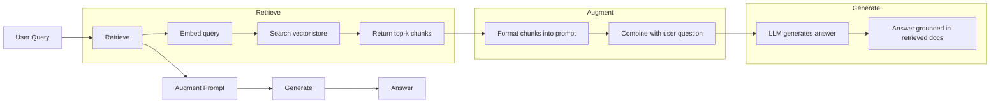
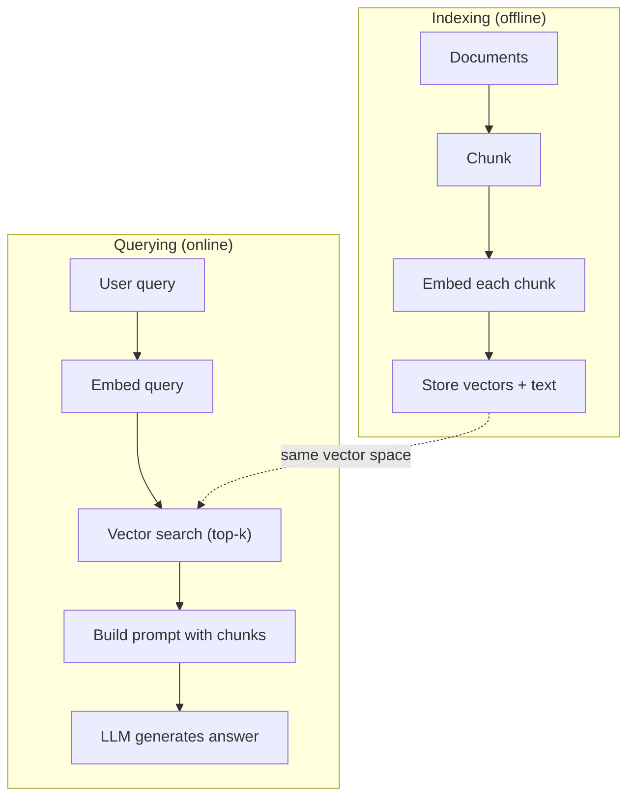

# (RAG) (الجيول المُعززة بالانتعاش)

> ماجستيرك في التدريب يعرف كل شيء حتى وقت التدريب. لا يعرف أي شيء عن وثائق شركتك، قاعدة التعليمات الخاصة بك، أو ملاحظات الاجتماع الأسبوع الماضي. يقوم RAG بحل هذا عن طريق استرداد الوثائق ذات الصلة ووضعها في المشاركة. إنه النمط الأكثر انتشارًا في الإنتاج الذكاء الاصطناعي. إذا قمت ببناء شيء من هذه الدورة، قم ببناء خط أنابيب RAG.

**Type:** Build
**Languages:** Python
**Prerequisites:** Phase 10 (LLMs from Scratch), Phase 11 Lessons 01-05
**Time:** ~90 minutes
**Related:**المرحلة 5 · 23 (استراتيجيات التجزئة لـ RAG) للخوارزميات الستة التي تقوم بتجزئة المعلومات وعندما تفوز كل منها. المرحلة 5 · 22 (إمبيدينغ موديلز غوص عميق) لانتخاب المُضخم. المرحلة 11 · 07 (RAG المتقدمة) للبحث الهجري وإعادة التصنيف وتحويل المستطلاع.

## أهداف التعلم

- بناء خط أنابيب RAG كامل: تحميل الوثائق، التجزئة، الإضافة، تخزين المتجهات، الاستعراض، وتوليدها
- تنفيذ البحث الترقمي باستخدام قاعدة بيانات متجهة (ChromaDB أو FAISS أو Pinecone) مع الترتيب المناسب
- شرح لماذا يفضل استخدام RAG على التكيف الدقيق للتطبيقات القائمة على المعرفة (تكلفة، طازجة، إصدار)
- تقييم جودة المجموعة باستخدام مقاييس الاسترداد (الدقة والإستدعاء) ومقياسات التوليد (الوفاء والساهة)

## المشكلة

تقوم ببناء روبوت دردشة لشركتك. يسأل عميل "ما هي سياسة استرداد المبلغ للخطط المؤسسية؟" يستجيب LLM بإجابة عامة حول سياسات استرداد SaaS النموذجية. السياسة الفعلية ، مدفونة في ويكي داخلي من 200 صفحة ، تقول أن عملاء المؤسسات يحصلون على نافذة 60 يومًا مع استردادات معدل. لم يرى LLM هذا الوثيقة قط. لا يمكنه معرفة ما لم يتم تدريبه عليه.

التنسيق الدقيق هو حل واحد. خذ ماجستير في الأعمال، تدرب عليه على وثائقك الداخلية، ونشر النموذج المحديث. هذا يعمل ولكن لديه مشاكل خطيرة. التنسيق الدقيق يكلف الآلاف من الدولارات في الحساب. يصبح النموذج قديم في اللحظة التي يتغير فيها مستند. ليس لديك طريقة لمعرفة من أي مصدر استخرج النموذج. وإذا حصلت الشركة على خط منتج آخر الشهر المقبل، تقوم بتنسيق الدقيق مرة أخرى.

(راج) هو الحل الآخر اترك النموذج دون ملامسة عندما يظهر سؤال، ابحث في مخزن الوثائق عن المقاطع ذات الصلة، ورسمها في المشاركة قبل السؤال، ودع النموذج يجيب باستخدام تلك المقاطع كسياق. يمكن تحديث مخزن الوثائق في دقائق. يمكنك أن ترى بالضبط ما هي الوثائق التي تم استردادها. النموذج نفسه لا يتغير أبداً هذا هو السبب في أن RAG هو النمط المهيمن في الإنتاج: هو أرخص، أكثر طفرة، أكثر مراجعة، ويعمل مع أي ماجستير.

## المفهوم

### نمط RAG

النمط كله يناسب في أربعة خطوات:



استفسار -> استرداد -> إضافة إلحاح -> توليد. يتبع كل نظام RAG هذا النمط. الاختلافات بين أنظمة RAG الإنتاج هي في تفاصيل كل خطوة: كيفية تشكيل، كيفية إدراج، كيفية البحث، وكيفية بناء الإرشاد.

### لماذا يُفوق الرق على التنسيق الجيد

| Concern | Fine-tuning | RAG |
|---------|------------|-----|
| Cost | $1,000-$100,000+ per training run | $0.01-$0.10 per query (embedding + LLM) |
| Freshness | Stale until retrained | Updated in minutes by re-indexing docs |
| Auditability | Cannot trace answer to source | Can show exact retrieved passages |
| Hallucination | Still hallucinates freely | Grounded in retrieved documents |
| Data privacy | Training data baked into weights | Documents stay in your vector store |

تغيير التنسيق الدقيق وزن النموذج بشكل دائم. تغيير RAG سياق النموذج مؤقتا. بالنسبة لمعظم التطبيقات، سياق مؤقت هو ما تريد.

الحالة الوحيدة التي يفوز فيها التنسيق الدقيق: عندما تحتاج إلى نموذج لتمثيل نمط أو نغمة أو نمط معين لا يمكن تحقيقه عن طريق الإستغناء وحده.

### إضافة النماذج

نموذج إضافة يحول النص إلى متجه كثيف. تنتج نصوص مماثلة متجهات قريبة من بعضها البعض في هذا الفضاء العالي الأبعاد. "كيف أعيد تعيين كلمة المرور الخاصة بي؟" و "يجب أن أغير كلمة المرور الخاصة بي" ينتج متجهات متطابقة تقريبًا على الرغم من مشاركة عدد قليل من الكلمات. "الجروة جلست على المصفاة" تنتج متجهًا مختلفًا تمامًا.

نماذج التثبيت المشتركة (تصنيف 2026)  انظر المرحلة 5 · 22 للحصول على تحليل كامل):

| Model | Dimensions | Provider | Notes |
|-------|-----------|----------|-------|
| text-embedding-3-small | 1536 (Matryoshka) | OpenAI | Best price/performance for most use cases |
| text-embedding-3-large | 3072 (Matryoshka) | OpenAI | Higher accuracy, truncatable to 256/512/1024 |
| Gemini Embedding 2 | 3072 (Matryoshka) | Google | Top MTEB retrieval; 8K context |
| voyage-4 | 1024/2048 (Matryoshka) | Voyage AI | Domain variants (code, finance, law) |
| Cohere embed-v4 | 1024 (Matryoshka) | Cohere | Strong multilingual, 128K context |
| BGE-M3 | 1024 (dense + sparse + ColBERT) | BAAI (open-weight) | Three views from one model |
| Qwen3-Embedding | 4096 (Matryoshka) | Alibaba (open-weight) | Top open-weight retrieval score |
| all-MiniLM-L6-v2 | 384 | Open-weight (Sentence Transformers) | Prototyping baseline |

لهذا الدروس، نُبني إضافة بسيطة خاصة بنا باستخدام TF-IDF. ليس لأن TF-IDF هي ما تستخدمه أنظمة الإنتاج، ولكن لأنه يجعل المفهوم ملموساً: النص يدخل، والمتجه يخرج، والنصوص المماثلة تنتج متجهات مماثلة.

### تشابه المتجه

نظرا لمتجهين، كيف تقيسين التشابه؟ ثلاثة خيارات:

**Cosine similarity**: كوسينز الزاوية بين متجهين. يتراوح من -1 (العكس) إلى 1 (وحيد). يتجاهل الحجم، لا يهتم فقط بالاتجاه. هذه هي الافتراض الافتراضي لـ RAG.

```
cosine_sim(a, b) = dot(a, b) / (||a|| * ||b||)
```

**Dot product**: المنتج الداخلي الخام. المتجهات الكبيرة تحصل على درجات أعلى. مفيدة عندما يحمل الحجم المعلومات (قد تكون الوثائق أطول أكثر أهمية).

```
dot(a, b) = sum(a_i * b_i)
```

**L2 (Euclidean) distance**: مسافة خط مستقيم في الفضاء المتجه. مسافة أصغر = أكثر شبيهة. حساسة لفرق الكبيرة.

```
L2(a, b) = sqrt(sum((a_i - b_i)^2))
```

تشابه الكوزين هو المعيار. يتعامل مع المستندات من أطول مختلفة بجد لأنه يطبيع من حيث الحجم. عندما يقول شخص ما "البحث عن المتجهات،" يقصدون تقريبا دائما تشابه الكوزين.

### استراتيجيات التجزئة

المستندات طويلة جداً لتدمجها كمتنقل واحد. قد ينتج PDF من 50 صفحة إدمجًا فظيعًا لأنه يحتوي على عشرات الموضوعات. بدلاً من ذلك، تقوم بتقسيم المستندات إلى قطع وتدمج كل جزء بشكل منفصل.

**Fixed-size chunking**: تقسيم كل رموز N. بسيطة وقابلة للتنبؤ. جزء من 512 رمزا مع 50 رمزا تتداخل يعني الجزء 1 هو رموز 0-511، الجزء 2 هو رموز 462-973، وهلم جرا. التداخل يضمن عدم تقسيم جملة على حدة غير محظوظ.

**Semantic chunking**: تقسيم على الحدود الطبيعية. الفقرات، القسمات، أو العناوين التميز. كل جزء هو وحدة متماسكة من المعنى. أكثر تعقيدا لتنفيذ ولكن ينتج استرداد أفضل.

**Recursive chunking**: حاول تقسيم في الحدود الأكبر أولاً (رؤوس القسم). إذا كان القسم ما زال كبيرًا جدًا، فقسم في حدود الفقرات. إذا كان الفقرة ما زال كبيرة جدًا، فقسم في حدود الجملة. هذا هو نهج LangChain RecursiveCharacterTextSplitter وهو يعمل بشكل جيد في الممارسة العملية.

حجم الجزء مهم أكثر مما يعتقد الناس:

- ضئيلة جداً (64-128 رمزاً): كل قطعة تفتقر إلى السياق. "لقد زاد بنسبة 15% في الربع الماضي" لا يعني شيئاً دون معرفة ما يشير إليه "إنه".
- الكبير جداً (2048 + رموز): كل جزء يغطي مواضيع متعددة، مما يضعف الصلة. عندما تبحث عن بيانات الإيرادات، تحصل على جزء هو 10% عن الإيرادات و 90% عن عدد العاملين.
- نقطة حلوة (256-512 رمزا): سياق كافٍ لتكون ذاتية، ومركزة بما فيه الكفاية لتكون ذات صلة.

معظم أنظمة الإنتاج RAG تستخدم 256-512 قطعة رمزية مع تداخل 50 رمز. توصي إرشادات RAG من Anthropic بهذا النطاق.

### قواعد بيانات المتجهات

بمجرد أن يكون لديك إضافة، تحتاج إلى مكان لتخزينها وتبحث عنها.

| Database | Type | Best for |
|----------|------|----------|
| FAISS | Library (in-process) | Prototyping, small to medium datasets |
| Chroma | Lightweight DB | Local development, small deployments |
| Pinecone | Managed service | Production without ops overhead |
| Weaviate | Open source DB | Self-hosted production |
| pgvector | Postgres extension | Already using Postgres |
| Qdrant | Open source DB | High-performance self-hosted |

لهذا الدروس ، قمنا ببناء متجر متجه بسيط في الذاكرة. فإنه يحتفظ بالمتجهات في قائمة ويقوم باحث عن تشابه الكوسينات القوة الخامة. هذا يعادل FAISS مع مؤشر مسطح. يتناسب إلى ربما 100,000 متجه قبل أن يصبح بطيء. تستخدم أنظمة الإنتاج خوارزميات القريبة القريبة (ANN) مثل HNSW للبحث عن ملايين المتجهات في ملايين الثوان.

### خط الأنابيب الكامل



مرحلة الترتيب يتم تنفيذها مرة واحدة لكل وثيقة (أو عند تحديث الوثائق). مرحلة الاستفسار تمت على كل طلب من المستخدمين. في الإنتاج، قد يعالج الترتيب الملايين من الوثائق على مدار ساعات. يجب أن يستجيب الاستفسار في أقل من ثانية.

### الأرقام الحقيقية

معظم أنظمة RAG الإنتاجية تستخدم هذه المعايير:

- **k = 5 to 10**قطع متقطعة لكل استفسار
- **Chunk size = 256 to 512 tokens**مع تعليق 50 رمز
- **Context budget**: 2500 - 5000 رمز من المحتوى المسترد لكل استفسار
- **Total prompt**: ~ 8,000-16,000 رموز (مواصلة النظام + قطع استرداد + تاريخ المحادثة + استفسار المستخدم)
- **Embedding dimension**: 384-3072 اعتمادا على النموذج
- **Indexing throughput**: 100-1,000 وثيقة في الثانية مع إدخال API
- **Query latency**: 50-200ms للحصول على، 500-3000ms للإنتاج

```figure
rag-chunking
```

## بناءها

### الخطوة الأولى: تحديد الوثائق

```python
def chunk_text(text, chunk_size=200, overlap=50):
    words = text.split()
    chunks = []
    start = 0
    while start < len(words):
        end = start + chunk_size
        chunk = " ".join(words[start:end])
        chunks.append(chunk)
        start += chunk_size - overlap
    return chunks
```

### الخطوة الثانية: إدخال TF-IDF

نُبني وظيفة إضافة بسيطة. TF-IDF (تردد المدة العكسي المقابل المستندية) ليس إضافة عصبية، ولكنه يغير النص إلى متجهات بطريقة تلتقط أهمية الكلمات. الكلمات المتكررة في مستند تحصل على أعلى TF. الكلمات النادرة عبر الجسم تحصل على أعلى IDF. المنتج يعطي متجه حيث الكلمات المهمة المميزة لها قيم عالية.

```python
import math
from collections import Counter

def build_vocabulary(documents):
    vocab = set()
    for doc in documents:
        vocab.update(doc.lower().split())
    return sorted(vocab)

def compute_tf(text, vocab):
    words = text.lower().split()
    count = Counter(words)
    total = len(words)
    return [count.get(word, 0) / total for word in vocab]

def compute_idf(documents, vocab):
    n = len(documents)
    idf = []
    for word in vocab:
        doc_count = sum(1 for doc in documents if word in doc.lower().split())
        idf.append(math.log((n + 1) / (doc_count + 1)) + 1)
    return idf

def tfidf_embed(text, vocab, idf):
    tf = compute_tf(text, vocab)
    return [t * i for t, i in zip(tf, idf)]
```

### الخطوة الثالثة: البحث عن تشابهات الكوزين

```python
def cosine_similarity(a, b):
    dot = sum(x * y for x, y in zip(a, b))
    norm_a = math.sqrt(sum(x * x for x in a))
    norm_b = math.sqrt(sum(x * x for x in b))
    if norm_a == 0 or norm_b == 0:
        return 0.0
    return dot / (norm_a * norm_b)

def search(query_embedding, stored_embeddings, top_k=5):
    scores = []
    for i, emb in enumerate(stored_embeddings):
        sim = cosine_similarity(query_embedding, emb)
        scores.append((i, sim))
    scores.sort(key=lambda x: x[1], reverse=True)
    return scores[:top_k]
```

### الخطوة الرابعة: بناء سريع

هذا هو المكان الذي يحدث فيه "المزيد" في RAG. خذ القطع المكتسبة، وفرمجها في عرض، واطلب من ماجستير في العلوم الإجابة بناءً على السياق المقدم.

```python
def build_rag_prompt(query, retrieved_chunks):
    context = "\n\n---\n\n".join(
        f"[Source {i+1}]\n{chunk}"
        for i, chunk in enumerate(retrieved_chunks)
    )
    return f"""Answer the question based ONLY on the following context.
If the context doesn't contain enough information, say "I don't have enough information to answer that."

Context:
{context}

Question: {query}

Answer:"""
```

### الخطوة 5: خط أنابيب RAG الكامل

```python
class RAGPipeline:
    def __init__(self):
        self.chunks = []
        self.embeddings = []
        self.vocab = []
        self.idf = []

    def index(self, documents):
        all_chunks = []
        for doc in documents:
            all_chunks.extend(chunk_text(doc))
        self.chunks = all_chunks
        self.vocab = build_vocabulary(all_chunks)
        self.idf = compute_idf(all_chunks, self.vocab)
        self.embeddings = [
            tfidf_embed(chunk, self.vocab, self.idf)
            for chunk in all_chunks
        ]

    def query(self, question, top_k=5):
        query_emb = tfidf_embed(question, self.vocab, self.idf)
        results = search(query_emb, self.embeddings, top_k)
        retrieved = [(self.chunks[i], score) for i, score in results]
        prompt = build_rag_prompt(
            question, [chunk for chunk, _ in retrieved]
        )
        return prompt, retrieved
```

### الخطوة 6: توليد (مثبت)

في الإنتاج، هذا هو المكان الذي تسميه API LLM. لهذا الدروس، نقوم بتحاكي الجيل عن طريق استخراج الجملة الأكثر ملاءمة من السياق المسترد.

```python
def simple_generate(prompt, retrieved_chunks):
    query_words = set(prompt.lower().split("question:")[-1].split())
    best_sentence = ""
    best_score = 0
    for chunk in retrieved_chunks:
        for sentence in chunk.split("."):
            sentence = sentence.strip()
            if not sentence:
                continue
            words = set(sentence.lower().split())
            overlap = len(query_words & words)
            if overlap > best_score:
                best_score = overlap
                best_sentence = sentence
    return best_sentence if best_sentence else "I don't have enough information."
```

## استخدمها

مع نموذج إضافة حقيقي و ماجستير في العلوم، بالكاد يتغير الرمز:

```python
from openai import OpenAI

client = OpenAI()

def embed(text):
    response = client.embeddings.create(
        model="text-embedding-3-small",
        input=text
    )
    return response.data[0].embedding

def generate(prompt):
    response = client.chat.completions.create(
        model="gpt-4o-mini",
        messages=[{"role": "user", "content": prompt}],
        temperature=0
    )
    return response.choices[0].message.content
```

أو مع " الأنثروبيك "

```python
import anthropic

client = anthropic.Anthropic()

def generate(prompt):
    response = client.messages.create(
        model="claude-sonnet-5",
        max_tokens=1024,
        messages=[{"role": "user", "content": prompt}]
    )
    return response.content[0].text
```

خط الأنابيب هو نفسه. تغيير وظيفة الإضافة. تغيير وظيفة توليد. منطق الاستخدام، التجزئة، بناء السرعة -- كل نفسها بغض النظر عن النموذج الذي تستخدم.

لخزن المتجهات على نطاق واسع، قم باستبدال البحث عن القوة الخامة بمدينة بيانات متجهات مناسبة:

```python
import chromadb

client = chromadb.Client()
collection = client.create_collection("my_docs")

collection.add(
    documents=chunks,
    ids=[f"chunk_{i}" for i in range(len(chunks))]
)

results = collection.query(
    query_texts=["What is the refund policy?"],
    n_results=5
)
```

تقوم Chroma بمعالجة الإضافة داخلياً (إنها تستخدم كل MiniLM-L6-v2 بشكل افتراضي) وتخزين المتجهات في قاعدة بيانات محلية. نفس النمط، مختلفة التبني.

## أرسله

هذا الدرس ينتج عن:
- `outputs/prompt-rag-architect.md`-- طلب لتصميم أنظمة RAG لحالات الاستخدام المحددة
- `outputs/skill-rag-pipeline.md`-- مهارة تعلّم العملاء كيفية بناء وتحليل خط الأنابيب RAG

## التمارين

1. استبدل إدخالات TF-IDF بنهج بسيط من كلمات (المركز الثنائي: 1 إذا كان الكلمة موجودة، 0 إذا لم تكن موجودة). مقارنة جودة الاستخدام على المستندات العينة. يجب أن تفوق TF-IDF لأنها تراجعت الكلمات النادرة أعلى.

2. تجربة مع حجم الجزء: حاول 50، 100، 200، و 500 كلمة على نفس مجموعة الوثائق. لكل حجم، قم بتشغيل نفس 5 استفسارات و احتساب عدد العائدات التي تعود إلى الجزء ذي الصلة في الجزء العلوي 3.

3. إضافة البيانات المعدنية لكل جزء (اسم الوثيقة المصدرة ، موقع الجزء). تعديل القالب المطلوب لتشمل إصدار المصدر حتى يذكر الهيئة المصدر.

4. تنفيذ تقييم بسيط: مع إعطاء 10 أزواج من الأسئلة والإجابات، قم بتشغيل كل سؤال من خلال خط أنابيب RAG، وقياس مدى نسبة المئات من الكسوف التي تم استردادها تحتوي على الإجابة. هذا هو استرداد الاسترداد عند k.

5. بناء خط أنابيب RAG واعية للحوار: الحفاظ على تاريخ من 3 الصفقات الأخيرة وإدراجها في المشاركة إلى جانب القطاعات التي تم استردادها. اختبار مع أسئلة متابعة مثل "ماذا عن الشركة؟" بعد طرح الأسعار.

## الشروط الرئيسية

| Term | What people say | What it actually means |
|------|----------------|----------------------|
| RAG | "AI that reads your docs" | Retrieve relevant documents, paste them into the prompt, and generate an answer grounded in those documents |
| Embedding | "Convert text to numbers" | A dense vector representation of text where similar meanings produce similar vectors |
| Vector database | "Search engine for AI" | A data store optimized for storing vectors and finding the nearest neighbors by similarity |
| Chunking | "Split docs into pieces" | Breaking documents into smaller segments (typically 256-512 tokens) so each can be embedded and retrieved independently |
| Cosine similarity | "How similar are two vectors" | The cosine of the angle between two vectors; 1 = identical direction, 0 = orthogonal, -1 = opposite |
| Top-k retrieval | "Get the k best matches" | Return the k most similar chunks to the query from the vector store |
| Context window | "How much text the LLM can see" | The maximum number of tokens the LLM can process in a single request; retrieved chunks must fit within this |
| Augmented generation | "Answer using given context" | Generating a response using retrieved documents as context rather than relying solely on trained knowledge |
| TF-IDF | "Word importance scoring" | Term Frequency times Inverse Document Frequency; weights words by how distinctive they are within a corpus |
| Indexing | "Preparing docs for search" | The offline process of chunking, embedding, and storing documents so they can be searched at query time |

## المزيد من القراءة

- لويس وآخرون، "الإنتاج المُتزايد من أجل مهام النمط النووي المكثفة المعرفة" (2020) -- ورقة RAG الأصلية من بحث Facebook AI التي شكلت نمط الاسترداد ثم إنتاج
- وثائق RAG من Anthropic (docs.anthropic.com) -- إرشادات عملية لأحجام القطعة، والبناء السريع، والتقييم
- مركز التعلم بينيكون، "ما هو RAG؟" -- تفسيرات بصرية واضحة لخط أنابيب RAG مع اعتبارات الإنتاج
- جملة-BERT: Reimers & Gurevych (2019) -- ورقة وراء نماذج إدمج كل MiniLM، التي تظهر كيفية تدريب المرموزين الثنائيين للتشابه التمويلي
- [Karpukhin et al., "Dense Passage Retrieval for Open-Domain Question Answering" (EMNLP 2020)](https://arxiv.org/abs/2004.04906)-- ورقة DPR التي أثبتت كثافة إعادة إعادة إعادة التشفير ثنائي المرموزات تفوق BM25 على المجال المفتوح QA ووضعت النمط لمتساعدات RAG الحديثة.
- [LlamaIndex High-Level Concepts](https://docs.llamaindex.ai/en/stable/getting_started/concepts.html)-- المفاهيم الرئيسية التي يجب أن تعرفها عند بناء خطوط أنابيب RAG: محملات البيانات، مفصلات العقد، مؤشرات، استرداد، مختللي الاستجابة.
- [LangChain RAG tutorial](https://python.langchain.com/docs/tutorials/rag/)-- أوركستراتر النكهة المعاكسة؛ سلسلة من الأدوات التشغيلية نظرة نفس استرداد ثم توليد نمط.
