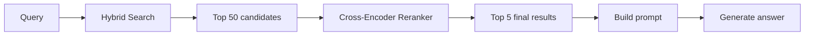
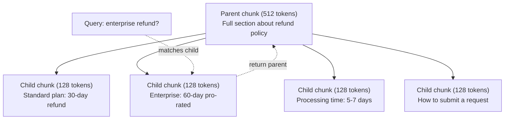
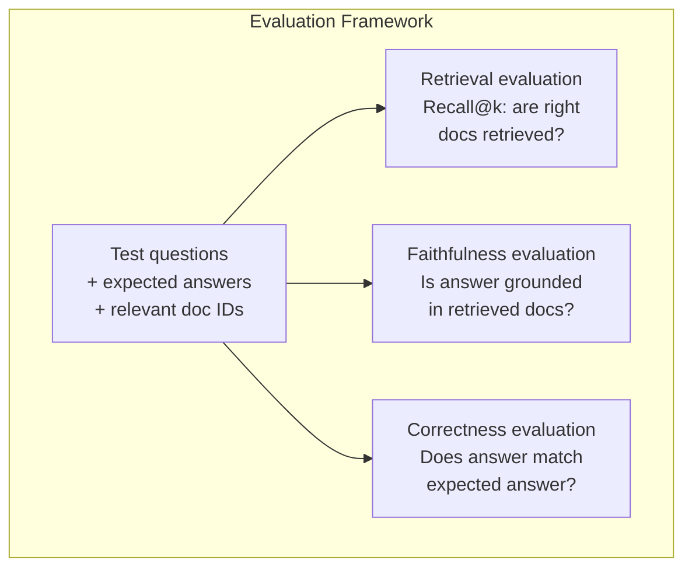

# RAG المتقدمة (تقليل، إعادة ترتيب، بحث هجين)

> يقوم RAG الأساسي باسترداد الجزء العلوي الأكثر تشابهًا. هذا يعمل على الأسئلة البسيطة. إنه ينفصل عن التفكير متعدد المكالمات، والسؤال الغامض، والجماعات الكبيرة. RAG المتقدمة هو الفرق بين عرض عرض يعمل على 10 وثائق ونظام يعمل على 10 ملايين.

**Type:** Build
**Languages:** Python
**Prerequisites:** Phase 11, Lesson 06 (RAG)
**Time:** ~90 minutes
**Related:**المرحلة 5 · 23 (استراتيجيات التجزئة لـ RAG) تغطي جميع خوارزميات التجزئة الستة  التجاوبية، والمعنوية، والجملة، والوثيقة الأولي، والتجزئة المتأخرة، والحصول على السياق  مع المعايير الفيكتارا / الأنثروبية. يستند هذا الدروس على الأعلى: البحث الهجري، وإعادة التصنيف، وتحويل المسائل.

## أهداف التعلم

- تنفيذ استراتيجيات متقدمة لتحديد المواد (الترجمانية والتكريرية والوالدين والطفل) التي تحافظ على هيكل الوثائق والسياق
- بناء خط أنابيب بحث هجين يجمع بين مطابقة كلمات الرئيسية BM25 مع البحث المتجهة للنطقية وإعادة ترتيب المرموزات المتقاطعة
- تطبيق تقنيات تحويل الاستفسارات (HyDE، متعددة الاستفسارات، خطوة إلى الوراء) لتحسين الاسترداد على الأسئلة المزجة أو المعقدة
- تشخيص وإصلاح أخطاء RAG الشائعة: استرداد جزء خاطئ، الإجابة غير في سياق، تفكيك التفكير متعدد المكالمات

## المشكلة

لقد بنيت خط أنابيب RAG في الدروس 06، يعمل على الأسئلة البسيطة على مجموعة صغيرة. الآن جرب هذه:

**Ambiguous query**: "ما كان الإيرادات الربع الماضي؟" البحث الدلالي يعود قطع عن استراتيجية الإيرادات، وتوقعات الإيرادات، ومفكرات المدير المالي على نمو الإيرادات. كل شيء مماثل بشكل معنوي للكلمة "إيرادات". لا يوجد أي منها يحتوي على العدد الفعلي. القسم الصحيح يقول "إيرادات الدلالي"$47.2M in Q3 2025" but uses the word "earnings" instead of "revenue." The embedding model thinks "revenue strategy" is closer to the query than "Q3 earnings were $47.2 م. "

**Multi-hop question**: "أيه فريق كان لديه أكبر تحسن في درجة رضا العملاء؟" هذا يتطلب العثور على درجات رضا لكل فريق، مقارنة بينها، وتحديد أقصى حد. لا يوجد جزء واحد يحتوي على الإجابة. يتم توزيع المعلومات على تقارير الفريق.

**Large corpus problem**لديك 2 مليون قطعة. الإجابة الصحيحة في الجزء #1,847,293. استردادك في 5 أعلى سحب القطعة # 14, #89,201, #1,200,000, #44, و #901,333. قريبة في مساحة التضمين، ولكن لا تحتوي على الإجابة. على هذه المقياسة، تقريبي قريب البحث يقدم خطأ كافيا أن النتائج ذات الصلة يتم دفع خارج أعلى-ك.

فشل RAG الأساسي لأن شبكة المتجهات ليست نفسها ذات الصلة. يمكن أن تكون جزء مماثلة من الناحية الدلوية إلى سؤال دون أن تكون مفيدة للإجابة عليه. تعالج RAG المتقدمة هذا الأمر باستخدام أربع تقنيات: البحث الهجري (إضافة مطابقة الكلمات الرئيسية) ، وإعادة التصنيف (سجل المرشحين بعناية أكبر) ، وتحويل الاستفسار (صلاح الاستفسار قبل البحث) ، والتحقيق الأفضل (الالتقاط عند الحجم الصحيح).

## المفهوم

### البحث الهجري: تعبير + كلمة رئيسية

البحث الدلالي (تشابه المتجه) جيد في فهم المعنى. "كيف يمكنني إلغاء الاشتراك الخاص بي؟" يطابق "خطوات لإنهاء خطتك" على الرغم من أنهم لا يشتركون كلمات. لكنه يفتقد التطابقات الدقيقة. "رمز الخطأ E-4021" قد لا يطابق جزء يحتوي على "E-4021" إذا كان نموذج التضمين يعالج ذلك كضوضاء.

بحث الكلمات الرئيسية (BM25) هو العكس. إنه يتفوق في المقابلة الدقيقة. "E-4021" يطابق تماما. ولكن "إلغاء الاشتراك الخاص بي" يعود صفر نتائج إذا كان الوثيقة تقول "إنهاء خطتك".

البحث الهجري يدير كل منهما، ثم يدمج النتائج.

**BM25**(Best Matching 25) هو خوارزمية البحث القياسية عن الكلمات الرئيسية. لقد كان العمود الفقري لمحركات البحث منذ التسعينات. الصيغة:

```
BM25(q, d) = sum over terms t in q:
    IDF(t) * (tf(t,d) * (k1 + 1)) / (tf(t,d) + k1 * (1 - b + b * |d| / avgdl))
```

حيث tf(t،d) هو تردد المفهوم من t في الوثيقة d، IDF(t) هو تردد الوثيقة العكسية، و \ \ \ \ \ \ \ \ \ \ \ \ \ \ \ \ \ \ \ \ \ \ \ \ \ \ \ \ \ \ \ \ \ \ \ \ \ \ \ \ \ \ \ \ \ \ \ \ \ \ \ \ \ \ \ \ \ \ \ \ \ \ \ \ \ \ \ \ \ \ \ \ \ \ \ \ \ \ \ \ \ \ \ \ \ \ \ \ \ \ \ \ \ \ \ \ \ \ \ \ \ \ \ \ \ \ \ \ \ \ \ \ \ \ \ \ \ \ \ \ \ \ \ \ \ \ \ \ \ \ \ \ \ \ \ \ \ \ \ \ \ \ \ \ \ \ \ \ \ \ \ \ \ \ \ \ \ \ \ \ \ \ \ \ \ \ \ \ \ \ \ \ \ \ \ \ \ \ \ \ \ \ \ \ \ \ \ \ \ \ \ \ \ \ \ \ \ \ \ \ \ \ \ \ \ \ \ \ \ \ \ \ \ \ \ \ \ \ \ \ \ \ \ \ \ \ \ \ \ \ \ \ \ \ \ \ \ \ \ \ \ \ \ \ \ \ \ \ \ \ \ \ \ \ \ \ \ \ \ \ \ \ \ \ \ \ \ \ \ \ \ \ \ \ \ \ \ \ \ \ \ \ \ \ \ \ \ \ \ \ \ \ \ \ \ \ \ \ \ \ \ \ \ \ \ \ \ \ \ \ \ \ \ \ \ \ \ \ \ \ \ \ \ \ \ \ \ \ \ \ \ \ \ \ \ \ \ \ \ \ \ \ \ \ \ \ \ \ \ \ \ \ \ \ \ \ \ \ \ \ \ \ \ \ \ \ \ \ \ \ \ \ \ \ \ \ \ \ \ \ \ \ \ \ \ \ \ \ \ \ \ \ \ \ \ \ \ \ \ \ \ \ \ \ \ \ \ \ \ \ \ \ \ \ \ \ \ \ \ \ \ \ \ \ \ \ \ \ \ \ \ \ \ \ \ \ \ \ \ \ \ \ \ \ \ \ \ \ \ \ \ \ \ \ \ \ \ \ \ \ \ \ \ \ \ \ \ \ \ \ \

وبشكل واضح: يُسجل BM25 الوثائق أعلى عندما تحتوي على شروط استفسار (خاصة النادرة) ، ولكن مع عائدات متناقصة للشروط المتكررة. الوثيقة التي تحتوي على كلمة "إيرادات" 50 مرة ليست 50 مرة أكثر أهمية من واحدة معها مرة واحدة.

### الاندماج المتبادل للدرجة (RRF)

لديك قائمتين مرتبة: واحدة من البحث عن المتجهات، واحدة من BM25. كيف تجمع بينهم؟ الاندماج المتبادل من الرتب هو النهج القياسي.

```
RRF_score(d) = sum over rankings R:
    1 / (k + rank_R(d))
```

حيث k ثابت (عادة 60) الذي يمنع النتيجة ذات التصنيف الأعلى من السيطرة.

وثيقة مرتبة رقم 1 في البحث عن المتجهات والخامسة في BM25 تحصل: 1/(60+1) + 1/(60+5) = 0.0164 + 0.0154 = 0.0318

وثيقة مرتبة # 3 في البحث عن المتجهات وال # 2 في BM25 تحصل: 1/(60 + 3) + 1/(60 + 2) = 0.0159 + 0.0161 = 0.0320

يوازن RRF بشكل طبيعي الإشارات الثنائية. يحصل مستند يرتب في المرتبة العالية في كلتا القوائم على أفضل درجة. يحصل مستند يرتب في المرتبة الأولى في قائمة واحدة لكنه غائب من الأخرى على درجة معتدلة. هذا قوي لأنه يستخدم صفوف ، وليس درجات خامة ، لذلك لا يهم الاختلافات في توزيع النقاط بين النظمين.

### إعادة التصنيف

الاسترداد (سواء كان متجهًا أو كلمة رئيسية أو هجينة) سريعًا ولكنه غير دقيق. يستخدم مُرموزًا ثنائيًا: يتم إدخال الاستفسار وكل مستند بشكل مستقل ، ثم مقارنة. يتم حساب الإدخالات مرة واحدة وتخزينها. هذا يصل إلى ملايين الوثائق.

يستخدم الترتيبات الترتيبية مُرموزات متعددة: يتم إدخال الاستفسار وثيقة مرشحة معاً في نموذج يخرج نتيجة ذات صلة. يرى النموذج كل من النصين في وقت واحد ويمكنه التقاط تفاعلات دقيقة بينهما. يمكن للمرموزة المتقاطعة فهم أن "ما كانت أرباح الربع الثالث؟" ذات صلة عالية مع قطعة تحتوي على "47.2 مليون دولار في الربع الثالث" حتى لو غاب المرموز الثنائي عن الاتصال.

التنازل: إنّ المُشفّرات المتقاطعة أبطأ 100-1000 مرة من المُشفّرات الثنائية لأنها تعالج زوج المُسائل والوثائق بشكل مشترك. لا يمكنك حساب درجات المُشفّرات المتقاطعة من قبل لمليون وثيقة. الحل: استرداد مجموعة مرشحات أكبر (أعلى 50 من البحث الهجين) ، ثم إعادة ترتيبها مع مُشفّر متقاطع للحصول على المُشفّرات النهائية الخامسة.



نماذج إعادة التصنيف المشتركة (2026 lineup):
- ترتيب التوافق 3.5: API المدارة، متعددة اللغات، أفضل مكاسب في الاستدعاء على الجسم المختلط
- تعديل رتبة الرحلة-2.5: API المدارة، أدنى تأخر من خيارات المضيفة
- جينا-رينكر-v2 متعددة اللغات: مفتوحة الوزن، أكثر من 100 لغة
- bge-reanker-v2-m3: وزن مفتوح، نقطة أساس قوية
- كراس-كودر/ms-ماركو-MiniLM-L-6-v2: مفتوح الوزن، يعمل على جهاز CPU للعمل على النماذج الأولية
- ColBERTv2 / Jina-ColBERT-v2: متواصلات متأخرة التفاعل المتعددة المتجهات  O(شعارات) ليس O(دوق) في وقت تسجيل النقاط

### التحويل المطلوب

في بعض الأحيان ليست المشكلة استرداد ولكن السؤال نفسه. "ما كان ذلك الشيء حول تغيير السياسة الجديدة؟" هو سؤال بحث رهيب. لا يحتوي على مصطلحات محددة. التضمين غامض. لا يمكن لأي نظام استرداد العثور على الوثائق الصحيحة من هذا.

**Query rewriting**: إعادة صياغة استفسار المستخدم إلى استفسار بحث أفضل. يمكن أن يقوم ماجستير في العلوم التدريبية بهذا:

```
User: "What was that thing about the new policy change?"
Rewritten: "Recent policy changes and updates"
```

**HyDE (Hypothetical Document Embeddings)**: بدلاً من البحث مع السؤال، تولد إجابة افتراضية، وضعت ذلك، والبحث عن وثائق حقيقية مماثلة.

```
Query: "What is the refund policy for enterprise?"
Hypothetical answer: "Enterprise customers are eligible for a full refund
within 60 days of purchase. Refunds are pro-rated based on the remaining
subscription period and processed within 5-7 business days."
```

تضمين الإجابة الفرضية والبحث عن وثائق حقيقية مشابهة لها. الحدس: الإجابة الفرضية تعيش أقرب في إضافة مساحة إلى الإجابة الحقيقية من السؤال الأصلي. الأسئلة والجواب لها هيكلات لغوية مختلفة. من خلال إنشاء الإجابة الفرضية، تقوم بث الفجوة بين "مساحة السؤال" و "مساحة الإجابة" في الإضافة.

يضيف HyDE مكالمة LLM واحدة قبل الاستعلام. وهذا يزيد من التأخير بنسبة 500-2000ms. يستحق ذلك عندما تكون جودة الاستعلام ضعيفة على استفسارات خامة.

### التشويش بين الوالدين والأطفال

تفرض التجزئة القياسية تنازلًا: قطع صغيرة للحصول على استرداد دقيق، قطع كبيرة لمستوى كاف. تُزيل التجزئة بين الوالدين والأطفال هذا التنازل.

إدراج قطع صغيرة (128 رمزا) لاسترداد. عندما يتم استرداد جزء صغير ، ارجع جزءه الأولي (512 رمزا) للطلب. يطابق الجزء الصغير البحث بدقة. الجزء الأولي يوفر سياقًا كافياً لشركة التدريب القانوني لتوليد إجابة جيدة.



السؤال "استرداد الشركات؟" يطابق جزء الطفل C2 بدقة. ولكن الإستعلام يتلقى جزء الأب كامل P، والذي يتضمن السياق المحيط حول وقت المعالجة وعملية الإرسال.

### تصفية البيانات المعدنية

قبل تشغيل البحث المتجه للنقل، قم بتصفية الجسم حسب البيانات المعدنية: التاريخ، المصدر، الفئة، المؤلف، اللغة. وهذا يقلل من مساحة البحث ويمنع النتائج غير ذات الصلة.

"ما الذي تغير في سياسة الأمن الشهر الماضي؟" يجب أن تبحث فقط في الوثائق من الـ 30 يوما الماضية في فئة الأمن. بدون تصفية البيانات المعدنية، تبحث في الكوربوس بأكمله وربما تستعيد وثيقة أمن عمرها سنتين مماثلة من الناحية الدلوية.

تخزين أنظمة RAG الإنتاج البيانات المعدنية جنبا إلى جنب مع كل جزء: وثيقة المصدر، تاريخ الابتكار، الفئة، المؤلف، النسخة. تقوم قواعد البيانات المتقاطعة بتسجيل البيانات المعدنية قبل البحث عن التشابه، وهو أمر حاسم للاداء على نطاق واسع.

### التقييم

لقد بنيت نظام "راج" كيف تعرف إن كان يعمل؟

**Retrieval relevance (Recall@k)**: لسلسلة من الأسئلة الاختبارية مع الوثائق ذات الصلة المعروفة، ما هو النسبة المئوية من الوثائق ذات الصلة التي تظهر في نتائج top-k؟ إذا كان الإجابة على سؤال في الجزء #47، هل الجزء #47 تظهر في top-5؟

**Faithfulness**إذا كانت الأجزاء المكتسبة تقول "فندوق استرداد 60 يوما" والنموذج يقول "فندوق استرداد 90 يوما"، فهذا فشل في الوفاء. النموذج الهلوسة على الرغم من وجود السياق الصحيح.

**Answer correctness**: هل الإجابة المولدة تتطابق مع الإجابة المتوقعة؟ هذه هي المقياسة من نهاية إلى نهاية.

فحص بسيط للصداقية: خذ كل ادعاء في الجواب المولد وتحقق من أنه يظهر (في المحتوى) في الأجزاء المكتسبة. إذا كانت الجواب تحتوي على حقيقة ليست في أي جزء من الأجزاء المكتسبة، فمن المحتمل أن تكون الهلوسة.



```figure
agentic-rag-loop
```

## بناءها

### الخطوة الأولى: تنفيذ BM25

```python
import math
from collections import Counter

class BM25:
    def __init__(self, k1=1.2, b=0.75):
        self.k1 = k1
        self.b = b
        self.docs = []
        self.doc_lengths = []
        self.avg_dl = 0
        self.doc_freqs = {}
        self.n_docs = 0

    def index(self, documents):
        self.docs = documents
        self.n_docs = len(documents)
        self.doc_lengths = []
        self.doc_freqs = {}

        for doc in documents:
            words = doc.lower().split()
            self.doc_lengths.append(len(words))
            unique_words = set(words)
            for word in unique_words:
                self.doc_freqs[word] = self.doc_freqs.get(word, 0) + 1

        self.avg_dl = sum(self.doc_lengths) / self.n_docs if self.n_docs else 1

    def score(self, query, doc_idx):
        query_words = query.lower().split()
        doc_words = self.docs[doc_idx].lower().split()
        doc_len = self.doc_lengths[doc_idx]
        word_counts = Counter(doc_words)
        score = 0.0

        for term in query_words:
            if term not in word_counts:
                continue
            tf = word_counts[term]
            df = self.doc_freqs.get(term, 0)
            idf = math.log((self.n_docs - df + 0.5) / (df + 0.5) + 1)
            numerator = tf * (self.k1 + 1)
            denominator = tf + self.k1 * (1 - self.b + self.b * doc_len / self.avg_dl)
            score += idf * numerator / denominator

        return score

    def search(self, query, top_k=10):
        scores = [(i, self.score(query, i)) for i in range(self.n_docs)]
        scores.sort(key=lambda x: x[1], reverse=True)
        return scores[:top_k]
```

### الخطوة الثانية: الاندماج المتبادل

```python
def reciprocal_rank_fusion(ranked_lists, k=60):
    scores = {}
    for ranked_list in ranked_lists:
        for rank, (doc_id, _) in enumerate(ranked_list):
            if doc_id not in scores:
                scores[doc_id] = 0.0
            scores[doc_id] += 1.0 / (k + rank + 1)
    fused = sorted(scores.items(), key=lambda x: x[1], reverse=True)
    return fused
```

### الخطوة الثالثة: خط أنابيب البحث الهجري

```python
def hybrid_search(query, chunks, vector_embeddings, vocab, idf, bm25_index, top_k=5, fusion_k=60):
    query_emb = tfidf_embed(query, vocab, idf)
    vector_results = search(query_emb, vector_embeddings, top_k=top_k * 3)
    bm25_results = bm25_index.search(query, top_k=top_k * 3)
    fused = reciprocal_rank_fusion([vector_results, bm25_results], k=fusion_k)
    return fused[:top_k]
```

### الخطوة الرابعة: إعادة ترتيب البنود

في الإنتاج، ستستخدم نموذج التشفير المتقاطع. هنا نُبني رينكر يسجل مدى صلة الوثيقة المطلوبة باستخدام التداخل بين الكلمات، أهمية المصطلحات، وتطابق العبارات.

```python
def rerank(query, candidates, chunks):
    query_words = set(query.lower().split())
    stop_words = {"the", "a", "an", "is", "are", "was", "were", "what", "how",
                  "why", "when", "where", "do", "does", "for", "of", "in", "to",
                  "and", "or", "on", "at", "by", "it", "its", "this", "that",
                  "with", "from", "be", "has", "have", "had", "not", "but"}
    query_terms = query_words - stop_words

    scored = []
    for doc_id, initial_score in candidates:
        chunk = chunks[doc_id].lower()
        chunk_words = set(chunk.split())

        term_overlap = len(query_terms & chunk_words)

        query_bigrams = set()
        q_list = [w for w in query.lower().split() if w not in stop_words]
        for i in range(len(q_list) - 1):
            query_bigrams.add(q_list[i] + " " + q_list[i + 1])
        bigram_matches = sum(1 for bg in query_bigrams if bg in chunk)

        position_boost = 0
        for term in query_terms:
            pos = chunk.find(term)
            if pos != -1 and pos < len(chunk) // 3:
                position_boost += 0.5

        rerank_score = (
            term_overlap * 1.0
            + bigram_matches * 2.0
            + position_boost
            + initial_score * 5.0
        )
        scored.append((doc_id, rerank_score))

    scored.sort(key=lambda x: x[1], reverse=True)
    return scored
```

### الخطوة 5: HyDE (التركيطات المفترضة في الوثيقة)

```python
def hyde_generate_hypothesis(query):
    templates = {
        "what": "The answer to '{query}' is as follows: Based on our documentation, {topic} involves specific policies and procedures that define how the process works.",
        "how": "To address '{query}': The process involves several steps. First, you need to initiate the request. Then, the system processes it according to the defined rules.",
        "default": "Regarding '{query}': Our records indicate specific details and policies related to this topic that provide a comprehensive answer."
    }
    query_lower = query.lower()
    if query_lower.startswith("what"):
        template = templates["what"]
    elif query_lower.startswith("how"):
        template = templates["how"]
    else:
        template = templates["default"]

    topic_words = [w for w in query.lower().split()
                   if w not in {"what", "is", "the", "how", "do", "does", "a", "an",
                                "for", "of", "to", "in", "on", "at", "by", "and", "or"}]
    topic = " ".join(topic_words) if topic_words else "this topic"

    return template.format(query=query, topic=topic)


def hyde_search(query, chunks, vector_embeddings, vocab, idf, top_k=5):
    hypothesis = hyde_generate_hypothesis(query)
    hypothesis_emb = tfidf_embed(hypothesis, vocab, idf)
    results = search(hypothesis_emb, vector_embeddings, top_k)
    return results, hypothesis
```

### الخطوة السادسة: التشغيل بين الوالدين والأطفال

```python
def create_parent_child_chunks(text, parent_size=200, child_size=50):
    words = text.split()
    parents = []
    children = []
    child_to_parent = {}

    parent_idx = 0
    start = 0
    while start < len(words):
        parent_end = min(start + parent_size, len(words))
        parent_text = " ".join(words[start:parent_end])
        parents.append(parent_text)

        child_start = start
        while child_start < parent_end:
            child_end = min(child_start + child_size, parent_end)
            child_text = " ".join(words[child_start:child_end])
            child_idx = len(children)
            children.append(child_text)
            child_to_parent[child_idx] = parent_idx
            child_start += child_size

        parent_idx += 1
        start += parent_size

    return parents, children, child_to_parent
```

### الخطوة السابعة: تقييم الوفاء

```python
def evaluate_faithfulness(answer, retrieved_chunks):
    answer_sentences = [s.strip() for s in answer.split(".") if len(s.strip()) > 10]
    if not answer_sentences:
        return 1.0, []

    grounded = 0
    ungrounded = []
    context = " ".join(retrieved_chunks).lower()

    for sentence in answer_sentences:
        words = set(sentence.lower().split())
        stop_words = {"the", "a", "an", "is", "are", "was", "were", "and", "or",
                      "to", "of", "in", "for", "on", "at", "by", "it", "this", "that"}
        content_words = words - stop_words
        if not content_words:
            grounded += 1
            continue

        matched = sum(1 for w in content_words if w in context)
        ratio = matched / len(content_words) if content_words else 0

        if ratio >= 0.5:
            grounded += 1
        else:
            ungrounded.append(sentence)

    score = grounded / len(answer_sentences) if answer_sentences else 1.0
    return score, ungrounded


def evaluate_retrieval_recall(queries_with_relevant, retrieval_fn, k=5):
    total_recall = 0.0
    results = []

    for query, relevant_indices in queries_with_relevant:
        retrieved = retrieval_fn(query, k)
        retrieved_indices = set(idx for idx, _ in retrieved)
        relevant_set = set(relevant_indices)
        hits = len(retrieved_indices & relevant_set)
        recall = hits / len(relevant_set) if relevant_set else 1.0
        total_recall += recall
        results.append({
            "query": query,
            "recall": recall,
            "hits": hits,
            "total_relevant": len(relevant_set)
        })

    avg_recall = total_recall / len(queries_with_relevant) if queries_with_relevant else 0
    return avg_recall, results
```

## استخدمها

مع مُعبرة مُعَبرة حقيقية لإعادة التصنيف:

```python
from sentence_transformers import CrossEncoder

reranker = CrossEncoder("cross-encoder/ms-marco-MiniLM-L-6-v2")

def rerank_with_cross_encoder(query, candidates, chunks, top_k=5):
    pairs = [(query, chunks[doc_id]) for doc_id, _ in candidates]
    scores = reranker.predict(pairs)
    scored = list(zip([doc_id for doc_id, _ in candidates], scores))
    scored.sort(key=lambda x: x[1], reverse=True)
    return scored[:top_k]
```

مع إدارة (كوهير) المُتجدّد:

```python
import cohere

co = cohere.Client()

def rerank_with_cohere(query, candidates, chunks, top_k=5):
    docs = [chunks[doc_id] for doc_id, _ in candidates]
    response = co.rerank(
        model="rerank-english-v3.0",
        query=query,
        documents=docs,
        top_n=top_k
    )
    return [(candidates[r.index][0], r.relevance_score) for r in response.results]
```

لـ HyDE مع ماجستير في العلوم الحقيقي:

```python
import anthropic

client = anthropic.Anthropic()

def hyde_with_llm(query):
    response = client.messages.create(
        model="claude-sonnet-5",
        max_tokens=256,
        messages=[{
            "role": "user",
            "content": f"Write a short paragraph that would be a good answer to this question. Do not say you don't know. Just write what the answer would look like.\n\nQuestion: {query}"
        }]
    )
    return response.content[0].text
```

للبحث عن الإنتاج الهجري مع Weaviate:

```python
import weaviate

client = weaviate.connect_to_local()

collection = client.collections.get("Documents")
response = collection.query.hybrid(
    query="enterprise refund policy",
    alpha=0.5,
    limit=10
)
```

يسيطر معايير ألفا على التوازن: 0.0 = كلمة مفتاحة نقية (BM25) ، 1.0 = متجه نقي ، 0.5 = وزن مساو. معظم أنظمة الإنتاج تستخدم ألفا بين 0.3 و 0.7.

## أرسله

هذا الدرس ينتج عن:
- `outputs/prompt-advanced-rag-debugger.md`-- تحذير للتشخيص وإصلاح مشاكل جودة RAG
- `outputs/skill-advanced-rag.md`-- مهارة لبناء RAG من الدرجة الإنتاجية مع البحث الهجري وإعادة التصنيف

## التمارين

1. مقارنة BM25 مقابل البحث المتجه مقابل البحث الهجري على وثائق العينات. لكل من 5 استفسارات الاختبار، سجل أي منهج يعيد الجزء الأكثر أهمية في الموقف #1. يجب أن يفوز البحث الهجري على الأقل 3 من 5.

2. قم بتنفيذ مرشح البيانات المعدنية. أضف حقل "فئة" لكل وثيقة (أمن، فاتورة، API، منتج). قبل تشغيل البحث المتجهري، مرشح قطع إلى الفئة ذات الصلة فقط. اختبر مع "ما هي التشفير المستخدمة؟" وتحقق من أنه يبحث فقط عن قطع فئة الأمن.

3. قم ببناء خط أنابيب HyDE كامل باستخدام وظيفة Generate بسيطة من الدروس 06. مقارنة جودة الاسترداد (التساوي الثالث) بين البحث المباشر عن استفسارات وبحث HyDE على جميع استفسارات الاختبار الخمسة. يجب أن يحسن HyDE النتائج لل استفسارات الغامضة.

4. تنفيذ استراتيجية التجزئة بين الوالدين والطفل على وثائق العينات. استخدم child_size=30 و parent_size=100. ابحث مع قطع الأطفال ولكن ارجع قطع الوالدين في المشاركة. مقارنة الإجابات المولدة للتجزئة القياسية مع chunk_size=50.

5. إنشاء مجموعة بيانات التقييم: 10 أسئلة مع قطع إجابات معروفة. قم بتقييم Recall@3، Recall@5، و Recall@10 (أ) للبحث عن المتجهات فقط، (ب) BM25 فقط، (ج) البحث الهجري، (د) الاختبار الهجري + إعادة التصنيف. رسم النتائج وتحديد المكان الذي يساعد فيه إعادة التصنيف أكثر.

## الشروط الرئيسية

| Term | What people say | What it actually means |
|------|----------------|----------------------|
| BM25 | "Keyword search" | A probabilistic ranking algorithm that scores documents by term frequency, inverse document frequency, and document length normalization |
| Hybrid search | "Best of both worlds" | Running semantic (vector) and keyword (BM25) search in parallel, then merging results with rank fusion |
| Reciprocal Rank Fusion | "Merge ranked lists" | Combining multiple ranked lists by summing 1/(k + rank) for each document across all lists |
| Reranking | "Second pass scoring" | Using a more expensive cross-encoder model to re-score a candidate set from initial retrieval |
| Cross-encoder | "Joint query-document model" | A model that takes a query and document as a single input, producing a relevance score; more accurate than bi-encoders but too slow for full corpus search |
| Bi-encoder | "Independent embedding model" | A model that embeds queries and documents independently; fast because embeddings are precomputed, but less accurate than cross-encoders |
| HyDE | "Search with a fake answer" | Generate a hypothetical answer to the query, embed it, and search for real documents similar to it |
| Parent-child chunking | "Small search, big context" | Index small chunks for precise retrieval but return the larger parent chunk to provide sufficient context |
| Metadata filtering | "Narrow before searching" | Filtering documents by attributes (date, source, category) before running vector search to reduce the search space |
| Faithfulness | "Did it stay grounded" | Whether the generated answer is supported by the retrieved documents, as opposed to hallucinated from the model's training data |

## المزيد من القراءة

- روبرتسون و زراغوزا، "إطار الصلة المحتملة: BM25 و ما وراء" (2009) -- الإشارة النهائية ل BM25، تشرح الأسس المحتملة وراء الصيغة
- كورمك وغيره، "الاندماج المتبادل للدرجة تفوق أساليب التعلم الكوندورسيط والمركز الفردي" (2009) -- ورقة RRF الأصلية التي تظهر أنها تفوق أساليب الاندماج المعقدة
- غاو وغيرهم، "الانتشاط الكثيف بدقة من الصفر بدون علامات الصلة" (2022) -- ورقة HyDE التي تظهر أن إضافة مستندات افتراضية تحسن الاستخدام دون أي بيانات تدريبية
- نوغويرا وشو، "إعادة ترتيب الممر مع BERT" (2019) -- أظهرت إعادة ترتيب المرموزات المتقاطعة فوق BM25 تحسن نوعية الاسترداد بشكل كبير
- [Khattab et al., "DSPy: Compiling Declarative Language Model Calls into Self-Improving Pipelines" (2023)](https://arxiv.org/abs/2310.03714)-- يعامل بناء سريع واختيار الوزن كمشكلة تحسين على خطوط الانتقال؛ اقرأ هذا لـ "برنامج LLM" بدلا من "LLM سريع".
- [Edge et al., "From Local to Global: A Graph RAG Approach to Query-Focused Summarization" (Microsoft Research 2024)](https://arxiv.org/abs/2404.16130)-- ورقة GraphRAG: استخراج العلاقات بين الكيانات + اكتشاف المجتمع ليدين لجمع الاختبارات المركزة على السؤال؛ التمييز بين الاسترداد العالمي والمقلي.
- [Asai et al., "Self-RAG: Learning to Retrieve, Generate, and Critique through Self-Reflection" (ICLR 2024)](https://arxiv.org/abs/2310.11511)-- تقييم الذاتي RAG مع رموز التردد؛ الحدود الوكالة الماضي استرداد ثابت ثم توليد.
- [LangChain Query Construction blog](https://blog.langchain.dev/query-construction/)-- كيفية ترجمة استفسارات اللغة الطبيعية إلى استفسارات قاعدة بيانات مهيكلة (من النص إلى SQL، كايفر) كخطوة مسبقة للحصول على البيانات.
