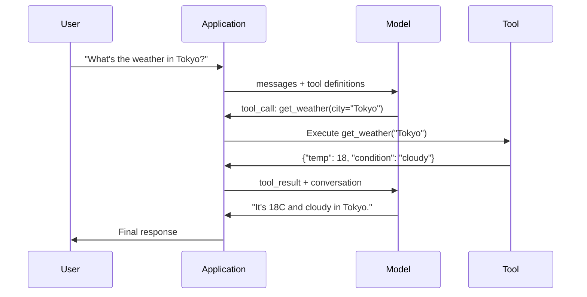

# الوظيفة الاتصال واستخدام الأدوات

> الـ"إلإم" لا يمكنها فعل أي شيء يُنشئون رسائل نصية هذه هي القدرة الكاملة لا يمكنهم التحقق من الطقس، أو استفسار قاعدة بيانات، أو إرسال رسالة بريد إلكتروني، أو تشغيل رمز، أو قراءة ملف. كل "وكيل الذكاء الاصطناعي" رأيته هو LLM الذي يولد JSON الذي يقول ما هي الوظيفة التي يجب الاتصال بها -- ثم رمزك الذي يدعوها فعلاً. النموذج هو الدماغ. الأدوات هي اليدين الدعوة الوظيفية هي الجهاز العصبي الذي يربطهم.

**Type:** Build
**Languages:** Python
**Prerequisites:** Phase 11 Lesson 03 (Structured Outputs)
**Time:** ~75 minutes
**Related:**المرحلة 11 · 14 (مثال بروتوكول السياق)  عندما يتم مشاركة أداة عبر مضيفات ، تتخرج من الدعوة إلى وظيفة محمولة إلى خادم MCP. تغطي هذه الدروس حالة محمولة ؛ تغطي MCP حالة بروتوكول.

## أهداف التعلم

- تنفيذ حلقة استدعاء الوظيفة: تحديد مخططات الأدوات ، تحليل JSON للدعوة الأدوات للنموذج ، تنفيذ الوظائف ، وإعادة النتائج
- مخططات أدوات التصميم مع وصف واضح ومعايير منخفضة يمكن أن تستند إليها النموذج بشكل موثوق
- بناء حلقة وكيل متعددة التحولات التي تتسلسل العديد من المكالمات الوظيفية للإجابة على الأسئلة المعقدة
- وظيفة التعامل تدعو الحافة الحالات: مكالمات الأدوات المتوازية، انتشار الخطأ، ومنع حلقات الأدوات المتنامية

## المشكلة

تقوم ببناء جهاز دردشة، يطلب المستخدم: "ما هو الطقس في طوكيو الآن؟"

يستجيب النموذج: "ليس لدي إمكانية الوصول إلى بيانات الطقس في الوقت الحقيقي، ولكن بناءً على الموسم،

هذا هلوسة مرتدية في إعلان عدم المسؤولية النموذج لا يعرف الطقس لن يعرف أبدا الطقس يتغير كل ساعة بيانات التدريب النموذج هي شهور

الإجابة الصحيحة تتطلب الاتصال بـ OpenWeatherMap API، والحصول على درجة الحرارة الحالية، وعودة الرقم الحقيقي. النموذج لا يمكن أن يدعو API. رمزك يمكن. الجزء المفقود: بروتوكول مهيكلي يسمح للنموذج أن يقول "أحتاج إلى الاتصال بـ API الطقس مع هذه الحجج" ويسمح لكودك بتنفيذها وإعادة إرسال النتيجة.

هذا هو الدعوة للعمل. النموذج يخرج JSON مهيكلا يصف الوظيفة التي يجب استدعائها مع أي حجج. تطبيقك يقوم بتنفيذ الوظيفة. النتيجة تعود إلى المحادثة. النموذج يستخدم النتيجة لإنتاج إجابته النهائية.

بدون طلب وظيفي، الـ"إللي" هي موسوعات معناها، يصبحون وكلاء.

## المفهوم

### الوظيفة التي تدعو إلى الحلقة

كل تفاعل استخدام الأدوات يتبع نفس حلقة 5 خطوات.



الخطوة الأولى: يرسل المستخدم رسالة. الخطوة 2: يتلقى النموذج الرسالة جنبا إلى جنب مع تعريفات الأداة (خطة JSON تصف الوظائف المتاحة). الخطوة الثالثة: بدلاً من الرد بالنص، يقوم النموذج بإخراج طلب أداة -- وهو جسم JSON مهيكلي مع اسم الوظيفة والحجج. الخطوة الرابعة: يقوم رمزك بتنفيذ الوظيفة ويستقطب النتيجة. الخطوة 5: والنتيجة تعود إلى النموذج، والذي لديه الآن بيانات حقيقية لإنتاج إجابته النهائية.

النموذج لا ينفذ أي شيء، إنه يقرر فقط ما الذي يجب أن يُدعى به وبأي حجج.

### تعريفات الأداة: عقد مخطط JSON

يتم تعريف كل أداة بواسطة مخطط JSON الذي يخبر النموذج بما تفعله الوظيفة وما هي الحجج التي تستغرقها وما هي أنواع الحجج التي يجب أن تكون.

```json
{
  "type": "function",
  "function": {
    "name": "get_weather",
    "description": "Get current weather for a city. Returns temperature in Celsius and conditions.",
    "parameters": {
      "type": "object",
      "properties": {
        "city": {
          "type": "string",
          "description": "City name, e.g. 'Tokyo' or 'San Francisco'"
        },
        "units": {
          "type": "string",
          "enum": ["celsius", "fahrenheit"],
          "description": "Temperature units"
        }
      },
      "required": ["city"]
    }
  }
}
```

- نعم`description`النموذج يقرأها لتحديد متى وكيفية استخدام الأداة. وصف غامض مثل "يحصل الطقس" ينتج اختيار أداة أسوأ من "حصل على الطقس الحالي لمدينة. يعيد درجة الحرارة في مئوية والظروف".

### مقارنة المزودين

كل مزود رئيسي يدعم الدعوة الوظيفية، ولكن سطح API يختلف.

| Provider | API Parameter | Tool Call Format | Parallel Calls | Forced Calling |
|----------|--------------|-----------------|---------------|----------------|
| OpenAI (GPT-5, o4) | `tools` | `tool_calls[].function` | Yes (multiple per turn) | `tool_choice="required"` |
| Anthropic (Claude 4.6/4.7) | `tools` | `content[].type="tool_use"` | Yes (multiple blocks) | `tool_choice={"type":"any"}` |
| Google (Gemini 3) | `function_declarations` | `functionCall` | Yes | `function_calling_config` |
| Open-weight (Llama 4, Qwen3, DeepSeek-V3) | Native `tools` on Llama 4; Hermes or ChatML on others | Mixed | Model-dependent | Prompt-based or `tool_choice` if supported |

بحلول عام 2026، تجمع المقدمون الثلاثة المغمورين على أشكال متطابقة تقريبا على أساس JSON-Schema.`tools`المجموعة المشتركة من أدوات المضيفين، تفضل MCP (مرحلة 11 · 14) على الدعوة الوظيفة الداخلية  الخادم هو نفسها لجميعهم.

### اختيار الأدوات: تلقائي، مطلوب، محدد

أنت تتحكم عندما تستخدم النموذج الأدوات.

**Auto**(الابتكار): يقرر النموذج ما إذا كان يجب استدعاء أداة أو الإجابة مباشرة. "ما هو 2 + 2؟" -- يستجيب مباشرة. "ما هو الطقس؟" -- يطلق على الأداة.

**Required**يجب أن يطلب النموذج أداة واحدة على الأقل. استخدم هذا عندما تعرف أن نية المستخدم تتطلب أداة. يمنع النموذج من التخمين بدلاً من البحث عن البيانات الحقيقية.

**Specific function**: إجبار النموذج على استدعاء وظيفة معينة. `tool_choice={"type":"function", "function": {"name": "get_weather"}}`يضمن أداة الطقس يتم استدعائها، بغض النظر عن الاستفسار. استخدم هذا للتوجيه -- عندما منطق فوق التيار بالفعل تحدد أداة مطلوبة.

### مكالمة الوظيفة المتوازية

يمكن أن تقوم GPT-4o وClaude بدعوة وظائف متعددة في جولة واحدة. يسأل المستخدم: "ما هو الطقس في طوكيو ونيويورك؟" النموذج يخرج مكالمات أداة اثنين في وقت واحد:

```json
[
  {"name": "get_weather", "arguments": {"city": "Tokyo"}},
  {"name": "get_weather", "arguments": {"city": "New York"}}
]
```

يقوم رمزك بتنفيذ كلتا (في المثالية في وقت واحد) ، ويستعيد كلا النتائج ، ويجمع النموذج استجابة واحدة. وهذا يقلل من رحلات ذهاب وإياب من 2 إلى 1. بالنسبة للعملاء الذين لديهم 5-10 مكالمات أداة لكل استفسار ، يقلل الاتصال الموازي من التأخير بنسبة 60-80٪.

### الخروج المهيكلي مقابل الدعوة إلى الوظيفة

درس 03 كان يغطى المخرجات المهيكلة. تستخدم دعوة الوظائف نفس آلة JSON Schema، ولكن لأغراض مختلفة.

**Structured outputs**: إجبار النموذج على إنتاج البيانات في شكل معين. الخروج هو المنتج النهائي.`{name, price, in_stock}`. . .

**Function calling**: يعلن النموذج عن نية لتنفيذ إجراء. إن الخروج هو خطوة متوسطة.`get_weather(city="Tokyo")`-- النموذج يطلب إجراءً، وليس يقدم الإجابة النهائية.

استخدم الخروجات المهيكلة عندما تريد استخراج البيانات. استخدم الدعوة الوظيفية عندما تريد أن يتفاعل النموذج مع الأنظمة الخارجية.

### الأمن: القواعد غير المتفاوضة

إن الدعوة إلى الوظائف هي أكثر القدرات خطورة يمكنك إعطاءها لـ LLM. يختار النموذج ما يجب تنفيذه. إذا كانت مجموعة الأدوات الخاصة بك تشمل استفسارات قاعدة البيانات، يقوم النموذج ببناء الاستفسارات. إذا كان يشمل أوامر القبو، يقوم النموذج بكتابتها.

**Rule 1: Never pass model-generated SQL directly to a database.**يمكن النموذج ولن يخلق طاولة DROP، حقن UNION، أو استفسارات التي تعود كل سطر. دائما تعريف. دائما التحقق من الصلاحية. دائما استخدام قائمة المسموحات من العمليات.

**Rule 2: Allowlist functions.**النموذج لا يمكن أن يدعو إلا وظائف تعريفها صراحة. أبداً بناء عام "تنفيذ أي وظيفة باسم" أداة. إذا كان لديك 50 وظيفة داخلية، كشف فقط 5 المستخدم يحتاج.

**Rule 3: Validate arguments.**قد يمر النموذج اسم مدينة`"; DROP TABLE users; --"`. تأكيد كل حجج ضد الأنواع المتوقعة، ومناطيس، والتنسيقات قبل تنفيذها.

**Rule 4: Sanitize tool results.**إذا عادت أداة بيانات حساسة (مفاتيح API، PII، أخطاء داخلية) ، قم بتصفيتها قبل إرسالها إلى النموذج. سيتم تضمين النموذج نتائج الأداة في استجابتها حرفيا.

**Rule 5: Rate limit tool calls.**يمكن لنموذج في حلقة استدعاء الأدوات مئات المرات. حدد أقصى (10-20 مكالمة لكل محادثة هو معقول). كسر حلقات لا نهاية لها.

### التعامل مع الأخطاء

أدوات فشلت، أجهزة التطبيقات الإلكترونية انتهت، قواعد البيانات قد انتهت، الملفات لا توجد، يجب على النموذج أن يعرف متى تفشل أداة ولماذا.

إرجاع الأخطاء كنتائج أداة مهيكلة، وليس استثناءات:

```json
{
  "error": true,
  "message": "City 'Toky' not found. Did you mean 'Tokyo'?",
  "code": "CITY_NOT_FOUND"
}
```

النموذج يقرأ هذا، ويعدل حججاته، ويعيد المحاولات. النموذج جيد في تصحيح الذات من رسائل الخطأ المهيكلة. إنهم سيئون في التعافي من الردود الفارغة أو الأخطاء العامة "شيئا ما ذهب خطأ".

### المخططات: نموذج بروتوكول السياق

MCP هو المعيار المفتوح لشركة Anthropic للتفاعل مع الأدوات. بدلاً من كل تطبيق يحدد أدواته الخاصة ، يوفر MCP بروتوكولًا عالميًا: يتم تقديم الأدوات من قبل خادمات MCP ، وتستهلكها عملاء MCP (مثل Claude Code ، Cursor ، أو تطبيقك).

يمكن لمخادم MCP واحد تعريض الأدوات إلى أي عميل متوافق. يمنح خادم MCP Postgres أي مستخدم قاعدة بيانات العملاء متوافق مع MCP. يمنح خادم MCP GitHub أي مستخدم متواصل الوصول إلى مخزن العملاء. يتم تعريف الأدوات مرة واحدة ، تستخدم في كل مكان.

MCP هو العمل الذي يدعو ما هو HTTP للشبكات. إنه يوحد طبقة النقل حتى تصبح الأدوات محمولة.

```figure
mx-tool-call-loop
```

## بناءها

### الخطوة الأولى: حدد قائمة الأدوات

قم ببناء سجل يحتوي على تعريفات الأدوات وتنفيذها. لكل أداة تعريف JSON Schema (ما يراه النموذج) و وظيفة Python (ما يقوم به رمزك).

```python
import json
import math
import time
import hashlib


TOOL_REGISTRY = {}


def register_tool(name, description, parameters, function):
    TOOL_REGISTRY[name] = {
        "definition": {
            "type": "function",
            "function": {
                "name": name,
                "description": description,
                "parameters": parameters,
            },
        },
        "function": function,
    }
```

### الخطوة الثانية: تنفيذ 5 أدوات

قم ببناء آلة حسابية، بحث عن الطقس، محاكاة البحث على الإنترنت، قراءة الملفات، ومدرب رمز.

```python
def calculator(expression, precision=2):
    allowed = set("0123456789+-*/.() ")
    if not all(c in allowed for c in expression):
        return {"error": True, "message": f"Invalid characters in expression: {expression}"}
    try:
        result = eval(expression, {"__builtins__": {}}, {"math": math})
        return {"result": round(float(result), precision), "expression": expression}
    except Exception as e:
        return {"error": True, "message": str(e)}


WEATHER_DB = {
    "tokyo": {"temp_c": 18, "condition": "cloudy", "humidity": 72, "wind_kph": 14},
    "new york": {"temp_c": 22, "condition": "sunny", "humidity": 45, "wind_kph": 8},
    "london": {"temp_c": 12, "condition": "rainy", "humidity": 88, "wind_kph": 22},
    "san francisco": {"temp_c": 16, "condition": "foggy", "humidity": 80, "wind_kph": 18},
    "sydney": {"temp_c": 25, "condition": "sunny", "humidity": 55, "wind_kph": 10},
}


def get_weather(city, units="celsius"):
    key = city.lower().strip()
    if key not in WEATHER_DB:
        suggestions = [c for c in WEATHER_DB if c.startswith(key[:3])]
        return {
            "error": True,
            "message": f"City '{city}' not found.",
            "suggestions": suggestions,
            "code": "CITY_NOT_FOUND",
        }
    data = WEATHER_DB[key].copy()
    if units == "fahrenheit":
        data["temp_f"] = round(data["temp_c"] * 9 / 5 + 32, 1)
        del data["temp_c"]
    data["city"] = city
    return data


SEARCH_DB = {
    "python function calling": [
        {"title": "OpenAI Function Calling Guide", "url": "https://platform.openai.com/docs/guides/function-calling", "snippet": "Learn how to connect LLMs to external tools."},
        {"title": "Anthropic Tool Use", "url": "https://docs.anthropic.com/en/docs/tool-use", "snippet": "Claude can interact with external tools and APIs."},
    ],
    "MCP protocol": [
        {"title": "Model Context Protocol", "url": "https://modelcontextprotocol.io", "snippet": "An open standard for connecting AI models to data sources."},
    ],
    "weather API": [
        {"title": "OpenWeatherMap API", "url": "https://openweathermap.org/api", "snippet": "Free weather API with current, forecast, and historical data."},
    ],
}


def web_search(query, max_results=3):
    key = query.lower().strip()
    for db_key, results in SEARCH_DB.items():
        if db_key in key or key in db_key:
            return {"query": query, "results": results[:max_results], "total": len(results)}
    return {"query": query, "results": [], "total": 0}


FILE_SYSTEM = {
    "data/config.json": '{"model": "gpt-4o", "temperature": 0.7, "max_tokens": 4096}',
    "data/users.csv": "name,email,role\nAlice,alice@example.com,admin\nBob,bob@example.com,user",
    "README.md": "# My Project\nA tool-use agent built from scratch.",
}


def read_file(path):
    if ".." in path or path.startswith("/"):
        return {"error": True, "message": "Path traversal not allowed.", "code": "FORBIDDEN"}
    if path not in FILE_SYSTEM:
        available = list(FILE_SYSTEM.keys())
        return {"error": True, "message": f"File '{path}' not found.", "available_files": available, "code": "NOT_FOUND"}
    content = FILE_SYSTEM[path]
    return {"path": path, "content": content, "size_bytes": len(content), "lines": content.count("\n") + 1}


def run_code(code, language="python"):
    if language != "python":
        return {"error": True, "message": f"Language '{language}' not supported. Only 'python' is available."}
    forbidden = ["import os", "import sys", "import subprocess", "exec(", "eval(", "__import__", "open("]
    for pattern in forbidden:
        if pattern in code:
            return {"error": True, "message": f"Forbidden operation: {pattern}", "code": "SECURITY_VIOLATION"}
    try:
        local_vars = {}
        exec(code, {"__builtins__": {"print": print, "range": range, "len": len, "str": str, "int": int, "float": float, "list": list, "dict": dict, "sum": sum, "min": min, "max": max, "abs": abs, "round": round, "sorted": sorted, "enumerate": enumerate, "zip": zip, "map": map, "filter": filter, "math": math}}, local_vars)
        result = local_vars.get("result", None)
        return {"success": True, "result": result, "variables": {k: str(v) for k, v in local_vars.items() if not k.startswith("_")}}
    except Exception as e:
        return {"error": True, "message": f"{type(e).__name__}: {e}"}
```

### الخطوة الثالثة: تسجيل جميع الأدوات

```python
def register_all_tools():
    register_tool(
        "calculator", "Evaluate a mathematical expression. Supports +, -, *, /, parentheses, and decimals. Returns the numeric result.",
        {"type": "object", "properties": {"expression": {"type": "string", "description": "Math expression, e.g. '(10 + 5) * 3'"}, "precision": {"type": "integer", "description": "Decimal places in result", "default": 2}}, "required": ["expression"]},
        calculator,
    )
    register_tool(
        "get_weather", "Get current weather for a city. Returns temperature, condition, humidity, and wind speed.",
        {"type": "object", "properties": {"city": {"type": "string", "description": "City name, e.g. 'Tokyo' or 'San Francisco'"}, "units": {"type": "string", "enum": ["celsius", "fahrenheit"], "description": "Temperature units, defaults to celsius"}}, "required": ["city"]},
        get_weather,
    )
    register_tool(
        "web_search", "Search the web for information. Returns a list of results with title, URL, and snippet.",
        {"type": "object", "properties": {"query": {"type": "string", "description": "Search query"}, "max_results": {"type": "integer", "description": "Maximum results to return", "default": 3}}, "required": ["query"]},
        web_search,
    )
    register_tool(
        "read_file", "Read the contents of a file. Returns the file content, size, and line count.",
        {"type": "object", "properties": {"path": {"type": "string", "description": "Relative file path, e.g. 'data/config.json'"}}, "required": ["path"]},
        read_file,
    )
    register_tool(
        "run_code", "Execute Python code in a sandboxed environment. Set a 'result' variable to return output.",
        {"type": "object", "properties": {"code": {"type": "string", "description": "Python code to execute"}, "language": {"type": "string", "enum": ["python"], "description": "Programming language"}}, "required": ["code"]},
        run_code,
    )
```

### الخطوة الرابعة: قم ببناء وظيفة "الدورة"

هذا هو المحرك الأساسي، إنه يحاكي النموذج يقرر أداة الاتصال بها، ويقوم بتنفيذ الأداة، ويرسل النتائج.

```python
def simulate_model_decision(user_message, tools, conversation_history):
    msg = user_message.lower()

    if any(word in msg for word in ["weather", "temperature", "forecast"]):
        cities = []
        for city in WEATHER_DB:
            if city in msg:
                cities.append(city)
        if not cities:
            for word in msg.split():
                if word.capitalize() in [c.title() for c in WEATHER_DB]:
                    cities.append(word)
        if not cities:
            cities = ["tokyo"]
        calls = []
        for city in cities:
            calls.append({"name": "get_weather", "arguments": {"city": city.title()}})
        return calls

    if any(word in msg for word in ["calculate", "compute", "math", "what is", "how much"]):
        for token in msg.split():
            if any(c in token for c in "+-*/"):
                return [{"name": "calculator", "arguments": {"expression": token}}]
        if "+" in msg or "-" in msg or "*" in msg or "/" in msg:
            expr = "".join(c for c in msg if c in "0123456789+-*/.() ")
            if expr.strip():
                return [{"name": "calculator", "arguments": {"expression": expr.strip()}}]
        return [{"name": "calculator", "arguments": {"expression": "0"}}]

    if any(word in msg for word in ["search", "find", "look up", "google"]):
        query = msg.replace("search for", "").replace("look up", "").replace("find", "").strip()
        return [{"name": "web_search", "arguments": {"query": query}}]

    if any(word in msg for word in ["read", "file", "open", "cat", "show"]):
        for path in FILE_SYSTEM:
            if path.split("/")[-1].split(".")[0] in msg:
                return [{"name": "read_file", "arguments": {"path": path}}]
        return [{"name": "read_file", "arguments": {"path": "README.md"}}]

    if any(word in msg for word in ["run", "execute", "code", "python"]):
        return [{"name": "run_code", "arguments": {"code": "result = 'Hello from the sandbox!'", "language": "python"}}]

    return []


def execute_tool_call(tool_call):
    name = tool_call["name"]
    args = tool_call["arguments"]

    if name not in TOOL_REGISTRY:
        return {"error": True, "message": f"Unknown tool: {name}", "code": "UNKNOWN_TOOL"}

    tool = TOOL_REGISTRY[name]
    func = tool["function"]
    start = time.time()

    try:
        result = func(**args)
    except TypeError as e:
        result = {"error": True, "message": f"Invalid arguments: {e}"}

    elapsed_ms = round((time.time() - start) * 1000, 2)
    return {"tool": name, "result": result, "execution_time_ms": elapsed_ms}


def run_function_calling_loop(user_message, max_iterations=5):
    conversation = [{"role": "user", "content": user_message}]
    tool_definitions = [t["definition"] for t in TOOL_REGISTRY.values()]
    all_tool_results = []

    for iteration in range(max_iterations):
        tool_calls = simulate_model_decision(user_message, tool_definitions, conversation)

        if not tool_calls:
            break

        results = []
        for call in tool_calls:
            result = execute_tool_call(call)
            results.append(result)

        conversation.append({"role": "assistant", "content": None, "tool_calls": tool_calls})

        for result in results:
            conversation.append({"role": "tool", "content": json.dumps(result["result"]), "tool_name": result["tool"]})

        all_tool_results.extend(results)
        break

    return {"conversation": conversation, "tool_results": all_tool_results, "iterations": iteration + 1 if tool_calls else 0}
```

### الخطوة 5: تأكيد الحجة

قم ببناء مؤكدة تفحص حجج الدعوة الأداة مقابل مخطط JSON قبل التنفيذ.

```python
def validate_tool_arguments(tool_name, arguments):
    if tool_name not in TOOL_REGISTRY:
        return [f"Unknown tool: {tool_name}"]

    schema = TOOL_REGISTRY[tool_name]["definition"]["function"]["parameters"]
    errors = []

    if not isinstance(arguments, dict):
        return [f"Arguments must be an object, got {type(arguments).__name__}"]

    for required_field in schema.get("required", []):
        if required_field not in arguments:
            errors.append(f"Missing required argument: {required_field}")

    properties = schema.get("properties", {})
    for arg_name, arg_value in arguments.items():
        if arg_name not in properties:
            errors.append(f"Unknown argument: {arg_name}")
            continue

        prop_schema = properties[arg_name]
        expected_type = prop_schema.get("type")

        type_checks = {"string": str, "integer": int, "number": (int, float), "boolean": bool, "array": list, "object": dict}
        if expected_type in type_checks:
            if not isinstance(arg_value, type_checks[expected_type]):
                errors.append(f"Argument '{arg_name}': expected {expected_type}, got {type(arg_value).__name__}")

        if "enum" in prop_schema and arg_value not in prop_schema["enum"]:
            errors.append(f"Argument '{arg_name}': '{arg_value}' not in {prop_schema['enum']}")

    return errors
```

### الخطوة 6: تشغيل الظهور

```python
def run_demo():
    register_all_tools()

    print("=" * 60)
    print("  Function Calling & Tool Use Demo")
    print("=" * 60)

    print("\n--- Registered Tools ---")
    for name, tool in TOOL_REGISTRY.items():
        desc = tool["definition"]["function"]["description"][:60]
        params = list(tool["definition"]["function"]["parameters"].get("properties", {}).keys())
        print(f"  {name}: {desc}...")
        print(f"    params: {params}")

    print(f"\n--- Argument Validation ---")
    validation_tests = [
        ("get_weather", {"city": "Tokyo"}, "Valid call"),
        ("get_weather", {}, "Missing required arg"),
        ("get_weather", {"city": "Tokyo", "units": "kelvin"}, "Invalid enum value"),
        ("calculator", {"expression": 123}, "Wrong type (int for string)"),
        ("unknown_tool", {"x": 1}, "Unknown tool"),
    ]
    for tool_name, args, label in validation_tests:
        errors = validate_tool_arguments(tool_name, args)
        status = "VALID" if not errors else f"ERRORS: {errors}"
        print(f"  {label}: {status}")

    print(f"\n--- Tool Execution ---")
    direct_tests = [
        {"name": "calculator", "arguments": {"expression": "(10 + 5) * 3 / 2"}},
        {"name": "get_weather", "arguments": {"city": "Tokyo"}},
        {"name": "get_weather", "arguments": {"city": "Mars"}},
        {"name": "web_search", "arguments": {"query": "python function calling"}},
        {"name": "read_file", "arguments": {"path": "data/config.json"}},
        {"name": "read_file", "arguments": {"path": "../etc/passwd"}},
        {"name": "run_code", "arguments": {"code": "result = sum(range(1, 101))"}},
        {"name": "run_code", "arguments": {"code": "import os; os.system('rm -rf /')"}},
    ]
    for call in direct_tests:
        result = execute_tool_call(call)
        print(f"\n  {call['name']}({json.dumps(call['arguments'])})")
        print(f"    -> {json.dumps(result['result'], indent=None)[:100]}")
        print(f"    time: {result['execution_time_ms']}ms")

    print(f"\n--- Full Function Calling Loop ---")
    test_queries = [
        "What's the weather in Tokyo?",
        "Calculate (100 + 250) * 0.15",
        "Search for MCP protocol",
        "Read the config file",
        "Run some Python code",
        "Tell me a joke",
    ]
    for query in test_queries:
        print(f"\n  User: {query}")
        result = run_function_calling_loop(query)
        if result["tool_results"]:
            for tr in result["tool_results"]:
                print(f"    Tool: {tr['tool']} ({tr['execution_time_ms']}ms)")
                print(f"    Result: {json.dumps(tr['result'], indent=None)[:90]}")
        else:
            print(f"    [No tool called -- direct response]")
        print(f"    Iterations: {result['iterations']}")

    print(f"\n--- Parallel Tool Calls ---")
    multi_city_query = "What's the weather in tokyo and london?"
    print(f"  User: {multi_city_query}")
    result = run_function_calling_loop(multi_city_query)
    print(f"  Tool calls made: {len(result['tool_results'])}")
    for tr in result["tool_results"]:
        city = tr["result"].get("city", "unknown")
        temp = tr["result"].get("temp_c", "N/A")
        print(f"    {city}: {temp}C, {tr['result'].get('condition', 'N/A')}")

    print(f"\n--- Security Checks ---")
    security_tests = [
        ("read_file", {"path": "../../etc/passwd"}),
        ("run_code", {"code": "import subprocess; subprocess.run(['ls'])"}),
        ("calculator", {"expression": "__import__('os').system('ls')"}),
    ]
    for tool_name, args in security_tests:
        result = execute_tool_call({"name": tool_name, "arguments": args})
        blocked = result["result"].get("error", False)
        print(f"  {tool_name}({list(args.values())[0][:40]}): {'BLOCKED' if blocked else 'ALLOWED'}")
```

## استخدمها

### الاتصال بالعمل OpenAI

```python
# from openai import OpenAI
#
# client = OpenAI()
#
# tools = [{
#     "type": "function",
#     "function": {
#         "name": "get_weather",
#         "description": "Get current weather for a city",
#         "parameters": {
#             "type": "object",
#             "properties": {
#                 "city": {"type": "string"},
#                 "units": {"type": "string", "enum": ["celsius", "fahrenheit"]}
#             },
#             "required": ["city"]
#         }
#     }
# }]
#
# response = client.chat.completions.create(
#     model="gpt-4o",
#     messages=[{"role": "user", "content": "Weather in Tokyo?"}],
#     tools=tools,
#     tool_choice="auto",
# )
#
# tool_call = response.choices[0].message.tool_calls[0]
# args = json.loads(tool_call.function.arguments)
# result = get_weather(**args)
#
# final = client.chat.completions.create(
#     model="gpt-4o",
#     messages=[
#         {"role": "user", "content": "Weather in Tokyo?"},
#         response.choices[0].message,
#         {"role": "tool", "tool_call_id": tool_call.id, "content": json.dumps(result)},
#     ],
# )
# print(final.choices[0].message.content)
```

يعيد OpenAI مكالمات الأداة على شكل `response.choices[0].message.tool_calls`كل مكالمة لها`id`يجب أن تضيف عند إرجاع النتيجة. النموذج يستخدم هذا الهوية لتطابق النتائج مع المكالمات. GPT-4o يمكن أن تعيد العديد من المكالمات الأداة في استجابة واحدة - تكرار وتنفيذ جميعها.

### استخدام الأدوات الإنسانية

```python
# import anthropic
#
# client = anthropic.Anthropic()
#
# response = client.messages.create(
#     model="claude-sonnet-5",
#     max_tokens=1024,
#     tools=[{
#         "name": "get_weather",
#         "description": "Get current weather for a city",
#         "input_schema": {
#             "type": "object",
#             "properties": {
#                 "city": {"type": "string"},
#                 "units": {"type": "string", "enum": ["celsius", "fahrenheit"]}
#             },
#             "required": ["city"]
#         }
#     }],
#     messages=[{"role": "user", "content": "Weather in Tokyo?"}],
# )
#
# tool_block = next(b for b in response.content if b.type == "tool_use")
# result = get_weather(**tool_block.input)
#
# final = client.messages.create(
#     model="claude-sonnet-5",
#     max_tokens=1024,
#     tools=[...],
#     messages=[
#         {"role": "user", "content": "Weather in Tokyo?"},
#         {"role": "assistant", "content": response.content},
#         {"role": "user", "content": [{"type": "tool_result", "tool_use_id": tool_block.id, "content": json.dumps(result)}]},
#     ],
# )
```

يعود أداة الأنثروبيك دعوات كحجرات المحتوى مع `type: "tool_use"`. نتيجة الأداة تذهب في رسالة للمستخدم مع `type: "tool_result"`لاحظ الفرق الرئيسي: استخدامات الأنثروبية`input_schema`لتحديدات ملامح الأداة، بينما يستخدم OpenAI `parameters`. . .

### تكامل MCP

```python
# MCP servers expose tools over a standardized protocol.
# Any MCP-compatible client can discover and call these tools.
#
# Example: connecting to a Postgres MCP server
#
# from mcp import ClientSession, StdioServerParameters
# from mcp.client.stdio import stdio_client
#
# server_params = StdioServerParameters(
#     command="npx",
#     args=["-y", "@modelcontextprotocol/server-postgres", "postgresql://localhost/mydb"],
# )
#
# async with stdio_client(server_params) as (read, write):
#     async with ClientSession(read, write) as session:
#         await session.initialize()
#         tools = await session.list_tools()
#         result = await session.call_tool("query", {"sql": "SELECT count(*) FROM users"})
```

MCP يقطع تنفيذ الأدوات من استهلاك الأدوات. خادم Postgres يعرف SQL. خادم GitHub يعرف API. وكيلك فقط اكتشف ودعوة الأدوات - لا تحتاج إلى رمز محدد للمقدم لكل تكامل.

## أرسله

هذا الدرس يُنتج`outputs/prompt-tool-designer.md`-- نموذج استشارة قابلة للاستعمال مرة أخرى لتصميم تعريفات الأدوات. أعطيه وصفًا لما تريد أداة القيام به ، ويُنتج تعريف مخطط JSON كامل مع التصفيات والأنواع والقيود.

كما أنها تنتج`outputs/skill-function-calling-patterns.md`-- إطار قرار لتنفيذ الوظيفة التي تدعو إلى الإنتاج، تغطي تصميم الأدوات ومعالجة الأخطاء والأمن وأنماط محددة للمورد.

## التمارين

1. **Add a 6th tool: database query.**تنفيذ أداة SQL محاكاة مع جدول في الذاكرة. تقبل الأداة اسم الجدول وشروط المرشح (ليس SQL الخام). تأكد من أن اسم الجدول موجود في قائمة الإذن وأن مشغلي المرشحات مقيدون على `=`،`>`،`<`،`>=`،`<=`. أعيد الصفوف المتطابقة كـ JSON

2. **Implement retry with error feedback.**عندما تفشل مكالمة أداة (على سبيل المثال ، لم يتم العثور على المدينة) ، قم بإعادة رسالة الخطأ إلى وظيفة القرار النموذجي ودعها تصحيح حججها. تتبع عدد التجربات التي تستغرقها كل مكالمة. حدد ما يزيد عن 3 تجارب لكل مكالمة أداة.

3. **Build a multi-step agent.**بعض الأسئلة تتطلب طلبات أدوات السلاسل: "اقرأ ملف التكوين وأخبرني عن النموذج الذي يتم تشكيله ، ثم ابحث في الويب عن تسعير هذا النموذج". تنفيذ حلقة تعمل حتى يقرر النموذج أنه لا حاجة إلى المزيد من الأدوات ، وإرسال النتائج المتراكمة في كل خطوة قرار. الحد من 10 تكرارات لمنع حلقات لا نهاية لها.

4. **Measure tool selection accuracy.**قم بإنشاء 30 استفسار اختباري مع أسماء الأدوات المتوقعة. قم بتشغيل وظيفة القرار الخاصة بك على جميع 30 وقياس ما هي النسبة المئوية من الوقت الذي يختار فيه الأدوات الصحيحة. حدد أي استفسارات تسبب الأكثر ارتباكا بين الأدوات.

5. **Implement tool call caching.**إذا تم استدعاء نفس الأداة مع حجج متطابقة في غضون 60 ثانية، ارجع النتيجة المحفوظة في الاحتفاظ بدلاً من إعادة تنفيذها. استخدم قاموسًا مع مفتاح `(tool_name, frozenset(args.items()))`. قياس معدلات الوصول إلى الكاش عبر المحادثة مع 20 استفسار

## الشروط الرئيسية

| Term | What people say | What it actually means |
|------|----------------|----------------------|
| Function calling | "Tool use" | The model outputs structured JSON describing a function to invoke with specific arguments -- your code executes it, not the model |
| Tool definition | "Function schema" | A JSON Schema object describing a tool's name, purpose, parameters, and types -- the model reads this to decide when and how to use the tool |
| Tool choice | "Calling mode" | Controls whether the model must call a tool (required), may call a tool (auto), or must call a specific tool (named) |
| Parallel calling | "Multi-tool" | The model outputs multiple tool calls in a single turn, reducing round trips -- GPT-4o and Claude both support this |
| Tool result | "Function output" | The return value from executing a tool, sent back to the model as a message so it can use real data in its response |
| Argument validation | "Input checking" | Verifying that model-generated arguments match the expected types, ranges, and constraints before executing the tool |
| MCP | "Tool protocol" | Model Context Protocol -- Anthropic's open standard for exposing tools via servers that any compatible client can discover and call |
| Agent loop | "ReAct loop" | The iterative cycle of model-decides-tool, code-executes-tool, result-feeds-back until the model has enough information to respond |
| Tool poisoning | "Prompt injection via tools" | An attack where tool results contain instructions that manipulate the model's behavior -- sanitize all tool outputs |
| Rate limiting | "Call budget" | Setting a maximum number of tool calls per conversation to prevent infinite loops and runaway API costs |

## المزيد من القراءة

- [OpenAI Function Calling Guide](https://platform.openai.com/docs/guides/function-calling)-- الإشارة النهائية لاستخدام الأدوات مع GPT-4o، بما في ذلك المكالمات المتوازية، المكالمات القسرية، والحجج المهيكلة
- [Anthropic Tool Use Guide](https://docs.anthropic.com/en/docs/tool-use)-- أداة كلود استخدام تنفيذ مع input_schema، استجابات متعددة الأدوات، وتكوين tool_choice
- [Model Context Protocol Specification](https://modelcontextprotocol.io)-- المعيار المفتوح للتشامل بين الأدوات عبر تطبيقات الذكاء الاصطناعي، مع بنية الخادم / العميل
- [Schick et al., 2023 -- "Toolformer: Language Models Can Teach Themselves to Use Tools"](https://arxiv.org/abs/2302.04761)-- ورقة أساسية حول تدريب الدرجات العليا لتحديد متى وكيفية استدعاء الأدوات الخارجية
- [Patil et al., 2023 -- "Gorilla: Large Language Model Connected with Massive APIs"](https://arxiv.org/abs/2305.15334)-- تحسين الـ LLM لتحقيق مكالمات API على طول 1645 API مع تقليل الهلوسة
- [Berkeley Function Calling Leaderboard](https://gorilla.cs.berkeley.edu/leaderboard.html)-- مقياس قياسي في الوقت الحقيقي مقارنة الوظيفة التي تدعو دقة عبر GPT-4o، كلود، جيمين، والنماذج المفتوحة
- [Yao et al., "ReAct: Synergizing Reasoning and Acting in Language Models" (ICLR 2023)](https://arxiv.org/abs/2210.03629)-- حلقة التفكير-العمل-الملاحظة التي هي حلقة الوكيل الخارجي حول كل مكالمة الأداة؛ حيث ينتهي هذا الدروس، المرحلة 14 تبدأ.
- [Anthropic — Building effective agents (Dec 2024)](https://www.anthropic.com/research/building-effective-agents)-- خمسة أنماط قابلة للتكوين (السلسلة السريعة، التوجيه، التوازي، الموسيقي العامل، المقيّم المُحسن) بنيت من أداة استخدام واحدة البدائية.
