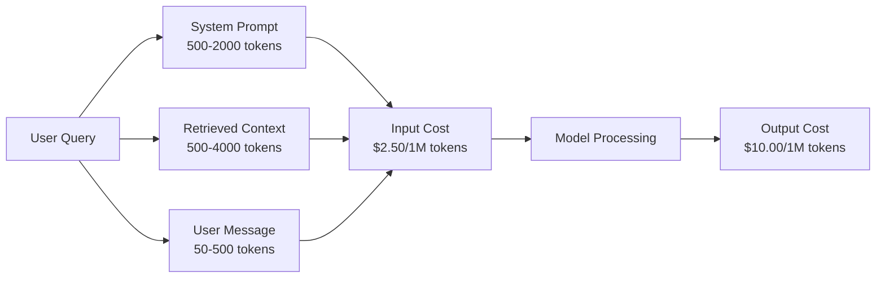
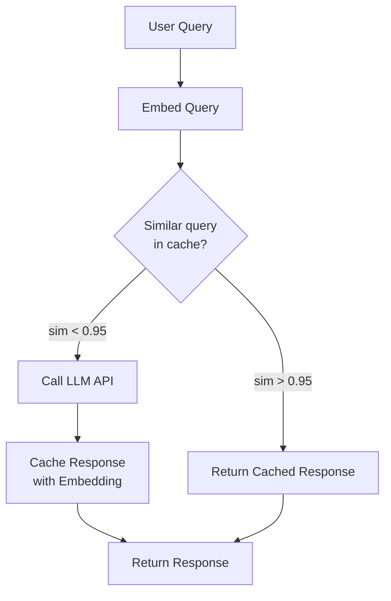
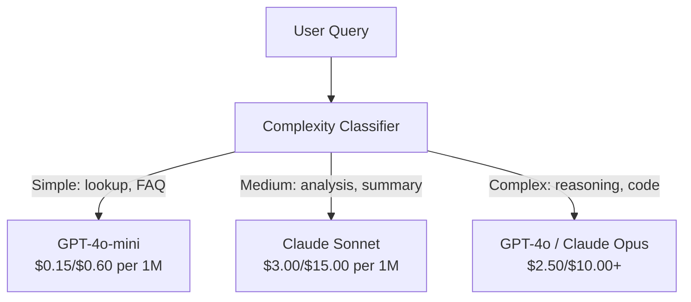

# الاحتفاظ بالمكان المحفوظ، الحد من معدلات التسعير وتحسين التكلفة

> معظم الشركات الناشئة الذكية لا تموت من نماذج سيئة. إنها تموت من اقتصاد الوحدة السيئة. مكالمة GPT-4o واحدة تكلف جزءًا صغيرًا من سنت. عشرة آلاف مستخدم يقومون بعشرة مكالمات يوميًا يكلف 250 دولار في رموز الإدخال وحدها - قبل أن تتقاضى دولار واحد. الشركات التي تبقى هي تلك التي تعامل كل مكالمة API كعاملة مالية ، وليس مكالمة وظيفة.

**Type:** Build
**Languages:** Python
**Prerequisites:** Phase 11 Lesson 09 (Function Calling)
**Time:** ~45 minutes
**Related:**المرحلة 11 · 15 (التخزين السريع)  هذا الدروس يغطي التخزين السريع للتطبيق (التخزين السريع، وتخزين الهاش الدقيق، وتوجيه النموذج). يتناول الدروس 15 تخزين السريع السريع لمقدم الطراز (Anthropic cache_control، OpenAI automatic، Gemini CachedContent). قم بتجميع الاثنين لخفض التكلفة بنسبة 50-95%.

## أهداف التعلم

- تنفيذ التخزين الآلي الذي يخدم استفسارات متكررة أو مماثلة من التخزين الآلي بدلاً من إجراء مكالمة API جديدة
- تحسّب تكاليف الطلب لكل مزود وتطبيق تحديدات أسعار الاحتفاظ بالرموز والميزانية
- بناء طبقة تحسين التكلفة مع الضغط السريع، توجيه النموذج (غالي مقابل رخيص) ، وتخزين الاستجابة
- صمم استراتيجية تخزين المستويات باستخدام المقابلة الدقيقة، والتشابه النطاقي، وتخزين الاحتياطي المسبق لأنواع الاستفسارات المختلفة

## المشكلة

إنّكِ تقومين ببناء جهاز "جريد" يعمل بشكل رائع، يُحبّه المستخدمون.

ثم يأتي الفاتورة

تكاليف GPT-5 $5 per million input tokens and $15 لكل مليون إنتاج. كلود أوبوس 4.7 تكلفة $15 input / $75 خروجاً، تكلفة جيميني 3 برو$1.25 input / $الخروج 5 . GPT-5-ميني هو $0.25/$2. الأسعار أدناه تشير إلى ذلك، فاختر دائماً صفحة الأسعار الحالية للمزود.

هذه هي الرياضيات التي تقتل الشركات الناشئة:

- 10 آلاف مستخدم نشط يومياً
- 10 استفسارات لكل مستخدم يومياً
- 1000 رمز إدخال لكل استفسار (تعليق النظام + سياق + رسالة المستخدم)
- 500 رمز خروجي لكل رد

**Daily input cost:**10،000 × 10 × 1000 / 1,000,000 × $2.50 = **$250/يوم**
**Daily output cost:**10،000 × 10 × 500 / 1,000,000 × $10.00 = **$500/يوم**
**Monthly total:** **$22,500/month**

هذا مجرد ماجستير في العلوم، أضف إضافة، استضافة قاعدة بيانات المتجهات، البنية التحتية. أنت تبحث عن 30،000 $ / شهر لبرنامج دردشة.

الجزء الوحشي: 40-60% من هذه الأسئلة هي نسخة شبه مستكررة. يطرح المستخدمون نفس الأسئلة بكلمات مختلفة قليلاً. طلب نظامك - متطابق في كل طلب - يتم فواتير كل مرة. وثائق السياق التي يستردها RAG تتكرر عبر المستخدمين الذين يسألون عن نفس الموضوع.

أنت تدفع الثمن الكامل للحسابات الزائدة

## المفهوم

### تشريح التكلفة من دعوة ماجستير في العلوم

كل مكالمة من خلال إطار الإتصال لديها خمسة مكونات تكلفة



طلبات النظام هي القاتل الصامتة، طلبات النظام 1500 رمز يتم إرسالها مع كل طلب تكلفة$3.75 per million requests just for that prefix. At 100K requests per day, that is $375 يوم -- 11،250 دولار شهريا -- من أجل النص الذي لا يتغير أبداً.

### الاحتفاظ بالمقارنة مع المزودين: تخفيضات متكاملة

جميع المقدمين الكبار الثلاث يقدمون الاحتفاظ بالخزينة السريعة من جانب المقدم في عام 2026 ، ولكن الميكانيكيات تختلف. انظر المرحلة 11 · 15 للتغوص العميق.

| Provider | Mechanism | Discount | Minimum | Cache Duration |
|----------|-----------|----------|---------|----------------|
| Anthropic | Explicit cache_control markers | 90% on cache hits (pay 25% extra on write) | 1,024 tokens (Sonnet/Opus), 2,048 (Haiku) | 5 min default; 1h extended (2x write premium) |
| OpenAI | Automatic prefix matching | 50% on cache hits | 1,024 tokens | Best-effort up to 1 hour |
| Google Gemini | Explicit CachedContent API | ~75% reduction (plus storage) | 4,096 (Flash) / 32,768 (Pro) | User-configurable TTL |

**Anthropic's approach**هو صريح. انت تُعَلِّمُ أجزاء من طلبكَ مع `cache_control: {"type": "ephemeral"}`. الطلب الأول يدفع قسط كتابة 25٪ الطلبات اللاحقة ذات نفس المرفق تحصل على خصم 90٪ نظام 2000 رمزا تطلب ذلك تكلفة$0.005 normally costs $0.000625 على النقش التخزينية أكثر من 100 ألف طلب، وهذا يوفر 437.50 دولار في اليوم.

**OpenAI's approach**أي إشارة استبيانية تتطابق مع طلب سابق تحصل على خصم بنسبة 50٪. لا حاجة إلى علامات. التنازل: أقل خصم، أقل التحكم، ولكن صفر جهد تنفيذ.

### التخزين المفصل: طبقة المخصصة الخاصة بك

الاحتفاظ بالمكانة المؤقتة من المقدمين يعمل فقط لمثليات متطابقة. الاحتفاظ بالمكانة المفتاحية تعالج الحالة الأصعبة: استفسارات مختلفة ذات المعنى نفسه.

"ما هي سياسة العودة؟" و "كيف أعيد عنصرًا؟" هي سلسلة مختلفة ولكن بنفس النية. يقوم الاحتفاظ بالاحتفاظ بالمعنى بالبحثين ، ويحسب التشابه الكوسيني ، ويرد الرد المحتفظ به إذا تجاوزت التشابه عتبة (عادةً 0.92-0.95).



تكاليف إدراجها لا تُهمّل. تكاليف إدراج OpenAI النصيّة الثلاثة الصغيرة تُكلف 0.02 دولارًا لكل مليون رمز. تفتيش الاحتفاظ بالخزنة لا تكلف تقريباً أي شيء مقارنة بمكالمة كاملة لـ LLM.

### التخزين الدقيق: الهاش ومطابقة

بالنسبة للمكالمات المحددة (الدرجة الحرارة = 0 ، نفس النموذج ، نفس المشاركة) ، فإن التخزين الآلي الدقيق أسهل وأسرع. قم بتحديد المشاركة الآلية الكاملة ، تحقق من التخزين الآلي ، وعود إذا وجدت.

هذا يعمل بشكل مثالي ل:
- طلبات النظام + سياق ثابت + استفسارات المستخدم المماثلة
- دعوة الوظيفة ذات تعريفات الأداة المماثلة
- معالجة الحزم حيث يتم معالجة نفس الوثيقة عدة مرات

### الحد من المعدلات: حماية ميزانيتك

الحد من معدلات التأثير لا يتعلق بالعدالة فحسب بل يتعلق بالبقاء على قيد الحياة

**Token bucket algorithm:**يحصل كل مستخدم على سطل من N رموز التي تعيد ملء مع معدل R في الثانية. تستهلك طلب رموز من سطل. إذا كان سطل فارغًا، يتم رفض الطلب. وهذا يسمح بالانفجارات (استخدم سطل كامل في وقت واحد) مع فرض معدل متوسط.

**Per-user quotas:**تحديد حدود يومية/شهرية للرموز لكل مستوى مستخدم.

| Tier | Daily Token Limit | Max Requests/min | Model Access |
|------|------------------|------------------|-------------|
| Free | 50,000 | 10 | GPT-4o-mini only |
| Pro | 500,000 | 60 | GPT-4o, Claude Sonnet |
| Enterprise | 5,000,000 | 300 | All models |

### نموذج التوجيه: نموذج مناسب للعمل الصحيح

ليس كل استفسار يحتاج إلى GPT-4o.

"ما هو وقت إغلاق المتجر؟" لا يتطلب$10/M-output model. GPT-4o-mini at $إنتاج 0.60 م يديره بشكل مثالي. كلود هايكو عند 1.25 دولار/م يديره. مصنف بسيط يمركز استفسارات رخيصة إلى نماذج رخيصة والسؤال المعقد إلى نماذج باهظة الثمن.



جهاز توجيه مزود جيد يوفر 40 إلى 70٪ من تكاليف النموذج وحده.

### تتبع التكاليف: معرفة أين تذهب الأموال

لا يمكنك تحسين ما لا تقيسه. سجل كل مكالمة API مع:

- طابع زمني
- اسم النموذج
- رموز إدخال
- رموز الخروج
- التأخير (ms)
- تكلفة الحساب ($)
- هوية المستخدم
- الوصول إلى الاحتفاظ
- فئة الطلبات

هذه البيانات تكشف عن الميزات التي تكون مكلفة، والمتستخدمين الذين هم المستهلكين الثقيلة، وأين التخزين الآلي له أكبر تأثير.

### التخزين: خصومات كبيرة

يقوم API البطاقة OpenAI بمعالجة الطلبات بشكل غير متزامن مع خصم بنسبة 50٪. تقوم بإرسال مجموعة تصل إلى 50،000 طلب، وتعود النتائج في غضون 24 ساعة.

استخدم الحزمة ل:
- معالجة الوثائق ليلاً
- تصنيف الكتلة
- عمليات التقييم
- خطوط أنابيب إثراء البيانات

لا تخص: استفسارات المستخدم في الوقت الحقيقي (مسائل التأخير).

### تحذيرات الميزانية وقطع الحواسب

إنّ قطع الحلقة يُوقف الإنفاق عندما تصل إلى حدٍ محدد، وبدون ذلك، يمكن أن يُحرق حطام أو إساءة استخدام في ميزانيتك الشهرية في غضون ساعات.

حدد ثلاثة أعلى حدود:
1. **Warning**(70٪ من الميزانية): إرسال إشعار
2. **Throttle**(85% من الميزانية): الانتقال إلى نماذج أرخص فقط
3. **Stop**(95% من الميزانية): رفض طلبات جديدة، إرجاع الردود المحفوظة فقط

### كومة التحسين

تطبق هذه التقنيات بالترتيب كل طبقة تتراكم مع الطبقة السابقة

| Layer | Technique | Typical Savings | Implementation Effort |
|-------|-----------|----------------|----------------------|
| 1 | Provider prompt caching | 30-50% | Low (add cache markers) |
| 2 | Exact caching | 10-20% | Low (hash + dict) |
| 3 | Semantic caching | 15-30% | Medium (embeddings + similarity) |
| 4 | Model routing | 40-70% | Medium (classifier) |
| 5 | Rate limiting | Budget protection | Low (token bucket) |
| 6 | Prompt compression | 10-30% | Medium (rewrite prompts) |
| 7 | Batching | 50% on eligible | Low (batch API) |

تطبيقات RAG التي تطبق الطبقات 1-5 عادة ما تقلل من التكاليف من $22,500/month to $4000 - 6000 شهرياً هذا هو الفرق بين حرق المدرج وبناء عمل

### التوفير الحقيقي: قبل وبعد ذلك

هنا تحطيم حقيقي لـ (راج) يتحدث مع (داو) 10 آلاف

| Metric | Before Optimization | After Optimization | Savings |
|--------|--------------------|--------------------|---------|
| Monthly LLM cost | $22,500 | $5,200 | 77% |
| Avg cost per query | $0.0075 | $0.0017 | 77% |
| Cache hit rate | 0% | 52% | -- |
| Queries routed to mini | 0% | 65% | -- |
| P95 latency | 2,800ms | 900ms (cache hits: 50ms) | 68% |
| Monthly embedding cost | $0 | $180 | (new cost) |
| Total monthly cost | $22,500 | $5,380 | 76% |

تكلفة إضافة التخزين المتبقي (بالنسبة 180 دولارًا في الشهر) تدفع نفسها في الساعة الأولى من إضافة التخزين المتبقي.

```figure
semantic-cache
```

## بناءها

### الخطوة الأولى: حساب التكلفة

بناء محاسبة تكلفة رمزية تعرف الأسعار الحالية للنماذج الرئيسية.

```python
import hashlib
import time
import json
import math
from dataclasses import dataclass, field


MODEL_PRICING = {
    "gpt-4o": {"input": 2.50, "output": 10.00, "cached_input": 1.25},
    "gpt-4o-mini": {"input": 0.15, "output": 0.60, "cached_input": 0.075},
    "gpt-4.1": {"input": 2.00, "output": 8.00, "cached_input": 0.50},
    "gpt-4.1-mini": {"input": 0.40, "output": 1.60, "cached_input": 0.10},
    "gpt-4.1-nano": {"input": 0.10, "output": 0.40, "cached_input": 0.025},
    "o3": {"input": 2.00, "output": 8.00, "cached_input": 0.50},
    "o3-mini": {"input": 1.10, "output": 4.40, "cached_input": 0.55},
    "o4-mini": {"input": 1.10, "output": 4.40, "cached_input": 0.275},
    "claude-opus-4": {"input": 15.00, "output": 75.00, "cached_input": 1.50},
    "claude-sonnet-4": {"input": 3.00, "output": 15.00, "cached_input": 0.30},
    "claude-haiku-3.5": {"input": 0.80, "output": 4.00, "cached_input": 0.08},
    "gemini-2.5-pro": {"input": 1.25, "output": 10.00, "cached_input": 0.3125},
    "gemini-2.5-flash": {"input": 0.15, "output": 0.60, "cached_input": 0.0375},
}


def calculate_cost(model, input_tokens, output_tokens, cached_input_tokens=0):
    if model not in MODEL_PRICING:
        return {"error": f"Unknown model: {model}"}
    pricing = MODEL_PRICING[model]
    non_cached = input_tokens - cached_input_tokens
    input_cost = (non_cached / 1_000_000) * pricing["input"]
    cached_cost = (cached_input_tokens / 1_000_000) * pricing["cached_input"]
    output_cost = (output_tokens / 1_000_000) * pricing["output"]
    total = input_cost + cached_cost + output_cost
    return {
        "model": model,
        "input_tokens": input_tokens,
        "output_tokens": output_tokens,
        "cached_input_tokens": cached_input_tokens,
        "input_cost": round(input_cost, 6),
        "cached_input_cost": round(cached_cost, 6),
        "output_cost": round(output_cost, 6),
        "total_cost": round(total, 6),
    }
```

### الخطوة الثانية: الاحتفاظ بالخزنة

قم بتشغيل الطلب الكامل واسترداد الردود المتخزنة للطلبات المماثلة.

```python
class ExactCache:
    def __init__(self, max_size=1000, ttl_seconds=3600):
        self.cache = {}
        self.max_size = max_size
        self.ttl = ttl_seconds
        self.hits = 0
        self.misses = 0

    def _hash(self, model, messages, temperature):
        key_data = json.dumps({"model": model, "messages": messages, "temperature": temperature}, sort_keys=True)
        return hashlib.sha256(key_data.encode()).hexdigest()

    def get(self, model, messages, temperature=0.0):
        if temperature > 0:
            self.misses += 1
            return None
        key = self._hash(model, messages, temperature)
        if key in self.cache:
            entry = self.cache[key]
            if time.time() - entry["timestamp"] < self.ttl:
                self.hits += 1
                entry["access_count"] += 1
                return entry["response"]
            del self.cache[key]
        self.misses += 1
        return None

    def put(self, model, messages, temperature, response):
        if temperature > 0:
            return
        if len(self.cache) >= self.max_size:
            oldest_key = min(self.cache, key=lambda k: self.cache[k]["timestamp"])
            del self.cache[oldest_key]
        key = self._hash(model, messages, temperature)
        self.cache[key] = {
            "response": response,
            "timestamp": time.time(),
            "access_count": 1,
        }

    def stats(self):
        total = self.hits + self.misses
        return {
            "hits": self.hits,
            "misses": self.misses,
            "hit_rate": round(self.hits / total, 4) if total > 0 else 0,
            "cache_size": len(self.cache),
        }
```

### الخطوة الثالثة: الاحتفاظ بالمعنى

إدراج الأسئلة وإرجاع الردود المحفوظة في الاحتفاظ عندما تتجاوز التشابه عتبة.

```python
def simple_embed(text):
    words = text.lower().split()
    vocab = {}
    for w in words:
        vocab[w] = vocab.get(w, 0) + 1
    norm = math.sqrt(sum(v * v for v in vocab.values()))
    if norm == 0:
        return {}
    return {k: v / norm for k, v in vocab.items()}


def cosine_similarity(a, b):
    if not a or not b:
        return 0.0
    all_keys = set(a) | set(b)
    dot = sum(a.get(k, 0) * b.get(k, 0) for k in all_keys)
    return dot


class SemanticCache:
    def __init__(self, similarity_threshold=0.85, max_size=500, ttl_seconds=3600):
        self.entries = []
        self.threshold = similarity_threshold
        self.max_size = max_size
        self.ttl = ttl_seconds
        self.hits = 0
        self.misses = 0

    def get(self, query):
        query_embedding = simple_embed(query)
        now = time.time()
        best_match = None
        best_sim = 0.0
        for entry in self.entries:
            if now - entry["timestamp"] > self.ttl:
                continue
            sim = cosine_similarity(query_embedding, entry["embedding"])
            if sim > best_sim:
                best_sim = sim
                best_match = entry
        if best_match and best_sim >= self.threshold:
            self.hits += 1
            best_match["access_count"] += 1
            return {"response": best_match["response"], "similarity": round(best_sim, 4), "original_query": best_match["query"]}
        self.misses += 1
        return None

    def put(self, query, response):
        if len(self.entries) >= self.max_size:
            self.entries.sort(key=lambda e: e["timestamp"])
            self.entries.pop(0)
        self.entries.append({
            "query": query,
            "embedding": simple_embed(query),
            "response": response,
            "timestamp": time.time(),
            "access_count": 1,
        })

    def stats(self):
        total = self.hits + self.misses
        return {
            "hits": self.hits,
            "misses": self.misses,
            "hit_rate": round(self.hits / total, 4) if total > 0 else 0,
            "cache_size": len(self.entries),
        }
```

### الخطوة الرابعة: حد السعر

معدل الحد من سعر البادينات مع حصص لكل مستخدم

```python
class TokenBucketRateLimiter:
    def __init__(self):
        self.buckets = {}
        self.tiers = {
            "free": {"capacity": 50_000, "refill_rate": 500, "max_requests_per_min": 10},
            "pro": {"capacity": 500_000, "refill_rate": 5_000, "max_requests_per_min": 60},
            "enterprise": {"capacity": 5_000_000, "refill_rate": 50_000, "max_requests_per_min": 300},
        }

    def _get_bucket(self, user_id, tier="free"):
        if user_id not in self.buckets:
            tier_config = self.tiers.get(tier, self.tiers["free"])
            self.buckets[user_id] = {
                "tokens": tier_config["capacity"],
                "capacity": tier_config["capacity"],
                "refill_rate": tier_config["refill_rate"],
                "last_refill": time.time(),
                "request_timestamps": [],
                "max_rpm": tier_config["max_requests_per_min"],
                "tier": tier,
                "total_tokens_used": 0,
            }
        return self.buckets[user_id]

    def _refill(self, bucket):
        now = time.time()
        elapsed = now - bucket["last_refill"]
        refill = int(elapsed * bucket["refill_rate"])
        if refill > 0:
            bucket["tokens"] = min(bucket["capacity"], bucket["tokens"] + refill)
            bucket["last_refill"] = now

    def check(self, user_id, tokens_needed, tier="free"):
        bucket = self._get_bucket(user_id, tier)
        self._refill(bucket)
        now = time.time()
        bucket["request_timestamps"] = [t for t in bucket["request_timestamps"] if now - t < 60]
        if len(bucket["request_timestamps"]) >= bucket["max_rpm"]:
            return {"allowed": False, "reason": "rate_limit", "retry_after_seconds": 60 - (now - bucket["request_timestamps"][0])}
        if bucket["tokens"] < tokens_needed:
            deficit = tokens_needed - bucket["tokens"]
            wait = deficit / bucket["refill_rate"]
            return {"allowed": False, "reason": "token_limit", "tokens_available": bucket["tokens"], "retry_after_seconds": round(wait, 1)}
        return {"allowed": True, "tokens_available": bucket["tokens"]}

    def consume(self, user_id, tokens_used, tier="free"):
        bucket = self._get_bucket(user_id, tier)
        bucket["tokens"] -= tokens_used
        bucket["request_timestamps"].append(time.time())
        bucket["total_tokens_used"] += tokens_used

    def get_usage(self, user_id):
        if user_id not in self.buckets:
            return {"error": "User not found"}
        b = self.buckets[user_id]
        return {
            "user_id": user_id,
            "tier": b["tier"],
            "tokens_remaining": b["tokens"],
            "capacity": b["capacity"],
            "total_tokens_used": b["total_tokens_used"],
            "utilization": round(b["total_tokens_used"] / b["capacity"], 4) if b["capacity"] else 0,
        }
```

### الخطوة 5: متابعة التكاليف

سجل كل مكالمة وحسب إجمالي التشغيل

```python
class CostTracker:
    def __init__(self, monthly_budget=1000.0):
        self.logs = []
        self.monthly_budget = monthly_budget
        self.alerts = []

    def log_call(self, model, input_tokens, output_tokens, cached_input_tokens=0, latency_ms=0, user_id="anonymous", cache_status="miss"):
        cost = calculate_cost(model, input_tokens, output_tokens, cached_input_tokens)
        entry = {
            "timestamp": time.time(),
            "model": model,
            "input_tokens": input_tokens,
            "output_tokens": output_tokens,
            "cached_input_tokens": cached_input_tokens,
            "latency_ms": latency_ms,
            "cost": cost["total_cost"],
            "user_id": user_id,
            "cache_status": cache_status,
        }
        self.logs.append(entry)
        self._check_budget()
        return entry

    def _check_budget(self):
        total = self.total_cost()
        pct = total / self.monthly_budget if self.monthly_budget > 0 else 0
        if pct >= 0.95 and not any(a["level"] == "stop" for a in self.alerts):
            self.alerts.append({"level": "stop", "message": f"Budget 95% consumed: ${total:.2f}/${self.monthly_budget:.2f}", "timestamp": time.time()})
        elif pct >= 0.85 and not any(a["level"] == "throttle" for a in self.alerts):
            self.alerts.append({"level": "throttle", "message": f"Budget 85% consumed: ${total:.2f}/${self.monthly_budget:.2f}", "timestamp": time.time()})
        elif pct >= 0.70 and not any(a["level"] == "warning" for a in self.alerts):
            self.alerts.append({"level": "warning", "message": f"Budget 70% consumed: ${total:.2f}/${self.monthly_budget:.2f}", "timestamp": time.time()})

    def total_cost(self):
        return round(sum(e["cost"] for e in self.logs), 6)

    def cost_by_model(self):
        by_model = {}
        for e in self.logs:
            m = e["model"]
            if m not in by_model:
                by_model[m] = {"calls": 0, "cost": 0, "input_tokens": 0, "output_tokens": 0}
            by_model[m]["calls"] += 1
            by_model[m]["cost"] = round(by_model[m]["cost"] + e["cost"], 6)
            by_model[m]["input_tokens"] += e["input_tokens"]
            by_model[m]["output_tokens"] += e["output_tokens"]
        return by_model

    def cache_savings(self):
        cache_hits = [e for e in self.logs if e["cache_status"] == "hit"]
        if not cache_hits:
            return {"saved": 0, "cache_hits": 0}
        saved = 0
        for e in cache_hits:
            full_cost = calculate_cost(e["model"], e["input_tokens"], e["output_tokens"])
            saved += full_cost["total_cost"]
        return {"saved": round(saved, 4), "cache_hits": len(cache_hits)}

    def summary(self):
        if not self.logs:
            return {"total_calls": 0, "total_cost": 0}
        total_latency = sum(e["latency_ms"] for e in self.logs)
        cache_hits = sum(1 for e in self.logs if e["cache_status"] == "hit")
        return {
            "total_calls": len(self.logs),
            "total_cost": self.total_cost(),
            "avg_cost_per_call": round(self.total_cost() / len(self.logs), 6),
            "avg_latency_ms": round(total_latency / len(self.logs), 1),
            "cache_hit_rate": round(cache_hits / len(self.logs), 4),
            "cost_by_model": self.cost_by_model(),
            "cache_savings": self.cache_savings(),
            "budget_remaining": round(self.monthly_budget - self.total_cost(), 2),
            "budget_utilization": round(self.total_cost() / self.monthly_budget, 4) if self.monthly_budget > 0 else 0,
            "alerts": self.alerts,
        }
```

### الخطوة 6: نموذج جهاز توجيه

استفسارات الطريق إلى أرخص نموذج يمكن أن تتعامل معهم.

```python
SIMPLE_KEYWORDS = ["what time", "hours", "address", "phone", "price", "return policy", "hello", "hi", "thanks", "yes", "no"]
COMPLEX_KEYWORDS = ["analyze", "compare", "explain why", "write code", "debug", "architect", "design", "trade-off", "evaluate"]


def classify_complexity(query):
    q = query.lower()
    if len(q.split()) <= 5 or any(kw in q for kw in SIMPLE_KEYWORDS):
        return "simple"
    if any(kw in q for kw in COMPLEX_KEYWORDS):
        return "complex"
    return "medium"


def route_model(query, tier="pro"):
    complexity = classify_complexity(query)
    routing_table = {
        "simple": {"free": "gpt-4.1-nano", "pro": "gpt-4o-mini", "enterprise": "gpt-4o-mini"},
        "medium": {"free": "gpt-4o-mini", "pro": "claude-sonnet-4", "enterprise": "claude-sonnet-4"},
        "complex": {"free": "gpt-4o-mini", "pro": "gpt-4o", "enterprise": "claude-opus-4"},
    }
    model = routing_table[complexity].get(tier, "gpt-4o-mini")
    return {"query": query, "complexity": complexity, "model": model, "tier": tier}
```

### الخطوة 7: إشغال التجربة

```python
def simulate_llm_call(model, query):
    input_tokens = len(query.split()) * 4 + 500
    output_tokens = 150 + (len(query.split()) * 2)
    latency = 200 + (output_tokens * 2)
    return {
        "model": model,
        "response": f"[Simulated {model} response to: {query[:50]}...]",
        "input_tokens": input_tokens,
        "output_tokens": output_tokens,
        "latency_ms": latency,
    }


def run_demo():
    print("=" * 60)
    print("  Caching, Rate Limiting & Cost Optimization Demo")
    print("=" * 60)

    print("\n--- Model Pricing ---")
    for model, pricing in list(MODEL_PRICING.items())[:6]:
        cost_1k = calculate_cost(model, 1000, 500)
        print(f"  {model}: ${cost_1k['total_cost']:.6f} per 1K in + 500 out")

    print("\n--- Cost Comparison: 100K Requests ---")
    for model in ["gpt-4o", "gpt-4o-mini", "claude-sonnet-4", "claude-haiku-3.5"]:
        cost = calculate_cost(model, 1000 * 100_000, 500 * 100_000)
        print(f"  {model}: ${cost['total_cost']:.2f}")

    print("\n--- Anthropic Cache Savings ---")
    no_cache = calculate_cost("claude-sonnet-4", 2000, 500, 0)
    with_cache = calculate_cost("claude-sonnet-4", 2000, 500, 1500)
    saving = no_cache["total_cost"] - with_cache["total_cost"]
    print(f"  Without cache: ${no_cache['total_cost']:.6f}")
    print(f"  With 1500 cached tokens: ${with_cache['total_cost']:.6f}")
    print(f"  Savings per call: ${saving:.6f} ({saving/no_cache['total_cost']*100:.1f}%)")

    exact_cache = ExactCache(max_size=100, ttl_seconds=300)
    semantic_cache = SemanticCache(similarity_threshold=0.75, max_size=100)
    rate_limiter = TokenBucketRateLimiter()
    tracker = CostTracker(monthly_budget=100.0)

    print("\n--- Exact Cache ---")
    messages_1 = [{"role": "user", "content": "What is the return policy?"}]
    result = exact_cache.get("gpt-4o-mini", messages_1, 0.0)
    print(f"  First lookup: {'HIT' if result else 'MISS'}")
    exact_cache.put("gpt-4o-mini", messages_1, 0.0, "You can return items within 30 days.")
    result = exact_cache.get("gpt-4o-mini", messages_1, 0.0)
    print(f"  Second lookup: {'HIT' if result else 'MISS'} -> {result}")
    result = exact_cache.get("gpt-4o-mini", messages_1, 0.7)
    print(f"  With temp=0.7: {'HIT' if result else 'MISS (non-deterministic, skip cache)'}")
    print(f"  Stats: {exact_cache.stats()}")

    print("\n--- Semantic Cache ---")
    test_queries = [
        ("What is the return policy?", "Items can be returned within 30 days with receipt."),
        ("How do I return an item?", None),
        ("What are your store hours?", "We are open 9am-9pm Monday through Saturday."),
        ("When does the store open?", None),
        ("Tell me about quantum computing", "Quantum computers use qubits..."),
        ("Explain quantum mechanics", None),
    ]
    for query, response in test_queries:
        cached = semantic_cache.get(query)
        if cached:
            print(f"  '{query[:40]}' -> CACHE HIT (sim={cached['similarity']}, original='{cached['original_query'][:40]}')")
        elif response:
            semantic_cache.put(query, response)
            print(f"  '{query[:40]}' -> MISS (stored)")
        else:
            print(f"  '{query[:40]}' -> MISS (no match)")
    print(f"  Stats: {semantic_cache.stats()}")

    print("\n--- Rate Limiting ---")
    for i in range(12):
        check = rate_limiter.check("user_1", 1000, "free")
        if check["allowed"]:
            rate_limiter.consume("user_1", 1000, "free")
        status = "OK" if check["allowed"] else f"BLOCKED ({check['reason']})"
        if i < 5 or not check["allowed"]:
            print(f"  Request {i+1}: {status}")
    print(f"  Usage: {rate_limiter.get_usage('user_1')}")

    print("\n--- Model Routing ---")
    routing_queries = [
        "What time do you close?",
        "Summarize this quarterly earnings report",
        "Analyze the trade-offs between microservices and monoliths",
        "Hello",
        "Write code for a binary search tree with deletion",
    ]
    for q in routing_queries:
        route = route_model(q, "pro")
        print(f"  '{q[:50]}' -> {route['model']} ({route['complexity']})")

    print("\n--- Full Pipeline: Before vs After Optimization ---")
    queries = [
        "What is the return policy?",
        "How do I return something?",
        "What are your hours?",
        "When do you open?",
        "Explain the difference between TCP and UDP",
        "Compare TCP vs UDP protocols",
        "Hello",
        "What is your phone number?",
        "Write a Python function to sort a list",
        "Analyze the pros and cons of serverless architecture",
    ]

    print("\n  [Before: no caching, single model (gpt-4o)]")
    tracker_before = CostTracker(monthly_budget=1000.0)
    for q in queries:
        result = simulate_llm_call("gpt-4o", q)
        tracker_before.log_call("gpt-4o", result["input_tokens"], result["output_tokens"], latency_ms=result["latency_ms"], cache_status="miss")
    before = tracker_before.summary()
    print(f"  Total cost: ${before['total_cost']:.6f}")
    print(f"  Avg cost/call: ${before['avg_cost_per_call']:.6f}")
    print(f"  Avg latency: {before['avg_latency_ms']}ms")

    print("\n  [After: caching + routing + rate limiting]")
    exact_c = ExactCache()
    semantic_c = SemanticCache(similarity_threshold=0.75)
    tracker_after = CostTracker(monthly_budget=1000.0)

    for q in queries:
        messages = [{"role": "user", "content": q}]
        cached = exact_c.get("gpt-4o", messages, 0.0)
        if cached:
            tracker_after.log_call("gpt-4o-mini", 0, 0, latency_ms=5, cache_status="hit")
            continue
        sem_cached = semantic_c.get(q)
        if sem_cached:
            tracker_after.log_call("gpt-4o-mini", 0, 0, latency_ms=15, cache_status="hit")
            continue
        route = route_model(q)
        result = simulate_llm_call(route["model"], q)
        tracker_after.log_call(route["model"], result["input_tokens"], result["output_tokens"], latency_ms=result["latency_ms"], cache_status="miss")
        exact_c.put(route["model"], messages, 0.0, result["response"])
        semantic_c.put(q, result["response"])

    after = tracker_after.summary()
    print(f"  Total cost: ${after['total_cost']:.6f}")
    print(f"  Avg cost/call: ${after['avg_cost_per_call']:.6f}")
    print(f"  Avg latency: {after['avg_latency_ms']}ms")
    print(f"  Cache hit rate: {after['cache_hit_rate']:.0%}")

    if before["total_cost"] > 0:
        savings_pct = (1 - after["total_cost"] / before["total_cost"]) * 100
        print(f"\n  SAVINGS: {savings_pct:.1f}% cost reduction")
        print(f"  Latency improvement: {(1 - after['avg_latency_ms'] / before['avg_latency_ms']) * 100:.1f}% faster")

    print("\n--- Budget Alerts Demo ---")
    alert_tracker = CostTracker(monthly_budget=0.01)
    for i in range(5):
        alert_tracker.log_call("gpt-4o", 5000, 2000, latency_ms=500)
    print(f"  Total spent: ${alert_tracker.total_cost():.6f} / ${alert_tracker.monthly_budget}")
    for alert in alert_tracker.alerts:
        print(f"  ALERT [{alert['level'].upper()}]: {alert['message']}")

    print("\n--- Cost Breakdown by Model ---")
    multi_tracker = CostTracker(monthly_budget=500.0)
    for _ in range(50):
        multi_tracker.log_call("gpt-4o-mini", 800, 200, latency_ms=150)
    for _ in range(30):
        multi_tracker.log_call("claude-sonnet-4", 1500, 500, latency_ms=400)
    for _ in range(10):
        multi_tracker.log_call("gpt-4o", 2000, 800, latency_ms=600)
    for _ in range(10):
        multi_tracker.log_call("claude-opus-4", 3000, 1000, latency_ms=1200)
    breakdown = multi_tracker.cost_by_model()
    for model, data in sorted(breakdown.items(), key=lambda x: x[1]["cost"], reverse=True):
        print(f"  {model}: {data['calls']} calls, ${data['cost']:.6f}, {data['input_tokens']:,} in / {data['output_tokens']:,} out")
    print(f"  Total: ${multi_tracker.total_cost():.6f}")

    print("\n" + "=" * 60)
    print("  Demo complete.")
    print("=" * 60)


if __name__ == "__main__":
    run_demo()
```

## استخدمها

### التخزين الفوري الأنثروبي

```python
# import anthropic
#
# client = anthropic.Anthropic()
#
# response = client.messages.create(
#     model="claude-sonnet-5",
#     max_tokens=1024,
#     system=[
#         {
#             "type": "text",
#             "text": "You are a helpful customer support agent for Acme Corp...",
#             "cache_control": {"type": "ephemeral"},
#         }
#     ],
#     messages=[{"role": "user", "content": "What is the return policy?"}],
# )
#
# print(f"Input tokens: {response.usage.input_tokens}")
# print(f"Cache creation tokens: {response.usage.cache_creation_input_tokens}")
# print(f"Cache read tokens: {response.usage.cache_read_input_tokens}")
```

يكتب المكالمة الأولى إلى الاحتفاظ بالتخزين (مبلغ 25٪ من المكالمة). كل مكالمة لاحقة ذات المشاركة المطلوبة لنفس النظام تقرأ من الاحتفاظ بالتخزين (خفض 90٪). تستمر الاحتفاظ بالتخزين لمدة 5 دقائق وتقوم بإعادة ضبط التوقيت في كل ضربة.

### التخزين الآلي OpenAI

```python
# from openai import OpenAI
#
# client = OpenAI()
#
# response = client.chat.completions.create(
#     model="gpt-4o",
#     messages=[
#         {"role": "system", "content": "You are a helpful customer support agent..."},
#         {"role": "user", "content": "What is the return policy?"},
#     ],
# )
#
# print(f"Prompt tokens: {response.usage.prompt_tokens}")
# print(f"Cached tokens: {response.usage.prompt_tokens_details.cached_tokens}")
# print(f"Completion tokens: {response.usage.completion_tokens}")
```

أوبن آي أوتوماتيكاً. أي إشارة سريعة من 1,024 + رموز تتطابق مع طلب حديث يحصل على خصم بنسبة 50٪. لا حاجة لتغييرات في الرمز - فقط تحقق`prompt_tokens_details.cached_tokens`في الإجابة للتحقق من أنها تعمل.

### API OpenAI

```python
# import json
# from openai import OpenAI
#
# client = OpenAI()
#
# requests = []
# for i, query in enumerate(queries):
#     requests.append({
#         "custom_id": f"request-{i}",
#         "method": "POST",
#         "url": "/v1/chat/completions",
#         "body": {
#             "model": "gpt-4o-mini",
#             "messages": [{"role": "user", "content": query}],
#         },
#     })
#
# with open("batch_input.jsonl", "w") as f:
#     for r in requests:
#         f.write(json.dumps(r) + "\n")
#
# batch_file = client.files.create(file=open("batch_input.jsonl", "rb"), purpose="batch")
# batch = client.batches.create(input_file_id=batch_file.id, endpoint="/v1/chat/completions", completion_window="24h")
# print(f"Batch ID: {batch.id}, Status: {batch.status}")
```

API المجموعة تعطي خصمًا مسطحًا بنسبة 50% على جميع الرموز. النتائج تصل في غضون 24 ساعة. مثالية لحملات عمل غير في الوقت الحقيقي: التقييمات، وضع علامات البيانات، التجميع الكلي.

### إنتاج الاحتفاظ بالمعنى مع Redis

```python
# import redis
# import numpy as np
# from openai import OpenAI
#
# r = redis.Redis()
# client = OpenAI()
#
# def get_embedding(text):
#     response = client.embeddings.create(model="text-embedding-3-small", input=text)
#     return response.data[0].embedding
#
# def semantic_cache_lookup(query, threshold=0.95):
#     query_emb = np.array(get_embedding(query))
#     keys = r.keys("cache:emb:*")
#     best_sim, best_key = 0, None
#     for key in keys:
#         stored_emb = np.frombuffer(r.get(key), dtype=np.float32)
#         sim = np.dot(query_emb, stored_emb) / (np.linalg.norm(query_emb) * np.linalg.norm(stored_emb))
#         if sim > best_sim:
#             best_sim, best_key = sim, key
#     if best_sim >= threshold and best_key:
#         response_key = best_key.decode().replace("cache:emb:", "cache:resp:")
#         return r.get(response_key).decode()
#     return None
```

في الإنتاج، استبدل المسح الخطي بنموذج متجه (Redis Vector Search، Pinecone، أو pgvector). يعمل المسح الخطي على <1,000 إدخال. وبالإضافة إلى ذلك، استخدم ANN (الجيران القريب) للبحث عن O(log n).

## أرسله

هذا الدرس يُنتج`outputs/prompt-cost-optimizer.md`-- استشارة قابلة للاستعمال التي تحلل طلبك لدرجة الماجستير وتوصي بتحسين التكاليف المحددة مع التوفير المتوقع.

كما أنها تنتج`outputs/skill-cost-patterns.md`-- إطار قرار لانتخاب استراتيجية التخزين الآلي، وتشكيل الحد من التكيف، ونموذج قواعد التوجيه لحالة الاستخدام الخاصة بك.

## التمارين

1. **Implement LRU eviction for the semantic cache.**استبدل أقدم وقت الإخلاء الأول بأقل استخدامًا. تتبع آخر وقت الوصول لكل إدخال وتخلص من الإدخال مع أقدم وقت الوصول عندما يكون الكاش مليئا. مقارنة معدلات الوصول بين الاستراتيجيات الثانية على أكثر من 100 استفسار.

2. **Build a cost projection tool.**في إطار سجل المكالمات في إطار الإطار الإجتماعي (سجلات CostTracker) ، توقع التكلفة الشهرية بناءً على متوسط 7 أيام متأخر. حساب أنماط أيام الأسبوع/أسبوع. تنشئ تنبيه إذا تجاوز التكلفة الشهرية المتوقعة الميزانية بأكثر من 20%.

3. **Implement tiered semantic caching.**استخدم عتبات شبيهة: 0.98 لضربات الثقة العالية (العودة فورًا) و 0.90 لضربات الثقة المتوسطة (العودة مع إعفاء المسؤولية: "بناء على سؤال سابق مماثل..."). تتبع من أي مستوى جاء كل ضرب وقياس اختلاف رضا المستخدمين.

4. **Build a model routing classifier.**استبدل المصنف القائم على الكلمات الرئيسية بمصنف قائم على التوابل. دمج 50 استفسارًا معلقاً (بسيط / متوسط / معقد) ، ثم تصنيف استفسارات جديدة عن طريق العثور على أقرب مثال معلقاً. قياس دقة التصنيف مقابل مجموعة اختبار من 20 استفسارًا.

5. **Implement a circuit breaker with degradation levels.**عند 70% من الميزانية، سجل تحذير. عند 85%، قم بتبديل جميع التوجيهات تلقائيًا إلى أرخص نموذج (gpt-4o-mini). عند 95%، قم بتقديم إجابات مخزن مخزن فقط ورفض استفسارات جديدة. اختبر عن طريق محاكاة 1000 طلب مقابل ميزانية 1.00 دولار وتحقق من كل عتبة تسبب بشكل صحيح.

## الشروط الرئيسية

| Term | What people say | What it actually means |
|------|----------------|----------------------|
| Prompt caching | "Cache the system prompt" | Provider-level caching where repeated prompt prefixes get a discount (90% Anthropic, 50% OpenAI) -- no code changes for OpenAI, explicit markers for Anthropic |
| Semantic caching | "Smart caching" | Embedding the query, computing similarity to past queries, and returning the cached response if similarity exceeds a threshold -- catches paraphrases that exact matching misses |
| Exact caching | "Hash caching" | Hashing the full prompt (model + messages + temperature) and returning the cached response for identical inputs -- only works for temperature=0 deterministic calls |
| Token bucket | "Rate limiter" | An algorithm where each user has a bucket of N tokens that refills at rate R per second -- allows bursts up to N while enforcing an average rate of R |
| Model routing | "Cheapskate routing" | Using a classifier to send simple queries to cheap models (GPT-4o-mini, Haiku) and complex queries to expensive models (GPT-4o, Opus) -- saves 40-70% on model costs |
| Cost tracking | "Metering" | Logging every API call with model, tokens, latency, cost, and user ID so you know exactly where money goes and which features are expensive |
| Circuit breaker | "Kill switch" | Automatically degrading service (cheaper models, cached-only) or stopping requests entirely when spending approaches the budget limit |
| Batch API | "Bulk discount" | OpenAI's asynchronous processing at 50% discount -- submit up to 50,000 requests, get results within 24 hours |
| Prompt compression | "Token diet" | Rewriting system prompts and context to use fewer tokens while preserving meaning -- shorter prompts cost less and often perform better |
| Cache hit rate | "Cache efficiency" | The percentage of requests served from cache instead of calling the LLM -- 40-60% is typical for production chatbots, saves proportionally on cost |

## المزيد من القراءة

- [Anthropic Prompt Caching Guide](https://docs.anthropic.com/en/docs/build-with-claude/prompt-caching)-- الأوراق الرسمية لمراقبين التحكم الصريح في التخزين التخزينية، التسعير، و سلوك التخزين المضمون
- [OpenAI Prompt Caching](https://platform.openai.com/docs/guides/prompt-caching)-- التخزين الآلي OpenAI، كيفية التحقق من ضربات التخزين عبر حقل الاستخدام، وأقل طولات المقبلات
- [OpenAI Batch API](https://platform.openai.com/docs/guides/batch)-- تخفيض 50٪ على المعالجة غير المزامنة، شكل JSONL، نافذة استكمال 24 ساعة، و 50K الحدود الطلب
- [GPTCache](https://github.com/zilliztech/GPTCache)-- مكتبة التخزين الآلي المفتوحة التي تدعم العديد من الخلفيات المتضمنة، مخازن المتجهات، وسياسات الإخلاء
- [Martian Model Router](https://docs.withmartian.com)-- توجيه نموذج الإنتاج الذي يختار تلقائيًا أرخص نموذج قادر على التعامل مع كل استفسار
- [Not Diamond](https://www.notdiamond.ai)-- توجيه نموذج على أساس ML الذي يتعلم من أنماط حركة المرور الخاصة بك لتحسين التكلفة / الجودة التداول بين مقدمي
- [Helicone](https://www.helicone.ai)-- منصة ملاحظة LLM مع تتبع التكاليف، التخزين الآلي، الحد من المعدلات، وتنبيهات الميزانية كطبقة وكيل
- [Dean & Barroso, "The Tail at Scale" (CACM 2013)](https://research.google/pubs/the-tail-at-scale/)-- التأخير، والانتاج، والرسائل TTFT/TPOT، والطلبات المحافظة؛ نموذج التكلفة وراء "اختر أرخص نموذج لا يزال يلبي P95. "
- [Kwon et al., "Efficient Memory Management for Large Language Model Serving with PagedAttention" (SOSP 2023)](https://arxiv.org/abs/2309.06180)-- ورقة vLLM؛ لماذا مخزن KV-Cache + مسلسل batching يضرب الخوادم الباهظة 24x على التكامل، الطبقة تحت "الخزف والتكلفة".
- [Dao et al., "FlashAttention-2: Faster Attention with Better Parallelism and Work Partitioning" (ICLR 2024)](https://arxiv.org/abs/2307.08691)-- تخفيض التكلفة على مستوى النواة محاكاة لتسجيل التخزين الآلي؛ اقرأ جنبا إلى جنب مع فك التخزين المضاربة و GQA للوصول إلى صورة كاملة عن منحنى التكلفة.
