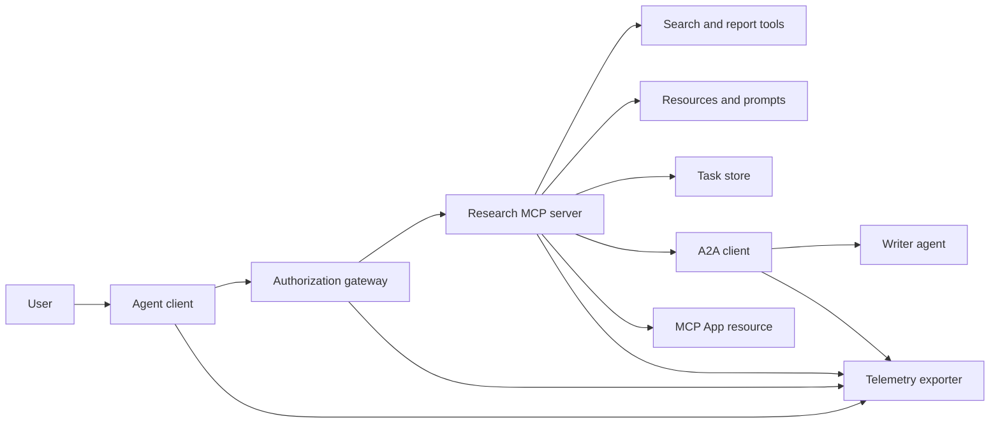
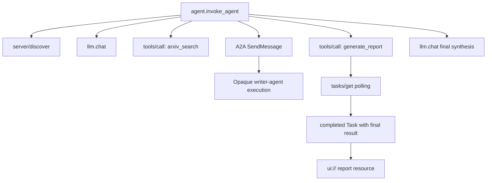
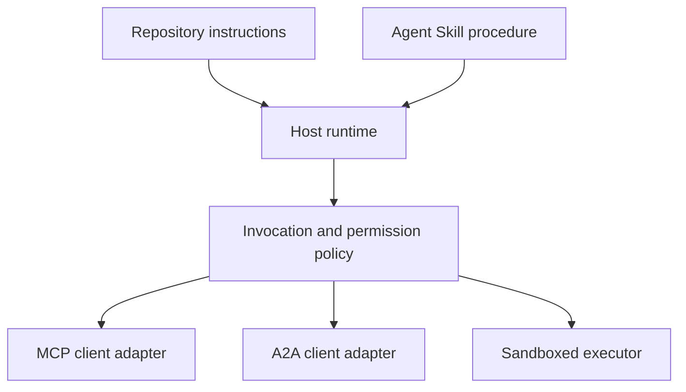

# الحجر الرئيسي: النظام البيئي للأدوات التي لا تملك جنسية

> نظام وكيل الإنتاج هو مجموعة من الحدود ، وليس كومة من الميزات. هذه الحجر النهائي يفصل محاكاة عملية قابلة للقراءة من عملاء البروتوكول ، وخادم التأذن ، صندوق الرمل ، ومصدر التلفاز الذي لا يزال يحتاج إلى نشر حقيقي.

**Type:** Build
**Languages:** Python (stdlib, in-process simulation)
**Prerequisites:** Phase 13 · 01 through 22, using MCP revision `2026-07-28`
**Time:** ~120 minutes

## أهداف التعلم

- قم بتكوين مكالمات الأدوات، والنتائج على شكل مهمة، والعمل المفوض، وموارد واجهة المستخدم، وسياسة الموافقة، وتتبع السجلات في تدفق واحد.
- تحمل إصدار بروتوكول ، هوية العميل ، والقدرات على كل طلب MCP بدلاً من الاعتماد على جلسة اتصال.
- اكتشف خادم قبل استخدامها وتعمل على العمل الطويل من خلال التوسع الرسمي للمهام.
- التمييز بين محاكاة على شكل بروتوكول من تنفيذ MCP أو A2A أو OAuth أو OpenTelemetry.
- خريط كل حدود محاكاة إلى مكون الإنتاج الذي يجب استبداله.
- إبق`AGENTS.md`, مهارات العميل , مُعدّلات وقت التشغيل , الأدوات , وسياسة الأمن في أدوارهم الصحيحة
- شرح أي ادعاءات يمكن التحقق منها من الناتج المحلي والتي تحتاج إلى اختبارات التكامل الحي.

## المشكلة

تصميم نظام بحث وتقرير. يطلب المستخدم ورقًا حول بروتوكولات الوكيل. يقوم النظام ببحث في كتالوج ورقية، ويمنح التوجيهات، ويتولى تقريرًا، ويرجع إلى موارد واجهة المستخدم، ويرتفع المسار عبر النظام.

هذه الجملة تخفي عدة عقود مستقلة:

- مخطط أداة يستهدف النموذج
- ملف طلب غير تابع للدولة وعقد اكتشاف الخادم
- قرار البوابة للفاعل والطاق و هوية الأداة
- عقد تشغيل طويل الأمد؛
- بروتوكول التفويض؛
- جسر من مضيف إلى تطبيق
- التكاثر والصادرة
- إجراءات تشغيل قابلة لإعادة الاستخدام.

`code/main.py`يظل هذه الحدود مرئية مع وظائف Python العادية والقواميس. لا يفتح النقل ، أو يواصل arXiv ، أو يقوم بتنفيذ OAuth ، أو يدعو خادم A2A ، أو يقوم بتصميم تطبيق MCP ، أو تصدير التلفزيون. وهذا يجعل تدفق التحكم سهلا للتفتيش دون تقديم محاكاة كخدمة متوافقة.

## المفهوم

### الهدف الهدف



الهندسة المعمارية هي تركيب مفاهيمي لنمطات البروتوكول العامة. إنها ليست ادعاءً عن الداخلية الخاصة لأي منتج.

### أثر الهدف



في تنفيذ حقيقي، كل هوب ينتشر سياق البصمة. يجب أن تتبع أسماء وخصائص المجالات الاتفاقيات التعريفية OpenTelemetry المدعومة من قبل إصدار الأداة المختار. لا يثبت معرف البصمة المشترك وحده وجود أصول صحيحة أو تصدير أو استهلاك الخلفية.

### السطحات الحالية للبروتوكول

استخدم أسماء الطرق التي حددتها البروتوكول الحالي، وليس أسماء تتذكر من مسودة قديمة:

| Boundary | Current surface | What the capstone simulates |
|---|---|---|
| MCP discovery | Mandatory `server/discover` | A direct function returning versions, capabilities, and server identity |
| MCP request context | Version, capabilities, and client identity in every `params._meta` | Fresh request metadata passed to every simulated call |
| MCP tool call | `tools/call` | Direct Python function dispatch |
| MCP task polling | `io.modelcontextprotocol/tasks` with `tasks/get` | A working handle followed by a completed task carrying its final result |
| A2A delegation | `SendMessage` in gRPC and JSON-RPC; `POST /message:send` in HTTP+JSON | One nested span with no remote call or artificial delay |
| MCP App calling a server tool | `app.callServerTool({ name, arguments })` | An HTML string with no live bridge |
| OAuth authorization | Authorization server, protected-resource metadata, audience and scope validation | Static token lookup and scope membership |
| OpenTelemetry | SDK, propagator, exporter, and collector or backend | In-memory span dictionaries |

أسماء البروتوكولات هي الطبقة الأولى فقط. يجب أن تقوم اختبارات الإنتاج بتنظيم التسلسل وفشل التصديق والإلغاء والوقت والإعادة المحاولات وتوافق النسخ عبر الأسلاك الحقيقية.

### يغير المؤسسة العاملة في المجال العنصري حدود التكامل

مراجعة`2026-07-28`يزيل جلسات البروتوكول و`initialize`- لا ، لا`notifications/initialized`يضغط يدك، كما أنه يزيل`Mcp-Session-Id`كل طلب يحمل هذه المساحات الاسمية`_meta`الحقول:

```json
{
  "io.modelcontextprotocol/protocolVersion": "2026-07-28",
  "io.modelcontextprotocol/clientCapabilities": {
    "extensions": {
      "io.modelcontextprotocol/tasks": {}
    }
  },
  "io.modelcontextprotocol/clientInfo": {
    "name": "capstone-client",
    "version": "1.0.0"
  }
}
```

يجب على الخادم تنفيذ `server/discover`. استخدام النتائج العادية`resultType: "complete"`؛ استخدامات معالجة المهام `resultType: "task"`كل نتيجة يجب أن تحدد الخادم في `_meta.io.modelcontextprotocol/serverInfo`. . .

تمديد المهام`tasks/get`،`tasks/update`و`tasks/cancel`أداة قد تعود أولاً`resultType: "task"`.`tasks/get`نفسها تعود`resultType: "complete"`، والكمل`Task`يحتوي على النتيجة النهائية.`tasks/result`و`tasks/list`الأساليب ليست جزءا من التوسع الحالي. يجب على العميل الإعلان `io.modelcontextprotocol/tasks`في نفس الطلب الذي قد يتلقى مسدسة المهمة. إذا لم يفعل ذلك، يعود الخادم `-32021`مع`requiredCapabilities`شكلها كشيء غائب للقدرة على العميل، بما في ذلك `extensions.io.modelcontextprotocol/tasks`. . .

### وضعية الأمن

النشر المقصود يستخدم الدفاع العميق:

- تصريح OAuth مع PKCE حيث يتطلب ذلك نوع العميل.
- التزاماً بالموارد والجمهور للوصول إلى رموز الوصول المصدرة؛
- البوابة RBAC التي تحقق من الأداة والمدى المطلوب؛
- الإثباتات المتقدمة التي تمت احتفاظها خارج سياق النموذج المرئي؛
- إشارة تصفية الأدوات المثبتة أو المراجعة؛
- مراجعة قاعدة الثانية لمعلومات غير موثوق بها والبيانات الحساسة والإجراءات التالية؛
- صندوق رمل تنفيذ يتم فرضه على نظام الملفات والعملية والشبكة والتصريحات والحدود الموارد خارج المهارة.

ينفذ الديمو رموز ثابتة فقط، وتحققات النطاق، وتصفيح الهاشز. هو مفيد لتدفق السياسات، وليس التحقق من الأمن.

### المهارات هي الإجراءات وليس النقل

يمكن لمهارة العميل أن تخبر الوقت الإجراء كيفية تنفيذ سير العمل البحثي ، وأي أدوات تعاقدات تتوقع ، وما هي الأدلة التي يجب حفظها ، ومتى يجب التوقف. لا يمكن أن تجعل خادم MCP موجودًا ، أو تحديد توافق A2A ، أو منح نطاقات ، أو إنشاء صندوق رمال.



أرسل دليل المهارات الكامل عندما تشير الإجراءات إلى ملفات المرافق. الفن السطحي في هذه الحجر الأساسي القديم هو خطة مسار، وليس دليل على أن مضيف يحافظ على مجموعة محمولة. الدروس 24 إلى 27 بناء واختبار دورة حياة مجموعة كاملة.

### البيانات المتحركة في المقرر هي مُعدّل محلي

الكاتلوج الدراسي ومركز التثبيت يدرك الملفات المسطحة المسمى `skill-*.md`، ولكن هذه هي اتفاقية مخزن بدلا من عقد حزمة المهارات العميل المحمولة. قراءة المواد الأمامية الحد الأدنى لديهم فقط مفاتيح المستوى العلوي. هذا الدروس يبقي حقل الهوية المحمولة وحقل الكتالوج الدراسي على نفس المستوى:

```yaml
---
name: ecosystem-blueprint
description: Produce a full Phase 13 ecosystem architecture for a product need.
version: "1.0.0"
phase: "13"
lesson: "23"
tags: [mcp, capstone, ecosystem, architecture, a2a, otel]
---
```

`name`و`description`هي حقل الهوية المحمولة. `version`،`phase`،`lesson`و`tags`هي امتدادات الكتالوجية الخاصة بالدورة.`tags`كقائمة متواصلة`--tag capstone`يمكن أن تتطابق مع ذلك.

مهارة دليل محمولة قد تستخدم الخيار الاختياري `metadata`خريطة لبيانات التوسع ذات قيمة سلسلة. هذا لا يجعل `metadata`يمكن تبادلها مع مخطط الكتالوج لهذا المخبز. إذا كان هذا الملف مسطح تعيش`version`أو`tags`أدناه`metadata`، يفرط المصفح الحد الأدنى هذه المفاتيح المقطوعة ، ويستسجل الكتالوج نسخة فارغة ، و لا يمكن تصفية العلامات العلامة العثور على الفن. يجب على مضيفي الإنتاج استخدام محلل YAML آمن وتؤكيد مخططهم الموثوق الخاص.

### المحاكاة مقابل الإنتاج

| Layer | `code/main.py` | Production replacement | Required evidence |
|---|---|---|---|
| Discovery | `server_discover()` plus static `TOOLS` | `server/discover` followed by cache-aware `tools/list` | Wire transcript, deterministic order, and schema validation |
| Authentication | Token-keyed dictionary | OAuth authorization and resource server validation | Issuer, audience, scope, expiry, and failure tests |
| Authorization | Scope membership | Gateway policy bound to actor, tool, target, and tenant | Allow and deny audit cases |
| Search | Static paper fixtures | Search API or MCP server | Source provenance, ranking, and error tests |
| Tasks | Local handle plus immediate `tasks/get` | Durable `io.modelcontextprotocol/tasks` store with `tasks/get`, `tasks/update`, `tasks/cancel`, and TTL | State-transition, input, cancellation, and recovery tests |
| Delegation | Sleep plus nested span | A2A client and remote Agent Card | Contract, timeout, retry, and opacity tests |
| App | HTML string and URI | MCP Apps resource and `App` bridge | CSP, permissions, tool-call, and browser tests |
| Telemetry | In-memory list | OTel SDK and exporter | Collector receipt and trace-parent assertions |
| Sandbox | None | Host-enforced isolated executor | Escape, egress, secret, and resource-limit tests |

هذه الجدول هو حدود التسليم. إدارة محلية خضراء تؤكد المحاكاة فقط.

### خريطة المرحلة 13

| Lessons | Contribution |
|---|---|
| 01-05 | Tool interfaces, calls, schemas, structured results, and deterministic validation |
| 06-14 | Stateless MCP request envelopes, discovery, transports, resources, prompts, extensions, and Apps |
| 15-18 | Poisoning defenses, OAuth, gateways, registries, and production authentication |
| 19 | A2A message and task delegation |
| 20 | OpenTelemetry GenAI trace design |
| 21 | Model-provider routing |
| 22 | Portable skill contract and runtime boundary |

```figure
t3-capstone-chain
```

## بناءها

أطلقوا الحزام في العملية:

```bash
cd phases/13-tools-and-protocols/23-capstone-tool-ecosystem
python3 code/main.py
```

فحص خمسة أشياء:

1. `server/discover`الإعلانات الإصلاح `2026-07-28`ومدّة المهام
2. (أليس) تستطيع قراءة وتوليد تقرير بينما يتم رفض مكالمة (بوب) المكتوبة
3. كل فترة محلية في مسار واحد للموسيقي يشارك في تعريف واحد وتسجيلات تعريفات فترة الأب.
4. البيان يبدأ كمسؤولية مهمة.`tasks/get`يعود المهام المكتملة التي يحتوي النتيجة النهائية على نص و `ui://`الإشارة
5. يظل الكاتب المفوض غير مرئي لأن الموسيقي يسجل فقط المدى الحدودي.
6. لا توجد دعوامات إنتاجية عن اتصال الشبكة أو تبادل OAuth أو تصدير المستجم ، أو عرض المتصفح ، أو تنفيذ مربع الرمال.

النص يبدأ مرتين، لذلك ينتج اثنين من أثر الجذر. إدخالات التدقيق هي عملية محلية وإعادة تعيين في التشغيل التالي.

## استخدمها

دعم طبقة واحدة في كل مرة:

1. استبدل`server_discover()`و قائمة الأدوات الثابتة مع حقيقية `server/discover`و`tools/list`إرسال الإصدار والهوية والقدرات في كل طلب
2. استبدال الرموز الثابتة بخادم تصريح وتحقق المصادقة الموارد المحمية.
3. تنفيذ`io.modelcontextprotocol/tasks`التوسع والاختبار`tasks/get`،`tasks/update`،`tasks/cancel`، التوقف ، TTL ، وإعادة تشغيل التعافي. لا تضيف`tasks/result`أو`tasks/list`. . .
4. استبدل القنبلة التفويضية بعميل A2A الذي يحل بطاقة العميل ويرسل رسالة.
5. قم ببناء التطبيق باستخدام SDK الرسمي ودعوة أدوات الخادم من خلال `app.callServerTool`. . .
6. تمتد التصدير إلى جمع اختبار وتؤكد الأصل عند المستلم.
7. إشغال أداة وتنفيذ النص داخل عقد صندوق الرمل من الدروس 26.
8. حزم الإجراء كحزمة إداري كاملة ومر بوابة إطلاق الدروس 27.

كل ترقية تحتاج إلى اختبار تكامل يعبر الحدود الجديدة. لا تتمحى اختبارات السياسة المستوى السفلي عندما يصبح السلك حقيقي.

## أرسله

هذا الدرس يُنتج`outputs/skill-ecosystem-blueprint.md`، وهو متجر دورة واحد متكرر. يطلب بنية صفحة واحدة تغطي البدائيات والأمن والوكالة والمتنقلات والحزمة، والخطر التشغيلي الصعب. يتم ممارسة حقل الكتالوج على مستوى الأعلى من قبل الكتالوج الحقيقي للمخزن والمتصفحات المثبتة.

ولأن هذا ليس مجموعة من المجلدات، فإنه لا يمكن أن يحمل الإشارات، والنصوص، والأصول، أو تصميمات تقييم. استخدم شكل الحزمة من الدروس 22 و 24 إلى 27 عند نشر مهارة قابلة للاستعمال خارج هذه الدورة.

## التمارين

1. أركض`code/main.py`.حقائق منفصلة أثبتت بالإنتاج من ادعاءات الإنتاج التي لا تزال بحاجة إلى دليل على التكامل.
2. إضافة آخر خلفية ثابتة وتحديد قاعدة التصادم لعددين من الأدوات ذات الاسم نفسه. ثم استبدال كلتا القوائم بالواقع `tools/list`مكالمات
3. استبدل خريطة الكاتب بخادم اختبار A2A، سجل بطاقة العميل، طلب الرسالة، مسار الموعد، والشئ المرجع.
4. إضافة مخزن المهام الذي يتبقى من إعادة تشغيل العملية. إثبات العميل يمكن استئناف مع `tasks/get`، الإحترام`pollIntervalMs`، وقراءة النتيجة النهائية للمهمة المكتملة دون `tasks/result`. . .
5. قم ببناء تطبيق MCP بسيط وتحقق`app.callServerTool`في متصفح مع CSP مقيد والإذن الصريحة.
6. تصدير المدة المحاكاة من خلال SDK OTel إلى جمع محلي. تأكيد الإيصالات، وتعريفات البحث، والآباء، وحالة الخطأ.
7. اكتب`AGENTS.md`لقيود الصيانة على مستوى المكتبة ومجموعة مهارات منفصلة لإجراء البحث القابل لإعادة الاستخدام. شرح لماذا لا يمنح أي من الملفات سلطة الأدوات.

## الشروط الرئيسية

| Term | What people say | What it actually means |
|---|---|---|
| Capstone | "Everything wired together" | A staged integration whose simulated and live boundaries remain explicit |
| Protocol-shaped simulation | "It is basically MCP" | Local data and calls that resemble a protocol without implementing its wire contract |
| Tasks extension | "Long tool call" | An optional `io.modelcontextprotocol/tasks` lifecycle with durable identity, polling, client input, final result, and cancellation semantics |
| Opacity boundary | "The other agent handles it" | The caller sees the declared interface and artifacts, not private reasoning or internal state |
| Runtime adapter | "Skill integration" | Host code that maps portable procedure to discovery, invocation, tools, policy, and context |
| Integration evidence | "It passed" | A transcript, artifact, or receiver-side observation proving the real boundary was crossed |

## المزيد من القراءة

- [MCP specification 2026-07-28](https://modelcontextprotocol.io/specification/2026-07-28)لطلبات غير تابعة للولاية، والاكتشافات، والأدوات، والإذن، وسلوك النقل.
- [MCP 2026-07-28 key changes](https://modelcontextprotocol.io/specification/2026-07-28/changelog)لإنزال جلسة، البيانات المعدنية حسب الطلب، MRTR، التوسع، والإزالة.
- [MCP Tasks extension](https://tasks.extensions.modelcontextprotocol.io/specification/draft/tasks)لـ`tasks/get`،`tasks/update`،`tasks/cancel`ونتائج النهائية التي تمت بقيامها بمهمات نهائية.
- [MCP Apps SDK](https://github.com/modelcontextprotocol/ext-apps/blob/main/docs/overview.md)لـ`App`و`app.callServerTool`. . .
- [A2A protocol](https://a2a-protocol.org/latest/)للكارطات العميلة، وتسليم الرسائل، والمهام، والقطع الأثرية، والترقل.
- [OpenTelemetry GenAI semantic conventions](https://opentelemetry.io/docs/specs/semconv/gen-ai/)لـ"تعاقد" و"تعاقد"
- [Agent Skills specification](https://agentskills.io/specification)بالنسبة لعقد الحزمة المحمولة المستخدمة في الطبقة الإجرائية.
