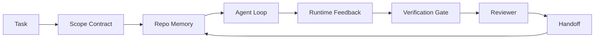

# هندسة الوكيلات: لماذا لا تزال النماذج القادرة تفشل

> نموذج قادر ليس كافيا. العملاء الموثوقين يحتاجون إلى مقعد عمل: التعليمات، الحالة، نطاق، ردود الفعل، التحقق، المراجعة، والإرسال. إزالة هؤلاء بعيدا وحتى نموذج الحدود ينتج عمل غير آمن لنقل.

**Type:** Learn + Build
**Languages:** Python (stdlib)
**Prerequisites:** Phase 14 · 01 (Agent Loop), Phase 14 · 26 (Failure Modes)
**Time:** ~45 minutes

## أهداف التعلم

- إمكانية النموذج منفصلة عن موثوقية التنفيذ.
- أسمائ السطح السبع الذي يقرر ما إذا كان العميل يُنقل
- مقارنة تشغيل سريع فقط مع تشغيل مقعد عمل على مهمة استرداد صغيرة.
- قم بتصنيع تقرير حالة الفشل الذي يخطط كل سطح مفقود إلى الأعراض التي تسببت به.

## المشكلة

يمكنك إلقاء نموذج الحدود في إعادة التأمين الحقيقي وطلب منه إضافة تأكيد المدخل. فإنه يفتح أربعة ملفات، ويكتب رمز معقول، ويعلن نجاحا، ويقف. تقوم بإجراء الاختبارات. فشلت اثنان. يتم لمس ملف ثالث الذي لم يكن له أي علاقة بالتأكيد. لا يوجد سجل لما افترضته الوكيل، ما حاول أولا، أو ما تبقى للقيام به.

لم يكن النموذج مخطئاً بشأن بايثون، كان مخطئاً بشأن العمل، لم يكن لديه فكرة عن ما يعتبر أنه قد تم، أين يسمح له بكتابة، ما هي الاختبارات المعتمدة، أو كيف كان من المفترض أن تستمر الجلسة التالية.

هذا ليس خطأ نموذجي إنه خطأ في منصة العمل السطح المحيط بالوكيل يفتقد الأجزاء التي تحول جيل واحد إلى هندسة موثوقة ويمكن إعادة عملها

## المفهوم

منصة العمل هي بيئة العمل التي تغلف النموذج أثناء المهمة.

| Surface | What it carries | Failure when missing |
|---------|-----------------|----------------------|
| Instructions | Startup rules, forbidden actions, definition of done | Agent guesses what shipping means |
| State | Current task, touched files, blockers, next action | Each session restarts from zero |
| Scope | Allowed files, forbidden files, acceptance criteria | Edits leak into unrelated code |
| Feedback | Real command output captured into the loop | Agent declares success on a 400 |
| Verification | Tests, lint, smoke run, scope check | "Looks good" reaches main |
| Review | A second pass with a different role | Builder marks own homework |
| Handoff | What changed, why, what is left | Next session re-discovers everything |

المكتب مستقل عن النموذج يمكنك تغيير النموذج والحفاظ على السطحات لا يمكنك تغيير السطحات والحفاظ على موثوقيتها



الحلقة تغلق على الملف الحالي، وليس على تاريخ الدردشة. الدردشة متقلبة. الردشة هي نظام تسجيل.

### منصة العمل مقابل هندسة الفوركس

يخبر الإشارة النموذج بما تريد هذا التحول. يخبر مكتب العمل النموذج كيفية القيام بالعمل عبر التحولات وعبر الجلسات. معظم قصص فشل العميل هي فشل مكتب العمل يرتدي ملابس الهندسة الإشارة.

### منصة العمل مقابل الإطار

إطار يعطيك وقت تشغيل (LangGraph، AutoGen، Agents SDK) ، ميزة العمل يعطي وكيل مكان للعمل داخل ذلك الوقت. تحتاج إلى كليهما. هذا المسار الصغير هو عن الثاني.

### التفكير من البدائيات، وليس من تصنيفات البائعة

هناك الكثير من الكتابة حول "هندسة الحبال" الآن. أددي أوسماني، OpenAI، الأنثروپي، لانج تشين، مارتن فولر، مونغودبي، هيومن لاير، كود إضافي، فكر العمل، المختبرات المشي قائمة رائعة، واندفاع مستمر من الوسط والهاكر الأخبار قطعة كل يحملون ذلك. يختلفون حول حدود ما هو الحزام، ما هو في نطاق، وما هي المفردات التي يجب استخدامها. نحن لا نحتاج إلى اختيار جانب. السطح السبع هو طبقة UX؛ تحت كل مقعد عمل هو نفس مجموعة من النظم الموزعة البدائية التي تحتفظ أي خلفية موثوقة.

إزالة علامة الوكيل للحظة. إنّ عملية التشغيل هي الحسابات التي تتقاطع بين الوقت والعمليات والآلات. لجعلها موثوقة تحتاج إلى نفس الأصول التي يحتاجها أي نظام إنتاج.

| Primitive | What it is | What it carries for an agent |
|-----------|------------|------------------------------|
| Function | Typed handler. Pure where possible. Owns its inputs and outputs. | A tool call, a rule check, a verification step, a model invocation |
| Worker | Long-lived process that owns one or more functions and a lifecycle | The builder, the reviewer, the verifier, an MCP server |
| Trigger | Event source that invokes a function | Agent loop tick, HTTP request, queue message, cron, file change, hook |
| Runtime | The boundary that decides what runs where, with what timeouts and resources | Claude Code's process, LangGraph's runtime, a worker container |
| HTTP / RPC | The wire between caller and worker | Tool-call protocol, MCP request, model API |
| Queue | Durable buffer between trigger and worker; back-pressure, retry, idempotency | The task board, the feedback log, the review inbox |
| Session persistence | State that survives crashes, restarts, model swaps | `agent_state.json`, checkpoints, KV stores, the repo itself |
| Authorization policy | Who can call what function with which scope | Allowed/forbidden files, approval boundaries, MCP capability lists |

الآن خريطة السطح السبع من سطح سطح المكتب على تلك البدائية.

- **Instructions** سياسة + وظيفة البيانات المعدنية القواعد هي التحقق (ال وظائف).`AGENTS.md`) هو السياسة المرتبطة بدء وقت التشغيل.
- **State** استمرارية الجلسة. مخزن مفتاح يقرأ وقت تشغيل في كل خطوة. الملف، KV، أو DB؛ والاستمرارية المفاهيم، الخلفية التخزين لا.
- **Scope** سياسة الموافقة لكل مهمة. الكرات المسموح بها / المحظورة هي ACL. الموافقة المطلوبة هي شبكة الموافقة.
- **Feedback**سجل الدعوة مكتوب في صف كل مكالمة غلاف هو سجل، ودائم، قابل للرد.
- **Verification** وظيفة. تحديد على المدخلات. تُثير عند إغلاق المهمة. فشل.
- **Review** عامل منفصل لديه حق القراءة فقط على أدوات البناء و كتابة فقط على تقارير المراجعة.
- **Handoff**سجل دائم يتم إصداره بواسطة محفز نهاية الجلسة. محفز بدء الجلسة التالية يقرأه.

حلقة الوكيل نفسها هي عامل استهلك الأحداث (رسالة المستخدم، نتيجة الأداة، علامة التوقيت) ، ودعوة الوظائف (النموذج، ثم الأدوات التي يختارها النموذج) ، وكتب السجلات (الوضع، التعليقات) ، وإصدار محفزات (التحقق، المراجعة، التسليم). لا يوجد لغز؛ نفس الشكل مثل معالج العمل.

### النماذج في الدورة التداولية، مترجمة إلى الأصول البدائية

كل نمط من أشكال الحزام الشعبية يقلل إلى الثمانية البدائية.

| Vendor or community pattern | What it actually is |
|------------------------------|--------------------|
| Ralph Loop (Claude Code, Codex, agentic_harness book) — re-inject original intent into a fresh context window when the agent tries to stop early | A trigger that re-enqueues a task with a clean context; session persistence carries the goal forward |
| Plan / Execute / Verify (PEV) | Three workers, one per role, communicating via state and a queue between phases |
| Harness-compute separation (OpenAI Agents SDK, April 2026) — split control plane from execution plane | Restating control-plane / data-plane. Predates the agent label by decades |
| Open Agent Passport (OAP, March 2026) — sign and audit every tool call against a declarative policy before execution | An authorization policy enforced by a pre-action worker, with a signed audit queue |
| Guides and Sensors (Birgitta Böckeler / Thoughtworks) — feedforward rules + feedback observability | Authorization policy + verification functions + observability traces |
| Progressive compaction, 5-stage (Claude Code reverse engineering, April 2026) | A state-management worker that runs cron-like over session persistence to keep it within a budget |
| Hooks / middleware (LangChain, Claude Code) — intercept model and tool calls | Triggers + functions wrapped around the runtime's invocation path |
| Skills as Markdown with progressive disclosure (Anthropic, Flue) | A function registry where the function metadata is loaded into context just-in-time |
| Sandbox agents (Codex, Sandcastle, Vercel Sandbox) | The compute plane: a runtime with isolated filesystem, network, and lifecycle |
| MCP servers | Workers exposing functions over a stable RPC, with capability lists as authorization |

كل إدخال في هذه الجدول هو مجتمع الوكيل يصل إلى بدائي كان لديه بالفعل اسم في الأنظمة الموزعة ويعطيه اسم جديد. علامات مفيدة للتسويق؛ غير مفيدة كمتلكات الهندسة.

### ما الذي يقوله الإيصالات

دعوى الحزام على النموذج لديها أرقام وراءها الآن، يستحق المعرفة، لأنها أيضاً هي الحجة الشريفة الوحيدة ضد "انتظر فقط نموذج أكثر ذكاءً".

- مقعد المحطة 2.0  نفس النموذج، تغيير الحوارة نقل وكيل التشفير من خارج العليا 30 إلى المرتبة الخامسة (LangChain، * أناثومية وكيل الحوارة *).
- قام Vercel  بحذف 80% من أدوات وكيلها؛ قفز معدل النجاح من 80% إلى 100% (MongoDB).
- لقد مضاعف الوكلاء القانونيون أكثر من ضعف دقة من خلال تحسين الحركة وحدها (MongoDB).
- 88% من مشاريع وكلاء الذكاء الاصطناعي المؤسسات لا تصل إلى الإنتاج. تتجمّع الفشل حول وقت التشغيل، وليس التفكير (preprints.org، * Harness Engineering for Language Agents*, مارس 2026).
- أبلغت دراسة مقياس 2025 عبر ثلاثة إطارات مفتوحة المصدر الشعبية عن إكمال المهام بنسبة ~ 50%؛ انخفض موقع الويب في السياق الطويل من 40-50٪ إلى أقل من 10٪ في ظروف السياق الطويل ، ويرجع ذلك في الغالب إلى حلقات لا نهاية لها وفقدان الأهداف (تغطيت على نطاق واسع في بداية كتابات عام 2026).

لا يقتصر الأمر على "العباءات على الأبد". النماذج تستوعب خدوش الحملات مع مرور الوقت. والبداية هي أن اليوم، الهندسة الحاملة للعباءات حول النموذج، وليس داخلها، والبدائيات التي تحمل هذه الحملة هي تلك التي كان كل نظام إنتاج يحتاجها دائما.

### حيث توقف إشارات البائع قصيرة

هذا هو الجزء الذي لا تحتاج إلى أن تكون مهذبة حول.

- يحتوي نظام لينغ تشين على 11 عنصرًا: تلميحات، أدوات، معجون، صناديق رمل، تشكيل، ذاكرة، مهارات، مضاعفات، و"حلقة غبية" في وقت التشغيل. لا يذكر ذلك صفوف العمال وحدة التنفيذ، أو أساسية الإطلاق، أو استمرار الجلسة كقلق منفصل، أو سياسة الموافقة. يعامل الحزمة كشيء تقوم بتكوينه، وليس كنظام تقوم بتنفيذه.
- إددي أوسماني "هندسة الوساطة العميلة"`Agent = Model + Harness`و نمط الرشة، ولكن لا يذكر ما هو الخيط من المُبني.
- إن الأنثروبيك و OpenAI تذهب أعمق على السطحات ولكن تبقى داخل أوقات تشغيلها الخاصة. إعلان "فصل الحاسوب من الحبال" في أبريل 2026 وكلاء SDK هو أول قطعة من البائعين التي تؤيد صراحة الانقسام من طائرة التحكم / طائرة البيانات. هذه فكرة بدائية ، وليس جديدة.
- كتاب agentic_harness يعامل الحزام كشيء تشكيل (جايمين ويست * Agentic Engineering * الفصل 6) والخط الأقوى فيه هو "الحزام هو الحدود الأمن الرئيسية في نظام وكالة". وهذا هو مجرد سياسة الموافقة، أعاد.
- يواصل حلقات الأخبار الهالكة الوصول إلى نفس المكان. يجادل حلقات أبريل 2026 * يقع الحزام الوكيل خارج صندوق الرمل * أن الحزام يجب أن يجلس "أكثر مثل المرشح المضاد الذي يجلس خارج كل شيء ويسمح بالوصول بناء على السياق والمستخدم". وهذا مرة أخرى ، سياسة الموافقة على أنها طائرة منفصلة.

لا تحتاج إلى أن تتعارض مع أي من هذه القطع لملاحظة الفجوة. إنهم يكتبون وصفات UX لنظام موجود بالفعل. نحن نكتبون النظام. عندما يتم بناء النظام بشكل صحيح، تسقط السطحات السبع من البدائيات. عندما يتم بناؤه بشكل خاطئ، لا يوجد كمية `AGENTS.md`"بولش" تصحيح الصف المفقود.

لذا عندما تسمع "هندسة القوائم" في مكان آخر، ترجمة إلى البدائية. القواعد والإرشادات هي السياسة والوظائف. الرفع هو الوقت الذي يُجري فيه الحراسة هي الإذن + التحقق. الكوكس هي المحفزات الذاكرة هي استمرار الجلسة "المركز الرالف" هو التسلل السباقات عمال صناديق الرمل هي طائرات الحوسبة المفردات تتغير، الهندسة لا. المكتب هو UX المتحرك المتحرك المتحرك؛ الحزمة، في المفهوم الذي يتبقى على قيد الحياة في إعادة إطار البائع التالي، هي وظائف، العمال، المحفزات، أوقات التشغيل، الصفوف، الاستمرار، والسياسة مرتبطة معا بشكل صحيح.

```figure
wb-seven-surfaces
```

## بناءها

`code/main.py`يقوم البرنامج بتشغيل مهمة إعادة التشغيل الصغيرة مرتين. أولاً فقط على الفور، ثم مع السطحات السبعة المحمولة. نفس النموذج، نفس المهمة. يقوم النص بعد الأقوال التي كانت مفقودة في الإجراء الفاشل ويطبق تقرير وضع الفشل.

مهمة الاسترداد صغيرة على وجه الخصوص: إضافة تصحيح المدخل إلى معالج فيديو FastAPI نمط واحد و كتابة اختبار اجتياز.

إشغله

```
python3 code/main.py
```

الناتج: سجل جنب إلى جنب من الركبتين ،`failure_modes.json`و تقريراً واحداً لرحلة العمل

الوكيل هو قاعدة قاعدة صغيرة القاعدة، والنقطة هي السطحات، وليس النموذج. عبر بقية هذا المسار الصغير سوف تعيد بناء كل سطح كحقيقي،

## استخدمها

هناك بالفعل ثلاث أماكن على سطح المكتب في البرية، حتى لو لم يطلق عليها أحد هذا:

- **Claude Code, Codex, Cursor.** `AGENTS.md`و`CLAUDE.md`أوامر المقاطعة هي نطاق، والقبضات هي التحقق
- **LangGraph, OpenAI Agents SDK.**نقاط التفتيش والمتاجر هي سطح الولاية
- **CI on a real repo.**الاختبارات والفراءات والتحقق من النوع هو التحقق، نموذج العلاقات العامة هو التسليم، المالكين من المخططين للمراجعة.

هندسة منصة العمل هي تخصص جعل تلك السطحات صريحة ويمكن إعادة استخدامها، بدلاً من ترك كل فريق لإعادة اكتشافها.

## أرسله

`outputs/skill-workbench-audit.md`هي مهارة محمولة تقوم بمراجعة إعادة التأمين القائمة لسطحات ورقائح مكتب العمل السبع التي تفتقر إليها، والتي هي جزئية، والتي هي صحية. ضعها بجانب أي إعداد وكيل؛ فإنه يخبرك ما يجب إصلاحه أولا.

## التمارين

1. اختر إعادة التأمين حيث كنت تشغل بالفعل وكيل. تسجل السطحات السبع من 0 (المفقود) إلى 2 (الصحي). ما هي أضعف سطحك؟
2. التمديد`main.py`لذا فإنّ الركض على الفور فقط يُنتج أيضاً ادعاءً مزيفًا "نجاحًا".
3. أضف سطح ثامن لمنتجك، واطرح لماذا لا ينهار في أحد السبع الموجودة.
4. إعادة تشغيل النص مع عامل آخر يوحي كتابة ملف إضافي
5. خريطة خمسة أوضاع الفشل المتكررة في الصناعة من المرحلة 14 · 26 على السطحات السبع. أي وضع مصمم لكل سطح لمستيعابه؟

## الشروط الرئيسية

| Term | What people say | What it actually means |
|------|----------------|------------------------|
| Workbench | "The setup" | Engineered surfaces around the model that make work reliable |
| Surface | "A doc" or "a script" | A named, machine-readable input the agent reads or writes every turn |
| System of record | "The notes" | The file the agent treats as truth when chat history is gone |
| Definition of done | "Acceptance" | An objective, file-backed checklist the agent cannot fake |
| Workbench audit | "Repo readiness check" | A pass over the seven surfaces that flags missing pieces before work begins |

## المزيد من القراءة

اقرأ هذه النقاط كبيانات وليس كسلطات. كل منها تصنيف جزئي. ترجم كل مفهوم مرة أخرى إلى بدائي (العمل، العامل، الزناد، وقت التشغيل، HTTP / RPC، الصف، الاستمرار، السياسة) قبل أن تقرر ما إذا كان يجب اعتمادها.

إطارات البائع:

- [Addy Osmani, Agent Harness Engineering](https://addyosmani.com/blog/agent-harness-engineering/) `Agent = Model + Harness`و نمط الرشاشة؛ رقيق على البنية التحتية
- [LangChain, The Anatomy of an Agent Harness](https://blog.langchain.com/the-anatomy-of-an-agent-harness/) 11 مكون: الإشارات والأدوات والقبضات والترتيبات والقواطيس الرملية والذاكرة والمهارات والإستراتيجيات الفرعية والوقت التشغيلي، وتفشيل الصفوف والتنفيذ والإصدار
- [OpenAI, Harness engineering: leveraging Codex in an agent-first world](https://openai.com/index/harness-engineering/) وجهة نظر فريق كودكس على السطحات حول وقت تشغيلها
- [OpenAI, Unrolling the Codex agent loop](https://openai.com/index/unrolling-the-codex-agent-loop/) حلقة الوكيل تقلل إلى `while`على المكالمات الوظيفية
- [Anthropic, Effective harnesses for long-running agents](https://www.anthropic.com/engineering/effective-harnesses-for-long-running-agents) سطحات طويلة الأفق داخل وقت تشغيل معين
- [Anthropic, Harness design for long-running application development](https://www.anthropic.com/engineering/harness-design-long-running-apps) ملاحظات التصميم المطبقة
- [LangChain Deep Agents harness capabilities](https://docs.langchain.com/oss/python/deepagents/harness) سطح تشكيل الوقت

قطعة ممارس مع تفاصيل قابلة للاستخدام:

- [Martin Fowler / Birgitta Böckeler, Harness engineering for coding agent users](https://martinfowler.com/articles/harness-engineering.html) دليل (إرسال إلى الأمام) + أجهزة استشعار (ردود); أطهر إطار نظرية التحكم
- [HumanLayer, Skill Issue: Harness Engineering for Coding Agents](https://www.humanlayer.dev/blog/skill-issue-harness-engineering-for-coding-agents)"إنه ليس مشكلة نموذج، بل مشكلة تشكيل"
- [MongoDB, The Agent Harness: Why the LLM Is the Smallest Part of Your Agent System](https://www.mongodb.com/company/blog/technical/agent-harness-why-llm-is-smallest-part-of-your-agent-system)الإيصالات: 80٪ إلى 100٪، دقة هارفي 2x، مقعد المحطة أعلى 30 إلى أعلى 5
- [Augment Code, Harness Engineering for AI Coding Agents](https://www.augmentcode.com/guides/harness-engineering-ai-coding-agents) القيود - المشي الأول
- [Sequoia podcast, Harrison Chase on Context Engineering Long-Horizon Agents](https://sequoiacap.com/podcast/context-engineering-our-way-to-long-horizon-agents-langchains-harrison-chase/) مخاوف في الوقت المحدد على المخاوف في النموذج

الكتب والأوراق والتطبيقات المرجعية:

- [Jaymin West, Agentic Engineering — Chapter 6: Harnesses](https://www.jayminwest.com/agentic-engineering-book/6-harnesses) معالجة طول الكتاب، يعامل الحزام كحد الأمن الأساسي
- [preprints.org, Harness Engineering for Language Agents (March 2026)](https://www.preprints.org/manuscript/202603.1756)الإطار الأكاديمي كسيطرة / وكالة / وقت التشغيل
- [walkinglabs/awesome-harness-engineering](https://github.com/walkinglabs/awesome-harness-engineering) قائمة قراءة منتظمة عبر السياق، التقييم، قابلية الملاحظة، التنسيق
- [ai-boost/awesome-harness-engineering](https://github.com/ai-boost/awesome-harness-engineering) قائمة مختصة بديلة (الأدوات، التقييمات، الذاكرة، MCP، الإذن)
- [andrewgarst/agentic_harness](https://github.com/andrewgarst/agentic_harness) تنفيذ مرجع جاهز للإنتاج مع مجموعة الذاكرة والقياس المدعومة من Redis
- [HKUDS/OpenHarness](https://github.com/HKUDS/OpenHarness) حزمة عامل مفتوحة مع عامل شخصي مدمج

خيوط الأخبار الفاسدة تستحق القراءة بسبب الخلافات، وليس الإجماع:

- [HN: Effective harnesses for long-running agents](https://news.ycombinator.com/item?id=46081704)
- [HN: Improving 15 LLMs at Coding in One Afternoon. Only the Harness Changed](https://news.ycombinator.com/item?id=46988596)
- [HN: The agent harness belongs outside the sandbox](https://news.ycombinator.com/item?id=47990675) يجادل للحصول على الترخيص كطائرة منفصلة

الإشارات المتقاطعة داخل هذا المناهج الدراسية:

- المرحلة 14 · 23  OpenTelemetry GenAI الاتفاقيات: طبقة الملاحظة أجهزة الاستشعار أدب نقاط في
- المرحلة 14 · 26  وضع الفشل الكتالوج السبع السطحات مصممة لمصاص
- المرحلة 14 · 27  الدفاعات الفورية للحقن التي تقع في سياسة الإذن البدائية
- المرحلة 14 · 29  أوقات تشغيل الإنتاج (الصف، الحدث، cron): حيث يعيش البدائيون في هذا الدروس في الانتشار
