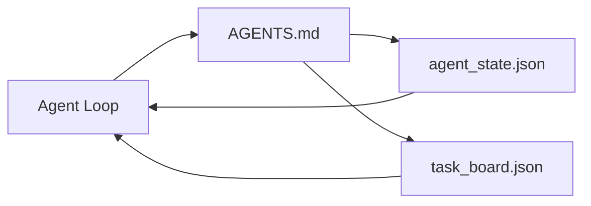

# مكتب العمل الحد الأدنى للعميل

> أصغر مقعد عمل مفيد هو ثلاثة ملفات: جهاز توجيه التعليمات الجذرية، وملف الحالة، ولوحة المهام. كل شيء آخر يتم وضعها على الطبقات. إذا لم يتمكن repo من تحمل هذه الثلاثة، لن يتم حفظها من أي نموذج.

**Type:** Build
**Languages:** Python (stdlib)
**Prerequisites:** Phase 14 · 31 (Why Capable Models Still Fail)
**Time:** ~45 minutes

## أهداف التعلم

- حدد الملفات الثلاثة التي تشكل الحد الأدنى من منصات العمل القابلة للتطبيق.
- اشرح لماذا جهاز توجيه الجذر القصير يفوق جهاز توجيه الجذر المتوحد الطويل`AGENTS.md`. . .
- بناء ملف الحكومة يمكن للعميل قراءة في كل دور و الكتابة في النهاية.
- بناء لوحة مهمة التي تتعافى من عمل جلسات متعددة دون تاريخ الدردشة.

## المشكلة

معظم الفريقات تتحرك إلى مكتب العمل من خلال كتابة خط 3000`AGENTS.md`النموذج يحمله، يتجاهل الأجزاء التي لا يمكن أن تلخصها، ومازال يفشل على نفس السطح التي فشلت دائماً.

تحتاج إلى العكس. ملف جذري صغير يوجّه الوكيل إلى ملفات أعمق فقط عندما يكون ذلك مناسباً. حالة دائمة يقرأ الوكيل قبل التصرف ويكتب بعد ذلك. لوحة مهمة تقول ما هو في الطيران، ما هو محظور، وما هو التالي.

ثلاث ملفات، كل منها لديه وظيفة، كل منها يمكن قراءته بالآلة بما فيه الكفاية لتطوره إلى نظام حقيقي في وقت لاحق.

## المفهوم



### AGENTS.md هو جهاز توجيه وليس دليل

جيد`AGENTS.md`هو قصير، إنه يشير إلى العميل إلى:

- ملف الدولة (أين أنت).
- اللوحة المهمة (ما تبقى)
- القواعد العميقة (في إطار`docs/agent-rules.md`)
- أمر التحقق (كيفية معرفة كيفية عمله)

أي شيء أطول يذهب في وثائق أعمق، يتم تحميلها فقط عندما يكون هناك حاجة. دليل طويل يتم تجاهله. متوجيهات قصيرة يتم اتباعها.

### الوكيل_state.json هو نظام السجل

الحالة تحمل: هوية المهمة النشطة، الملفات الملموسة، الافتراضات التي تم إجراؤها، الممنوعات، والعمل التالي. يقوم الوكيل بقراءتها في كل جولة. القائمة القائمة تقرأها بدلاً من إعادة تشغيل الدردشة.

الدولة تعيش في ملف لأن تاريخ الدردشة غير موثوق به، الأجتماعات تموت، المحادثات يتم قطعها، الملف لا.

### task_board.json هو الصف

اللجنة المهنية تقوم بكل مهمة مع وضعها`todo | in_progress | done | blocked`إنه الصف الذي يخرج منه العميل عندما تكون الحالة فارغة، والصف الذي تقرأه عندما تريد أن تعرف ما إذا كان العميل على الطريق الصحيح.

المهام على اللوحة لديها هوية، هدف، مالك (`builder`،`reviewer`أو`human`و معايير القبول. إن اللوحة صغيرة عمداً: عندما تنمو خارج الشاشة، تكون لديك مشكلة في التخطيط، وليس مشكلة في اللوحة.

### ثلاث ملفات هي الأرض، وليس السقف

الدروس اللاحقة تضيف عقود النطاق، ومدبّرات الملاحظات، وبوابات التحقق، وقوائم التحقق من المراجعة، وخطوط التسليم.

```figure
wb-three-files
```

## بناءها

`code/main.py`يكتب الحد الأدنى من منصة العمل إلى إعادة التأمين الفارغة ويدل على أن وكيل واحد يدير أن:

1. يقرأ`agent_state.json`. . .
2. سحب المهمة التالية من `task_board.json`إذا كانت الدولة فارغة
3. يلمس ملف واحد داخل نطاق
4. يكتب مرة أخرى حالة تحديث.

إشغله

```
python3 code/main.py
```

النص يخلق`workdir/`يضع الملفات الثلاثة بجانبه، ويركض دوراً واحداً، ويقوم بطبع الاختلاف، ويركضها مرة أخرى لرؤية كيف يستمر الجولة الثانية حيث توقف الجولة الأولى.

## استخدمها

داخل منتجات وكلاء الإنتاج، نفس الملفات الثلاثة تظهر تحت أسماء مختلفة:

- **Claude Code:** `AGENTS.md`أو`CLAUDE.md`لجهاز التوجيه، `.claude/state.json`-محلات نمطية للدولة، الكوكس للمجلس.
- **Codex / Cursor:**قواعد مساحة العمل للجهاز التوجيه، ذاكرة الجلسة للدولة، مهام الصف في شريط الجانب المحادثة للجهاز التدريجي.
- **Custom Python agent:**نفس الملفات التي كتبتها للتو

الاسماء تتغير، الشكل لا

## أنماط الإنتاج في البرية

ينجو الحد الأدنى من سطح العمل من الاتصال مع الاحتفاظ الحقيقي عندما يتم وضع ثلاثة أنماط فوقه.

**Nested `AGENTS.md` with nearest-wins precedence.**سفن OpenAI 88 `AGENTS.md`الملفات عبر repo الرئيسي، واحد لكل مكون فرعي. كودكس، كورسور، كود كود، وكوبيلوت جميع المشي من الملف العامل نحو جذور repo و تشبيك كل`AGENTS.md`ويقومون بإيجادهم في الطريق، وملفات الإداري الفرعي تمدد الملف الجذري`AGENTS.override.md`لتحل محل بدلا من تمديد؛ آلية الإغلاق هي محددة لـ Codex وتجنبها للعمل عبر الأدوات. قياس Code Augment هو الخط الذي يهم: أفضل `AGENTS.md`الملفات تعطي قفزة جودة تعادل الترقية من هايكو إلى أوبوس؛ والأسوأ من ذلك يجعل الخروج أسوأ من أي ملف على الإطلاق.

**Anti-patterns to refuse, even when they look like coverage.**تخلّص التعليمات المتناقضة السكينة من وضع التفاعل إلى وضع الطمع (ICLR 2026 AMBIG- SWE: 48.8% → 28% معدل حل) ؛ قم بتحديد الأولويات بدلاً من تكوينها مسطحة. قواعد النمط غير المؤكدة ("اتبع دليل نمط جوجل بايثون") بدون أمر إنفاذ يسمح للعميل بتخريج الامتثال ؛ مزج كل قاعدة نمط مع أمر lint الدقيق. القيادة بالنموذج بدلاً من الأوامر تدفن مسار التحقق؛ الأوامر أولاً، النموذج الأخير. الكتابة للبشر بدلاً من العملاء تُهدر الميزانية السياقية؛ والصغرية هي ميزة.

**Cross-tool symlinks.**ملف جذري واحد مع روابط متزايدة (`ln -s AGENTS.md CLAUDE.md`،`ln -s AGENTS.md .github/copilot-instructions.md`،`ln -s AGENTS.md .cursorrules`يحتفظ كل وكيل التشفير بنفس مصدر الحقيقة`nx ai-setup`تُتلقّم هذا عبر كلود كود، كورسور، كوبيلوتر، جيميني، كودكس، و اوبن كود من إعداد واحد.

## أرسله

`outputs/skill-minimal-workbench.md`يخلق منصة عمل ثلاث ملفات لأي إعادة التأمين الجديدة:`AGENTS.md`جهاز توجيه مصممة على المشروع`agent_state.json`مع المفاتيح الصحيحة، و `task_board.json`تم زرعها مع الخرق الحالي.

## التمارين

1. إضافة`last_run`العلامة الزمنية إلى `agent_state.json`- رفض تشغيل الملف إذا كان مسنًا أكثر من 24 ساعة إلا إذا أكد المدير.
2. إضافة`priority`الحقل إلى لوحة المهمات وتغيير السحب دائما اختيار أعلى الأولوية `todo`. . .
3. الهجرة`task_board.json`إلى خطوط JSON حتى كل مهمة هي سطر و diffs نظيفة في التحكم في النسخة.
4. اكتب`lint_workbench.py`هذا يفشل إذا`AGENTS.md`أكثر من 80 سطر أو مرجع إلى ملف غير موجود.
5. قرر أي من الملفات الثلاثة ستؤذي أكثر أن تخسر

## الشروط الرئيسية

| Term | What people say | What it actually means |
|------|----------------|------------------------|
| Router | `AGENTS.md` | Short root file that points the agent at deeper docs and files |
| State file | "The notes" | Machine-readable record of where the agent is, written every turn |
| Task board | "The backlog" | JSON queue of work with status, owner, acceptance |
| System of record | "Source of truth" | The file the workbench treats as authoritative when chat is gone |

## المزيد من القراءة

- [agents.md — the open spec](https://agents.md/) تم اعتمادها من قبل Cursor، Codex، Claude Code، Copilot، Gemini، OpenCode
- [Augment Code, A good AGENTS.md is a model upgrade. A bad one is worse than no docs at all](https://www.augmentcode.com/blog/how-to-write-good-agents-dot-md-files) قفزات جودة قياسية
- [Blake Crosley, AGENTS.md Patterns: What Actually Changes Agent Behavior](https://blakecrosley.com/blog/agents-md-patterns) ما يعمل تجريبياً، وما لا
- [Datadog Frontend, Steering AI Agents in Monorepos with AGENTS.md](https://dev.to/datadog-frontend-dev/steering-ai-agents-in-monorepos-with-agentsmd-13g0) الأهمية المرتبطة بالعيش في الممارسة
- [Nx Blog, Teach Your AI Agent How to Work in a Monorepo](https://nx.dev/blog/nx-ai-agent-skills) توليد مصدر واحد عبر ست أدوات
- [The Prompt Shelf, AGENTS.md Best Practices: Structure, Scope, and Real Examples](https://thepromptshelf.dev/blog/agents-md-best-practices/) القسم الذي يمنح النظام الذي نجى من مراجعة
- [Anthropic, Claude Code subagents](https://code.claude.com/docs/en/sub-agents)
- المرحلة 14 · 31  أنظمة الفشل هذا الحد الأدنى يمتص
- المرحلة 14 · 34  مخطط حالة دائمة هذا الدروس مقدمة
