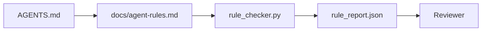

# تعليمات الوكيل كقيود قابلة للتنفيذ

> التعليمات المكتوبة على النص هي الرغبات. التعليمات المكتوبة على القيود هي الاختبارات. تحويل مكتب العمل كل قاعدة إلى شيء يمكن للعميل التحقق من خلال وقت التشغيل والمراجع التحقق من بعد الحقيقة.

**Type:** Build
**Languages:** Python (stdlib)
**Prerequisites:** Phase 14 · 32 (Minimal Workbench)
**Time:** ~50 minutes

## أهداف التعلم

- إفصاح النصوص التنفيذية عن القواعد التشغيلية
- قواعد البدء المفصّلة، والإجراءات المحظورة، وصف المفعول، ومعالجة عدم اليقين، وحدود الموافقة كقيود يمكن التحقق منها بواسطة الآلة.
- تنفيذ فحص القواعد الذي يسجل مسار ضد مجموعة القواعد.
- اجعل مجموعة القواعد متباينة حتى يمكن للمراجعة أن ترى ما تغير.

## المشكلة

عادة`AGENTS.md`يُخبر العميل أن يكون "حذرًا" و "يختبر بعناية" و "اسأل إذا لم يكن متأكداً". بعد ثلاثة أيام، يقوم العميل بإرسال تغيير دون إجراء أي اختبارات، ويكتب إلى دليل محظور، ولا يسأل أبداً لأنه لم يعرف أبداً أين كان الخط.

التعليمات قوية عندما تكون عملية و ضعيفة عندما تكون طموحة. الحل هو كتابة القواعد التي يمكن أن تفسرها مكتب العمل والمسجل أن يسجل.

## المفهوم

القواعد تنتمي إلى`docs/agent-rules.md`كل قاعدة لها اسم و فئة و شيك



### خمس فئات تغطي معظم القواعد

| Category | Question the rule answers | Example |
|----------|---------------------------|---------|
| Startup | What must be true before work begins? | "state file exists and is fresh" |
| Forbidden | What must never happen? | "do not edit `scripts/release.sh`" |
| Definition of done | What proves the task is complete? | "pytest exits 0 and acceptance line passes" |
| Uncertainty | What does the agent do when unsure? | "open a question note instead of guessing" |
| Approval | What requires human approval? | "any new dependency, any prod write" |

قاعدة لا تناسب واحدة من هذه الخمسة عادةً تريد أن تكون قاعدة اثنتين.

### القواعد قابلة للقراءة الآلية

كل قاعدة لديها طلقة، فئة، وصف واحد خط، و `check`الحقل الذي يسمي وظيفة في `rule_checker.py`إضافة قاعدة تعني إضافة شيك، والشيكر ينمو مع مكتب العمل.

### القواعد متباينة

القواعد تعيش واحدة لكل عنوان في ملف محدد واحد. تظهر الأسماء الجديدة في اختلافات. القواعد الجديدة تقع في أعلى فئةها. يتم حذف القواعد القديمة ، وليس التعليق عليها ، لأن مكتب العمل هو مصدر الحقيقة ، وليس سجل الدردشة حول كيف شعر الفريق الربع الماضي.

### القواعد مقابل الحواجز الإطارية

الحواجز الإطارية (حواجز OpenAI Agents SDK، تعطل LangGraph) تفرض القواعد على مستوى الوقت الزمني. القاعدة التي وضعت في هذا الدروس هي العقد القابل للقراءة من قبل الإنسان، قابلة للمراجعة التي تنفذ تلك الحواجز. تحتاج إلى كليهما: الوقت الزمني يلتقط الانتهاكات خلال التحول، وتثبت مجموعة القواعد أن الوقت الزمني يقوم بالأمر الصحيح.

### الكشف التدريجي: خريطة، وليس موسوعة

السبب`AGENTS.md`كل حادثة تضيف قاعدة ولا يحدث أي حادثة يزيل واحدة. بعد عام، الملف يبلغ ألفين سطر، ويقرأ الوكيل الشاشة الأولى، وينتهى من ميزانية الاهتمام، ويعمل على جزء صغير من ما قيل له. يفشل ملف تعليمات عملاقة بنفس السبب الذي يفشل فيه وثيقة إدخال أربعين صفحة: القارئ يقرأها مرة واحدة ولا يعود أبدا إلى الجزء الذي كان مهمًا.

الإصلاح ليس ملفاً أقصر. إنه ملف طبقاتي. يبقى جهاز توجيه الجذر صغيرًا بما يكفي لقراءة كل جلسة ولا يحمل سوى المؤشرات. العمق يعيش في ملفات الموضوع التي يقوم العميل بتحملها فقط عندما تلمسها المهمة. أعط العميل خريطة ، وليس كل المعرفة ، ودعها تمشي إلى الصفحة التي يحتاجها.

```
AGENTS.md                  # router, < 50 lines: what this repo is, where to look, the 5 hard rules
docs/
  agent-rules.md           # the full rule set (this lesson)
  architecture.md          # loaded when the task touches module boundaries
  testing.md               # loaded when the task writes or runs tests
  deploy.md                # loaded only for release work, gated behind an approval rule
feature_list.json          # the backlog (Phase 14 · 36)
```

| Tier | Lives in | Read when | Size budget |
|------|----------|-----------|-------------|
| Router | `AGENTS.md` | Every session, always | Under ~50 lines |
| Rules | `docs/agent-rules.md` | Every session, on startup | One screen per category |
| Topic docs | `docs/<topic>.md` | Only when the task touches that topic | As deep as needed |

اختبارات إثنان تبقي الطبقة صادقة اختبار الوصول: يجب على الوكيل الوصول إلى أي قاعدة في أقصى وقت مرتين من الجهاز التوجيه، لذلك يجب على الجهاز التوجيه ربط كل موضوع وثيقة عن طريق، وليس وصفه بالنص. اختبار الطفولة: هو الجهاز القصير بما فيه الكفاية ليقرأها المراجعة مرة أخرى على كل علاقات إعلامية، وهو الشيء الوحيد الذي يمنعها من النمو بهدوء مرة أخرى في الموسوعة التي استبدلها. مؤشر لم يعد يصلح هو فشل أسوأ من قاعدة مفقودة، لذلك ربط مكسور في جهاز التوجيه هو نفسه انتهاك تشغيل التحقق.

```figure
wb-rule-checkoff
```

## بناءها

`code/main.py`السفن:

- `agent-rules.md`محلل يحمل القواعد إلى فئة بيانات.
- `rule_checker.py`وظائف فحص الأسلوب، واحد لكل `check`الإشارة
- وكيل تجري عملية تجريبي ينتهك قواعد ومرسلة شيك تلتقطهم

إشغله

```
python3 code/main.py
```

الناتج: مجموعة قواعد تحليل، وتتبع التشغيل، والمرحلة/فشل لكل قاعدة، و `rule_report.json`تم حفظها بجانب السيناريو

## أنماط الإنتاج في البرية

ثلاثة أنماط تفصل مجموعة قواعد تستمر ربع من واحدة تتحلل في أسبوع.

**Severity tagging at write time.**كل قاعدة تحمل`severity`: `block`،`warn`أو`info`. المحقق يبلغ عن كل ثلاثة . الوقت الزمني يرفض فقط على`block`. معظم الفرق تزيد من حدة الدرجة في وقت مبكر ثم تضعفها بهدوء تحت ضغط الموعد النهائي؛ التسمية في وقت الكتابة تدفع التصفية إلى الأمام.`block`القاعدة إلى`overrides.jsonl`سجل المراجعة

**Rule expiry as a forcing function.**كل قاعدة تحمل`expires_at`تاريخ (المتخلف 90 يوما من كتابة) يصدّر المحقق تحذير عندما يكون هناك مخالفات صفر في قاعدة غير منتهية الصلاحية لمدة 60 يوما متتالياً.`info`أظهرت بيانات مراجعة AI Code Review التي تنتجها Cloudflare (أبريل 2026, 131,246 مراجعة تمت عبر 5,169 إعادة في 30 يومًا) أن مجموعات القواعد التي تنتهي صلاحيتها صراحة ظلت تحت 30 قاعدة لكل إعادة ؛ ارتفعت مجموعات بدون 80 + مع معظمها لا تنطلق أبدًا.

**Markdown-as-source, JSON-as-cache.** `agent-rules.md`هو الملف المُؤلف؛`agent-rules.lock.json`هو مخزن مخزن يقرأه المحقق في المسار الساخن. يتم تجديد القفل بواسطة خطاف قبل الالتزام. يمكن مراجعة اختلافات التميز؛ يظل تحليل JSON خارج كل جولة. نفس الشكل مثل`package.json`- لا ، لا`package-lock.json`و`Cargo.toml`- لا ، لا`Cargo.lock`. . .

## استخدمها

في الإنتاج:

- كلود كود، كودكس، كورسور يقرأ القواعد في بداية الجلسة ويستشهدها عند رفض الإجراءات.
- تسجل حواجز OpenAI Agents SDK نفس التحققات مثل حواجز المدخل والخروج. يتم تحديد سطح الوثائق.
- لينغغغراف يقطع النار عندما تنتهك عقدة طيران قاعدة. يقرأ عامل التوقف القاعدة، ويسأل الإنسان، ويتم استئنافها.

مجموعة القواعد محمولة في جميع الثلاثة لأنه مجرد علامة إضافة أسماء الوظائف.

## أرسله

`outputs/skill-rule-set-builder.md`يقوم بمقابلة صاحب المشروع، ويزنّف تعليماتهم القائمة في النصوص الخمسة، ويعرض نسخة مُصدرة `agent-rules.md`بالإضافة إلى قنبلة التحقق

## التمارين

1. إضافة فئة سادسة إذا كان منتجك يحتاج إليه حقاً. دافع عن سبب عدم انهياره في واحدة من الخمسة.
2. تمديد المراقبة بحيث يمكن أن تحمل قاعدة صرامة (`block`،`warn`،`info`) ويتم تجميع التقرير على هذا النحو.
3. توصيل المحقق إلى CI: فشل الإعداد إذا فشل قاعدة شدة الكتل في آخر عملية تشغيل العميل.
4. إضافة حقل "توفير" لكل قاعدة بعد 90 يوماً دون فشل التحقق، القاعدة قابلة للتعقيد.
5. إبحث عن حقيقة`AGENTS.md`و أعيد كتابته كقواعد من فئات الخمسة كم من خطوطها كانت تعمل؟ كم كانت طموحة؟

## الشروط الرئيسية

| Term | What people say | What it actually means |
|------|----------------|------------------------|
| Operational rule | "A real instruction" | A rule the workbench can check at runtime |
| Aspirational rule | "Be careful" | A rule with no check; either delete or upgrade |
| Definition of done | "Acceptance" | An objective, file-backed proof the task is complete |
| Block severity | "Hard rule" | Violation halts the run; cannot be silenced without an operator |
| Rule expiry | "Stale rule sweep" | A rule with no fails in N days is up for retirement |

## المزيد من القراءة

- [OpenAI Agents SDK guardrails](https://openai.github.io/openai-agents-python/guardrails/)
- [LangGraph interrupts](https://langchain-ai.github.io/langgraph/how-tos/human_in_the_loop/breakpoints/)
- [Anthropic, Building Effective Agents](https://www.anthropic.com/research/building-effective-agents)
- [Rick Hightower, Agent RuleZ: A Deterministic Policy Engine](https://medium.com/@richardhightower/agent-rulez-a-deterministic-policy-engine-for-ai-coding-agents-9489e0561edf) حدوث حظر/تحذير/حدة المعلومات في الإنتاج
- [Cloudflare, Orchestrating AI Code Review at Scale](https://blog.cloudflare.com/ai-code-review/) 131k دورات مراجعة، دروس تركيب القواعد
- [microservices.io, GenAI development platform — part 1: guardrails](https://microservices.io/post/architecture/2026/03/09/genai-development-platform-part-1-development-guardrails.html)الدفاع المتعمق بين القواعد والمعلومات
- [Type-Checked Compliance: Deterministic Guardrails (arXiv 2604.01483)](https://arxiv.org/pdf/2604.01483) التدفق 4 كحد أعلى في القاعدة على حدة التحقق
- [logi-cmd/agent-guardrails](https://github.com/logi-cmd/agent-guardrails) تنفيذ بوابة التدمج: نطاق، اختبار الطفرات، ميزانيات الانتهاكات
- المرحلة 14 · 32  الحد الأدنى من منصة العمل هذه القاعدة مجموعة ينخفض إلى
- المرحلة 14 · 38  بوابة التحقق التي تستخدم تقرير القاعدة
- المرحلة 14 · 39  وكيل المراجعة الذي يدرج الامتثال للقواعد
