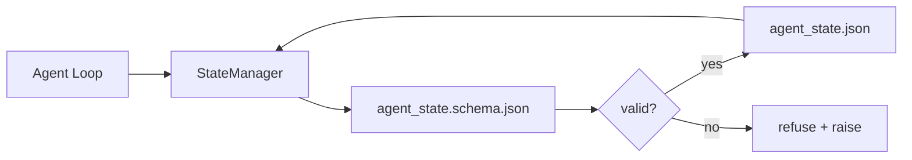

# الذاكرة و حالة الذاكرة

> تاريخ الدردشة متقلبة. الردود الدائم. مكتب العمل المخازن وكيل بيان في الملفات النسخة حتى الجلسة التالية، وكيل التالي، والمراجع التالي جميع قراءة من نفس مصدر الحقيقة.

**Type:** Build
**Languages:** Python (stdlib + `jsonschema` optional)
**Prerequisites:** Phase 14 · 32 (Minimal Workbench)
**Time:** ~60 minutes

## أهداف التعلم

- حدد ما ينتمي إلى ذاكرة الاحتفاظ و ما ينتمي إلى تاريخ الدردشة.
- مصدر مخططات JSON لل `agent_state.json`و`task_board.json`. . .
- بناء مدير الدولة الذي تحميل، وتؤكد، وتتحول، والثبات الدولة بشكل ذريبي.
- استخدم النظام لإرفض الكتابات السيئة قبل أن تفسد المكتب

## المشكلة

يقوم العميل بإنهاء جلسة، يغلق الدردشة، يفتح الجلسة التالية ويسأل أين يبدأ، يقول النموذج "دعني أبحث في الملفات"، يقرأ ملاحظات قديمة، ويُعيد العمل الذي كان قد اكتمل بالفعل. أو أسوأ من ذلك، يكتب ملفًا مكتوبًا لأنه لم يخبره أحد أن الملف قد اكتمل.

تصحيح مقعد العمل هو ذاكرة ريبو: يعيش الحالة في ملفات JSON في ريبو ، مكتوبة تحت مخطط ، تستمر بشكل ذريبي ، ومتنوع في مراجعة الشفرة. الدردشة هي تغذية انتقالية ؛ ريبو هو نظام تسجيل.

## المفهوم



### ما ينتمي إلى ذاكرة الاحتفاظ

| Belongs | Does not belong |
|---------|-----------------|
| Active task id | Raw chat transcripts |
| Touched files this session | Token-level reasoning traces |
| Assumptions the agent made | "The user seemed frustrated" |
| Open blockers | Sampled completions |
| Next action | Vendor-specific model ids |

الاختبار هو استدامة: هل سيكون هذا مفيدًا بعد ثلاثة أشهر من الآن في إعادة تشغيل CI؟ إذا كان ذلك صحيحًا، إعادة التأهيل. إذا لم يكن كذلك، فالتليميتر.

### النظام الأول

مخطط JSON هو العقد. بدونها، كل وكيل يختلق حقلًا جديدًا، ويتعلم كل مراجعة شكلًا جديدًا، وكل نص إلكتروني يجب أن يكون في حالة خاصة في الإصدارات السابقة. مع ذلك، فإن الكتابة السيئة هي كتابة رفض.

النظام يغطي:

- المفاتيح المطلوبة
- مسموح به`status`القيم
- القيم المحظورة (مثل `null`للصفوف).
- القيود على النمط (تطابق أوراق تعريف المهام `T-\d{3,}`)
- حقل الإصدارات للوجهات الهجرية

### "أتوميك" كتب

الكتابة الدولة تحتاج إلى البقاء على قيد الحياة الفشل الجزئي: كتابة إلى الملف المعتاد، fsync، إعادة تسمية على الهدف. الملف الدولة هو مصدر الحقيقة؛ نصف مكتوب واحد أسوأ من أي ملف على الإطلاق.

### الهجرة

عندما تتغير النظام، أرسل نص الهجرة إلى جانب عجلة النظام. الملف الحالي يحمل `schema_version`الحقل: يرفض المدير تحميل ملف من نسخة لا يمكن تحريره.

```figure
wb-state-persist
```

## بناءها

`code/main.py`تطبيقات:

- `agent_state.schema.json`و`task_board.schema.json`. . .
- مؤكدة stdlib فقط (مجموعة فرعية من مخطط JSON: مطلوبة، النوع، enum، النمط، العناصر).
- `StateManager.load`،`StateManager.update`،`StateManager.commit`مع النظام الذري التمثالية والإعادة الإسم يكتب.
- عرض تجريبي يتغير الحالة، يستمر، ويتم إعادة تحميل، ويدل على أن الرحلة ذهابًا وإياباً

إشغله

```
python3 code/main.py
```

النص يكتب`workdir/agent_state.json`و`workdir/task_board.json`، يتغيرها عبر جولتين، ويقوم بطبع الحالة المعتمدة في كل خطوة.

## أنماط الإنتاج في البرية

أربعة أنماط تحويل الحد الأدنى من الدروس إلى شيء واحد متعددة الوكلاء يمكن أن يعيش.

**Atomic temp-and-rename is not optional.**تقرير خطأ مشروع "هيف" في مارس 2026 يثبت وضع الفشل بشكل نظيف: `state.json`كتب عن طريق `write_text()`و تم القبض على استثناءات و تم إسكاتها. كتب جزئية جلسات اليسار يستأنف ضد حالة الفساد دون إشارة.`tempfile.mkstemp`في نفس الإرشادات التي يستهدفها، اكتب،`fsync`،`os.replace`(إعادة تسمية الذرية على POSIX و Windows).`atomic_write`يفعل ذلك بالضبط

**Idempotency keys on every non-idempotent tool call.**إذا كان وكيل يتعطل بعد استدعاء أداة ولكن قبل تحديد النتيجة ، فإن الاسترداد يحاول استدعاء الأداة مرة أخرى. آمن للقراءة ؛ خطير للإي-ميلات ، إدخال DB ، تحميل الملفات. النمط: تسجيل كل معرف اتصال الأداة قبل التنفيذ في `pending_calls.jsonl`عند المحاولة المُجددة، تحقق من الهوية؛ إذا كان موجودًا، تخطي المكالمة واستخدم النتيجة المحفوظة في الاحتفاظ. كلاهما يدعو هذا في توجيه 2026.

**Separate large artifacts from state.**لا تخزين CSVs، النصوص الطويلة، أو الملفات التي تم إنشاؤها في `agent_state.json`. حفظ الفن كملف منفصل (أو تحميل إلى تخزين الكائن) والحفاظ فقط على المسار في حالة. نقاط التفتيش تبقى صغيرة وسريعة؛ وتتنمو الفن بشكل مستقل.

**Event sourcing for audit, snapshots for resume.**إضافة إلى سجل الأحداث (`state.events.jsonl`) على كل طفرة ، بصورة دورية لـ`state.json`. يستأنف يقرأ اللقطة ، ثم يعيد إعادة تشغيل أي أحداث بعد طابع الوقت للوقطة. هذا يكلف المزيد من القرص ولكن يسمح لك بإعادة تشغيل قرارات الوكيل حرفيا  ضرورية عند إزالة تشغيلات الأفق الطويل. نفس الشكل الذي يستخدمه Postgres داخلياً لـ WAL.

**Schema migrations or refuse to load.**- نعم`schema_version`عدد كامل هو العقد. عندما يقوم المدير بتحميل ملف في نسخة مجهولة، فإنه يرفض قراءته. أرسل نص هجرة إلى جانب عجلة النظام؛ `tools/migrate_state.py`يدير بشكل غير قوي على كل شركة ناشئة

## استخدمها

في الإنتاج:

- **LangGraph checkpointers.**نفس الفكرة، التخزين مختلف. البوّر البديل يظل في حالة الرسم البياني إلى SQLite، Postgres، أو خلفية مخصصة. النظام الذي يدرس هذا الدروس هو ما تحصل عليه عندما يموت البوّر البديل و تحتاج إلى قراءة الحالة يدوياً.
- **Letta memory blocks.**كتلة مستمرة مع مخططات مهيكلة (المرحلة 14 · 08). نفس التخصص المستهدف للأشخاص الذين يعملون لفترة طويلة.
- **OpenAI Agents SDK session store.**تعود إلى الخلفيات المتنقلة، واعية بالخطط، الملف الحالي في هذه الدروس هو الخلفية المحلية.

## أرسله

`outputs/skill-state-schema.md`يخلق زوج من مخططات JSON المحددة للمشروع (الوضع + اللوحة) ، Python `StateManager`ووضع منصة للهجرة حتى لا يكسرها المكتب

## التمارين

1. إضافة`last_human_touch`رفض أي عميل يكتب في غضون خمس ثواني من تحرير بشري
2. تمديد المحقق للتأييد `oneOf`لذا يمكن أن تكون المهمة إما مهمة بناء أو مهمة مراجعة مع مختلف الحقول المطلوبة.
3. إضافة`schema_version`في هذا الحقل ، يمكنك كتابة الهجرة من v1 إلى v2 (إعادة الإسم `blockers`إلى`risks`)
4. نقل الخلفية التخزينية من ملف محلي إلى SQLite. احتفظ ب `StateManager`-إلى حد ما
5. إضافة عملاء ضد نفس الملف الحكومي مع سباق كتابة 50 ملم، ما الذي يحدث خطأ وكيف يُنقذك إعادة الإسم الذري؟

## الشروط الرئيسية

| Term | What people say | What it actually means |
|------|----------------|------------------------|
| Repo memory | "Notes file" | State stored in tracked files in the repo, under schema |
| Schema-first | "Validate inputs" | Define the contract before the writer, refuse drift |
| Atomic write | "Just rename" | Write to temp, fsync, rename, so partial failures cannot corrupt |
| Migration | "Schema bump" | A script that turns vN state into v(N+1) state |
| System of record | "Source of truth" | The artifact the workbench treats as authoritative |

## المزيد من القراءة

- [JSON Schema specification](https://json-schema.org/specification.html)
- [LangGraph checkpointers](https://langchain-ai.github.io/langgraph/concepts/persistence/)
- [Letta memory blocks](https://docs.letta.com/concepts/memory)
- [Fast.io, AI Agent State Checkpointing: A Practical Guide](https://fast.io/resources/ai-agent-state-checkpointing/) التفتيش الأول للخطط مع عدم القدرة على التفوق
- [Fast.io, AI Agent Workflow State Persistence: Best Practices 2026](https://fast.io/resources/ai-agent-workflow-state-persistence/) التحكم في التزامن، TTL، مصادر الأحداث
- [Hive Issue #6263 — non-atomic state.json writes silently ignored](https://github.com/aden-hive/hive/issues/6263) وضع الفشل في مشروع حقيقي
- [eunomia, Checkpoint/Restore Systems: Evolution, Techniques, Applications](https://eunomia.dev/blog/2025/05/11/checkpointrestore-systems-evolution-techniques-and-applications-in-ai-agents/) أسباب CR من تاريخ OS تطبيق على الوكلاء
- [Indium, 7 State Persistence Strategies for Long-Running AI Agents in 2026](https://www.indium.tech/blog/7-state-persistence-strategies-ai-agents-2026/)
- [Microsoft Agent Framework, Compaction](https://learn.microsoft.com/en-us/agent-framework/agents/conversations/compaction)مدير نقطة التفتيش للمبيع
- المرحلة 14 · 08  كتلة الذاكرة وحساب وقت النوم
- المرحلة 14 · 32  الحد الأدنى من ثلاث ملفات هذا الدروس تخطيط
- المرحلة 14 · 40  حزم التسليم القراءة من نفس النظام
