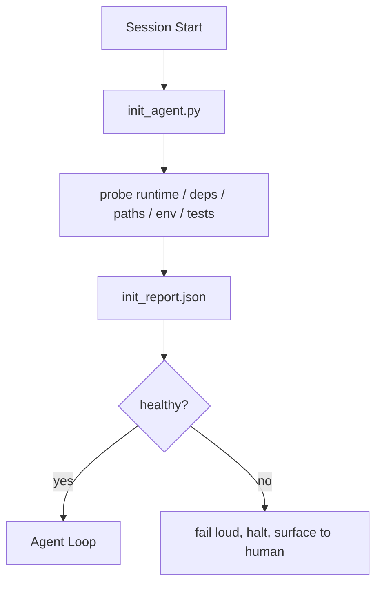

# المخططات المبدئية للوكلاء

> كل جلسة تبدأ باردة تدفع ضريبة العميل يقرأ نفس الملفات، يحاول نفس المساحات، ويعيد اكتشاف نفس المسارات، ويقوم النص الإبتدائي بدفع الضريبة مرة واحدة ويكتب الإجابات في الدولة.

**Type:** Build
**Languages:** Python (stdlib)
**Prerequisites:** Phase 14 · 32 (Minimal Workbench), Phase 14 · 34 (Repo Memory)
**Time:** ~45 minutes

## أهداف التعلم

- تحديد العمل الذي لا ينبغي على العميل أن يقوم به مرة أخرى في كل جلسة
- بناء رسم الخط الأولية المحددة التي تدرس وقت تشغيل، والاعتمادات، وصحة الاسترداد.
- استمر في نتائج المسح حتى يقرأها العميل بدلاً من إعادة التحقق
- فشل بصوت عال وسرعان و بمكان واحد للنظر عندما تفشل التشغيل

## المشكلة

فتح جلسة. يقوم الوكيل بتخمين نسخة Python. يخطئ أمر الاختبار. يرد قائمة الجذر repo خمس مرات للعثور على نقطة الدخول. يحاول استيراد حزمة غير مثبتة. يسأل المستخدم أين تعيش ملف التكوين. بحلول الوقت الذي يقوم به بتحرير حقيقي، ذهب عشرة آلاف رمز إلى عمل الإعداد الذي كان ينبغي أن يكون نصًا واحدًا.

الإصلاح هو نص إبتدائي واحد يتم تشغيله قبل أن يقوم العميل بأي شيء آخر ويكتب`init_report.json`العميل يقرأ عند بدء العمل

## المفهوم



### ما يبحث عنه النص الإبتدائي

| Probe | Why it matters |
|-------|----------------|
| Runtime versions | Wrong Python or Node version means silent wrong-version bugs |
| Dependency availability | A missing package later costs ten times the cost of catching it now |
| Test command | The agent must know how to verify; if the command is missing the workbench is broken |
| Repo paths | Hard-coded paths drift; resolve them once and pin |
| Environment variables | Missing `OPENAI_API_KEY` is a failure surface, not a runtime mystery |
| State + board freshness | Stale state from a crashed session is a footgun |
| Last-known-good commit | Anchor for the handoff diff at the end of the session |

### الفشل بصوت عال، الفشل بسرعة، الفشل في مكان واحد

فشل الصناعة يعني توقف وظهور على سطح الإنسان لا "الوكيل سوف يكتشف ذلك".

### غير قادر

إضغط على المخطط مرتين على التوالي، يجب أن تكون المخطط الثاني غير عملي إلا لوضع علامة زمنية جديدة، فالتخلف هو ما يسمح لك بتوصيل النص إلى CI، أو الركاب، أو أمر إضافة المهام قبل المهام.

### القواعد البدائية مقابل القواعد الإبتدائية

القواعد (المرحلة 14 · 33) تصف ما يجب أن يكون صحيحاً للعمل. إن إينيت هو النص الذي يثبت أن هذه القواعد يمكن التحقق منها. القواعد دون إينيت تصبح "توخي الحذر". إن إينيت دون قواعد تصبح فشلاً مشمساً.

```figure
wb-init-probes
```

## بناءها

`code/main.py`أدوات `init_agent.py`:

- خمسة صواريخ: إصدار بيثون، قائمة الاعتمادات عبر `importlib.util.find_spec`, قابلية تحديد القيادة الاختبارية , مطلوبة البيئة , طازجة الملفات الحكومية
- كل صفقة تعود`(name, status, detail)`. . .
- النص يكتب`init_report.json`مع مجموعة الص Sonda كاملة وتخرج غير صفر إذا فشلت أي ص Sonda بقوة الكتل.

إشغله

```
python3 code/main.py
```

النص يطبع جدول المراقبة، يكتب`init_report.json`و يخرج من الصفر على المسار السعيد أو غير الصفر مع قائمة من الفشل في الصفحات

## أنماط الإنتاج في البرية

ثلاثة أنماط تفصل نص مفيد من حفل.

**Last-known-good commit anchoring.**إثبات الالتزام الحالي ضد `LKG`الملف الذي تم كتابته على آخر عملية دمج ناجحة. إذا تجاوز الفوارق ميزانية (ملفات افتراضية 50) ، فرفض البدء وتطلب من الإنسان التصديق على الخط الأساسي الجديد. هذا ما يستخدمه مراجعة AI Code Review في Cloudflare لتنظيم وكلاء المراجعة: كل جلسة مراجعة تربط ضد نفس الخير المعروف الأخير ولا تجذب أبداً المركبات عبر الجلسات.

**Lock files with TTL.**اكتب`prereqs.lock`بعد مرور المراقبة الأولى الناجحة. الثقة في القفل لمدة N ساعات (24 ساعة افتراضي) والفوت الأقراص الثمينة. النص الإبتدائي يقرأ القفل أولاً؛ إذا كان طازجاً ومشورة التبعية تتطابق مع الهاش، فإنه يختصر الدوائر. هذا هو نفس النمط الذي يستخدمه دوكر لخزائن الطبقة: أجهزة التحفظ غير قادرة + محتوى الهاش = فوت.

**No network, no LLM, no surprises in the hot path.**أجهزة اختبار البداية هي التوصيلات التحديدية. أجهزة اختبار التي تدعو لـ LLM لتصنيف الفشل أو التي تضرب خدمة خارجية للتحقق من الترخيص ليست أجهزة اختبارية؛ إنها تدفق عمل. إذا استغرق أجهزة اختبار أكثر من ثلاث ثوانٍ في عملية جافة، فاعالج ذلك كرائحة لوحة العمل وإما نقلها من init أو حفظ نتيجته.

## استخدمها

في الإنتاج:

- **Claude Code hooks.** `pre-task`هوك يطلب نص الإبتدائي ويرفض إطلاق العميل إذا فشل
- **GitHub Actions.**أ`setup-agent`العمل يدير النص الإبتدائي، عمل العميل يعتمد عليه.
- **Docker entrypoint.**يحوي حاوية الوكيل النص الإبتدائي قبل تنفيذ وقت تشغيل الوكيل؛ تسجل سطح الفشل.

النص الإصداري محمول لأنه لا يطلق مكالمات إلى إطار معين. يمكن أن يلفها بش أو Make أو ملف المهام.

## أرسله

`outputs/skill-init-script.md`يقوم بإجراء مقابلات مع المشروع، ويعدّ عمل إعداده إلى صواريخ، ويعرض رسالة محددة للمشروع `init_agent.py`بالإضافة إلى سير عمل المعلومات الذي يديره قبل أي خطوة العميل.

## التمارين

1. إضافة صواريخ تفيد الالتزام الحالي ضد آخر معروف-جيد التزام ويرفض البدء إذا أكثر من 50 ملف تغير.
2. سلك النص للكتابة `prereqs.lock`ورفض البدء إذا كان القفل قد تجاوز السبع أيام.
3. إضافة`--fix`العلم الذي يثبت تلقائيًا الاعتمادات المفقودة على المطور ولكن لا يعدل أبداً الاعتمادات على الوقت التشغيلي دون موافقة
4. نقل المراقبة من وظائف مشفرة إلى سجل "يامل"
5. إضافة ميزانية توقيت لكل صفقة، صفقة تستمر لأكثر من ثلاث ثوانٍ هي رائحة من مكتب العمل.

## الشروط الرئيسية

| Term | What people say | What it actually means |
|------|----------------|------------------------|
| Probe | "A check" | A deterministic function returning `(name, status, detail)` |
| Init report | "Setup output" | JSON written next to state with the probe results |
| Idempotent | "Safe to re-run" | Two runs in a row produce identical reports modulo timestamp |
| Fail loud | "Don't swallow" | Halt and surface to the human; no silent fallback |
| Setup tax | "Bootstrap cost" | The tokens the agent spends per session rediscovering the obvious |

## المزيد من القراءة

- [Anthropic, Effective harnesses for long-running agents](https://www.anthropic.com/engineering/effective-harnesses-for-long-running-agents)
- [GitHub Actions, composite actions for setup](https://docs.github.com/en/actions/sharing-automations/creating-actions/creating-a-composite-action)
- [microservices.io, GenAI dev platform: guardrails](https://microservices.io/post/architecture/2026/03/09/genai-development-platform-part-1-development-guardrails.html) التزامات مسبقة + عمليات التحقق من المعلومات المتقدمة
- [Augment Code, How to Build Your AGENTS.md (2026)](https://www.augmentcode.com/guides/how-to-build-agents-md) توقعات init
- [Codex Blog, Codex CLI Context Compaction](https://codex.danielvaughan.com/2026/03/31/codex-cli-context-compaction-architecture/) بدء جلسة كـ " init " ذو الاكتئاب
- المرحلة 14 · 33  القاعدة المحددة هذه النص يسمح
- المرحلة 14 · 34  الملف الحكومي هذه النص بذور
- المرحلة 14 · 38  بوابة التحقق إمدادات النص الإبتدائي
- المرحلة 14 · 40  التسليم الذي يستغرق آخر ما يعرفه من الخير في تقرير init
