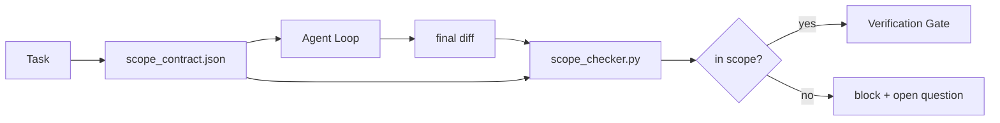

# عقدات النطاق وحدود المهام

> النموذج لا يعرف أين ينتهي العمل. عقد المجال هو ملف لكل مهمة يوضح أين يبدأ العمل، أين ينتهي، وكيفية التراجع إذا سيلقى. يتحول العقد من "بقاء في المجال" إلى شيك.

**Type:** Build
**Languages:** Python (stdlib)
**Prerequisites:** Phase 14 · 32 (Minimal Workbench), Phase 14 · 33 (Rules as Constraints)
**Time:** ~50 minutes

## أهداف التعلم

- اكتب عقد نطاق يقرأه الوكيل عند بدء المهمة ويقرأه المؤكد عند نهاية المهمة.
- تحديد الملفات المسموح بها، الملفات المحظورة، معايير القبول، خطة إعادة التأجيل، وحدود الموافقة.
- تنفيذ فحص نطاق المشاركة الذي يقارن الاختلافات مع العقد ويشير إلى الانتهاكات.
- اجعل المجال مرئي ومتلقّى ويمكن مراجعته

## المشكلة

يزحف الوكلاء. المهمة هي "إصلاح خطأ تسجيل الدخول". التباين يلمس طريق تسجيل الدخول، مساعدة البريد الإلكتروني، مدير قاعدة البيانات، README، والنص الإصدار. كل لمس كان له سبب معقول في اللحظة. معا هي تغيير مختلف عن الذي تم مراجعته.

إنّ إزالة النطاق هو النظام الأكثر إشرافًا على الفشل في عمل العميل لأنّ العميل يروي كل خطوة بحسن نية. الإصلاح ليس طلبًا أكثر صرامة. الإصلاح هو عقد على القرص الذي يقول ما وعدت وفقًا للتحقق الذي يُقارن النتيجة بالموعد.

## المفهوم



### ما الذي يذهب في عقد النطاق

| Field | Purpose |
|-------|---------|
| `task_id` | Links to the task on the board |
| `goal` | One sentence the reviewer can verify |
| `allowed_files` | Globs the agent may write |
| `forbidden_files` | Globs the agent must not touch even by accident |
| `acceptance_criteria` | Test commands or assertion lines that prove done |
| `rollback_plan` | One paragraph the operator can execute if a halt is required |
| `approvals_required` | Actions outside scope that need explicit human sign-off |

عقد بدون`forbidden_files`الفضاء السلبي هو نصف العقد

### الكرات، وليس المسارات الخامة

النقود الحقيقية تحريك الملفات.`app/**/*.py`،`tests/test_signup*.py`) بحيث لا يؤدي إعادة التأثير بين الجلسات إلى إلغاء العقد.

### الردفوع هو جزء من النطاق

قائمة كيفية إعادة التأثير تجبر مؤلف العقد على التفكير في ما قد يذهب خطأ. العقد الذي لا يمكنك إعادة التأثير منه هو عقد لا ينبغي أن يتم الموافقة عليه.

### التحقق من المدى هو التحقق من الاختلاف

يكتب العميل فرقًا. يقرأ المحقق الفرق والقواعد المسموح بها والقواعد المحظورة ، وقائمة بأية أوامر قبول تم تشغيلها. كل انتهاك هو علامة تعريف العثور على بوابة التحقق يمكن رفضها.

### ارتفاعات النطاق: قائمة الميزات وعقد المهام

يحد عقد النطاق من مهمة واحدة. لا يحد من المشروع. يمكن للعميل البقاء تماما داخل عقد لإصلاح تسجيل الدخول ومع ذلك، في المرحلة التالية، يقرر أن المشروع يحتاج أيضا إلى صفحة الإعدادات، وتبديل الوضع المظلم، وإعادة كتابة جهاز التوجيه. لم يسأل العقد أبداً عن أي عمل كان في نطاق المشروع، فقط أي ملفات كانت في نطاق المهمة.

هذا الارتفاع الثاني يحتاج إلى بدائية خاصة به:`feature_list.json`يقرأ الوكيل عند بدء الجلسة. إنه متسع مشروع كملف قابل للقراءة الآلية، والتي تم ترتيبها. يختار الوكيل ميزة واحدة بالضبط`status`هو`todo`، يكتب`id`في العقد النشط المجال، ومنح من بدء ميزة ثانية في نفس الجلسة. "الميزة واحدة في وقت" تتوقف عن كونها خط في الإستعراض يمكن للعميل التبرير الماضي وتصبح قيمة تقرأها من القرص والتحقق البوابة تفرض.

```json
{
  "project": "knowledge-base",
  "active": "import-pdf",
  "features": [
    { "id": "import-pdf",   "status": "in_progress", "goal": "import a PDF into the library",        "done_when": "pytest tests/test_import.py && a sample PDF appears in the library view" },
    { "id": "full-text-search", "status": "todo",     "goal": "search document text and rank hits",   "done_when": "query returns ranked results with snippets" },
    { "id": "cite-answers", "status": "todo",         "goal": "answers carry source citations",        "done_when": "every answer renders at least one clickable citation" }
  ]
}
```

| Field | Purpose |
|-------|---------|
| `active` | The single feature the current session may touch; empty means pick one and set it |
| `features[].id` | Stable slug the scope contract's `task_id` points at |
| `features[].status` | `todo`, `in_progress`, `done`, `blocked`; only one `in_progress` at a time |
| `features[].goal` | One sentence the reviewer can verify |
| `features[].done_when` | The acceptance line that flips `in_progress` to `done` |

قواعد إثنان تجعل القائمة تحمل الحمل بدلاً من التزيين.`in_progress`" هو نفسه اختبار بدء (المرحلة 14 · 33): إذا أظهرت القائمة اثنين، فإن الجلسة ترفض البدء حتى يحل الإنسان. ثانيا، قائمة الميزات هو ملف، وليس رسالة دردشة، لأن الدردشة تتحرك خارج السياق والملف يستمر عبر الجلسات وعبر العملاء. يكتب التسليم (المرحلة 14 · 40) حالة الميزة النهائية مرة أخرى إلى `done`لذا فإن الجلسة التالية تفتح على لوحة دقيقة بدلا من إعادة استنتاج ما تبقى.

العقد والقائمة تتكون من أقل امتيازات، نفس الاندماج الموصوف أدناه: عقد المهمة `allowed_files`يجب أن تجلس داخل أي شيء يلمسه المكون النشط، أبدا خارجها.

```figure
wb-scope-bounce
```

## بناءها

`code/main.py`تطبيقات:

- `scope_contract.json`النظام (مجموعة فرعية من النظام JSON، صفوف glob).
- محلل مختلف يحول قائمة الملفات الملموسة بالإضافة إلى قائمة الأوامر التشغيلية إلى `RunSummary`. . .
- أ`scope_check`الذي يعود`(violations, in_scope, off_scope)`ضد العقد
- تم إثبات إثنين: واحد يبقى في نطاق، واحد يرتفع.

إشغله

```
python3 code/main.py
```

الناتج: العقد، الجريمتين، أحكام كل جولة، و مدفوعة`scope_report.json`. . .

## أنماط الإنتاج في البرية

يذكر ممارس يعمل على "تطبيقات التشخيصات" (عقود المدى في YAML قبل استدعاء الوكيل) أن معدل ثقب الأرانب انخفض من 52٪ إلى 21% في ثلاثة أسابيع دون تغيير الوكيل. قام العقد بالعمل ، وليس النموذج. ثلاثة أنماط تجعل المكاسب ثابتة.

**Violation budgets, not binary failures.** `agent-guardrails`(بوابة دمج OSS المستخدمة من قبل كلود كود، كورسور، ويندسرف، كودكس عبر MCP)`violationBudget`لكل مهمة: يتم إظهار إزالة صغيرة في الميزانية كتحذيرات؛ فقط عندما يتجاوز الميزانية يرفض بوابة الاندماج.`violationSeverity: "error" | "warning"`الميزانية هي الفرق بين البوابة التي تُرسل و البوابة التي يتم تعطيلها من قبل الفريق الذي كرهها

**Severity asymmetry by path family.**خارج نطاق الكتابة إلى `docs/**`عادةً`warn`- خارج نطاق المجال`scripts/**`،`migrations/**`،`config/prod/**`دائماً`block`. يجب أن تعيش هذه عدم التكافؤة في العقد، وليس في الوقت المحدد، لأنه محدد للمشروع وتتغير لكل مهمة.

**Time and network budgets next to file budgets.**أ`time_budget_minutes`الحقل يحد من ساعة الجدار؛ الوقت الزمني يرفض الاستمرار في تجاوزها دون إعادة الموافقة.`network_egress`الوصول على أسماء المضيف يمنع الوكيل من ضرب API خارجية التي لم تكن جزءا من المهمة. هذه هي أبعاد النطاق أيضا؛ فإن كرات الملفات ضرورية، وليس كافية.

**Multi-contract merge semantics (least privilege).**عندما تطبق عقدين من نطاق العمل (على سبيل المثال ، عقد على نطاق المشروع بالإضافة إلى عقد محدد للمهام) ، يتم دمج: **intersect** `allowed_files`(يجب أن تسمح كلا العقود بالمسار)**union** `forbidden_files`(إما أن يحظر)`time_budget_minutes`هو الأكثر تقييدًا (دقائق) ،`approvals_required`يتراكم.`network_egress`هو`None`لا يوجد إجراء،`[]`" للكذب " للجميع " .`[...]`كمسجلة، تحت الاندماج،`None`يُؤجل إلى الجانب الآخر، وتتقاطع قائمتين، و "الرفض" يبقى "الرفض"

## استخدمها

أنماط الإنتاج:

- **Claude Code slash commands.**أ`/scope`يكتب القيادة العقد ويقوم بتحديده كسياق جلسة.
- **GitHub PRs.**اضغط على العقد كملف JSON في جسم العلاقات العامة أو كقطع أثرية مسجلة. IC تعمل على فحص النطاق ضد فرق الاندماج.
- **LangGraph interrupts.**ينتهك النطاق يسبب انقطاع؛ يسأل المدير الإنسان ما إذا كان العقد يحتاج إلى النمو أو يجب على الوكيل التراجع.

يذهب العقد مع المهمة، وعندما تغلق المهمة، يتم أرشيف العقد تحت عنوان `outputs/scope/closed/`. . .

## أرسله

`outputs/skill-scope-contract.md`يخلق عقد نطاق لتصفية المهمة ومحقق عالمي يعمل في CI على كل عامل مختلف.

## التمارين

1. إضافة`network_egress`إدخال قائمة الحقول يسمح بأضافات خارجية. رفض تشغيلات تتعلق بأضافات أخرى.
2. تمديد المراقب للفشل الناعم على `docs/**`و صعبة على`scripts/**`-أبرر عدم التكافؤ
3. جعل العقد مشتق `allowed_files`من`goal`الحقل باستخدام مجموعة قواعد ثابتة (لا LLM). ما الذي يذهب خطأ في الحالة الأولى الحافة؟
4. إضافة`time_budget_minutes`ورفضوا مواصلة العمل عندما تتجاوز الساعة الجدارية
5. إضافة عقدين ضد نفس الاختلاف ما هو المعنى الصحيح للاندماج عندما ينطبق كلاهما؟

## الشروط الرئيسية

| Term | What people say | What it actually means |
|------|----------------|------------------------|
| Scope contract | "The task brief" | Per-task JSON listing allowed/forbidden files, acceptance, rollback |
| Scope creep | "It also touched..." | Files outside the contract changed in the same task |
| Rollback plan | "We can revert" | The one-paragraph operator runbook for halting |
| Approval boundary | "Needs sign-off" | An action listed in the contract as requiring explicit human approval |
| Diff check | "Path audit" | Comparing touched files against the contract globs |

## المزيد من القراءة

- [LangGraph human-in-the-loop interrupts](https://langchain-ai.github.io/langgraph/concepts/human_in_the_loop/)
- [OpenAI Agents SDK tool approval policies](https://platform.openai.com/docs/guides/agents-sdk)
- [logi-cmd/agent-guardrails — merge gates and scope validation](https://github.com/logi-cmd/agent-guardrails) ميزانيات الانتهاكات، مستويات الحدّ
- [Dev|Journal, Preventing AI Agent Configuration Drift with Agent Contract Testing](https://earezki.com/ai-news/2026-05-05-i-built-a-tiny-ci-tool-to-keep-ai-agent-configs-from-drifting-in-my-repo/) `--strict`وضع بدون نقاط خارجية
- [Agentic Coding Is Not a Trap (production logs)](https://dev.to/jtorchia/agentic-coding-is-not-a-trap-i-answered-the-viral-hn-post-with-my-own-production-logs-33d9) إيرادات التشخيصات: 52% → 21%
- [OpenCode permission globs](https://opencode.ai/docs/agents/) نطاق الإذن لكل حبة دقيقة
- [Knostic, AI Coding Agent Security: Threat Models and Protection Strategies](https://www.knostic.ai/blog/ai-coding-agent-security) نطاق كجزء من أقل امتيازات
- [Augment Code, AI Spec Template](https://www.augmentcode.com/guides/ai-spec-template) نظام حدود ثلاثي المستويات (يجب/لا يسأل/لا يسأل أبدا)
- المرحلة 14 · 27  الدفاعات المسرعة للحقن التي ترتبط مع قفلات النطاق
- المرحلة 14 · 33  القاعدة التي وضعت في هذا العقد متخصصة لكل مهمة
- المرحلة 14 · 38  بوابة التحقق
