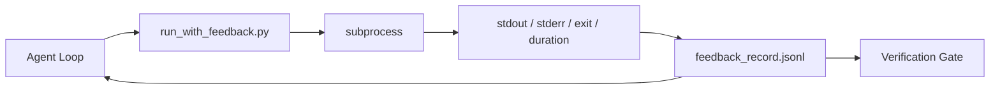

# حلقات ردود الفعل في الوقت الذي يتم تشغيلها فيه

> العملاء الذين لا يرون خروج الأوامر الحقيقية تخمين. ركن ردود الفعل يلتقط stdout ، stderr ، رمز الخروج ، والتوقيت في سجل مهيكلي يمكن أن يقرأ الجولة التالية. ثم يتفاعل العميل مع الحقائق بدلاً من التنبؤ به الخاص بالحقائق.

**Type:** Build
**Languages:** Python (stdlib)
**Prerequisites:** Phase 14 · 32 (Minimal Workbench), Phase 14 · 35 (Init Script)
**Time:** ~50 minutes

## أهداف التعلم

- تمييز تعليقات الوقت التشغيلي عن تلميترات الملاحظة.
- قم ببناء مدرب تعليق يلف الأوامر القذيفة ويستمر السجلات المهيكلة.
- قم بتقليص الخروج الكبيرة بشكل محدد بحيث يبقى الحلقة ضمن ميزانية الرمز.
- رفض التقدم في الحلقة عندما تفتقر الرجوع.

## المشكلة

يقول الوكيل "تجربة الآن". الرسالة التالية تقول "كل الاختبارات تمر". الحقيقة هي أنه لم يتم إجراء أي اختبار. الوكيل تخيل الخروج، أو قام بإجراء الأمر ولم يقرأ النتيجة، أو قرأ النتيجة وقطع خط الفشل بصمت.

يقوم متسابق ردود الفعل بإزالة الفجوة. كل أمر يمر عبر المتسابق. كل سجل يحمل الأمر، والمسجلات التي تم التقاطها stdout و stderr، والرقم الخروج، ومدة ساعة الجدار، وملاحظة وكيل واحد. يقرأ الوكيل السجل في الجولة التالية. بوابة التحقق يقرأ السجلات في نهاية المهمة.

## المفهوم



### ما الذي يذهب في سجل المراجعة

| Field | Why it matters |
|-------|----------------|
| `command` | Exact argv, no shell expansion surprises |
| `stdout_tail` | Last N lines, deterministic truncation |
| `stderr_tail` | Last N lines, separate from stdout |
| `exit_code` | The unambiguous success signal |
| `duration_ms` | Surfaces slow probes and runaway processes |
| `started_at` | Timestamp for replay |
| `agent_note` | One line the agent writes about what it expected |

### التقطيع هو تحديد

سجل 50 ميغا بايت يدمّر الحلقة.`...truncated N lines...`لا يوجد عينة، الأجزاء التي يحتاج الوكيل لرؤيتها (خطأ نهائي، ملخص نهائي) تعيش في الذيل.

### ردود الفعل مقابل التلفاز

التلفاز (مرحلة 14 · 23 ، اتفاقيات OTel GenAI) هي للمشغلين البشريين الذين يراجعون الركوبات عبر الزمن. تعود المعلومات إلى الجولة التالية من هذه الركوبات. يشتركون حقلًا ولكنهم يعيشون في ملفات مختلفة مع احتفاظ مختلف.

### رفض التقدم دون ردود الفعل

إذا كان الجاري يخطئ قبل أن يلتقط الخروج ، فإن السجل يحمل `exit_code: null`و`error: <reason>`يجب أن يرفض حلقة العملاء المطالبة بالنجاح في`null`لا خروج، لا تقدم

```figure
wb-feedback-loop
```

## بناءها

`code/main.py`تطبيقات:

- `run_with_feedback(command, agent_note)`هذا يُغلف`subprocess.run`، يحتوي على التوقف/التخفيض/الخروج/مدة، يختصر بشكل محدد، يضاف إلى `feedback_record.jsonl`. . .
- محمول صغير ينشر JSONL إلى قائمة Python.
- عرض تجريبي يدير ثلاثة أوامر (نجاح، فشل، بطيء) ويطبخ آخر سجل لكل أوامر.

إشغله

```
python3 code/main.py
```

الناتج: ثلاثة سجلات تعليقات ضمنت إلى `feedback_record.jsonl`، آخر واحد من كل خط مطبوع. التسلل الملف عبر إعادة التشغيل لرؤية الحلقة تتراكم.

## أنماط الإنتاج في البرية

ثلاثة أنماط تقسيم الجاري بما فيه الكفاية للشحن.

**Redact at write, not at read.**أي سجل يلمس stdout أو stderr يمكن أن تسرب أسرار. يرسل الجاري مرسلة تحرير قبل إضافة JSONL: خطوط شريط مطابقة `^Bearer `،`password=`،`api[_-]?key=`،`AKIA[0-9A-Z]{16}`(أو إس)`xox[baprs]-`(سلاك) إصدار في وقت القراءة هو سلاح قدم، الملف على القرص هو ما يصل إليه المهاجم. مراجعة أنماط إصدار ربع سنوي ضد الأشكال السرية الملاحظة في وقت تشغيل الإنتاج.

**Rotation policy, not a single file.**كاب`feedback_record.jsonl`عند 1 MB لكل ملف ، عند الإفراط في التدفق ، قم بتدوير `.1`،`.2`، ألق`.5`. حلقة الوكيل يقرأ فقط الملف الحالي، لذلك تكلفة وقت تشغيل محدودة. تخزين الأثاث CI يحصل على مجموعة كاملة المدوارة. دون دوران الملف يصبح عنق الزجاجة في كل مكالمة محمول.

**Parent-command id for retry chains.**كل سجل يحصل`command_id`؛ محاولات إعادة حمل`parent_command_id`وإذا لم يكن هناك أي اتصال، فإن المحاولات الثانية تبدو وكأنها نجاحات مستقلة، ويخفي المراجعة تاريخ الفشل.

## استخدمها

أنماط الإنتاج:

- **Claude Code Bash tool.**الأداة تمكن بالفعل من التقاط stdout ، stderr ، الخروج ، ومدة. الجاري في هذا الدروس هو المكافئ الإطار-الجهادية لأي منتج وكيل.
- **LangGraph nodes.**لف أي عقدة القذيفة في المتدرب حتى يسجل خارج حالة الرسم البياني.
- **CI logs.**قم بتوصيل JSONL إلى متجر الأثاث الخاص بك ؛ يمكن للمراجعين إعادة تشغيل أي أمر دون إعادة تشغيل الجلسة.

المركض هو غلاف رقيق ينجو من كل هجرة إطار لأنه يملك شكل السجل.

## أرسله

`outputs/skill-feedback-runner.md`يخلق مشروع محدد `run_with_feedback.py`مع ميزانية التخفيض المناسبة، كاتب JSONL متصل بمكتب العمل، ومركز تحميل يقرأه الوكيل في كل اتجاه.

## التمارين

1. إضافة`cwd`حقل لكل سجل بحيث يتم التمييز بين نفس الأوامر التي تم تشغيلها من إداريات مختلفة.
2. إضافة`redaction`خطوة تسقط خطوط متطابقة`^Bearer `أو`password=`اختبار على سجلات العجلة
3. إجمالي القيمة`feedback_record.jsonl`حجم 1 MB عن طريق التناوب إلى `.1`،`.2`الملفات، الدفاع عن سياسة التدوير
4. إضافة`parent_command_id`لذا تجرب سلسلة أخرى مرئية: أي أمر أنتج المدخل الذي استهلكه الأوامر التالية.
5. قم بتوصيل JSONL إلى TUI صغير يسلط الضوء على أحدث الخروج غير الصفر. ثمانية ميزات رئيسية يجب أن تظهر TUI لتكون مفيدة في مراجعة.

## الشروط الرئيسية

| Term | What people say | What it actually means |
|------|----------------|------------------------|
| Feedback record | "Run log" | Structured JSONL entry with command, output, exit, duration |
| Tail truncation | "Trim the log" | Deterministic head+tail capture so records fit in token budget |
| Refuse-on-null | "Block on missing data" | The loop must not advance when `exit_code` is null |
| Agent note | "Expectation tag" | The one-line prediction the agent writes before reading the result |
| Telemetry split | "Two log files" | Feedback for the next turn, telemetry for the operator |

## المزيد من القراءة

- [OpenTelemetry GenAI semantic conventions](https://opentelemetry.io/docs/specs/semconv/gen-ai/)
- [Anthropic, Effective harnesses for long-running agents](https://www.anthropic.com/engineering/effective-harnesses-for-long-running-agents)
- [Guardrails AI x MLflow — deterministic safety, PII, quality validators](https://guardrailsai.com/blog/guardrails-mlflow)أنماط التحرير كاختبارات تراجعية
- [Aport.io, Best AI Agent Guardrails 2026: Pre-Action Authorization Compared](https://aport.io/blog/best-ai-agent-guardrails-2026-pre-action-authorization-compared/) التقاط قبل/بعد الأداة
- [Andrii Furmanets, AI Agents in 2026: Practical Architecture for Tools, Memory, Evals, Guardrails](https://andriifurmanets.com/blogs/ai-agents-2026-practical-architecture-tools-memory-evals-guardrails) سطحات قابلية للملاحظة
- المرحلة 14 · 23  اتفاقيات OTel GenAI للجهة التليميترية
- المرحلة 14 · 24  منصات مراقبة العامل (لانغفوز، فينيكس، أوبيك)
- المرحلة 14 · 33  القاعدة التي تتطلب ردود الفعل قبل الإعلان عن الانتهاء
- المرحلة 14 · 38  بوابة التحقق التي تقرأ JSONL
