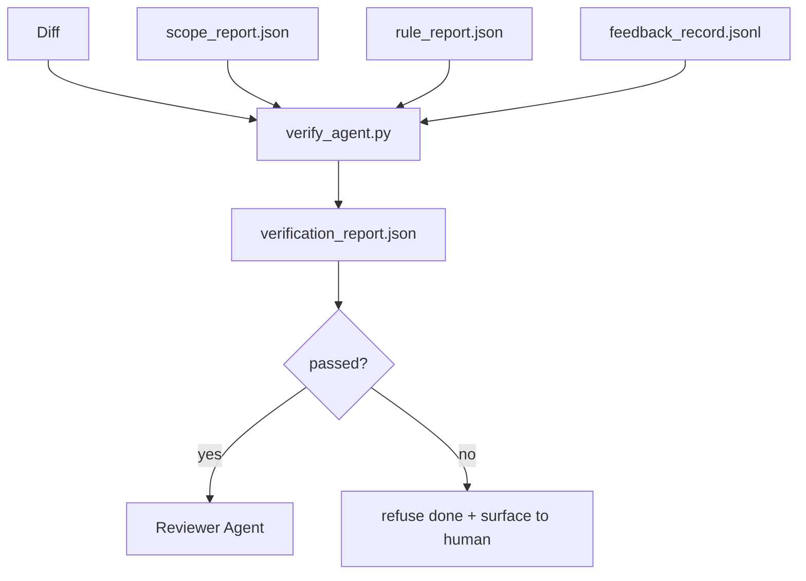

# بوابات التحقق

> لا يحصل الوكيل على وضع علامة على عمله الخاص كما هو قد تم. بوابة التحقق تقرأ عقد النطاق، سجل المراجعة، تقرير القواعد، والفروق، وتجيب على سؤال واحد: هل هذه المهمة قد اكتملت فعلا؟ إذا قال البوابة لا، فإن المهمة لم يتم، بغض النظر عن ما يقول الدردشة.

**Type:** Build
**Languages:** Python (stdlib)
**Prerequisites:** Phase 14 · 33 (Rules), Phase 14 · 36 (Scope), Phase 14 · 37 (Feedback)
**Time:** ~55 minutes

## أهداف التعلم

- تعريف بوابة التحقق كعمل تحديد على أثاث سطح العمل.
- قم بتجميع تقرير القواعد، تقرير النطاق، سجلات التعليقات، والاختلاف في حكم واحد.
- إصدار`verification_report.json`وكيل المراجعة والمخبر يستطيعان القراءة
- رفض تقدم المهمة على أي فشل من شأن الحجم، دون استثناء.

## المشكلة

الوكلاء يعلنون النجاح بسهولة كبيرة.

- "يبدو جيداً" القرأ النموذج اختلافه الخاص وقرر أنه صحيح
- "الاختبارات اجتازت" قالوا بثقة لا يوجد سجل عن التجربة التي كانت تعمل فعلا
- "القبض قد تم" معايير القبول تعبيرها بحرية بما فيه الكفاية لتعني "أي شيء يشبه ما تم فعله".

مقعد العمل هو بوابة التحقق الوحيدة التي تقرأ الأدوات التي أنتجها الوكيل بالفعل وتقوم بالاتصال. البوابة تحدد. البوابة في التحكم في النسخة. البوابة متصلة إلى CI. لا يمكن للوكيل رشوة لها.

## المفهوم



### ما يُفحصه البوابة

| Check | Source artifact | Severity |
|-------|-----------------|----------|
| All acceptance commands ran | `feedback_record.jsonl` | block |
| All acceptance commands exited zero | `feedback_record.jsonl` | block |
| Scope check has no forbidden writes | `scope_report.json` | block |
| Scope check has no off-scope writes | `scope_report.json` | block or warn |
| All block-severity rules pass | `rule_report.json` | block |
| No `null` exit codes in feedback | `feedback_record.jsonl` | block |
| Touched files match `scope.allowed_files` | both | warn |

أ`warn`الوصول إلى القرار يلاحظ الحكم`block`العثور على الوقاية`passed: true`. . .

### تحديدية وليس احتمالية

يجب على البوابة أن تنتج نفس الحكم لنفس المادة المحددة في كل مرة. لا يوجد قضاة في ماجستير في العلوم. قضاة في ماجستير في العلوم ينتمون إلى جانب المراجع (المرحلة 14 · 39) حيث يكون الهدف هو التقييم النوعي وليس الوضع.

### تقرير واحد، طريق واحد

البوابة تنطلق واحدة`verification_report.json`كل مهمة تم إكمالها، مكتوبة تحت `outputs/verification/<task_id>.json`المعلوماتية تستخدم نفس المسار بوابات متعددة مع مسارات مختلفة

### الرفض دون استثناء

لا يمكن أن يتم إلغاء نتائج شدة الكتل من قبل العميل.`override_reason`و`overridden_by`اسم المستخدم، الإغلاق هو تغيير موقّع، وليس قرار عميل

```figure
wb-gate-sequence
```

## بناءها

`code/main.py`تطبيقات:

- محمول لكل أداة دخول، كلّها محليّاً حتى يكون الدروس مكتفياً.
- أ`verify(task_id, artifacts) -> VerdictReport`وظيفة نقية
- طابعة تظهر نتائج كل فحص والمرحلة النهائية.
- عرض عرض مع ثلاثة سيناريوهات مهمة: مراراً نظيفاً، ومتدربة نطاق، وغياب قبول.

إشغله

```
python3 code/main.py
```

الناتج: ثلاثة تقارير حكم، كل حفظ بجوار السيناريو.

## أنماط الإنتاج في البرية

أربعة أنماط ترفع البوابة من "عمل آخر من اللون" إلى "الحافة القصوى".

**Defense-in-depth, not single gate.**كوكب ما قبل الالتزام → تحقق حالة CI → كوكب ما قبل الأداة authz → بوابة ما قبل الاندماج. كل طبقة تحدد لذلك يتم القبض على فشل في طبقة واحدة من قبل الطبقة التالية. كتاب لعبة مارس 2026 من microservices.io واضح: الكوكب ما قبل الالتزام غير قابل للتجاوز لأنه ، على عكس مهارة جانب النموذج ، لا يعتمد على الوكيل يتبع التعليمات. بوابة التحقق تقع عند طبقة CI / pre-merge.

**Defense by deterministic check, model-judge only for nuance.**أشرطة الأنثروبيك 2026 المختلفة: مكافآت قابلة للتحقق (اختبارات الوحدة، فحص النظام، رموز الخروج) الإجابة "هل حل الرمز المشكلة؟"  عنوانات LLM الإجابة "هل الرمز يمكن قراءته، آمنة، على الطراز؟" البوابة تشغيل الفصل الأول؛ المراجعة (المرحلة 14 · 39) تشغيل الثاني. يدمجها الإشارة.

**Signed override log, not Slack threads.**كل إغلاق يُبعث على صف في`outputs/verification/overrides.jsonl`مع: علامة وقت، العثور على الرمز، السبب، المستخدم الموقّع، الالتزام الحالي HEAD. وقت تشغيل يرفض أي إغلاق غياب التوقيع؛ مسار المراجعة متتبع. هذه هي الخط بين سياسة إغلاق غياب السيطرة ورقة إغلاق السيطرة.

**Coverage floor as a first-class check.**أ`coverage_report.json`يطعم`coverage_floor`(الامتحان الافتراضي 80٪) ، ينفذ البوابة إذا انخفضت التغطية المقاسة تحت الأرض أو تحت الأرضية المدمجة السابقة بأكثر من 1 نقطة مئوية. دون هذا التحقق، يقوم الوكلاء بإزالة الاختبارات التي تفشل بصمت وتبقى تقارير التحقق خضراء.

**`--strict` mode promotes warns to blocks.**لفرع الإفراج، وبركات العلاقات المتاحة للشحن، أو التجديد بعد الحادث، `--strict`كل تحذير يجعله فشلاً صعباً. العلم هو اختيار الدخول حسب الفرع، وليس الافتراض العالمي، لأن الصارمة على كل شيء تلوث التدفق اليومي.

## استخدمها

أنماط الإنتاج:

- **CI step.**أ`verify_agent`يدير الوظيفة البوابة ضد الأثاث النهائية للعميل`passed: true`. . .
- **Pre-handoff hook.**العميل في وقت التشغيل يدعو البوابة قبل أن يخلق وثيقة التسليم لا حكم خضراء ولا تسليم
- **Manual triage.**يقرأ العملاء التقرير عندما يزعم وكيل نجاحه و يشك في ذلك الإنسان

البوابة هي الحافة الحاسمة في تدفق المكتب العمل. كل سطح آخر هو فوقه.

## أرسله

`outputs/skill-verification-gate.md`يضبط البوابة إلى مشروع معين: أي أوامر القبول تغذيها، والقواعد التي هي خطورة الكتل، والتي تُسامح مع الكتابات خارج نطاق المجال، وكيف يتم تخزين سجل المراجعة المفروضة.

## التمارين

1. إضافة`coverage_floor`التحقق: يجب على قيادة الاختبار أن تقدم تقريراً عن التغطية التي تبلغ 80٪ على الأقل.
2. دعم`--strict`النظام الذي يعزز كل `warn`إلى`block`- توثيق الحالات التي يكون فيها وضع القيادة هو الوضع الصحيح الافتراضي.
3. اجعل البوابة تنتج ملخصاً من "ماركداون" بالإضافة إلى "JSON". دافع عن الحقول التي تنتمي إلى الملخص.
4. إضافة`time_since_last_human_touch`التحقق: أي ملف يتم تحريره خلال 60 ثانية من إضغط المفاتيح البشرية معفى من العلامات خارج نطاق المجال.
5. إستخدم البوابة على عامل حقيقي مختلف عن منتجك كم من النتائج حقيقية وكم من الضجيج؟ أين يجب أن تنمو البوابة؟

## الشروط الرئيسية

| Term | What people say | What it actually means |
|------|----------------|------------------------|
| Verification gate | "The check that stops things" | Deterministic function over workbench artifacts producing a pass/fail verdict |
| Block severity | "Hard fail" | A finding that prevents `passed: true` and requires a signed override |
| Override log | "Why we let it through" | Signed entries with reason and user id, audited by review |
| Acceptance command | "The proof" | A shell command whose zero exit is what `done` means |
| One report path | "Source of truth" | `outputs/verification/<task_id>.json`, consumed by CI and humans alike |

## المزيد من القراءة

- [Anthropic, Harness design for long-running application development](https://www.anthropic.com/engineering/harness-design-long-running-apps)
- [OpenAI Agents SDK guardrails](https://openai.github.io/openai-agents-python/guardrails/)
- [microservices.io, GenAI dev platform: guardrails](https://microservices.io/post/architecture/2026/03/09/genai-development-platform-part-1-development-guardrails.html)الدفاع المعمق بين المشاركة السابقة والإعلان
- [ICMD, The 2026 Playbook for Agentic AI Ops](https://icmd.app/article/the-2026-playbook-for-agentic-ai-ops-guardrails-costs-and-reliability-at-scale-1776661990431) سلم البوابة الموافقة (مصورة → موافقة → السيارات تحت العدوان)
- [Type-Checked Compliance: Deterministic Guardrails (arXiv 2604.01483)](https://arxiv.org/pdf/2604.01483) الركبة 4 كحدود أعلى من البوابات المحددة
- [logi-cmd/agent-guardrails — merge gate spec](https://github.com/logi-cmd/agent-guardrails) نطاق + بوابات اختبار الطفرات
- [Guardrails AI x MLflow](https://guardrailsai.com/blog/guardrails-mlflow) مؤكدون تحديديات كمسجلين للمعايير
- [Akira, Real-Time Guardrails for Agentic Systems](https://www.akira.ai/blog/real-time-guardrails-agentic-systems)بوابات ما قبل/ بعد الأدوات
- المرحلة 14 · 27  الدفاعات المسرعة للحقن (زوج المواجهة في البوابة)
- المرحلة 14 · 36  العقد الذي تنفذه هذه البوابة
- المرحلة 14 · 37  سجل الملاحظات هذا البوابة تسجل
- المرحلة 14 · 39  العميل المراجعة البوابة يقدم
