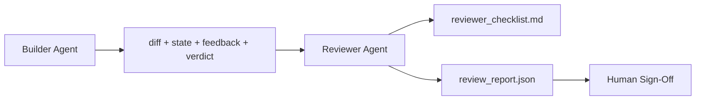

# وكيل المراجعة: المُبني منفصل عن ماركر

> وكيل كتابة الرمز لا يمكن تصنيفه. المراجع هو حلقة ثانية مع طلب نظام مختلف، هدف مختلف، والوصول فقط القراءة إلى كل شيء قام البنّاء بإنتاجه. الفجوة بين البنّاء والمراجع هي حيث يعيش أكثر موثوقية.

**Type:** Build
**Languages:** Python (stdlib)
**Prerequisites:** Phase 14 · 38 (Verification Gate)
**Time:** ~55 minutes

## أهداف التعلم

- أوضح لماذا لا يستطيع نفس الوكيل مراجعة عمله بشكل موثوق به.
- بناء حلقة وكيل المراجعة التي تستخدم أثاث المُبني وتصدير تقرير مراجعة مُهيّئ.
- كتابة عنوان للمراجعة التي تصنف الأبعاد المحددة، وليس الاهتزازات.
- سلك المراجع في مكتب العمل حتى تبدأ خطوة مراجعة البشر من أثرية حقيقية.

## المشكلة

تطلب من الوكيل إصلاح خطأ. فإنه يحرر أربعة ملفات، ويركض الاختبارات، والبيانات التي تمت. بوابة التحقق (المرحلة 14 · 38) تؤكد قبول تشغيل ومدى تم احتفاظها. البوابة تقول `passed: true`بعد يومين تجد أنّ الإصلاح حلّ النصف الخطأ من الحشيش

القبول ضروري وليس كافيا. يطرح المراجع الأسئلة التي لا يمكن القبول طرحها: هل حل هذا المشكلة الصحيحة؟ هل توسع النطاق دون إشارة إليها؟ هل وثقت الافتراضات التي كان ينبغي أن تُشكّل؟ هل تركت المنصة في حالة يمكن للجلسة التالية أن تأخذها؟

## المفهوم



### المراجعة

خمسة أبعاد، كل واحد حصل على 0 إلى 2.

| Dimension | Question |
|-----------|----------|
| Problem fit | Did the change solve the task as stated, not a nearby task? |
| Scope discipline | Were edits confined to the contract or was the contract grown deliberately? |
| Assumptions | Are all hidden assumptions written down somewhere reviewable? |
| Verification quality | Does the acceptance command actually prove the goal, or did it prove a weaker version? |
| Handoff readiness | Could the next session pick up cleanly from the current state? |

إجمالي من 10، فان ركض أقل من 7 هو فشل ناعم، و ركض أقل من 5 هو فشل صعب.

### المراجعة هي دور منفصل، وليس نموذج منفصل

يمكنك تشغيل المراجعة بنفس النموذج الذي يقوم به المُبني. التخصص هو فصل الدور: طلب نظام مختلف، مدخلات مختلفة، لا توجد إمكانية كتابة الوصول إلى الاختلاف. تغيير الموقف هو تغيير الإشارة.

### لا يستطيع المراجع تحرير الاختلاف

يقوم المراجع بقراءة الاختلاف، والحالة، والردود، والحكم. يكتب تقريراً. لا يصلح الاختلاف. إذا قال التقرير "صحيح هذا،" يقوم المطور التالي بإصلاحه؛ يعود المراجع إلى المراجعة. يضرب الأدوار الفجوة.

### المراجعة المخصصة مقابل بوابة التحقق

يختبر البوابة (المرحلة 14 · 38) الحقائق التحديدية: هل تم قبولها، هل تم إقرار القواعد، هل تستمر النطاق. يقوم المراجع بحكم نوعي: هل كان هذا العمل صحيحًا، هل هو موثوق، هل يمكن استخدام التسليم. كلتا الحالتين مطلوبة.

```figure
wb-builder-marker
```

## بناءها

`code/main.py`تطبيقات:

- أ`ReviewerInputs`فئة البيانات التي تجمع الأثرية التي يقرأها المراجع.
- مستوى الرسمي مع وظيفة واحدة لكل بعد. كل وظيفة هي تحديدية ودرجة stub للدرس؛ تنفيذات حقيقية ستسمى LLM.
- أ`review_report.json`كاتب مع خمسة نقاط، الإجمالي، وحكم (`pass`،`soft_fail`،`hard_fail`)
- قضيتين من الادلة: تغيير نظيف وتغيير "اختبارات صحيحة، مشكلة خاطئة".

إشغله

```
python3 code/main.py
```

الناتج: تقارير مراجعة مكتوبة على القرص و جدول من أجهزة التحكم من النتائج الأبعادية.

## أنماط الإنتاج في البرية

الإيصالات: نظام مراجعة رمز الذكاء الذكاء في أبريل 2026 من Cloudflare أجرى 131,246 مراجعة على مدار 48,095 طلباً لمدمج في 5,169 إعادة في 30 يومًا. تمّ إكمال المراجعة المتوسطة في 3 دقائق و 39 ثانية ما يصل إلى سبعة مراجعي متخصصين (أمن، أداء، جودة الشفرة، وثائق، إدارة الإفراج، الامتثال، المدونة الهندسية) عملوا على قدم المساواة تحت تنسيق مراجعة التي استنادا النتائج وحكم على شدة. نموذج من المستوى العلوي المخصص حصريا للمنسق؛ والمتخصصين كانوا يعملون على مستويات أرخص.

أربعة أنماط تجعل هذا العمل على نطاق واسع.

**Specialist pool, not one big reviewer.**يقوم أحد المراجعين مع عنوان 5 أبعاد بالعمل على إعادة التأمين وحيد. بمجرد أن يكون لدى قاعدة الشفرات سطحات أمن حرجة وأداء حرجة ودقائق ، يتم تقسيمها إلى متخصصين مع طلبات أصغر. يقوم المنسق بتقليص النسخة ؛ لا يقوم المتخصصون بتشغيل الرسم الكامل. ينفصل فصل المستوى النموذجي: المتخصصين الرخيصين ، المنسق الثمينة.

**Bias mitigation as design requirement, not optimization.**يظهر قضاة ماجستير العلوم الدراسية أربعة تحيزات موثوقة (أدنان مسعود ، أبريل 2026): تحيز الموقف (GPT-4 ~ 40% غير متسقة على (A ، B) مقابل (B ، A) التنظيم) ، تحيز الكلمات (~ 15% درجة التضخم نحو نتائج أطول) ، الفضول الذاتي (القاضاة يفضلون المخرجات من نفس عائلة النموذج) ، السلطة (القاضاة الإشارات المفرطة إلى المؤلفين المعروفين). التخفيف: تقييم كلا التسلسلينات والحساب فقط الفوزات المتسقة؛ استخدام مقياسات 1-4 التي تكافئ صراحة الوضوح؛ تحويل القضاة عبر عائلات النموذج؛ إزالة أسماء المؤلفين قبل تسجيل النقاط.

**Calibration set, not vibes.**مجموعة تاريخية من 10-20 مهمة مع أحكام صحيحة معروفة. اطلق المراجع عليها في كل تغيير سريع. إذا انخفض التوافق مع السجل التاريخي إلى أقل من 80٪، فإن اللوحة تحتاج إلى مراجعة قبل أن يُرسل المراجع. هذا ما يكتشف كل فريق في نهاية المطاف. من الأفضل البدء به.

**Hybrid norm with the gate.**يدير بوابة التحقق (المرحلة 14 · 38) التحققات التحديدية (هل تم إجراء القبول ، هل تمت اختبارات ، هل تمتد نطاق الصيانة). يقوم المراجع بتعامل مع التحققات الدلالية (هل كان هذا العمل الصحيح ، هل يتم توثيق الافتراضات ، هل يمكن إرسالها). توضيحات أنثروبيك 2026 صريحة على هذا الانقسام: لا تطلب من المراجع إعادة إثبات ما يثبت البوابة بالفعل.

## استخدمها

أنماط الإنتاج:

- **Claude Code subagents.**يقوم المراجع بالعمل بعد أن يغلق البنّاء المهمة، ويضع تعليقًا على العلاقات العامة مع درجات المجلّات.
- **OpenAI Agents SDK handoffs.**المُبني يُسلم للمراجع عند إتمام المهمة. يمكن للمراجع أن يعطي قائمة من النتائج أو حتى إلى الإنسان.
- **Two-model pairing.**المُبني يستخدم نموذج أسرع وأرخص. المُراجع يستخدم نموذج أقوى مع سياق أصغر، يركز على الحكم.

المراجعة هي زوجة العين الثانية التي تنمو على منصة العمل عندما لا يستطيع البشر القيام بكل مراجعة بأنفسهم.

## أرسله

`outputs/skill-reviewer-agent.md`يخلق عنوان المراجعة المحدد للمشروع، وقطعة عميل المراجعة المرتبطة بأشياء البناء، ودمج مع بوابة التحقق بحيث يبدأ المراجعة البشرية من تقرير مكتوب بدلاً من صفحة فارغة.

## التمارين

1. أضف بعداً سادساً محدداً في مجال منتجك. دافع عن سبب عدم امتصاصه من قبل الخمسة الموجودة.
2. أستخدم المراجعة مع اثنين من أجهزة النظام المختلفة (الثالثة، اللفظية) ، أي من هذه الأجهزة تنتج تقريرًا من المرجح أن يقرأه الإنسان؟
3. إضافة`confidence`رفض إرسال التقرير عندما يكون الثقة في أدنى الأبعاد أقل من 0.6.
4. قم ببناء مجموعة قياس: 10 عمليات قياسية مع حكم صحيح معروف. قم بإجراء مراجعة على هذه المهام. أين يختلف مع السجل التاريخي؟
5. إضافة "طلب المزيد من الأدلة" التسعير: يمكن للمراجع أن يطلب من البناء لقيام باختبار محدد قبل تسجيل النتيجة. ما هو الخلف الصحيح حتى لا يتم حلقة؟

## الشروط الرئيسية

| Term | What people say | What it actually means |
|------|----------------|------------------------|
| Reviewer rubric | "Checklist" | Five-dimension 0-2 scoring with a written question per dimension |
| Soft fail | "Needs revisions" | Total below 7; builder gets findings to address |
| Hard fail | "Reject" | Total below 5 or any dimension at 0; halt and surface to human |
| Role separation | "Different prompt" | Same model can be both roles; the discipline is inputs and posture |
| Confidence floor | "Don't ship low-signal reports" | Refuse to emit a verdict when the rubric is uncertain |

## المزيد من القراءة

- [OpenAI Agents SDK handoffs](https://openai.github.io/openai-agents-python/handoffs/)
- [Anthropic Claude Code subagents](https://code.claude.com/docs/en/sub-agents)
- [Cloudflare, Orchestrating AI Code Review at Scale](https://blog.cloudflare.com/ai-code-review/) 7 متخصصين + منسقين في الهندسة المعمارية، 131 ألف جولة / 30 يوم
- [Agent-as-a-Judge: Evaluating Agents with Agents (OpenReview / ICLR)](https://openreview.net/forum?id=DeVm3YUnpj) مقياس ديفاي، 366 متطلبات الحل الهيراري
- [Adnan Masood, Rubric-Based Evaluations and LLM-as-a-Judge: Methodologies, Biases, Empirical Validation](https://medium.com/@adnanmasood/rubric-based-evals-llm-as-a-judge-methodologies-and-empirical-validation-in-domain-context-71936b989e80) 4 التحيزات والتخفيف
- [MLflow, LLM-as-a-Judge Evaluation](https://mlflow.org/llm-as-a-judge)أدوات الإنتاج للمبني/المقيّم المنفصل
- [LangChain, How to Calibrate LLM-as-a-Judge with Human Corrections](https://www.langchain.com/articles/llm-as-a-judge) سير العمل المحدد حسب التصوير
- [Evidently AI, LLM-as-a-judge: a complete guide](https://www.evidentlyai.com/llm-guide/llm-as-a-judge)
- [Arize, LLM as a Judge — Primer and Pre-Built Evaluators](https://arize.com/llm-as-a-judge/)
- المرحلة 14 · 05  التكرير الذاتي والتحليل النقدي (مرحلة أساسية لمراجعة الذات عن عامل واحد)
- المرحلة 14 · 30  تطوير عامل يقود Eval (جهاز توليد مجموعة التصفية)
- المرحلة 14 · 38  بوابة التحقق يقرأ المراجع
- المرحلة 14 · 40  حزمة التسليم التي يغذيها تقرير المراجع
