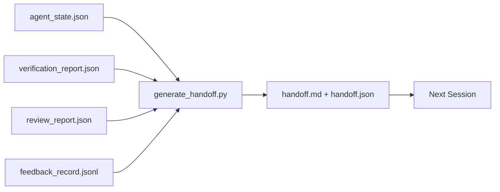

# التداول المتعدد الجلسات

> الجلسة ستنتهي، العمل ليس كذلك، حزمة التسليم هي العناصر التي تحول "الوكيل عمل لمدة ساعة" إلى "الجلسة التالية مثمرة في الدقيقة الأولى". بنيتها عن قصد، وليس كفكر متأخر.

**Type:** Build
**Languages:** Python (stdlib)
**Prerequisites:** Phase 14 · 34 (Repo Memory), Phase 14 · 38 (Verification), Phase 14 · 39 (Reviewer)
**Time:** ~50 minutes

## أهداف التعلم

- حدد السبعة الحقول التي تحتاجها كل حزمة التسليم
- إنتاج التسليم من الأثاث من مكتب العمل دون كتابة النص اليدوي.
- قم بتقليص سجلات المراجعة الكبيرة إلى ملخص بحجم التسليم.
- اجعل أول عمل في الجلسة القادمة ديترمينستياً

## المشكلة

تنتهي الجلسة. يقول العميل "عظيم، لقد تقدمنا". يفتح الجلسة التالية. يسأل العميل التالي "أين توقفنا؟" أجابة العميل الأول قد اختفت. العميل التالي يكتشف مرة أخرى، ويجري نفس الأوامر مرة أخرى، ويطرح على الإنسان نفس الأسئلة، ويحرق ثلاثين دقيقة لاسترداد الثلاثين الثانية الأخيرة من الجلسة السابقة.

تكلفة التسليم السيئ يتم دفعها في كل جلسة على مدى عمر المهمة. التحسين هو حزمة يتم إنشاؤها تلقائيًا في نهاية الجلسة: ما الذي تغير ، لماذا ، ما الذي حاول ، ما فشل ، ما الذي تبقى ، ما يجب القيام به أولا في المرة القادمة.

## المفهوم



### سبع حقل كل تسليم يحمل

| Field | Question it answers |
|-------|---------------------|
| `summary` | One paragraph of what was done |
| `changed_files` | The diff at a glance |
| `commands_run` | What was actually executed |
| `failed_attempts` | What was tried and why it did not work |
| `open_risks` | What could bite next session, with severity |
| `next_action` | The first concrete step next session takes |
| `verdict_pointer` | Path to the verification + review reports |

- نعم`next_action`الحقل هو الحامل، التسليم بكل شيء باستثناء`next_action`هو تقرير حالة، وليس التسليم.

### يتم توليد التسليمات، وليس الكتابة

التسليم المكتوب يدويا هو التسليم الذي يتم تخطي في يوم صعب. يقوم المولد بقراءة الأثاث المكتوبة على مقعد العمل وإصدار الحزمة. وظيفة العميل هي ترك مقعد العمل في حالة يمكن للمولد أن يجمعها، وليس كتابة الموجة.

### شكلين: القراءة البشرية والقراءة الآلية

`handoff.md`هذا ما يقرأه الإنسان`handoff.json`هذا ما يقوم به العميل التالي، كلاهما يأتي من نفس المصدر، إذا اختلف، فسيغلب JSON.

### إزالة السجلات

الكامل`feedback_record.jsonl`قد يكون هناك مئات الإدخالات. التسليم يحمل فقط آخر K زائد كل إدخال مع خروج غير الصفر. الجلسة التالية تحميل السجل الكامل إذا لزم الأمر، ولكن الحزمة تبقى صغيرة.

### أترك حالة نظيفة

التسليم يصف العمل، الحالة النظيفة تجعل العمل قابلاً لإعادة العمل.`handoff.md`لا قيمة لها إذا فتحت الجلسة التالية إلى فرق نصف تطبيق، ملف مؤقت نسيت الوكيل، فرع ضائع، واختبار هذا الخطأ قبل حتى أنها تشغيل. ثم يقضي الوكيل التالي عشر دقائق الأولى تنظيف بعد آخر بدلا من بناء، وتكلفة مضافات كل جلسة على حياة المهمة.

لذا فإن الجلسة لا تنتهي عندما تعمل الميزة. إنها تنتهي عندما يكون مكتب العمل في حالة يمكن أن يلخصها المولد والجلسة التالية أن تثق بها. التنظيف هو مرحلته الخاصة، تشغيل قبل التسليم، وهي تحقق، وليس عادة، لأن العادة هي الشيء الذي يتم تخطي في يوم صعب.

| Check | Clean means | Dirty blocks because |
|-------|-------------|----------------------|
| Working tree | Every change committed or explicitly stashed with a note | A half-applied diff looks like intentional work to the next agent |
| Temp artifacts | No `*.tmp`, scratch dirs, debug prints, or commented-out blocks left behind | Stray files pollute the diff and the next agent's mental model |
| Tests | Green, or red with the failure named in `open_risks` | A silent red test is a trap the next session steps in |
| Feature board | `feature_list.json` status reflects reality (Phase 14 · 36) | A stale board sends the next session to work that is already done |
| Branch | On the expected branch, no detached HEAD, no orphan branches | Wrong branch means the next session's first commit lands in the wrong place |

مرحلة التنظيف تنبعث عن`clean_state.json`القائمة الفارغة هي الشرط المسبق الذي يثبته مولد التسليم قبل كتابة حزمة. التسليم المبنوع على شجرة قذرة ليس التسليم، إنه فوضى استنقل. اثنين من الأدوات الزوجية: التنظيف يثبت أن مكتب العمل آمن للخروج، وتثبت التسليم الجلسة التالية يعرف أين تبدأ.

```figure
wb-handoff-packet
```

## بناءها

`code/main.py`تطبيقات:

- محمول يجمع الحالة والحكم والمراجعة والردود في واحد `WorkbenchSnapshot`. . .
- أ`generate_handoff(snapshot) -> (markdown, payload)`وظيفة
- مرشح يختار آخر إدخالات K الإرجاع زائد جميع الخروج غير الصفر.
- إثبات التجربة الذي يكتب`handoff.md`و`handoff.json`بجانب السيناريو

إشغله

```
python3 code/main.py
```

المخرج: جسم مطبوع بالإضافة إلى كلا الملفين على القرص

## أنماط الإنتاج في البرية

كودكس كلي، كود كود، وOpenCode كل شحن قصة ضغط مختلفة؛ والحزمة المهيكلة التسليم تقع فوق كل ثلاثة.

**Compaction strategies vary; the packet schema does not.**POST /v1/responses/compact من Codex CLI هو مقربة AES غير مرئية من جانب الخادم (مسار سريع لنماذج OpenAI) ؛ والخلفية هي "موجز التوفيق" المحلي المرفق على شكل `_summary`رسالة الدور المستخدم. كلود كود يعمل على ضغط تدريجي بخمس مراحل عند 95% من السياق. OpenCode يقوم بتخفيض رسالة على أساس العلامة الزمنية بالإضافة إلى ملخص LLM بخمس عناوين. ثلاثة آليات مختلفة ، نفس الحاجة: تحويل ما يتبقى من الضغط إلى أداة محمولة. الحزمة هي تلك الأداة.

**Fresh-session handoff is not compaction.**التوافق يطول جلسة؛ التسليم يغلق واحد نظيفا و يبدأ التالي. إطار إصدار هرمز #20372 (أبريل 2026) صحيح: عندما يبدأ الضغط في المكان بالتدهور، يجب على الوكيل كتابة إرسال ملموس، وإنهاء الجلسة، والاستئناف في سياق جديد. الحزمة هي ما يجعل هذه الانتقال رخيصة الخطأ هو الاستمرار في الضغط حتى تتدهور الجودة، والحل هو تقديم ميزانية لتسليم مبكر ونظيف.

**One active handoff per branch and topic.**تنسيق العاملين المتعددين ينفصل أكثر في التسليمات القديمة من النموذج السيئ.`branch`،`last_known_good_commit`و`status`من`active | superseded | archived`يتم حفظ التسليمات المتبقية، ويدفع فقط المنتظم النشط الجلسة التالية. هذا هو الفرق بين التسليمات كالملاحظات والتسليمات كالدولة.

**Wrap up before 50-75% context, not at the wall.**يذكر دليل اللعب المكتوب يدوياً (CLAUDE.md + HANDOVER.md) بأفضل النتائج عندما تنتهي الجلسة عند ميزانية سياق 50-75% بدلاً من 95%. يعمل مولد الحزم نظيفًا قبل أن تلوث أثاث الضغط حالة المصدر. رخيصًا الكتابة بينما يكون السياق سليمًا ؛ مكلفًا عندما يفقد النموذج بالفعل مكانه.

## استخدمها

أنماط الإنتاج:

- **Session-end hook.**وقت تشغيل يطلق المولد عندما يغلق المستخدم المحادثة.`outputs/handoff/<session_id>/`. . .
- **PR template.**إنّه أيضاً جهاز علاقات عامة، يقرأه المراجعون دون فتح خمسة ملفات أخرى.
- **Cross-agent handoff.**بناء مع منتج واحد (كود كلو) ، استمر مع آخر (كودكس).

الحزمة صغيرة، منتظمة، و رخيصة لإنتاج.

## أرسله

`outputs/skill-handoff-generator.md`ينتج مولد مصمم على مسارات الملفات المشاريع، وربط نهاية الجلسة التي تشغيلها، و `handoff.json`النظام الذي يقرأه العميل التالي عند بدء العمل

## التمارين

1. إضافة `assumptions_to_validate`الحقل الذي يظهر كل افتراض قام البنّاء بتسجيله لكن المراجع لم يصل إلى 1
2. قم بتقليص الموجب المختلف للفشل في الجري مقابل الجري.
3. إضافة قائمة "أسئلة للبشر". ما هو العدالة التي يمكن أن تُجري فيها سؤال في الحزمة مقابل في رسالة الدردشة؟
4. اجعل المولد غير قوي: تشغيله مرتين ينتج نفس الحزمة. ما الذي يحتاج إلى أن يكون مستقراً لكي يستمر؟
5. إضافة قسم "مواصفات الجلسة التالية" يصف بالضبط الأدوات التي يجب أن تحملها الجلسة التالية قبل التصرف.

## الشروط الرئيسية

| Term | What people say | What it actually means |
|------|----------------|------------------------|
| Handoff packet | "Session summary" | Generated artifact carrying the seven fields, both markdown and JSON |
| Next action | "What to do first" | The one concrete step that starts the next session |
| Feedback trim | "Log summary" | Last K records plus every non-zero exit |
| Status report | "What we did" | A document missing `next_action`; useful, but not a handoff |
| Verdict pointer | "Receipt" | Path to the verification + review reports for traceability |

## المزيد من القراءة

- [Anthropic, Effective harnesses for long-running agents](https://www.anthropic.com/engineering/effective-harnesses-for-long-running-agents)
- [OpenAI Agents SDK handoffs](https://openai.github.io/openai-agents-python/handoffs/)
- [Codex Blog, Codex CLI Context Compaction: Architecture, Configuration, Managing Long Sessions](https://codex.danielvaughan.com/2026/03/31/codex-cli-context-compaction-architecture/) POST /v1/ردود/موافقة ومواجهة الرد المحلية
- [Justin3go, Shedding Heavy Memories: Context Compaction in Codex, Claude Code, OpenCode](https://justin3go.com/en/posts/2026/04/09-context-compaction-in-codex-claude-code-and-opencode) مقارنة ضغط ثلاثة بائع
- [JD Hodges, Claude Handoff Prompt: How to Keep Context Across Sessions (2026)](https://www.jdhodges.com/blog/ai-session-handoffs-keep-context-across-conversations/) CLAUDE.md + HANDOVER.md، 50-75% من ميزانية السياق
- [Mervin Praison, Managing Handoffs in Multi-Agent Coding Sessions: Fresh Context Without Losing Continuity](https://mer.vin/2026/04/managing-handoffs-in-multi-agent-coding-sessions-fresh-context-without-losing-continuity/)إطار الأنظمة الموزعة
- [Hermes Issue #20372 — automatic fresh-session handoff when compression becomes risky](https://github.com/NousResearch/hermes-agent/issues/20372)
- [Hermes Issue #499 — Context Compaction Quality Overhaul](https://github.com/NousResearch/hermes-agent/issues/499) الإشارات المتوجهة إلى التسليم في كودكس كلي
- [Microsoft Agent Framework, Compaction](https://learn.microsoft.com/en-us/agent-framework/agents/conversations/compaction)
- [OpenCode, Context Management and Compaction](https://deepwiki.com/sst/opencode/2.4-context-management-and-compaction)
- [LangChain, Context Engineering for Agents](https://www.langchain.com/blog/context-engineering-for-agents)
- المرحلة 14 · 34  الملف الحالي الذي يقرأه المولد
- المرحلة 14 · 38  الحكم التحقق نقاط الحزمة في
- المرحلة 14 · 39  تقرير المراجعة المجمعة في الحزمة
