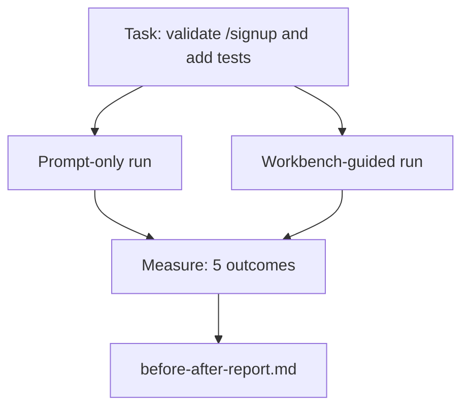

# مكتب العمل في ريبو حقيقي

> لا قيمة لها 11 درساً من السطحات إذا لم تنجو من الاتصال بقاعدة رمزية حقيقية. هذه الدروس تعمل نفس المهمة مرتين على تطبيق نموذج صغير: فقط على طلب مقابل مقعد عمل. الأرقام تفعل الحجة.

**Type:** Build
**Languages:** Python (stdlib)
**Prerequisites:** Phases 14 · 32 to 14 · 40
**Time:** ~60 minutes

## أهداف التعلم

- اجمع السطحات السبعة من المكتب معا على تطبيق صغير.
- قم بنفس المهمة مرتين (فقط على الفور وبدليل على المنصة) وقياس خمسة نتائج.
- اقرأ تقرير قبل / بعد وقرر أي سطحات أعطت أكبر نفوذ.
- الدفاع عن مقعد العمل ضد "لكن نموذجي جيد بما فيه الكفاية"

## المشكلة

لا يقنع أحد بتجربة مهمة لعبة. يتم إنشاء قضية لوحة العمل عندما تنطلق مهمة حقيقية في عملية إعادة التأهيل حقيقية في الإنتاج مع أقل فشلات ، أقل عكسات ، وزملاً يمكن استخدامه في الجلسة التالية.

هذه الدروس تُرسل تلك الإستعراضات الحقيقية وتُدير نفس المهمة عبر كلا الأنابيب. النتيجة هي تقرير قبل / بعد يمكنك تقديمها إلى المشكك.

## المفهوم



### تطبيق العينة

معالج بسيط في نمط FastAPI في `sample_app/`:

- `app.py`مع`/signup`(لا توثيق بعد)
- `test_app.py`مع اختبار واحد من طريق السعادة.
- `README.md`و`scripts/release.sh`كطعم في المنطقة المحظورة

### المهمة

> إضافة تصحيح المدخل إلى `/signup`: رفض كلمات المرور قصيرة من 8 أحرف، أعيد 422 مع غلاف الخطأ المكتوب. أضف اختبار يثبت السلوك الجديد.

### خطوط الأنابيب الثانية

فقط في وقت مبكر:

1. اقرأ القراءة
2. اقرأ`app.py`. . .
3. إصلاح الملفات.
4. دعوى جاهزة.

المكالمة الموجزة على المنصة:

1. إشغال النص الأول (المدرسة 35).
2. اقرأوا المجال المطلوب من العقد (الدرس 36).
3. قراءة الحالة (الدرس 34).
4. إصلاح الملفات المسموح بها فقط.
5. تشغيل أمر القبول عبر جهاز التغذية (المدرسة 37).
6. أطلق بوابة التحقق (المدرسة 38).
7. المراجعة (المدرسة 39).
8. توليد التسليم (المدرسة 40).

### النتائج الخمسة التي تم قياسها

| Outcome | Why it matters |
|---------|----------------|
| `tests_actually_run` | Most "tests passed" claims are unverifiable |
| `acceptance_met` | The test that proves the goal must be the test that ran |
| `files_outside_scope` | Scope creep is the dominant silent failure |
| `handoff_quality` | The next session pays for or benefits from this |
| `reviewer_total` | Qualitative judgment on top of the gate |

```figure
wb-ab-runs
```

## بناءها

`code/main.py`ينسق خط الأنابيبين ضد نفس جهاز تطبيق العينات. كل من خط الأنابيبين مكتوب (لا LLM في الحلقة) بحيث يكون القياس قابلاً للتكرار. الكتابة الكتابة المقارنة في `before-after-report.md`و`comparison.json`. . .

إشغله

```
python3 code/main.py
```

الناتج: جدول الموافقة من النتائج لكل خط أنابيب، وتقرير التمرير المحتفظ بجوار النص، وال JSON لمن يريد رسمها.

## أنماط الإنتاج في البرية

سؤال المشكك هو "كم يساعد مكتب العمل في الواقع؟" أرقام 2026 تقول الكثير أكثر من التفسير.

**Terminal Bench Top-30 to Top-5 on the same model.*** أناثومية حزمة عميل من لانغ تشين * (أبريل 2026): قفز عميل برمجة من خارج العشرين الأولى ليصل إلى المرتبة الخامسة على مقعد المحطة 2.0 عن طريق تغيير الحزمة فقط. نفس النموذج. سطحات مختلفة. 25 درجة دلتا.

**Vercel 80% to 100% by deleting tools.**ووردت فيروسيل عن حذف 80٪ من أدوات عملها تحولت معدل النجاح من 80٪ إلى 100٪ مساحة أداة أصغر، نطاق أكثر حيوية، أقل طرق للفشل. الفضاء السلبي يفوز.

**Harvey 2x accuracy via harness alone.**وكلاء القانون أكثر من مضاعفة دقةهم من خلال تحسين الحزام، لا تغيير في النموذج.

**88% of enterprise AI agent projects fail to reach production.**ورقة preprints.org * Harness Engineering for Language Agents* (مارس 2026) تتبع الفشل إلى الوقت الزمني، وليس التفكير: حالة قديمة، محاولات إعادة هشاشة، سياق مبالغ فيه، تعافي سيء من الأخطاء المتوسطة.

**Long-context collapse.**يقلل نسبة نجاح ويبجنت 40-50٪ إلى أقل من 10٪ في ظروف سياق طويل ، معظمها من حلقات لا نهاية لها وفقدان الهدف.

**False negatives still exist.**المهام الفعلية في خطوة واحدة، وخط واحد، و تشغيل المنسق، أي شيء قد حفظه النموذج حرفيا  هذه تعمل أسرع على الفور فقط. يجب أن يعد المعيار بصراحة حتى لا يتم إطار منصة العمل كغسيل.

المشكلة ليست أن "الحزام يفوز للأبد". النماذج تستوعب خدوش الحزام مع مرور الوقت. المشكلة هي أن اليوم، الحمل الهندسية يقع في السطح السبع، والأرقام تثبت ذلك.

## استخدمها

هذا الدروس هو ملف القضية التي ستذكرها عندما:

- شخص ما يسأل لماذا كل علاقات عامة تحمل`agent-rules.md`و عقد مدى
- فريق يريد أن يلقي بوابة التحقق "فقط لهذا السباق"
- يتم إطلاق منتج وكيل جديد وتحتاج إلى مقياس محمول لمعرفة ما إذا كان يوفر الوقت فعلاً

الأرقام تذهب أبعد من التفسير

## أرسله

`outputs/skill-workbench-benchmark.md`هو جهاز تقييم محمول يعمل على تشغيل أي منتج عامل عبر كلا الأنابيب ضد تطبيق العينة الخاصة بالمشروع ويقدم تقارير عن النتائج الخمسة.

## التمارين

1. أضف النتيجة السادسة: وقت إلى أول تحرير ذو معنى. كيف تقيسها نظيفاً؟
2. قم بتقارنة مهمة يوميّة حقيقية في قاعدة رموزك، أين تنزلق أرقام مقاعد العمل؟
3. إضافة "سلبية كاذبة" مرسلة: المهام التي كانت فقط التسجيلات سوف تكون أسرع والتكلفة العليا من مكتب العمل هو التكلفة الحقيقية. الدفاع عن الحفاظ على مكتب العمل على أي حال.
4. استبدل "الوكيل" المكتوب بمكالمة ماجستير في العلوم الحقيقية
5. مؤلف ملخص صفحة واحدة موجهة إلى غير مهندس. ما الذي نجى من الجرح؟

## الشروط الرئيسية

| Term | What people say | What it actually means |
|------|----------------|------------------------|
| Sample app | "Toy repo" | Small but realistic enough to exercise all seven surfaces |
| Pipeline | "Workflow" | Ordered sequence of surface reads/writes the agent follows |
| Before/after report | "The receipts" | The artifact you hand to a skeptic |
| False negative | "Workbench overkill" | Tasks where prompt-only is faster; useful to enumerate honestly |
| Workbench benchmark | "Reliability score" | Portable harness that runs the comparison on your codebase |

## المزيد من القراءة

- [LangChain, The Anatomy of an Agent Harness](https://blog.langchain.com/the-anatomy-of-an-agent-harness/) إصدار الإيصالات من المرفق التالي 30 إلى المرفق الخامس
- [MongoDB, The Agent Harness: Why the LLM Is the Smallest Part of Your Agent System](https://www.mongodb.com/company/blog/technical/agent-harness-why-llm-is-smallest-part-of-your-agent-system) أرقام Vercel + Harvey
- [preprints.org, Harness Engineering for Language Agents](https://www.preprints.org/manuscript/202603.1756) 88% معدل فشل المؤسسات، أسباب أساسية في وقت التشغيل
- [HN: Improving 15 LLMs at Coding in One Afternoon. Only the Harness Changed](https://news.ycombinator.com/item?id=46988596) تم تكرارها عبر 15 طراز
- [Cloudflare, Orchestrating AI Code Review at Scale](https://blog.cloudflare.com/ai-code-review/) 131 ألف جولة مراجعة / 30 يوم في الإنتاج
- [Anthropic, Building Effective Agents](https://www.anthropic.com/research/building-effective-agents)
- المراحل 14 · 32 إلى 14 · 40  السطحات هذه الدروس تمارين نهاية إلى نهاية
- المرحلة 14 · 19  SWE-البنك، GAIA، وكيل البنك كالمعايير الكلية هذه الدروس تكمل
- المرحلة 14 · 30  تطوير عامل مدفوع بالقياس نفس وصلات الحزام في
