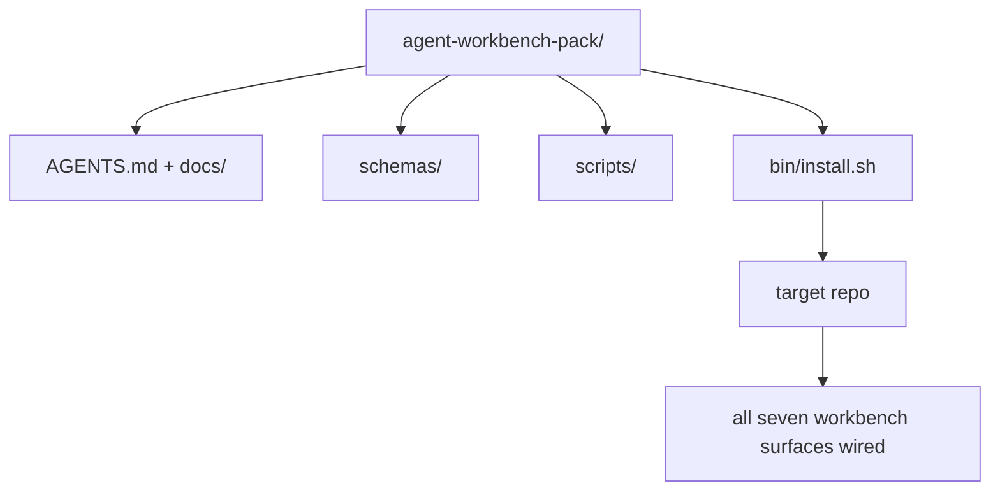

# الحجر الرئيسي: إرسال حزمة لوحة العمل للعملاء المستخدمين مرة أخرى

> يُنهي المسار الصغير مع حزمة يمكنك إلقاءها في أي إعادة التأمين.`cp -r`ويكون لدينا عميل يعمل بشكل موثوق به في الصباح التالي

**Type:** Build
**Languages:** Python (stdlib)
**Prerequisites:** Phases 14 · 31 to 14 · 41
**Time:** ~75 minutes

## أهداف التعلم

- إغلف السطحات السبعة من سطح المكتب إلى دليل واحد
- قم بتثبيت الخطط والمنشورات والعلامات حتى يحصل الردود الجديد على خط أساسي معروف
- إضافة نص إعداد واحد يضع الحزمة دون أثر.
- قرروا ما يبقى في الحزمة وما يبقى خارجها، ويدفعوا عن الجرح لكل واحد.

## المشكلة

لوحة عمل تعيش في Google Doc، وتاريخ الدردشة، وثلاثة نصوص نصف تذكر هي لوحة عمل يتم إعادة بناءها كل ربع. العلاج هو حزمة إصدارات: إعادة التأمين أو دليل مع السطحات، والخطط، والنصوص، ومثبتة قيادة واحدة.

ستنهي هذا الدروس بـ`outputs/agent-workbench-pack/`تم إرسالها على القرص و`bin/install.sh`الذي يضعها في أي إعادة التأمين الهدف.

## المفهوم



### ترتيب الحزمة

```
outputs/agent-workbench-pack/
├── AGENTS.md
├── docs/
│   ├── agent-rules.md
│   ├── reliability-policy.md
│   ├── handoff-protocol.md
│   └── reviewer-rubric.md
├── schemas/
│   ├── agent_state.schema.json
│   ├── task_board.schema.json
│   └── scope_contract.schema.json
├── scripts/
│   ├── init_agent.py
│   ├── run_with_feedback.py
│   ├── verify_agent.py
│   └── generate_handoff.py
├── bin/
│   └── install.sh
└── README.md
```

### ما يبقى في، ما يبقى خارج

في:

- مخططات السطح، هذه هي العقد
- السيناريو الأربع أعلاه، إنها وقت التشغيل
- الأوراق الأربعة، هذه هي القواعد والقواعد

خارج:

- مهام محددة للمشروع، المهام تنتمي إلى لوحة الاستعمار المستهدفة، وليس إلى الحزمة.
- الموردين يطلبون SDK، الحزمة هي الإطار معتاد.
- البيانات المضافة، الحزمة تعيش بجانب المضافة الموجودة في الفريق، وليس داخلها

### الجهاز التركيب

قصيرة`bin/install.sh`(أو `bin/install.py`):

1. يرفض التركيب على حزمة موجودة بدون `--force`. . .
2. نسخ الحزمة إلى صندوق الهدف
3. السلك على المعلومات إذا كان`.github/workflows/`-لا يوجد
4. طباعة الخطوات التالية: ملء اللوحة، وضع أوامر القبول، تشغيل النص الإبتدائي.

### الإصدار

الحزمة تحمل`VERSION`الملف. تعطلات الخطة وتغييرات النص المطلوبة الهجرة تعطل الرئيسي. تغييرات الوثائق فقط تعطل الإصلاح. إعادة التأمين المستهدف`agent_state.json`سجلات نسخة الحزمة التي تم تشغيلها ضد.

```figure
wb-pack-install
```

## بناءها

`code/main.py`يجمع الحزمة إلى`outputs/agent-workbench-pack/`بجانب الدروس، زرع مع مخططات والخطوط من الدروس السابقة في هذا المسار الصغير والوثائق التي كتبتها بالفعل.

إشغله

```
python3 code/main.py
```

النص النسخة وتحديد السطح، يكتب README، طباعة شجرة الحزمة، وتخرج من الصفر. إعادة التشغيل غير فعال.

## أنماط الإنتاج في البرية

حزمة لا تكون قيمة إلا إذا بقيت على قيد الحياة من الشوك والتحديثات، والتي لا تُعجبها الجدول.

**`VERSION` is the contract, not the marketing.**الضباب الكبرى تتطلب هجرة الحالة الضباب الصغيرة تتطلب إعادة تشغيل المحقق الضباب المزيف هو وثيقة فقط`.workbench-version`في إعادة الإعلان المستهدفة في كل عملية إرسال ؛`lint_pack.py`يرفض الشحن إذا كان قفل الهدف غير متفق مع حزمة`VERSION`هكذا`npm`،`Cargo`و`pyproject.toml`على قيد الحياة 10 سنوات من التشنج، لا شيء حول العملاء تغيير القواعد.

**Single source for cross-tool distribution.**سفن Nx واحد `nx ai-setup`هذا يضع`AGENTS.md`،`CLAUDE.md`،`.cursor/rules/`،`.github/copilot-instructions.md`يجب أن تفعل نفس الشيء ، ويمنح المثبت الروابط (`ln -s AGENTS.md CLAUDE.md`لذا فإن مصدر واحد من الحقيقة يُعطي كل وكيل للتشفير.

**`uninstall.sh` that refuses on non-trivial state.**إزالة إزالة الحزمة لا يجب حذف إزالة المستخدم `agent_state.json`،`task_board.json`أو`outputs/`. إزالة التثبيت يزيل الخططات، النصوص، وثائق، و`AGENTS.md`(مع `--keep-agents-md`الاختيار خارج) ويرفض المضي قدما إذا كانت ملفات الدولة لديها أي تغييرات غير ملتزمة.

**Skill-as-publishable. SkillKit-style distribution.**السفن الحزمة كمهارة SkillKit: `skillkit install agent-workbench-pack`يضعها على 32 وكيلًا من الذكاء الاصطناعي من مصدر واحد. إعادة التأمين هو مصدر الحقيقة؛ SkillKit هو قناة التوزيع. تسقط قفل البائع؛ السطحات السبع تبقى نفسها.

## استخدمها

ثلاثة أماكن سفن الحزمة:

- **As a directory you drop into a repo.** `cp -r outputs/agent-workbench-pack /path/to/repo`. . .
- **As a public template repo.**- التخصيص، مع `VERSION`تحكم التنحير
- **As a SkillKit skill.**تم توصيله إلى منتج عميلك حتى يتم وضعها في أمر واحد

الحزمة هي الوصفة كل إعداد هو حصة

## أرسله

`outputs/skill-workbench-pack.md`يخلق حزمة مُعدّلة للمشروع: قواعد تم تحديدها لتاريخ الفريق، وأحجام نطاق مطابقة لـ"الردود"، وأبعاد المادة تم تمديدها بإدخال محدد للمجال.

## التمارين

1. قرروا أي وثيقة خامسة تختارها تستحق الترقية إلى الحزمة القنونية
2. إعادة كتابة التركيب باستخدام Python`--dry-run`-قارنة التجربة مع (باش)
3. إضافة`bin/uninstall.sh`الذي يزيل الحزمة بأمان ويرفض إذا كانت ملفات الدولة لديها تاريخ غير بسيط.
4. إضافة`lint_pack.py`التي تفشل عندما تتحرك الحزمة من`VERSION`-أوصلها إلى المعلوماتية لتسجيل الحزمة
5. كتاب كتاب الهجرة من مقعد عمل يدوي إلى هذه الحزمة ما هو ترتيب العمليات التي تقلل من وقت الإيقاف؟

## الشروط الرئيسية

| Term | What people say | What it actually means |
|------|----------------|------------------------|
| Workbench pack | "The starter kit" | A versioned directory carrying all seven surfaces |
| Installer | "Setup script" | `bin/install.sh` that lays the pack down idempotently |
| Pack version | "VERSION" | Major bumps for schema/script changes, patch for doc-only |
| Drop-in pack | "cp -r and go" | Pack works without per-repo customization on day one |
| Forkable template | "GitHub template" | Public repo that GitHub's "Use this template" can clone from |

## المزيد من القراءة

- المراحل 14 · 31 إلى 14 · 41  كل سطح هذه الحزمة
- [SkillKit](https://github.com/rohitg00/skillkit) تثبيت هذه المهارة على 32 وكيل الذكاء الاصطناعي
- [Nx Blog, Teach Your AI Agent How to Work in a Monorepo](https://nx.dev/blog/nx-ai-agent-skills) مولد مصدر واحد عبر ست أدوات
- [agents.md — the open spec](https://agents.md/) ما يجب أن ينفذ جهاز توجيه حزمة التوصيل الخاصة بك
- [HKUDS/OpenHarness](https://github.com/HKUDS/OpenHarness) تنفيذ مرجعية لمكافئ الحزمة
- [andrewgarst/agentic_harness](https://github.com/andrewgarst/agentic_harness) إشارة مدعومة من إعادة التأهيل مع مجموعة تقييم
- [Augment Code, A good AGENTS.md is a model upgrade](https://www.augmentcode.com/blog/how-to-write-good-agents-dot-md-files) إعداد الوثائق
- [Anthropic, Effective harnesses for long-running agents](https://www.anthropic.com/engineering/effective-harnesses-for-long-running-agents)
- [Anthropic, Harness design for long-running application development](https://www.anthropic.com/engineering/harness-design-long-running-apps)
- المرحلة 14 · 30  تطوير عامل مدفوع بالقياس الذي يستغرق بوابة التحقق من الحزمة
- المرحلة 14 · 41  المرجعية قبل / بعد هذه الحزمة تحسن على
