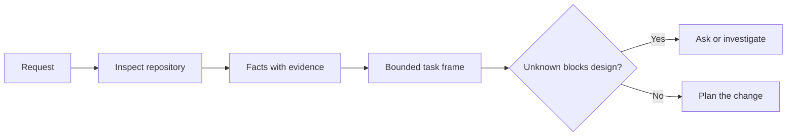

# إعداد المهمة قبل أن يكتب العميل الرمز

> وكيل التشفير يمكنه تنفيذ مهمة واضحة بسرعة. يمكنه أيضا تنفيذ مهمة غير واضحة بسرعة. السرعة هي نفسها. التكلفة ليست كذلك.

**Type:** Learn + Build
**Languages:** Python (stdlib)
**Prerequisites:** Phase 14 lessons 31 and 36
**Time:** ~60 minutes

## أهداف التعلم

- حول طلب إلى إطار مهمة محدد قبل التحرير.
- فصل الحقائق المرجعية عن الافتراضات والسئلة المفتوحة.
- تعريف المسارات المسموح بها، والمسارات المحظورة، والدليل على قبولها.
- قرر متى يكون التجسس كافياً لبدء العمل

## الفشل الثمين

إضافة حماية البريد الإلكتروني المكرر يبدو محدداً. ليس كذلك. هل التفريد ينتمي إلى API أو خدمة النطاق أو قاعدة البيانات؟ هل تكون المقارنة حساسة للحالة؟ ما هي شكل الخطأ العام بالفعل؟ هل يسمح بالهجرة؟ أي اختبار يثبت السلوك؟

وكيل قادر سوف يملأ هذه الفجوات باختيارات معقولة. هذه هي الحالة الخطرة لأن التنفيذ يمكن أن تكون نظيفة، اختبار، ومع ذلك لا تزال غير متوافقة مع النظام.

لذا فإن الوحدة الأولى من عمل وكيل التشفير ليست تحرير. إنها إطار مهم مدعوم من خلال دليل مخزن.

## إطار المهمات

الإطار المفيد له ستة مجالات:

| Field | Question |
|---|---|
| Goal | What observable behavior must change? |
| Repository facts | What did you verify in code, tests, config, or history? |
| Allowed paths | Where may the change land? |
| Forbidden paths | What must remain untouched? |
| Acceptance evidence | Which commands or observations prove the goal? |
| Unknowns | Which decisions still need evidence or human judgment? |

تحتاج الحقائق إلى الإيصالات. تستخدم API 409 للنسخة المزدوجة ليست حقيقة حتى تتمكن من الإشارة إلى الاختبار أو المعاملة الموجودة. مسار الملف والخط كاف. نتيجة الأوامر أفضل عندما يكون السلوك مهمًا.



## التعرف على القيود هو البحث عن القيود

لا تقرأ المستودع بأكمله. ابحث عن السطحات التي تقيد التغيير:

1. السلوك الحالي ومُتصل به
2. أقرب اختبار موجود
3. العقد العام أو الشكل المتسلسل
4. تعليمات المشروع التي تحكم المسار
5. أوامر البناء والتحقق
6. تغييرات مشابهة مكتملة تكشف عن الأنماط المحلية.

توقف عندما يكون كل قرار مخطط يدعم به إما بالدليل أو تم تفويضه صراحة أو يُدعى بأنه مجهول.

## المجهولات ليست فشل

المجهول هو فجوة خاضعة للسيطرة الافتراض هو إجابة غير خاضعة للسيطرة على تلك الفجوة

تصنيف كل مجهول:

- **Discoverable:**يمكن للمخزن أو النظام التشغيلي الإجابة عليه.
- **Decidable:**عقد المهمة يعطي الوكيل سلطة اختيار.
- **Human:**يغير الخيار سلوك المنتج أو التكلفة أو المخاطر أو التوافق العام.
- **Deferred:**الخيار خارج هذا الجزء ويأتي في غياب الأهداف

يجب أن يستمر العميل عبر المجهولات التي يمكن اكتشافها و تمنحها، يجب أن يتوقف على المجهولات البشرية قبل أن يتم دفن الخيار في الرمز.

## القبول قبل التنفيذ

اكتب الدليل قبل التشغيل

- إدارة اختبار مركزة أو تكامل
- رحلة متصفح مع منفذ عرض مسمى والحالة المتوقعة.
- طلب بالأسلاك وعقد الإجابة الدقيقة
- قياس الأداء مع عتبة؛
- فحص المجال الذي يؤكد عدم تغيير أي ملف غير مرتبط.

موافقة الاختبارات ليست خطة إثبات. أسمي الاختبار المعتمد والادعاء الذي يدعمه.

## بناءها

المختبر يخلق`TaskFrame`، يصدق حدودها و أدلة ، و يكتب`outputs/task-frame.md`. . .

إدارة من هذا دليل الدروس:

```bash
python3 code/main.py
python3 -m unittest discover code/tests -v
```

كسر المثال بأربعة طرق: إزالة الهدف، إزالة استلام الحقيقة، التداخل بين مسار مسموح به ومحرم، وإزالة أمر القبول. يجب على المؤكد رفض كل إطار لسبب مختلف.

## استخدمها في مخزن حقيقي

قبل أن تطلب من وكيل تحرير:

1. اكتب الهدف كسلوك وليس تغيير الملف
2. سجل اثنين أو ثلاثة حقائق مع أدلة دقيقة.
3. أسمي أصغر مجموعة مسارات مسموح بها
4. اسم المساحة السلبية صراحة.
5. اكتب القيادة أو الملاحظة التي تغلق المهمة.
6. قم بإدراج القرارات التي لم تستحقها بعد.

يجب أن يتناسب الإطار على شاشة واحدة. إذا لم يتم ذلك، قد تحتوي المهمة على تغييرات متعددة يمكن التحقق منها بشكل مستقل.

## التمارين

1. إصطناع خطأ حقيقي من أحد مستودعاتك دون اقتراح حل
2. إبحث عن ادعاء واحد في الإطار الذي هو افتراض في الواقع واستبدله بالدليل
3. إضافة شخص مجهول يجيب على العقد العام
4. تقسيم مسار واحد واسع مسموح به في أصغر مجموعة آمنة.
5. إضافة إيصال النطاق إلى دليل القبول.

## المزيد من القراءة

- [Nuseibeh and Easterbrook, Requirements Engineering: A Roadmap](https://www.cs.toronto.edu/~sme/papers/2000/ICSE2000.pdf)، لتثبيت التنفيذ على أهداف العالم الحقيقي والقيود المتطورة.
- [Yang et al., SWE-agent: Agent-Computer Interfaces Enable Automated Software Engineering](https://arxiv.org/abs/2405.15793)، لإثبات أن واجهة حول وكيل التشفير تغير فعاليتها.

## ما تحافظ عليه

إبق`outputs/task-frame.md`. هو مدخل الدروس التالية، حيث يصبح الإطار خطة تنفيذية مدعومة بالأدلة.
