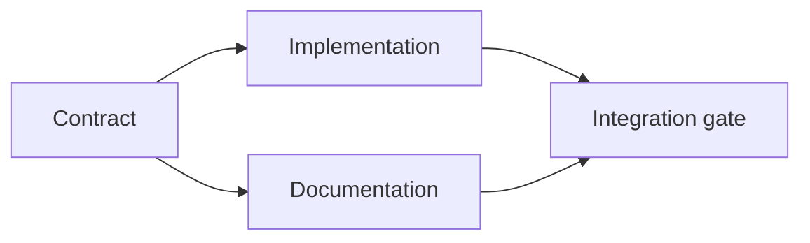

# قم بإنشاء خطة تنفيذية تدعمها الأدلة

> خطة ليست قائمة أعمال جميلة. إنها رسم بياني يعتمد فيه كل تغيير له سبب وكل عقدة نهاية له دليل.

**Type:** Learn + Build
**Languages:** Python (stdlib)
**Prerequisites:** Phase 14 lesson 43
**Time:** ~65 minutes

## أهداف التعلم

- حول إطار المهمة إلى عناصر عمل مع الأدلة والبرهان.
- النموذج التنظيم كاعتماد بدلا من تسلسل النص.
- اكتشاف الحقائق المفقودة، والاعتمادات غير المعروفة، والدورات قبل التحرير.
- خطوات منفصلة يمكن أن تجري معا من خطوات التي يجب أن تنتظر.

## لماذا تفشل خطط العملاء

خطط ضعيفة تكرر الطلب في الوقت المقبل:

1. قم بتحديث إطار الإعداد
2. إضافة الاختبارات.
3. تحديث الوثائق

لا يوجد شيء في تلك القائمة يُخبر ما تم العثور عليه، لماذا هذه الملفات صحيحة، أي عقد يتغير أولاً، أو ما يمكن أن يحدث في وقت واحد.

خطة قوية تضع خمس التزامات لكل عنصر عمل:

| Commitment | Purpose |
|---|---|
| Identifier | Stable reference for dependencies and handoff |
| Change | The smallest behavior or contract change |
| Evidence | Repository facts that justify the change |
| Dependencies | Work that must be true first |
| Proof | The exact check that closes the item |

## تخطيط العقد قبل تنفيذها

عندما تعتمد العديد من السطحات على نفس السلوك، حدد السلوك أولاً. يمكن بعد ذلك مشاركة عقد واحد بدلاً من اختراع أربعة إصدارات.



الرسم البياني يظهر التزامن الآمن. يمكن أن يتواصل التنفيذ والوثائق معا بعد إصلاح العقد. التكامل ينتظر كليهما.

## الأدلة تغير الخطة

لا يعد دليل المحتفظة ديكورية يجب أن يكون قادرًا على تغيير العمل:

- المساعد الحالي يزيل التجريد الجديد المخطط له
- اختبار التوافق يفرض خطوة الهجرة.
- قيود التنفيذ تنتقل تغيير النظام إلى مهمة أخرى.
- نوع الاستجابة العامة يغير ترتيب التنفيذ والوثائق.

إذا كانت الأدلة لا يمكن أن تغير الخطة، فإنها لا تكون على الأرجح دليل على هذا القرار.

## تصميم للانقطاع

تنتهي جلسات وكيل التشفير بشكل غير متوقع. خطة إعادة التنفيذ لها عناصر عمل صغيرة بما فيه الكفاية يمكن لجلسة أخرى تحديد:

- أي عنصر مكتمل ؛
- ما هو دليل التدقيق؟
- أي أثاث تغيرت؛
- أي تعتمدات غير مقفلة الآن؟
- ما هي المادة الآمنة التالية

لا ترميز الحالة فقط في صناديق الإشارة داخل المحادثة. تخزين الخطة بجانب العمل.

## تأكيد الخطة

رفض الخطة قبل تنفيذها عندما:

- يتم نقل معرف؛
- لا يوجد دليل على وجود عنصر عمل؛
- لا يوجد دليل على عنصر العمل؛
- تعتمد على اسم عنصر مجهول.
- يحتوي الرسم البياني على دورة؛
- يحدث أول إجراء لا رجعة فيه قبل حل عدم اليقين المعني.

أول خمسة عمليات فحص ميكانيكية، والآخر يتطلب الحكم ويجب أن يتم استدعائه صراحة.

## بناءها

`code/main.py`النماذج العمل على العناصر، وتؤكد إيصالاتها، وحساب موجات التنفيذ مع نوع التوبولوجي، ويكتب `outputs/evidence-plan.json`. . .

أركض

```bash
python3 code/main.py
python3 -m unittest discover code/tests -v
```

النموذج ينتج ثلاث موجات. تعريف العقد يبدأ أولاً. تنفيذ وثائق يبدأ معاً. بوابة التكامل يبدأ أخيراً.

## استخدمها مع وكيل التشفير

اطلب من العميل ان يقدم الخطة قبل ان يغير الملفات

1. كل دعوى عن المسار والسلوك لديها إيصال من مخزن
2. كل شيء لديه دليل واضح على الانتهاء
3. الرسم البياني يؤخر العمل الثمين أو غير العكسي حتى يتم حل عدم اليقين الذي يعتمد عليه.

أوافق على الخطة، وليس وعد غامض بالتحذر

## التمارين

1. إضافة عنصر الهجرة الذي يتطلب موافقة بشرية صريحة.
2. قم بإنشاء دورة و اشرح الخلاف الخفية بين المنتجات وراءها
3. تقسيم عنصر واحد لديه أمرين دليل.
4. أضف عنصر العمل الذي يمكن أن يبدأ في الموجة الثانية دون لمس أي من الفرع الموجودة.
5. أعد الخطة كـ "ماركداون" مع الحفاظ على "جي إس أون" كمصدر الحقيقة.

## المزيد من القراءة

- [Nuseibeh and Easterbrook, Requirements Engineering: A Roadmap](https://www.cs.toronto.edu/~sme/papers/2000/ICSE2000.pdf)، للعلاقة المتكررة بين الأهداف والتفاصيل والاتفاق والتطور.
- [Barry Boehm, A Spiral Model of Software Development and Enhancement](https://dl.acm.org/doi/10.1145/12944.12948)، لتنظيم التطوير حول حل المخاطر بدلاً من تسلسل خطي ثابت.

## ما تحافظ عليه

إبق`outputs/evidence-plan.json`هذا يصبح عقد التفويض في الدروس التالية
