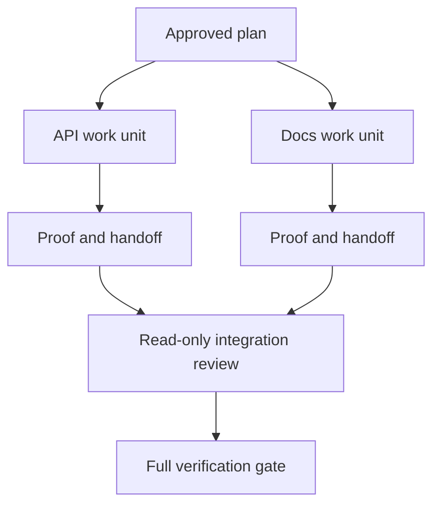

# وكيل المفوض يعمل مع عقد العزل والاندماج

> وكلاء متوازين يوفّرون وقت الجدار فقط عندما يكون العمل مستقلًا. وإلا يحولون مهمة واضحة إلى مشكلة تنسيق مع معدل فشل أسرع.

**Type:** Learn + Build
**Languages:** Python (stdlib)
**Prerequisites:** Phase 14 lessons 39 and 44
**Time:** ~70 minutes

## أهداف التعلم

- تقرر ما إذا كان التفويض مبرراً بالانستقلال الحقيقي.
- أعط كل عامل ملكية ملف حصرية و إثبات صريح
- تدفقات تنفيذ الحساب من الاعتمادات
- صمم عقد دمج لتدمير عملاء العمل بأمان

## اختبار التوازي

لا تمنح المفوضية لأن هناك المزيد من الوكلاء المتاحة. تمنح المفوضية عندما يكون واحداً على الأقل من هذه الحقائق:

- يمكن لثلاث تحقيقات أن تجيب على مختلف المجهولات بشكل مستقل.
- اثنين من عمليات التنفيذ تمتلك ملفات وعقود منفصلة؛
- يمكن للمراجعة تفتيش أثرية مكتملة دون تغييرها.
- يمكن إجراء فحص خارجي بطيء بينما يستمر العمل المحلي.

إبق العمل متسلسل عندما يحتاج العملاء إلى نفس الملفات أو نفس القرار غير المحل أو نفس البيئة المتغيرة.

## وحدة عمل هي عقد

كل وحدة تم تفويضها تحتاج:

| Field | Meaning |
|---|---|
| Goal | One observable result |
| Owner | One accountable worker |
| Paths | Exclusive write ownership |
| Dependencies | Completed units required before starting |
| Proof | Exact evidence returned to the integrator |
| Handoff | Files changed, decisions made, remaining risk |

تعامل مع الخلفية ليست وحدة عمل. تنفيذ التحقق من النسخة المكررة `app/accounts.py`و إثبات ذلك باستخدام اختبار الحساب المستهدف

## العزل ثلاث طبقات

1. **Filesystem isolation:**الأشجار المختلفة أو صناديق الرمل تمنع التحرير المشترك غير المقصود.
2. **Ownership isolation:**العقود تمنع عمالين من تحرير نفس المسار عمدا.
3. **State isolation:**السجلات والإخراجات المفصلة تمنع عامل واحد من إعادة كتابة دليل عامل آخر.

لا يحل عزل النظام الملفي الملكية. لا تزال اثنين من الأشجار النظيفة العمل يمكن أن تنتج تصاميم متناقضة. يجب أن يحل عقد الاندماج واجهات مشتركة قبل بدء العمل.



## المتكامل لا يُعيد بناء العمل

يجب على المتكامل:

1. تأكيد أن كل تسليم يطابق نطاقه المخصص؛
2. اقرأ بيانات الدليل وليس مجرد ملخص للعامل
3. الجمع بين التغييرات في ترتيب الاعتماد؛
4. تشغيل بوابة الوحدة المتقاطعة بالكامل
5. رفض توسيع النطاق الخفي
6. تسجيل النزاعات كقرارات جديدة، وليس تحرير صامت.

إذا كان التكامل يتطلب إعادة كتابة معظم نتائج العامل، فإن التفكك الأصلي كان خاطئا.

## أدوار الإنسان والوكيل

ولا يزيل التفويض الحكم البشري. لا يزال الإنسان يمتلك الخيارات التي تغير السلوك العام، والمخاطر، والسلطة، أو التكلفة غير المعادلة. يمكن للعملاء أن يملكوا التحقيقات المحدودة، وتنفيذ، التحقق، والإعادة النظر.

هذا هو استقلالية مقياسية: النظام يمنح الحرية حيث تكون الأدلة والردع قوية، ويطلب نقطة تفتيش حيث تكون العواقب عالية.

## بناءها

المختبر يُحقق من التداخل في المسار، ويقوم بتؤكيد الاعتمادات، ويحسب موجات التنفيذ الآمن، ويكتب `outputs/delegation-plan.json`. . .

أركض

```bash
python3 code/main.py
python3 -m unittest discover code/tests -v
```

تغيير الوحدة الأدوية إلى المالكة`app/`يجب أن يُغلق الخطة لأن مسار الأم يتداخل مع وحدة API

## التمارين

1. تحلل التغيير الحقيقي إلى وحدتين عمل مستقلين وحدة تنسيق واحدة.
2. ابحث عن تقسيم متوازي مقترح يبدو مستقل فقط، وذكر القرار المشترك.
3. إضافة عامل بحثي يقرأ فقط، والذي يخرج من جدول الفعل.
4. إضافة بوابة دمج التي تحقق من مجموعة الملفات المتغيرة النهائية ضد جميع عقود الوحدة.
5. تحديد قاعدة الإلغاء للعامل الذي يصبح اعتماده غير صالح.

## المزيد من القراءة

- [Reid Smith, The Contract Net Protocol](https://doi.org/10.1109/TC.1980.1675516)، لتصنيف رسمي مبكر لتخصيص المهام الموزعة وتقديم تقارير عن النتائج.
- [Eric Horvitz, Principles of Mixed-Initiative User Interfaces](https://dl.acm.org/doi/10.1145/302979.303030)، لتحديد متى يجب أن تعمل الآلات ومتى يجب أن تعيد السيطرة إلى الشخص.

## ما تحافظ عليه

إبق`outputs/delegation-plan.json`يُسجل لماذا الانقسام آمن، ومن يملك كل مسار، وما هو دليل يجب أن يتلقى التكامل.
