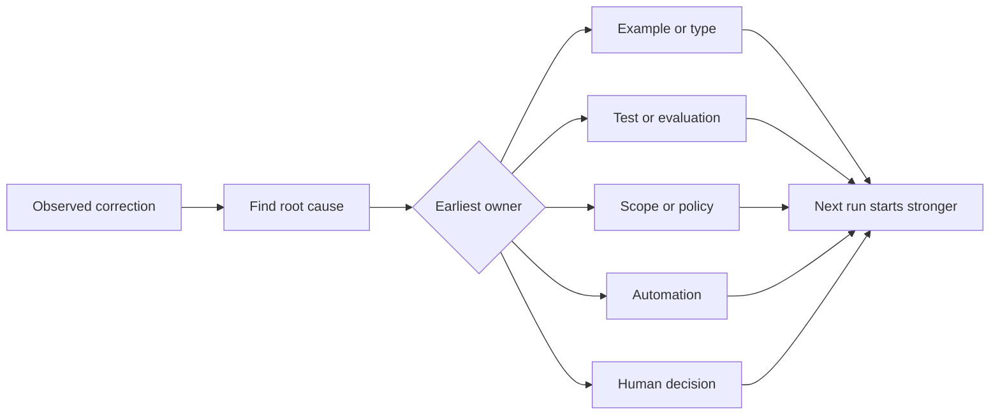

# تحويل كل تصحيح عامل إلى تحسين النظام

> تصحيح يمر فقط في الدردشة يصلح مرة واحدة. تصحيح يروج إلى اختبار، حدود، مثال، أو أداة يحسن في كل مرة أخرى.

**Type:** Learn + Build
**Languages:** Python (stdlib)
**Prerequisites:** Phase 14 lessons 37 to 41
**Time:** ~65 minutes

## أهداف التعلم

- تحويل تصحيحات الوكيل إلى التحكمات الدائمة.
- ضع كل جهاز تحكم في أول طبقة يمكن أن تمنع تكرار.
- إعادة تكرار الدروس مع بصمات أصابع مستقرة
- إقلاع التحكمات التي لم تعد تحمي المخاطر الحقيقية.

## التصحيحات هي دليل

عندما تخبر وكيل لا تعديل هذا الملف، تعلمت أن حدود النطاق لم تكن قابلة للتنفيذ. عندما تقول هذا الشكل الخارجي خاطئ، تعلمت أن هناك مثال أو اختبار مفقود. عندما تفشل الإعداد مرة أخرى، تعلمت أن معرفة البيئة تنتمي إلى التلقائية.

تعامل التعديل كلاحظة عن نظام العمل، وليس كخيبة كتابة على الفور.

## التقدم إلى أول طبقة فعالة

استخدم هذا الترتيب:

| Recurring failure | Durable destination |
|---|---|
| Wrong result or regression | Test or evaluation |
| Off-scope or unsafe action | Scope or permission policy |
| Repeated setup or command mistake | Automation or tool |
| Repeated output-format mistake | Canonical example plus validator |
| Ambiguous local convention | Instruction with a scenario check |
| Product disagreement | Human decision record |

التحكمات السابقة أرخص. النوع الذي يمنع حالة غير صالحة أقوى من تعليق مراجعة الذي يلتقطها لاحقا. الاختبار المركز أقوى من الفقرة التي تطلب من الوكيل أن يتذكر.



## سجل راتشيت

التقاط:

- الأعراض
- السبب الجذري
- النتائج
- عدد التكرار
- التحكم المختار
- التحقق من التحكم
- المالك
- تاريخ مراجعتها أو تقاعدها

لا تعزز كل تفضيل فريد، ولكن تعزز تصحيح عندما يبرر التكرار أو التأثير تعقيدًا دائمًا.

## سبب منفصل عن الأعراض

الوكيل الذي تم تحريره على README هو أعراض.

- المهام سمحت لجذر المخبأ
- كانت الوثائق تعتبر آمنة بشكل ضمني.
- تنفيذ خطة المجموعة والوثائق؛
- كان لدى عمالين ملكية متداخلة

كل سبب ينتمي إلى نظام مختلف، قاعدة تكرر العلامة فقط سوف تفشل في الحالة التالية مختلفة قليلا.

## السيطرة أيضاً تتدهور

يمكن أن تتعارض التحكمات القديمة، وتتفجير السياق، وتشفير نظام لم يعد موجودًا. كل قاعدة مدعومة تحتاج إلى مراجعة التقاعد. إزالتها أو إعادة كتابتها عندما:

- تغير الهندسة المعمارية الأساسية؛
- تم استبدالها بمراقبة أكثر قوة قابلة للتنفيذ.
- لم تتكرر الفشل عبر نافذة ذات مغزى؛
- التحكم يخلق مزيدا من الاحتكاكات أكثر من المخاطر التي يمنعها

الهدف ليس أطول ملف تعليمات بل هو أصغر نظام يحافظ على الحكم الذي حصل عليه بجد

## بناءها

المختبر يصنف التعديلات، ويعززها في التحكم، ويعيد نقل بصمات الأصابع، ويكتب `outputs/feedback-ratchet.json`. . .

أركض

```bash
python3 code/main.py
python3 -m unittest discover code/tests -v
```

أضف اثنين من التعديلات المختلفة التي لها نفس السبب. تحسين التطبيع حتى تتراجع إلى جهاز واحد دون انهيار فشل غير مرتبط.

## التمارين

1. خذ خمسة تصحيحات من جلسة تشفير حديثة وتصنيف أصحابها الحقيقيين.
2. استبدل قاعدة في النص مع اختبار يمكن تنفيذه.
3. إضافة وزن التأثيرات حتى يتم تعزيز حدوث أول حدوث حاد على الفور.
4. أضف صاحب وتاريخ التقاعد إلى نتائج المختبر
5. مراجعة تعليمات وكيل موجودة وحذفها فقط بعد إثبات وجود مراقبة أقوى.

## المزيد من القراءة

- [Basili, Caldiera, and Rombach, The Goal Question Metric Approach](https://www.cs.toronto.edu/~sme/CSC444F/handouts/GQM-paper.pdf)، لتحويل الأهداف إلى أسئلة وقياسات عمليات.
- [Shinn et al., Reflexion](https://arxiv.org/abs/2303.11366)، لاستخدام آثار المراجعة لتحسين القرارات اللاحقة دون تغيير أوزان النموذج.
- [Madaan et al., Self-Refine](https://arxiv.org/abs/2303.17651)، للردود التكراري والإصلاح داخل حلقة المهام.

## ما تحافظ عليه

إبق`outputs/feedback-ratchet.json`إنها نهاية دائمة لمسار الهندسة بمساعدة العملاء ومقدمة لتغييرات مقاعد العمل في المستقبل.
