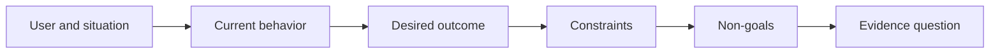

# حدد النتيجة قبل اختيار الخروج

> التنفيذ السريع يزيد من العقوبة للاختيار الخطأ. تشكيل النتيجة أولاً حتى تسريع نقاط في الاتجاه الصحيح.

**Type:** Learn + Build
**Languages:** Python (stdlib)
**Prerequisites:** None
**Time:** ~60 minutes

## أهداف التعلم

- اكتب إطار النتيجة دون تسمية الحل
- تحديد المستخدم، والوضع، والسلوك الحالي، والتغيير المرغوب فيه.
- أوضح القيود وغير الأهداف صراحة.
- اكتشاف تسرب الخلّة قبل أن تصبح صلبة في نطاقها.

## الناتج ليس نتيجة

بني مساعد حادثةتسمية المخرج. لا يذكر من يحتاج إليها، ما يصبح أفضل، أو ما يجب أن يبقى آمنا.

الإطار الناتج يقول:

> عندما يصل إشعار الإنتاج، يحدد المهندس المكلف عن الخدمة الفاشلة والإجراء الآمن التالي في غضون دقيقتين، بينما يبقى التشخيص قراءة فقط ومراجعة.

هذه الجملة يمكن أن تُرضى بواسطة البرمجيات أو كتاب التشغيل أو إصلاح البيانات أو تغييرات صغيرة في واجهة التفاعل.

## الإطار الذي يتكون من ستة أجزاء

| Part | Question |
|---|---|
| User | Who experiences the problem directly? |
| Situation | When and where does it occur? |
| Current behavior | What happens today, including workarounds? |
| Desired outcome | What observable state should improve? |
| Constraints | Which safety, policy, cost, or compatibility limits are fixed? |
| Non-goals | What tempting adjacent work is excluded? |



## العثور على حل تسرب

تصريحات النتائج تسرب الحلول عندما تحتوي على شكل منتج أو واجهة أو اختيار نموذج أو إطار أو بنية لم يتم الحصول عليها من خلال الأدلة.

- يستلم المستخدمون ملخصاً أسبوعياً للذكاء الاصطناعييتسرب ملخصاً وتسلسل.
- المستخدمون يفهمون تغييرات الحساب قبل أن يذكر الموافقة النتيجة.
- تطبيق قاعدة بيانات متجهات تسرب البنية التحتية.
- تتوفر أدلة سياسية ذات صلة خلال المراجعةتعلّق بإمكانها.

القيود يمكن أن تسمى التكنولوجيا عندما يتصل التوافق حقاً بها.

## القيود تحمي النتيجة

القيود ليست تفاصيل تنفيذها إنها جزء من هدف العالم الحقيقي:

- لا يوجد إنتاج يكتب أثناء التشخيص
- الاستجابة ضمن ميزانية الوقت المحدد للحدث
- تظل الأحداث المختصة في المراجعة ذات الصلة بالسلطة.
- لا يوجد إدمان جديد على الوقت الذي يتم فيه التشغيل.
- سلوك الوصول يبقى سليم

بناء يصل إلى النتيجة عن طريق خرق قيود لم يصل إلى النتيجة.

## لا أهداف تخلق حدود

غير الأهداف تمنع قطعة مفيدة من أن تتحول إلى منصة. الأهداف غير الجيدة هي ملموسة بما فيه الكفاية لرفض العمل:

- لا توجد إصلاحات تلقائية؛
- لا يوجد نظام جديد لتوجه الإنذار؛
- عدم استبدال قائد الحادث
- لا تحليل تاريخي في هذا الجزء

## بناءها

المختبر يصدق`OutcomeFrame`و يكتب`outputs/outcome-frame.json`. . .

```bash
python3 code/main.py
python3 -m unittest discover code/tests -v
```

استبدل النتيجة المرغوبة بـ استخدم مساعد الحادث. يجب على المؤكد أن يُعبر عن تسريب النتائج المقترحة إلى النتيجة.

## التمارين

1. إعادة كتابة طلب ميزة من سجل الخلفية الخاص بك كإطار النتيجة.
2. إضافة قيود واحد يغير الحلول التي لا تزال ممكنة.
3. أضف هدفين غير هدفين يبقون الجزء الأول صغيرًا
4. حدد أوائل ملاحظات ستفسر النتيجة المرغوبة.
5. اكتب ثلاثة نتائج مختلفة يمكن أن تلبي نفس النتيجة.

## المزيد من القراءة

- [Nuseibeh and Easterbrook, Requirements Engineering: A Roadmap](https://www.cs.toronto.edu/~sme/papers/2000/ICSE2000.pdf)، لتعامل أهداف العالم الحقيقي كمركز للعمل البرمجي
- [Dardenne, van Lamsweerde, and Fickas, Goal-Directed Requirements Acquisition](https://doi.org/10.1016/0167-6423(93)90021-G) ، لتحسين الأهداف على مستوى عال إلى قيود ومتطلبات تشغيلية.

## ما تحافظ عليه

إبق`outputs/outcome-frame.json`الدروس التالية تختبر ذلك ضد تدفق العمل الناس الفعلي.
