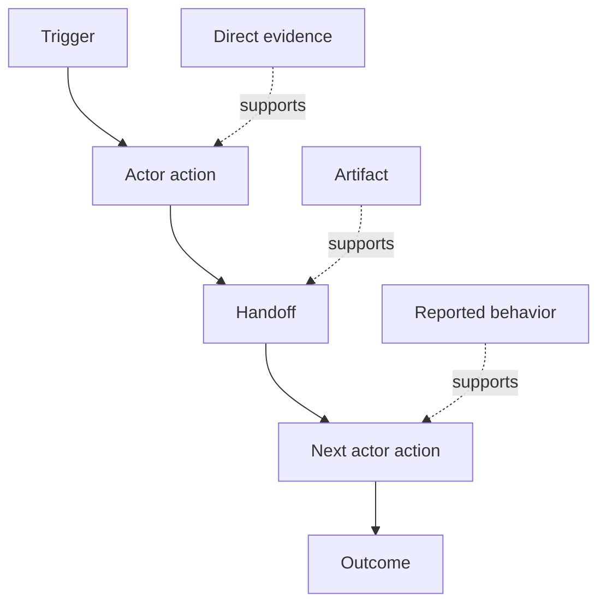

# اكتشف تدفق العمل الذي يقوم به الناس في الواقع

> لا تنتظر الاحتياجات في الاجتماع ليتم جمعها.

**Type:** Learn + Build
**Languages:** Python (stdlib)
**Prerequisites:** Phase 14 lesson 47
**Time:** ~70 minutes

## أهداف التعلم

- قم بتصميم سير العمل الحالي على أنه إجراءات مرتبطة مع الأدلة.
- فصل الملاحظة المباشرة عن السلوك المبلغ عنه أو المستنتاج.
- تحديد العراك، التسليمات، السلطة، والحالة الخفية.
- ضع القوائم غير المؤكدة مرئية بدلاً من تحويلها إلى متطلبات.

## ابدأ بالنظام الحالي

لا تبدأ بسؤال ما هي الميزات التي يريدها الناس، ابدأ بإعادة بناء ما يحدث الآن.

لكل خطوة، سجل:

| Field | Example |
|---|---|
| Actor | On-call engineer |
| Trigger | Production alert arrives |
| Action | Opens alert, then searches dashboards |
| Input | Alert payload and deployment record |
| Output | Candidate service and owner |
| Friction | Context switching across three tools |
| Authority | Incident commander approves a write |
| Evidence | Screen recording, incident log, runbook |

تدفق العمل أكبر من الشاشة. يتضمن الانتظار، نسخة ورقق، قنوات جانبية، الموافقة، إعادة إصلاح الخطأ، والخطوات التي توقف الناس عن ملاحظة.

## الأدلة قوية

استخدم سلم الأدلة البسيط:

1. **Direct behavior:**الملاحظة، تتبع، تسجيل، أو حدث النظام.
2. **Artifact:**التذكرة، دفتر الدفع، السجل، النموذج، أو الناتج المكتمل.
3. **Reported behavior:**الشخص يصف ما يفعلونه
4. **Inference:**الفريق يختتم بما قد يحدث

كلّهما قد يكون مفيدًا، فقط أول اثنان يثبتان السلوك الحالي مباشرة، ووضع علامة على البقية حتى لا يتضخم الثقة بصمت.



## ابحث عن أربعة أشياء

- **Friction:**الجهد المتكرر، التأخير، إعادة الدخول، أو التعافي.
- **Hidden state:**الحقائق التي تحمل في الذاكرة، أو المحادثة، أو الملاحظات الشخصية.
- **Authority:**الشخص أو النظام الذي تمكن من إجراء تغييرات متتالية.
- **Exceptions:**حالة توقف سير العمل الطبيعي عن أن يكون طبيعياً.

غالبا ما تفشل ميزات الذكاء الاصطناعي في التسليمات والاستثناءات لأن الطريق السعيد هو الطريق الوحيد الذي تم تشكيله.

## لا تُبْلِّغوا الخلافات

يمكن للمستخدمين تنفيذ عمليات عمل مختلفة لأسباب جيدة. احتفظ بالفوارق حتى تفهم ما إذا كانت تمثل:

- أدوار مختلفة
- مستويات المخاطر المختلفة
- الإرث والعملية الحالية
- اختلافات الخبرة
- خلاف سياسي حقيقي

متوسط تدفق العمل لا يمكن وصف أي شخص.

## بناءها

المختبر يحتفظ بالأدلة في كل خطوة من سير العمل، ويمتدّل التنظيم والثقة، ويحسب نسبة الأدلة المباشرة، ويكتب `outputs/workflow-evidence.json`. . .

```bash
python3 code/main.py
python3 -m unittest discover code/tests -v
```

إضافة مسار استثناء حيث لا يوجد سجل التنفيذ. الحفاظ على النظام الرئيسي سليم وتسجيل حيث تبدأ الفرع.

## التمارين

1. إعادة إنشاء سير عمل واحد من سجل دون مقابلة أي شخص
2. إجراء مقابلة مع المستخدم وتسجيل كل ادعاء لا يزال يفتقر إلى أدلة مباشرة.
3. أضف حدة سلطة واحدة و خطوة واحدة للتعافي من الفشل
4. نموذج اثنين من خيارات سير العمل دون دمجها.
5. حدد ميزة المقترحة التي تزيل خطوة مرئية ولكن تترك العمل الخفي دون تناول.

## المزيد من القراءة

- [Nuseibeh and Easterbrook, Requirements Engineering: A Roadmap](https://www.cs.toronto.edu/~sme/papers/2000/ICSE2000.pdf)، خاصةً معالجة التحفيز كترجمة وتصميم ونموذج وتصديق بدلاً من مجرد الاستيلاء عليه.
- [Gotel and Finkelstein, An Analysis of the Requirements Traceability Problem](https://doi.org/10.1109/ICRE.1994.292398)، بسبب صعوبة الحفاظ على العلاقة بين المتطلبات ومصادرها.

## ما تحافظ عليه

إبق`outputs/workflow-evidence.json`يُحوّل التضارب والشك الملاحظ إلى خريطة افتراضية في الدروس التالية.
