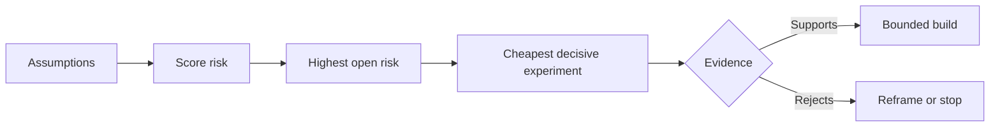

# خريطة المفترضات وحل الخطر الأول

> خريطة طريق تخفي عدم اليقين داخل الميزات خريطة افتراضات تكشف ما يجب أن يكون صحيحا قبل أن تستحق تلك الميزات وجودها.

**Type:** Learn + Build
**Languages:** Python (stdlib)
**Prerequisites:** Phase 14 lesson 48
**Time:** ~65 minutes

## أهداف التعلم

- تحويل العمل المقترح إلى افتراضات صريحة.
- تأثير النتيجة، وعدم اليقين، وعدم العودة بشكل منفصل.
- اختر التجربة التالية من خلال المخاطر، وليس الحماس.
- استبدل الافتراضات التي تم اختبارها بالدليل والقرارات.

## كل مبنى يحتوي على رهانات

أداة الحوادث قد تعتمد على أن كل هذه هي صحيحة:

- يحتوي سياق الإنذار على معلومات كافية لتحديد خدمة؛
- المهندسون يثقون في توصية لم يستخرجوها بأنفسهم
- وقت الاستجابة المرغوب فيه مهم من الناحية العملية.
- يمكن الوصول إلى البيانات المطلوبة دون وجود سلطة غير آمنة.
- وتحدث سير العمل في كثير من الأحيان بما يكفي لتبرير الصيانة.

هذه ليست مهام تنفيذ، بل هي الشروط ليكون البناء قيمًا ويمكن استخدامه ويمكن عمله وآمنًا.

## فئات الافتراضات

| Class | Question |
|---|---|
| Value | Will the outcome matter enough? |
| Usability | Can the user understand and act on it? |
| Feasibility | Can the system produce it with available data and constraints? |
| Viability | Can the organization sustain cost, ownership, and operation? |
| Safety | Can it fail without unacceptable consequence? |

اكتب الافتراضات كبيانات قابلة للتصديق. الخصة مفيدة لا يمكن اختبارها. ثمانية من كل 10 مهندسين على المكالمة يحددون الخدمة الصحيحة بشكل أسرع باستخدام النتيجة القراءة فقط يمكن.

## المخاطر ليست رقم واحد

المختبر يستخدم ثلاثة أبعاد من واحد إلى خمسة:

- **Impact:**الضرر إذا كان الافتراض خاطئ.
- **Uncertainty:**ضعف الأدلة الحالية
- **Irreversibility:**تكلفة التعلم بعد الالتزام.

النتيجة المثالية تضاعف التأثير وعدم اليقين، ثم تضيف عدم العودة. الصيغة ليست عالمية. غرضها هو إجبار الفريق على تحديد لماذا يجب حل مجهول واحد قبل الآخر.



## تصميم تجربة، وليس طقوس تأكيد

الاختبار المفيد له:

- ادعاء يمكن أن يكون خاطئاً
- مجموعة من السكان أو عينات واقعية
- نتيجة قابل للملاحظة
- حد حد حدد قبل النتيجة
- القرار التالي للجازة والفشل والدليل الغامض

تجنب الاختبارات التي تظهر فقط أن الفريق يمكن أن تبني الفكرة.

## التحول يغير النظام

الخيارات ذات التنافسية العالية والغير قابلة للعودة تحتاج إلى أدلة سابقة. يمكن أن يسبق إعادة تشغيل القراءة فقط إدماج الإنتاج. يمكن أن يسبق جهاز تعديل مؤقت هجرة البيانات. يمكن أن يسبق توصية مصرح بها الإنسان إجراءً تلقائيًا.

يجب أن يتبع شكل البناء شكل عدم اليقين.

## بناءها

المختبر يصنف الافتراضات، ويفرق بين الادعاءات المختبرة والفتوحة، ويختار أعلى مخاطر مفتوحة، ويكتب `outputs/assumption-map.json`. . .

```bash
python3 code/main.py
python3 -m unittest discover code/tests -v
```

تغيير الأدلة على افتراض المخاطر العالية وملاحظة كيف تتغير التجربة التالية.

## التمارين

1. اكتب خمسة افتراضات لشخصية تريد بناؤها
2. أضف افتراض سلامة واحد لم يتم حذف قائمة الميزات الخاصة بك.
3. حدد عتبة ستجعلك تتوقف عن البناء
4. استبدل تجربة كبيرة باختبار أكثر رخيصا حاسما.
5. مقارنة تصنيف المخاطر مع أولوية خريطة الطريق وشرح عدم التطابق.

## المزيد من القراءة

- [Barry Boehm, A Spiral Model of Software Development and Enhancement](https://dl.acm.org/doi/10.1145/12944.12948)، لدورة تطوير مدفوعة بالمخاطر التي تحل عدم اليقين قبل التزام أعمق.
- [Dardenne, van Lamsweerde, and Fickas, Goal-Directed Requirements Acquisition](https://doi.org/10.1016/0167-6423(93)90021-G) ، لتحسين الأهداف مع إلقاء العقبات والقيود على السطح.

## ما تحافظ عليه

إبق`outputs/assumption-map.json`الدرس التالي يستخدمها للاختيار أصغر قطعة يمكن أن تنتج أدلة حاسمة.
