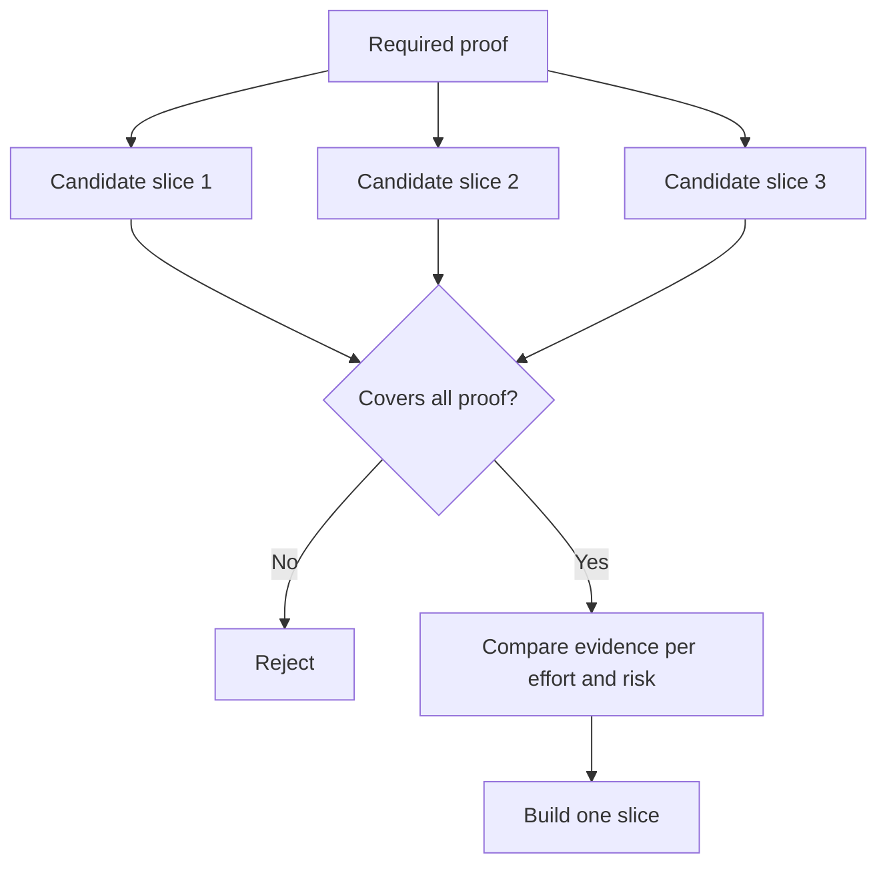

# اختر أصغر قطعة يمكن أن تغير القرار

> الصغر مفيد فقط عندما يثبت شيئاً مهماً. إنّه صغيراً لا يمكن أن يغير القرار التالي غير مكتمل.

**Type:** Learn + Build
**Languages:** Python (stdlib)
**Prerequisites:** Phase 14 lesson 49
**Time:** ~65 minutes

## أهداف التعلم

- تعريف قطعة من الافتراضات التي تثبت.
- توازن قيمة النتيجة، وتقليل عدم اليقين، والجهد، والنتيجة.
- تفضل الأدلة العكسية على التزام الإنتاج المبكر
- رفض الشرائح التي تفرغ الجزء المخاطر من سير العمل.

## الأدلة عمودية من النهاية إلى النهاية

يختلف قطعة مفيدة من الحد الأدنى من التدفق الحقيقي اللازم لملاحظة النتيجة. يمكن أن تكون ضيقة في المستخدمين والبيانات والمدة والقدرة. يجب ألا تكون ضيقة عن طريق إزالة عدم اليقين الدقيق الذي تحتاج إلى الاختبار.

أمثلة:

- إعادة تشغيل القراءة فقط عبر عشرة حوادث حقيقية تختبر تحديد خدمة و ثقة المشغل.
- لوحة التحكم الملموسة على البيانات الاصطناعية قد تختبر فهمها ولكن لا يمكن تحقيق جدوى البيانات.
- جهاز تصنيع التحكم الذاتي يختبر كل شيء في وقت واحد مع عواقب غير مقبولة.

## حدد أولاً الأدلة المطلوبة

خذ الافتراضات المفتوحة ذات المخاطر العالية وتحويلها إلى مجموعة دليل مطلوبة.

ثم مقارنة الشرائح الملائمة على:

| Dimension | Direction |
|---|---|
| Outcome value | More is better |
| Uncertainty reduced | More is better |
| Effort | Less is better |
| Consequence | Less is better |
| Reversibility | More is better |

نتيجة المختبر بسيطة عمداً، بوابة الإهتمام مهمة أكثر من الرياضيات.



## الحد الأدنى الكاذب الشائع

- **The UI-only minimum:**يزيل البيانات وعدم اليقين التشغيلي.
- **The infrastructure-only minimum:**يثبت إمكانية تقنية دون قيمة للمستخدم.
- **The happy-path minimum:**يفرغ الاستثناء الذي يخلق أكبر مخاطر.
- **The demo minimum:**يُنتجُ عبارةً عن عبارةٍ مقنعةٍ لكن لا يوجد قياسٍ قابلٍ للتكرار.
- **The platform minimum:**يُبني آلة قابلة لإعادة الاستخدام قبل أن يكسبها أحد عمليات العمل.

## إضافة قاعدة توقف

قبل تنفيذها، اكتب ما يحدث إذا فشل الشريحة:

- التخلي عن النتيجة
- تغيير المستخدم المستهدف أو الوضع؛
- اختبار آلية مختلفة
- جمع أدلة أفضل؛
- تقييد السلطة أكثر

إذا كانت كل النتيجة تؤدي إلى بناء، فإن القسم ليس تجربة.

## بناءها

المختبر يصف المرشحين بالدليل المطلوب، ويحدد الشرائح المؤهلة، ويكتب `outputs/slice-decision.json`. . .

```bash
python3 code/main.py
python3 -m unittest discover code/tests -v
```

إضافة مرشح أرخص يثبت افتراض واحد فقط، يجب أن يبقى غير مؤهل حتى لو كانت درجة الرقمية مرتفعة.

## التمارين

1. صمم ثلاث شرائح لنفس النتيجة على مستويات مختلفة من النتائج.
2. أوضح الدليل المطلوب قبل تسجيل الرقم
3. إزالة قدرة واحدة مع الحفاظ على الأدلة الحاسمة.
4. إضافة قاعدة توقف للطيار الفاشل.
5. تحديد مكون المنصة القابلة لإعادة الاستخدام الذي يجب أن ينتظر حتى بعد القسم.

## المزيد من القراءة

- [Barry Boehm, A Spiral Model of Software Development and Enhancement](https://dl.acm.org/doi/10.1145/12944.12948)، لتطابق كل دورة تطوير مع المخاطر التي يجب أن تحل.
- [Lenarduzzi and Taibi, MVP Explained: A Systematic Mapping Study on the Definitions of Minimal Viable Product](https://arxiv.org/abs/1609.07592)، لغموض حول أقل ويمكن الاستفادة من في ممارسة منتجات البرمجيات.

## ما تحافظ عليه

إبق`outputs/slice-decision.json`إنه يسجل لماذا هذه الجزءة هي أصغر جزء يمكن أن يغير القرار
