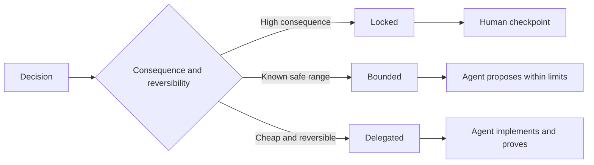

# اكتب تفاصيل تحافظ على الحكم

> تصلح المواصفات المفيدة الثنائيات والأدلة مع ترك خيارات التنفيذ المراجعة مفتوحة. إنها حدود القرار ، وليس سيناريو.

**Type:** Learn + Build
**Languages:** Python (stdlib)
**Prerequisites:** Phase 14 lesson 50
**Time:** ~75 minutes

## أهداف التعلم

- النتيجة المفصلة، والغيرات المتغيرة، والمثلة، غير الأهداف، والدليل.
- علامة القرارات كحصيلة أو محدودة أو تم تفويضها.
- الحفاظ على حكم العميل حيث الخيارات رخيصة و قابل للتعديل.
- تطلب نقاط تفتيش بشرية حيث تغيرت النتائج أو السلوك العام

## اثنين من الأخطاء الشديدة

مهمة أقل تحديداً تطلب من وكيل تخمين النظام. مهمة أكثر تحديداً تطلب منه نقل تصميم قد يكون خاطئاً بالفعل.

الوسيط المفيد هو عقد يمكن تنفيذه:

| Surface | Purpose |
|---|---|
| Outcome | The observable result |
| Invariants | Conditions that must always remain true |
| Examples | Concrete cases that reveal intent |
| Non-goals | Adjacent behavior intentionally excluded |
| Decision policy | Which choices are locked, bounded, or delegated |
| Proof | Evidence required before completion |

## ثلاثة طرق اتخاذ القرارات

- **Locked:**لا يجب على الوكيل أن يختار. الاستخدام لموافقة العامة، السلطة، السلامة، التكلفة غير المعادلة، أو التزام المنتج.
- **Bounded:**يمكن للعميل اختيار داخل حدود صريحة. استخدام ل ميزانيات البحث، أعداد محاولة إعادة، والاعتمادات المسموح بها، أو عائلة واجهة معروفة.
- **Delegated:**الوكيل يمتلك الخيار ويجب أن يشرحه. الاستخدام للهيكل المحلي، والأسماء، والعكسية العوامل، وتفاصيل التنفيذ.



## أوضح السلوك من خلال الأمثلة

المثال يضغط النية بشكل أفضل من الصفات.  مفيد،  قوي، و جاهز للإنتاج غير قابل للتنفيذ. مجموعة صغيرة من الأمثلة الطبيعية والحافة والفشل والحظر يعطي كل من البناء والتحقق شيئاً ملموساً.

الأمثلة لا تحل محل الخيارات الثابتة. حالة واحدة لا يمكن أن تثبت قاعدة سلامة عالمية.

## يجب أن يتوافق الدليل مع الادعاء

- اختبار الوحدة يثبت عقد وظيفة محلية
- اختبار الأسلاك يثبت التسلسل وسلوك النقل
- رحلة المتصفح تثبت مسار الواجهة
- مجموعة إعادة التمثيل تثبت السلوك على الحالات الممثلة.
- سجل مراجعة يثبت أن حدود السلطة تمت.

لا تقبل الطبقة السفلى كدليل على ادعاء عن الطبقة العليا.

## الحفاظ على المجهولات عن قصد

يمكن أن تقول المواصفات يمكن لتنفيذها اختيار أي مصدر يمكن قراءته فقط يعود في الميزانية الزمنية. هذا ليس غامضاً. إنه قرار تم تفويض عمداً مع حدود ودليل.

يجب أن تتطور المواصفات عندما تتغير الأدلة. الحفاظ على السبب وراء الخيارات المقفلة والحدودة حتى يتمكن فرق لاحقة من مراجعتها دون علم الآثار.

## بناءها

المختبر يصدق كل سطح عقد، يُفحص أنواع القرار، ويكتب`outputs/executable-specification.json`. . .

```bash
python3 code/main.py
python3 -m unittest discover code/tests -v
```

نقل قرار كتابة الإنتاج من مقفل إلى تمنح. شرح لماذا النظام يقبل القيمة ولكن مخاطر المنتج لا.

## التمارين

1. حول تذكرة التخلف إلى السطحات الست المحددة.
2. استبدل ثلاث تعليمات تنفيذية بمثابة متغير واحد ومثلتين.
3. قم بتدوين كل قرار وتبرير كل خيار مقفل أو محدود
4. إضافة إيصال دليل لكل غير متغير
5. إزالة قيود لا توجد أدلة أو سبب للمخاطر.

## المزيد من القراءة

- [Nuseibeh and Easterbrook, Requirements Engineering: A Roadmap](https://www.cs.toronto.edu/~sme/papers/2000/ICSE2000.pdf)، للعلاقة بين الأهداف، والتفاصيل الدقيقة، والتحقق من المصادقة، والاتفاق، والتطور.
- [Zave and Jackson, Four Dark Corners of Requirements Engineering](https://doi.org/10.1145/267895.267896)، لفرق الافتراضات والمتطلبات والتفاصيل البيئية.
- [Gotel and Finkelstein, An Analysis of the Requirements Traceability Problem](https://doi.org/10.1109/ICRE.1994.292398)، للحفاظ على سبب وجود متطلب ومن أين جاء

## ما تحافظ عليه

إبق`outputs/executable-specification.json`يصبح العقد الذي يتشارك فيه وكلاء التشفير والمراجعون البشريين
