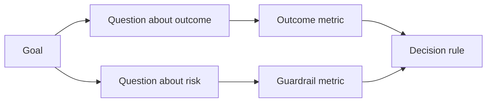

# تصميم مقاييس النجاح قبل وجود النتيجة

> يجب أن يُجيب القرار عن القياس وليس عن تزيين لوحة التحكم. ابدأ بالهدف، استنتاج الأسئلة، ثم اختر أصغر المقاييس التي تجيب عليها.

**Type:** Learn + Build
**Languages:** Python (stdlib)
**Prerequisites:** Phase 14 lessons 47 and 51
**Time:** ~70 minutes

## أهداف التعلم

- استنتاج الأسئلة والمقاييس من هدف النتيجة.
- تحديد العدوان، النوافذ، المصادر، والاتجاهات قبل مراقبة النتائج.
- إزواج مقاييس النتيجة مع الحواجز والمقاييس المضادة.
- تتناسب الدليل التقييم مع القرار الذي يجب أن يدعمه البناء.

## الهدف، السؤال، المقياس

ابدأ بأهداف:

> تقليل الوقت لتحديد الخدمة المتضررة دون زيادة الإجراءات غير الآمنة.

أسئلة مشتقة:

- ما هو سرعة تحديد الخدمة الصحيحة؟
- كم مرة تكون الخدمة المحددة صحيحة؟
- هل التشخيص يبقى قراءة فقط؟
- هل تدفق العمل يزيد من إبعاد التحذير أو عبء العمل للمشغل؟

ثم اختر المقاييس التي تعمل على هذه الأسئلة.



## الميترات تحتاج إلى عقد

كل متريك يحتاج:

| Field | Example |
|---|---|
| Name | `median_identification_seconds` |
| Direction | at most |
| Threshold | 120 |
| Window | ten incident replays |
| Source | replay event log |
| Population | on-call engineers in the pilot |
| Kind | outcome or guardrail |

بدون المصدر والنوافذ، لا يمكن إعادة إنتاج رقم.

## النتيجة، الحراسة، والعكس الميتر

- **Outcome metric:**هل تحسنت الحالة المطلوبة؟
- **Guardrail:**هل كان هناك قيود ثابتة ما زال صحيحاً؟
- **Counter-metric:**هل تكلفة التحسين المحلي أو ضرر في مكان آخر؟

لمجرد وقوع حادث، السرعة ليست كافية. الدقة، وتسجيلات الإنتاج، وحمل العمل المدير، والإشعارات المفقودة تحمي من نتيجة سريعة ولكن غير آمنة.

## الأدلة غير المتاحة والإلكترونية

التشغيل غير التواصل المباشر مفيد للتكرار والتغطية الحافة. الطيار المحدود مفيد للتأثيرات الحقيقية على السلوك والثقة وتدفق العمل. لا يوجد بديل عن الآخر.

استخدم الأدلة الأرخص التي يمكن أن تجيب على القرار الحالي. لا تعرض المستخدمين الحقيقيين فقط لأن التنفيذ جاهز.

## قرر قبل أن تقيس

اكتب المخططات والفشل والمسارات الغامضة قبل رؤية النتائج وإلا سيتحرك الفريق العتبة لحماية البناء

مثال:

- الممر: معدل الخدمة الصحيحة لا يقل عن 0.9 و متوسط الوقت لا يقل عن 120 ثانية.
- فشل: أي سجل إصدار أو تصحيح أقل من 0.75
- غامض: تحسين صغير مع اختلاف واسع، يتطلب مجموعة إعادة تشغيل أكبر.

## بناءها

يقوم المختبر بتصديق خطة قياس وتقييم العدوان الشاملة، وتسجيل القيم المفقودة، ويكتب `outputs/measurement-report.json`. . .

```bash
python3 code/main.py
python3 -m unittest discover code/tests -v
```

إزالة مقياس الحراسة وملاحظة لماذا تصبح الخطة غير صالحة حتى عندما تبقى مقياس النتيجة.

## التمارين

1. استنتاج ثلاث أسئلة من هدف واحد
2. أضف مقياسًا مضادًا يلتقط التكلفة المتحولة إلى دور آخر.
3. حدد المصدر والسكان والنوافذ لكل متري
4. اكتب القرارات المُجازية والفاشلة والمتضاربة قبل أن تولد القيم.
5. حدد مقياس واحد سهل التجميع لكنه لا يستطيع تغيير القرار.

## المزيد من القراءة

- [Basili, Software Modeling and Measurement: The Goal/Question/Metric Paradigm](https://drum.lib.umd.edu/items/8119803a-362b-42ec-b6ce-2311713e7236)، لتحقيق قياسات عمليات من أهداف صريحة.
- [Basili, Caldiera, and Rombach, The Goal Question Metric Approach](https://www.cs.toronto.edu/~sme/CSC444F/handouts/GQM-paper.pdf)، لتطبيق الطريقة كنظام للمراجعة والتحسين.

## ما تحافظ عليه

إبق`outputs/measurement-report.json`. يحدد بوابة الأدلة للمشهد الأول أو الطيار أو مرحلة الإنتاج.
