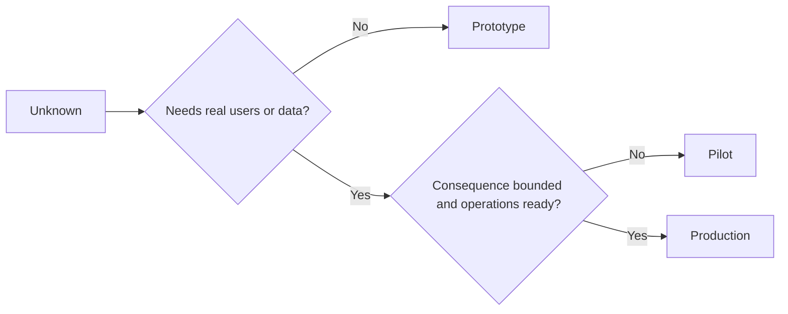

# اختر النموذج الأول أو الطيار أو الإنتاج عمداً

> هذه بيئات تعليمية مختلفة، وليس مستويات من اللون. اختر المرحلة التي تجيب على الحالي غير معروف مع أقل عواقب غير ضرورية.

**Type:** Learn + Build
**Languages:** Python (stdlib)
**Prerequisites:** Phase 14 lessons 50 to 52
**Time:** ~70 minutes

## أهداف التعلم

- اختر مرحلة بناء من غير المعروف، الجمهور، البيانات، النتائج، والإستعداد.
- تحديد الضوابط الخاصة بالمراحل ومعايير الخروج.
- منع النماذج الأولية من أن تصبح ببساطة أنظمة إنتاجية.
- تأخير السلطة الحقيقية حتى تبررها الأدلة والعمليات

## ثلاثة أسئلة مختلفة

| Stage | Primary question |
|---|---|
| Prototype | Can this mechanism produce the evidence at all? |
| Pilot | Does it work safely with a bounded real audience and real conditions? |
| Production | Can we own it continuously at the promised reliability and risk level? |

يمكن أن يكون النموذج الأول كاملًا تقنياً ومازال قابلاً للتخلص منه. يمكن للطيار استخدام بيانات الإنتاج مع البقاء محدودًا في الجمهور والسلطة. يبدأ الإنتاج عندما تتقبل المنظمة المسؤولية المستمرة.

## النموذج الأول

استخدم النموذج الأول عندما لا يتطلب المجهول مستخدمين حقيقيين أو بيانات حقيقية. احتفظ به:

- القابلة للتحليل
- المعزولة
- ضيق في السلوك
- صراحة حول سؤال التعلم
- خالية من ضمانات تشغيل مزيفة.

لا تحسين الهندسة المعمارية قبل أن يحصل الآلية على مرحلة أخرى.

## الطيار

استخدم طيار عندما يتطلب ما لا يعرف سلوكًا حقيقيًا أو بيانات واقعية أو تدفق عمل حقيقي ، ولكن النتائج أو الاستعداد لا يتوافق مع الإفراج الواسع بعد.

الطيار يحتاج:

- جمهور مسموح به؛
- مالك بشري
- المدة المحدودة والسلطة؛
- التحقيق والعودة إلى الوراء
- حدود الخروج والحافظة على الحواجز
- معايير الخروج للتوسع أو التعديل أو التوقف.

## الإنتاج

إنتاج يحتاج إلى أكثر من نشر:

- هدف مستوى الخدمة
- الملكية عند المكالمة والحوادث
- مراجعة الأمن والخصوصية
- مراقبة التكاليف والقدرة؛
- إعادة التأثير والإسترداد
- المراقبة المستمرة
- طريق التقاعد



## التجول في المرحلة

يصبح النموذج الأول خطير عندما يحصل على المستخدمين أو البيانات أو السلطة دون الحصول على الملكية. حدد النموذج الأول والحدود التجريبية في التكوين والتحكم في الوصول والمتسع والوثائق. لا يكفي إشارة تحذير.

يجب أن تكون المرحلة قابلة للملاحظة من النظام نفسه.

## بناءها

يختار المختبر مرحلة من سياق القرار، ويرد التحكمات المطلوبة، ويكتب `outputs/stage-decisions.json`. . .

```bash
python3 code/main.py
python3 -m unittest discover code/tests -v
```

قم بتغيير مثال التجربة إلى نتيجة منخفضة مع استعداد للعمل. شرح ما هي الأدلة الإضافية التي ستبرر الإنتاج.

## التمارين

1. تصنيف ثلاثة مشاريع حالية حسب مرحلة التعلم، وليس حالة الانتشار.
2. اكتب معايير خروج الطيار التي تشمل قرار وقف.
3. إضافة جهاز تحكم فني يمنع النموذج الأول من الوصول إلى بيانات الإنتاج.
4. تحديد أول مسؤولية تشغيلية تجعل الإنتاج البناء.
5. صمم إيصال إعادة التأمين للطيار المحدد

## المزيد من القراءة

- [Barry Boehm, A Spiral Model of Software Development and Enhancement](https://dl.acm.org/doi/10.1145/12944.12948)، لتطابق كل إعادة التكرارالتزام للمخاطر المحددة.
- [Fagerholm et al., Building Blocks for Continuous Experimentation](https://doi.org/10.1145/2601248.2601276)، للظروف التنظيمية والتقنية المطلوبة لإجراء التجارب بشكل مستمر.

## ما تحافظ عليه

إبق`outputs/stage-decisions.json`يُسجل لماذا كل مرحلة مُبررة وما هي التحكمات التي يجب أن تكون موجودة قبل المرحلة التالية.
