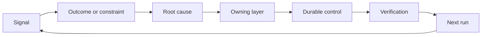

# بناء ريشيت ردود الفعل مع الملكية والتقاعد

> إرسال البضائع يغلق حلقة بناء واحدة وفتح حلقة التعلم يجب أن تغير الأدلة النظام أو يصبح التليميترية التي لا يملكها أحد

**Type:** Learn + Build
**Languages:** Python (stdlib)
**Prerequisites:** Phase 14 lessons 46 and 53
**Time:** ~75 minutes

## أهداف التعلم

- حول الحوادث والتقييمات وسلوك المستخدمين والتصحيحات إلى أعمال خاصة
- توجيه كل إشارة إلى السياق، التقييم، السياسة، وقت التشغيل، أو التخلف.
- إعطاء الأولوية للرد على أساس شدة وتكرارها.
- أعط كل مراقب شرط تقاعد

## الملاحظات هي البنية التحتية

يمكن لفريق جمع آثار، وتقييمات، وتذاكر الدعم، ومسجلات الحوادث دون تعلم أي منها. الآلية المفقودة هي الترويج: مسار محدد من الملاحظة إلى تغيير دائم مع صاحب والدليل.

الحلقة هي:

1. مراقبة إشارة ملموسة؛
2. ربطها بالنتيجة أو القيود أو الافتراضات
3. تحديد أول طبقة النظام التي تمتلك السبب؛
4. تخلق تغيير محدود
5. التحقق من أن التكرار يصبح أقل احتمالاً
6. النظر في ما إذا كان يجب أن تبقى الرقابة.

## الطريق إلى الطبقة المالكة

| Signal | Destination |
|---|---|
| False positive, regression, wrong result | Evaluation or test |
| Missing context, duplicate work, stale fact | Context source or retrieval route |
| Unsafe action or authority gap | Policy or permission boundary |
| Timeout, retry storm, unavailable dependency | Runtime control |
| New product need or unresolved tradeoff | Shaped backlog item |

إصلاح السبب في أقرب طبقة فعالة. لا تضيف فقرة أخرى على الفور عندما يمكن اختبار أو إذن أن يجعل الفشل مستحيلا.



## الملكية جزء من السيطرة

كل عمل يحتاج:

- صاحب واحد
- الأولوية القائمة على العواقب والتكرار
- الأثاث الذي سيتم تغييره؛
- التحقق الذي يثبت التغيير
- نافذة مراجعة أو انتهاء الصلاحية؛
- حالة التقاعد

تحسين غير مملك هو ملاحظة مع تصميم أفضل.

## إقلاع التحكمات المستمرة

أنظمة التعليقات تتراكم السياسة. يمكن أن تصبح هذه السياسة متناقضة ومكلفة.

- تغييرات في الهندسة المعمارية أو سير العمل
- تحلّ محلّ تعليمات مستوى أعلى بمعدل غير متغير من المستوى الأدنى؛
- لم تظهر الفشل المحمي عبر النافذة المختارة.
- الاختيار يمنع العمل الشرعي أكثر من منع الأذى

التقاعد يحتاج أيضاً إلى دليل لا تُحذفِ جهاز التحكم لأنه يشعرُ بالقدوم.

## ربط بناء وكيل التشفير

نفس الرشة تخدم كلا المسارات:

- تغير دليل المنتج إطار النتيجة أو الافتراضات أو القسم أو خطة القياس.
- تغيير تصحيحات وكيل التشفير في الاختبارات أو السياق أو نطاقها أو التلقائية أو التسليم.
- الحوادث يمكن أن تغير كل من حدود المنتج و مكتب العمل العميل.

هذا هو السبب في أن تشكيل البناء ليس مرحلة تنتهي قبل التشفير. إنه يستمر خلال كل تغيير مقبول.

## بناءها

المختبر يصنف الإشارات، ويخلق أفعال ريشيت المملوكة، ويضع أولوياتها، ويكتب`outputs/feedback-backlog.json`. . .

```bash
python3 code/main.py
python3 -m unittest discover code/tests -v
```

أضف إشارة وقت وقف التشغيل وتأكيد أنه يتجه إلى وقت التشغيل بدلاً من التخلف العام.

## التمارين

1. تحويل حادثة واحدة و شكوى مستخدم واحدة إلى إجراءات
2. أسمائ الطبقة الأولى التي يمكن أن تمنع كل تكرار.
3. إضافة أوامر التحقق أو ملاحظات إلى إصدار المختبر.
4. تحديد شرط التقاعد للقاعدة في السياسة
5. تعقب واحد قبول التصحيح مرة أخرى إلى إطار المهمة التالية.

## المزيد من القراءة

- [Basili, Caldiera, and Rombach, The Goal Question Metric Approach](https://www.cs.toronto.edu/~sme/CSC444F/handouts/GQM-paper.pdf)، للتعلم التنظيمي من خلال القياس المتحكم في الهدف.
- [Fagerholm et al., Building Blocks for Continuous Experimentation](https://doi.org/10.1145/2601248.2601276)، للدورة التقنية والتنظيمية التي تربط الأدلة بتطوير منتج مستمر.
- [Nuseibeh and Easterbrook, Requirements Engineering: A Roadmap](https://www.cs.toronto.edu/~sme/papers/2000/ICSE2000.pdf)، لمعالجة المتطلبات كما تتطور خلال دورة حياة النظام.

## ما تحافظ عليه

إبق`outputs/feedback-backlog.json`. هو المادة النهائية من طريق الحكم على المنتج وتسليمها ومدخل إلى الإطار التالي.
