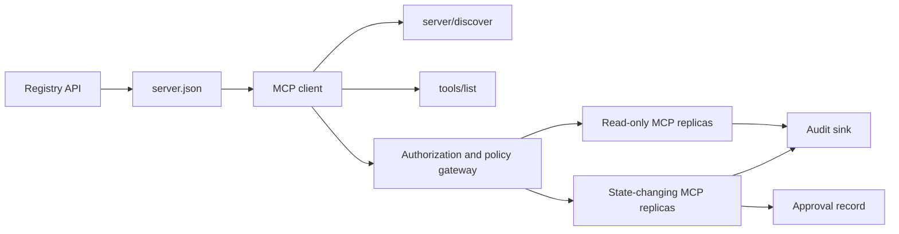

# الحجر الرئيسي 13: خادم MCP بدون جنسية مع سجل وحكم

> إنتاج MCP ليس عملية خادم واحدة. إنها سلسلة من العقود: البيانات المطبوعة، والاكتشاف الحي، وغلاف طلبات غير معتمدة، والإذن، والسياسة، والتحقق، ودليل النشر.

**Type:** Capstone
**Languages:** Python and TypeScript reference models; any production language
**Prerequisites:** Phase 11, Phase 13, Phase 14, Phase 17, and Phase 18
**Required MCP deep dives:** [Lesson 28: Tool Contracts](../../../13-tools-and-protocols/28-mcp-tool-contracts-and-content/docs/en.md)،[Lesson 29: Reliability](../../../13-tools-and-protocols/29-mcp-reliability-cancellation-and-flow-control/docs/en.md)،[Lesson 30: Registry Supply Chain](../../../13-tools-and-protocols/30-mcp-registry-supply-chain-and-drift/docs/en.md)و[Lesson 31: Conformance Operations](../../../13-tools-and-protocols/31-mcp-conformance-versioning-and-operations/docs/en.md)
**Protocol target:**المفوضية`2026-07-28`
**Time:** ~25 hours

## أهداف التعلم

- تنفيذ طلب المخططات المعدنية غير الحكومية وملف النتيجة.
- حافظ على البيانات المعدنية في السجل منفصلة عن اكتشاف البروتوكول الحي.
- بناء تحديد، الاكتشاف الأداة الوعية التخزين.
- إنفاذ سياسة المصدر والجمهور ومدى الموافقة لكل دعوة أداة.
- نشر HTTP المباشر دون علاقة جلسة.
- إثبات السلوك في الحدود السلكية والإذن والسياسة والسجل والتحقق

## مسار المشترك المطلوب من MCP

استكمال الدروس الأربعة المرتبطة في المرحلة 13 بالترتيب قبل معالجة هذه الحجر النهائي على أنه جاهز للإنتاج:

1. [Lesson 28](../../../13-tools-and-protocols/28-mcp-tool-contracts-and-content/docs/en.md)يحدد الأداة والخطط والمحتوى والصفحات والإكمال والتوجه والعقود الخطأ التي يجب أن يكتشفها هذا الخادم.
2. [Lesson 29](../../../13-tools-and-protocols/29-mcp-reliability-cancellation-and-flow-control/docs/en.md)يحدد سباقات الإلغاء، والمدود النهائية، والإعاقة، والضغط، والحاولات الإعادة، والسلوكية لإعادة الاتصال.
3. [Lesson 30](../../../13-tools-and-protocols/30-mcp-registry-supply-chain-and-drift/docs/en.md)يحدد مساحة الأسماء، والمصدر، ورق القبول، وضع السجل، التجرف، دفتر الأبحاث، والدليل على التراجع.
4. [Lesson 31](../../../13-tools-and-protocols/31-mcp-conformance-versioning-and-operations/docs/en.md)يحدد النسخ الذهبية والسلبية، وعصور الإصدار الصارم، وتحققات التفاضل في SDK، والدليل على النظام الأساسي، والتحرير، والصحة، والإصدار.

الحجر النهائي يدمج هذه الآثار. لا يحل محلها باختبار واحد من طرق سعيدة SDK.

## المشكلة

تحتاج المنصة الداخلية إلى أدوات بيانات تقرأ فقط ومجموعة صغيرة من الأدوات التي تتغير الحالة. يجب أن يكون المطورون قادرين على اكتشاف الخادم وفهم كيفية الاتصال وتفتيش قدراته الحية ودعوة العمليات التي يُسمح لهم باستخدامها فقط.

الجزء الصعب هو عدم تسجيل وظيفة الجزء الصعب هو الحفاظ على ست حقائق مختلفة على خط:

1. `server.json`يُذكر أين يمكن تثبيت الخادم أو الوصول إليه.
2. `server/discover`يقول ما يدعم العملية الحية الآن.
3. كل طلب يذكر أي إصلاح بروتوكول وقدرات العميل تستخدم.
4. التأليف يربط المتصل بالمصدر الصحيح والموارد والمقالات.
5. السياسة تقرر ما إذا كان هذا الإجراء المحدد يمكن أن ينفذ.
6. دليل المراجعة يسجل ما تجاوز الحدود دون تسريب أسرار أو حمولات مفيدة حساسة.

إذا كان أي من هذه التجولات، قد يذكر المنصة خادمًا لا يمكن الوصول إليه، أو توجيه عميل غير متوافق، أو قبول رمز تم صياغه لمصدر آخر، أو كشف إجراء مدمر دون مراجعة متوقعة.

## طبقتين من الاكتشافات

السجل والخادم المباشر للمكبر المباشر يجيبان على أسئلة مختلفة

| Layer | Contract | Question it answers |
|---|---|---|
| Publication | `server.json` and Registry API | What is this server, where is its package or remote endpoint, and how is it configured? |
| Runtime | `server/discover` | Which protocol versions, capabilities, extensions, and server identity does this process support? |

السجل الرسمي يستخدم نسخة`server.json`schema. إدخال بعيد يمكن أن يطلق على عنوان HTTP Streamable:

```json
{
  "$schema": "https://static.modelcontextprotocol.io/schemas/2025-12-11/server.schema.json",
  "name": "com.example/internal-readonly",
  "title": "Internal Read-Only Tools",
  "description": "Read-only incident and data lookup tools.",
  "version": "1.0.0",
  "remotes": [
    {
      "type": "streamable-http",
      "url": "https://mcp.internal.example.com/readonly"
    }
  ]
}
```

إصدار مخطط السجل وإصدار بروتوكول MCP مستقلين. لا تكرر كتابة تاريخ واحد لتطابق الآخر. تأكيد كل وثيقة بمعاهدة عقدها.

صحة الخطة لا تثبت ملكية مساحة الأسماء.`example.com`يستخدم مساحة أسماء DNS العكسية `com.example/*`أو أحد مساحات أسماء الطفل. تدفق التوثيق السجل يثبت ذلك الملكية. الحفاظ على علامات النطاق في ترتيبها العادي أسماء مساحة أسماء مختلفة.

نموذج ستديليب `validate_registry_document`وظيفة هو عمدا مؤكدة ملف ملف بعيد جزئي. فإنه يختبر الرسمي المطلوب `name`،`description`و`version`الحقول الاختياري `title`; الاسم المنشورة والقيود على طولها ، وشكل النسخة الملموسة ، وكل `streamable-http`أو`sse`شكل عنوان URL HTTP ((S) للاتصال عن بعد. يتطلب أيضاً عدم الفراغ `remotes`قائمة لأن هذه الحجر الرئيسي دائماً يُراقب جهاز التحكم عن بعد.`validate_publisher_namespace`يفتقد اسم المنشر بشكل منفصل ضد النطاق المصرح به ، بينما `validate_runtime_alignment`يُقارن اسم المنشور والنسخة مع النسخة المباشرة `serverInfo`. يدعم النظام الرسمي أيضاً السجلات التي تخص الحزمة فقط والحقول الأكثر مسافة. قبل النشر، قم بتؤكيد الوثيقة بأكملها باستخدام النظام الرسمي JSON المضمن أو `mcp-publisher`لا تعرض هذه الجمعية الفرعية الخالية من الاعتماد كتحقق كامل من النظام.

يجب على الخادم تنفيذ `server/discover`؛ يمكن للعميل أن يدعوه قبل أن يتم استخدام أساليب أخرى. يقوم هذا العميل القصري بذلك بعد حل نقطة النهاية ، ويستلم مراجعة البروتوكول الحالية والقدرات الحية:

```json
{
  "resultType": "complete",
  "supportedVersions": ["2026-07-28"],
  "capabilities": {
    "tools": {
      "listChanged": false
    }
  },
  "_meta": {
    "io.modelcontextprotocol/serverInfo": {
      "name": "com.example/internal-readonly",
      "version": "1.0.0"
    }
  },
  "ttlMs": 3600000,
  "cacheScope": "public"
}
```

قد يُحدد الكتالوج الخاص بيانات مكونة من ملكية إضافية أو مراجعة أو دورة حياة، لكنه لا يجوز أن يختلق هذه البيانات كحقول أسلاك MCP أو جذور `server.json`الحقول. تخزين سياسة التنظيم إلى جانب السجل المنشور. عندما تكون البيانات المعدنية المخصصة للجمهور ضرورية، استخدم سجل السجل `_meta.io.modelcontextprotocol.registry/publisher-provided`التوسع والبقاء ضمن الحد 4 كيلو كيلو كيب

## أساس المكافئ المفروضة على العدد المفروض

مراجعة مؤسسة التنمية`2026-07-28`يزيل جلسات البروتوكول و`initialize`- لا ، لا`notifications/initialized`يضغط يدك، كما أنه يزيل`Mcp-Session-Id`. . .

كل طلب يحمل سياق بروتوكول في`params._meta`:

```json
{
  "io.modelcontextprotocol/protocolVersion": "2026-07-28",
  "io.modelcontextprotocol/clientCapabilities": {},
  "io.modelcontextprotocol/clientInfo": {
    "name": "internal-platform-client",
    "version": "1.0.0"
  }
}
```

الإصدار والقدرات هي حقائق الطلب، وليس حقائق الاتصال. يمكن لمتوازنة الحمل إرسال طلبات متتالية إلى نسخ صحية مختلفة لأن أي نسخة يمكن أن تؤكد الطلب من الرسالة نفسها.

النتائج العادية تشمل`resultType: "complete"`يجب على الخوادم وضع هويتهم في`_meta.io.modelcontextprotocol/serverInfo`في كل نتيجة. نسخة البروتوكول المفقودة أو غير السلكية هي مفاتيح غير صالحة`-32602`. خطأ`-32022`هو فقط لسلسلة المقدمة التي لا تدعم، مع بالضبط `{"supported": ["2026-07-28"], "requested": "..."}`كمعلوماتها

### اكتشاف محتجز

`tools/list`يجب أن تكون محددة لنفس مجموعة الأدوات الفعالة.

- `ttlMs`، إشارة جديدة للعميل
- `cacheScope`، إما`public`أو`private`(إنه)
- ترتيب أداة مستقرة بحيث يمكن لمجموعات قائمة متطابقة إعادة استخدام المحفظات الآلية الآلية ؛
- `resultType: "complete"`و البيانات المعدنية لتحديد هوية الخادم

يجب أن تكون الموافقة لكل مستخدم عادة ما تظهر`cacheScope: "private"`لا تضع مرئية الأدوات الخاصة بالمستخدم خلف التخزين العام المشترك.

## HTTP المباشر

يقوم خادم الشبكة بتعريض نقطة نهاية واحدة من MCP التي تقبل POST. كل طلب أو إشعار JSON-RPC يحصل على POST خاص به.

لطلب، يعيد الخادم إما كائن JSON أو سلسلة SSE المحددة لهذا الطلب.`subscriptions/listen`الطلب يحمل إشعارات التغيير المختارة. لا يوجد سلسلة GET مستقلة، حذف الجلسة، عنوان الجلسة، أو `Last-Event-ID`إعادة التشغيل في النقل الحالي

كل طلب يتضمن:

- `MCP-Protocol-Version`، مماثلة للبيانات المعدنية للجسم
- `Mcp-Method`، يطابق طريقة JSON-RPC
- `Mcp-Name`لـ`tools/call`،`resources/read`و`prompts/get`(إنه)
- `Accept: application/json, text/event-stream`. . .

رفض العناوين المتكاملة المتكاملة مع المحدد `-32020`خطأ. تأكيد`Origin`، ربط خوادم التطوير المحلي إلى الخلفية، والتصديق على العملاء عن بعد، ومعالجة استجابة SSE مغلقة استجابة الطلبات كإلغاء.



```figure
cf-mcp-gate
```

## الإذن والسياسة

البيانات المتحركة ليست تصريحاً، قم بتأكيد تصريح في كل مكالمة

للخادمات البعيدة عن بعد:

1. اكتشف البيانات المعدنية الموارد المحمية.
2. حدد خادم الإذن لهذا المصدر.
3. تفضل وثائق بيانات المستخدم لتسجيل العميل. تعامل تسجيل العميل الديناميكي كدعم للموافقة.
4. أرسل مؤشر الموارد أثناء التفويض.
5. تأكيد المرجع`iss`القيمة مقابل خادم الترخيص المسجلة للتدفق.
6. إثباتات العميل الرئيسية من قبل المصدر. لا تستخدم أبدا بيانات التسجيل عبر المصدرين.
7. تأكيد إصدار الشهارات أو الجمهور أو الموارد والانتهاء من الصلاحية والطول في خادم MCP.
8. تطبيق قرار سياسة ثان على الأداة والحجج الملموسة.

ملاحظات أداة مثل `readOnlyHint`و`destructiveHint`مساعدة العملاء على تقديم المخاطر.

### الموافقة هو سجل، وليس نطاق سحري

يتطلب مكالمة تغيير الحالة سجل موافقة مرتبط بالجهاز الممثّل، والأداة، والحجج المعايشة أو التهضم، والبيئة المستهدفة، والانتهاء، وسياسة الاستخدام المفرد أو المتكرر. رسالة الدردشة وحدها ليست دليلاً على الموافقة.

نموذج بايثون يختلط JSON القائم على النص مع مفاتيح مرتبطة، ثم يربط هذا الهضم مع موضوع الوهم، اسم الأداة، عنوان عنوان الخادم، والانقطاع. إعادة تشغيل السجل بعد تغيير حتى حججة واحدة تفشل قبل تشغيل المعاملة. التوافق هو دليل منفصل، وليس نطاق إضاف إلى رمز الوصول.

ضع الأدوات ذات المخاطر العالية على سطح يمكن مراجعته بشكل منفصل عندما تقلل هذا من نصف قطر الانفجار بشكل كبير. إن الفصل مفيد فقط إذا كانت الإثباتات والسياسة والهوية للتنفيذ والتحكمات التدقيقية منفصلة أيضًا.

## بناءها

### 1. نموذج البيانات المعدنية من المنشور

إعداد وتؤكيد النظام`server.json`. إدراج اسم ثابت داخل مساحة الأسماء الموثقة للمصدر ، بالإضافة إلى النسخة ، والوصف ، والمسؤول `repository`أو`packages`البيانات المعدنية عند الاقتضاء، والنقل عن بعد أو الاستديو. الحفاظ على السرّ كمدخلات المتغيرات البيئية المعلنة، أبدا القيم حرفية.

### 2. تنفيذ الاكتشافات الحية

تنفيذ`server/discover`قبل أي ميزة RPC. إعلان الإصدارات والإمكانيات والإكثافات والهوية الخادم المدعومة. إضافة حالة رفض الإصدار باستخدام `-32022`. . .

### 3. تنفيذ الملفات التي لا تملك ولاية

تطلب نسخة بروتوكول و قدرات العميل في كل طلب.`resultType`وإيجاد هوية الخادم في كل نتيجة. إزالة حالة البدء، وتخزين القدرات المتوسطة للاتصال، وتعرفات الجلسة.

### 4. بناء سطح الأداة

ابدأ بأدوات القراءة فقط وأداة واحدة تغير الحالة. أعط لكل منها مخطط JSON محدد وصف دقيق وشكل النتيجة التحديدية والإشارات الصادقة. أضف مخططات الناتج عندما يعتمد العملاء على النتائج المهيكلة.

### 5. إضافة قائمة إدراك التخزين

إعادة الأدوات في ترتيب مستقرة مع `ttlMs`و`cacheScope`. تمارس سلوك الإخطارات الإجراءية للتاريخ المنصرم وتغيير القائمة بشكل منفصل.

### 6. إضافة الإذن والسياسة

تأكيد المصدر والجمهور والانتهاء من الصلاحية والطاق. تنفيذ قرار سياسة لكل دعوة أداة. ربط الموافقات بأفعال عالية المخاطر. نفي المفقودات أو إيقاف الموافقات قبل تنفيذ المعاملة.

### 7. تسجيل منفصل وتحقق التحقق من الوقت

تأكيد التوقف`server.json`سجل، ثم مسح النقطة النهائية عن بعد مع `server/discover`. التخفيض الإبلاغ عندما تكون المساعدة البعيدة المنشورة أو الهوية أو الإصدار أو القدرات المطلوبة غير متفقة مع العملية الحية.

### 8. إضافة أدلة مراجعة

سجل الجهة الفاعلة، المصدر، الموارد، الأداة، قرار السياسة، معرف الطلب، السياق التتبع، التأخير، والنتيجة. إعادة كتابة أو هضم الحجج والنتائج الحساسة قبل الاستمرار. إبقاء غسالة المراجعة خارج السياق المرئي للنموذج.

### 9. ممارسة التوسع الأفقي

ضع نسختين بلا بيان خلف ميزان الحمل. أرسل 100 طلب متزامن على الأقل. أظهر أن الصواب لا يعتمد على التوافق. إذا كانت الأداة بحاجة إلى حالة الدعوة المتقاطعة، قم بتصميم مسدسة غير شفافة صريحة وتخزينها في نظام مشترك دائم.

### 10. عبر الأسلاك الحقيقية

قم بتحقق التوافق مع ثنائي الخادم الفعلي. استلم رؤوس الطلبات وجسود JSON ، وليس مجرد كائنات SDK. ممارسة النسخة الخطأ ، عدم مطابقة رؤوس ، النطاق المفقود ، الجمهور الخطأ ، الحجج الملفقة بشكل خاطئ ، فشل المعاملة ، الإلغاء ، وتوفير التخزين.

## مجموعة الأدلة المطلوبة

إن تقديم ما ليس مكتملاً حتى يحتوي على كل فئات الدليل الخمسة:

| Evidence | Minimum proof | Source lesson |
|---|---|---|
| Wire | Redacted raw headers and JSON-RPC bodies for golden and negative cases, including metadata type failure, header mismatch, unsupported version, missing or unknown `resultType`, notification no-response, and response ID matching | [Lesson 31](../../../13-tools-and-protocols/31-mcp-conformance-versioning-and-operations/docs/en.md) |
| Proxy | The same stable case run directly and through the deployed intermediary, with ingress, origin, and egress status and body digests; prove protocol errors are not collapsed into generic 500 responses and streaming is not buffered | [Lessons 29](../../../13-tools-and-protocols/29-mcp-reliability-cancellation-and-flow-control/docs/en.md) and [31](../../../13-tools-and-protocols/31-mcp-conformance-versioning-and-operations/docs/en.md) |
| Admission | Verified publisher namespace, immutable Registry record digest, artifact or remote provenance, live `server/discover` identity and capability observation, descriptor pin, current Registry status, and admission-ledger event | [Lesson 30](../../../13-tools-and-protocols/30-mcp-registry-supply-chain-and-drift/docs/en.md) |
| Retry | A cancellation-versus-completion race, explicit timeout, safe read retry, mutation idempotency key, reconnect refetch, and proof that request cancellation cannot silently become durable task cancellation | [Lesson 29](../../../13-tools-and-protocols/29-mcp-reliability-cancellation-and-flow-control/docs/en.md) |
| Rollback | Exact previous version, admission and artifact digests, descriptor pin, active Registry status, current health window, route restoration result, and redacted decision evidence | [Lessons 30](../../../13-tools-and-protocols/30-mcp-registry-supply-chain-and-drift/docs/en.md) and [31](../../../13-tools-and-protocols/31-mcp-conformance-versioning-and-operations/docs/en.md) |

تخزين إعادة إصدار الحزمة المحذوفة مع الإصدار. إذا كانت هناك أي فئة مفقودة، حافظ على الإصدار. لا تستنتج سلوك البروكسي من جهاز إرسال في العملية، أو القبول من وجود السجل، أو إعادة تجربة السلامة من معرف JSON-RPC الجديد، أو استعداد التداول من التنفيذ السابق.

## نماذج المرجعية المحلية

يظهر نموذج Python بيانات البيانات المرجعية، وتصديق مساحة أسماء ناشر DNS العكسية، وتحققات الهوية من النشر إلى وقت التشغيل، والاكتشاف الحي، وإدراج أدوات تحديدية، وتصريح البيانات المرجعية حسب الطلب، والمصدر الموثوق، والجمهور، والانتهاء، ومدى التحققات، والموافقات المرتبطة بالعمل، ومصادق السجل الجزئي الموثق، والسياسة، والتحقق دون فتح محطة الشبكة:

```bash
cd phases/19-capstone-projects/13-mcp-server-with-registry
python3 code/main.py
python3 -m unittest discover -s code/tests -v
```

يظهر مشروع TypeScript شكل JSON-RPC غير الحكومي عبر الاستديو دون SDK MCP.`tools/call`يفرض المسار نفس مخططات المدخلات المحدودة التي يعلن عنها `tools/list`؛ الحجج غير الصالحة لأداة معروفة تعيد نتيجة كاملة مع `isError: true`دون استدعاء المُنفذ:

```bash
cd phases/19-capstone-projects/13-mcp-server-with-registry/code/ts
npm install
npm run typecheck
npm test
npm run demo
```

هذه النماذج تثبت منطق العقد المحلي. لا تثبت عناوين HTTP أو تبادل OAuth أو نشر السجل أو تكامل OPA أو توازن الحمل أو استلام المستحق.

## مثال على الأسلاك

```http
POST /mcp HTTP/1.1
Host: mcp.internal.example.com
Content-Type: application/json
Accept: application/json, text/event-stream
MCP-Protocol-Version: 2026-07-28
Mcp-Method: tools/call
Mcp-Name: postgres.readonly
Authorization: Bearer REDACTED

{
  "jsonrpc": "2.0",
  "id": 42,
  "method": "tools/call",
  "params": {
    "name": "postgres.readonly",
    "arguments": {"sql": "SELECT 1"},
    "_meta": {
      "io.modelcontextprotocol/protocolVersion": "2026-07-28",
      "io.modelcontextprotocol/clientCapabilities": {},
      "io.modelcontextprotocol/clientInfo": {
        "name": "internal-platform-client",
        "version": "1.0.0"
      }
    }
  }
}
```

## أرسله

إرسال مخزن يحتوي على:

- مخطط-مصادق`server.json`(إنه)
- سطح الخادم القراءة فقط وتغيير الحالة
- `server/discover`، تحديدية `tools/list`ويتم إعطائها لسياسة`tools/call`(إنه)
- نشر HTTP المباشر مع نسختين قابلين للتبادل.
- إدماج التصريح والتصديق
- ناشر السجل أو مُعدل API الخاص للسجل
- تعريفات السياسات وسجلات الموافقة المرتبطة بالعمل؛
- النتائج المنسقة من المراجعة وتكاثر الأثر
- دليل على فشل السلك والوكالة
- القبول، الإجراءات الجارية، الصحة، والدليل على التراجع مع إضافة إلى إضافة الحزمة المحذوفة.

| Weight | Criterion | Evidence |
|---:|---|---|
| 25 | Protocol correctness | Stateless request metadata, discovery, results, headers, and negative cases |
| 20 | Authorization | Issuer, audience, expiry, scope, and action-bound approval cases |
| 15 | Registry integrity | Valid `server.json`, publication record, live discovery probe, and drift report |
| 15 | Policy and safety | Allow, deny, malformed, stale approval, and sensitive-data cases |
| 15 | Scale and reliability | Two replicas, no affinity dependency, cancellation, timeout, and recovery |
| 10 | Auditability | Redacted receiver-side audit and trace evidence |

## التمارين

1. تغيير عنوان URL عن بعد المنشورة بينما ترك الخادم الحي دون تغيير. جعل تقرير التحقق من التحقق من السجل التجريد الدقيق.
2. أرسل`tools/list`مرتين مع المدخلات المماثلة وتثبت ترتيب الأداة المستقر بالفترة. ثم تنتهي`ttlMs`وترتيح
3. أرسل جسمًا صالحًا مع جسم آخر`MCP-Protocol-Version`العنوان، العودة`-32020`ولا تستدعو السياسة أو الأداة.
4. قم بتصوير رمز لعمّال القراءة فقط وقدمها إلى الخادم الذي يتغير الحالة. تفشل التحقق من تأكيد الجمهور قبل تشغيل المعاملة.
5. ربط الموافقة مع محاكاة حجة معادية واحدة. تغيير حقل واحد وإثبات عدم إعادة الموافقة.
6. توجيه المكالمات المتتالية إلى النسخ المختلفة. استبدل ذاكرة العملية الخفية بمقبض مشترك صريح حيثما يحتاج التدفق العمل إلى الاستمرار.
7. كسر اتصال SSE المحدد على الطلب ومحاولة أخرى مع معرف طلب JSON-RPC الجديد. التحقق من عدم وجود `Last-Event-ID`يتم استخدام مسار التعافي.

## الشروط الرئيسية

| Term | What people say | What it actually means |
|---|---|---|
| Stateless MCP | "No state anywhere" | No protocol session; cross-call state is explicit and server-managed |
| `server.json` | "The tool manifest" | Registry metadata for naming, packaging, configuration, and transports |
| `server/discover` | "The handshake" | A normal mandatory RPC for live versions and capabilities, not a session initializer |
| Cache scope | "Can I cache it?" | Whether a cacheable result is safe for shared or private reuse |
| Policy decision | "The token allows it" | A separate decision over actor, tool, target, arguments, and context |
| Approval record | "A human clicked yes" | Evidence bound to one actor and consequential action under an expiry policy |
| Explicit handle | "A session ID" | Ordinary application data for named server-managed state, not protocol connection state |

## المزيد من القراءة

- [MCP 2026-07-28 key changes](https://modelcontextprotocol.io/specification/2026-07-28/changelog)
- [Streamable HTTP](https://modelcontextprotocol.io/specification/2026-07-28/basic/transports/streamable-http)
- [Server discovery](https://modelcontextprotocol.io/specification/2026-07-28/server/discover)
- [MCP authorization](https://modelcontextprotocol.io/specification/2026-07-28/basic/authorization)
- [Official Registry server.json requirements](https://github.com/modelcontextprotocol/registry/blob/main/docs/reference/server-json/official-registry-requirements.md)
- [Official Registry OpenAPI contract](https://registry.modelcontextprotocol.io/openapi.yaml)
