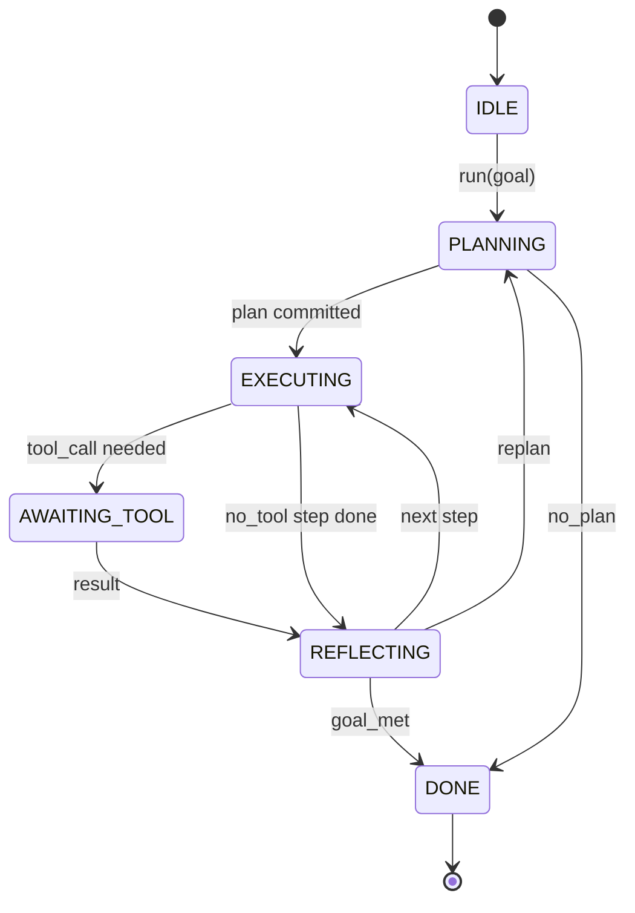

# عقد العميل " هيرنيس لوب "

> الحزام هو الوكيل، النموذج هو معالج، هذه الدروس تجمد عقد الحلقة يمكنك توصيل أي نموذج.

**Type:** Build
**Languages:** Python
**Prerequisites:** Phase 13 lessons 01-07, Phase 14 lesson 01
**Time:** ~90 minutes

## أهداف التعلم
- تحديد حلقة استغلال الوكيل كآلات حالة تحديدية مع انتقالات صريحة.
- تنفيذ عشر مواضيع معلقة دورة الحياة التي يستخدمها المشغلون في السياسة والمتسع والحراسة.
- حدد نقطتين للجذب حيث يعيد الحلقة السيطرة إلى المدعو ويستأنف على مدخل جديد.
- تنفيذ ميزانيات الجلسة الواحدة (التحولات، المكالمات الأداة، ساعة الحائط) دون تسريب حالة الجزئية عند تجاوزها.
- إصدار سلسلة من نوع الحدث المطبوعة من 11 نوع حتى يمكن للاتصالات المتداولة ومتعقبين الاشتراك دون تفتيش الحلقة مباشرة.

```figure
cf-loop-contract
```

## الإطار

وكيل التشفير الذي يعمل دون مراقبة لمدة أربعين جولة ليس حلول دردشة. إنه آلة حالة يمكن للمشغل اعتراض عقداتها والحواف التي يمكن للمشغل مراجعةها. بمجرد كتابة العقد ، يتوقف تبادل النماذج أو الأدوات أو السياسات عن أن يكون عاملًا. يصبح مكالمة تسجيل.

هذه الدروس تبني العقد. نسمي ستة دول، عشرة مواضيع الرمز، نقطة سحب اثنين، 11 نوع من الأحداث، ومغلفة ميزانية. كل شيء آخر في الحزمة (سجل الأدوات، نقل JSON-RPC، المرسل، المخطط) وصل إلى هذا الشكل.

## الولايات

الحلقة لديها ستة حالات، خمسة نشطة، واحدة هي نهاية.



`IDLE`هو نقطة دخول قانونية الوحيدة`DONE`هو الخروج القانوني الوحيد`AWAITING_TOOL`هي الحالة الوحيدة التي تنتج نقطة جذب. كل انتقال آخر داخلي.

آلة الحالة هي تحديدية. بالنظر إلى نفس سجل الأحداث، فإن الحافة تعود إلى نفس الحالة. هذه الممتلكة هي ما يسمح لك بإعادة تشغيل جلسات للتحليل دون إعادة استدعاء النموذج.

## الموضوعات المعلقة

المكعبات هي خياطة المشغل في الحلقة. يطلق الحزام عشرة مواضيع. يقبل كل موضوع أي عدد من المشتركين. يقوم المشتركون بإطلاق النار في ترتيب التسجيل. يمكن للمشترك تغيير الحمل المفيد، أو رفع لوقف التحول، أو إعادة حارس لتفوت الخطوة التالية.

```text
before_plan         after_plan
before_tool_call    after_tool_call
before_step         after_step
on_error
on_pause
on_budget_exceeded
on_complete
```

الشكل يعكس ما تجمع عليه كلود كود، كورسور، وOpenCode بحلول منتصف عام 2025 . الأسماء وظيفية، وليس علامة تجارية.`rm -rf`يعيش في`before_tool_call`. العنق الذي يُرسل فترة OpenTelemetry يعيش في`after_step`. المُربّط الذي يستأنف جلسة توقف يعيش في`on_pause`. . .

## نقاط السحب

الحلقة تُعطى التحكم مرتين`AWAITING_TOOL`عندما لا يمكن أن تتقدم دون نتيجة أداة.`on_pause`عندما يتم استنفاد الميزانية أو يطلب المُساعدة صراحة مراجعة بشرية.

نقطة السحب ليست استثناء إنها عودة، المُتصل يفتش حالة الحزام، ويحضر ما طلبه الحزام، ويتصل`resume(payload)`.الخطوط تتحمل حيث توقفت. هذا هو نفس الشكل مثل مولد Python. النقل عبر نقطة السحب هو اختيارك. في TUI هو المفاتيح. على MCP هو`tools/call`فوق صف، إنه استطلاع عمل

## سلسلة الأحداث

يرفع الحلقة الأحداث إلى سلسلة مدرجة في نقاط معينة في العقد. يتم إضافة التدفق فقط والمتمثلين يمكنهم إعادة تشغيلها من أي تعويض. أنواع الأحداث الـ11 المطبقة هي:

- `session.start`إصدار مرة واحدة عندما`run(goal)`يُدعى
- `plan.draft` يتم إصدارها عندما يعيد المخطط مسودة خطة
- `plan.commit` الصادر بعد أن يتم التزام مشروع الخطة النشطة
- `step.start` يتم إصدارها في بداية كل خطوة تنفيذية
- `step.end` يتم إصدارها في نهاية كل خطوة تنفيذية
- `tool.call` يتم إصدارها عندما تتيح خطوة تتطلب أداة التحكم للمدعو
- `tool.result` إصدار في سيرته الذاتية مع نتيجة أداة
- `tool.error` إصدار في سيرته الذاتية مع خطأ أو عندما يقطع الرابط المكالمة
- `budget.warn` يتم إصدارها عند الوصول إلى حد موازنة
- `session.pause` يتم إصدارها عندما يصل الحلقة إلى توقف (ميزانية أو خطوة)
- `session.complete` يتم إصدارها مرة واحدة عندما يصل الحلقة `DONE`

الأحداث لا تكرر حمولات الركبة. الحركات الضرورية (التغيير، الإجراءات المنسخة). الأحداث الملاحظة (الاستقبال، السفينة). تعاملها كحاملة.

## ملف الموازنة

في جلسة واحدة، هناك ثلاثة حدود. عدد الدوران، عدد الدعوات الأداة، ثواني الساعة الحائطية. كل دور يتحول من خلال واحد. كل دفة يدعو الدعوات الدعوات الأداة يدعو واحد. يتم التحقق من الساعة الحائطية في كل انتقال الحالة. عندما يتم الوصول إلى أي حد، يبدأ الحلقة في الإطلاق`on_budget_exceeded`، يُصدّر`budget.warn`، ثم الانتقال إلى`IDLE`مع سبب يتجاوز الميزانية في نقطة التقطير التالية.

الميزانية ليست مفاجأة، إنها عائدة، المُتصل يقرر ما إذا كان سيتم تمديد الميزانية و استئنافها، أو إنهاء الجلسة.

## ما لا يفعله هذا الدروس

لا يدعو نموذجًا، لا يسجل أدواتًا حقيقية، لا ينفذ نقلًا. هذه هي الدروس الأربعة التالية. هذه الدروس تُضبط العقد بحيث يمكن للأربعة التالية أن تتصل به دون إعادة الكتابة.

المخطط الحاسم في`main.py`هو بديل. يعيد خطة مدمجة بقوة من ثلاث خطوات، اثنان منها تتطلب نتيجة أداة. النقطة هي الحلقة، وليس الخطة.

## كيفية قراءة الرمز

`HarnessLoop`هو الطبقة الرئيسية، يحمل الحكومة، يحرق الركوب، ينشر الأحداث.`Budget`تتبع حدود`Event`هو الغلاف المخطط على التيار.`HookRegistry`هو طاولة الإرسال`_transition`هو الوظيفة الوحيدة التي تغير الحالة، لذلك آلة الحالة غير متغيرة يعيش في مكان واحد.

اقرأ`main.py`من أعلى إلى أسفل، ثم اقرأ`code/tests/test_loop.py`الاختبارات تحدد كل انتقال وكل ترتيب إطلاق الرماية

## الذهاب إلى أبعد

الجزء الأصعب من بناء الحزام في الإنتاج ليس آلة الدولة. إنه يجعل العقد قابلاً للتنفيذ. يجب أن يتجاوز العقد إعادة تحميل ساخن للمخطط. يجب أن يتجاوز أداة تعيد JSON غير مصممة. يجب أن يتجاوز خطوة ترتفع في`before_tool_call`في هذه الدروس، التجارب تمارس هذه الوضعات الفاشلة، تشغيلها، كسرها، إضافة الحالات.

في الدروس التالية يضاف سجل الأدوات بعد ذلك ، نقل JSON-RPC بعد ذلك ، المرسل. من الدروس الرابعة والعشرين ، فإن الحلقة في هذا الملف سوف تعمل خطة حقيقية ضد الأدوات الحقيقية مع ميزانيات حقيقية تطبق.
