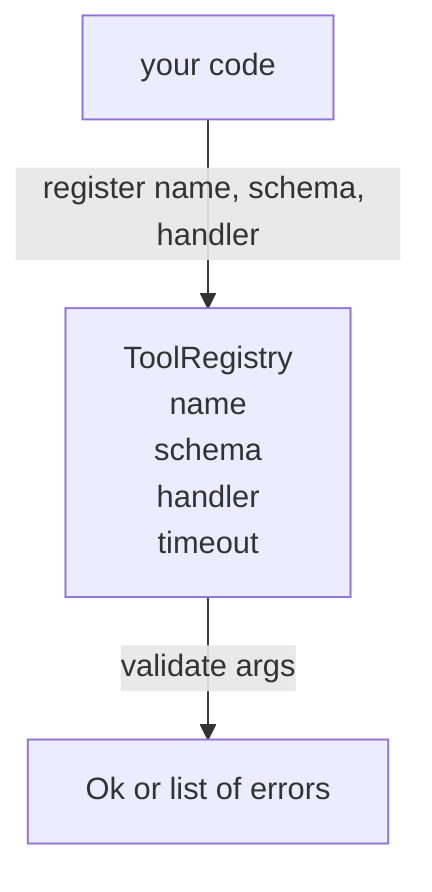

# سجل الأدوات مع تصحيح الخطة

> أداة لا يستطيع الوكيل التحقق منها هي أداة لا يستطيع الوكيل الاتصال بها. قم ببناء السجل ومحقق النظام قبل بناء الأدوات.

**Type:** Build
**Languages:** Python
**Prerequisites:** Phase 13 lessons 01-07, Phase 14 lesson 01
**Time:** ~90 minutes

## أهداف التعلم
- حافظ على سجل مدرج لسم الأداة → مخطط → المعاملة التي يمكن للمرسل أن يطلبها مرة واحدة وثق بها بعد ذلك.
- تنفيذ مجموعة فرعية من JSON Schema 2020-12 تغطي الكلمات الرئيسية التي يستخدمها تسعين في المئة من مكالمات الأداة.
- عودة دقيقة، مسارات الخطأ على شكل مؤشر json حتى يمكن للنموذج تصحيح الذات في رحلة ذهاب وجولة واحدة.
- رفض إعادة التسجيل دون إعادة التسجيل الصريحة، لأن الإعادة التسجيل الصامتة هي الطريقة التي تتحرك بها أسطوانات أدوات الإنتاج.
- حافظ على المحقق طاهراً (لا إدخال أو إدخال، لا وقت، لا عالمية) حتى يتم إعادة تشغيله على سجل إعادة التشغيل.

```figure
cf-registry-validate
```

## لماذا السجل يأتي قبل الأداة

وكيل التشفير في عام 2026 لديه أدوات مسجلة أكثر من ما يمكن أن يتناسب عليه النموذج في نافذة سياق واحدة. سيقوم الحزام غير المهم بتسجيل مائتي أداة وترتيب 10 إلى 40 في أي من التحولات. السجل هو مصدر الحقيقة "أي أدوات موجودة" "أي شكل تتخذ حججهم" و "أي عامل أدعوه". بمجرد أن يتم وضع هذه الإجابات الثلاثة، يمكن لبقية الحبل التوقف عن التخمين.

الخطأ الذي نتجنبه هو شحن المعاملين دون مخططات، أو شحن مخططات دون التحقق من التحقق. كلاهما شائع. كل منهما يحول الطبقة التالية (المبعوث في الدروس الثالثة والعشرين) إلى لعبة تخمين حيث أن وضع الفشل الوحيد هو آثار كومة من المعامل.

## ما الذي يبدو عليه سجل أداة

```text
ToolRecord
  name        : str          (unique, lowercase alphanumeric and underscore segments separated by dots, e.g., snake_case.segment.case)
  description : str          (one line, shown to the model)
  schema      : dict         (JSON Schema 2020-12 subset)
  handler     : Callable     (async or sync, returns Any)
  idempotent  : bool         (dispatcher uses this for retry decisions)
  timeout_ms  : int          (override per-tool dispatcher default)
```

النظام هو الحقل الوحيد الذي يلمسه المحقق. المعامل غير شفاف له. نحن نفصلهم عن قصد. النظام هو البيانات. المعامل هو الرمز. مزيجهم يُغريك لوضع منطق التحقق داخل المعامل، وهو الخطأ الذي نوقف.

## مجموعة فرعية من مخطط JSON 2020-12

المواصفات الكاملة لعام 2020-12 هي ورقة نحتاج إلى ثمانية كلمات رئيسية

```text
type           string / number / integer / boolean / object / array / null
properties     map of property name -> schema
required       list of property names
enum           list of allowed primitive values
minLength      integer, applies to strings
maxLength      integer, applies to strings
pattern        ECMA-262-compatible regex, applies to strings
items          schema applied to every array element
```

هذا يكفي لتغطية ما يحتاجه أداة API فعليا. الكلمات الرئيسية التي لا نضيفها (oneOf، anyOf، allOf، $ref، الشروط) صالحة في مخططات الإنتاج ولكن تحويل المحقق إلى مشاة شجرة مع دورات. نحن نبني سجل، وليس محرك مخطط JSON.

## مسارات الخطأ Json المؤشر

عندما تفشل التحقق، يعيد المؤكد قائمة الأخطاء. كل خطأ يحمل مسار json-pointer إلى المدخل. المؤشر هو تسلسل مسجل من أسماء الممتلكات ومؤشرات الترتيب.

```text
{"a": {"b": [1, 2, "x"]}}
                    ^
                    /a/b/2
```

النموذج يقرأ مسارات الخطأ بشكل أفضل من أنه يقرأ الجمل. إذا كانت النموذج تتطلب `args.user.email`والنموذج قد تجاوز عدد كامل، يجب أن يكون الخطأ`/user/email`مع`expected_type: string`النموذج يصلح ذلك في المكالمة التالية دون جولة من اللغة الطبيعية.

## التسجيل والإلغاء

`register(name, schema, handler, **opts)`يرفض إعادة التسجيل بطبيعة الحال.`override=True`هذا هو النظافة التشغيلية، جزءان من قاعدة الشفرة يسجلون صامتًا نفس اسم الأداة هو نوع الحذاء الذي يستغرق أسبوعًا للعثور عليه في الإنتاج.

السجل يضع ثلاثة طرق قراءة.`get(name)`يعيد السجل أو يرفع. `validate(name, args)`يعود رقم `Ok`أو قائمة بالخطأ`names()`يعيد أسماء الأدوات في ترتيب التسجيل.

## ما هو المحقق والذي ليس

إنها مرّة واحدة على شجرة النظام، استمرارية. إنها نقية. لا تدعو المعاملين. لا تفرض أنواع (سلسلة `"42"`لا يمر مخطط رقم) لا يختصر بصمت.

لا يعد هذا حدود أمنية. يمكن للمسؤول الخبيث أن يتصرف بشكل خاطئ بعد مرور التحقق. يقوم المرسل في الدروس الثالثة والعشرين بإضافة وقت وقف وقوف الأمن وطبقات مربع الرمل. يضيف السجل الشكل.

## الشكل



## كيفية قراءة الرمز

`code/main.py`يحدد`ToolRegistry`،`ToolRecord`،`ValidationError`و 8 وظائف المحقق.`schema["type"]`(أو يعالج مخطط مع `enum`كل مؤكدة النوع تعيد إما قائمة فارغة أو قائمة `ValidationError`المشي على المستوى الأعلى يجمع الخطأ ويقوم بتعديل قطاعات المسار أثناء هبوطها

`code/tests/test_registry.py`تغطي تسجيل، وإلغاء، نجاح التحقق من التحقق من التحقق من التحقق من التحقق من التحقق من التحقق من التحقق من التحقق من التحقق من التحقق من التحقق من التحقق من التحقق من التحقق من التحقق من التحقق من التحقق من التحقق من التحقق من التحقق من التحقق من التحقق من التحقق من التحقق من التحقق من التحقق من التحقق من التحقق من التحقق من التحقق من التحقق من التحقق من التحقق من التحقق من التحقق من التحقق من التحقق من التحقق من التحقق من التحقق من التحقق من التحقق من التحقق من التحقق من التحقق من التحقق من التحقق من التحقق من التحقق من التحقق من التحقق من التحقق من التحقق من التحقق من التحقق من التحقق من التحقق من التحقق من التحقق من التحقق من التحقق من التحقق من التحقق من التحقق.

## الذهاب إلى أبعد

الإضافات التي ستحتاجها بمجرد أن تصل هذه الدروس`$ref`القرار ضد كتلة تعريفات محلية، و`additionalProperties: false`كلاهما صغير. كلاهما شائع في إضافة كتالوج الأدوات ينمو أكثر من خمسين أداة. تركناها خارج الدروس للحفاظ على الملف تحت قراءة واحدة.

الدرس التالي (العشرين) يبني نقل JSON-RPC استوديو الذي يظهر هذا السجل إلى عميل نموذج. الدرس بعد (الثلاثة وعشرين) يلف كل من وراء جهاز إرسال مع التوقيت والإعادة التجربة.
