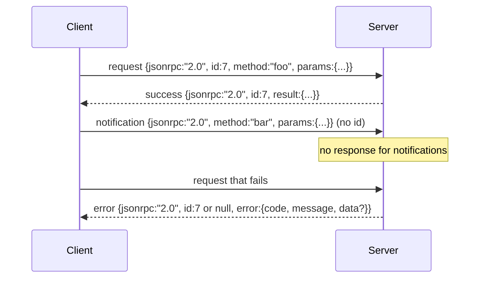

# JSON-RPC 2.0 فوق Newline-Delimited Stdio

> النقل بين العميل النموذجي وخادم الأدوات هو JSON-RPC عبر stdio. التدحرج يدويا مرة واحدة يعلمك ما كل طبقة الإطار يدفع.

**Type:** Build
**Languages:** Python
**Prerequisites:** Phase 13 lessons 01-07, Phase 14 lesson 01
**Time:** ~90 minutes

## أهداف التعلم
- تحدث JSON-RPC 2.0 في إطار ك JSON محدد خط جديد على stdin و stdout.
- خريطة خمسة رموز الخطأ القياسية (-32700، -32600، -32601، -32602، -32603) ورفعها مع التعبير الصحيح.
- تمييز الطلبات والردود والإشعارات واللويات دون اختراع مفتاحات غلاف جديدة.
- إدارة خطأ تحليل واحد لكل خط دون تسمم بقية التيار.
- بناء التجربة الذاتية القضاء على استخدام io.BytesIO حتى يتم الدروس دون إنجاب عملية الطفل.

```figure
cf-jsonrpc-frames
```

## لماذا تظل JSON-RPC اللغة الافريقية

وكيل برمجة في عام 2026 يتحدث إلى ربما اثني عشر خوادم أداة في جلسة واحدة. كل خادم هو عملية منفصلة أو نقطة نهاية بعيدة. إن شكل الأسلاك هو نفسه منذ عام 2013. JSON-RPC 2.0 هو تصنيف صفحتين. إنه يبقى قائماً لأن البدائل (gRPC ، HTTP لكل مكالمة ، ثنائي مخصص) جميعها تفرض تعديلاً على JSON-RPC لا: فإنها تختار إما التدفق أو التجميع أو توصيل النقل. JSON-RPC متماثل عبر stdio، sockets، websockets، و HTTP، ويمكن للعميل تشغيل خادم لم يسبق له أن رأى إذا كلاهما احترام المواصفات.

هذا الدروس يبني التنوع ستديو. خط جديد محدد JSON. كل طلب هو سطر واحد. كل رد هو سطر واحد. الحدود النقل هي `\n`. . .

## شكل الأسلاك

هناك أربع أشكال من الغلافات، اثنان يتحدثها العميل، اثنان يتحدثها الخادم.



الإخطار لا يحتوي على`id`. لا يجب أن يستجيب الخادم لذلك. إذا كان الخادم يعيد استجابة لإخطار، لا يمكن للعميل ربطها بموقع مكالمة. هذه القاعدة الوحيدة تبقي إطار الرياضيات بسيطة.

المجموعة هي مجموعة من الطلبات أو الإشعارات JSON. يستجيب الخادم بمجموعة من الردود ، في أي ترتيب ، واحدة لكل إدخال غير إخطار. إذا كان كل إدخال في المجموعة إخطارًا ، فإن الخادم لا يرسل أي شيء مرة أخرى.

## رموز الخطأ الخمسة

```text
-32700  Parse error      JSON could not be parsed
-32600  Invalid Request  Envelope shape is wrong
-32601  Method not found
-32602  Invalid params
-32603  Internal error
```

يتم احتفاظ الرموز بين -32000 و -32099 للخطأ المحدد من قبل الخادم. كل شيء آخر هو المحدد من قبل التطبيق. الدروس يلتصق إلى الخمسة. إذا رفع المعامل الخاص بك، فإن النقل يلفه ك -32603 مع اسم الفصل باستثناء في `data.exception`. . .

خطأ تحليل لديه قاعدة خاصة`id`في الإجابة هي`null`، لأن الطلب لم يتم تحليله بما فيه الكفاية لإستخراج هوية

## الإطار الجديد و التجربة BytesIO

يقرأ النقل خط واحد في كل مرة. خط هو بايت حتى و بما في ذلك `\n`إذا لم يتم تحليل خط، فإن النقل يكتب رد -32700 مع `id: null`و يستمر، الجدول غير مسموم، والخط التالي يتم تحليله طازج

للدرس نُغلفُ a `io.BytesIO`يقرأ الخادم الطلبات حتى EOF ، ويكتب الردود لكل منها ، ويرد. يقرأ العميل الردود مرة أخرى. لا توجد عملية إنجاب. لا توجد وقت. سلوك النقل هو نفسه من أنابيب فرعية عملية حقيقية لأن Python `io`واجهة تعرض نفسها `.readline()`و`.write()`العقد

## طريقة إرسال

النقل لا يعرف أي طرق موجودة، إنه يقدم إلى مكالمة`handler(method, params)`يرد المدير نتيجة أو يرفع ثلاثة فئات استثناءات على سطح رموز محددة

```text
MethodNotFound -> -32601
InvalidParams  -> -32602
Anything else  -> -32603 with exception name in data
```

لن يرى النقل سجل أدوات. السجل يجلس خلف المدير. هذا هو الطبقة التي نريدها. النقل يتحدث JSON-RPC. السجل يتحدث أشكال الأدوات. المرسل (المدرس الثالث والعشرين) يطويها معا.

## سلوك التدفق على الأخطاء

```text
client writes              server reads             server writes
---------------            -----------              -------------
{...valid request...}      parses ok                {...response, id matches...}
{...broken json...         parse fails              {id:null, error: -32700}
{...valid request...}      parses ok                {...response, id matches...}
{...missing method...}     invalid envelope         {id:X, error: -32600}
```

خط JSON مكسور لا يوقف الحلقة.`method`الحقل لا يوقف الحلقة. استثناء المعامل لا يوقف الحلقة. النقل يستمر في القراءة حتى EOF.

## الإخطارات والتدفقات غير المتكافئة

إشعار هو النار ونسيان. يستخدم الحزم إشعارات لأحداث التقدم وإشارات إلغاء، وخطوط السجل. الإشعارات هي كيفية إشعاع أداة طويلة المدى تحديثات الحالة دون التجول حول كل واحد.

الدروس تنفيذ مساعد إخطار خارجي واحد، `write_notification`يستخدم الخادمها لإصدار تقدم أثناء قيام طلب في الطيران. يظهر التجربة النمط: يتم إدخال طلب، ويعطي المدير إشعارات تقدم اثنتين، ثم يكتب الرد النهائي.

## كيفية قراءة الرمز

`code/main.py`يحدد`StdioTransport`، مساعد البحث (`parse_request`(), المساعدين الثلاثة في الكتابة (`write_response`،`write_error`،`write_notification`), و حلقة الإرسال `serve`. ثوابت رمز الخطأ تعيش في نطاق الوحدة.

`code/tests/test_transport.py`تغطي رموز الخطأ الخمسة، والإشعارات (لا يوجد رد مكتوب) ، واللويات (مجموعة داخل، صف خارج، تخطي الإشعارات) ، والجسر JSON (خطأ البحث ثم يستمر) ، والدفق غير المتناظر حيث يكتب المعامل إشعارا في منتصف المكالمة.

## الذهاب إلى أبعد

هذه النقلة تكفي للدرس التالي. النقل الإنتاجية يضيف ثلاثة أشياء.`id`هذا بالفعل، ولكن في شبكة تحتاج أيضا إلى هوية تعقب خارجي. قناة إلغاء (إخطار مثل `$/cancelRequest`ومدفوعة اليد من نوع المحتوى للتفاوض حتى يمكن أن تتحدث نفس المقبض JSON-RPC و Streamable HTTP. لا أحد من هؤلاء يغير الأسلاك. يضيفون البيانات المعدنية.
