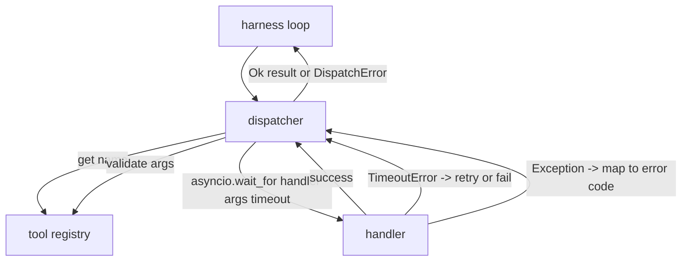
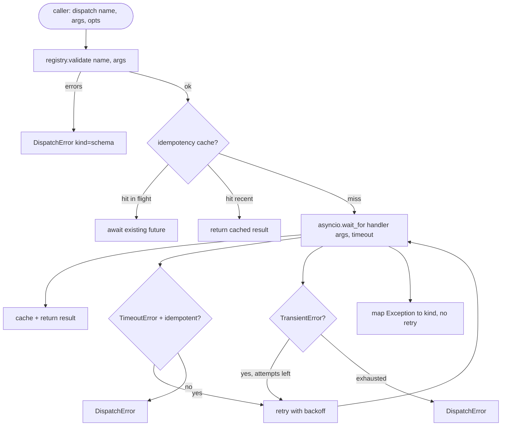

# جهاز مكالمة الوظيفة

> المُرسل هو المكان الذي يدفع فيه الحزام لكل وعدٍ قام به النظام التوقيت، التجربة، التخفيض، خريطة الخطأ، كلّه على خطّة واحدة

**Type:** Build
**Languages:** Python
**Prerequisites:** Phase 13 lessons 01-07, Phase 14 lesson 01
**Time:** ~90 minutes

## أهداف التعلم
- إغلف معالج الأدوات في وقت وقف لكل مكالمة يعيد خطأ منخفض بدلاً من تعليق الحلقة.
- تطبيق تعريفي إعادة محاولة الردع مع الارتباك والحد الأقصى عدد المحاولات.
- حاولت إعادة التكرار على مفتاح الاختلاف حتى لا تجري محاولة إعادة السباقات التي تمارس بطيئة الأصلية مرتين.
- استثناءات معالج الخرائط والخطأ النقل على غلاف خطأ واحد حلقة الحزام يفهم بالفعل.
- التسليم المتوازي المحدود مع حد التزامن بحيث أن إشعال من أربعين مكالمة أداة لا ينفذ حلقة الحدث.

```figure
cf-dispatch-retry
```

## حيث يجلس المرسل

بين حلقة الحرف (المرحلة العشرين) و سجل الأدوات (المرحلة العشرين و واحد). يقوم النقل (المرحلة العشرين و اثنين) بإغذاء الحلقة. يقدم الحلقة مكالمة أدوات إلى المرسل. يقوم المرسل بالاتصال إلى السجل، ويجري تشغيل المعاملة، ويرد إما نتيجة أو غلاف خطأ على شكل JSON-RPC.



الجهاز المُبعث هو الطبقة الوحيدة التي تعرف عن التوقيتات، والإعادة التجربة، والإعفاء. الحلقة لا تعرف. السجل لا يعرف. المُعامل لا يعرف. هذا العزل هو النقطة.

## توقيت المدة

كل أداة لديها وقت استغناء افتراضي. سجل السجل يحمل `timeout_ms`المُرسل يُغلبها من إغلاق مكالمة عندما يمر الحزام واحد`asyncio.wait_for`في وقت وقف، يتم إلغاء مهمة المدير والرئيس العائد`DispatchError(kind="timeout")`. . .

إن التوقف ليس خطأ قابل للتحويل افتراضي للأدوات غير ذات القدرة على التأثير.`db.write`و قد يكون قد ارتكب أو لم يرتكب ذلك، و قد يكون محاولة إعادة التأهيل تكرر الكتابة.`idempotent`العلامة من سجل السجل أدوات غير قادرة على المحاولة مرة أخرى أدوات غير قادرة على المحاولة

## التجربة المُرجعة مع التخلف المتعرض

سياسة إعادة المحاولة ثلاث محاولات أقصى.

```text
attempt 1  -> delay 0
attempt 2  -> delay 0.1s * (1 + random[0..0.5])
attempt 3  -> delay 0.4s * (1 + random[0..0.5])
```

فقط`timeout`و`transient`الخطأ حاول مرة أخرى.`schema`خطأ،`not_found`أو`internal`خطأ لا يحاول مرة أخرى. أخطاء الخطة هي تحديدية. لا تغير التجربة مرة أخرى النتيجة وتحرق الميزانية.

حلقة إعادة المحاولة تحترم الميزانية من الحزمة. إذا كان ميزانية المدعو صفر مكالمات الأداة المتبقية، فإن المرسل يفشل بسرعة في المحاولة الأولى ويسترجع `kind="budget_exceeded"`. . .

## مفتاح الاختفاء

محاولة إعادة إطلاق النار بينما الأصلي لا يزال في الطيران هو خطأ إنتاج حقيقي. الدعوة الأولى تعلق في أربعة نقاط تسعة ثواني (بعد فترة وقف الوقت مباشرة).`payments.charge`لقد قمت بتحميل مرتين

المُرسل يقبل إختياريّة`idempotency_key`إذا كان نفس المفتاح في الطيران عند وصول مكالمة، ينتظر المرسل المستقبل في الطيران ويرد نتيجه. الاحتفاظ بالمفتاح لمدة ستين ثانية بعد الانتهاء لتستيعاب التجربات المتأخرة.

المفتاح هو مسؤولية المُتصل، الحزام يستخرجها من المخطط:`f"{step_id}:{tool_name}:{hash(args)}"`. لا يخترع المرسل المفاتيح، لأن استنباط مفتاح من الحجج وحدها يجعل مكالمات مختلفة من الناحية الدلوية تبدو نفسها.

## غلاف الخطأ

إرسال فشل يعيد شكل واحد

```text
DispatchError
  kind        : "timeout" | "transient" | "schema" | "not_found" | "internal" | "budget_exceeded"
  message     : str
  attempts    : int
  jsonrpc_code: int   (one of -32601, -32602, -32603)
```

خرائط حلقة الحزام`kind`إلى الولاية التالية`schema`و`not_found`اذهب إلى`on_error`و تُفعّل إعادة التخطيط`timeout`و`transient`اذهب إلى`on_error`و قد يستعيد أو لا يستعيد حسب المحاولات`budget_exceeded`محفزات`on_budget_exceeded`. . .

## حد التنافسية على المروحة

`gather(*calls)`يعمل جميع التشغيلات في وقت واحد. مع أربعين مكالمة أداة، وهذا هو أربعين مصدر مفتوح أو أربعين أنابيب فرعية العملية. معظم الخلفيات لا تحب أربعين اتصال متوازي من عميل واحد.

المُرسل يُغلف`gather`في جهاز التشغيل. الحد الافتراضي المتزامن هو ثمانية. كل مكالمة اكتسب جهاز التشغيل قبل إرسالها وتطلق عند الانتهاء.`gather`-المخرجات ذات الشكل ولكن الجدول المحدد

## التدفق لمكالمة واحدة



## كيفية قراءة الرمز

`code/main.py`يحدد`Dispatcher`،`DispatchError`و`TransientError`.المرسل يأخذ سجل على البناء .التزام الموافقة`dispatch(name, args, ...)`هي نقطة دخول الوحيدة. يتم تطبيق توقيتات لكل محاولة داخل الخط`_run_with_retries`استخدام `asyncio.wait_for`. .`gather_bounded(calls)`يدير العديد من الرسائل مع الحد المتزامن.

`code/tests/test_dispatcher.py`تغطي إطلاق وقت وقف، وإعادة المحاولة على الخطأ المتجاري، وعدم إعادة المحاولة على خطأ مخطط، وتخفيض القدرة على الاستخدام (مكالمتين متزامنين مع انهيار نفس المفتاح إلى استدعاء واحد للمعامل) ، وتقييد التزامن (المركز في العمل).

الاختبارات تستخدم`asyncio.sleep(0)`و تحديدية`Counter`-المعالجة القائمة على المعدات، بحيث أنهيتها في ملايين الثانية ولا تعتمد على توقيت الساعة الحائطية.

## الذهاب إلى أبعد

إضافة إضافيتين إضافيتين إضافيتين إضافيتين إضافيتين إضافيتين إضافيتين إضافيتين إضافيتين إضافيتين إضافيتين إضافيتين إضافيتين إضافيتين إضافيتين إضافيتين إضافيتين إضافيتين إضافيتين إضافيتين إضافيتين إضافيتين إضافيتين إضافيتين إضافيتين إضافيتين إضافيتين إضافيتين إضافيتين إضافيتين إضافيتين إضافيتين إضافيتين إضافات إضافيتين إضافات إضافات إضافات إضافات إضافات إضافات إضافات إضافات إضافات إضافات إضافات إضافات إضافات إضافات إضافات إضافات إضافات إضافات إضافات إضافات إضافات إضافات إضافات إضافات إضافات إضافات إضافات إضافات إضافات إضافات إضافات إضافات إضافات إضافات إضافات إضافات إضافات إضافات إضافات إضافات إضافات إضافات إضافات إضافات إضافات إضافات إضافات إضافات إضافات إضافات إضافات إضافات إضافات إضافات إضافات إضافات إضافات إضافات إضافات إضافات إضافات إضافات إضافات إضافات إضافات إضافات إضافات إضافات إضافات إضافات إضافات إضافات إضافات إضافات إضافات إضافات إضافات إضافات إضافات إضافات إضافات إضافات إضافات إ`dispatch.attempt`و`dispatch.retry`حدث) ، ثانيا، قطع الدوائر: بعد فشل N في نافذة، يحصل الأداة على فترة تبريد حيث العثورات تعود على الفور مع `kind="circuit_open"`كلاً منهما يتناسب على هذا المُرسل دون تغيير العقد

الدرس 24 يعلق المُرسل إلى عميل خطط و تنفيذ حتى ترى جميع الأجزاء الأربعة في حركة.
